## Plan para hoy

### Primer bloque

- Presentación equipo docente
- Programa
- CT: Mapas y realidades

### Segundo bloque

- CT: La encrucijada de la insustentabilidad
- A&R: Mapas y sustentabilidad
- Instalar QGIS!

# Equipo Docente {.section-slide background-color="#2a7f62"}

## Felipe Jordán, Ph.D.

::: {.two-level}
- Ingeniería Comercial con mención en economía, Universidad de Chile
- Ph.D. Political Economy and Government, Harvard University
- Profesor asistente con jornada compartida entre Instituto de Economía e Instituto para el Desarrollo Sustentable, PUC
- Área de interés:
  - Desarrollo sostenible en territorios rurales de Latino América (foco en Pueblo Mapuche)
  - Determinantes de deforestación, a escala global y local
:::

---

## Chrystian Mendez Acosta

::: columns
::: {.column width="65%"}
::: {.two-level}
- Estudiante ingeniería en recursos naturales
- Área de investigación:
  - Estudio de glaciares mediante imágenes satelitales
  - Macroplásticos y ribera del río
  - Sustentabilidad
:::
:::
::: {.column width="33%"}
{width="100%"}
:::
:::

---

## Santiago Sánchez Domínguez

::: columns
::: {.column width="65%"}
::: {.two-level}
- Estudiante de Geografía UC, cuarto año
- Área de investigación:
  - Geomática y Sistemas de Información Geográfica
  - Interacción atmósfera-biósfera en la zona central y norte de Chile
  - Estrategias de planificación territorial orientadas a la sustentabilidad y desarrollo sostenible
:::
:::
::: {.column width="33%"}
{width="100%"}
:::
:::

# Programa {.section-slide background-color="#2a7f62"}

## Objetivo del curso

Introducir temáticas y conceptos relevantes para comprender y abordar los desafíos socioambientales actuales, a través de la elaboración de mapas en QGIS que permitan apreciar cómo las Tecnologías de Mapeo permiten estudiar y gestionar dichos desafíos.

---

## Sobre el curso

- El curso **no requiere conocimientos previos** de QGIS
- A lo largo del semestre desarrollarán las herramientas básicas para usar QGIS
- Este no es un curso especializado de SIG, ni tampoco comprehensivo en desarrollo sustentable
- El curso busca un **balance** entre el desarrollo de QGIS como herramienta y su aplicación a temáticas de sustentabilidad

---

## Estructura — Unidad 1

::: {.two-level}
- **Unidad 1: La (in)sustentabilidad a través de QGIS**
  - 9 al 30 de marzo — 4 clases
  - Fundamentos de SIG e introducción a QGIS
  - Temáticas: Justicia ambiental; local y global
:::

---

## Estructura — Unidad 2

::: {.two-level}
- **Unidad 2: Datos vectoriales**
  - 6 de abril — 11 de mayo — 5 clases
  - Visualización y operaciones con datos vectoriales
  - Temáticas: Minería, deforestación, recursos marinos
:::

---

## Estructura — Unidad 3

::: {.two-level}
- **Unidad 3: Datos raster y teledetección**
  - 11 de mayo — 15 de junio — 5 clases
  - Visualización y operaciones con datos raster
  - Temáticas: Isla de calor, plantaciones de monocultivo
:::

---

## Evaluaciones — Trabajo semestral (35%) {.compact}

::: {.two-level}
- Grupos de 4–5 estudiantes, conformados aleatoriamente
- Cada grupo seleccionará un **territorio** y analizará un **problema socioambiental**
- **Entrega intermedia (40%) — Seleccionar, investigar y planificar**
  - Definir el territorio y el problema socioambiental
  - Investigar cómo se manifiesta espacialmente y cómo afecta a las personas
  - Presentar bosquejo de uno o más mapas, indicando capas y fuentes de datos
- **Entrega final (60%) — Mapear y contar**
  - Elaborar un poster donde los mapas sean protagonistas
  - Texto breve (≈250 palabras) que contextualice los mapas
  - Presentación del poster en feria final (5 minutos por grupo)
:::

---

## Evaluaciones — Portafolio (45%) {.compact}

::: {.two-level}
- Tres entregas, una al final de cada unidad
- Cada entrega incluye:
- **Mapas (60%)**
  - Presentar dos mapas desarrollados en los talleres de la unidad
  - Deben ser autocontenidos (título, leyenda, escala, fuente, etc.)
  - Se espera que incluyan decisiones propias de diseño cartográfico
- **Ensayo analítico (40%)**
  - Ensayo de 750–1.250 palabras basado en uno de los mapas
  - Debe analizar el fenómeno territorial representado, no solo describirlo
  - Debe conectar el mapa con conceptos vistos en clase y al menos dos referencias académicas
:::

---

## Evaluaciones — Tickets de entrada (20%) {.compact}

::: {.two-level}
- En cada clase se realizará una evaluación breve:
  - 1 pregunta sobre la lectura asignada o la clase anterior
  - 3 minutos para responder
- **Escala de evaluación**
  - 7,0 → respuesta correcta
  - 4,0 → respuesta incorrecta
  - 1,0 → ausente
- **Nota final**
  - Promedio de los tickets del semestre
  - Se pueden eliminar las 5 notas más bajas si se asiste al menos a 11 sesiones
:::

---

## Ticket de Entrada (prueba) {.question-slide}

¿De qué color era el caballo blanco de Napoleón?

- b) Rojo
- d) Blanco
- h) Negro
- i) Multicolor

---

## Cátedras, Talleres y Ayudantías

Cada semana está estructurada de la siguiente forma:

- **Lunes bloque 4:** Cátedra 1
- **Lunes bloque 5:** Cátedra 2
- **Lunes siguiente, bloque 3:** Taller resolución guía *(comienza el lunes 23)*

---

## Política de IA

::: {.two-level}
- El uso de Inteligencia Artificial Generativa (IAG) **está permitido** en el curso
- Puede utilizarse para explorar ideas, apoyar el análisis o mejorar la redacción
- El trabajo final debe reflejar **elaboración intelectual propia**
- Debe **declararse** si se utilizó IAG y para qué fines
- El estudiante es **responsable** del contenido entregado
:::

# CT: Mapas y Realidades {.section-slide background-color="#2a7f62"}

## Los primeros mapas {.map-slide}

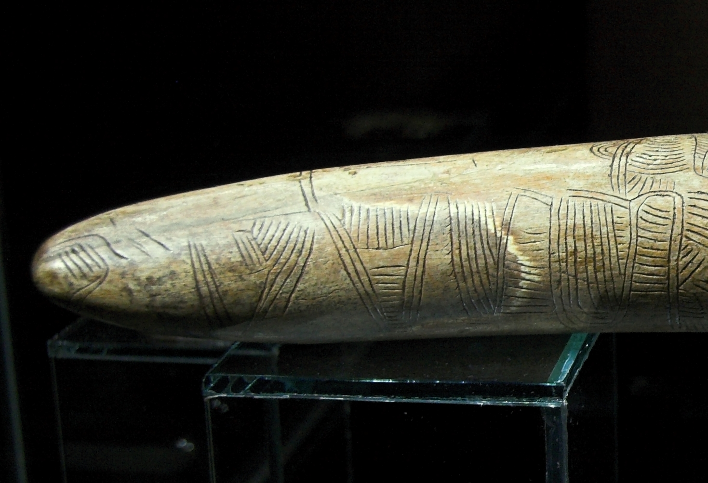{width="70%"}

::: {.caption}
Los humanos han representado la realidad física que habitan desde tiempos inmemoriales. Ríos, montañas y rutas grabados en un colmillo de Mamut — ~25.000 AC, Rep. Checa.
:::

---

## Matemáticas para cuantificar el espacio {.map-slide}

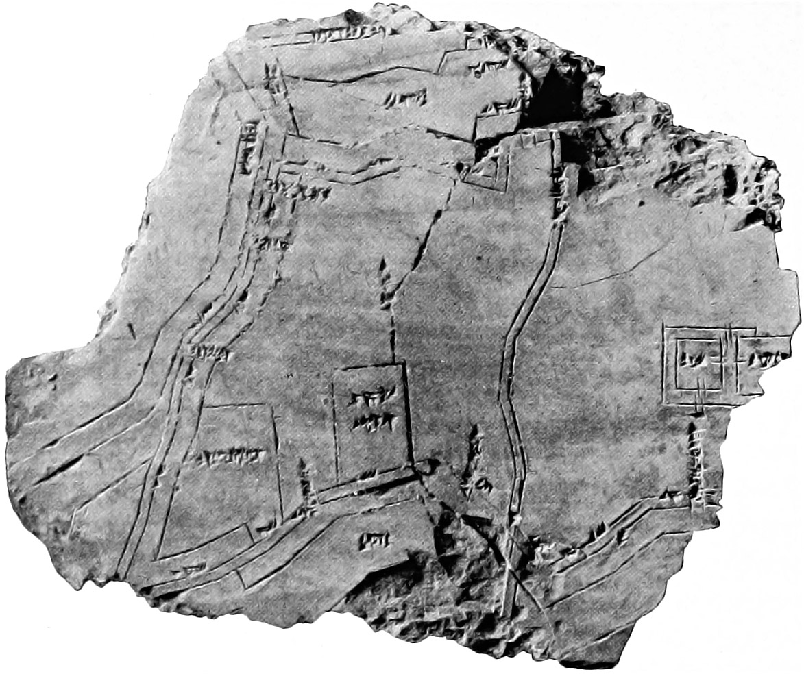{width="65%"}

::: {.caption}
Los mapas del reino de Babilonia despliegan el uso de matemáticas para cuantificar el espacio. Ciudad de Nippur en tableta de arcilla — ~1.400 AC, Babilonia.
:::

---

## El primer mapa mundi {.map-slide}

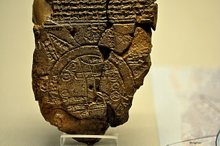{width="65%"}

::: {.caption}
El primer mapa mundi es atribuido al reino de Babilonia, expresando su visión política del mundo. Mapa Mundi Babilonia — ~600 AC.
:::

---

## Los mapas representan la realidad… {.map-slide}

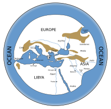{width="65%"}

::: {.caption}
Reconstrucción del mapa de Hecataeus de Miletus — ~500 AC.
:::

---

## Instrumentos de navegación → mapas más precisos

::: columns
::: {.column width="33%"}
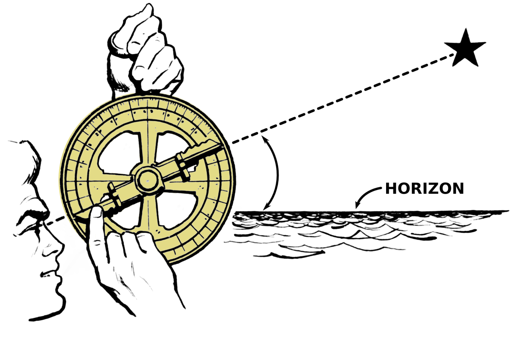{width="100%"}
:::
::: {.column width="33%"}
{width="100%"}
:::
::: {.column width="33%"}
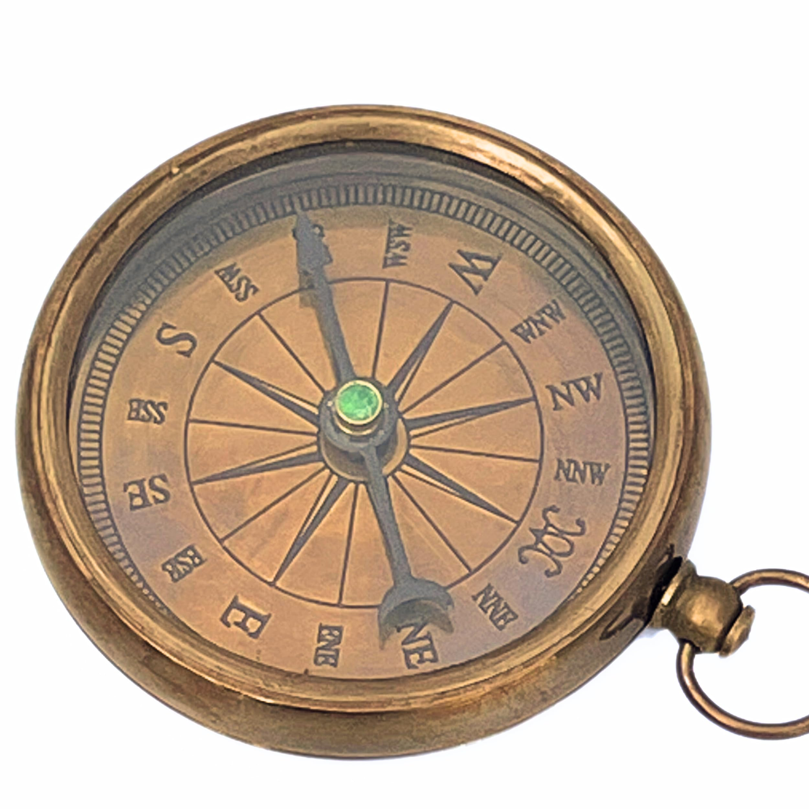{width="100%"}
:::
:::

::: {.caption}
El desarrollo de instrumentos de navegación permitió generar mapas cada vez más precisos.
:::

---

## …pero los mapas también **construyen** realidades {.map-slide}

{width="65%"}

::: {.caption}
Ebstorf Mappa Mundi — 1235 DC.
:::

---

## ¿Qué les llama la atención del "típico" mapa mundi? {.question-slide}

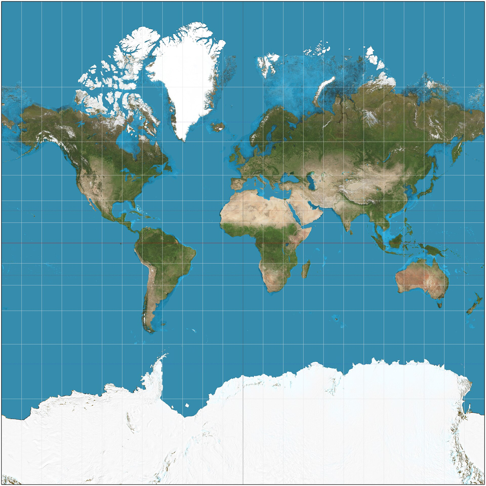{width="70%"}

---

## ¿Por qué no al revés? {.question-slide}

{width="70%"}

---

## ¿Quién va al centro? {.question-slide}

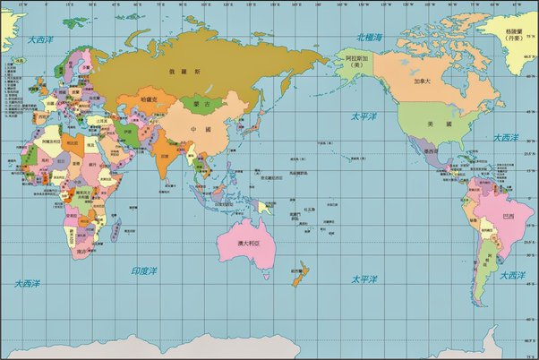{width="70%"}

# CT: La Encrucijada de la Insustentabilidad {.section-slide background-color="#2a7f62"}

## Algo cambió en el Siglo XIX

- Hemos explotado los recursos naturales y dispuesto nuestros desechos en el medio ambiente desde tiempos inmemoriales
- Pero algo cambió en el Siglo XIX

---

## La revolución científica e industrial {.map-slide}

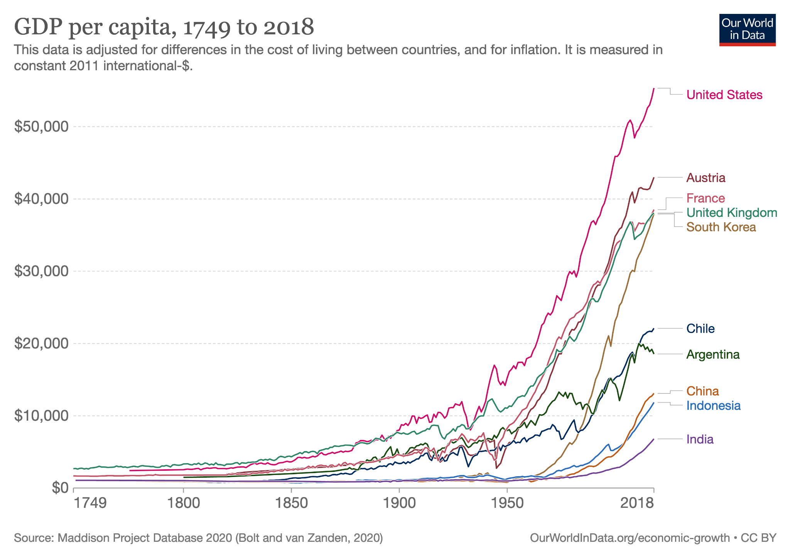{width="80%"}

::: {.caption}
Las revoluciones científica e industrial cambiaron nuestra relación con el mundo natural, aumentando nuestra población y producción a un nivel sin precedentes.
:::

---

## Crecimiento sin precedentes {.map-slide}

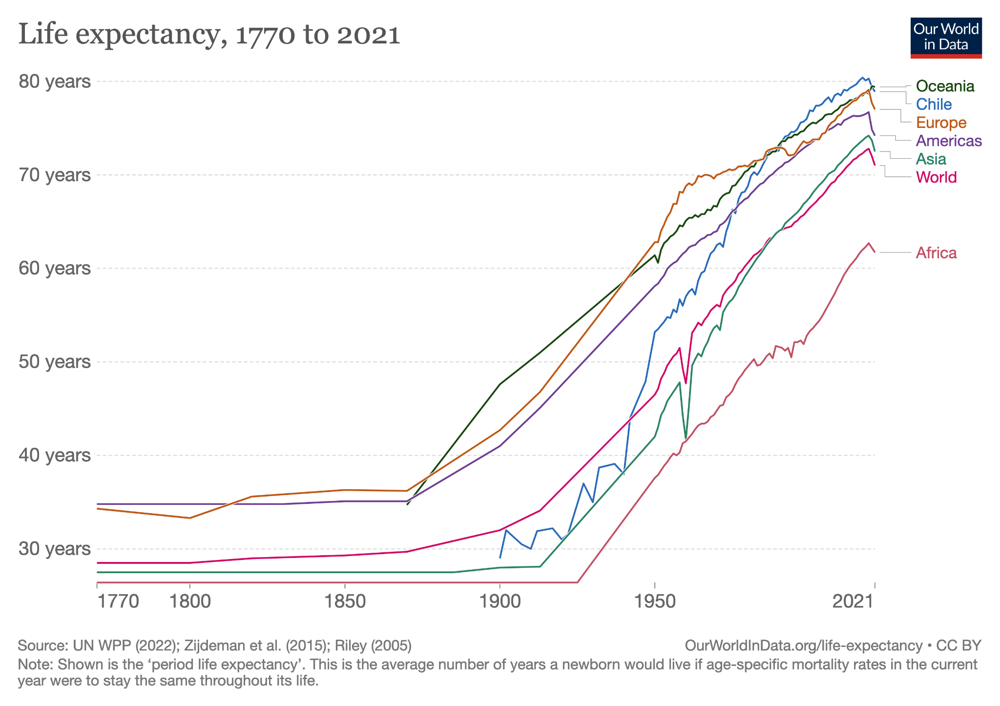{width="80%"}

::: {.caption}
Aumento exponencial de la población y la producción desde la Revolución Industrial.
:::

---

## Mejorando las condiciones de vida {.map-slide}

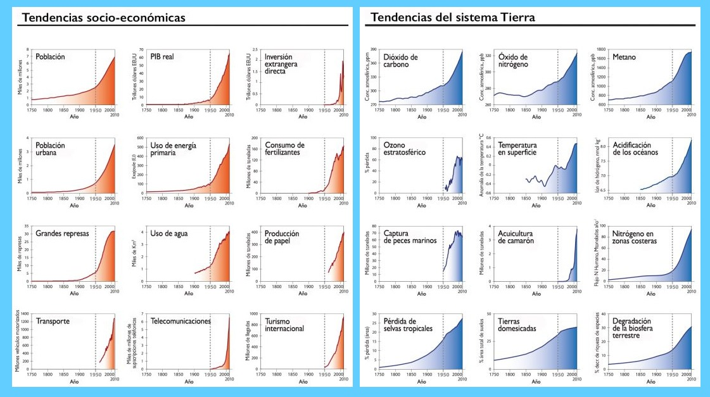{width="80%"}

::: {.caption}
El crecimiento económico mejoró las condiciones de vida promedio de la población.
:::

---

## El costo: deterioro del sistema natural {.map-slide}

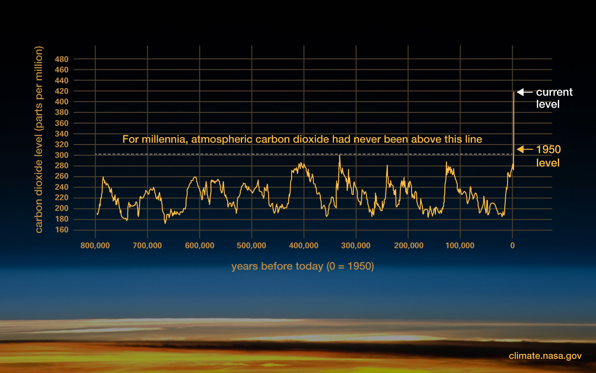{width="80%"}

::: {.caption}
Sin embargo, el crecimiento demográfico y económico exponencial ha sido acompañado por un deterioro exponencial del sistema natural que nos soporta.
:::

---

## El Antropoceno {.map-slide}

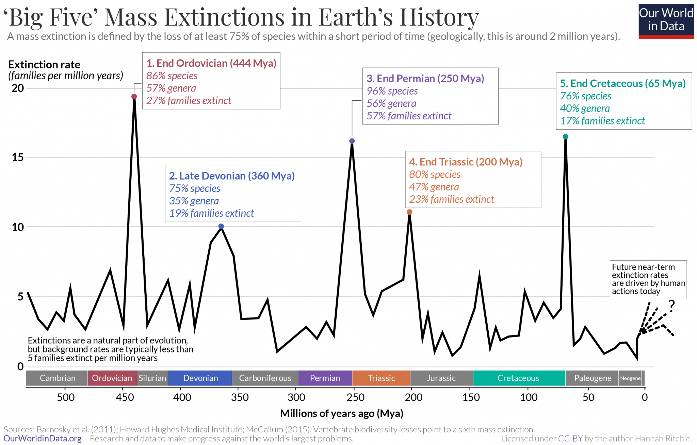{width="80%"}

::: {.caption}
El impacto de la modernidad sobre el planeta ha sido tan profundo que merece una nueva era geológica: el Antropoceno.
:::

---

## Límites planetarios

- La comunidad científica ha convergido a un consenso respecto a la existencia de **Límites Planetarios**
- …que no responden a leyes humanas, sino que a la inexorable finitud de nuestro único hogar: La Tierra

---

## Límites planetarios {.map-slide}

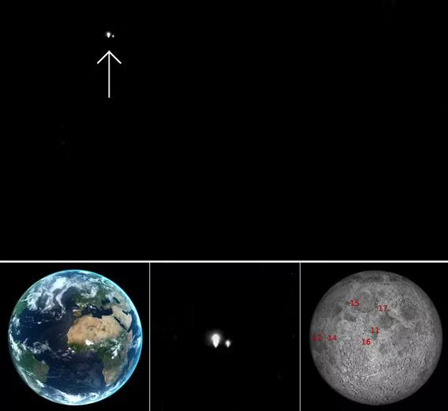{width="85%"}

---

## Los 9 límites planetarios {.map-slide}

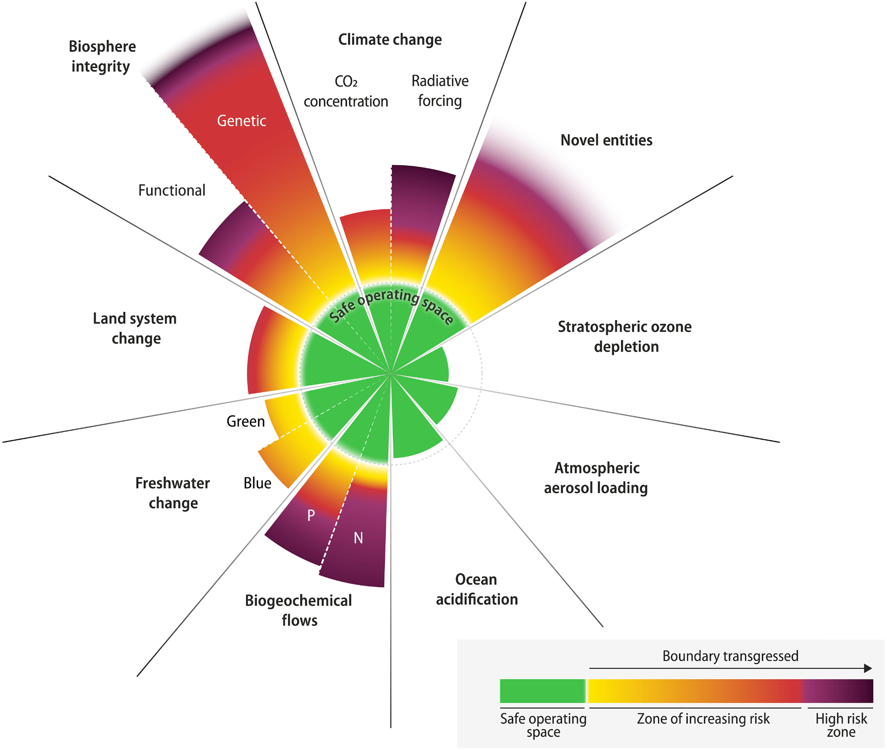{width="85%"}

---

## Los 9 procesos esenciales

{width="55%"}

::: {.caption}
Los límites planetarios son 9 procesos ecológicos esenciales para la estabilidad de la Tierra y dentro de los cuales podemos habitar un espacio seguro para la humanidad. Concepto propuesto desde el Instituto de Estocolmo en 2009.
:::

---

## Necesitamos actuar ahora {.map-slide}

{width="80%"}

::: {.caption}
Los impactos del cambio climático ya no son solo una preocupación del futuro: los vivimos ahora.
:::

---

## Impactos concretos I {.map-slide}

::: columns
::: {.column width="50%"}
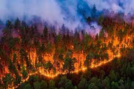{width="100%"}
:::
::: {.column width="48%"}
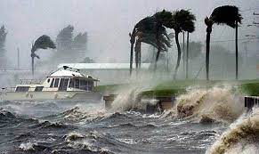{width="100%"}
:::
:::

---

## Impactos concretos II {.map-slide}

::: columns
::: {.column width="48%"}
{width="100%"}
:::
::: {.column width="48%"}
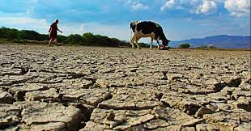{width="100%"}
:::
:::

---

## El doble desafío {.map-slide}

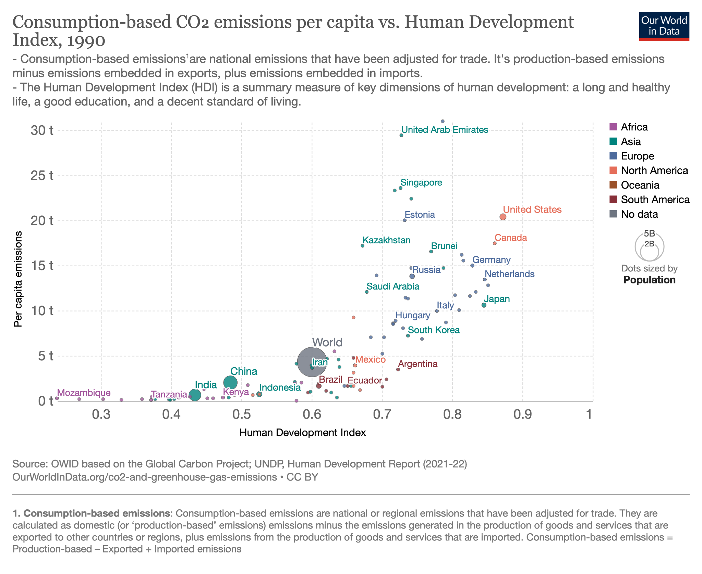{width="75%"}

::: {.caption}
A la vez que actuamos para recuperar la estabilidad del sistema Tierra, debemos actuar para superar definitivamente la pobreza y cerrar desigualdades crónicas.
:::

---

## Más de lo mismo no funcionará

- **Doble desafío:** ¿Cómo alcanzar la prosperidad para todos y todas respetando los límites planetarios?
- Más de lo mismo no funcionará…

{width="55%"}

---

## Razones para el optimismo

- Hay razones para ser optimistas: la humanidad ha superado desafíos inmensos en el pasado

::: columns
::: {.column width="50%"}
{width="100%"}
:::
::: {.column width="48%"}
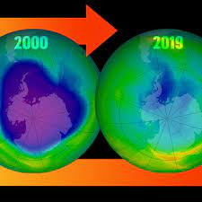{width="100%"}
:::
:::

---

## Ejemplos de progreso

::: columns
::: {.column width="32%"}
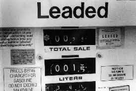{width="100%"}
:::
::: {.column width="32%"}
{width="100%"}
:::
::: {.column width="32%"}
{width="100%"}
:::
:::

---

## Desarrollo sustentable: tres pilares

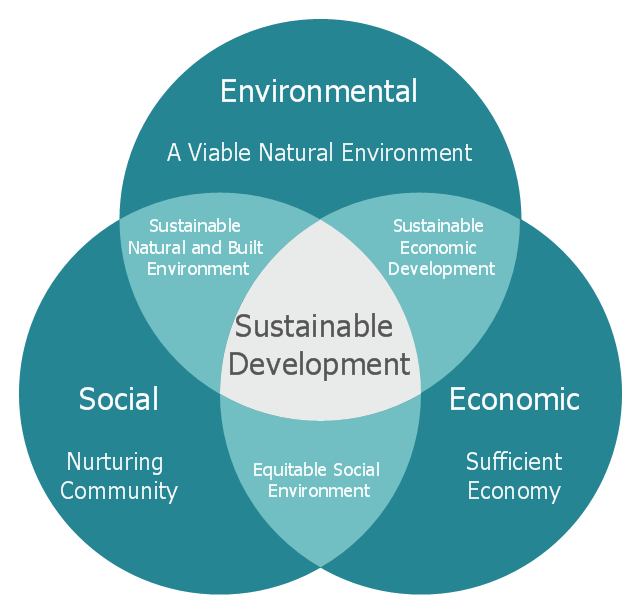{width="55%"}

::: {.caption}
El desarrollo sustentable se suele describir en términos de tres pilares: ambiental, social y económico. Estos pilares interactúan entre sí.
:::

---

## Justicia Ambiental — Definición EPA

> "Trato justo y participación significativa de todas las personas, sin importar su raza, color, origen nacional o ingresos, con respecto al desarrollo, implementación y cumplimiento de leyes, regulaciones y políticas ambientales."

::: {.small .muted}
Agencia de Protección Ambiental de EE.UU. (EPA)
:::

---

## Dos dimensiones de la Justicia Ambiental {.compact}

::: columns
::: {.column width="48%"}
::: {.box}
**JA Procedimental**

¿Cómo se toman las decisiones ambientales?

- ¿Quién participa en las decisiones?
- ¿Quién tiene voz en los procesos de planificación?
- ¿Las comunidades afectadas son escuchadas?

*Ejemplo: participación de comunidades locales en la aprobación de un proyecto minero.*
:::
:::
::: {.column width="48%"}
::: {.box}
**JA Distributiva**

¿Cómo se distribuyen los impactos ambientales?

- ¿Quién recibe los beneficios del desarrollo?
- ¿Quién soporta los costos ambientales?
- ¿Existen grupos más expuestos a contaminación o riesgos?

*Ejemplo: barrios de menores ingresos con mayor exposición a contaminación del aire.*
:::
:::
:::

# A&R: Mapas y Sustentabilidad {.section-slide background-color="#2a7f62"}

## Paso 1: Revisar herramientas {.activity-slide}

Cada estudiante tiene asignado un número. Tómense **20 minutos** para revisar el material correspondiente con el grupo que tiene el mismo número:

::: {.two-level}
- **1, 4, 7, 10, 13:** <a href="https://experience.arcgis.com/experience/ed5953d89038431dbf4f22ab9abfe40d/page/Indicators/?views=PM2.5" target="_blank">CalEnvironScreen</a>
- **2, 5, 8, 11, 14:** <a href="https://mapaconflictos.indh.cl/#/" target="_blank">Mapa de Conflictos Socioambientales de Chile</a>
- **3, 6, 9, 12, 15:** <a href="https://arclim.mma.gob.cl/" target="_blank">Atlas de Riesgos Climáticos</a>
:::

---

## Paso 2: Comparar y discutir {.question-slide}

Formen 5 grupos más grandes juntando grupos 1–3, 4–6, 7–9, 10–12, 13–15. Comparen las herramientas respondiendo:

- ¿Qué temáticas aborda la herramienta?
- ¿Qué rol juegan los mapas en ella?
- ¿Cómo puede la herramienta apoyar la gestión de los desafíos socioecológicos que aborda?
- ¿Puede la herramienta empoderar a grupos desaventajados?

---

## Paso 3: Plenario {.activity-slide}

1. Un grupo de cada herramienta presenta en 2 minutos su discusión, utilizando la herramienta para ilustrarla
2. Discutimos en conjunto
