## Plan para hoy

### Primer bloque

- Ticket de entrada
- A+R: Mapandarina
- CT: Fundamentos de SIG

### Segundo bloque

- CT: Justicia Ambiental
- A+R: Justicia Ambiental en Chile

# Datum {.section-slide}

## ¿Qué es un datum?

::: columns
::: {.column width="55%"}
- La Tierra **no es una esfera perfecta**: es un geoide irregular
- Un **datum** es una elipse matemática que aproxima su superficie
- Permite describir la posición de cualquier punto con coordenadas
- Es la base de todo sistema de coordenadas geográficas
:::
::: {.column width="45%"}
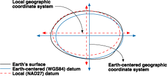

::: {.caption}
La Tierra como geoide. Fuente: ESRI.
:::
:::
:::

---

## Datum global y datum local

::: columns
::: {.column width="48%"}
::: {.box}
**Datum global**

- Se centra en el **centro de gravedad** de la Tierra
- El más usado: **WGS 1984**
- Estándar para GPS y cartografía global
:::
:::
::: {.column width="48%"}
::: {.box}
**Datum local**

- Referenciado a un punto en la **superficie**
- Minimiza errores en una región específica
- Ejemplos: NAD27 (Norteamérica), ED1950 (Europa)
:::
:::
:::

# Proyecciones cartográficas {.section-slide}

## ¿Qué es una proyección?

::: columns
::: {.column width="60%"}
- Para hacer un mapa plano, debemos **"aplanar"** la superficie curva
- Una proyección es un **modelo matemático** que relaciona cada punto de la elipse con un punto en un plano
- Gerardus Mercator (1512–1594) desarrolló la proyección más famosa del mundo
:::
::: {.column width="38%"}
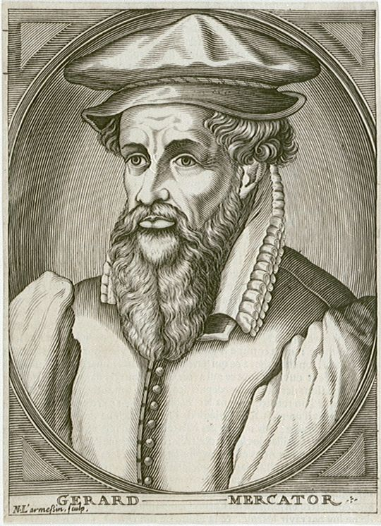

::: {.caption}
Gerardus Mercator.
:::
:::
:::

---

## Familias de proyecciones {.map-slide}

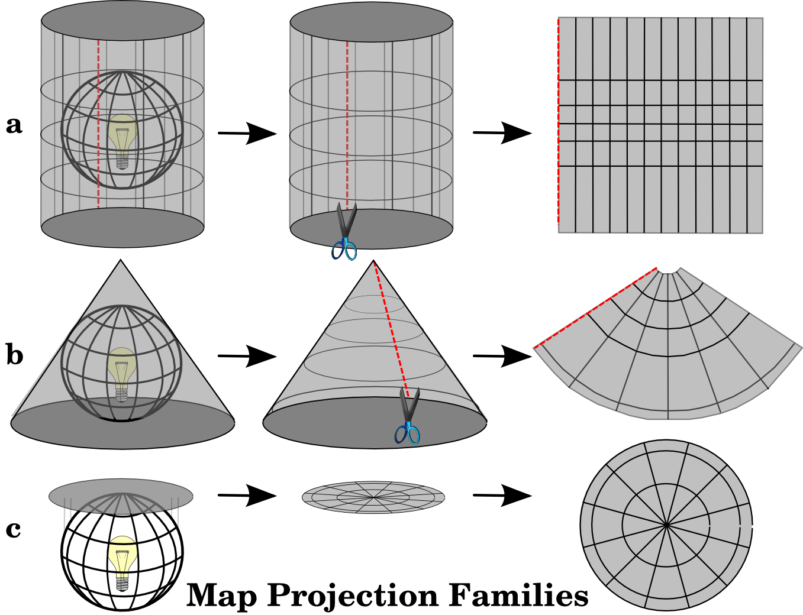

::: {.caption}
Tres familias: cilíndrica (a), cónica (b) y plana/acimutal (c).
:::

---

## Proyección Mercator: construcción {.map-slide}

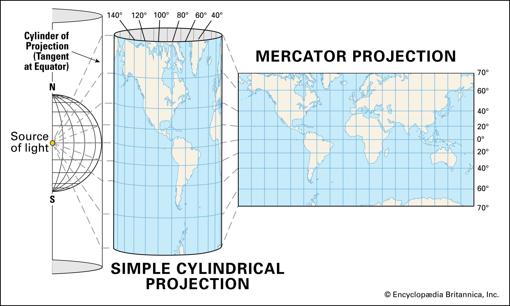

::: {.caption}
La proyección cilíndrica simple da origen a la proyección Mercator. Fuente: Encyclopædia Britannica.
:::

---

## Mercator distorsiona el área

::: columns
::: {.column width="50%"}
- Los paralelos y meridianos son **líneas rectas**
- Preserva **ángulos y formas** → útil para navegación
- Pero **distorsiona el área** hacia los polos
- Groenlandia aparece tan grande como África... ¡pero África es 14× mayor!
:::
::: {.column width="50%"}
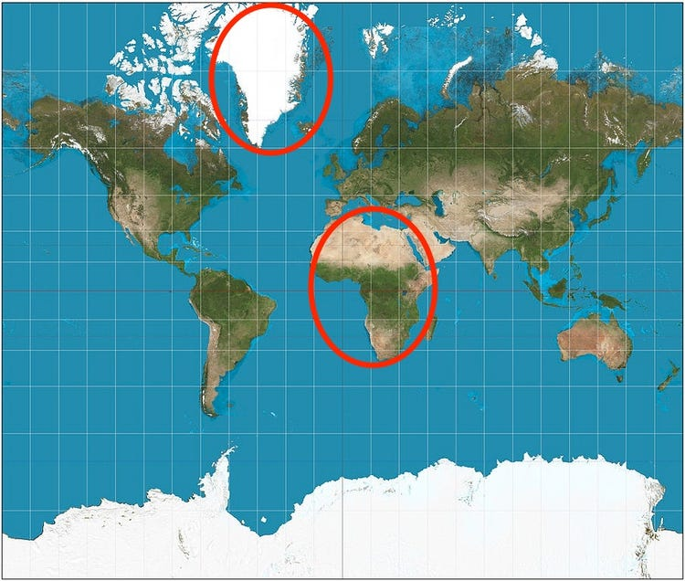

::: {.caption}
Groenlandia (circuito rojo) aparece tan grande como África en Mercator.
:::
:::
:::

---

## ¿Qué tan grande es Groenlandia realmente? {.map-slide}

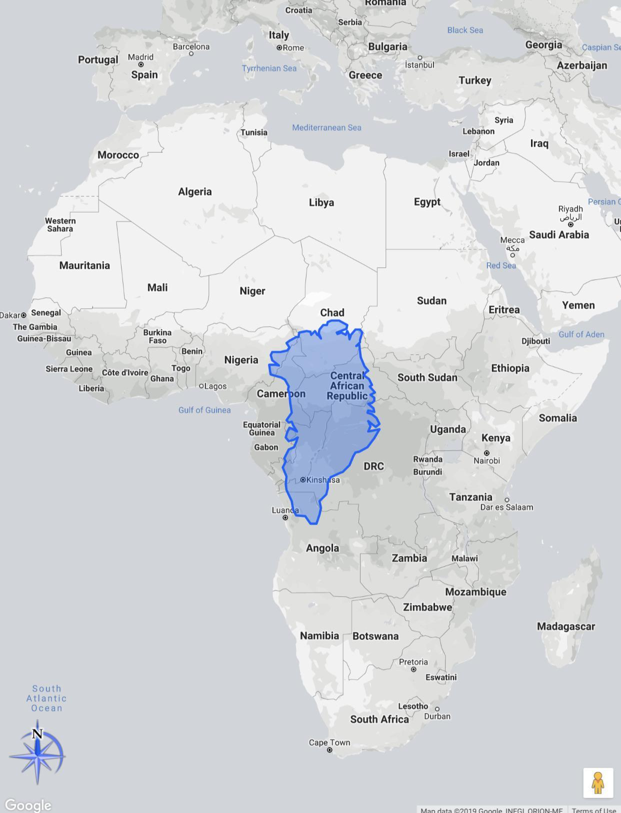

::: {.caption}
Groenlandia a escala real superpuesta sobre África. Fuente: Google Maps.
:::

---

## Ninguna proyección es perfecta

::: columns
::: {.column width="55%"}
- Toda proyección **distorsiona** al menos uno de:
  - **Área** (superficies)
  - **Forma** (ángulos)
  - **Distancia**
- No existe una proyección que preserve los tres simultáneamente
- La elección depende de **qué se quiere comunicar**
:::
::: {.column width="43%"}
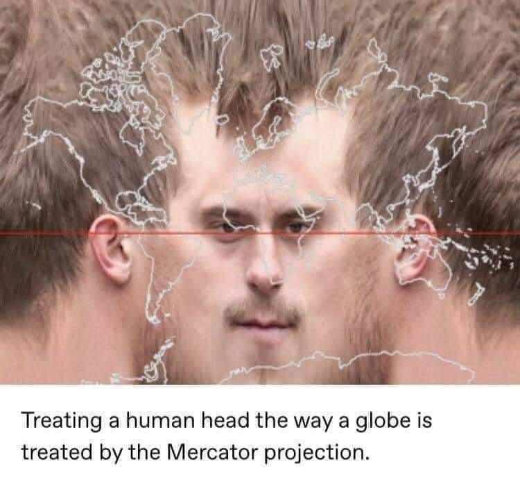

::: {.caption}
"Treating a human head the way a globe is treated by the Mercator projection."
:::
:::
:::

---

## La proyección depende del propósito

::: columns
::: {.column width="48%"}
**Mercator**

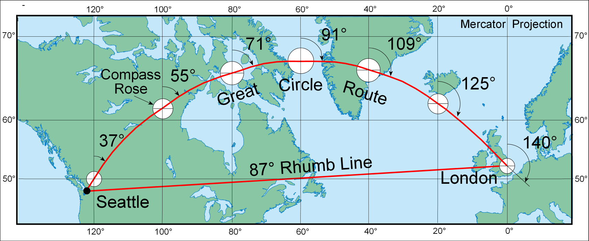

::: {.caption}
La línea recta Seattle–Londres **no** es la ruta más corta.
:::
:::
::: {.column width="48%"}
**Gnómica**

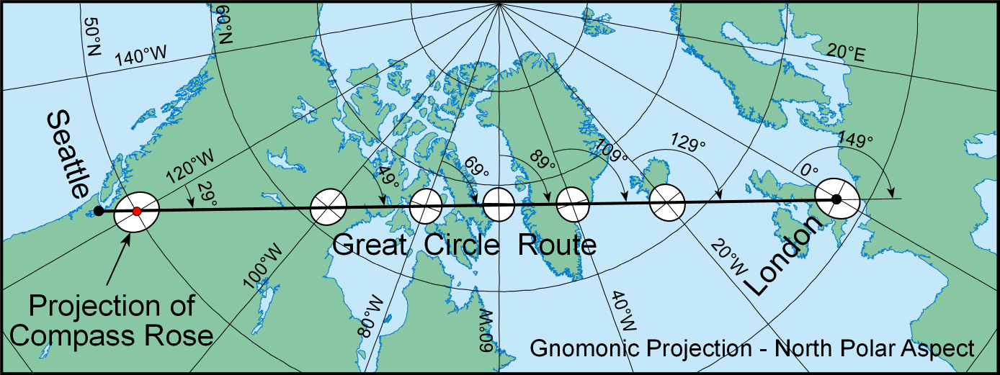

::: {.caption}
En proyección gnómica, la línea recta **sí** es la ruta más corta (pero distorsiona el ecuador).
:::
:::
:::

---

## Proyecciones que preservan área

::: columns
::: {.column width="48%"}
**Mollweide**

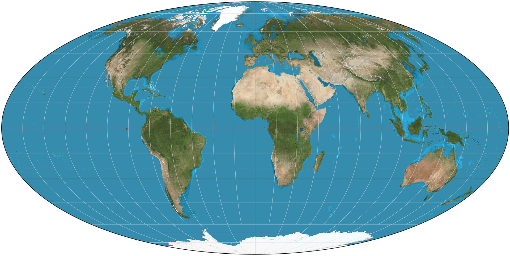

::: {.caption}
Preserva área correctamente, pero distorsiona formas.
:::
:::
::: {.column width="48%"}
**Lambert conformal conic**

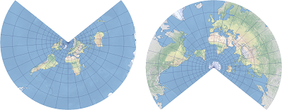

::: {.caption}
Preserva forma localmente, pero distorsiona áreas.
:::
:::
:::

---

## Proyecciones de compromiso

::: columns
::: {.column width="48%"}
**Platé Carrée**

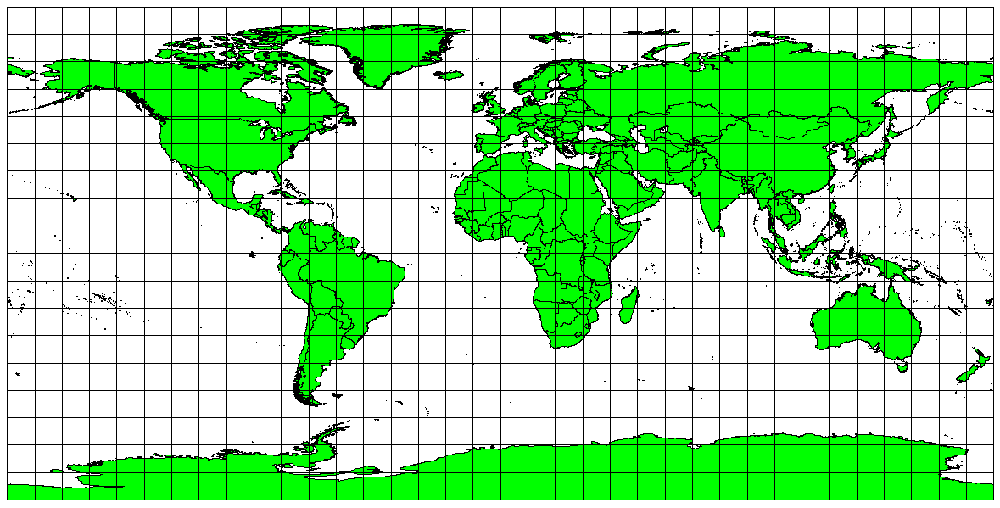

::: {.caption}
Distancia constante entre paralelos y meridianos.
:::
:::
::: {.column width="48%"}
**Robinson / Mollweide**

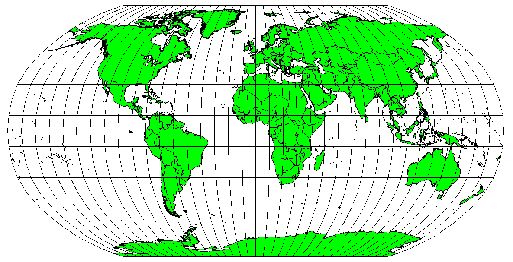

::: {.caption}
Equilibrio entre distorsiones de área, forma y distancia.
:::
:::
:::

# Proyecciones locales y CRS {.section-slide}

## Proyecciones locales

::: columns
::: {.column width="55%"}
- A escala local, la Tierra se aproxima bien con un **plano tangente**
- Las proyecciones locales usan **metros** desde un punto de origen
- Un punto se expresa como **(x, y)**: horizontal, vertical
- Permiten calcular áreas y distancias con precisión
:::
::: {.column width="43%"}
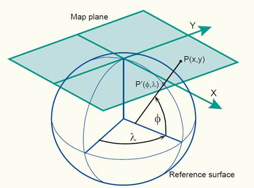

::: {.caption}
Plano tangente a la superficie del elipsoide.
:::
:::
:::

---

## ¡OJO! Pseudo Platé Carrée

- Una de las proyecciones más usadas pone **longitud** en el eje x y **latitud** en el eje y
- Al estar en grados y no en metros, **no sirve para calcular áreas ni distancias**
- Las coordenadas suelen escribirse como **(lon, lat)**, pero en la proyección los ejes son **(lat, lon)** → ¡atención al orden!

---

## Sistema de referencia de coordenadas (CRS)

> ¿En qué lugar de la Tierra está un punto del mapa?

::: columns
::: {.column width="48%"}
::: {.box}
**CRS Geodético**

- 3D: latitud y longitud
- Requiere un **datum**
- Ej.: WGS 1984
:::
:::
::: {.column width="48%"}
::: {.box}
**CRS Proyectado**

- 2D: coordenadas planas (x, y) en metros
- Requiere **datum + proyección**
- Ej.: UTM WGS84 Zona 19S
:::
:::
:::

---

## ¿Cómo elegir el CRS?

- Para **mapas globales**: depende de lo que se quiere ilustrar (área, distancia, forma)
- Para **mapas locales**: elegir la proyección que minimice distorsiones en el área de interés
- Referencia estándar: base de datos **EPSG** (European Petroleum Survey Group)
- Para **Chile**: `EPSG:32718` (zona 18S) o `EPSG:32719` (zona 19S) — ambas UTM-WGS84

---

## Sistema UTM {.map-slide}

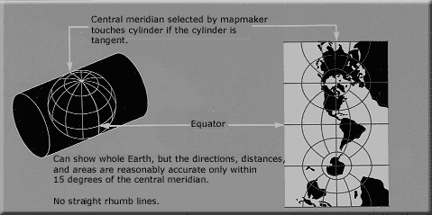

::: {.caption}
El sistema UTM divide la Tierra en 60 zonas cilíndricas de 6° de longitud.
:::

---

## UTM en Chile

::: columns
::: {.column width="60%"}
- Chile ocupa principalmente **dos zonas UTM**:
  - **Zona 18S** → sur de Chile (`EPSG:32718`)
  - **Zona 19S** → norte de Chile (`EPSG:32719`)
- La Región Metropolitana se encuentra en la **zona 19S**
:::
::: {.column width="38%"}
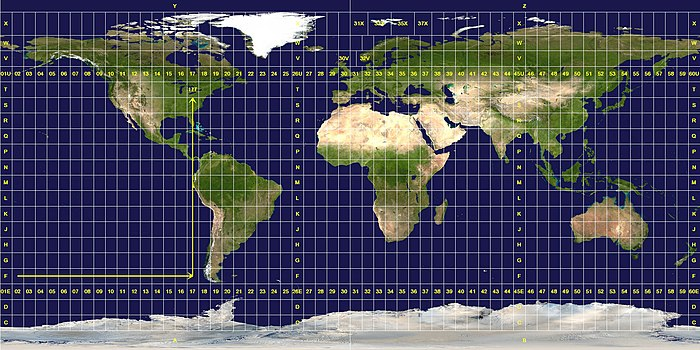

::: {.caption}
Grilla UTM mundial. Chile se extiende entre las zonas 18 y 19.
:::
:::
:::

# Tipos de datos espaciales {.section-slide}

## Vector y Raster

::: columns
::: {.column width="48%"}
**Vector**

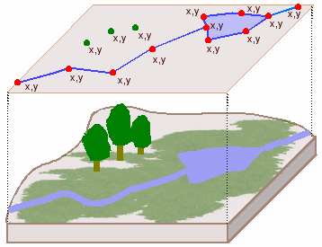

::: {.caption}
Puntos, líneas y polígonos. Representan objetos discretos.
:::
:::
::: {.column width="48%"}
**Raster**

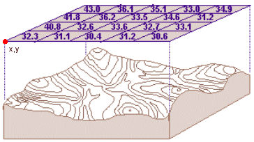

::: {.caption}
Grilla regular de celdas (píxeles). Representa fenómenos continuos.
:::
:::
:::

# CT: Justicia Ambiental {.section-slide}

## Lectura de la clase

> "Los patrones espaciales de distribución de las causas y consecuencias de la contaminación atmosférica están claramente controlados por la condición social de los habitantes de la ciudad."

::: {.small .muted}
Romero, Fuentes y Smith (2010). *Ecología política de los riesgos naturales y de la contaminación ambiental en Santiago de Chile: necesidad de justicia ambiental.* Scripta Nova, Vol. XIV, nº 331.
:::

---

## ¿Qué es la Justicia Ambiental?

> "Ningún grupo de personas debe cargar con una fracción desproporcionada de las consecuencias ambientales negativas que resultan de las operaciones o políticas de la industria, el gobierno o el comercio."

::: {.small .muted}
Agencia de Protección Ambiental de EE.UU. (EPA)
:::

---

## No todos respiramos el mismo aire

::: columns
::: {.column width="55%"}
- Las fuentes de contaminación **no se distribuyen al azar** en el territorio
- Tienden a concentrarse en comunidades con **menos recursos** y **menor poder político**
- Esto no es una coincidencia: es el resultado de decisiones, mercados y estructuras sociales
:::
::: {.column width="43%"}

::: {.caption}
Plantas industriales y vertederos rara vez se instalan en barrios de altos ingresos.
:::
:::
:::

---

## Un ejemplo concreto: Carolina del Norte {.map-slide}

::: {.caption}
Emisiones de grandes contaminadores y nivel de ingreso per cápita, Carolina del Norte (2010). Los puntos más grandes representan mayores emisiones. Fuente: EPA TRI.
:::

---

## Nació en las calles, no en la academia

- El concepto surge de los **movimientos sociales** en los años 70 en EE.UU.
- **Warren County, NC (1982):** comunidad afroamericana bloqueó físicamente camiones que transportaban residuos tóxicos a su barrio
- La pregunta que hicieron esas comunidades fue simple: *¿por qué aquí?*
- Décadas después, la ciencia confirmó lo que esas comunidades ya sabían

---

## La evidencia es contundente

- Epidemiología, geografía, economía, urbanismo: **décadas de estudios consistentes**
- Grupos vulnerables — por ingreso, raza, o etnicidad — cargan con mayor exposición a:
  - Contaminación del aire y del agua
  - Proximidad a vertederos, plantas industriales, sitios de residuos peligrosos
- El patrón se observa en distintos países y escalas

---

## Santiago: quién contamina y quién sufre

- Los sectores ricos (oriente) concentran los automóviles — la principal fuente de contaminación en Santiago
- Sin embargo, las peores concentraciones de material particulado se registran en los sectores pobres del poniente y las zonas bajas
- Se estima que **~2.500 personas mueren anualmente** por enfermedades asociadas a la contaminación del aire
- Los que más contaminan, menos sufren; los que menos contaminan, más sufren

::: {.small .muted}
Romero, Fuentes y Smith (2010).
:::

---

## Dos tipos de injusticia ambiental

::: columns
::: {.column width="48%"}
::: {.box}
**Justicia distributiva**

¿Quién carga con el daño?

- Distribución de contaminación
- Acceso a áreas verdes y amenidades
- Exposición a riesgos ambientales
:::
:::
::: {.column width="48%"}
::: {.box}
**Justicia procedimental**

¿Quién tiene voz?

- Participación en decisiones de política
- Acceso a información y recursos legales
- Representación en espacios de poder
:::
:::
:::

# ¿Por qué emerge? {.section-slide}

## El daño va donde la resistencia es menor

::: columns
::: {.column width="55%"}
- Las industrias contaminantes buscan **terrenos baratos** y **poca oposición**
- Los barrios pobres y con menor organización ofrecen ambas cosas
- Decisiones de zonificación y regulación también pueden favorecer esta lógica
- Resultado: la carga ambiental se acumula donde hay menos poder
:::
::: {.column width="43%"}

::: {.caption}
Los vertederos e instalaciones de residuos peligrosos tienden a ubicarse en comunidades de bajos ingresos.
:::
:::
:::

---

## Los vulnerables también van al daño

::: columns
::: {.column width="48%"}

::: {.caption}
Vivienda en zonas contaminadas: la única opción accesible para muchos.
:::
:::
::: {.column width="48%"}

::: {.caption}
Acceso a entornos limpios y verdes: fuertemente correlacionado con el ingreso.
:::
:::
:::

El medioambiente limpio cuesta dinero. Quienes no pueden pagarlo terminan viviendo cerca de las fuentes de daño.

---

## Los ciclos se refuerzan {.map-slide}

::: {.caption}
"Pirámide de la gentrificación ambiental": la calidad ambiental, los precios del suelo y la demografía se influyen mutuamente en ciclos que pueden perpetuar la injusticia. Fuente: Banzhaf & McCormick (2012).
:::

---

## La justicia procedimental alimenta la distributiva

- Quienes más sufren el daño son frecuentemente los que **menos participan** en las decisiones que lo generan
- Barreras: idioma, tiempo, recursos legales, acceso a información, representación política
- Sin voz en el proceso, los resultados distributivos raramente cambian
- **La injusticia procedimental es una causa, no solo una consecuencia**

## Los riesgos "naturales" también son injustos

::: columns
::: {.column width="60%"}
- En Santiago, condominios de altos ingresos se instalaron en los **piedemontes andinos** — zonas de origen de aluviones
- Sus construcciones impermeabilizan el suelo → más escorrentía → más inundaciones **aguas abajo**
- Las obras de mitigación (canales, gaviones) se concentran donde viven los ricos
- Los pobres, aguas abajo, quedan **desprotegidos**
- Los "desastres naturales" son también el resultado de decisiones sociales y políticas

::: {.small .muted}
Romero, Fuentes y Smith (2010).
:::
:::
::: {.column width="38%"}
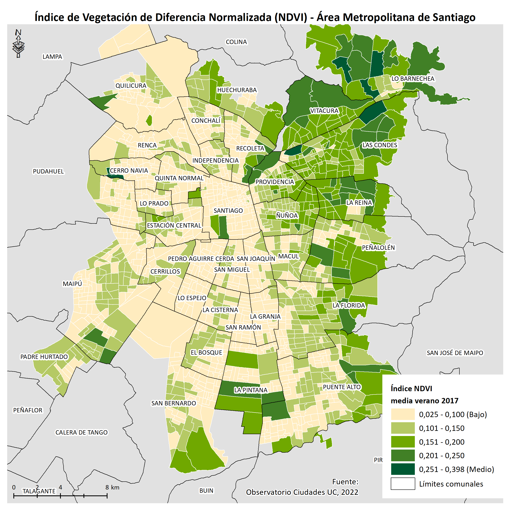

::: {.caption}
Distribución del ingreso en el Área Metropolitana de Santiago. El oriente concentra los sectores de mayores ingresos.
:::
:::
:::

# Implicancias éticas {.section-slide}

## ¿Y si es solo el mercado funcionando?

- Una objeción frecuente: *"si la gente elige vivir ahí porque es más barato, ¿cuál es el problema?"*
- Problema: esas "elecciones" se dan en un contexto de **opciones profundamente desiguales**
- Que la diferencia en exposición esté mediada por el ingreso **no la hace menos injusta**
- El origen del daño importa para juzgar su justicia — y para diseñar las respuestas

---

## Los efectos se perpetúan entre generaciones

- La exposición ambiental afecta la **salud, el desarrollo cognitivo y los ingresos futuros**
- Efectos documentados desde la exposición *in utero*
- Un niño que crece cerca de una fuente de contaminación llega en desventaja a la adultez
- La injusticia ambiental puede **reproducir y profundizar** la desigualdad socioeconómica

---

## ¿Por qué importa saber dónde está?

- No podemos corregir lo que no podemos ver ni medir
- **Mapear la injusticia ambiental** es el primer paso para intervenirla
- Romero et al. (2010) concluyen que en Chile faltan:
  - Evaluación ambiental estratégica de los planes urbanos
  - Participación ciudadana **vinculante** en decisiones territoriales
  - Reconocimiento del valor social de los bienes ambientales comunes
- Las herramientas que estamos aprendiendo en este curso son exactamente las que se necesitan para hacer visible lo que hoy permanece invisible

# A+R: Justicia Ambiental en Chile {.section-slide}

## Justicia ambiental en Chile {.question-slide}

Visita el sitio **mapaconflictos.indh.cl**

Elige con tu pareja un conflicto ambiental y responde:

- ¿Existe un problema de justicia ambiental? ¿De qué tipo?
- ¿Qué canal o canales podrían explicarlo?
- ¿Quién tiene voz en este conflicto y quién no?

---

## Discusión en plenario {.activity-slide}

1. Cada pareja presenta su conflicto en 2 minutos.
2. Identificamos patrones comunes entre los casos.
3. ¿Qué herramientas necesitaríamos para analizar esto con datos?
