## Plan para hoy

### Primer bloque

- Ticket de entrada
- CT: Justicia Ambiental
- A+R: Justicia Ambiental en Chile


### Segundo bloque

- CT: Fundamentos de SIG
- A: Inducción a proyectos reproducibles en QGIS


# CT: Justicia Ambiental {.section-slide}

## Lectura de la clase

> "Los patrones espaciales de distribución de las causas y consecuencias de la contaminación atmosférica están claramente controlados por la condición social de los habitantes de la ciudad."

::: {.small .muted}
Romero, Fuentes y Smith (2010). *Ecología política de los riesgos naturales y de la contaminación ambiental en Santiago de Chile: necesidad de justicia ambiental.* Scripta Nova, Vol. XIV, nº 331.
:::

---

## ¿Qué es la Justicia Ambiental?

> "Ningún grupo de personas debe cargar con una fracción desproporcionada de las consecuencias ambientales negativas que resultan de las operaciones o políticas de la industria, el gobierno o el comercio."

::: {.small .muted}
Agencia de Protección Ambiental de EE.UU. (EPA)
:::

---

## Dos tipos de justicia ambiental

::: columns
::: {.column width="48%"}
::: {.box}
**Justicia distributiva (JD)**

¿Quién carga con el daño?

- Distribución de contaminación
- Acceso a áreas verdes y amenidades
- Exposición a riesgos ambientales
:::
:::
::: {.column width="48%"}
::: {.box}
**Justicia procedimental (JP)**

¿Quién tiene voz?

- Participación en decisiones
- Acceso a información y recursos legales
- Representación en espacios de poder
:::
:::
:::


---

## No todos respiramos el mismo aire

::: columns
::: {.column width="50%"}
- Las contaminación **no se distribuye al azar**
- Tiende a concentrarse en comunidades con **menos recursos** y **menor poder político**
- No es una coincidencia: es el resultado de decisiones e interacciones de mercado
:::
::: {.column width="45%"}
{width="100%"}

::: {.caption}
Plantas industriales y vertederos rara vez se instalan en barrios de altos ingresos.
:::
:::
:::

---

## Ejemplo: Carolina del Norte {.map-slide}

{width="250%"}

::: {.caption}
Emisiones de grandes contaminadores y nivel de ingreso per cápita, Carolina del Norte (2010). Los puntos más grandes representan mayores emisiones. Fuente: EPA TRI.
:::

---

## Nació en las calles, no en la academia

- El concepto surge de los **movimientos sociales** en los años 70 en EE.UU.
- **Warren County, NC (1982):** comunidad afroamericana bloqueó físicamente camiones que transportaban residuos tóxicos a su barrio
- La pregunta que hicieron esas comunidades fue simple: *¿por qué aquí?*
- Décadas después, la ciencia confirmó lo que esas comunidades ya sabían

---

## La evidencia es contundente

- Epidemiología, geografía, economía, urbanismo: **décadas de estudios consistentes**
- Grupos vulnerables — por ingreso, raza, o etnicidad — cargan con mayor exposición a:
  - Contaminación del aire y del agua
  - Proximidad a vertederos, plantas industriales, sitios de residuos peligrosos
- El patrón se observa en distintos países y escalas

---


## Ejemplo - Stgo: quién contamina y quién sufre

- Los sectores ricos (oriente) concentran los automóviles — la principal fuente de contaminación en Santiago
- Sin embargo, las peores concentraciones de material particulado se registran en los sectores pobres del poniente y las zonas bajas
- Se estima que **~2.500 personas mueren anualmente** por enfermedades asociadas a la contaminación del aire
- Los que más contaminan, menos sufren; los que menos contaminan, más sufren

::: {.small .muted}
Romero, Fuentes y Smith (2010).
:::


# ¿Por qué emerge? {.section-slide}

## Daño va donde resistencia es menor

::: columns
::: {.column width="49%"}
- Industrias buscan **terrenos baratos** y **poca oposición**
- Barrios pobres y con menor organización ofrecen ambas cosas
- Decisiones de zonificación y regulación pueden reforzar esta lógica
:::
::: {.column width="49%"}
- Carga ambiental se acumula donde hay menos poder
{width="80%" style="padding: 0.5em"}

::: {.caption}
Vertederos e instalaciones de residuos peligrosos tienden a ubicarse en comunidades de bajos ingresos
:::
:::
:::

---

## Los vulnerables también van al daño

::: columns
::: {.column width="48%"}
{width="78%" style="padding: 0.5em"}

::: {.caption}
Vivienda en zonas contaminadas: única opción para muchos.
:::
:::
::: {.column width="48%"}
{width="86%" style="padding: 0.5em"}

::: {.caption}
Barrios limpios y con areas verdes tienden a ser acomodados.
:::
:::
:::

El medioambiente limpio cuesta dinero. Quienes no pueden pagarlo terminan viviendo cerca de las fuentes de daño.

---

## Los ciclos se refuerzan {.map-slide}

{width="150%" style="padding: 0.5em"}

::: {.caption}
"Pirámide de la gentrificación ambiental": la calidad ambiental, los precios del suelo y la demografía se influyen mutuamente en ciclos que pueden perpetuar la injusticia. Fuente: Banzhaf & McCormick (2012).
:::

---

## JP alimenta la JD, y viceversa

- Quienes más sufren el daño son frecuentemente los que **menos participan** en las decisiones que lo generan
- Barreras: idioma, tiempo, recursos legales, acceso a información, representación política
- Sin voz en el proceso, los resultados distributivos raramente cambian
- **La injusticia procedimental es una causa, no solo una consecuencia**
- ¿Cómo es una consecuencia?

## JA para riesgos "naturales" - Un caso en Stgo 

::: columns
::: {.column width="60%"}
- Nuevos barrios ricos en **precordillera**
- \+ construcciones → + escorrentía → + inundaciones **aguas abajo**
- Mitigación se concentra en barrios ricos
- Pobres, aguas abajo, **desprotegidos**
- "Desastres naturales" también resultan de decisiones de política
:::
::: {.column width="38%"}


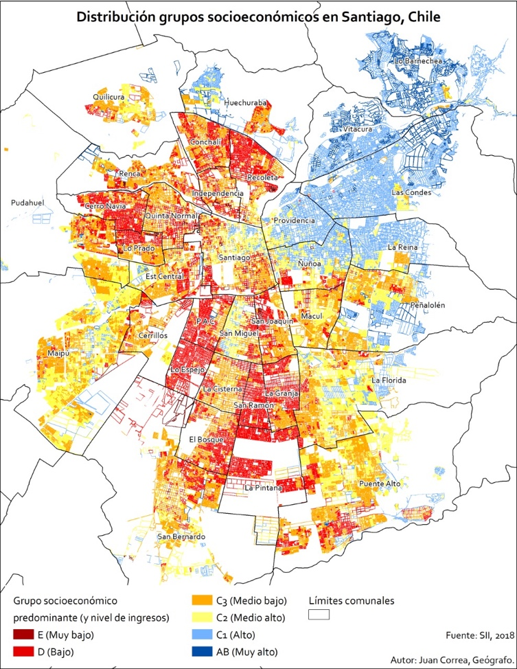{width="80%" style="padding: 0.2em"}

::: {.caption}
Stgo oriente concentra los sectores de mayores ingresos. 
:::
:::
:::

# Implicancias éticas {.section-slide}

## ¿Y si es solo el mercado funcionando?

- Una objeción frecuente: *"si la gente elige vivir ahí porque es más barato, ¿cuál es el problema?"*
- Problema: esas "elecciones" se dan en un contexto de **opciones profundamente desiguales**
- Que la diferencia en exposición esté mediada por el ingreso **no la hace menos injusta**
- El origen del daño importa para juzgar su justicia — y para diseñar las respuestas

---

## Efectos intergeneracionales

- La exposición ambiental afecta la **salud, el desarrollo cognitivo y los ingresos futuros**
- Efectos documentados desde la exposición *in utero*
- Un niño que crece cerca de una fuente de contaminación llega en desventaja a la adultez
- La injusticia ambiental puede **reproducir y profundizar** la desigualdad socioeconómica

---

## ¿Por qué importa saber dónde está?

- No podemos corregir lo que no podemos ver ni medir
- **Mapear la injusticia ambiental** es el primer paso para intervenirla
- Las herramientas que estamos aprendiendo en este curso son exactamente las que se necesitan para hacer visibles las injusticias ambientales


# A+R: Herramientas para mapear la JA {.section-slide}

## Herramientas para mapear la JA {.question-slide}

En la clase anterior revisaste junto a tus compañeros una de tres herramientas de visualización de problemáticas de JA:

-  <a href="https://experience.arcgis.com/experience/ed5953d89038431dbf4f22ab9abfe40d/p
age/Indicators/?views=PM2.5" target="_blank">CalEnvironScreen</a>  
-  <a href="https://mapaconflictos.indh.cl/#/" target="_blank">Mapa de Conflictos Socioambientales de Chile</a>  
-  <a href=" https://arclim.mma.gob.cl/
" target="_blank">Atlas de Risgos Climáticos</a>  

## Herramientas para mapear la JA {.question-slide}

Y contestaron las siguientes preguntas guías:

- ¿Qué temáticas abordan la herramienta web en cuestión?
- ¿Qué rol juegan los mapas en ella?
- ¿Cómo puede la herramienta apoyar la gestión de los desafíos
socioecológicos que aborda?
- ¿Puede la herramienta empoderar a grupos desaventajados?

## Caso de JA {.question-slide}

Juntense en nuevas parejas que hayan visto la misma herramienta, escojan un caso de JA ilustrado por la herramienta, y respondan las siguientes perguntas:

  - ¿Es un caso de justicia distributiva, procedimental o ambos?
  - ¿Qué factores pueden explicar la injusticia en el caso elegido?
  - ¿Qué consecuencias tiene para las comunidades afectadas?
- ¿Es efectiva la herramienta web para visualizar el caso de JA? ¿Cómo podría mejorarse?


## Discusión en plenario {.activity-slide}

  1. Un grupo de cada herramienta presenta en 2 minutos su caso, utilizando la herramienta para ilustrarlo.
  2. Discutimos en conjunto

# CT: Fundamentos de SIG {.section-slide}

# Datum {.section-slide}

## ¿Qué es un datum?


- La Tierra **no es una esfera perfecta**: es un geoide irregular
- Un **datum** es un modelo matemático que aproxima su superficie
- Permite describir la posición de cualquier punto con coordenadas
- Es la base de todo sistema de coordenadas geográficas

---

## Datum global y datum local

::: columns
::: {.column width="48%"}
::: {.box}
**Datum global**

- Se centra en el **centro de gravedad** de la Tierra
- El más usado: **WGS 1984**
- Estándar para GPS y cartografía global
:::
:::
::: {.column width="48%"}
::: {.box}
**Datum local**

- Referenciado a un punto en la **superficie**
- Minimiza errores en una región específica
- Ejemplos: NAD27 (Norteamérica), ED1950 (Europa)
:::
:::
:::

## Datum global y datum local

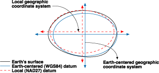{width="100%"}

::: {.caption}
La Tierra como geoide. Ilustración de datum global (WGS84) y local (NAD27) superpuesto al geoide real. Fuente: ESRI.
:::


# Proyecciones cartográficas {.section-slide}

## ¿Qué es una proyección?

::: columns
::: {.column width="60%"}
- Para hacer un mapa plano, debemos **"aplanar"** la superficie curva
- Una proyección es un **modelo matemático** que relaciona cada punto en el datum con un punto en un plano
- Gerardus Mercator (1512–1594) desarrolló la proyección más famosa del mundo
:::
::: {.column width="38%"}
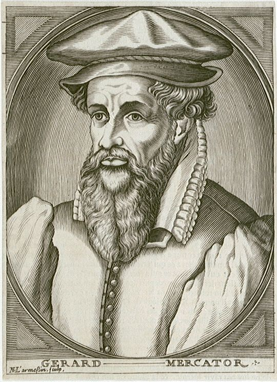

::: {.caption}
Gerardus Mercator.
:::
:::
:::

---

## Familias de proyecciones {.map-slide}

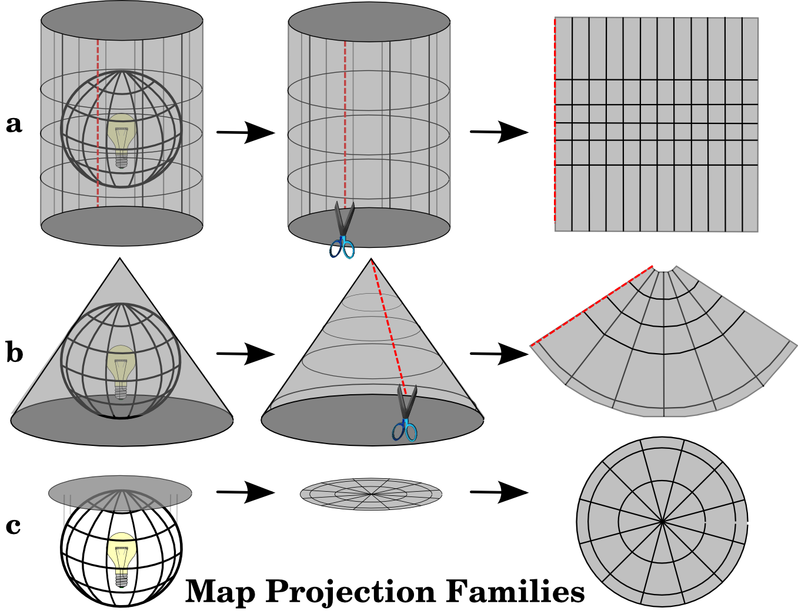{width="100%"}

::: {.caption}
Tres familias: cilíndrica (a), cónica (b) y plana/acimutal (c). Fuente: ESRI
:::

---

## Proyección Mercator: construcción {.map-slide}

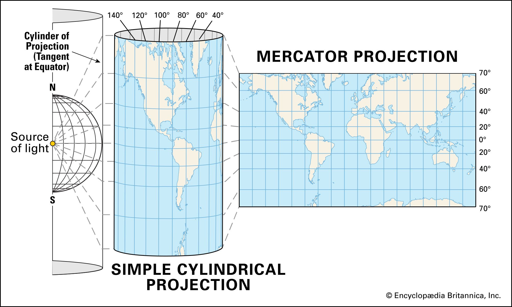

::: {.caption}
La proyección cilíndrica simple da origen a la proyección Mercator. Fuente: ESRI.
:::

---

## Mercator distorsiona el área

::: columns
::: {.column width="55%"}
- Paralelos y meridianos son **líneas rectas**
- Preserva **ángulos y formas** → útil para navegación
- **Distorsiona el área** hacia los polos
- Groenlandia aparece tan grande como África... ¡pero África es 14× mayor!
:::
::: {.column width="44%"}
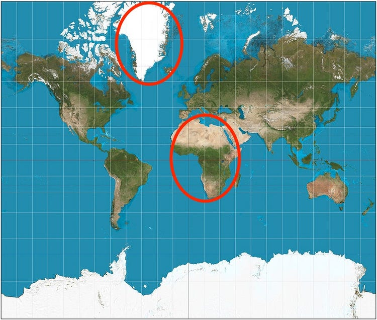

::: {.caption}
Groenlandia aparece tan grande como África en Mercator.
:::
:::
:::

---

## ¿Qué tan grande es Groenlandia? {.map-slide}

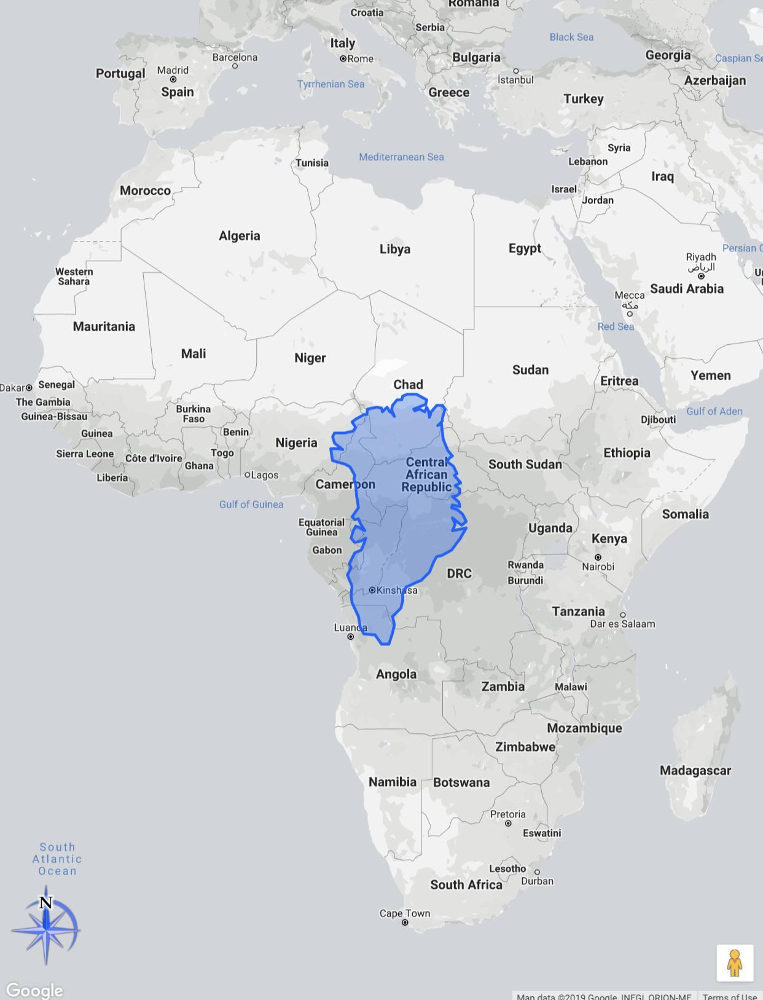

::: {.caption}
Groenlandia a escala real superpuesta sobre África. Fuente: Google Maps.
:::

---

## Ninguna proyección es perfecta

::: columns
::: {.column width="58%"}
- Toda proyección **distorsiona** al menos uno de:
  - **Área** (superficies)
  - **Forma** (ángulos)
  - **Distancia**
- Elección depende de **qué se quiere comunicar**
:::
::: {.column width="40%"}
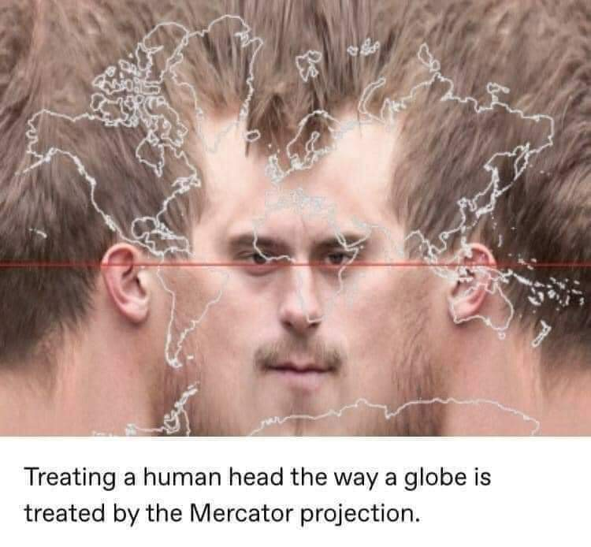

::: {.caption}
"Treating a human head the way a globe is treated by the Mercator projection."
:::
:::
:::

---

## La proyección depende del propósito

::: columns
::: {.column width="48%"}
**Mercator**

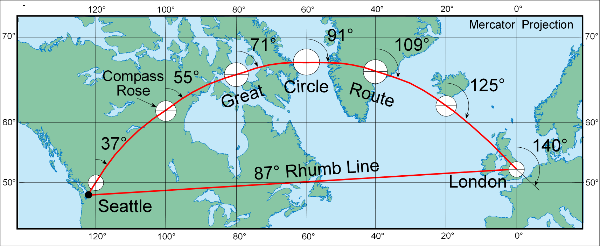

::: {.caption}
La línea recta Seattle–Londres **no** es la ruta más corta.
:::
:::
::: {.column width="48%"}
**Gnómica**

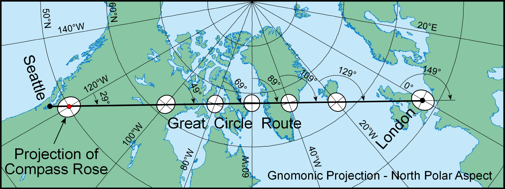

::: {.caption}
En proyección gnómica, la línea recta **sí** es la ruta más corta (pero distorsiona el ecuador).
:::
:::
:::

---

## Proyecciones que preservan área

::: columns
::: {.column width="48%"}
**Mollweide**

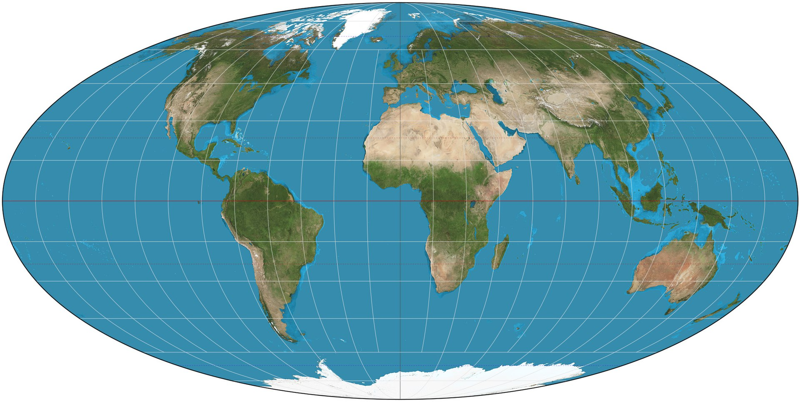

::: {.caption}
Preserva área correctamente, pero distorsiona formas.
:::
:::
::: {.column width="48%"}
**Lambert conformal conic**

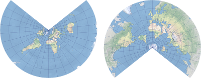

::: {.caption}
Preserva forma localmente, pero distorsiona áreas.
:::
:::
:::

---

## Proyecciones de compromiso

::: columns
::: {.column width="48%"}
**Platé Carrée**


::: {.caption}
Distancia constante entre paralelos y meridianos.
:::
:::
::: {.column width="48%"}
**Robinson / Mollweide**

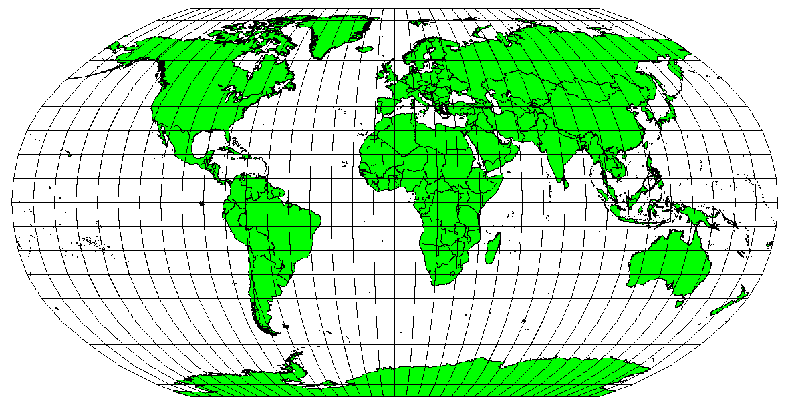

::: {.caption}
Equilibrio entre distorsiones de área, forma y distancia.
:::
:::
:::

# Proyecciones locales y CRS {.section-slide}

## Proyecciones locales

::: columns
::: {.column width="55%"}
- A escala local, la Tierra se aproxima bien con un **plano tangente**
- Las proyecciones locales usan **metros** desde un punto de origen
- Un punto se expresa como **(x, y)**: horizontal, vertical
- Permiten calcular áreas y distancias con precisión
:::
::: {.column width="43%"}
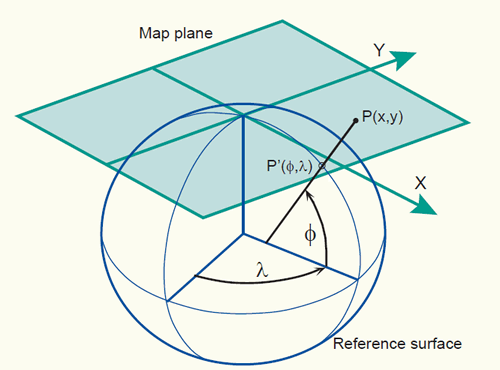

::: {.caption}
Plano tangente a la superficie del elipsoide.
:::
:::
:::

---

## ¡OJO! Pseudo Platé Carrée

- Una de las proyecciones más usadas pone **longitud** en el eje x y **latitud** en el eje y
- Al estar en grados y no en metros, **no sirve para calcular áreas ni distancias**
- Las coordenadas suelen escribirse como **(lon, lat)**, pero en la proyección los ejes son **(lat, lon)** → ¡atención al orden!

---

## Sistema de referencia de coordenadas (CRS)

> ¿En qué lugar de la Tierra está un punto del mapa?

::: columns
::: {.column width="48%"}
::: {.box}
**CRS Geodético**

- 3D: latitud y longitud
- Requiere un **datum**
- Ej.: WGS 1984
:::
:::
::: {.column width="48%"}
::: {.box}
**CRS Proyectado**

- 2D: coordenadas planas (x, y) en metros
- Requiere **datum + proyección**
- Ej.: UTM WGS84 Zona 19S
:::
:::
:::

---

## ¿Cómo elegir el CRS?

- Para **mapas globales**: depende de lo que se quiere ilustrar (área, distancia, forma)
- Para **mapas locales**: elegir la proyección que minimice distorsiones en el área de interés
- Referencia estándar: base de datos **EPSG** (European Petroleum Survey Group)
- Para **Chile**: `EPSG:32718` (zona 18S) o `EPSG:32719` (zona 19S) — ambas UTM-WGS84

---

## Sistema UTM {.map-slide}

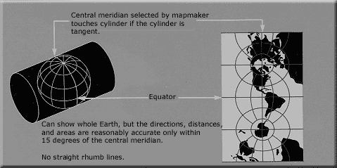

::: {.caption}
El sistema UTM divide la Tierra en 60 zonas cilíndricas de 6° de longitud.
:::

---

## UTM en Chile

::: columns
::: {.column width="60%"}
- Chile ocupa principalmente **dos zonas UTM**:
  - **Zona 18S** → sur de Chile (`EPSG:32718`)
  - **Zona 19S** → norte de Chile (`EPSG:32719`)
- La Región Metropolitana se encuentra en la **zona 19S**
:::
::: {.column width="38%"}
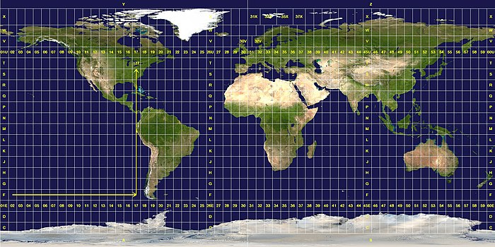

::: {.caption}
Grilla UTM mundial. Chile se extiende entre las zonas 18 y 19.
:::
:::
:::

# Tipos de datos espaciales {.section-slide}

## Vector y Raster

::: columns
::: {.column width="48%"}
**Vector**

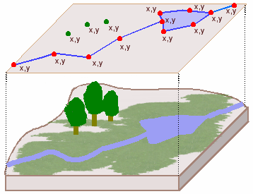

::: {.caption}
Puntos, líneas y polígonos. Representan objetos discretos.
:::
:::
::: {.column width="48%"}
**Raster**


::: {.caption}
Grilla regular de celdas (píxeles). Representa fenómenos continuos.
:::
:::
:::

# A: Inducción a proyectos reproducibles en QGIS {.section-slide}

## ¿Por qué un proyecto reproducible?

- Tu análisis debe poder **ser retomado** por ti en otra sesión o en otro computador
- Debe poder **ser comprendido y replicado** por otra persona
- Las **rutas relativas** permiten mover toda la carpeta sin romper nada

::: {.box}
**Regla de oro:** los datos originales nunca se modifican — se trabaja siempre con copias en `procesados/`
:::

---

## Estructura de carpetas

```{mermaid}
%%| fig-width: 10
flowchart LR
    A["📁 clase2/"] --> B["📁 datos/"]
    A --> C["📁 documentos/"]
    A --> D["📁 proyectos/"]
    A --> E["📁 resultados/"]

    B --> F["📁 brutos/ 🔒"]
    B --> G["📁 intermedios/"]
    B --> H["📁 procesados/"]

    E --> I["📁 mapas/"]
    E --> J["📁 figuras/"]

    style F fill:#fde8e8,stroke:#c0392b
    style G fill:#fef9e7,stroke:#f39c12
    style H fill:#eafaf1,stroke:#27ae60
    style D fill:#eaf4fb,stroke:#2980b9
    style C fill:#f4f6f7,stroke:#7f8c8d
```

---

## Abrir el proyecto en QGIS

1. Descarga y descomprime el `.zip` Tarea 2 de los materiales de la clase
2. Abre la <a href="https://felipejordanc.github.io/sus2211" target="_blank">página web del curso</a> y navega a la Tarea 2
3. Iniciaremos juntos esta primera guía


