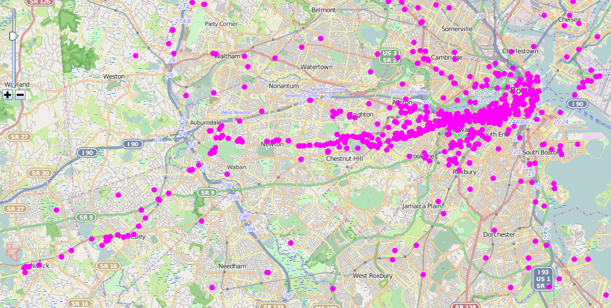
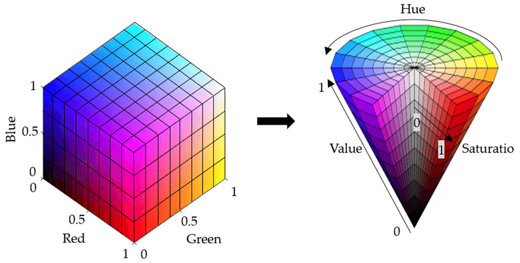

## Plan para hoy

### Primer bloque

- CT: Exclusión, pobreza y conflicto
- A+R: La raíz del conflicto
- CT: Fundamentos para la elaboración de mapas efectivos en QGIS
- A+R: Revisión crítica de mapas

### Segundo bloque

- Taller: Pobreza y comunidades Mapuche en la Araucanía

# CT: Exclusión, pobreza y conflicto {.section-slide background-color="#2a7f62"}

## ¿Cuáles son las raíces del conflicto Estado Chileno-Pueblo Mapuche? {.question-slide}

::: columns
::: {.column width="48%"}
{width="100%"}

{width="100%"}
:::
::: {.column width="48%"}
{width="100%"}

{width="100%"}
:::
:::

---

## Pueblo Mapuche: una historia de despojo

- Pueblo Mapuche vivía de la ganadería a gran escala antes de la ocupación de su territorio
- Único pueblo originario de gran población que mantuvo independencia del Imperio Español
- Entre 1860 y 1883, su territorio es incorporado a la fuerza a Chile y Argentina
- Chile define legislación específica para conformar la propiedad privada en el nuevo territorio (Leyes de 1866 y 1874)

::: {.caption}
{width="80%"}
:::

---

## Títulos de Merced (1884–1929)

- Entre 1884 y 1929, el Estado otorgó derechos de propiedad colectivos al pueblo Mapuche a través de "Títulos de Merced" (TDM)
- En teoría, el Estado respetaría los derechos de propiedad ya establecidos por el uso continuo de los Mapuche
- En la práctica, abundaron los abusos para despojar a los Mapuche de sus tierras: solo un **10% del territorio** fue asignado a los TDM

::: columns
::: {.column width="60%"}
{width="100%"}
:::
::: {.column width="38%"}
::: {.small .muted}
Fuente: Jordán & Heilmayr (2024)
:::
:::
:::

---

## División de comunidades (1930)

- Mientras se asignaban los últimos TDM, se desarrollaba una nueva ley para dividir las tierras comunitarias en parcelas individuales
- Así, hacia 1930, se crean cinco "Juzgados de Indios" para dividir a las comunidades

{width="80%"}

::: {.small .muted}
Fuente: Jordán & Heilmayr (2024)
:::

---

## Ventas fraudulentas (1943–1946)

- Entre 1943 y 1946 se levantan las restricciones para comprar parcelas en TDM
- El número de ventas explota durante el periodo
- Muchas de estas ventas fueron fraudulentas
- Al reestablecer las restricciones en 1947, el Congreso Nacional declaró las ventas del periodo nulas, pero la Corte Suprema declaró inconstitucional el efecto retroactivo

{width="80%"}

::: {.small .muted}
Fuente: Jordán y Heilmayr (2024)
:::

---

## Reforma Agraria y contra-reforma

- Los Mapuche fueron beneficiarios de la Reforma Agraria, sobre todo de las expropiaciones de la Unidad Popular
- Sin embargo, toda esta ganancia fue revertida en la contra-reforma durante la dictadura militar

{width="80%"}

::: {.small .muted}
Fuente: Jaimovich y Jordán (2024)
:::

---

## División de los TDM restantes (1980s)

- Luego, en la década de 1980, casi todos los TDM que quedaban indivisos fueron divididos

{width="80%"}

::: {.small .muted}
Fuente: Jordán y Heilmayr (2024)
:::

---

## Pobreza Mapuche persistente

- La división no trajo las mejoras que se esperaban de ella...
- Los mapuche siguen siendo de las poblaciones **más pobres de Chile**

::: columns
::: {.column width="50%"}
{width="100%"}

::: {.caption}
Fuente: Agostini et al. (2010). Figura refleja pobreza e indigencia en 2002.
:::
:::
::: {.column width="48%"}
{width="100%"}

::: {.caption}
Fuente: Elaboración propia a partir de las encuestas CASEN.
:::
:::
:::

---

## El conflicto ha aumentado en el tiempo

- Y los eventos de conflicto han aumentado en el tiempo

{width="80%"}

::: {.small .muted}
Fuente: Cayul et al. (2022)
:::

---

## Concentración en la IX Región

- Los eventos de conflicto se han concentrado en la IX Región

{width="80%"}

::: {.small .muted}
Fuente: Cayul et al. (2022)
:::

# A+R: La raíz del conflicto {.section-slide background-color="#2a7f62"}

## A+R: La raíz del conflicto {.question-slide}

En base a la lectura y el material realizado hasta ahora, reflexionen en parejas respecto a las siguientes preguntas:

- ¿Cuáles son las raíces históricas del rezago económico del pueblo Mapuche?
- ¿Qué relación guarda el rezago con el conflicto?
- ¿Se solucionaría el conflicto corrigiendo las desigualdades económicas?

# CT: Mapas efectivos {.section-slide background-color="#2a7f62"}

## Mapas efectivos

- En la clase anterior, exploramos la visualización de datos vectoriales en QGIS
- Ahora, revisaremos algunos principios para realizar **mapas efectivos**

---

## Elementos típicos de un mapa {.map-slide}

{width="100%"}

::: {.caption}
Fuente: https://volaya.github.io/libro-sig/chapters/Mapas.html
:::

---

## Elementos típicos: Título

::: columns
::: {.column width="55%"}
**Título:**

Debe ser muy sintético. Puede no ser necesario si el mapa es parte de una figura con un título.
:::
::: {.column width="43%"}
{width="100%"}

::: {.caption}
Fuente: https://volaya.github.io/libro-sig/chapters/Mapas.html
:::
:::
:::

---

## Elementos típicos: Mapa detalle

::: columns
::: {.column width="55%"}
**Mapa detalle:**

A veces es útil mostrar el detalle de una sección del mapa.
:::
::: {.column width="43%"}
{width="100%"}

::: {.caption}
Fuente: https://volaya.github.io/libro-sig/chapters/Mapas.html
:::
:::
:::

---

## Elementos típicos: Mapa contexto

::: columns
::: {.column width="55%"}
**Mapa contexto:**

Importante cuando la audiencia no está familiarizada con el contexto geográfico.
:::
::: {.column width="43%"}
{width="100%"}

::: {.caption}
Fuente: https://volaya.github.io/libro-sig/chapters/Mapas.html
:::
:::
:::

---

## Elementos típicos: Leyenda

::: columns
::: {.column width="55%"}
**Leyenda:**

La simbología del mapa debe estar en una leyenda. No usar título "leyenda" en la leyenda.
:::
::: {.column width="43%"}
{width="100%"}

::: {.caption}
Fuente: https://volaya.github.io/libro-sig/chapters/Mapas.html
:::
:::
:::

---

## Elementos típicos: Escala

::: columns
::: {.column width="55%"}
**Escala:**

Es necesaria en la mayoría de las ocasiones, aunque en algunos mapas puede omitirse cuando la escala es conocida (mapa mundi).
:::
::: {.column width="43%"}
{width="100%"}

::: {.caption}
Fuente: https://volaya.github.io/libro-sig/chapters/Mapas.html
:::
:::
:::

---

## Elementos típicos: Rosa de los vientos

::: columns
::: {.column width="55%"}
**Rosa de los vientos:**

Solo necesaria cuando el mapa no está orientado hacia el norte.
:::
::: {.column width="43%"}
{width="100%"}

::: {.caption}
Fuente: https://volaya.github.io/libro-sig/chapters/Mapas.html
:::
:::
:::

---

## Elementos típicos: Marco

::: columns
::: {.column width="55%"}
**Marco:**

Por lo general, es bueno añadir un marco.
:::
::: {.column width="43%"}
{width="100%"}

::: {.caption}
Fuente: https://volaya.github.io/libro-sig/chapters/Mapas.html
:::
:::
:::

---

## Elementos típicos: Notas

**Notas:**

El mapa debe ser autocontenido, por lo que se debe agregar una nota indicando quién lo realizó y en base a qué información. También puede ahondar en más detalle en lo que ilustra el mapa u otros detalles importantes.

> Notas: Elaboración propia en base a datos de ...

---

## Optimizar el espacio {.map-slide}

{width="100%"}

::: {.caption}
Fuente: https://volaya.github.io/libro-sig/chapters/Mapas.html
:::

---

## Principio guía 1

> Los mapas se deben **ver**, no leer.

Para que los mapas se vean, es fundamental entender la **naturaleza del dato** que se mapea y elegir una **visualización acorde**.

---

## Datos vectoriales {.map-slide}

{width="100%"}

::: {.caption}
Fuente: https://volaya.github.io/libro-sig/chapters/Mapas.html
:::

---

## Datos vectoriales + mapa base {.map-slide}

{width="100%"}

::: {.caption}
Datos vectoriales combinados con **mapa base o fondo (raster)**. Fuente: https://volaya.github.io/libro-sig/chapters/Mapas.html
:::

---

## Puntos: con opacidad inadecuada {.map-slide}

{width="80%"}

::: {.caption}
Cada punto representa un Tweet sobre la maratón de Boston. La opacidad dificulta apreciar la densidad. Fuente: https://jeffreymorgan.io/articles/information-density-visualization/
:::

Los puntos son útiles para mostrar hitos en el espacio. Si son muchos puntos, hay que tener cuidado en no saturar el mapa. **La transparencia puede ayudar.**

---

## Puntos: con transparencia adecuada {.map-slide}

::: columns
::: {.column width="55%"}
{width="100%"}

::: {.caption}
La transparencia revela la densidad con claridad. Fuente: https://jeffreymorgan.io/articles/information-density-visualization/
:::
:::
::: {.column width="43%"}
- Los puntos son útiles para mostrar hitos en el espacio
- Si son muchos puntos, la **transparencia puede ayudar**
- Cuando son de distintos tipos, se pueden elegir colores distintos o símbolos
- También se puede utilizar el **tamaño** para visualizar un valor continuo
:::
:::

---

## Puntos: tamaño proporcional {.map-slide}

{width="80%"}

::: {.caption}
El tamaño de los puntos puede representar un valor continuo. Fuente: Jordán and Di Gregorio (2024)
:::

---

## Puntos: colores y símbolos {.map-slide}

{width="80%"}

::: {.caption}
Cuando los puntos son de distintos tipos, se pueden elegir colores distintos o símbolos.
:::

---

## Líneas {.map-slide}

::: columns
::: {.column width="55%"}
- Las líneas se utilizan para representar elementos que ocupan una disposición lineal en el espacio, tanto reales (e.g., ríos, caminos, trenes) como ficticios (e.g., límites jurisdiccionales)
- Se pueden utilizar el color y la forma para mostrar distintos tipos
- Hay formas y colores convencionales — se deben usar cuando sea posible
:::
::: {.column width="43%"}
{width="100%"}

::: {.caption}
Fuente: https://escenarioshidricos.cl/nuestro-trabajo/cuenca-del-rio-maipo/
:::
:::
:::

---

## Líneas: ejemplos {.map-slide}

{width="100%"}

---

## Polígonos: territorios indígenas {.map-slide}

::: columns
::: {.column width="55%"}
- Los polígonos se utilizan para demarcar elementos en el espacio que usan un área determinada (e.g., comuna, parcela, ciudad)
- Pueden representar una partición del espacio (e.g., comunas) o elementos repartidos en el espacio (e.g. territorios indígenas)
- Es fundamental utilizar adecuadamente el **color** para representar la información deseada
:::
::: {.column width="43%"}
{width="100%"}

::: {.caption}
Fuente: Jordán & Heilmayr (2024)
:::
:::
:::

---

## Polígonos: choropleth {.map-slide}

{width="80%"}

::: {.caption}
Mapa choropleth: el color de cada polígono representa un valor. Fuente: Wikipedia, GDP per capita by Indian state.
:::

---

## Color: el espectro visible {.map-slide}

{width="100%"}

::: {.caption}
El espectro de luz visible. Fuente: iStockphoto.
:::

---

## Color: percepción humana {.map-slide}

::: columns
::: {.column width="55%"}
- No todas las personas perciben el color de la misma manera
- La percepción del color depende de los **fotorreceptores** del ojo

{width="100%"}

::: {.caption}
Fuente: https://www.datacolor.com/business-solutions/blog/why-we-cant-agree-color-perception/
:::
:::
::: {.column width="43%"}
::: columns
::: {.column width="48%"}
{width="100%"}

::: {.caption}
Estructura de cono (fotorreceptor de color).
:::
:::
::: {.column width="48%"}
{width="100%"}

::: {.caption}
Anatomía de un bastón (fotorreceptor de luz/oscuridad).
:::
:::
:::

{width="100%"}

::: {.caption}
Fuente: Wikipedia, Photoreceptor cell.
:::
:::
:::

---

## Color: representación digital RGB

::: columns
::: {.column width="55%"}
**Representación digital RGB:**

- Cada color es representado por **8 bits**: 2⁸ = 256 valores
- Se utiliza el sistema **hexadecimal** (base 16) para expresar los 8 bits con dos símbolos:
  - `0, 1, 2, 3, 4, 5, 6, 7, 8, 9, a, b, c, d, e, f`
- En decimal: 125 = 1×10² + 2×10¹ + 5×10⁰
- En hexadecimal: `7d` = 7×16¹ + 13×16⁰
- Con tres canales (RGB): **256³ = 16,777,216** colores posibles
- El rojo puro se escribe: **`#ff0000`**
:::
::: {.column width="43%"}
{width="100%"}

::: {.caption}
Crédito imagen: Yi et al. (2022). *Sensors*. 22. 2021.
:::
:::
:::

---

## Color: teoría del color {.map-slide}

{width="80%"}

::: {.caption}
Rueda de color: colores primarios, secundarios y terciarios. Fuente: https://easyedit.pro/blog/the-basic-color-theory-with-examples/
:::

---

## Color: daltonismo {.map-slide}

::: columns
::: {.column width="55%"}
{width="100%"}

::: {.caption}
Percepción del color según distintos tipos de visión. Fuente: https://webvision.med.utah.edu/
:::
:::
::: {.column width="43%"}
{width="100%"}

::: {.caption}
Los colores que ven quienes tienen daltonismo rojo-verde, azul-amarillo y daltonismo completo, versus la rueda de color normal. Fuente: https://www.healthdirect.gov.au/colour-blindness
:::
:::
:::

---

## Color: ColorBrewer {.map-slide}

{width="80%"}

::: {.caption}
Explora <a href="https://colorbrewer2.org/#type=sequential&scheme=BuGn&n=3" target="_blank">ColorBrewer</a> — paletas de colores diseñadas para mapas, con opciones para daltonismo.
:::

---

## Principio guía 2

> **Menos es más.**

::: columns
::: {.column width="50%"}
{width="100%"}

::: {.caption}
Ejemplo de mapa con exceso de información y capas.
:::
:::
::: {.column width="48%"}
{width="100%"}

::: {.caption}
Mapa simplificado: más legible y efectivo.
:::
:::
:::

# A+R: Revisión Crítica de Mapas {.section-slide background-color="#2a7f62"}

## A+R: Revisión Crítica de Mapas {.activity-slide}

1. Vuelvan a la lectura asignada para la clase de hoy
2. Revisen los mapas del artículo
3. En base a lo visto hoy, sugieran **mejoras** para los mapas del artículo

# Taller: Pobreza y comunidades Mapuche {.section-slide background-color="#2a7f62"}

## Taller {.activity-slide}

1. Descarguen el material de la clase en una carpeta. Recuerden al final de la clase subir todo a su OneDrive
2. Descarguen la guía de apoyo
3. Desarrollen la guía en parejas
4. El equipo docente estará disponible para apoyarlos
