## Plan para hoy

### Primer bloque

- CT: Pueblos Indígenas, derechos y sustentabilidad
- CT: El caso del Pueblo Mapuche
- CT: Mapas efectivos

### Segundo bloque
- CT: Color
- Actividad: Proyecto semestral

# CT: Pueblos Indígenas, Derechos y Sustentabilidad {.section-slide background-color="#2a7f62"}

## El "encuentro" de dos mundos

::: columns
::: {.column width="48%"}
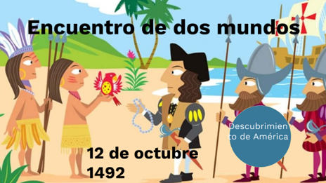{width="100%"}

::: {.caption}
"El Día de la Hispanidad... conmemorar este hecho tan importante para la humanidad." — Escuela Mundopalabra
:::
:::
::: {.column width="48%"}
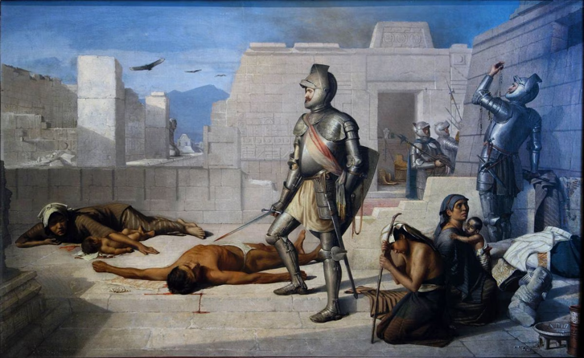{width="100%"}

::: {.caption}
La Conquista de Cholula, Félix Parra (1877)
:::
:::
:::

---

## El mayor holocausto de la historia {.compact}

::: columns
::: {.column width="60%"}
> "Stannard ha estimado que casi 100 millones de indígenas en el hemisferio occidental murieron o fallecieron prematuramente a causa de los europeos y sus descendientes durante los últimos cinco siglos."

::: {.small .muted}
Smith, D. M. (2017). *Counting the dead: Estimating the loss of life in the Indigenous Holocaust.* Native American Symposium.
:::
:::
::: {.column width="38%"}
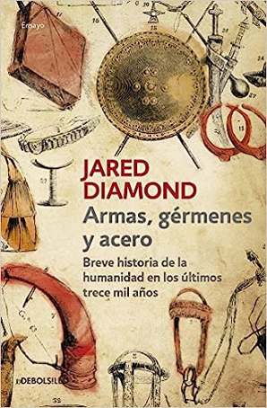{width="100%"}
:::
:::

---

## La huella en el registro climático

::: columns
::: {.column width="50%"}
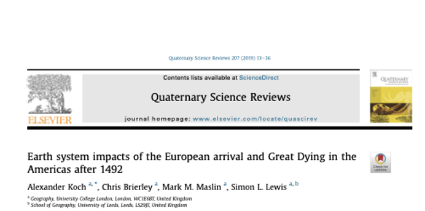{width="100%"}
:::
::: {.column width="48%"}
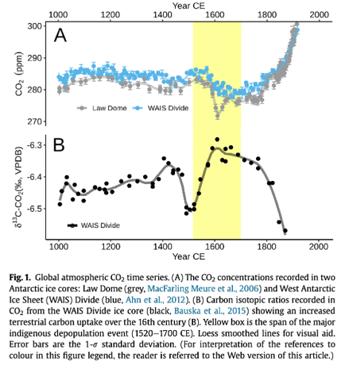{width="100%"}

::: {.caption}
El colapso demográfico redujo la presión sobre la tierra, permitiendo la regeneración forestal — registrada como una caída en el CO₂ atmosférico hacia 1610 (Koch et al., 2019).
:::
:::
:::

---

## Del 12 de octubre al 21 de junio

::: columns
::: {.column width="33%"}
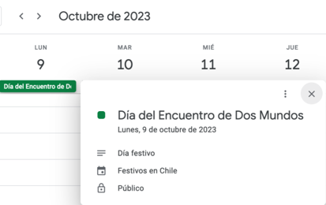{width="100%"}

::: {.caption}
Chile celebraba el 12 de octubre como "Día del Encuentro de Dos Mundos"
:::
:::
::: {.column width="33%"}
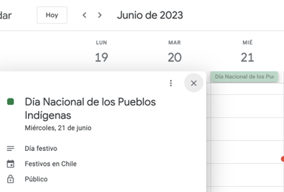{width="100%"}

::: {.caption}
En 2021 se reemplazó por el "Día Nacional de los Pueblos Indígenas", el 21 de junio
:::
:::
::: {.column width="33%"}
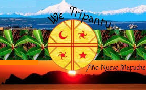{width="100%"}

::: {.caption}
We Tripantu — el Año Nuevo Mapuche, celebrado en el solsticio de invierno
:::
:::
:::

---

## Derechos de los PP.OO: de la colonia al siglo XX {.compact}

::: columns
::: {.column width="18%"}
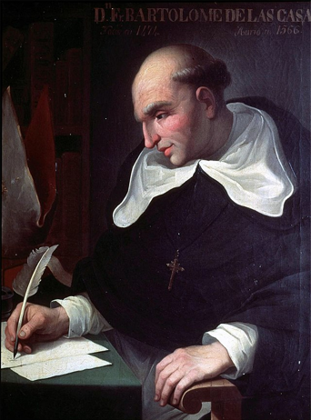{width="100%"}

::: {.caption}
Fray Bartolomé de las Casas, primer "Protector de Indios"
:::
:::
::: {.column width="78%"}
::: {.two-level}
- **Era colonial:** primer reconocimiento formal de derechos
  - Bartolomé de las Casas convenció al rey Carlos I de prohibir la esclavitud indígena (Las Nuevas Leyes, 1542)
  - En la práctica, la semi-esclavitud persistió hasta el fin de la colonia
- **Post-independencia:** derechos individuales condicionados a la sumisión política
  - Los que no se sometían eran tratados como enemigos internos
  - Políticas asimilacionistas ("civilizadoras") dominaron durante casi todo el siglo XX
  - Bajo estándares modernos: **genocidios culturales**
:::
:::
:::

---

## Marco internacional de derechos {.compact}

::: columns
::: {.column width="26%"}
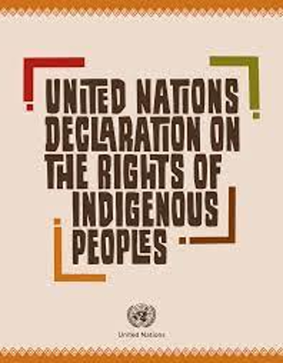{width="100%"}
:::
::: {.column width="70%"}
- **Convenio 107 OIT (1957):** primer instrumento internacional con derechos específicos para PP.OO; orientación asimilacionista, buscaba "integrar" a los pueblos al desarrollo nacional
- **Convenio 169 OIT (1989):** reemplazó al 107; reconoce el derecho al desarrollo propio y la consulta previa — Chile lo ratificó en **2009**
- **DNUDPI (2007):** reconoce la libre determinación y los derechos sobre tierras y territorios ancestrales
:::
:::

---

## Dos visiones del desarrollo {.compact}

::: columns
::: {.column width="48%"}
::: {.box}
**Visión desarrollista**

El proceso de desarrollo es universal; las "formas primitivas" de los PP.OO lo obstaculizan

Los rasgos culturales pueden preservarse solo si no son un obstáculo para el progreso
:::
:::
::: {.column width="48%"}
::: {.box}
**Visión moderna**

El desarrollo se entiende como parte del desarrollo social y cultural propio de cada pueblo

**Desarrollo con identidad:** corresponde a cada PP.OO definir sus objetivos y cómo alcanzarlos, con el apoyo (si lo desean) del Estado
:::
:::
:::

---

## Los PP.OO y el desarrollo sustentable {.compact}

::: columns
::: {.column width="50%"}
- Los PP.OO están **sobrerrepresentados entre los más pobres** de América Latina
- Sus territorios se superponen con regiones clave para la **preservación de la biodiversidad y el cambio climático**

::: {.small .muted}
The World Bank (2015). *Indigenous Latin America in the Twenty-First Century.*
:::
:::
::: {.column width="48%"}
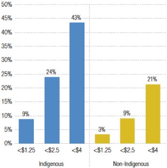{width="100%"}

::: {.caption}
Pobreza indígena vs. no indígena en América Latina (promedio ponderado: Bolivia, Brasil, Ecuador, Guatemala, México y Perú, fines de los 2000s)
:::
:::
:::

---

## Custodios del territorio: la evidencia {.compact}
::: {.two-level}
- Los pueblos indígenas gestionan hasta el **25% de la superficie terrestre** del planeta
- Sus territorios se superponen con el **40% de las áreas protegidas** del mundo
- La evidencia científica es contundente: con derechos seguros, los pueblos indígenas son **más efectivos conservando sus territorios** que los colonos no indígenas
  - Nepstad et al. (2006): territorios indígenas en Brasil = "la barrera más importante a la deforestación amazónica"
  - Baragwanath et al. (2020, 2023): el reconocimiento formal (no solo la demarcación) reduce drásticamente la deforestación y aumenta la reforestacion
  - Alejo et al. (2021): mayor stock de carbono dentro de territorios indígenas en Colombia, Perú, Ecuador, Brasil y Panamá
:::

---

## ¿Por qué importa para la sustentabilidad?

La desigualdad histórica no es solo una injusticia del pasado — es una **barrera presente** para enfrentar la crisis ambiental:

- Sin derechos seguros, los pueblos indígenas no pueden ejercer su rol de custodios
- La pobreza y la marginalización reducen su capacidad de resistir presiones extractivistas externas
- Corregir las desigualdades históricas no es solo un imperativo ético: es una **estrategia de sustentabilidad**

# CT: El caso del Pueblo Mapuche {.section-slide background-color="#2a7f62"}

## ¿Cuáles son las raíces del conflicto Estado Chileno-Pueblo Mapuche? {.question-slide}

::: columns
::: {.column width="48%"}
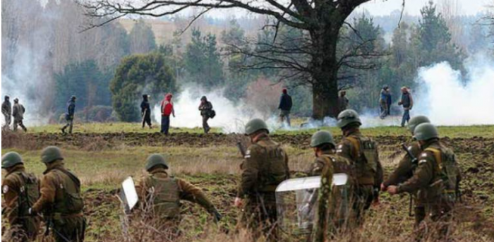{width="80%"}

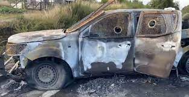{width="80%"}
:::
::: {.column width="48%"}
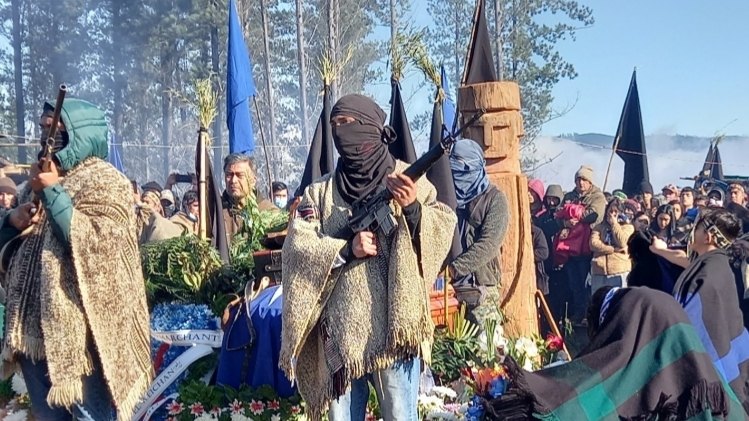{width="60%"}

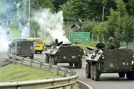{width="60%"}
:::
:::

---

## Pueblo Mapuche: una historia de despojo {.compact}

::: columns
::: {.column width="58%"}
- Pueblo Mapuche vivía de la ganadería a gran escala antes de la ocupación de su territorio
- Único pueblo originario de gran población que mantuvo independencia del Imperio Español
- Entre 1860 y 1883, su territorio es incorporado a la fuerza a Chile y Argentina
- Chile define legislación específica para conformar la propiedad privada en el nuevo territorio (Leyes de 1866 y 1874)
:::
::: {.column width="39%"}
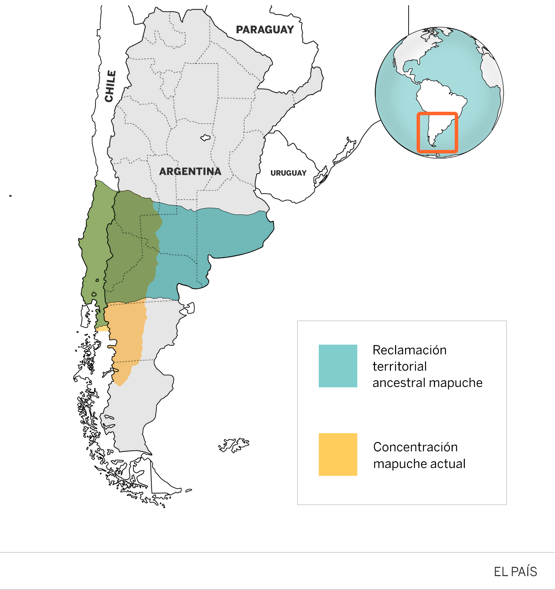{width="100%"}
:::
:::

---

## Títulos de Merced (1884–1929) {.compact}

::: columns
::: {.column width="59%"}
- Entre 1884 y 1929, el Estado otorgó derechos de propiedad colectivos al pueblo Mapuche a través de "Títulos de Merced" (TDM)
- En teoría, el Estado respetaría los derechos de propiedad ya establecidos por el uso continuo de los Mapuche
- En la práctica, abundaron los abusos para despojar a los Mapuche de sus tierras: solo un **10% del territorio** fue asignado a los TDM
:::
::: {.column width="39%"}
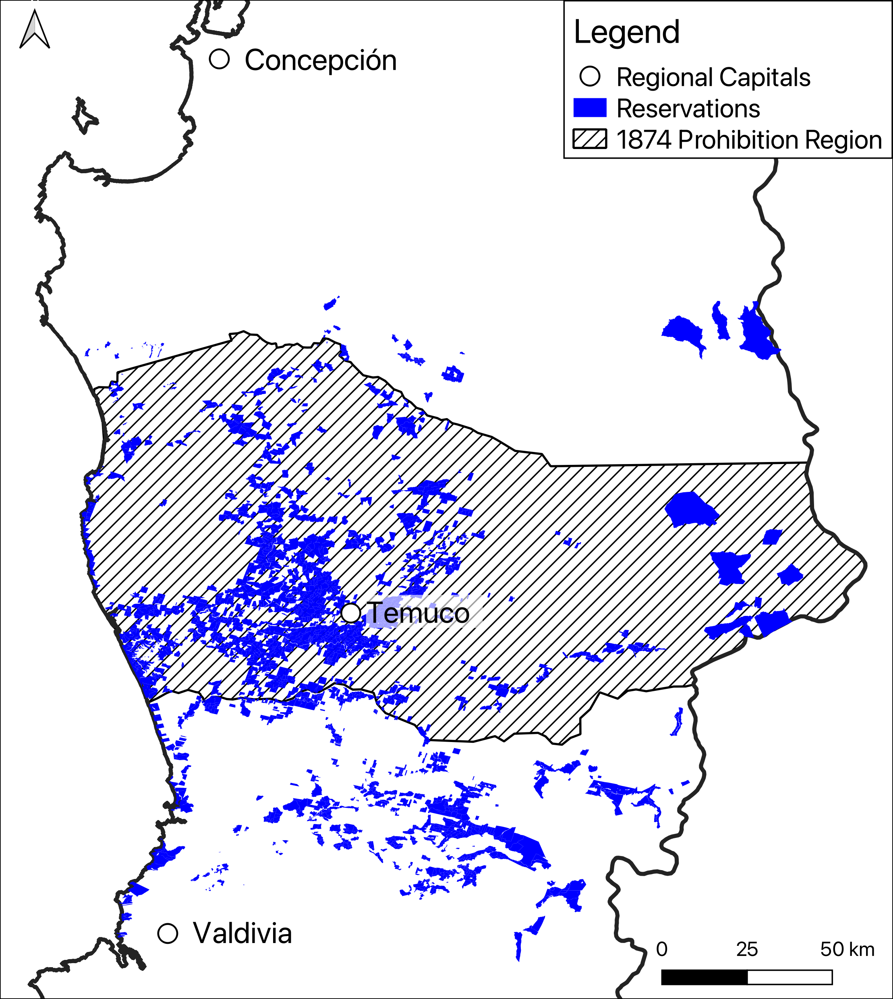{width="100%"}

::: {.small .muted}
Fuente: Jordán & Heilmayr (2024)
:::
:::
:::

---

## División de comunidades (1930-1952)

::: columns
::: {.column width="59%"}
- Mientras se asignaban los últimos TDM, se desarrollaba una nueva ley para dividir las tierras comunitarias en parcelas individuales
- Así, hacia 1930, se crean cinco "Juzgados de Indios" para dividir a las comunidades
:::
::: {.column width="39%"}
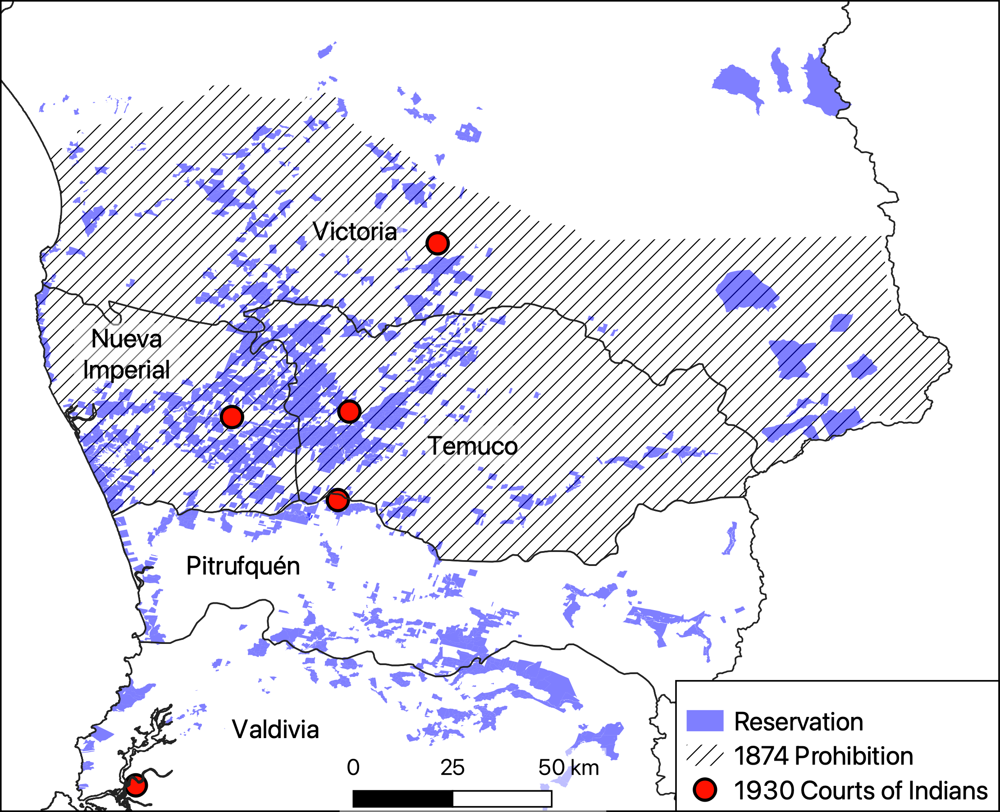{width="80%"}

::: {.small .muted}
Fuente: Jordán & Heilmayr (2024)
:::
:::
:::

---

## Ventas fraudulentas (1943–1946) {.compact}

::: columns
::: {.column width="59%"}
- Entre 1943 y 1946 se levantan las restricciones para comprar parcelas en TDM
- El número de ventas explota durante el periodo
- Muchas de estas ventas fueron fraudulentas
- Al reestablecer las restricciones en 1947, el Congreso Nacional declaró las ventas del periodo nulas, pero la Corte Suprema declaró inconstitucional el efecto retroactivo

:::
::: {.column width="39%"}
{width="80%"}

::: {.small .muted}
Fuente: Jordán & Heilmayr (2024)
:::
:::
:::

---

## Reforma Agraria y contra-reforma

- Los Mapuche fueron beneficiarios de la Reforma Agraria, sobre todo de las expropiaciones de la Unidad Popular
- Sin embargo, toda esta ganancia fue revertida en la contra-reforma durante la dictadura militar

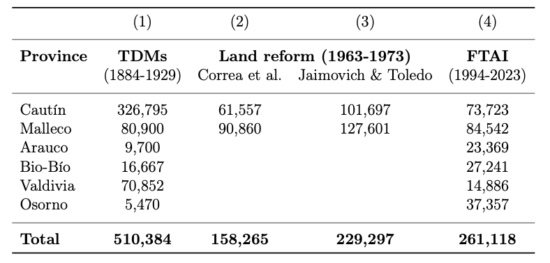{width="100%"}

::: {.caption}
Fuente: Jaimovich y Jordán (2024)
:::

---

## División de los TDM restantes (1980s)

Luego, en la década de 1980, casi todos los TDM que quedaban indivisos fueron divididos

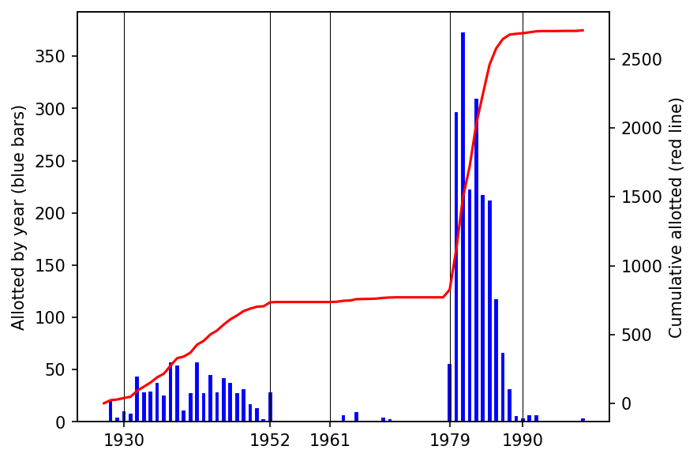{width="80%"}

::: {.caption}
Fuente: Jordán y Heilmayr (2024)
:::

---

## Pobreza Mapuche persistente

::: {.caption}
La división no trajo las mejoras que se esperaban de ella... los mapuche siguen siendo de las poblaciones **más pobres de Chile**
:::

::: columns
::: {.column width="40%"}
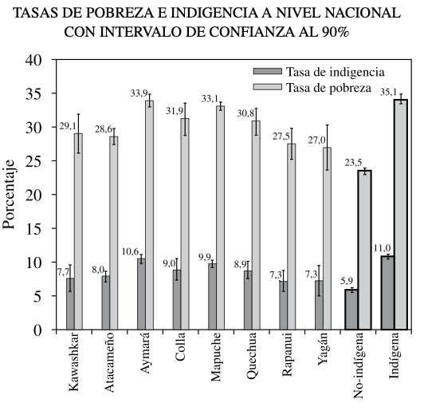{width="100%"}

::: {.caption}
Fuente: Agostini et al. (2010). Figura refleja pobreza e indigencia en 2002.
:::
:::
::: {.column width="58%"}
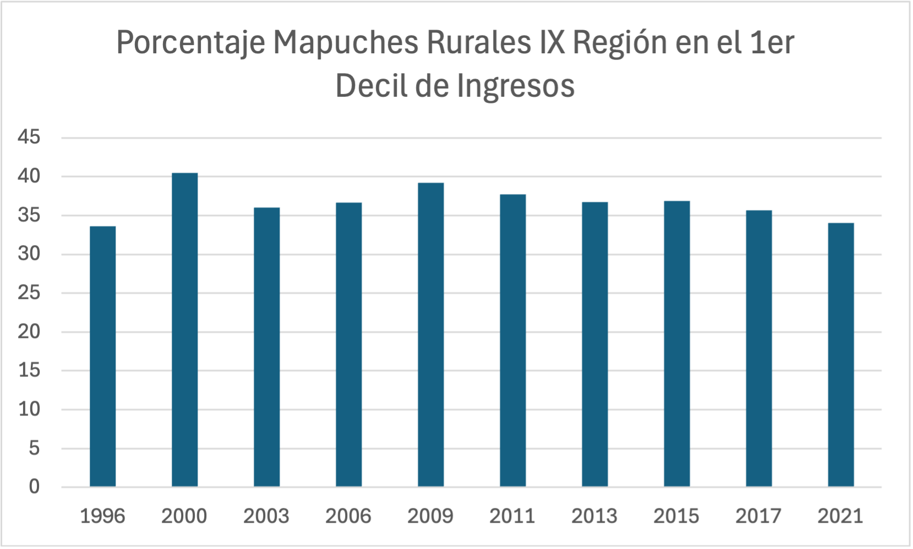{width="100%"}

::: {.caption}
Fuente: Elaboración propia a partir de las encuestas CASEN.
:::
:::
:::

---

## El conflicto ha aumentado en el tiempo

Y los eventos de conflicto han aumentado en el tiempo

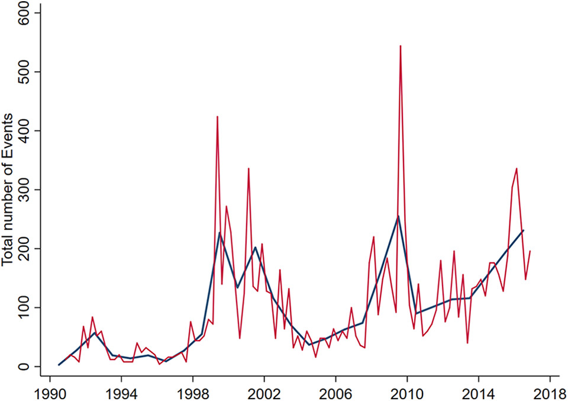{width="80%"}

::: {.caption}
Fuente: Cayul et al. (2022)
:::

---

## Concentración en la IX Región

::: columns
::: {.column width="50%"}
Los eventos de conflicto se han concentrado en la IX Región
:::
::: {.column width="28%"}
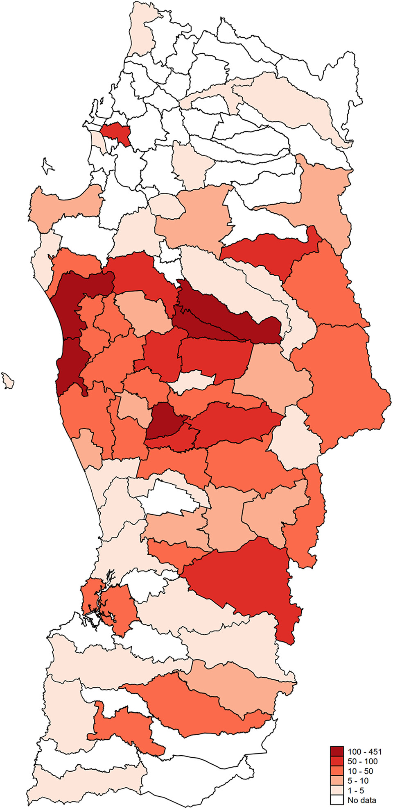{width="80%"}

::: {.caption}
Fuente: Cayul et al. (2022)
:::
:::
:::

---

## Un territorio transformado: el legado ambiental del despojo {.compact}

- La colonización no solo desplazó personas — **transformó el paisaje**
- **Deforestación masiva:** los bosques nativos fueron talados para producción maderera y apertura de tierras agrícolas en pocas décadas
- **Erosión severa:** la producción intensiva de trigo en laderas desnudas generó pérdida masiva de suelos en la región
- **Plantaciones forestales:** representan para muchos una continuación de una historia de despojo y sobreexplotación del territorio ancestral

> Las tierras reclamadas son una fracción pequeña y degradada del territorio ancestral

::: {.caption}
Klubock, T.M. (2014). *La Frontera: Forests and Ecological Conflict in Chile's Frontier Territory.* Duke University Press.
:::

---

## La Ley Indígena de 1993 y el FTAI {.compact}

- Con el retorno a la democracia, Chile aprueba la **Ley Indígena 19.253 (1993)**, creando CONADI y el Fondo de Tierras y Aguas Indígenas (**FTAI**)
- El programa FTAI-20B establece la restitución de tierras a comunidades Mapuche como mecanismo de reparación histórica
- Entre 1994 y 2023: más de **200.000 ha restituidas** a 493 comunidades, con una inversión superior a US$850 millones
- El objetivo declarado: reparar el despojo y apoyar el desarrollo con uso **ecológicamente equilibrado** de las tierras

::: {.box}
**La pregunta que surge:** ¿puede la restitución de tierras profundamente degradadas revertir siglos de transformación ecológica — y es justo pedirlo?
:::

---

## Restitución y medio ambiente: ¿qué dice la evidencia? {.compact}

- Jaimovich, Jordán, Black & Heilmayr (2026) estudia el impacto ambiental del FTAI-20B
- **Resultado en uso de suelo:** la restitución llevó a más praderas y menos plantaciones de pino/eucalipto — las comunidades ejercieron su preferencia por la ganadería
- **Resultado ambiental:** sin cambios significativos en carbono, biodiversidad ni erosión
- **¿Por qué?** Las tierras restituidas eran paisajes profundamente modificados — décadas de plantaciones e intensificación agropecuaria habían transformado el baseline ecológico

::: {.small .muted}
Jaimovich, Jordán, Black & Heilmayr (2026, en revisión). *Environmental impacts of Indigenous land restitution in Chile.*
:::

---

## ¿Mucho pedir? {.compact}

- La literatura muestra grandes beneficios ambientales cuando se protegen tierras indígenas **intactas**: menos deforestación, más carbono
- La restitución opera en un escenario distinto: paisajes devastados por décadas de despojo, plantaciones y agricultura intensiva

> Esperar que la restitución genere restauración ecológica es pedirle al despojado que repare lo que el despojador degradó

---

## ¿Indígena = Ecologista? {.compact .question-slide}

- Pero hay además una consideración ética más profunda: **la libre determinación significa que las comunidades no tienen obligación de ser "verdes"**
- El despojo transformó sus economías, sus instituciones y su relación con el territorio
- El primer derecho es decidir — sin condicionarlo a una agenda ambiental impuesta desde fuera

---

## Restitución no basta para restaurar {.compact}

- Si las comunidades Mapuche quieren restaurar sus territorios, el Estado debe acompañar activamente ese proceso — con financiamiento, asistencia técnica y reconocimiento del conocimiento tradicional
- Políticas que transfieren tierra sin conectar con restauración ecológica ni con los saberes territoriales de las comunidades difícilmente generarán co-beneficios ambientales

::: {.box}
**La lección:** prevenir el despojo es más eficaz que intentar revertirlo. Y cuando la restitución ocurre en paisajes degradados, necesita ir acompañada de inversión en restauración — no como condición, sino como apoyo.
:::

::: {.caption}
Jaimovich, Jordán, Black & Heilmayr (2026, en revisión).
:::

# CT: Mapas Efectivos {.section-slide background-color="#2a7f62"}

## Mapas efectivos

- En la clase anterior, exploramos la visualización de datos vectoriales en QGIS
- Ahora, revisaremos algunos principios para realizar **mapas efectivos**

---

## Elementos típicos de un mapa {.map-slide}

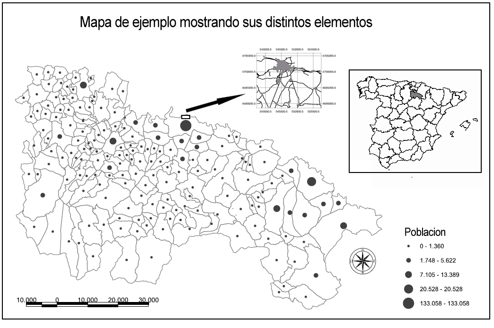{width="100%"}

::: {.caption}
Fuente: https://volaya.github.io/libro-sig/chapters/Mapas.html
:::

---

## Elementos típicos: Título

::: columns
::: {.column width="55%"}
**Título:**

Debe ser muy sintético. Puede no ser necesario si el mapa es parte de una figura con un título.
:::
::: {.column width="43%"}
{width="100%"}

::: {.caption}
Fuente: https://volaya.github.io/libro-sig/chapters/Mapas.html
:::
:::
:::

---

## Elementos típicos: Mapa detalle

::: columns
::: {.column width="55%"}
**Mapa detalle:**

A veces es útil mostrar el detalle de una sección del mapa.
:::
::: {.column width="43%"}
{width="100%"}

::: {.caption}
Fuente: https://volaya.github.io/libro-sig/chapters/Mapas.html
:::
:::
:::

---

## Elementos típicos: Mapa contexto

::: columns
::: {.column width="55%"}
**Mapa contexto:**

Importante cuando la audiencia no está familiarizada con el contexto geográfico.
:::
::: {.column width="43%"}
{width="100%"}

::: {.caption}
Fuente: https://volaya.github.io/libro-sig/chapters/Mapas.html
:::
:::
:::

---

## Elementos típicos: Leyenda

::: columns
::: {.column width="55%"}
**Leyenda:**

La simbología del mapa debe estar en una leyenda. No usar título "leyenda" en la leyenda.
:::
::: {.column width="43%"}
{width="100%"}

::: {.caption}
Fuente: https://volaya.github.io/libro-sig/chapters/Mapas.html
:::
:::
:::

---

## Elementos típicos: Escala

::: columns
::: {.column width="55%"}
**Escala:**

Es necesaria en la mayoría de las ocasiones, aunque en algunos mapas puede omitirse cuando la escala es conocida (mapa mundi).
:::
::: {.column width="43%"}
{width="100%"}

::: {.caption}
Fuente: https://volaya.github.io/libro-sig/chapters/Mapas.html
:::
:::
:::

---

## Elementos típicos: Rosa de los vientos

::: columns
::: {.column width="55%"}
**Rosa de los vientos:**

Solo necesaria cuando el mapa no está orientado hacia el norte.
:::
::: {.column width="43%"}
{width="100%"}

::: {.caption}
Fuente: https://volaya.github.io/libro-sig/chapters/Mapas.html
:::
:::
:::

---

## Elementos típicos: Marco

::: columns
::: {.column width="55%"}
**Marco:**

Por lo general, es bueno añadir un marco.
:::
::: {.column width="43%"}
{width="100%"}

::: {.caption}
Fuente: https://volaya.github.io/libro-sig/chapters/Mapas.html
:::
:::
:::

---

## Elementos típicos: Notas

**Notas:**

El mapa debe ser autocontenido, por lo que se debe agregar una nota indicando quién lo realizó y en base a qué información. También puede ahondar en más detalle en lo que ilustra el mapa u otros detalles importantes.

> Notas: Elaboración propia en base a datos de ...

---

## Optimizar el espacio {.map-slide}

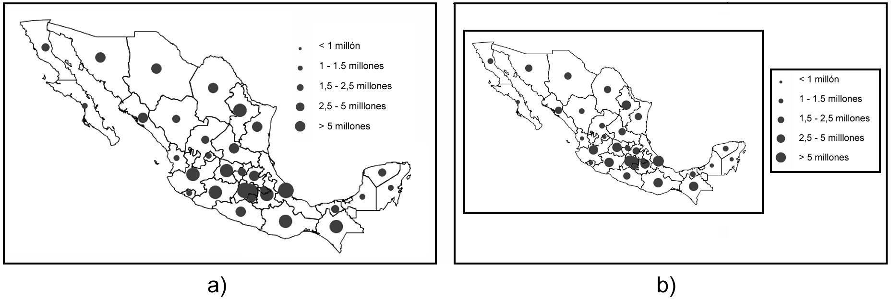{width="100%"}

::: {.caption}
Fuente: https://volaya.github.io/libro-sig/chapters/Mapas.html
:::

---

## Principio guía 1

> Los mapas se deben **ver**, no leer.

Para que los mapas se vean, es fundamental entender la **naturaleza del dato** que se mapea y elegir una **visualización acorde**.

---

## Datos vectoriales {.map-slide}

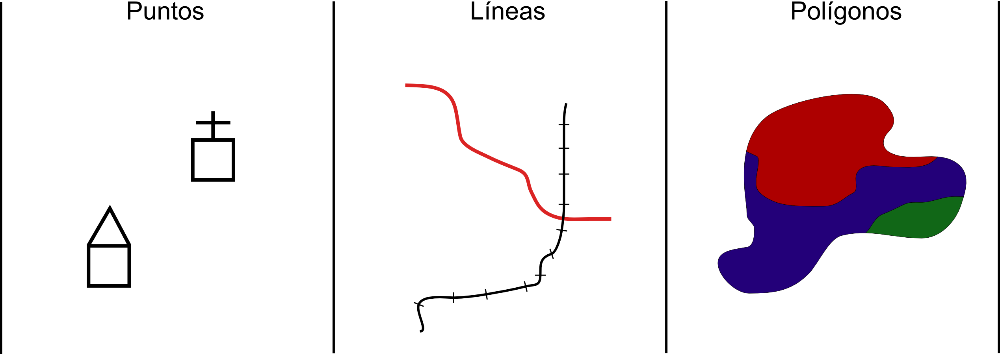{width="100%"}

::: {.caption}
Fuente: https://volaya.github.io/libro-sig/chapters/Mapas.html
:::

---

## Datos vectoriales + mapa base {.map-slide}

{width="100%"}

::: {.caption}
Datos vectoriales combinados con **mapa base o fondo (raster)**. Fuente: https://volaya.github.io/libro-sig/chapters/Mapas.html
:::

---

## Puntos: con transparencia inadecuada {.map-slide .compact}

::: columns
::: {.column width="55%"}
{width="100%"}

::: {.caption}
Cada punto representa un Tweet sobre la maratón de Boston. La opacidad dificulta apreciar la densidad. Fuente: https://jeffreymorgan.io/articles/information-density-visualization/
:::
:::
::: {.column width="43%"}
- Los puntos son útiles para mostrar hitos en el espacio
- Si son muchos puntos, la **transparencia puede ayudar**
- Cuando son de distintos tipos, se pueden elegir colores distintos o símbolos
- También se puede utilizar el **tamaño** para visualizar un valor continuo
:::
:::

---

## Puntos: con transparencia adecuada {.map-slide .compact}

::: columns
::: {.column width="55%"}
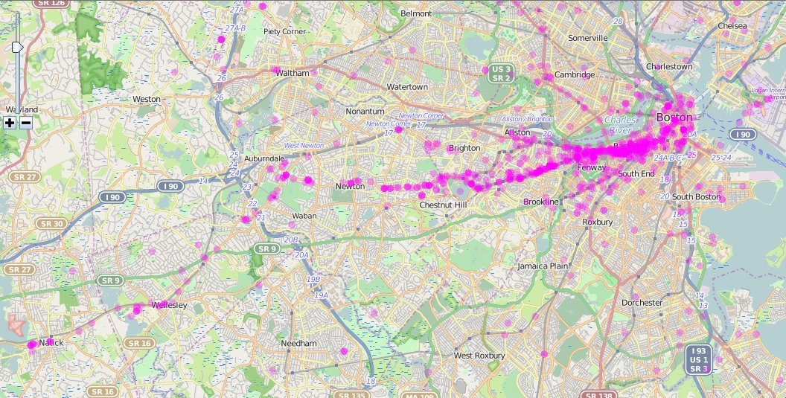{width="100%"}

::: {.caption}
La transparencia revela la densidad con claridad. Fuente: https://jeffreymorgan.io/articles/information-density-visualization/
:::
:::
::: {.column width="43%"}
- Los puntos son útiles para mostrar hitos en el espacio
- Si son muchos puntos, la **transparencia puede ayudar**
- Cuando son de distintos tipos, se pueden elegir colores distintos o símbolos
- También se puede utilizar el **tamaño** para visualizar un valor continuo
:::
:::

---

## Puntos: distintos símbolos {.map-slide .compact}

::: columns
::: {.column width="55%"}
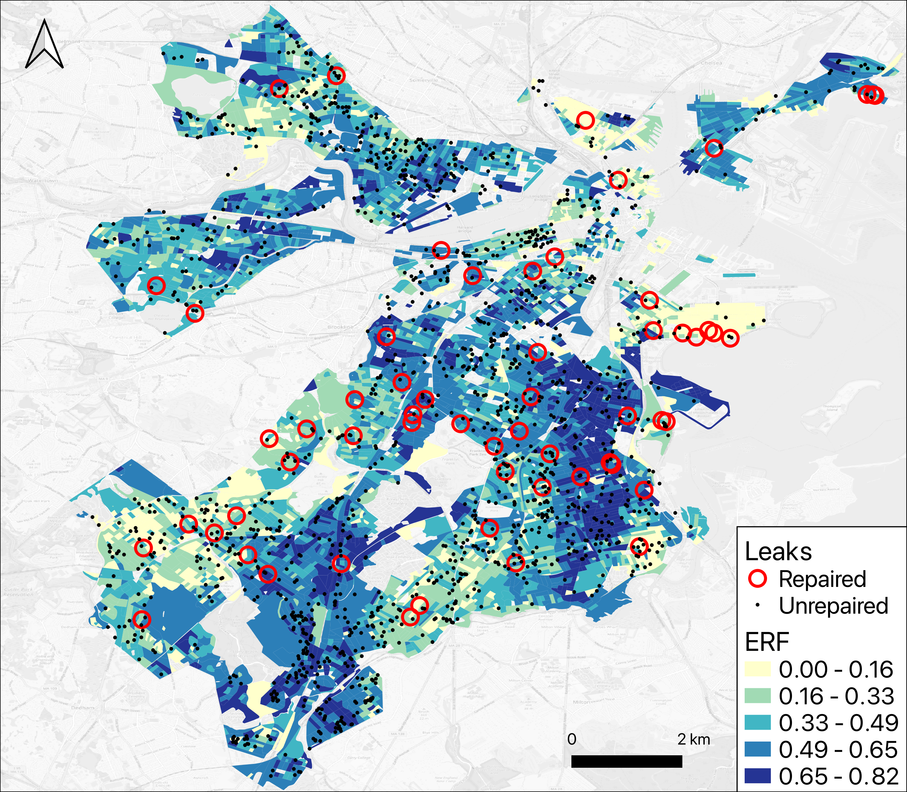{width="100%"}

::: {.caption}
Distintos tipos de puntos para representar categorías. Fuente: Jordán and Di Gregorio (2024)
:::
:::
::: {.column width="43%"}
- Los puntos son útiles para mostrar hitos en el espacio
- Si son muchos puntos, la **transparencia puede ayudar**
- Cuando son de distintos tipos, se pueden elegir colores distintos o símbolos
- También se puede utilizar el **tamaño** para visualizar un valor continuo
:::
:::

---

## Puntos: distintos tamaños {.map-slide .compact}

::: columns
::: {.column width="55%"}
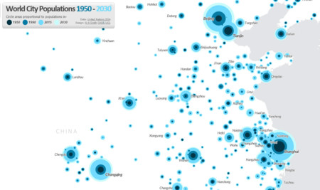{width="100%"}

::: {.caption}
El tamaño del punto puede variar para representar magnitudes. Fuente: World city population
:::
:::
::: {.column width="43%"}
- Los puntos son útiles para mostrar hitos en el espacio
- Si son muchos puntos, la **transparencia puede ayudar**
- Cuando son de distintos tipos, se pueden elegir colores distintos o símbolos
- También se puede utilizar el **tamaño** para visualizar un valor continuo
:::
:::

---

## Líneas {.map-slide .compact}

::: columns
::: {.column width="55%"}
- Las líneas se utilizan para representar elementos que ocupan una disposición lineal en el espacio, tanto reales (e.g., ríos, caminos, trenes) como ficticios (e.g., límites jurisdiccionales)
- Se pueden utilizar el color y la forma para mostrar distintos tipos
- Hay formas y colores convencionales — se deben usar cuando sea posible
:::
::: {.column width="43%"}
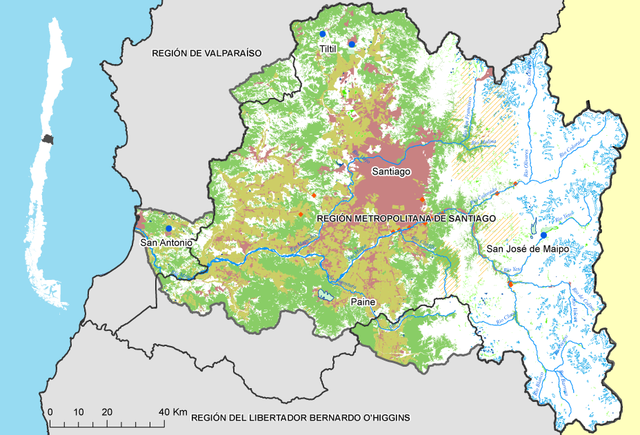{width="100%"}

::: {.caption}
Fuente: https://escenarioshidricos.cl/nuestro-trabajo/cuenca-del-rio-maipo/
:::
:::
:::

## Líneas {.map-slide .compact}

::: columns
::: {.column width="55%"}
- Las líneas se utilizan para representar elementos que ocupan una disposición lineal en el espacio, tanto reales (e.g., ríos, caminos, trenes) como ficticios (e.g., límites jurisdiccionales)
- Se pueden utilizar el color y la forma para mostrar distintos tipos
- Hay formas y colores convencionales — se deben usar cuando sea posible
:::
::: {.column width="43%"}
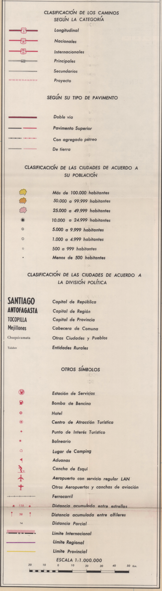{width="100%"}

::: {.caption}
Fuente: Leyenda mapa rutero histórico de Chile
:::
:::
:::

---

## Polígonos {.map-slide .compact}

::: columns
::: {.column width="55%"}
- Los polígonos se utilizan para demarcar elementos en el espacio que usan un área determinada (e.g., comuna, parcela, ciudad)
- Pueden representar una partición del espacio (e.g., comunas) o elementos repartidos en el espacio (e.g. territorios indígenas)
- Es fundamental utilizar adecuadamente el **color** para representar la información deseada
:::
::: {.column width="43%"}
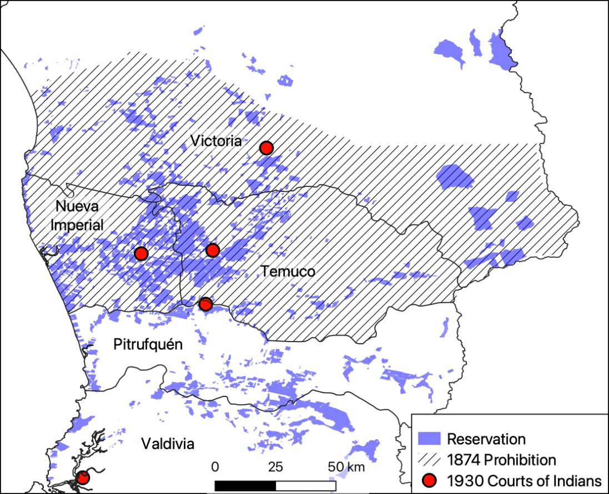{width="100%"}

::: {.caption}
Transparencia, textura y color para representar capas superpuestas. Fuente: Jordán & Heilmayr (2024)
:::
:::
:::

---

## Polígonos {.map-slide .compact}

::: columns
::: {.column width="55%"}
- Los polígonos se utilizan para demarcar elementos en el espacio que usan un área determinada (e.g., comuna, parcela, ciudad)
- Pueden representar una partición del espacio (e.g., comunas) o elementos repartidos en el espacio (e.g. territorios indígenas)
- Es fundamental utilizar adecuadamente el **color** para representar la información deseada
:::
::: {.column width="43%"}
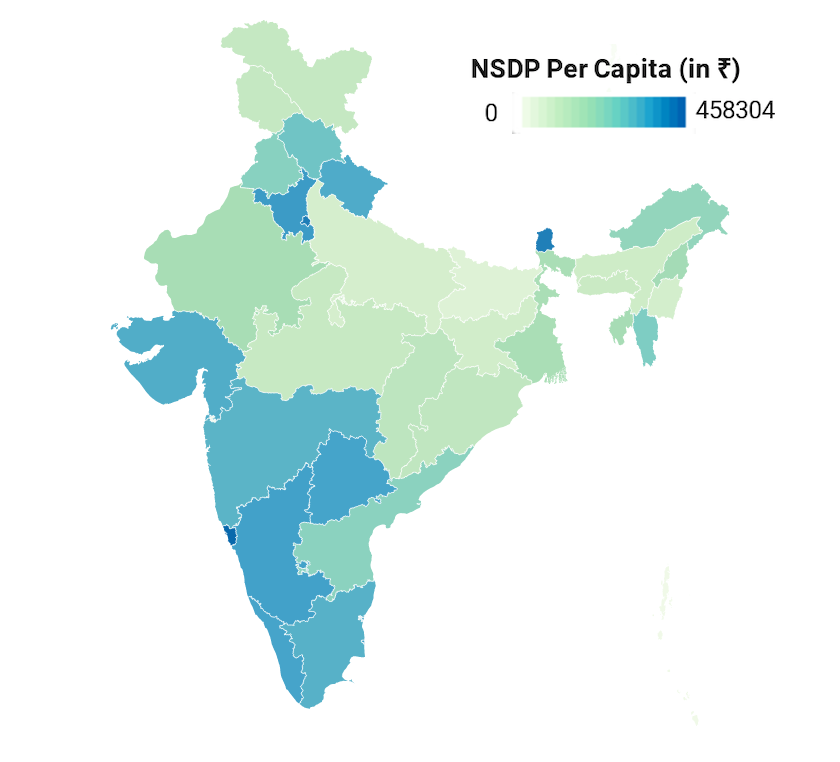{width="80%"}

::: {.caption}
Mapa choropleth: el color de cada polígono representa un valor. Fuente: Wikipedia, GDP per capita by Indian state.
:::
:::
:::

---

## Principio guía 2

> **Menos es más.**

::: columns
::: {.column width="50%"}
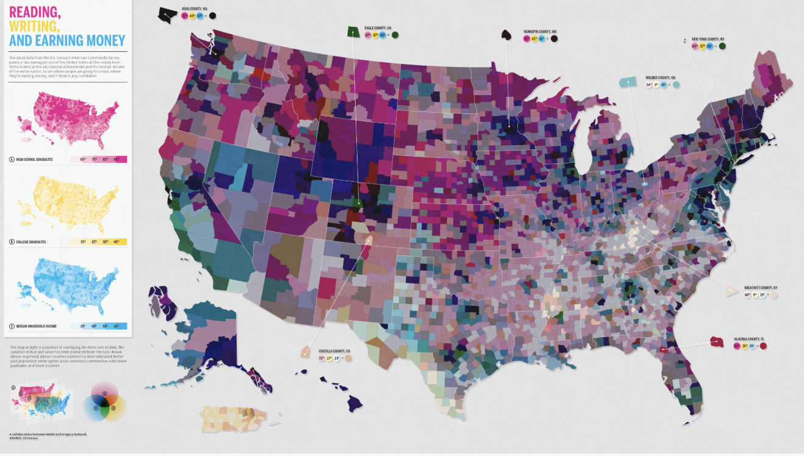{width="100%"}

::: {.caption}
Ejemplo de mapa con exceso de información y capas.
:::
:::
::: {.column width="48%"}
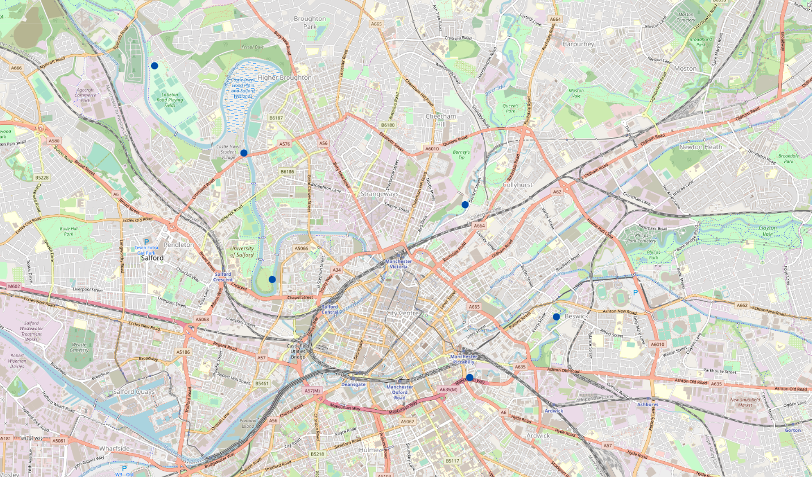{width="100%"}

::: {.caption}
Mapa simplificado: más legible y efectivo.
:::
:::
:::

# CT: Color {.section-slide background-color="#2a7f62"}

## El espectro electromagnético {.map-slide}

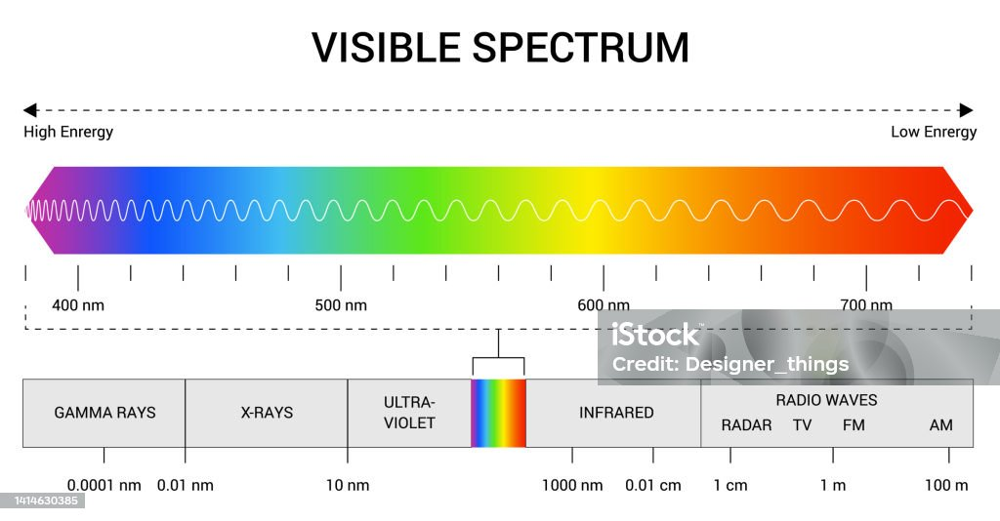{width="100%"}

::: {.caption}
El espectro de luz visible es una fracción pequeña del espectro electromagnético. Fuente: iStockphoto.
:::

---

## Lo que vemos {.map-slide}

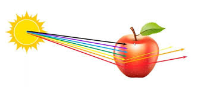{width="100%"}

::: {.caption}
El color que vemos en un objeto depende de cuanta energía refleja de cada segmento del espectro electromagnético.
:::

---

## Nuestra cámara (el ojo) {.map-slide}

::: columns
::: {.column width="25%"}
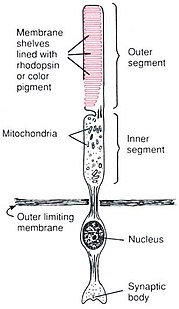{width="100%"}
:::
::: {.column width="25%"}
{width="100%"}
:::
::: {.column width="48%"}
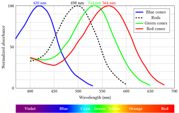{width="100%"}
:::
:::

---

## Representación digital RGB {.compact}

- Cada color es representado por **8 bits**: 2⁸ = 256 valores
- Se utiliza el sistema **hexadecimal** (base 16) para expresar los 8 bits con dos símbolos:
  - `0, 1, 2, 3, 4, 5, 6, 7, 8, 9, a, b, c, d, e, f`
- En decimal: 125 = 1×10² + 2×10¹ + 5×10⁰
- En hexadecimal: `7d` = 7×16¹ + 13×16⁰
- Con tres canales (RGB): **256³ = 16,777,216** colores posibles
- El rojo puro se escribe: **`#ff0000`**

---

## Teoría del color {.map-slide}

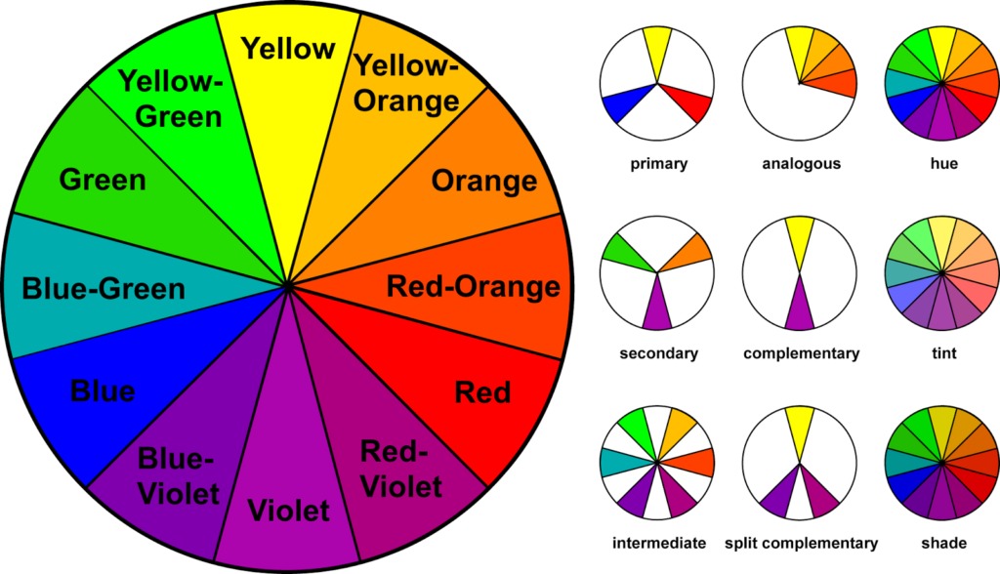{width="80%"}

::: {.caption}
Rueda de color: colores primarios, secundarios y terciarios. Fuente: https://easyedit.pro/blog/the-basic-color-theory-with-examples/
:::

---

## Daltonismo {.map-slide}

::: columns
::: {.column width="55%"}
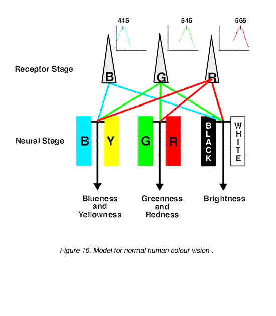{width="100%"}

::: {.caption}
Percepción del color según distintos tipos de visión. Fuente: https://webvision.med.utah.edu/
:::
:::
::: {.column width="43%"}
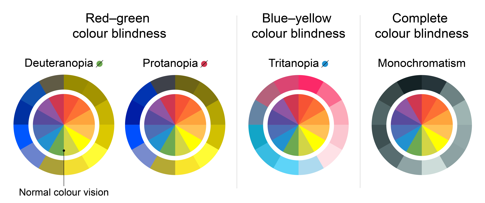{width="100%"}

::: {.caption}
Los colores que ven quienes tienen daltonismo rojo-verde, azul-amarillo y daltonismo completo, versus la rueda de color normal. Fuente: https://www.healthdirect.gov.au/colour-blindness
:::
:::
:::

---

## ColorBrewer {.map-slide}

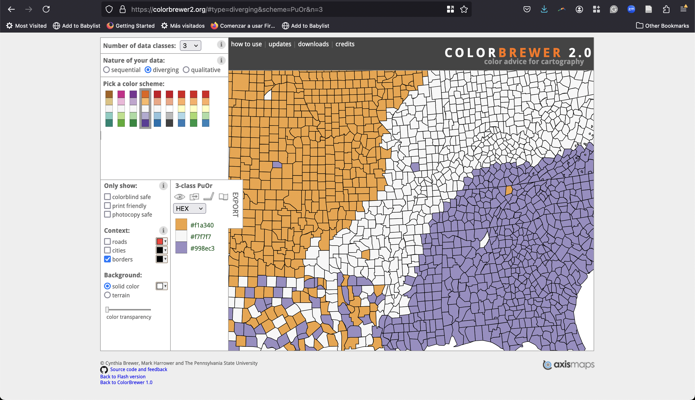{width="80%"}

::: {.caption}
Explora <a href="https://colorbrewer2.org/#type=sequential&scheme=BuGn&n=3" target="_blank">ColorBrewer</a> — paletas de colores diseñadas para mapas, con opciones para daltonismo.
:::

---

# Actividad: Proyecto Semestral {.section-slide background-color="#2a7f62"}

## El trabajo semestral {.compact}

- Grupos de **4–5 estudiantes** (ya asignados)
- Seleccionar un **territorio** y analizar un **problema socioambiental** que afecte a quienes lo habitan o utilizan
- El territorio puede ser cualquier escala: barrio, ciudad, cuenca, región, país u otro
- El objetivo es usar mapas para comprender **cómo se manifiesta espacialmente** el problema y **cómo afecta a las personas**

::: {.box}
**Primera entrega:** Viernes 24 de abril — Seleccionar, investigar y planificar
:::

---

## ¿Qué tipo de problema? {.compact}

El problema puede ser de muy distinta naturaleza:

::: {.two-level}
- **Amenazas ambientales:** contaminación atmosférica, hídrica o de suelos; escasez hídrica; incendios forestales; deforestación; erosión
- **Presiones extractivas:** minería, monocultivos, sobreexplotación de recursos marinos
- **Riesgos:** inundaciones, sequías, exposición a residuos o relaves
- **Transformaciones del territorio:** expansión urbana, cambio de uso de suelo, desplazamiento de comunidades
:::

Lo importante es que el problema **tenga una dimensión espacial clara** y que pueda analizarse con mapas. También importa que afecte a personas — ¿a quiénes? ¿dónde? ¿por qué ahí?

---

## Primera reunión del grupo {.activity-slide}

**Paso 1 — Ronda de ideas** (10 min)

Cada integrante comparte brevemente:

- Un problema socioambiental que le llame la atención, y por qué
- Un territorio donde le gustaría trabajar (puede ser diferente)

---

## Primera reunión del grupo {.activity-slide}

**Paso 2 — Evaluar candidatos** (15 min)

Como grupo, seleccionen **2 o 3 combinaciones territorio-problema** y discutan para cada una:

- ¿Cómo se manifiesta espacialmente? ¿Se puede ver en un mapa?
- ¿A quiénes afecta y dónde?
- ¿Existen datos disponibles para mapearlo?

---

## Primera reunión del grupo {.activity-slide}

**Paso 3 — Decidir y asignar tareas** (10 min)

- Elijan una opción (o dejen dos finalistas para investigar)
- Dividan la investigación antes de la próxima clase:
  - ¿Qué se sabe del problema? (fuentes académicas)
  - ¿Qué datos existen para mapearlo?
  - ¿Cuál es el contexto del territorio?

---

## Plenario {.activity-slide}

Cada grupo comparte en **1 minuto**:

1. El territorio elegido (o los dos finalistas)
2. El problema socioambiental que quieren analizar
3. Una primera idea de qué podría mostrar el mapa
