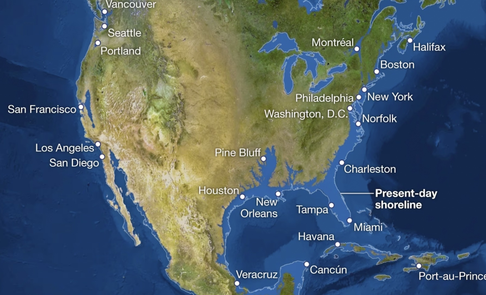
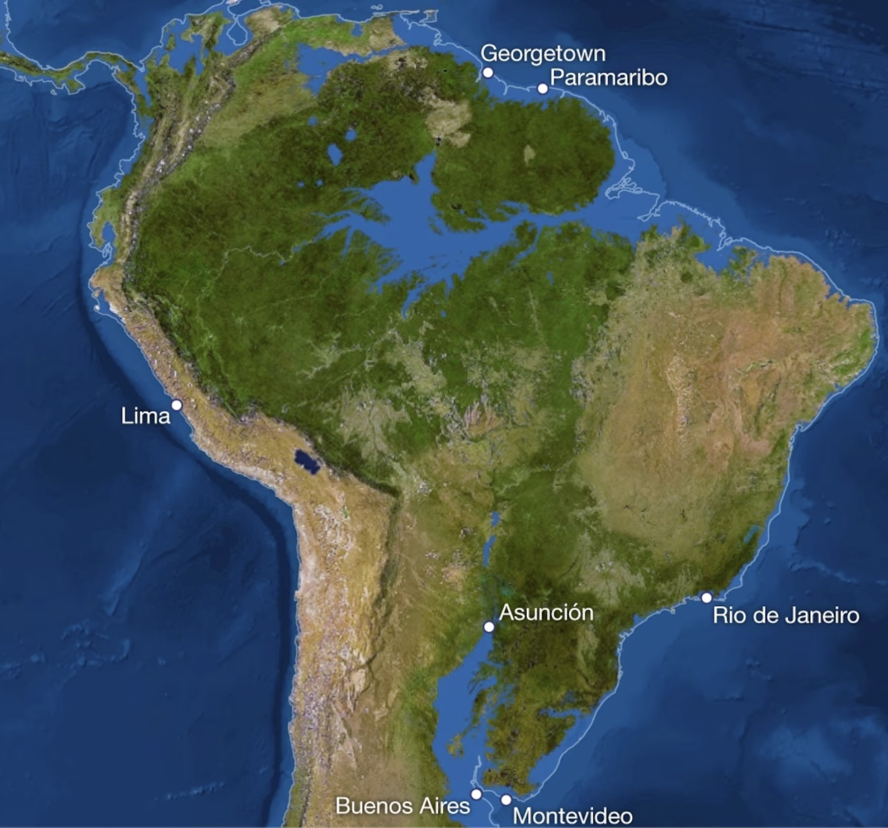

## Plan para hoy

### Primer bloque

- Plenario: Proyecto semestral
- CT: Calentamiento global y cambio climático

### Segundo bloque
- CT: Cambio climático, desigualdad y grupos vulnerables
- Actividad: Proyecto semestral

# Plenario: Proyecto Semestral {.section-slide background-color="#2a7f62"}

## Plenario {.activity-slide}

Cada grupo comparte en **1 minuto**:

1. El territorio elegido (o los dos finalistas)
2. El problema socioambiental que quieren analizar
3. Una primera idea de qué podría mostrar el mapa

# CT: Calentamiento Global y Cambio Climático {.section-slide background-color="#2a7f62"}

## Tiempo vs. Clima

::: columns
::: {.column width="48%"}
::: {.box}
**Tiempo (weather)**

El estado de la atmósfera en un **momento y lugar** determinado: temperatura, humedad, precipitación, viento.

Varía de hora en hora, de día en día.
:::
:::
::: {.column width="48%"}
::: {.box}
**Clima (climate)**

El **patrón promedio** del tiempo en una región durante un período largo (típicamente 30+ años).

Define lo que es "normal" para un lugar.
:::
:::
:::

---

## Efecto invernadero

{width="80%"}

::: {.caption}
El efecto invernadero es un fenómeno natural: los gases de efecto invernadero (GEI) retienen calor y mantienen una temperatura óptima para la vida.
:::

---

## Gases de efecto invernadero

::: columns
::: {.column width="55%"}
{width="90%"}
:::
::: {.column width="43%"}
Los principales GEI son:

- **CO₂** (dióxido de carbono) — quema de combustibles fósiles, deforestación
- **CH₄** (metano) — ganadería, arrozales, extracción de gas
- **N₂O** (óxido nitroso) — fertilizantes, procesos industriales
- **Vapor de agua** — amplificador natural del efecto invernadero
:::
:::

---

## Del efecto invernadero al cambio climático

::: columns
::: {.column width="55%"}
{width="90%"}

::: {.caption}
Un invernadero atrapa calor de forma análoga a los GEI en la atmósfera.
:::
:::
::: {.column width="43%"}
1. **Efecto invernadero:** proceso natural que mantiene la Tierra habitable
2. **Calentamiento global:** aumento de temperatura por concentración excesiva de GEI
3. **Cambio climático:** alteración del clima atribuida a actividades humanas que modifican la composición de la atmósfera
:::
:::

---

## CO₂ en perspectiva histórica

{width="100%"}

::: {.caption}
En 800.000 años, el CO₂ nunca superó los 300 ppm. Hoy supera los 420 ppm. Fuente: NOAA Climate.gov / NCEI.
:::

---

## La máquina del tiempo climático

::: columns
::: {.column width="48%"}
{width="100%"}

::: {.caption}
Anomalías de temperatura global. Fuente: NASA.
:::
:::
::: {.column width="48%"}
{width="100%"}

::: {.caption}
Cambios proyectados en precipitación bajo distintos escenarios (B1 y A2, promedio 30 años al 2084). Fuente: NASA.
:::
:::
:::

---

## ¿Cuánto CO₂ emitimos? {.compact}

::: columns
::: {.column width="55%"}
{width="100%"}

::: {.caption}
Emisiones anuales de CO₂ por región (1750–2021). Fuente: Our World in Data / Global Carbon Project (2023).
:::
:::
::: {.column width="43%"}
- En 1950, el mundo emitía ~6.000 millones de toneladas de CO₂
- Hoy: más de **35.000 millones** de toneladas al año
- En 1900, Europa y EE.UU. producían más del **90%** de las emisiones
- Hoy, Asia representa cerca de la **mitad** de las emisiones globales

::: {.small .muted}
Lectura: Ritchie & Roser (2020). *CO₂ emissions.* Our World in Data.
:::
:::
:::

---

## ¿Quién ha contribuido más? {.compact}

{width="75%"}

::: {.caption}
Emisiones acumuladas de CO₂ (1751–2017). EE.UU. acumula ~25% del total histórico; la UE ~22%. África y Sudamérica: ~3% cada una. Fuente: Our World in Data / Global Carbon Project & CDIAC.
:::

---

## La responsabilidad depende de cómo se mida {.compact}

::: {.two-level}
- **Emisiones anuales:** China es hoy el mayor emisor (~27% del total global)
- **Emisiones acumuladas:** EE.UU. lidera con ~400.000 millones de toneladas desde 1751 — 1,5 veces más que China
- **Emisiones per cápita:** los mayores emisores son países petroleros (Qatar, UAE); EE.UU., Australia y Canadá emiten ~3 veces el promedio global
  - En Chad, Níger o República Centroafricana: ~0,1 toneladas/persona/año — **150 veces menos** que en EE.UU.
- **Emisiones basadas en consumo:** ajustan por comercio internacional — los países importadores "externalizan" emisiones
:::

::: {.small .muted}
Ritchie & Roser (2020). *CO₂ emissions.* Our World in Data.
:::

---

## El Coloso del cambio climático

::: columns
::: {.column width="30%"}
{width="100%"}

::: {.caption}
*El Coloso*, atribuido a Goya (c. 1808–1812)
:::
:::
::: {.column width="28%"}
{width="100%"}

::: {.caption}
William Nordhaus, Premio Nobel de Economía 2018
:::
:::
::: {.column width="38%"}
Nordhaus comparó el cambio climático con el Coloso de Goya: **un problema tan grande que paraliza a la humanidad**

- Es un problema de **bienes comunes globales** — nadie es dueño de la atmósfera
- Las consecuencias son de **largo plazo** — los que emiten hoy no son los que sufren mañana
:::
:::

---

## ¿Por qué es tan difícil de enfrentar? {.compact}

::: {.two-level}
- **Bienes comunes globales:** la atmósfera no tiene dueño — cada país tiene incentivos para no reducir emisiones si los demás no lo hacen (dilema del prisionero)
- **Horizonte temporal largo:** el CO₂ persiste en la atmósfera entre **300 y 1.000 años** — las consecuencias de lo que emitimos hoy las sufrirán generaciones futuras
- **Retroalimentaciones complejas:** más calor → más vapor de agua → más calor (ciclo amplificador)
- **Incertidumbre y puntos de inflexión:** umbrales críticos que, una vez cruzados, desencadenan cambios irreversibles
:::

{width="35%"}

::: {.caption}
Ciclo de retroalimentación positiva del vapor de agua.
:::

---

## Si todo el hielo se derrite... {.compact}

::: columns
::: {.column width="48%"}
{width="100%"}

::: {.caption}
América del Norte con un aumento de ~70 metros en el nivel del mar. Fuente: National Geographic.
:::
:::
::: {.column width="48%"}
{width="100%"}

::: {.caption}
América del Sur con el mismo escenario. Fuente: National Geographic.
:::
:::
:::

---

## Mitigación y adaptación {.compact}

::: columns
::: {.column width="48%"}
::: {.box}
**Mitigación**

Reducir las emisiones de GEI para limitar el calentamiento futuro.

- Mercados de carbono (Cap and Trade)
- Reducción de deforestación (REDD+)
- Energías renovables
- Eficiencia energética
:::
:::
::: {.column width="48%"}
::: {.box}
**Adaptación**

Ajustarse a los impactos del cambio climático que ya son inevitables.

- Infraestructura resiliente
- Sistemas de alerta temprana
- Manejo sustentable del agua
- Planificación urbana
:::
:::
:::

---

## Justicia climática {.compact}

::: columns
::: {.column width="55%"}
{width="100%"}

::: {.caption}
Participación en emisiones globales de CO₂ vs. participación en la población mundial, por nivel de ingreso (2021). Fuente: Our World in Data / Global Carbon Budget (2023).
:::
:::
::: {.column width="43%"}
- Los países de **ingreso alto** (15,7% de la población) producen el **34,4%** de las emisiones
- Los países de **ingreso bajo** (8,8% de la población) producen solo el **0,5%**
- Los que menos contribuyen al problema son los que **más lo sufren**

::: {.small .muted}
Ritchie & Roser (2020). *CO₂ emissions.* Our World in Data.
:::
:::
:::

---

## Los que menos emiten, más pierden

{width="70%"}

::: {.caption}
Pérdidas y ganancias en PIB atribuibles a las emisiones de EE.UU. (1990–2014). Los países tropicales — generalmente más pobres — sufren las mayores pérdidas económicas. Fuente: Callahan & Mankin (2022).
:::

---

## No estamos todos en el mismo barco {.compact}

::: columns
::: {.column width="48%"}
{width="100%"}

::: {.caption}
Fuente: Extinction Rebellion
:::
:::
::: {.column width="48%"}
> "Estamos todos en la misma tormenta, pero **no estamos todos en el mismo barco**."

- La desigualdad en emisiones refleja una desigualdad más profunda en **poder, riqueza y responsabilidad histórica**
- La justicia climática exige que los mayores responsables históricos asuman costos proporcionales
:::
:::

---

## Chile: Ley Marco de Cambio Climático {.compact}

::: columns
::: {.column width="55%"}
{width="100%"}
:::
::: {.column width="43%"}
{width="100%"}

La Ley Marco de Cambio Climático de Chile (2022) establece entre sus principios la **equidad y justicia climática**: una justa asignación de cargas, costos y beneficios, con enfoque de género y espacial.
:::
:::

# CT: Cambio Climático, Desigualdad y Grupos Vulnerables {.section-slide background-color="#2a7f62"}

## El cambio climático no afecta a todos por igual {.compact}

- El cambio climático **exacerba desigualdades preexistentes**, afectando desproporcionadamente a comunidades marginalizadas
- Tres grupos particularmente vulnerables:
  - **Mujeres**
  - **Pueblos indígenas**
  - **Afrodescendientes**
- La evidencia causal muestra que múltiples dimensiones de desigualdad se **intersectan**, poniendo a ciertos grupos en riesgo elevado
- Pero estos mismos grupos también poseen conocimientos y capacidades que pueden contribuir a la **mitigación y adaptación**

---

## Impactos en salud: mujeres y niños {.compact}

::: {.two-level}
- **Salud materna:** la exposición al calor durante el embarazo aumenta el riesgo de hipertensión, eclampsia y parto prematuro — efectos más severos en países en desarrollo
- **Primera infancia:** los shocks climáticos tienen efectos diferenciados por género en niños
  - Fetos masculinos son biológicamente más vulnerables en el útero (mayores requerimientos de nutrientes y oxígeno)
  - Los efectos postnatales varían según contexto — en algunos países, las niñas son más afectadas por la reasignación de recursos dentro del hogar
- **Salud mental:** temperaturas sobre 30°C aumentan la probabilidad de depresión en mujeres un **50,7% más** que en hombres
  - En Australia, sequías y calor extremo aumentan las tasas de suicidio, con efectos más fuertes en zonas con mayor proporción de pueblos indígenas
:::

---

## Impactos económicos diferenciados {.compact}

::: {.two-level}
- **Trabajo y salarios:** los shocks climáticos afectan más los ingresos de las mujeres — en algunos contextos, las jornadas laborales de las mujeres se reducen hasta un **19% más** que las de los hombres durante sequías
- **Migración:** los hombres tienden a migrar por trabajo ante shocks agrícolas; las mujeres enfrentan restricciones por normas de género
  - En El Salvador, la migración masculina a EE.UU. aumentó tras sequías, pero la femenina **disminuyó**
- **Capital humano:** los eventos extremos provocan cierre de escuelas y reasignación de recursos del hogar
  - En hogares con preferencia por hijos varones, la educación de las niñas es la primera en sacrificarse durante crisis climáticas
- **Violencia:** los shocks climáticos aumentan la violencia contra las mujeres — las "muertes por dote" en India aumentan ~8% con caídas en las lluvias
:::

---

## ¿Quién se adapta mejor? {.compact}

::: columns
::: {.column width="48%"}
::: {.box}
**Barreras para las mujeres**

- Tenencia de tierra insegura
- Menor acceso a crédito y financiamiento
- Menor acceso a tecnologías adaptativas (e.g., aire acondicionado)
- Normas de género que limitan la movilidad y la toma de decisiones
:::
:::
::: {.column width="48%"}
::: {.box}
**Oportunidades**

- Las mujeres agricultoras responden **más fuertemente** a capacitaciones sobre semillas resilientes al clima
- Diseminan información sobre agricultura climáticamente inteligente más efectivamente
- La transferencia de efectivo a mujeres embarazadas mitiga los efectos de shocks de calor en sus hijos
:::
:::
:::

---

## Pueblos indígenas y cambio climático {.compact}

::: {.two-level}
- Los pueblos indígenas gestionan hasta el **25% de la superficie terrestre** y sus territorios se superponen con el **40% de las áreas protegidas**
- La evidencia causal muestra que, con derechos de propiedad seguros, los territorios indígenas son **las barreras más efectivas contra la deforestación**
  - En Brasil, los territorios indígenas reducen la deforestación 8 veces más que las áreas circundantes
  - En Colombia, territorios indígenas y afrodescendientes reducen deforestación, con impactos mayores en municipios remotos con baja capacidad estatal
  - El reconocimiento formal (no solo la demarcación) es el factor crítico: reduce deforestación **y promueve la regeneración** con especies nativas
- Los pueblos indígenas poseen **conocimiento tradicional** sobre manejo de ecosistemas, predicción climática y gestión de recursos que complementa la ciencia occidental
:::

---

## Mujeres en la toma de decisiones ambientales {.compact}

La evidencia causal sugiere que la mayor participación de mujeres en posiciones de liderazgo se asocia con políticas más sustentables:

::: {.two-level}
- Mayor representación femenina en parlamentos se asocia con políticas climáticas **más estrictas** y menores emisiones de CO₂
- Mujeres en directorios corporativos se asocian con menor huella de carbono de las empresas — se necesita una "masa crítica" de 2–3 mujeres para que el efecto sea significativo
- Un aumento de una unidad en el índice de empoderamiento femenino se asocia con una reducción del **11,5%** en emisiones de CO₂
- Sin embargo, estos efectos dependen de la **calidad de gobernanza** — en contextos de alta corrupción, los resultados pueden invertirse
:::

---

## Grandes vacíos en la evidencia {.compact}

A pesar de los avances, quedan enormes lagunas de conocimiento:

::: {.two-level}
- **Afrodescendientes:** el grupo más desatendido en la investigación — la gran mayoría de los estudios se enfoca en mujeres, muy pocos en pueblos indígenas, y casi ninguno en afrodescendientes
- **América Latina:** la principal contribución de la región es sobre **derechos de propiedad indígena y conservación** (sobre todo Brasil y Colombia), pero falta evidencia sobre impactos y capacidad adaptativa
- **Impactos culturales:** no existe evidencia causal sobre cómo el cambio climático afecta las prácticas culturales, la lengua o los sistemas de conocimiento tradicional de los pueblos indígenas
- **Economía informal:** faltan estudios sobre las consecuencias económicas del cambio climático para pueblos indígenas y trabajadores informales
:::

---

## El nexo entre la lectura y los grupos vulnerables {.compact}

::: columns
::: {.column width="48%"}
La lectura de Our World in Data muestra que la **responsabilidad** por las emisiones es profundamente desigual entre países.

Pero la desigualdad también opera **dentro** de los países:

- Los grupos que menos contribuyen a las emisiones son los que más sufren sus efectos
- La pobreza, el género y la etnicidad **amplifican** la vulnerabilidad climática
:::
::: {.column width="48%"}
::: {.box}
**Desigualdad entre países**

Países ricos emiten más, países pobres sufren más

(Ritchie & Roser, 2020)
:::

::: {.box}
**Desigualdad dentro de países**

Mujeres, pueblos indígenas y afrodescendientes enfrentan impactos desproporcionados — y tienen menor capacidad de adaptación
:::
:::
:::

---

## ¿Qué hacer? {.compact}

::: {.two-level}
- **Reconocer derechos territoriales indígenas** — la evidencia muestra que es una de las estrategias de mitigación más costo-efectivas
- **Fortalecer la participación de mujeres** en la toma de decisiones ambientales — la evidencia sugiere que produce políticas más sustentables
- **Invertir en adaptación diferenciada** — las políticas de adaptación deben considerar las barreras específicas que enfrentan mujeres, pueblos indígenas y afrodescendientes
- **Cerrar brechas de conocimiento** — necesitamos más investigación causal, especialmente en América Latina y sobre afrodescendientes
- **Integrar conocimiento tradicional** — no como sustituto, sino como complemento del conocimiento científico
:::

# Actividad: Proyecto Semestral {.section-slide background-color="#2a7f62"}

## El trabajo semestral {.compact}

- Grupos de **4–5 estudiantes** (ya asignados)
- Seleccionar un **territorio** y analizar un **problema socioambiental** que afecte a quienes lo habitan o utilizan
- El territorio puede ser cualquier escala: barrio, ciudad, cuenca, región, país u otro
- El objetivo es usar mapas para comprender **cómo se manifiesta espacialmente** el problema y **cómo afecta a las personas**

::: {.box}
**Primera entrega:** Viernes 24 de abril — Seleccionar, investigar y planificar
:::

---

## ¿Qué tipo de problema? {.compact}

El problema puede ser de muy distinta naturaleza:

::: {.two-level}
- **Amenazas ambientales:** contaminación atmosférica, hídrica o de suelos; escasez hídrica; incendios forestales; deforestación; erosión
- **Presiones extractivas:** minería, monocultivos, sobreexplotación de recursos marinos
- **Riesgos:** inundaciones, sequías, exposición a residuos o relaves
- **Transformaciones del territorio:** expansión urbana, cambio de uso de suelo, desplazamiento de comunidades
:::

Lo importante es que el problema **tenga una dimensión espacial clara** y que pueda analizarse con mapas. También importa que afecte a personas — ¿a quiénes? ¿dónde? ¿por qué ahí?

---

## Primera reunión del grupo {.activity-slide}

**Paso 1 — Ronda de ideas** (10 min)

Cada integrante comparte brevemente:

- Un problema socioambiental que le llame la atención, y por qué
- Un territorio donde le gustaría trabajar (puede ser diferente)

---

## Primera reunión del grupo {.activity-slide}

**Paso 2 — Evaluar candidatos** (15 min)

Como grupo, seleccionen **2 o 3 combinaciones territorio-problema** y discutan para cada una:

- ¿Cómo se manifiesta espacialmente? ¿Se puede ver en un mapa?
- ¿A quiénes afecta y dónde?
- ¿Existen datos disponibles para mapearlo?

---

## Primera reunión del grupo {.activity-slide}

**Paso 3 — Decidir y asignar tareas** (10 min)

- Elijan una opción (o dejen dos finalistas para investigar)
- Dividan la investigación antes de la próxima clase:
  - ¿Qué se sabe del problema? (fuentes académicas)
  - ¿Qué datos existen para mapearlo?
  - ¿Cuál es el contexto del territorio?
