## Plan para hoy

### Primer bloque

- Plenario: Proyecto semestral
- CT: Calentamiento global y cambio climático

### Segundo bloque
- CT: Cambio climático, desigualdad y grupos vulnerables
- Actividad: Cambio Climático y Efectos Diferenciados

# Plenario: Proyecto Semestral {.section-slide background-color="#2a7f62"}

## Plenario {.activity-slide}

Cada grupo comparte en **1 minuto**:

1. El territorio elegido (o los dos finalistas)
2. El problema socioambiental que quieren analizar
3. Una primera idea de qué podría mostrar el mapa

# CT: Calentamiento Global y Cambio Climático {.section-slide background-color="#2a7f62"}

## Tiempo vs. Clima

::: columns
::: {.column width="48%"}
::: {.box}
**Tiempo (weather)**

El estado de la atmósfera en un **momento y lugar** determinado: temperatura, humedad, precipitación, viento

Varía de hora en hora, de día en día
:::
:::
::: {.column width="48%"}
::: {.box}
**Clima (climate)**

El **patrón promedio** del tiempo en una región durante un período largo (típicamente 30+ años)

Define lo que es "normal" para un lugar
:::
:::
:::

---

## Efecto invernadero

::: columns
::: {.column width="50%"}
{width="90%"}
:::
::: {.column width="50%"}
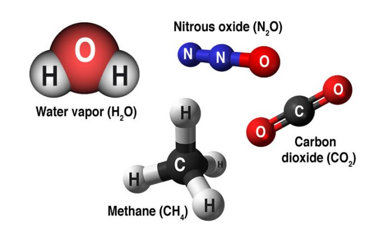{width="90%"}
:::
:::

---

## Del efecto invernadero al cambio climático

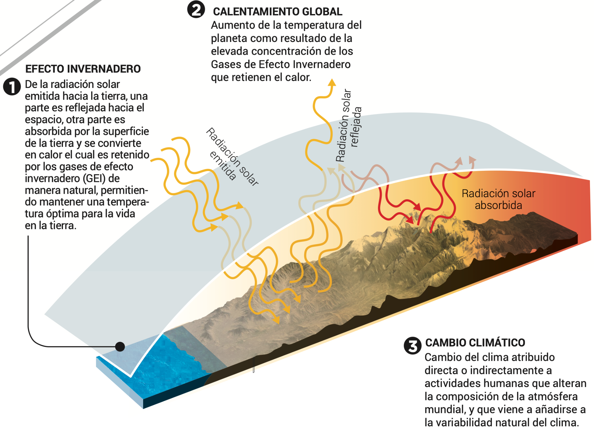{width="90%"}

::: {.caption}
1. **Efecto invernadero:** proceso natural que mantiene la Tierra habitable ---2. **Calentamiento global:** aumento de temperatura por concentración excesiva de GEI ---3. **Cambio climático:** alteración del clima atribuida a actividades humanas que modifican la composición de la atmósfera
:::

---

## CO₂ en perspectiva histórica

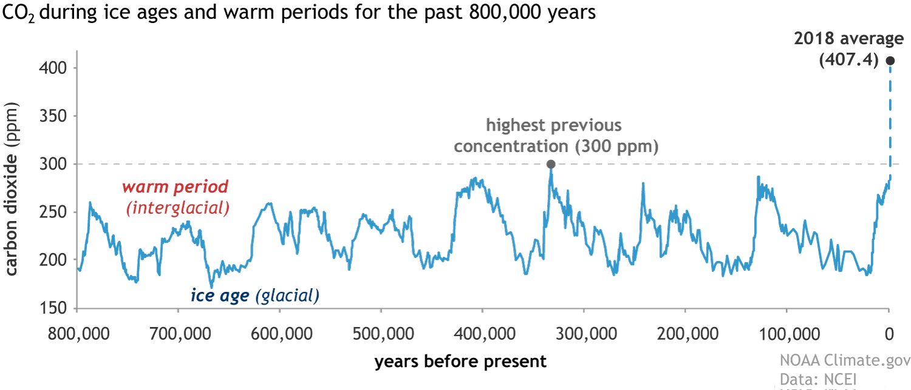{width="100%"}

::: {.caption}
En 800.000 años, el CO₂ nunca superó los 300 ppm. Hoy supera los 420 ppm. Fuente: NOAA Climate.gov / NCEI.
:::

---

## La máquina del tiempo climático


---

## Calentamiento global y Cambio Climático
::: columns
::: {.column width="48%"}
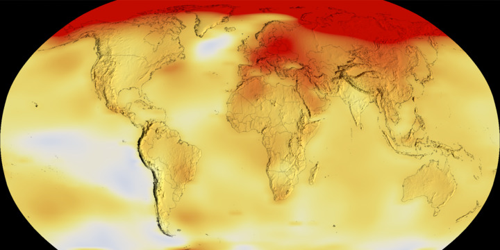{width="100%"}

::: {.caption}
Anomalías de temperatura global. Fuente: NASA.
:::
:::
::: {.column width="48%"}
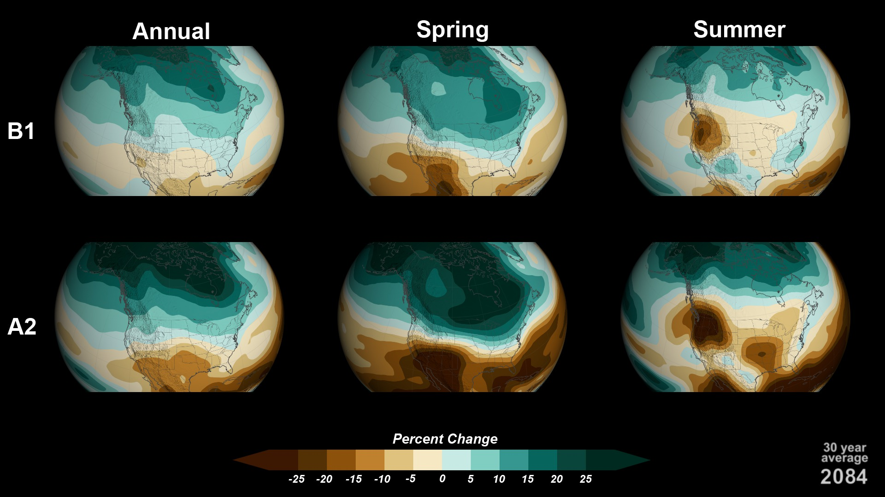{width="100%"}

::: {.caption}
Cambios proyectados en precipitación bajo distintos escenarios (B1 y A2, promedio 30 años al 2084). Fuente: NASA.
:::
:::
:::

---

## ¿Cuánto CO₂ emitimos? ¿Quién lo emite? {.compact}

::: columns
::: {.column width="55%"}
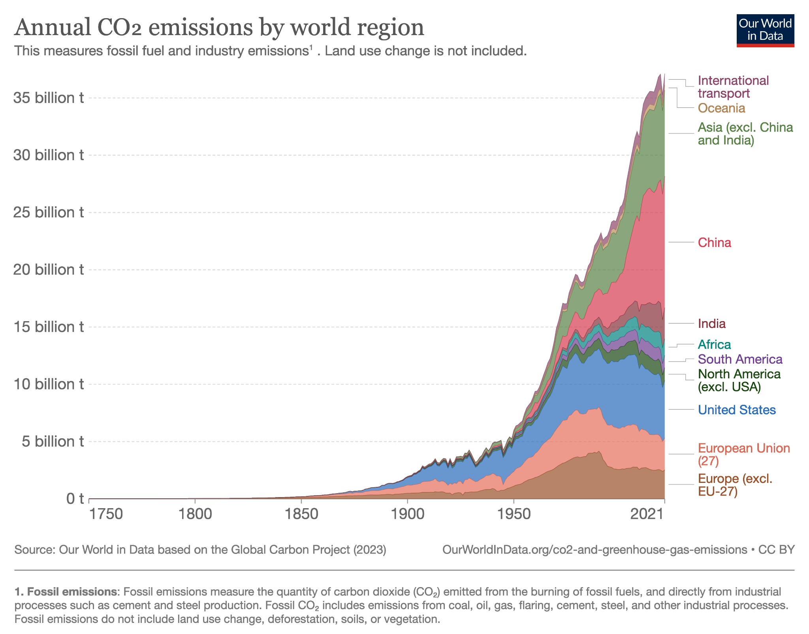{width="100%"}

::: {.caption}
Emisiones anuales de CO₂ por región (1750–2021). Fuente: Our World in Data / Global Carbon Project (2023).
:::
:::
::: {.column width="43%"}
- En 1950, el mundo emitía ~6.000 millones de toneladas de CO₂
- 2024: más de **38.000 millones** de toneladas al año
- En 1900, Europa y EE.UU. producían más del **90%** de las emisiones
- Hoy, Asia representa cerca de la **mitad** de las emisiones globales

::: {.small .muted}
Lectura: Ritchie & Roser (2020). *CO₂ emissions.* Our World in Data.
:::
:::
:::

## ¿Cuánto es 1,000 millones de toneladas (un Gigatón)? {.compact}

{width="100%"}

---

## ¿Quién está aumentando y quién reduciendo? {.compact}

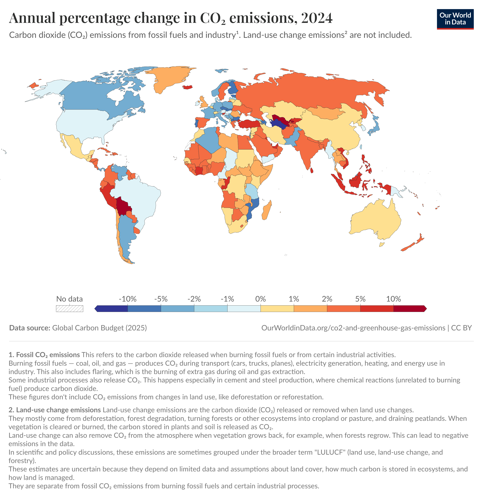{width="100%"}

::: {.caption}
Cambio porcentual anual en emisiones de CO₂ (2024). Fuente: Our World in Data / Global Carbon Budget (2025).
:::

---

## ¿Quién ha contribuido más? {.compact}

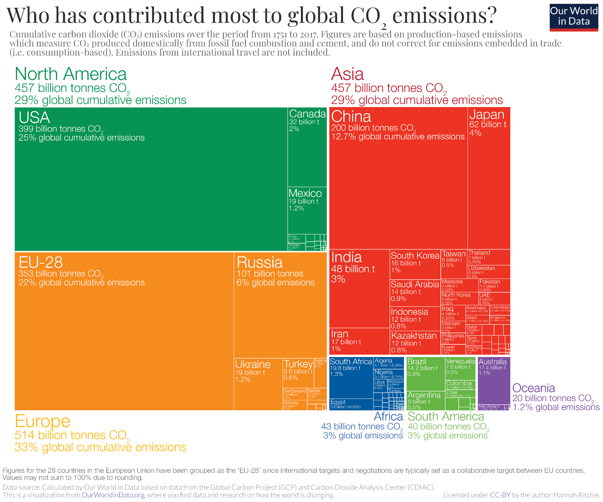{width="90%"}

::: {.caption}
Emisiones acumuladas de CO₂ (1751–2017). EE.UU. acumula ~25% del total histórico; la UE ~22%. África y Sudamérica: ~3% cada una. Fuente: Our World in Data / Global Carbon Project & CDIAC.
:::

---

## La responsabilidad depende de cómo se mida {.compact}

::: {.two-level}
- **Emisiones anuales:** China es hoy el mayor emisor (~27% del total global)
- **Emisiones acumuladas:** EE.UU. lidera con ~400.000 millones de toneladas desde 1751 — 1,5 veces más que China
- **Emisiones per cápita:** los mayores emisores son países petroleros (Qatar, UAE); EE.UU., Australia y Canadá emiten ~3 veces el promedio global
  - En Chad, Níger o República Centroafricana: ~0,1 toneladas/persona/año — **150 veces menos** que en EE.UU.
- **Emisiones basadas en consumo:** ajustan por comercio internacional — los países importadores "externalizan" emisiones
:::

::: {.small .muted}
Ritchie & Roser (2020). *CO₂ emissions.* Our World in Data.
:::

---

## Justicia climática {.compact}

::: columns
::: {.column width="55%"}
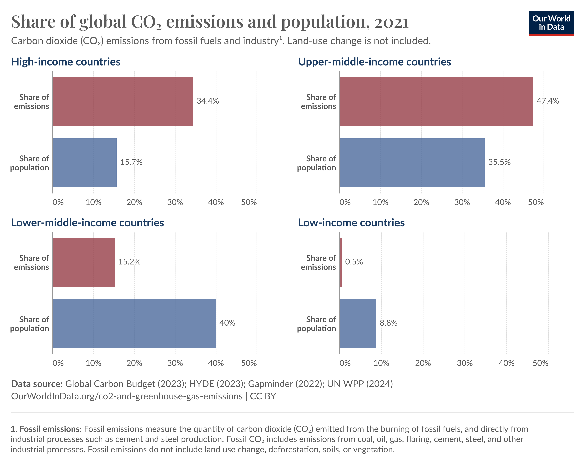{width="100%"}

::: {.caption}
Participación en emisiones globales de CO₂ vs. participación en la población mundial, por nivel de ingreso (2021). Fuente: Our World in Data / Global Carbon Budget (2023).
:::
:::
::: {.column width="43%"}
- Los países de **ingreso alto** (15,7% de la población) producen el **34,4%** de las emisiones
- Los países de **ingreso bajo** (8,8% de la población) producen solo el **0,5%**
- Los que menos contribuyen al problema son los que **más lo sufren**

::: {.small .muted}
Ritchie & Roser (2020). *CO₂ emissions.* Our World in Data.
:::
:::
:::

---

## Los que menos emiten, más pierden

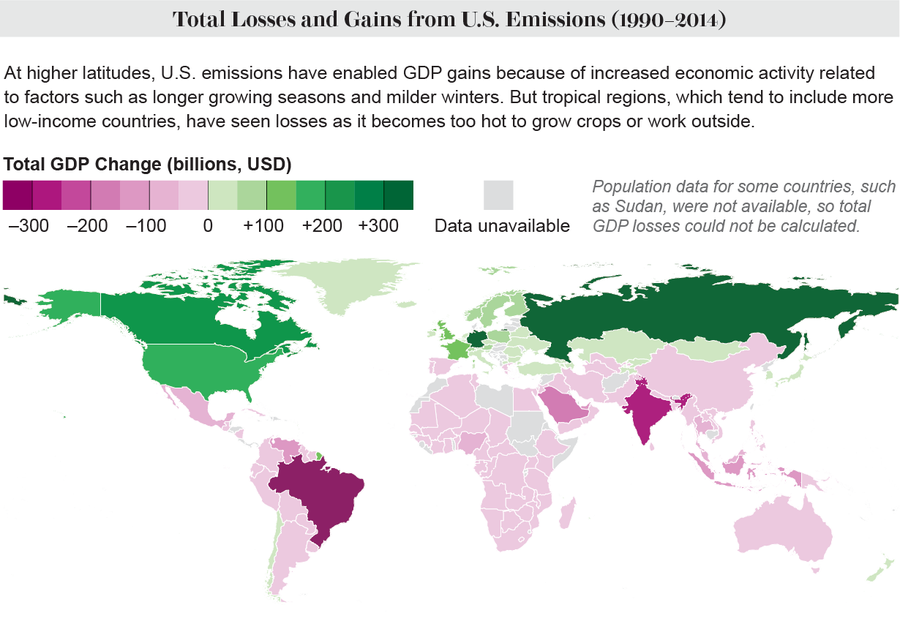{width="100%"}

::: {.caption}
Pérdidas y ganancias en PIB atribuibles a las emisiones de EE.UU. (1990–2014). Los países tropicales — generalmente más pobres — sufren las mayores pérdidas económicas. Fuente: Callahan & Mankin (2022).
:::

---

## No estamos todos en el mismo barco {.compact}

::: columns
::: {.column width="48%"}
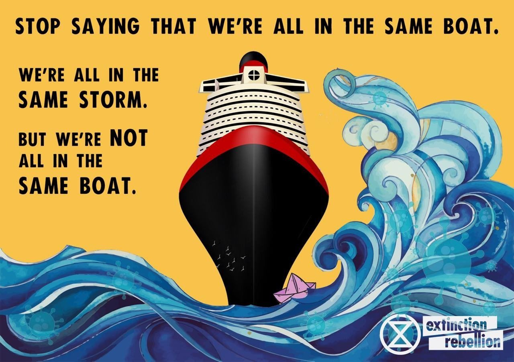{width="100%"}

::: {.caption}
Fuente: Extinction Rebellion
:::
:::
::: {.column width="48%"}
> "Estamos todos en la misma tormenta, pero **no estamos todos en el mismo barco**."

- La desigualdad en emisiones refleja una desigualdad más profunda en **poder, riqueza y responsabilidad histórica**
- La justicia climática exige que los mayores responsables históricos asuman costos proporcionales
:::
:::

---

## El Coloso moderno: ¿Porqué nos cuesta enfrentar el Cambio Climático?

::: columns
::: {.column width="50%"}
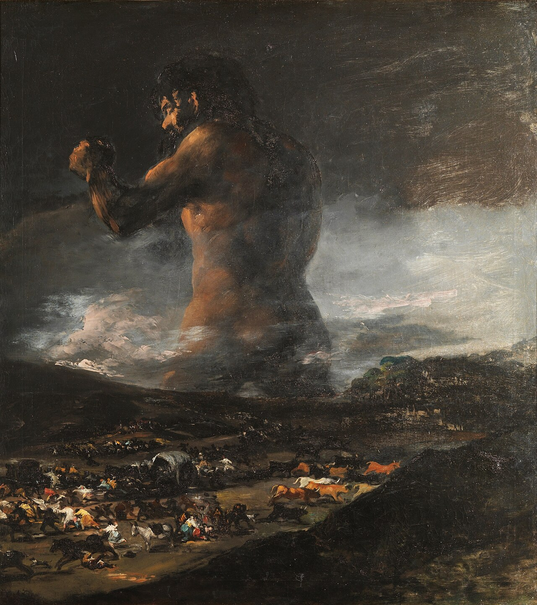{width="100%"}

::: {.caption}
*El Coloso*, atribuido a Goya (c. 1808–1812)
:::
:::
::: {.column width="50%"}
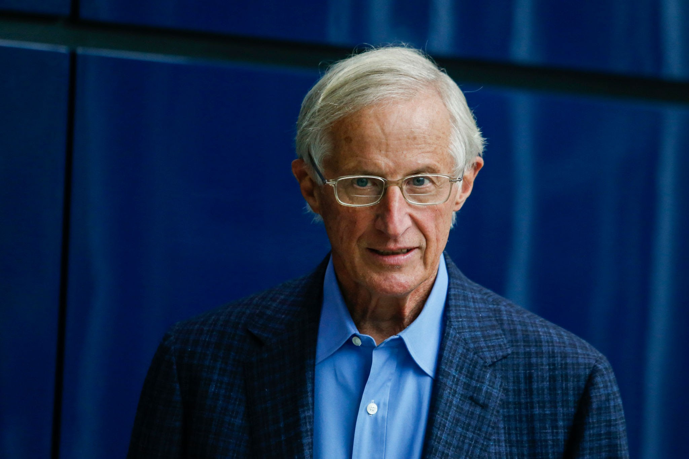{width="100%"}

::: {.caption}
William Nordhaus, Premio Nobel de Economía 2018, compara el cambio climático con el Coloso de Goya. ¿Por qué?
:::

:::
:::

---

## Desafío existencial {.compact}

::: columns
::: {.column width="40%"}
{width="100%"}

::: {.caption}
*El Coloso*, atribuido a Goya (c. 1808–1812)
:::
:::
::: {.column width="60%"}
1. Su alcance es *global*: se puede entender la atmosfera como un bien común
2. Las consecuencias de emitir hoy se dan en el largo plazo (¡pero ya estamos viviendo las consecuencias de lo emitido en el pasado!)
3. El clima es un sistema extremadamente complejo, con muchos *feedbacks positivos* que aumentan sustancialmente la *incertidumbre* respecto a los efectos

:::
:::

## Desafío existencial: alcance global{.compact}

::: columns
::: {.column width="40%"}
{width="100%"}

::: {.caption}
*El Coloso*, atribuido a Goya (c. 1808–1812)
:::
:::
::: {.column width="60%"}
Las emisiones de CO2 en Chile afectan el clima tanto en Chile como en Japón: el cambio climático no reconoce fronteras.

Por ello, se da una "tragedia de los comunes" donde nadie quiere hacerse cargo.

:::
:::

---

## Desafío existencial: largo plazo {.compact}

::: columns
::: {.column width="40%"}
{width="100%"}

::: {.caption}
*El Coloso*, atribuido a Goya (c. 1808–1812)
:::
:::
::: {.column width="60%"}
Los cambios en nuestra atmósfera asociados con gases reactivos (gases que experimentan reacciones químicas) como el ozono y los químicos que forman ozono, como los óxidos de nitrógeno, son relativamente de corta duración. Sin embargo, el dióxido de carbono es un caso diferente. Una vez que se añade a la atmósfera, permanece allí durante mucho tiempo: entre 300 y 1,000 años. Por lo tanto, a medida que los seres humanos cambian la atmósfera al emitir dióxido de carbono, esos cambios perdurarán en la escala temporal de muchas vidas humanas.

Alan Buis, Jet Propulsion Laboratory, NASA

:::
:::

---

## Desafío existencial: largo plazo {.compact}

::: columns
::: {.column width="40%"}
{width="100%"}

::: {.caption}
*El Coloso*, atribuido a Goya (c. 1808–1812)
:::
:::
::: {.column width="60%"}
El cambio climático de hoy es el resultado de las **emisiones acumuladas**; el cambio climático de mañana depende de lo que hacemos hoy

Reducir la emisiones de GEI implica hacer sacrificios hoy por generaciones futuras, que ni siquiera han nacido

¿Por qué es dificil lograrlo? ¿Son los sistemas políticos contemporáneos efectivos para manejar estos desafíos de largo plazo?

:::
:::

---

## Desafío existencial: sistema complejo - feedbacks positivos {.compact}

::: columns
::: {.column width="40%"}
{width="100%"}

::: {.caption}
*El Coloso*, atribuido a Goya (c. 1808–1812)
:::
:::
::: {.column width="60%"}

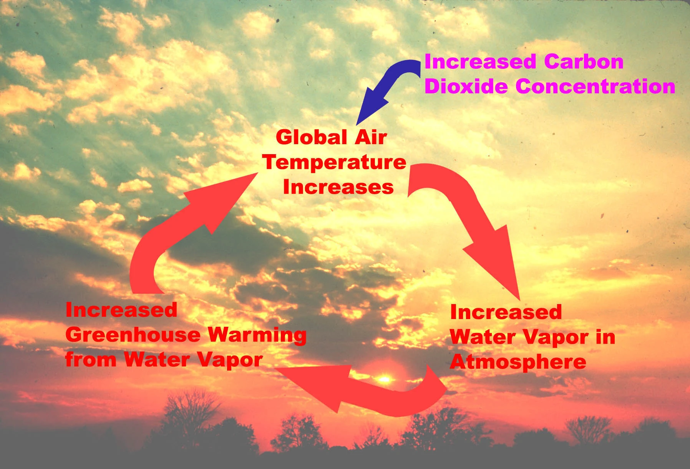{width="100%"}

::: {.caption}
Ciclo de retroalimentación positiva del vapor de agua.
:::

:::
:::

## Desafío existencial: sistema complejo - incertidumbre {.compact}

::: columns
::: {.column width="40%"}
{width="100%"}

::: {.caption}
*El Coloso*, atribuido a Goya (c. 1808–1812)
:::
:::
::: {.column width="60%"}

Si todo el hielo de la Antártica y Groenlandia se derritiera, el nivel del mar aumentaría en aproximadamente 70 metros.

No existe certeza de cual es el nivel de calentamiento que gatillaría este *"punto de no retorno"*.

¿Cómo se vería el mundo? Explora <a href="https://www.runcell.dev/tool/true-size-map/sea-level-rise-simulator">esta herramienta online</a> para simularlo.

Si bien este es un escenario que no viviremos en este siglo (ver proyecciones <a href="https://sealevel.nasa.gov/ipcc-ar6-sea-level-projection-tool?type=global">aquí</a>), si es una posibilidad en el futuro si no actuamos hoy.

:::
:::

---

## ¿Qué podemos hacer? Proyectar, mitigar y adaptar {.compact}

Primero debemos comprender el complejo sistema climático-social para **proyectar las emisiones de GEI y sus consecuencias sobre nuestras sociedades**. El <a href="https://www.ipcc.ch/reports/">sexto reporte del IPCC</a> representa un punto de referencia relevante de este esfuerzo. Luego, debemos pasar a la **acción climática**, de la cual hay dos tipos:

::: columns
::: {.column width="48%"}
::: {.box}
**Mitigación**

Reducir las emisiones de GEI para limitar el calentamiento futuro

- Mercados de carbono (Cap and Trade)
- Reducción de deforestación (REDD+)
- Energías renovables
- Eficiencia energética
:::
:::
::: {.column width="48%"}
::: {.box}
**Adaptación**

Ajustarse a los impactos del cambio climático que ya son inevitables

- Infraestructura resiliente
- Sistemas de alerta temprana
- Manejo sustentable del agua
- Planificación urbana
:::
:::
:::

---

## Chile: Ley Marco de Cambio Climático {.compact}

::: columns
::: {.column width="55%"}
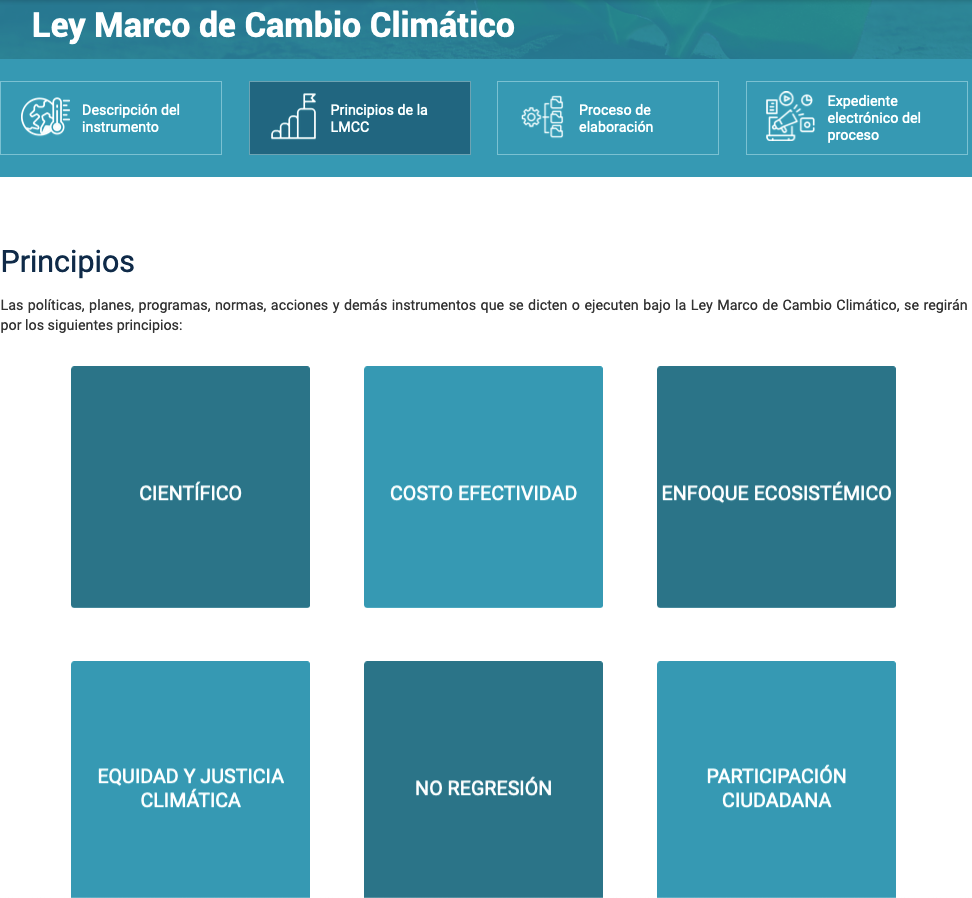{width="100%"}
:::
::: {.column width="43%"}
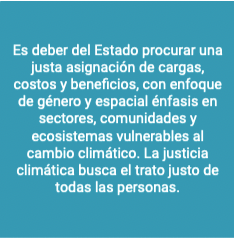{width="100%"}

::: {.caption}
Equidad y Justicia Climática en Ley Marco de Cambio Climático
:::

:::
:::

# CT: Cambio Climático, Desigualdad y Grupos Vulnerables {.section-slide background-color="#2a7f62"}

## El cambio climático no afecta a todos por igual {.compact}

- El cambio climático **exacerba desigualdades preexistentes**, afectando desproporcionadamente a comunidades marginalizadas (Aguilar Revelo, 2021; FAO, 2021; IDB, 2021; World Bank, 2024)
- Tres grupos particularmente vulnerables en LATAM:
  - **Mujeres**
  - **Pueblos indígenas**
  - **Afrodescendientes**
- La evidencia causal muestra que múltiples dimensiones de desigualdad se **intersectan**, poniendo a ciertos grupos en riesgo elevado
- Pero estos mismos grupos también poseen conocimientos y capacidades que pueden contribuir a la **mitigación y adaptación**

---

## Impactos en salud: mujeres y niños {.compact}

::: {.two-level}
- **Salud materna:** la exposición al calor durante el embarazo aumenta el riesgo de hipertensión, eclampsia y parto prematuro (Cil & Cameron, 2017) — efectos más severos en países en desarrollo (Banerjee & Maharaj, 2020)
- **Primera infancia:** los shocks climáticos tienen efectos diferenciados por género en niños
  - Fetos masculinos son biológicamente más vulnerables en el útero (mayores requerimientos de nutrientes y oxígeno) (Ai & Tan, 2023; 2024)
  - Los efectos postnatales varían según contexto — en algunos países, las niñas son más afectadas por la reasignación de recursos dentro del hogar (Anttila-Hughes & Hsiang, 2013)
- **Salud mental:** temperaturas sobre 30°C aumentan la probabilidad de depresión en mujeres un **50,7% más** que en hombres (Hua et al., 2023)
  - En Australia, sequías y calor extremo aumentan las tasas de suicidio, con efectos más fuertes en zonas con mayor proporción de pueblos indígenas (Xu et al., 2024)
:::

---

## Impactos económicos diferenciados {.compact}

::: {.two-level}
- **Trabajo y salarios:** los shocks climáticos afectan más los ingresos de las mujeres — en algunos contextos, las jornadas laborales de las mujeres se reducen hasta un **19% más** que las de los hombres durante sequías (Afridi et al., 2022)
- **Migración:** los hombres tienden a migrar por trabajo ante shocks agrícolas; las mujeres enfrentan restricciones por normas de género (Afridi et al., 2022)
  - En El Salvador, la migración masculina a EE.UU. aumentó tras sequías, pero la femenina **disminuyó** (Halliday, 2012)
- **Capital humano:** los eventos extremos provocan cierre de escuelas y reasignación de recursos del hogar (Björkman-Nyqvist, 2013)
  - En hogares con preferencia por hijos varones, la educación de las niñas es la primera en sacrificarse durante crisis climáticas (Dessy et al., 2023)
- **Violencia:** los shocks climáticos aumentan la violencia contra las mujeres — las "muertes por dote" en India aumentan ~8% con caídas en las lluvias (Sekhri & Storeygard, 2014)
:::

---

## ¿Quién se adapta mejor? {.compact}

::: columns
::: {.column width="48%"}
::: {.box}
**Barreras para las mujeres**

- Tenencia de tierra insegura (Ginbo & Hansson, 2023)
- Menor acceso a crédito y financiamiento (Abedifar et al., 2024)
- Menor acceso a tecnologías adaptativas (e.g., aire acondicionado) (Kim et al., 2021)
- Normas de género que limitan la movilidad y la toma de decisiones (Afridi et al., 2022)
:::
:::
::: {.column width="48%"}
::: {.box}
**Oportunidades**

- Las mujeres agricultoras responden **más fuertemente** a capacitaciones sobre semillas resilientes al clima (Dar et al., 2020)
- Diseminan información sobre agricultura climáticamente inteligente más efectivamente (Shikuku, 2019)
- La transferencia de efectivo a mujeres embarazadas mitiga los efectos de shocks de calor en sus hijos (Chatterjee & Merfeld, 2021)
:::
:::
:::

---

## Pueblos indígenas y cambio climático {.compact}

::: {.two-level}
- Los pueblos indígenas gestionan hasta el **25% de la superficie terrestre** y sus territorios se superponen con el **40% de las áreas protegidas** (Garnett et al., 2018)
- La evidencia causal muestra que, con derechos de propiedad seguros, los territorios indígenas son **las barreras más efectivas contra la deforestación** (Nepstad et al., 2006)
  - En Brasil, los territorios indígenas reducen la deforestación 8 veces más que las áreas circundantes (Baragwanath & Bayi, 2020)
  - En Colombia, territorios indígenas y afrodescendientes reducen deforestación, con impactos mayores en municipios remotos con baja capacidad estatal (Bonilla-Mejía & Higuera-Mendieta, 2019)
  - El reconocimiento formal (no solo la demarcación) es el factor crítico: reduce deforestación **y promueve la regeneración** con especies nativas (Baragwanath et al., 2023)
- Los pueblos indígenas poseen **conocimiento tradicional** sobre manejo de ecosistemas, predicción climática y gestión de recursos que complementa la ciencia occidental (Karim, 2024)
:::

---

## Mujeres en la toma de decisiones ambientales {.compact}

La evidencia causal sugiere que la mayor participación de mujeres en posiciones de liderazgo se asocia con políticas más sustentables:

::: {.two-level}
- Mayor representación femenina en parlamentos se asocia con políticas climáticas **más estrictas** y menores emisiones de CO₂ (Mavisakalyan & Tarverdi, 2019)
- Mujeres en directorios corporativos se asocian con menor huella de carbono de las empresas — se necesita una "masa crítica" de 2–3 mujeres para que el efecto sea significativo (Atif et al., 2020)
- Un aumento de una unidad en el índice de empoderamiento femenino se asocia con una reducción del **11,5%** en emisiones de CO₂ (Lv & Deng, 2019)
- Sin embargo, estos efectos dependen de la **calidad de gobernanza** — en contextos de alta corrupción, los resultados pueden invertirse (Dutta et al., 2024)
:::

---

## Grandes vacíos en la evidencia {.compact}

A pesar de los avances, quedan enormes lagunas de conocimiento:

::: {.two-level}
- **Afrodescendientes:** el grupo más desatendido en la investigación — la gran mayoría de los estudios se enfoca en mujeres, muy pocos en pueblos indígenas, y casi ninguno en afrodescendientes
- **América Latina:** la principal contribución de la región es sobre **derechos de propiedad indígena y conservación** (sobre todo Brasil y Colombia), pero falta evidencia sobre impactos y capacidad adaptativa
- **Impactos culturales:** no existe evidencia causal sobre cómo el cambio climático afecta las prácticas culturales, la lengua o los sistemas de conocimiento tradicional de los pueblos indígenas
- **Economía informal:** faltan estudios sobre las consecuencias económicas del cambio climático para pueblos indígenas y trabajadores informales
:::

---

## El nexo entre la lectura y los grupos vulnerables {.compact}

::: columns
::: {.column width="48%"}
La lectura de Our World in Data muestra que la **responsabilidad** por las emisiones es profundamente desigual entre países.

Pero la desigualdad también opera **dentro** de los países:

- Los grupos que menos contribuyen a las emisiones son los que más sufren sus efectos
- La pobreza, el género y la etnicidad **amplifican** la vulnerabilidad climática
:::
::: {.column width="48%"}
::: {.box}
**Desigualdad entre países**

Países ricos emiten más, países pobres sufren más

(Ritchie & Roser, 2020)
:::

::: {.box}
**Desigualdad dentro de países**

Mujeres, pueblos indígenas y afrodescendientes enfrentan impactos desproporcionados — y tienen menor capacidad de adaptación
:::
:::
:::

---

## ¿Qué hacer? {.compact}

::: {.two-level}
- **Reconocer derechos territoriales indígenas** — la evidencia muestra que es una de las estrategias de mitigación más costo-efectivas
- **Fortalecer la participación de mujeres** en la toma de decisiones ambientales — la evidencia sugiere que produce políticas más sustentables
- **Invertir en adaptación diferenciada** — las políticas de adaptación deben considerar las barreras específicas que enfrentan mujeres, pueblos indígenas y afrodescendientes
- **Cerrar brechas de conocimiento** — necesitamos más investigación causal, especialmente en América Latina y sobre afrodescendientes
- **Integrar conocimiento tradicional** — no como sustituto, sino como complemento del conocimiento científico
:::

# Actividad: Cambio Climático y Efectos Diferenciados {.section-slide background-color="#2a7f62"}

## Instrucciones {.compact}

Cada pareja será asignada a **uno** de los siguientes temas:

::: columns
::: {.column width="48%"}
::: {.box}
**A.** Biodiversidad

**B.** Incendios forestales
:::
:::
::: {.column width="48%"}
::: {.box}
**C.** Patrones de lluvia

**D.** Eventos climáticos extremos (olas de calor, tormentas)
:::
:::
:::

Trabajarán **en parejas** y usarán **inteligencia artificial** (ChatGPT, Claude, Gemini, etc.) como herramienta de investigación para responder tres preguntas sobre su tema.

---

## Las tres preguntas {.activity-slide}

Para su tema asignado, investiguen usando IA:

1. **Impacto:** ¿Qué predice la evidencia científica sobre el efecto del cambio climático en su tema? ¿Dónde geográficamente es más crítico?

2. **Desigualdad:** ¿Cómo afecta de manera diferenciada a **mujeres, pueblos indígenas o afrodescendientes**? Conecten con lo visto en clase.

3. **Respuesta:** ¿Qué medidas de **mitigación** o **adaptación** existen? ¿Qué se está haciendo en **Chile**?

---

## Prompt sugerido {.compact}

Copien y adapten este prompt en su herramienta de IA:

::: {.box}
Soy estudiante de un curso universitario sobre sustentabilidad. Necesito investigar el efecto del cambio climático sobre **[TEMA]**. Responde de forma concisa y con referencias a estudios o reportes reales (IPCC, CEPAL, etc.):

1. ¿Cuáles son las predicciones científicas principales sobre cómo el cambio climático afecta [TEMA]? ¿Qué regiones del mundo son más vulnerables?
2. ¿Existen efectos diferenciados para mujeres, pueblos indígenas o comunidades afrodescendientes? Dame ejemplos concretos con evidencia.
3. ¿Qué medidas de mitigación y adaptación se están implementando, especialmente en Chile o América Latina?

Para cada punto, indica las fuentes que respaldan tu respuesta.
:::

---

## Lectura crítica de la IA (5 min) {.activity-slide}

Después de obtener la respuesta, discutan en pareja:

- ¿Las fuentes citadas son **reales y verificables**? (Busquen al menos una)
- ¿Hay afirmaciones **vagas** o sin evidencia concreta?
- ¿Coincide con lo que vimos en clase sobre grupos vulnerables?
- ¿Qué **falta** en la respuesta? ¿Qué agregarían ustedes?

::: {.box}
La IA es un punto de partida, no una respuesta final. Su valor está en lo que ustedes hacen con ella
:::

---

## Plenario (12 min) {.activity-slide}

Una pareja por tema (elegida al azar) presenta en **3 minutos**:

1. Su tema y los hallazgos principales
2. Un ejemplo concreto de efecto diferenciado en grupos vulnerables
3. Una medida de mitigación o adaptación relevante para Chile
4. ¿Qué tan útil fue la IA? ¿Qué tuvieron que corregir o complementar?

## Referencias (1/4) {.compact .smaller}

- Abedifar, P., Kashizadeh, S. J., & Ongena, S. (2024). Flood, farms and credit: The role of branch banking in the era of climate change. *Journal of Corporate Finance*, 85, 102544.
- Afridi, F., Mahajan, K., & Sangwan, N. (2022). The gendered effects of droughts: Production shocks and labor response in agriculture. *Labour Economics*, 78, 102227.
- Aguilar Revelo (2021). La igualdad de género ante el cambio climático. Serie Asuntos de Género, N° 159, CEPAL.
- Ai, H., & Tan, X. (2023). The effects of exposure to high temperatures during pregnancy on adolescent mental health: Evidence from China. *China Economic Review*, 80, 101991.
- Ai, H., & Tan, X. (2024). The impact of early-life exposure to high temperatures on child development: evidence from China. *Population and Environment*, 46(3).
- Anttila-Hughes, J., & Hsiang, S. (2013). Destruction, disinvestment, and death: Economic and human losses following environmental disaster (Vol. 10). SSRN.
- Atif, M., Hossain, M., Alam, M. S., & Goergen, M. (2020). Does board gender diversity affect renewable energy consumption? *Journal of Corporate Finance*, 66, 101665.
- Banerjee, R., & Maharaj, R. (2020). Heat, infant mortality, and adaptation: Evidence from India. *Journal of Development Economics*, 143, 102378.

---

## Referencias (2/4) {.compact .smaller}

- Baragwanath, K., & Bayi, E. (2020). Collective property rights reduce deforestation in the Brazilian Amazon. *Proceedings of the National Academy of Sciences*, 117(34), 20495–20502.
- Baragwanath, K., Bayi, E., & Shinde, N. (2023). Collective property rights lead to secondary forest growth in the Brazilian Amazon. *Proceedings of the National Academy of Sciences*, 120(22).
- Björkman-Nyqvist, M. (2013). Income shocks and gender gaps in education: Evidence from Uganda. *Journal of Development Economics*, 105, 237-253.
- Bonilla-Mejía, L., & Higuera-Mendieta, I. (2019). Protected Areas under Weak Institutions: Evidence from Colombia. *World Development*, 122, 585-596.
- Chatterjee, J., & Merfeld, J. D. (2021). Protecting girls from droughts with social safety nets. *World Development*, 147, 105624.
- Cil, G., & Cameron, T. A. (2017). Potential Climate Change Health Risks from Increases in Heat Waves: Abnormal Birth Outcomes and Adverse Maternal Health Conditions. *Risk Analysis*, 37(11), 2066-2079.
- Dar, M. H., Waza, S. A., Nayak, S., Chakravorty, R., Zaidi, N. W., & Hossain, M. (2020). Gender focused training and knowledge enhances the adoption of climate resilient seeds. *Technology in Society*, 63, 101388.
- Dessy, S., Tiberti, L., & Zoundi, D. (2023). The gender education gap in developing countries: Roles of income shocks and culture. *Journal of Comparative Economics*, 51(1), 160-180.

---

## Referencias (3/4) {.compact .smaller}

- Dutta, N., Kar, S., & Jahan, I. (2024). Environmental policy implementation, gender, and corruption. *Economics of Governance*, 25(2), 257-290.
- FAO (2021). *Indigenous peoples, Afro-descendants and climate change in Latin America – Ten scalable experiences of intercultural collaboration*. Santiago.
- Garnett, S. T., Burgess, N. D., Fa, J. E. et al. (2018). A spatial overview of the global importance of Indigenous lands for conservation. *Nature Sustainability*, 1(7), 369-374.
- Ginbo, T., & Hansson, H. (2023). Intra-household risk perceptions and climate change adaptation in sub-Saharan Africa. *European Review of Agricultural Economics*, 50(3), 1039-1063.
- Halliday, T. J. (2012). Intra-household labor supply, migration, and subsistence constraints in a risky environment: Evidence from rural El Salvador. *European Economic Review*, 56(6), 1001-1019.
- Hua, Y., Qiu, Y., & Tan, X. (2023). The effects of temperature on mental health: evidence from China. *Journal of Population Economics*, 36(3), 1293-1332.
- Inter-American Development Bank Group (IDB). (2021). *Climate Action Plan 2021-2025*.
- Karim, A. (2024). Knowledge, perception or disaster experience? The new determinants of household disaster preparedness behaviour in Bangladesh. *Journal of International Development*, 36(6), 2557-2580.

---

## Referencias (4/4) {.compact .smaller}

- Kim, J., Lee, A., & Rossin-Slater, M. (2021). What to Expect When It Gets Hotter. *American Journal of Health Economics*, 7(3), 281-305.
- Lv, Z., & Deng, C. (2019). Does women's political empowerment matter for improving the environment? A heterogeneous dynamic panel analysis. *Sustainable Development*, 27(4), 603-612.
- Mavisakalyan, A., & Tarverdi, Y. (2019). Gender and climate change: Do female parliamentarians make a difference? *European Journal of Political Economy*, 56, 151-164.
- Nepstad, D., Schwartzman, S., Bamberger, B. et al. (2006). Inhibition of Amazon Deforestation and Fire by Parks and Indigenous Lands. *Conservation Biology*, 20(1), 65-73.
- Sekhri, S., & Storeygard, A. (2014). Dowry deaths: Response to weather variability in India. *Journal of Development Economics*, 111, 212-223.
- Shikuku, K. M. (2019). Information exchange links, knowledge exposure, and adoption of agricultural technologies in northern Uganda. *World Development*, 115, 94-106.
- World Bank. (2024). *Executive summary: Indigenous people's resilience framework*. Washington, DC: World Bank.
- Xu, Y., Wheeler, S. A., & Zuo, A. (2024). Drought and hotter temperature impacts on suicide: Evidence from the Murray–Darling basin, Australia. *Climate Change Economics*, 15(01), 2350024.
