## Plan para hoy

### Primer bloque

- A+R: La vigencia de Rachel Carson
- CT: Control y Descontrol

### Segundo bloque
- CT: La Gran Transición
- Presentación Tarea 05

# A+R: La Vigencia de Rachel Carson {.section-slide background-color="#2a7f62"}

## Reflexión en parejas {.activity-slide}

*Silent Spring* fue publicado hace más de 60 años...

1. ¿Sigue vigente el mensaje principal de los capítulos leídos?
2. ¿Qué contaminantes crees que han permeado los ecosistemas en Chile?
3. ¿Qué amenazas contemporáneas conoces que sean comparables al DDT?

---

## La carta de la IA {.activity-slide}

Lean el resumen del siguiente artículo, escrito por los propios creadores de la IA — incluidos dos premios Turing — alertando sobre los riesgos de la tecnología que ellos mismos construyeron:

[Gestionar los riesgos extremos de la IA](lectura_ia.html) — resumen en español

¿Cómo relacionan el artículo con la lectura de Carson?

::: {.box}
Carson advertía sobre tecnologías adoptadas sin comprender sus consecuencias. Los creadores del DDT nunca publicaron esa advertencia — los de la IA sí. ¿Será suficiente?
:::

---

## Plenario {.activity-slide}

Algunas parejas comparten sus reflexiones.

- ¿Qué paralelos encontraron entre Carson y la carta sobre IA?
- ¿Qué contaminantes mencionaron para el caso chileno?

# CT: Control y Descontrol {.section-slide background-color="#2a7f62"}

## El poder de la ciencia moderna {.compact}

::: columns
::: {.column width="45%"}
Los avances de la ciencia y la tecnología nos han puesto en una posición única: somos la primera especie que tiene un **control consciente** del bioma

Este tremendo poder ha sido utilizado para el beneficio de la humanidad, pero también contra ella
:::
::: {.column width="45%"}
En muchas ocasiones hemos adoptado los avances sin detenernos a reflexionar en las consecuencias: **efectos no deseados**

Revisaremos 6 tecnologías que ilustran este patrón
:::
:::

---

## Seis tecnologías, un patrón {.compact}

::: columns
::: {.column width="32%"}
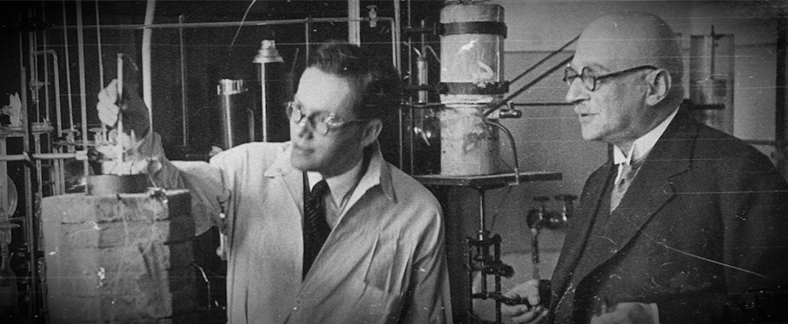{width="90%"}

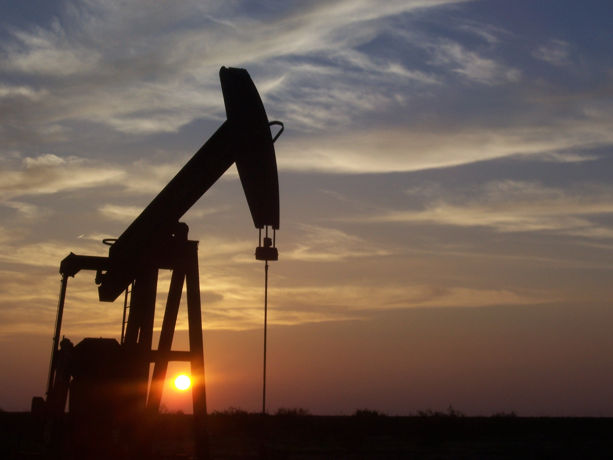{width="90%"}
:::
::: {.column width="32%"}
{width="90%"}

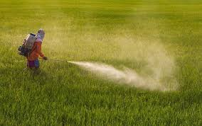{width="90%"}
:::
::: {.column width="32%"}
{width="90%"}

{width="90%"}
:::
:::

---

## Método Haber-Bosch: lo bueno {.compact}

::: columns
::: {.column width="48%"}
::: {.box}
**Lo bueno**

El método Haber-Bosch revolucionó la agricultura. Extrae el nitrógeno — un nutriente esencial para el crecimiento vegetal — del aire (78% N₂)

Así, Haber y Bosch lograron hacer **"pan del aire"**
:::
:::
::: {.column width="48%"}
{width="100%"}
:::
:::

---

## Método Haber-Bosch: lo malo {.compact}

::: columns
::: {.column width="48%"}
::: {.box}
**Lo malo**

El uso indiscriminado de fertilizantes ha desbalanceado el ciclo natural del nitrógeno

La abundancia excesiva de nutrientes lleva a la **eutrofización** de los cuerpos de agua — no solo matando la vida acuática, sino haciendo el agua tóxica para los humanos
:::
:::
::: {.column width="48%"}
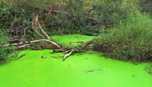{width="100%"}
:::
:::

---

## Pesticidas: lo bueno {.compact}

::: columns
::: {.column width="48%"}
::: {.box}
**Lo bueno**

Los pesticidas han permitido aumentar la productividad agrícola industrial
:::
:::
::: {.column width="48%"}
{width="100%"}
:::
:::

---

## Pesticidas: lo malo {.compact}

::: columns
::: {.column width="48%"}
::: {.box}
**Lo malo**

El uso indiscriminado de pesticidas no solo mata a la peste objetivo, sino a muchos seres vivos que cumplen funciones claves en el ecosistema, como los **polinizadores**

Los pesticidas se acumulan en el ambiente. Se transmiten a través de la **cadena trófica**, eventualmente exponiendo a los humanos
:::
:::
::: {.column width="48%"}
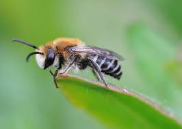{width="100%"}
:::
:::

---

## Pesticidas: bioacumulación

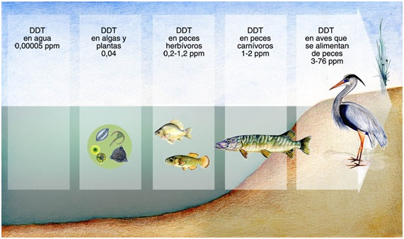{width="80%"}

::: {.caption}
La bioacumulación de pesticidas en la cadena trófica — el fenómeno central que denunció Rachel Carson en *Silent Spring*.
:::

---

## Combustibles fósiles: lo bueno {.compact}

::: columns
::: {.column width="48%"}
::: {.box}
**Lo bueno**

Los combustibles fósiles han sido claves para el proceso de industrialización que ha sacado a millones de personas de la pobreza
:::
:::
::: {.column width="48%"}
{width="100%"}
:::
:::

---

## Combustibles fósiles: lo malo {.compact}

::: columns
::: {.column width="48%"}
::: {.box}
**Lo malo**

El CO₂ es el principal responsable del **cambio climático**

La contaminación atmosférica causa **7 millones de muertes prematuras** al año (OMS)
:::
:::
::: {.column width="48%"}
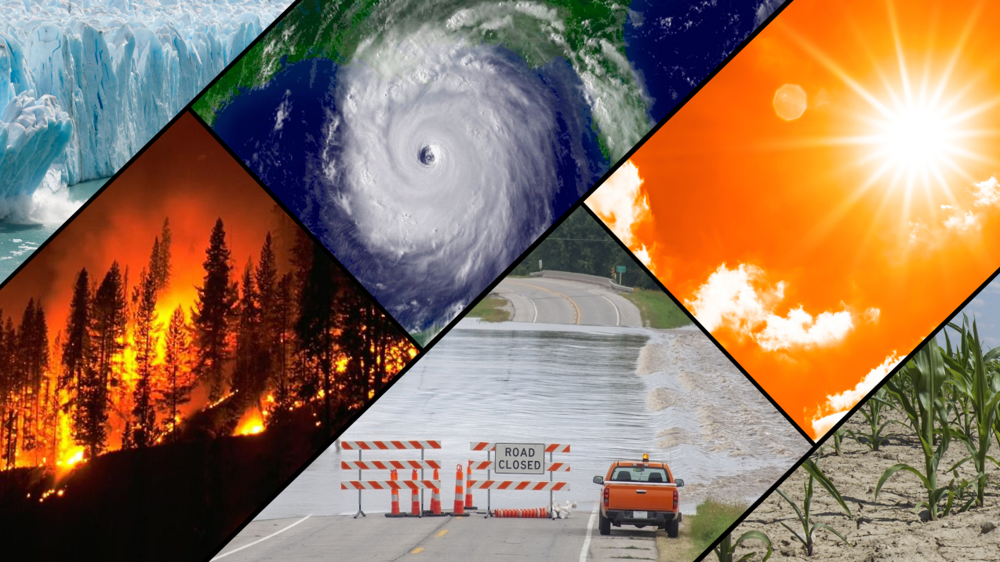{width="100%"}

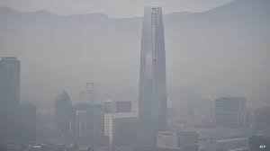{width="100%"}
:::
:::

---

## Energía nuclear: lo bueno {.compact}

::: columns
::: {.column width="48%"}
::: {.box}
**Lo bueno**

La energía atómica es extremadamente eficiente y no genera emisiones de CO₂
:::
:::
::: {.column width="48%"}
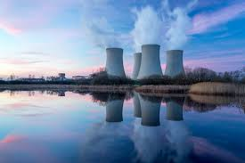{width="100%"}
:::
:::

---

## Energía nuclear: lo malo {.compact}

::: {.box}
**Lo malo**

El desarrollo bélico de la energía atómica puso, por primera vez, la posibilidad de poner fin a la vida en la Tierra en manos de los seres humanos

Los desechos nucleares son difíciles de gestionar, y durante décadas se tiraron al mar

Los accidentes nucleares, si bien infrecuentes, pueden dejar el ambiente contaminado con radiación por siglos
:::

::: columns

::: {.column width="33%"}
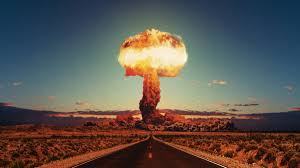{width="100%"}
:::

::: {.column width="33%"}
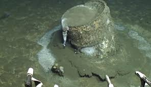{width="100%"}
:::

::: {.column width="33%"}
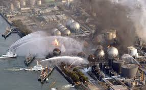{width="100%"}
:::

:::

---

## Antibióticos: lo bueno {.compact}

::: columns
::: {.column width="48%"}
::: {.box}
**Lo bueno**

El descubrimiento accidental de la penicilina por Alexander Fleming ha salvado millones de vidas
:::
:::
::: {.column width="48%"}
{width="100%"}
:::
:::

---

## Antibióticos: lo malo {.compact}

::: columns
::: {.column width="48%"}
::: {.box}
**Lo malo**

El uso indiscriminado de los antibióticos ha llevado a una **"carrera armamentista"** contra las bacterias, que generan resistencia
:::
:::
::: {.column width="48%"}
{width="100%"}
:::
:::

---

## Plástico: lo bueno {.compact}

::: columns
::: {.column width="48%"}
::: {.box}
**Lo bueno**

El plástico es un material resistente pero flexible, y ha hecho posible gran parte de los bienes que usamos
:::
:::
::: {.column width="48%"}
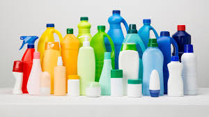{width="100%"}
:::
:::

---

## Plástico: lo malo {.compact}

::: columns
::: {.column width="48%"}
::: {.box}
**Lo malo**

La deposición irresponsable de plásticos contamina el ambiente, afectando gravemente a la fauna

Al degradarse, el plástico se convierte en **microplástico**, el cual se acumula en la cadena trófica

El documental [*Albatross*](https://www.albatrossthefilm.com/) muestra el impacto devastador del plástico en las aves marinas de Midway Atoll
:::
:::
::: {.column width="48%"}
{width="100%"}
:::
:::

---

## Plástico: la contaminación invisible

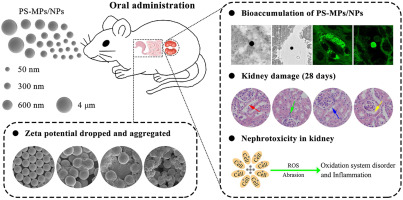{width="80%"}

::: {.caption}
Los microplásticos se han encontrado en la sangre humana, la placenta, la leche materna y hasta en la nieve de la Antártica.
:::

---

## Reflexión: ¿otros ejemplos?

¿Saben de otros ejemplos de progresos de la modernidad que han tenido consecuencias negativas no anticipadas?

---

## Síntesis: "the solution to pollution is NOT dilution"

Durante mucho tiempo, se creía que *"the solution to pollution is dilution"*

Sin embargo, podemos decir que *"it is a **delusion** that the solution to pollution is dilution"*

::: {.box}
El gran poder que hemos ganado con la ciencia trae consigo una **gran responsabilidad**

Esto no nos debe llevar a paralizar el progreso, pero sí a avanzar con **precaución** — el **principio precautorio**
:::

# CT: La Gran Transición {.section-slide background-color="#2a7f62"}

## Energía como "baterías" {.compact}

::: columns
::: {.column width="48%"}
La fuente de energía que nos sustenta desde tiempos inmemoriales proviene del flujo de radiación que recibimos del sol

Podemos pensar en las fuentes de energía que utilizamos como **"baterías"**, que se cargan con el sol en un stock disponible para nuestro consumo
:::
::: {.column width="48%"}
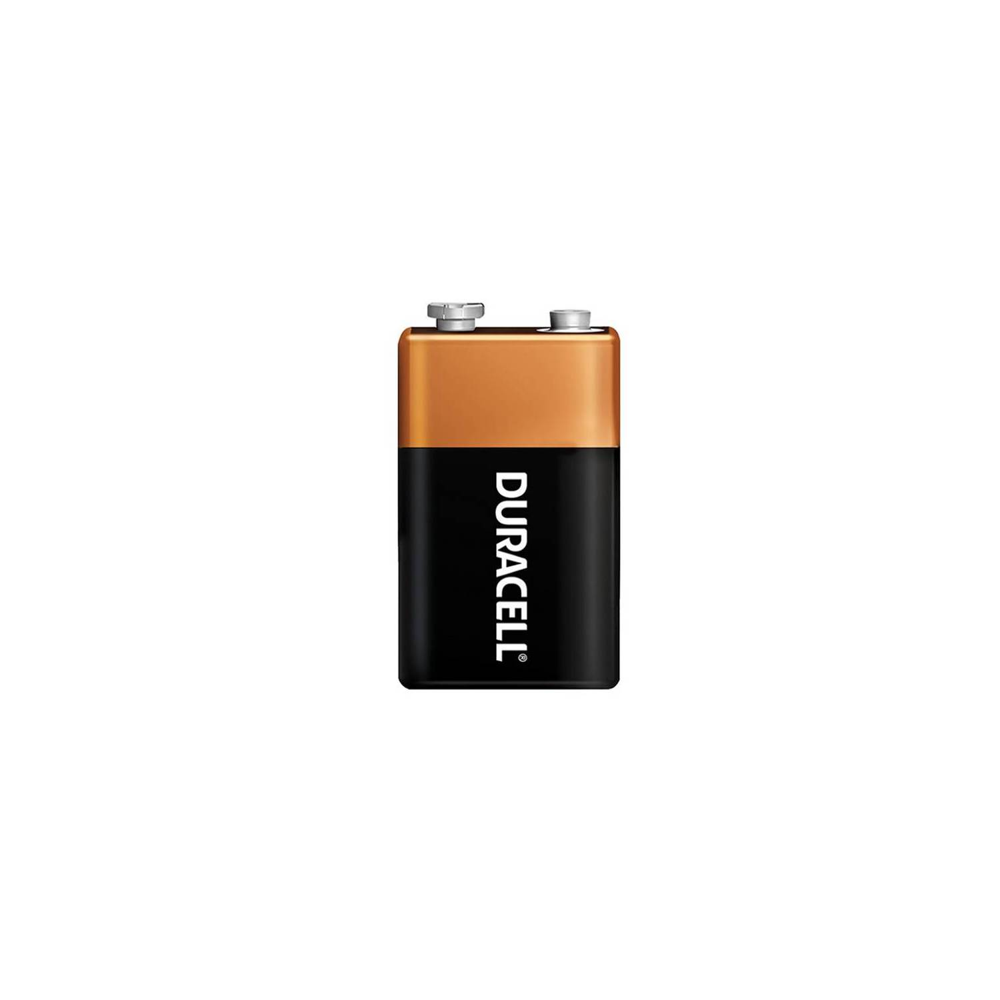{width="100%"}
:::
:::

---

## Las baterías del sol {.compact}

::: columns
::: {.column width="32%"}
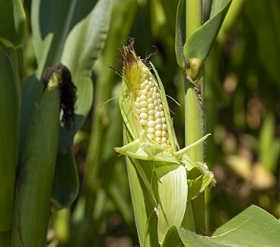{width="100%"}

::: {.caption}
**Cultivos:** se "cargan" en menos de 1 año
:::
:::
::: {.column width="32%"}
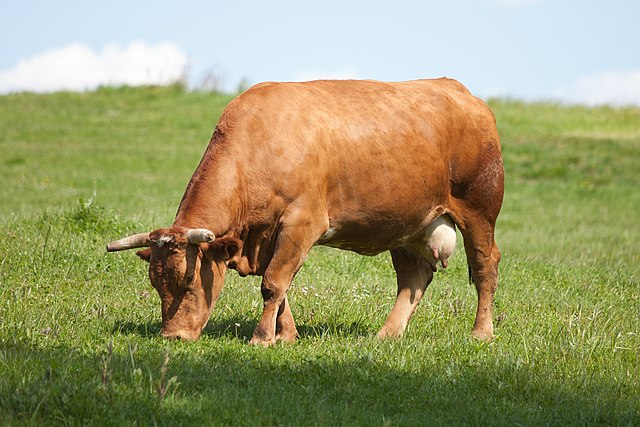{width="100%"}

::: {.caption}
**Ganado:** se "carga" en 2–3 años
:::
:::
::: {.column width="32%"}
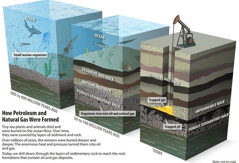{width="100%"}

::: {.caption}
**Combustibles fósiles:** se "cargan" en millones de años
:::
:::
:::

---

## La descarga rápida de la batería terrestre

::: columns
::: {.column width="55%"}
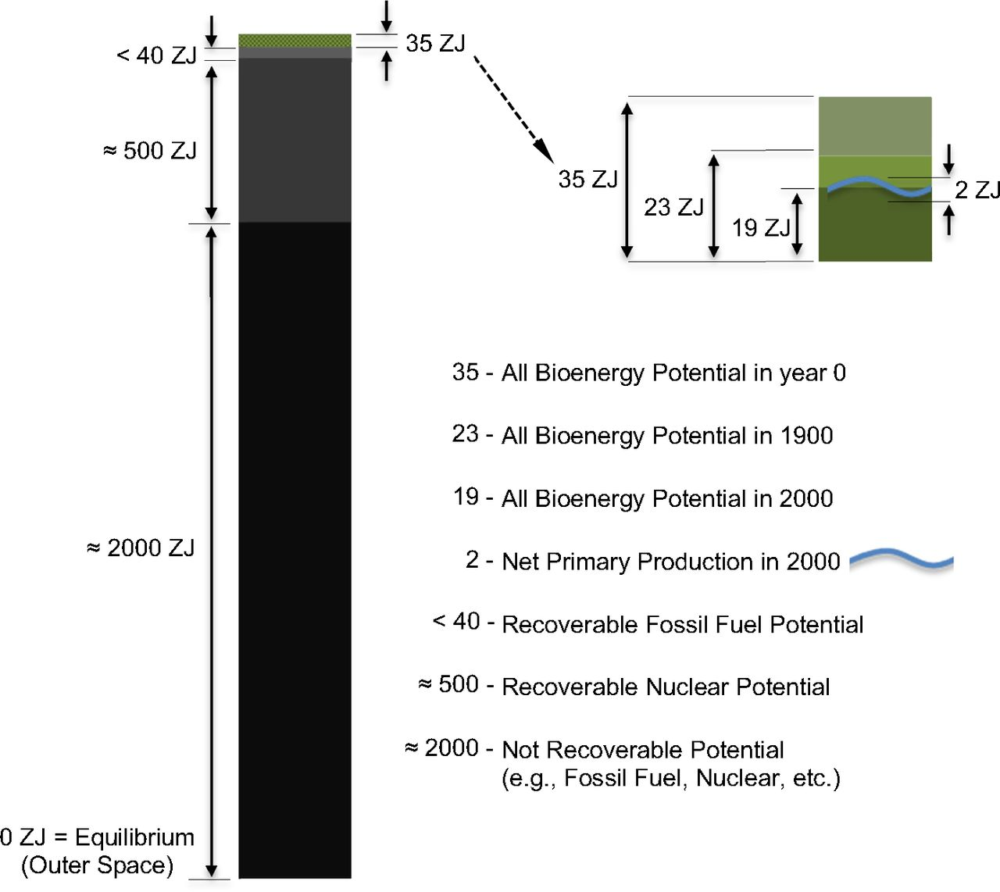{width="100%"}
:::
::: {.column width="43%"}
La explosión del uso de combustibles fósiles implica que estamos **descargando la batería** a una velocidad sin precedente

::: {.caption}
Fuente: Schramski, J., Gattie, D. & Brown, J. (2015). Human domination of the biosphere: Rapid discharge of the earth-space battery foretells the future of humankind. *PNAS*, 112(31): 9511–9517.
:::
:::
:::

---

## La batería se está agotando

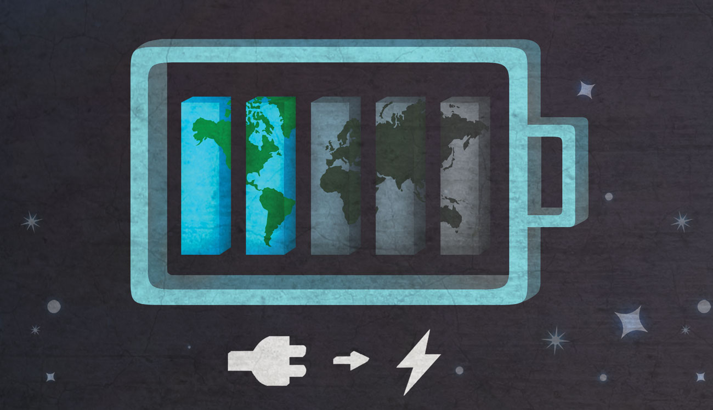{width="80%"}

::: {.caption}
Fuente: University of Georgia Research — "Earth's battery is running low."
:::

---

## Dos razones para la transición {.compact}

::: columns
::: {.column width="48%"}
::: {.box}
**Razón 1: Agotamiento**

En ausencia del cambio climático, la rápida descarga implicaría que sería importante explorar alternativas para sostenernos con energías renovables, dado que eventualmente las energías fósiles se terminarán
:::
:::
::: {.column width="48%"}
::: {.box}
**Razón 2: Urgencia climática**

La forma en que usamos la energía (quemándola) ha aumentado la concentración de CO₂ y está cambiando el clima, lo que potencialmente traerá efectos catastróficos si no actuamos ahora

Ante este escenario, se hace **urgente** comenzar la Gran Transición
:::
:::
:::

---

## CO₂ por sector: la energía domina {.compact}

::: columns
::: {.column width="55%"}
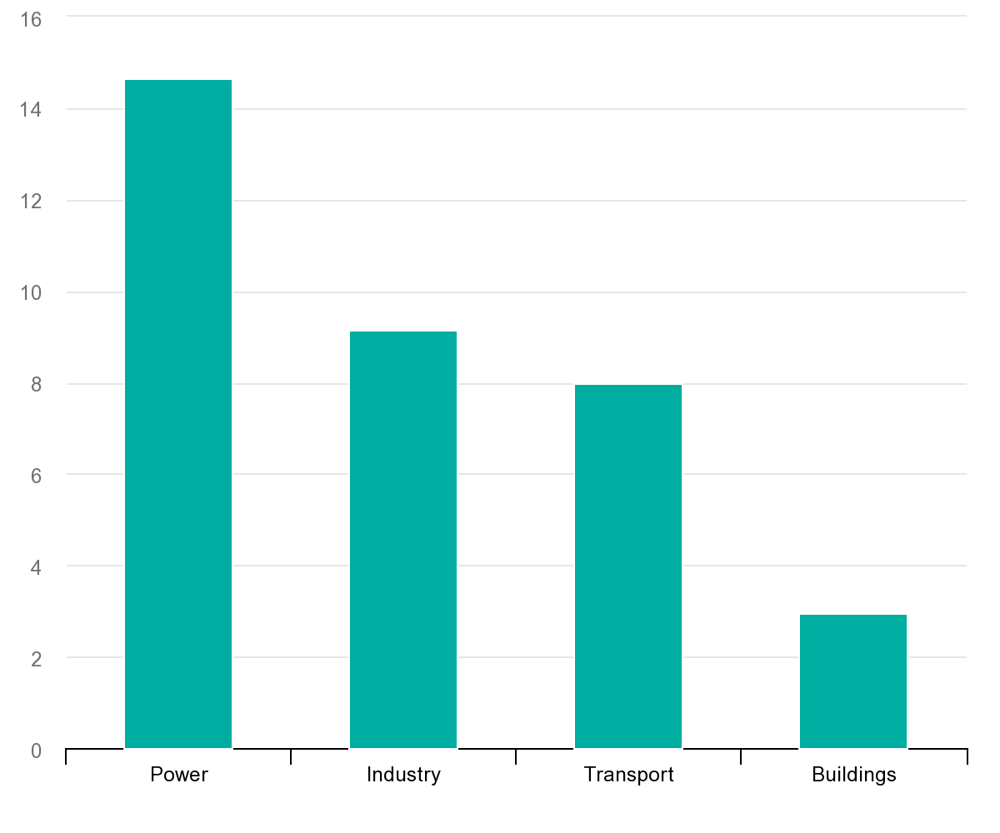{width="100%"}

::: {.caption}
Emisiones de CO₂ (Gt) en 2022. Fuente: IEA.
:::
:::
::: {.column width="43%"}
- Por lejos el sector que más emisiones genera es el de la **energía**
- La electrificación de los otros sectores solo disminuirá las emisiones en la medida que la producción de energía se **descarbonize**
:::
:::

---

## Chile: el boom de las ERNC {.compact}

::: columns
::: {.column width="48%"}
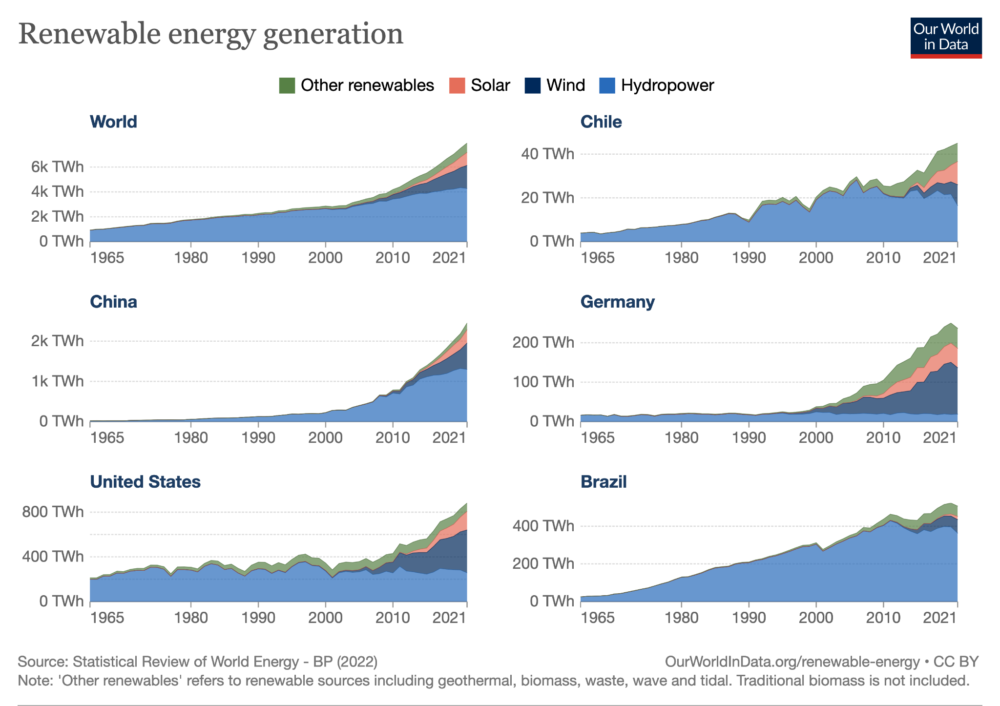{width="100%"}
:::
::: {.column width="48%"}
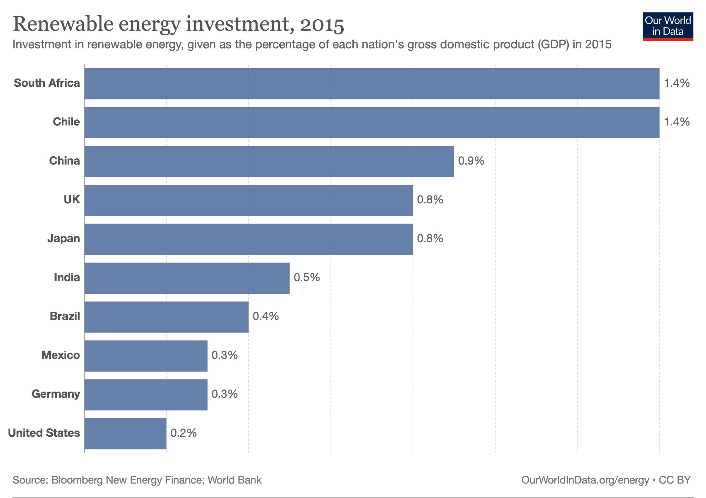{width="100%"}
:::
:::

::: {.caption}
Crecimiento de las Energías Renovables No Convencionales (ERNC) en Chile. Fuente: CNE / Ministerio de Energía.
:::

---

## ¿Qué ha hecho posible el crecimiento de las ERNC? {.compact}

::: columns
::: {.column width="48%"}
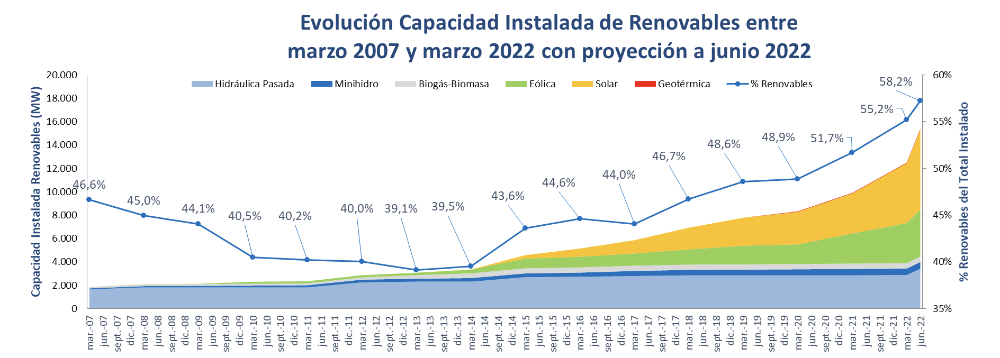{width="100%"}

::: {.caption}
Fuente: Ministerio de Energía, Reporte de proyectos en Construcción e Inversión, 2022.
:::
:::
::: {.column width="48%"}
- **Subsidios e incentivos:** muchos países han creado incentivos para la producción y adopción de ERNC: subsidios, inversiones en I+D, créditos tributarios
- **Cambios regulatorios:** incorporación de la posibilidad de vender excedentes a distribuidoras (*net-metering*)
- **Learning-by-doing:** mientras más hacemos, mejor lo hacemos — la curva de costos cae
:::
:::

---

## La curva de aprendizaje

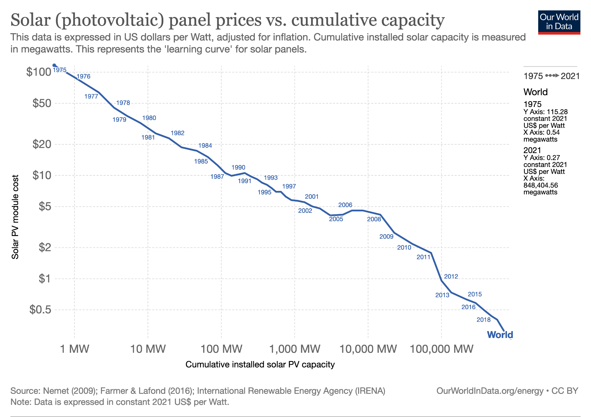{width="80%"}

::: {.caption}
Learning-by-doing: la reducción de costos de las energías renovables a medida que se acumula experiencia y escala de producción.
:::

---

## Pero la transición necesita minerales... {.compact}

::: {.box}
La transición energética requiere enormes cantidades de **cobre, litio, cobalto, níquel y tierras raras**

Un auto eléctrico necesita ~6 veces más minerales que uno convencional. Una planta eólica offshore necesita ~13 veces más minerales que una planta de gas natural de capacidad equivalente
:::

Chile es el **mayor productor mundial de cobre** y el **segundo de litio**

¿Cuáles son los costos de extraer estos minerales? ¿Quiénes pagan las consecuencias?

---

## Tensiones en el futuro verde del litio

::: {.box}
Las siguientes diapositivas están basadas en el artículo del CR2 (2025): ["¿Hacia una nueva zona de sacrificio? Fiebre del litio y desconfianza indígena"](https://www.cr2.cl/hacia-una-nueva-zona-de-sacrificio-fiebre-del-litio-y-desconfianza-indigena-tercera-dosis/)

Una mirada crítica a las tensiones entre la transición energética y los derechos de las comunidades y ecosistemas del norte de Chile
:::

---

## La fiebre del litio {.compact}

::: columns
::: {.column width="40%"}
El litio es esencial para las **baterías** de autos eléctricos, almacenamiento de energía y electrónica

En Chile se extrae principalmente del **Salar de Atacama**, mediante evaporación de **salmuera** (brine)

La Estrategia Nacional del Litio (2023) busca expandir la producción a nuevos salares: Maricunga, Pedernales, Aguilar
:::
::: {.column width="58%"}
::: {.box}
**El problema del agua**

- La extracción de salmuera consume enormes volúmenes de agua en una de las zonas **más áridas del planeta**
- En la Región de Antofagasta, el **95%** de los derechos de agua subterránea están en manos de la minería (DGA, 2009)
- La cuenca del Río Loa fue declarada **agotada** en el año 2000
- En 2022, 188 comunas chilenas (47,5% de la población) tenían decretos de escasez hídrica
:::
:::
:::

---

## Litio y comunidades indígenas {.compact}

::: columns
::: {.column width="48%"}
Los salares donde se extrae litio son **territorios ancestrales** de los pueblos Atacameño y Colla

Chile ratificó el **Convenio OIT 169**, que obliga a consultar a los pueblos indígenas afectados. Sin embargo, la consulta:

- No es vinculante
- Tiene plazos comprimidos
- Excluye a comunidades no adyacentes a los salares
:::
::: {.column width="48%"}
::: {.box}
Las comunidades indígenas desconfían porque **ya vivieron esto con el cobre**:

- En los 80, fueron desinformadas sobre el registro de derechos de agua
- CODELCO canalizó completamente el Río San Pedro
- Entre 1997–2000 hubo contaminación con plomo y arsénico en el Loa
:::

¿Se repetirá la historia con el litio?
:::
:::

---

## ¿Hacia una nueva zona de sacrificio? {.compact}

::: columns
::: {.column width="48%"}
::: {.box}
**Ecosistemas frágiles**

- Solo el **30%** de los salares está en la Red de Salares Protegidos
- Solo el **4,07%** de los humedales andinos de Antofagasta tiene protección
- Las vegas y bofedales — ecosistemas únicos — dependen del mismo acuífero que la minería
:::
:::
::: {.column width="48%"}
::: {.box}
**Vacío regulatorio**

La salmuera está clasificada legalmente como **mineral**, no como agua — lo que permite extraerla sin las restricciones del Código de Aguas

Esto crea un punto ciego regulatorio: se extrae agua sin que cuente como extracción de agua
:::
:::
:::

---

## ¿Puede ser diferente esta vez? {.compact}

::: columns
::: {.column width="55%"}
::: {.box}
**Lo que es distinto hoy**

- Chile ratificó el **Convenio 169 de la OIT** (2008) — obligación legal de consulta indígena
- Tecnologías de **extracción directa de litio** (DLE) prometen usar menos agua que la evaporación
- Presión internacional de las **cadenas de suministro** (UE exige trazabilidad ambiental y social)
- Mayor conciencia ambiental y herramientas de monitoreo (datos satelitales, SIG)
:::
:::
::: {.column width="45%"}
::: {.box}
**Lo que sigue pendiente**

- Persisten una interpretación restrictiva de las obligaciones de consulta indígena del Convenio 196
- La salmuera sigue clasificada como **mineral**, no como agua
- Solo el **30%** de los salares está protegido
- Las DLE aún no están probadas a escala comercial en Chile
:::

:::
:::

# Presentación Tarea 05 {.section-slide background-color="#2a7f62"}

## Tarea 05: Energías Renovables — Control y Descontrol {.compact}

::: columns
::: {.column width="40%"}
**¿Qué van a construir?**

Un **díptico** con dos mapas:

1. **Mapa mundial** de energías renovables como porcentaje de la matriz eléctrica
2. **Mapa de Sudamérica** con minas de litio y zonas de estrés hídrico

Una historia de Control y Descontrol: el avance renovable... y su costo oculto
:::
::: {.column width="60%"}
**Herramientas nuevas:**

- Importación de datos CSV (con y sin coordenadas)
- Join no espacial (combinar tablas)
- Exportación de capas a GeoPackage
- Simbología basada en reglas (clase "Sin información")
- Composición de impresión con dos mapas (díptico)
- Edición avanzada de leyendas
:::
:::

---

## Entregable

Un **díptico horizontal** (paisaje) con ambos mapas, exportado como imagen o PDF desde el compositor de impresión de QGIS

::: {.box}
La guía paso a paso y el archivo `.zip` con los datos están disponibles en Canvas.
:::

---

## Próxima clase {.compact}

La próxima semana exploraremos:

- **Minería en Chile** — la importancia económica y los costos ambientales
- **Relaves mineros** — qué son, por qué son peligrosos, y dónde están
- **Contaminación de suelos** — más allá de la minería
- **Herramientas GIS**: buffers y uniones espaciales

Lectura para la próxima clase: artículo de **CIPER** sobre relaves bajo el cambio climático.
