## Plan para hoy {.compact}

### Primer bloque

- CT: Minería en Chile
- A+R: Exploración de relaves

### Segundo bloque
- A+R: Minería, relaves y sustentabilidad
- CT: Contaminación de suelos
- Cápsula GIS: Operaciones espaciales
- Presentación Tarea 06

# CT: Minería en Chile {.section-slide background-color="#2a7f62"}

## Importancia económica de la minería

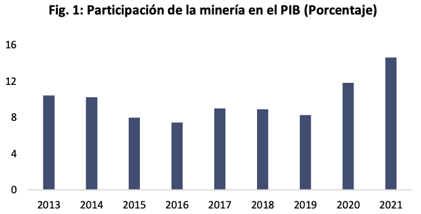{width="70%"}

::: {.caption}
Fuente: COCHILCO (2022). Análisis de Impacto Socioeconómico de la Minería a Nivel Regional.
:::

---

## Importancia económica de la minería

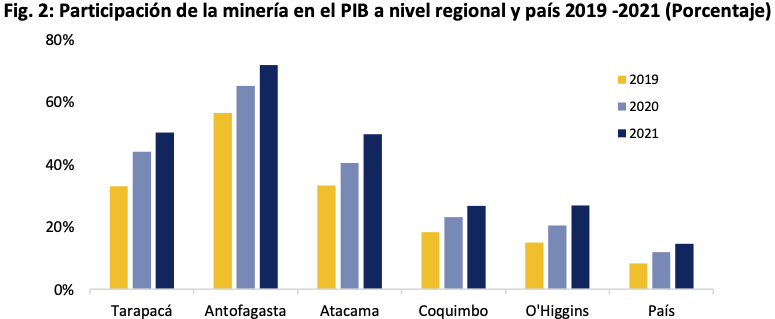{width="70%"}

::: {.caption}
Fuente: COCHILCO (2022). Análisis de Impacto Socioeconómico de la Minería a Nivel Regional.
:::

---

## Importancia económica de la minería

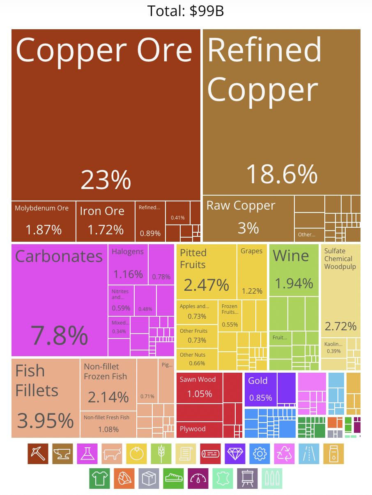{width="70%"}

::: {.caption}
Fuente: OEC — Exportaciones de Chile (2022).
:::

---

## Importancia económica de la minería

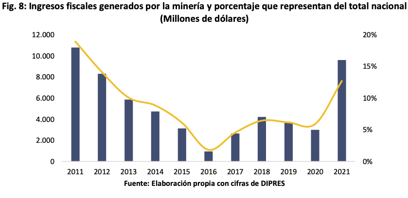{width="70%"}

::: {.caption}
Fuente: COCHILCO (2022). Análisis de Impacto Socioeconómico de la Minería a Nivel Regional.
:::

---

## ¿Cómo se produce el cobre?



---

## La ley del mineral → 99% es relave

La ley del mineral es, por lo general, **menor a 1%**

Esto quiere decir que por cada kilo de mineral, se producen **99 kilos de relave**

Los relaves son tóxicos, por lo que es fundamental asegurar su **estabilidad química y física**

---

## ¿Cómo se deben construir los relaves?

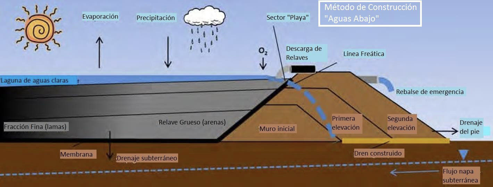{width="70%"}

::: {.caption}
Fuente: SERNAGEOMIN — Preguntas frecuentes sobre relaves. El estandar de construcción moderno es aguas abajo. Sin embargo, muchos relaves históricos están construidos con la técnica "agus arriba" (más baratos de construir), que otorga menos estabilidad física
:::

---

## ¿Cómo se ven los relaves?

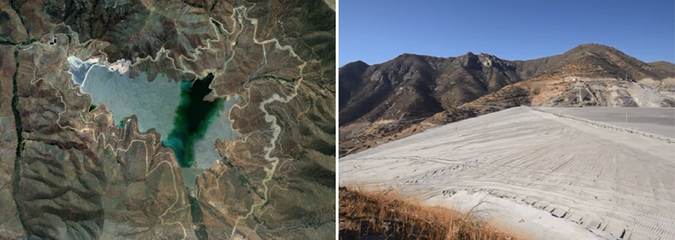{width="70%"}

::: {.caption}
Minera Los Pelambres — Embalse El Mauro. Fuente: Consejo Minero.
:::

---

## ¿Cómo se ven los relaves?

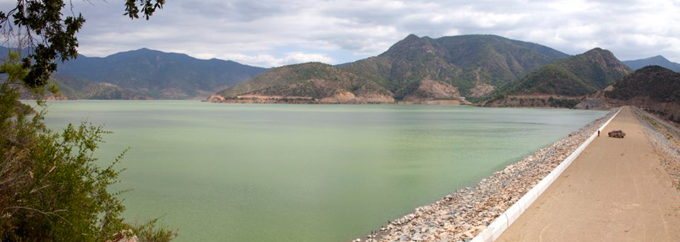{width="70%"}

::: {.caption}
Minera El Teniente — Embalse Carén. Fuente: Consejo Minero.
:::

---

## Estabilidad química y física

::: columns
::: {.column width="48%"}
::: {.box}
**Estabilidad Química**

Conseguir que los materiales depositados no aporten elementos o compuestos químicos al ecosistema circundante, por transporte aéreo (viento) ni por disolución hacia aguas del entorno (subterráneas o superficiales)
:::
:::
::: {.column width="48%"}
::: {.box}
**Estabilidad Física**

Conseguir que el depósito de relaves no se desmorone ni se desborde
:::

::: {.caption}
Fuente: SERNAGEOMIN — Preguntas frecuentes sobre relaves.
:::
:::
:::

---

## Cuando falla la estabilidad física: Brumadinho {.compact}

::: columns
::: {.column width="48%"}
En enero de 2019, el depósito de relaves de la mina **Córrego do Feijão** (Brumadinho, Minas Gerais, Brasil) colapsó sin previo aviso

- **272 personas** fallecieron
- Una avalancha de **12 millones de m³** de lodo tóxico arrasó con todo a su paso
- Contaminó el **río Paraopeba** a lo largo de cientos de kilómetros

:::
::: {.column width="45%"}
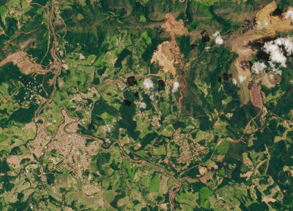{width="100%"}

::: {.caption}
Colapso del depósito de relaves en Brumadinho. Fuente: Wikimedia Commons.
:::
:::
:::

---

## ¿Por qué son tóxicos los relaves? {.compact}

Si bien el relave no es considerado un Residuo Sólido Peligroso, dado que en un inicio es simplemente roca molida con agua, la roca contiene elementos tóxicos:

- **Arsénico**, cianuro, cobre, zinc, cromo y **plomo**
- Al reaccionar con el agua y el oxígeno, pueden **solubilizarse**
- Posibilitando su transporte por vía aérea o agua
- Potencialmente afectando a la población

::: {.caption}
Fuente: SERNAGEOMIN — Preguntas frecuentes sobre relaves.
:::

---

## ¿Quiénes son más susceptibles?

Si bien todas las personas pueden ver su salud adversamente afectada por estos contaminantes, el efecto es particularmente dañino para los **niños**, dado que se encuentran en una **fase crítica de su desarrollo**

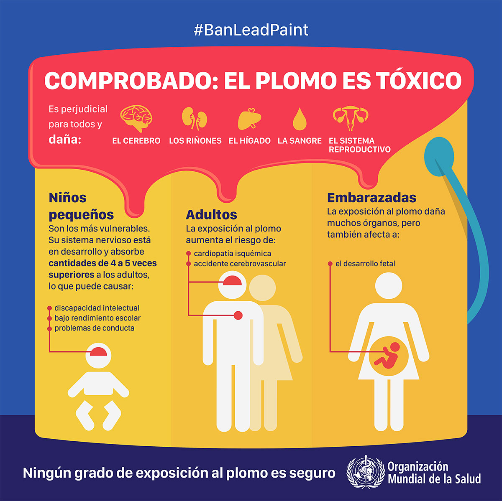{width="60%"}

---

## ¿Quiénes son más susceptibles?

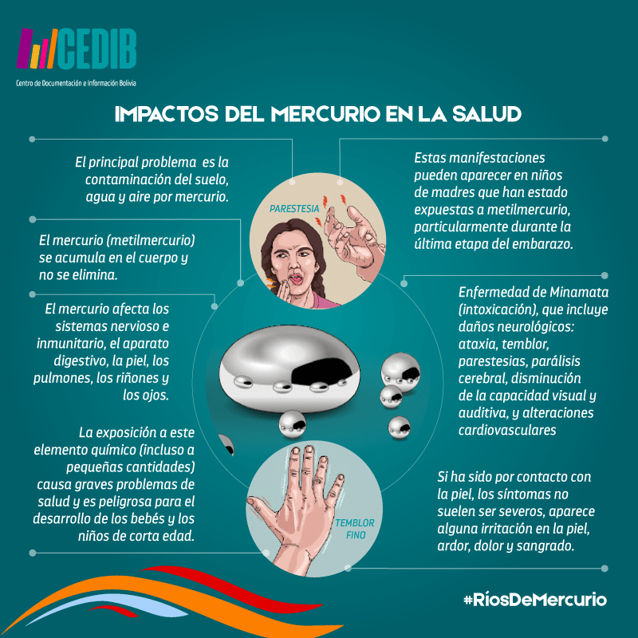{width="70%"}

---

## Los relaves abandonados son los más peligrosos {.compact}

::: columns
::: {.column width="48%"}
Al pasar a ser inactivos (dejar de recibir la pulpa), las condiciones químicas del relave aumentan su **acidez**

La acidez, a su vez, aumenta la solubilidad de los elementos químicos tóxicos

Esto hace de los relaves abandonados **especialmente peligrosos**, dado que un relave debe ser gestionado activamente para mantener a raya su nivel de acidez y toxicidad
:::
::: {.column width="48%"}
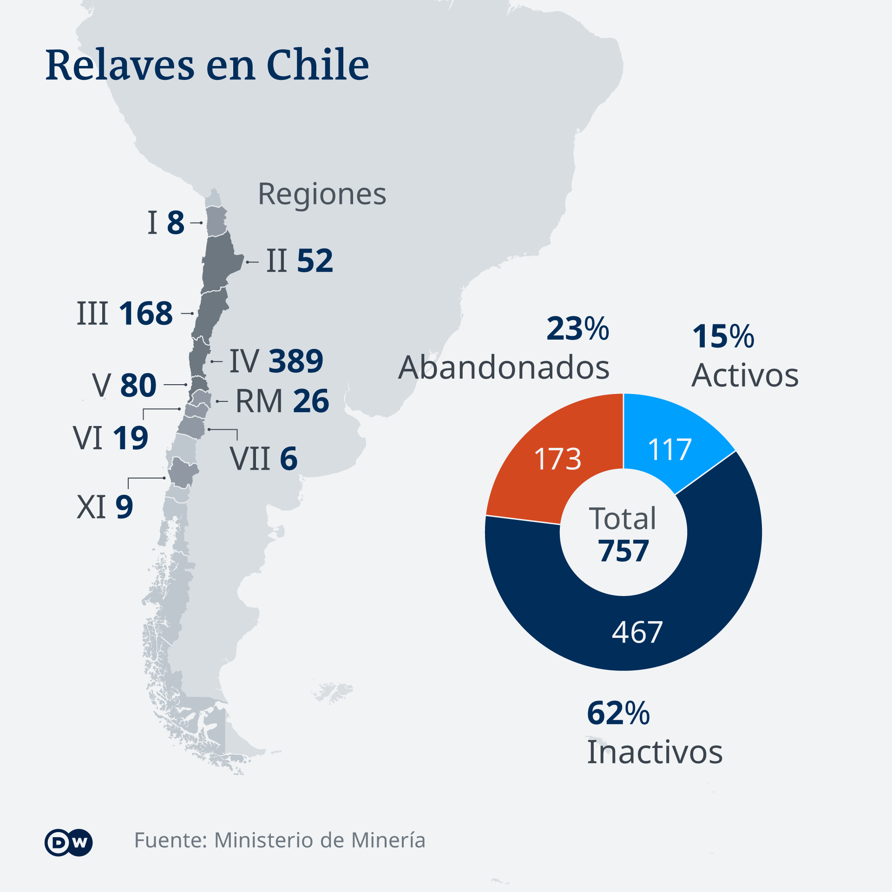{width="100%"}

::: {.caption}
Fuente: DW — "Chile: resistirse a convivir con desechos mineros."
:::
:::
:::

---

## Caso: Bahía de Chañaral {.compact}

::: columns
::: {.column width="48%"}
Entre 1938 y 1990, la **Andes Copper Mining** y luego **Codelco** vertieron millones de toneladas de relaves directamente al **río Salado** y la **Bahía de Chañaral** durante **52 años**

- El mar retrocedió **2 km**
- Se creó una playa artificial tóxica de **6 km**
- Concentraciones de cobre **3.000 veces** superiores a lo normal
:::
::: {.column width="48%"}
La población de Chañaral presenta tasas elevadas de cáncer, enfermedades respiratorias y afecciones cutáneas por exposición al polvo tóxico

En 1990, la **Corte Suprema** ordenó construir un tranque de relaves, terminando el vertido directo

Pero **no se ha realizado remediación alguna** — la contaminación subterránea persiste indefinidamente
:::
:::

::: {.caption}
Fuente: Derecho al Agua — "Andes Copper Company y Codelco destruyen el río Salado y la Bahía de Chañaral."
:::

---

## Chañaral: la respuesta política {.compact}

En 2003, el presidente **Ricardo Lagos** se bañó en la playa de Chañaral para "demostrar" que la descontaminación había sido exitosa



---

## Chañaral: la evidencia científica {.compact}

Más de **10 años después** del mediático baño, un estudio midió la exposición de niños que viven cerca de la playa contaminada:

- El material particulado fino (PM 2.5) contenía **metales pesados** como cobre, zinc y cromo
- Las concentraciones **dentro de las escuelas** eran hasta **4 veces superiores** a las del exterior — el polvo tóxico se acumula en espacios cerrados con poca ventilación
- Los niños presentaron **disminución de la capacidad pulmonar** tras alzas en la concentración de PM 2.5 — una exposición crónica con efectos agudos medibles

::: {.caption}
Fuente: Cáceres, D. (2015). Evaluación de los efectos agudos en la función pulmonar por exposición a material particulado fino (MP 2.5) en niños que viven próximos a una playa contaminada con relaves mineros, Chañaral, Chile. Universitat Autònoma de Barcelona.
:::

---

## Exploración: depósitos de relaves en Chile {.activity-slide .compact}

Abran el [Dashboard de Relaves de SERNAGEOMIN](https://sernageomin.maps.arcgis.com/apps/dashboards/d1914078b496482c845c19c512276da0) en sus computadores

Para ver la leyenda, hagan clic en el ícono debajo del zoom (parece una lista). Las banderas rojas son relaves **abandonados**

En parejas, exploren visualmente:

1. ¿Dónde se concentran los relaves en Chile?
2. ¿Cuántos relaves abandonados ven en la Región de Coquimbo? (la región de la Tarea 06)
3. ¿Qué les llama la atención de la distribución?
4. Como herramienta de gestión ambiental: ¿qué valor tiene un dashboard como este? ¿Qué información le falta o cómo podría mejorarse?

# A+R: Minería, Relaves y Sustentabilidad {.section-slide background-color="#2a7f62"}

## Visiones contrapuestas {.compact}

> "Una población mundial en constante crecimiento, junto con recursos no renovables limitados, está impulsando soluciones y tecnologías innovadoras en una variedad de industrias. Satisfacer las necesidades de transporte de las futuras generaciones de manera sostenible y ambientalmente responsable requiere una mayor dependencia de materiales y recursos naturales que sean duraderos, maleables y — en el caso de los autos eléctricos — capaces de ofrecer una conductividad eléctrica superior."

— **International Copper Association** (2024)

---

## Visiones contrapuestas {.compact}

> "Hemos tenido conversaciones sobre minería sostenible y minería verde. Y he dicho que prefiero no hablar en esos términos, que suenan a *greenwashing*, porque **la minería nunca es sostenible**. Necesitamos hablar de **minería responsable**. Sabemos que la minería tiene impactos importantes e irreversibles sobre la naturaleza. Necesitamos un acuerdo amplio sobre qué impactos estamos dispuestos a aceptar, y actuar con responsabilidad al respecto."

— **Maisa Rojas**, Ex Ministra del Medio Ambiente (2023)

---

## Mejoras en la industria minera {.compact}

::: columns
::: {.column width="48%"}
::: {.box}
**Reducción del uso de agua**

Tecnologías de relaves espesados y filtrados, uso de agua de mar desalinizada, recirculación
:::
:::
::: {.column width="48%"}
::: {.box}
**Descarbonización**

Chile tiene la ventaja de tener enorme potencial solar — las mineras del norte ya operan con energía renovable
:::
:::
:::

Pero estos avances no resuelven un problema fundamental: la minería genera **residuos tóxicos** que deben ser gestionados **a perpetuidad**

---

## El nexo minería–transición energética {.compact}

::: columns
::: {.column width="48%"}
La clase pasada vimos que la transición energética necesita **enormes cantidades de minerales**:

- **Cobre** — cableado eléctrico, motores, paneles solares
- **Litio** — baterías de autos eléctricos y almacenamiento
- **Cobalto y níquel** — cátodos de baterías

Chile es el mayor productor mundial de cobre y el segundo de litio
:::
::: {.column width="48%"}
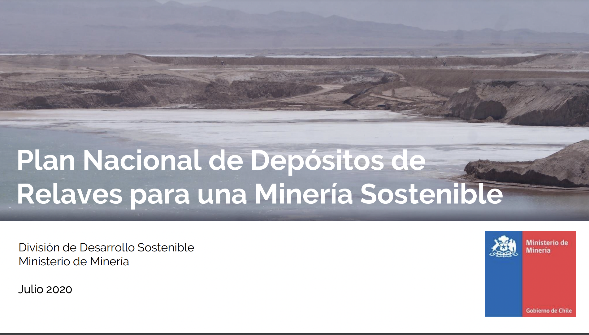{width="100%"}

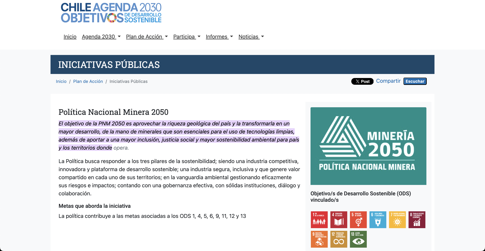{width="100%"}
:::
:::

---

## Reflexión en parejas {.activity-slide .compact}

Considerando la lectura de CIPER y lo visto en clase:

1. En el artículo de CIPER, ¿qué riesgos adicionales añade el cambio climático a los relaves? Considerando Brumadinho y Chañaral, ¿les parece que estamos preparados?
2. La industria habla de minería sostenible; la ministra Rojas dice que la minería **nunca** es sostenible. ¿Con quién están más de acuerdo? ¿Por qué?
3. Con 800+ depósitos en Chile — ¿quién debería hacerse responsable de los relaves abandonados?

---

## Plenario {.activity-slide}

Algunas parejas comparten sus reflexiones.

- ¿Qué conexiones ven entre los relaves y lo discutido la clase pasada sobre la transición energética?
- ¿Cómo se relaciona con la idea de "Control y Descontrol"?

# CT: Contaminación de Suelos {.section-slide background-color="#2a7f62"}

## Fuentes de contaminación de suelos {.compact}

::: columns
::: {.column width="48%"}
::: {.box}
**Agricultura**

Pesticidas y fertilizantes — el mismo problema que denunció Rachel Carson en *Silent Spring*. Los agroquímicos se acumulan en el suelo y se filtran a las aguas subterráneas
:::

::: {.box}
**Silvicultura industrial**

Monocultivos forestales (pino, eucalipto) degradan el suelo: acidificación, pérdida de materia orgánica, erosión. Recordar el caso del territorio Mapuche (clase 03)
:::
:::
::: {.column width="48%"}
::: {.box}
**Minería**

Relaves, drenaje ácido, polvo con metales pesados — lo que acabamos de revisar
:::

::: {.box}
**Residuos industriales**

Disposición inadecuada de desechos tóxicos, vertederos ilegales, pasivos ambientales históricos
:::
:::
:::

---

## Caso: plomo en Arica {.compact}

::: columns
::: {.column width="48%"}
En los años 80, la empresa sueca **Boliden** envió más de 20.000 toneladas de **residuos tóxicos** con altas concentraciones de plomo, arsénico, cadmio y mercurio a Arica

Los desechos fueron almacenados por la empresa chilena **Promel** a cielo abierto, cerca de poblaciones

Posteriormente se construyeron **viviendas sociales** sobre y junto al sitio contaminado
:::
::: {.column width="48%"}
- Los niños de la zona presentaron niveles de **plomo en sangre** muy por encima de los límites seguros
- Efectos: daño neurológico, problemas de aprendizaje, cáncer
- Un caso emblemático de **injusticia ambiental**: las víctimas son familias de bajos ingresos que no tuvieron elección sobre dónde vivir
:::
:::

---

## Arica: lecciones

::: {.box}
El caso de Arica muestra cómo la contaminación de suelos puede ser **invisible** durante años, afectando a las comunidades más vulnerables

- La **responsabilidad** puede cruzar fronteras (Boliden es sueca)
- Los **costos de salud** los pagan las comunidades locales
- La **remediación** es costosa, lenta, y a menudo insuficiente
:::

::: {.caption}
Este caso ilustra por qué Chile necesita una Ley Marco de Suelos con estándares claros y responsabilidades definidas.
:::

---

## Ley Marco de Suelos en Chile {.compact}

::: columns
::: {.column width="48%"}
Chile **no tiene** una ley que regule la contaminación de suelos. El proyecto de **Ley Marco de Suelos** lleva años en trámite legislativo y actualmente se encuentra en la Comisión de Hacienda del Senado (2026)

Propone:

- Reconocer el suelo como **bien estratégico nacional**
- Crear un **Instituto Nacional de Suelos**
- Establecer estándares de calidad y planes de restauración
:::
::: {.column width="48%"}
::: {.box}
**¿Qué falta?**

El proyecto se enfoca en prevención y gestión sustentable, pero carece de un mecanismo claro de **asignación de responsabilidad** y **recuperación de costos** para sitios ya contaminados

¿Quién paga la remediación de Chañaral? ¿De Arica?
:::
:::
:::

---

## Referente: Superfund en EE.UU. {.compact}

::: columns
::: {.column width="48%"}
En 1980, tras el escándalo de **Love Canal** (barrio construido sobre un vertedero tóxico), EE.UU. creó el programa **Superfund**

Principio central: **"el que contamina, paga"**

- La EPA identifica sitios contaminados y **obliga** a los responsables a remediar
- Si no cooperan, el gobierno limpia y **demanda** por hasta el triple del costo
- Más de 1.300 sitios en la lista nacional de prioridades
:::
::: {.column width="48%"}
::: {.box}
**Contraste con Chile**

EE.UU. lleva **45+ años** con un régimen de responsabilidad estricta y retroactiva para suelos contaminados

Chile aún no tiene una ley aprobada — los casos como Arica y Chañaral siguen sin un marco legal que obligue a los responsables a pagar la remediación
:::
:::
:::

# Cápsula GIS: Operaciones Espaciales {.section-slide background-color="#2a7f62"}

## Mapas base (basemaps) {.compact}

::: columns
::: {.column width="48%"}
Un **mapa base** es una capa de referencia visual que provee contexto geográfico (calles, topografía, imágenes satelitales)

En QGIS se añade con el complemento **QuickMapServices** (Web → QuickMapServices → OSM Standard)
:::
::: {.column width="48%"}
::: {.box}
**¿Por qué en escala de grises?**

Para que el mapa base no compita visualmente con los datos temáticos que queremos mostrar

Propiedades del raster → Simbología → Escala de grises
:::
:::
:::

---

## Buffers: zonas de influencia {.compact}

::: columns
::: {.column width="48%"}
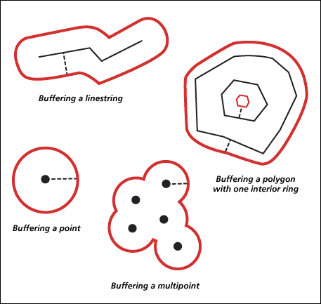{width="100%"}
:::
::: {.column width="48%"}
Un **buffer** genera un polígono representando un **área de influencia** a partir de una geometría

Ejemplo: ¿qué distritos censales están a menos de **5 km** de un relave?

→ Creamos un buffer de 5 km alrededor de cada relave

::: {.box}
**Importante:** para que la distancia tenga sentido, la capa debe estar en un **CRS proyectado** (metros), no geográfico (grados)
:::
:::
:::

---

## Uniones espaciales {.compact}

Una de las operaciones más poderosas de SIG es unir capas de información utilizando su **relación espacial**

::: columns
::: {.column width="48%"}
- **TARGET** — la capa que recibe los atributos (la que queremos enriquecer). En nuestro caso: **distritos censales**
- **JOIN** — la capa cuyos atributos se transfieren. En nuestro caso: **buffers de relaves**
:::
::: {.column width="48%"}
A la relación se le llama **predicado**:

- **Intersecta** — las geometrías se tocan o superponen
- **Contiene** — TARGET encierra completamente a JOIN
- **Está dentro** — TARGET está completamente dentro de JOIN
- **Toca** — las geometrías comparten borde pero no interior
:::
:::

---

## Interior y borde

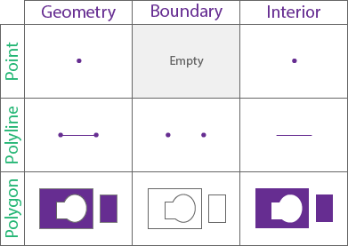{width="70%"}

::: {.caption}
Toda geometría tiene un interior y un borde. Los predicados espaciales se definen según cómo se relacionan estos componentes. Fuente: ArcGIS Enterprise.
:::

---

## Predicado: Intersección

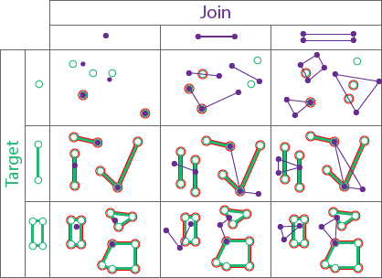{width="70%"}

::: {.caption}
¿TARGET intersecciona a JOIN? Verdadero si comparten cualquier punto en común (interior o borde). Fuente: ArcGIS Enterprise.
:::

---

## Predicado: Contiene

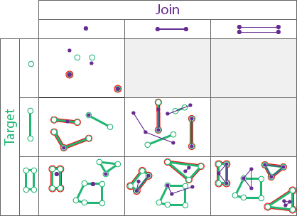{width="70%"}

::: {.caption}
¿TARGET contiene a JOIN? Verdadero si JOIN está completamente dentro del interior de TARGET. Fuente: ArcGIS Enterprise.
:::

---

## Predicado: Dentro

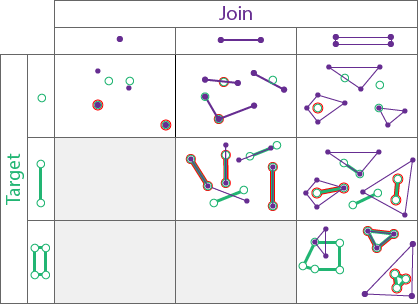{width="70%"}

::: {.caption}
¿TARGET está dentro de JOIN? El inverso de "contiene". Fuente: ArcGIS Enterprise.
:::

---

## Predicado: Toca

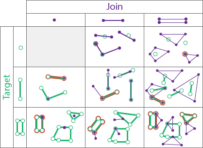{width="70%"}

::: {.caption}
¿TARGET toca a JOIN? Verdadero si comparten borde pero no interior. Fuente: ArcGIS Enterprise.
:::

---

## Ejemplo: unión espacial por intersección {.compact}

::: columns
::: {.column width="45%"}
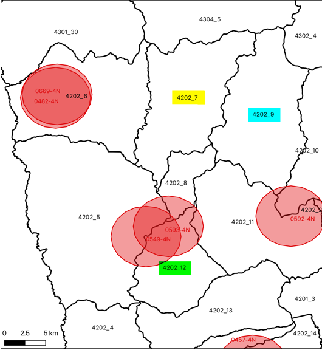{width="100%"}
:::
::: {.column width="55%"}
Queremos unir los **distritos censales** con el **buffer de 5 km** de relaves

¿Qué distritos están a menos de 5 km?

Noten que:

- El distrito [**4202_7**]{style="background-color: #FFFF00; padding: 0 4px;"} no intersecta ningún relave
- El distrito [**4202_9**]{style="background-color: #00DDDD; padding: 0 4px;"} intersecta 1 relave (0592-4N)
- El distrito [**4202_12**]{style="background-color: #00CC00; padding: 0 4px;"} intersecta 2 relaves (0549-4N y 0593-4N)

¿Qué pasa con la **tabla de atributos**?
:::
:::

---

## Distrito [4202_7]{style="background-color: #FFFF00; color: black; padding: 0 4px;"}: sin intersección {.compact}

::: columns
::: {.column width="40%"}
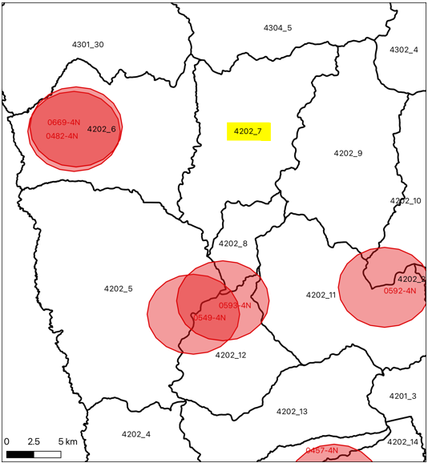{width="100%"}
:::
::: {.column width="60%"}
El distrito **4202_7** no intersecta ningún relave

Aparece **1 vez** en la tabla de atributos, y las columnas de relaves quedan con valores **NULL**

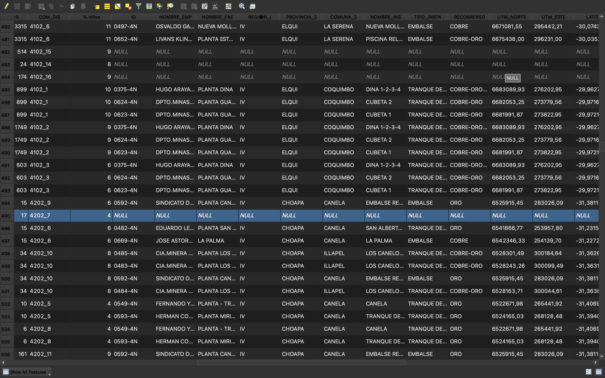{width="100%"}
:::
:::

---

## Distrito [4202_9]{style="background-color: #00DDDD; padding: 0 4px;"}: una intersección {.compact}

::: columns
::: {.column width="40%"}
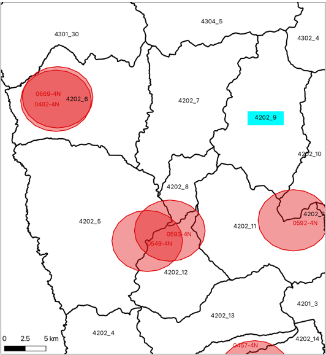{width="100%"}
:::
::: {.column width="60%"}
El distrito **4202_9** intersecta **1 relave** (0592-4N)

Aparece **1 vez** en la tabla, y las columnas de relaves contienen la información del relave que intersecta

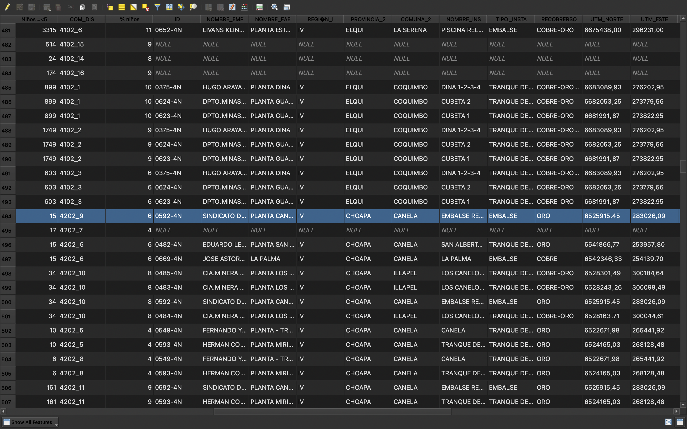{width="100%"}
:::
:::

---

## Distrito [4202_12]{style="background-color: #00CC00; padding: 0 4px;"}: dos intersecciones {.compact}

::: columns
::: {.column width="40%"}
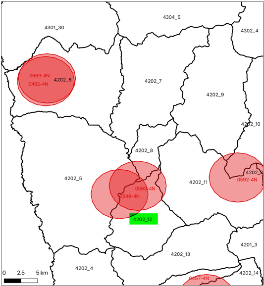{width="100%"}
:::
::: {.column width="60%"}
El distrito **4202_12** intersecta **2 relaves** (0549-4N y 0593-4N)

Aparece **2 veces** en la tabla — los valores del distrito se repiten, pero cada fila contiene la información de un relave distinto

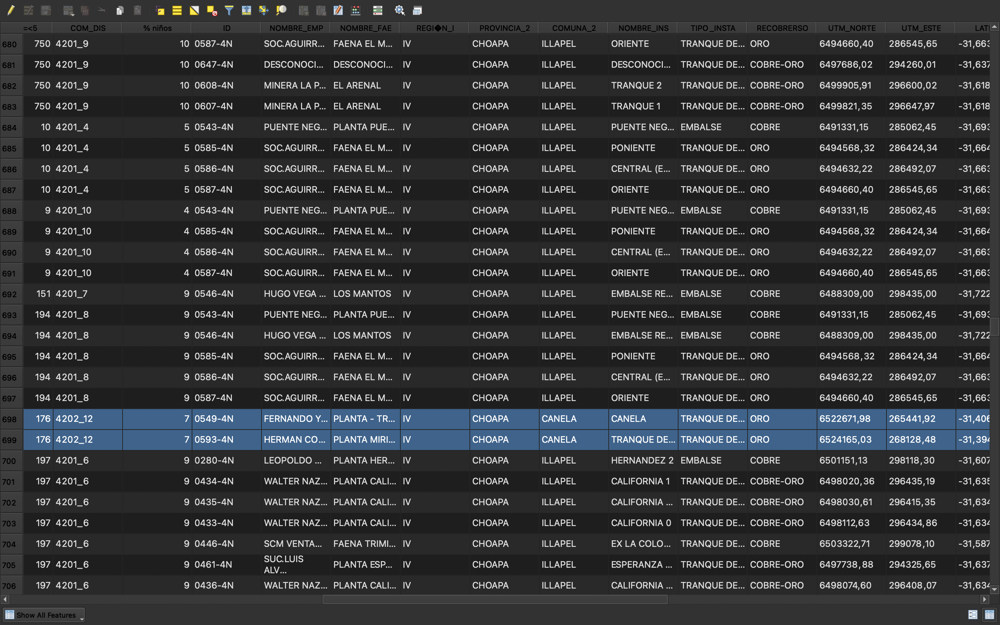{width="100%"}
:::
:::

---

## Distrito 4201_5: ¡62 intersecciones! {.compact}

::: columns
::: {.column width="40%"}
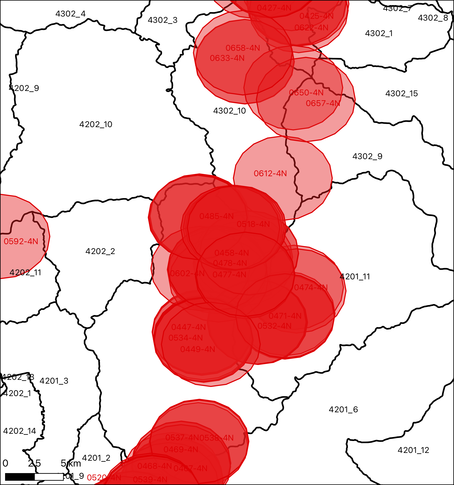{width="100%"}
:::
::: {.column width="60%"}
El distrito **4201_5** intersecta **62 relaves**

Aparece **62 veces** en la tabla — los valores del distrito se repiten en cada fila, cada una con la información de uno de los 62 relaves

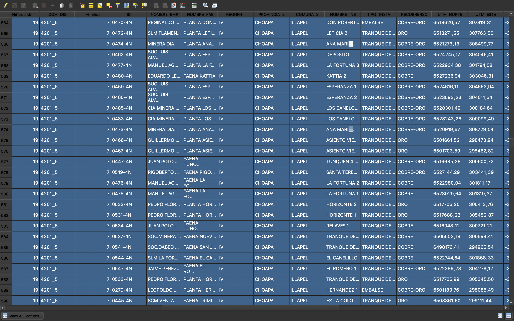{width="100%"}
:::
:::

# Presentación Tarea 06 {.section-slide background-color="#2a7f62"}

## Tarea 06: Minería, Relaves y Población Expuesta {.compact}

::: columns
::: {.column width="48%"}
**¿Qué van a construir?**

Un **díptico** con dos mapas de la Región de Coquimbo:

1. **Mapa de exposición:** distritos censales dentro de la zona de influencia de 5 km de los relaves
2. **Mapa de vulnerabilidad:** niños de 0–5 años en distritos expuestos (símbolos proporcionales)
:::
::: {.column width="48%"}
**Herramientas nuevas:**

- QuickMapServices + mapa base
- Selección por localización
- Reproyección a CRS proyectado
- Buffer (zona de influencia)
- Unión espacial 
- Símbolos proporcionales
- Calculadora de campos
- Simbología con expresión
:::
:::

---

## Flujo de trabajo

1. Cargar capas (relaves, distritos censales, población) + mapa base
2. **Reproyectar** a UTM zona 19S para trabajar en metros
3. Crear **buffer de 5 km** alrededor de los relaves
4. **Unión espacial** para transferir información de relaves a distritos
5. **Calculadora de campos** para agregar conteos
6. **Clasificar** distritos como expuestos / no expuestos
7. **Composición** del díptico horizontal

---

## Entregable

- Un **díptico horizontal** (paisaje) con ambos mapas
- Exportado como imagen o PDF desde el compositor de impresión de QGIS
- Listo para utilizar en entrega del próximo portafolio.

::: {.box}
La guía paso a paso estará disponible en Canvas mañana. Descarguen también el archivo `.zip` con los datos.
:::
