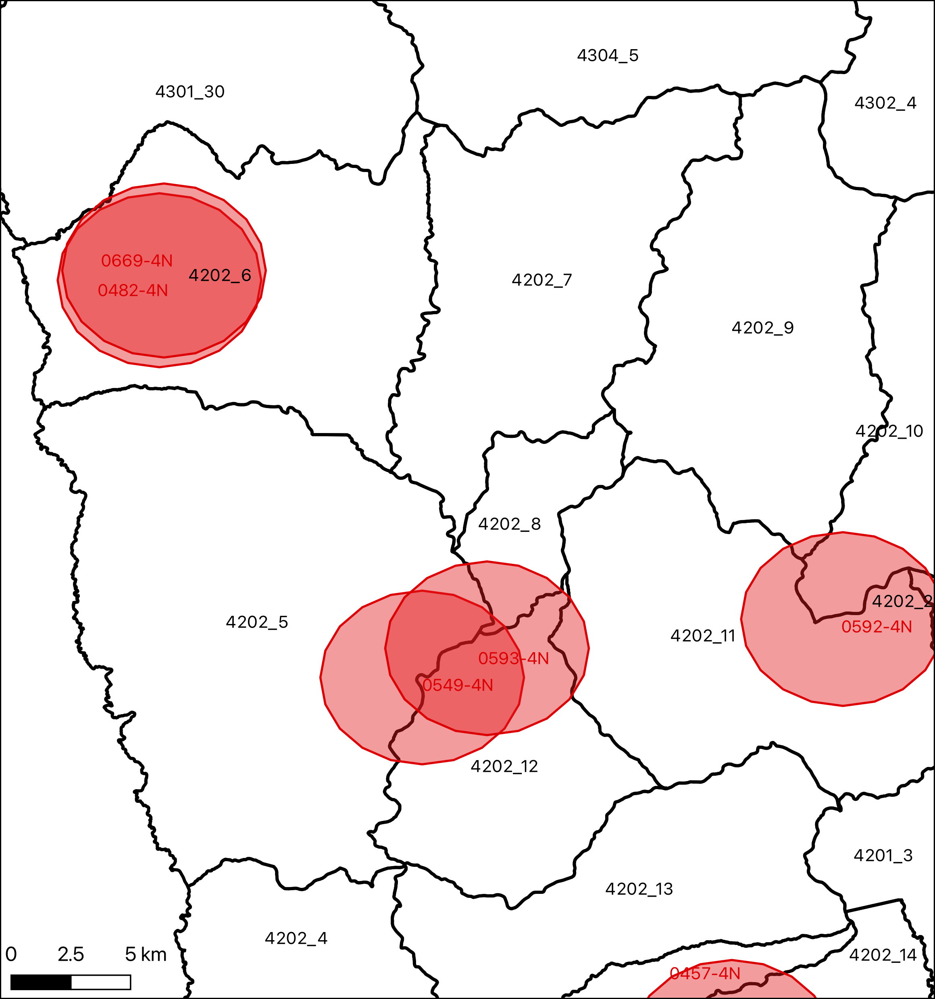

## Plan para hoy

### Primer bloque

- A+R: Relaves bajo el cambio climático
- CT: Minería en Chile

### Segundo bloque
- CT: Contaminación de suelos
- Cápsula GIS: Operaciones espaciales
- Presentación Tarea 06

# A+R: Relaves Bajo el Cambio Climático {.section-slide background-color="#2a7f62"}

## Lectura CIPER: reflexión en parejas {.activity-slide}

Sobre el artículo de CIPER acerca de los relaves mineros y el cambio climático:

1. ¿Qué les sorprendió del artículo?
2. ¿Qué riesgos **adicionales** añade el cambio climático a los depósitos de relaves?
3. Con 742 depósitos en Chile — ¿quién debería ser responsable de los relaves abandonados?

---

## Plenario {.activity-slide}

Algunas parejas comparten sus reflexiones.

- ¿Qué conexiones ven entre los relaves y lo discutido la clase pasada sobre la transición energética?
- ¿Cómo se relaciona con la idea de "Control y Descontrol"?

# CT: Minería en Chile {.section-slide background-color="#2a7f62"}

## Importancia económica de la minería {.compact}

::: columns
::: {.column width="48%"}
{width="100%"}

::: {.caption}
Fuente: COCHILCO (2022). Análisis de Impacto Socioeconómico de la Minería a Nivel Regional.
:::
:::
::: {.column width="48%"}
{width="100%"}

::: {.caption}
Fuente: COCHILCO (2022). Análisis de Impacto Socioeconómico de la Minería a Nivel Regional.
:::
:::
:::

---

## Chile: economía minera {.compact}

::: columns
::: {.column width="48%"}
{width="100%"}

::: {.caption}
Fuente: OEC — Exportaciones de Chile (2022).
:::
:::
::: {.column width="48%"}
{width="100%"}

::: {.caption}
Fuente: COCHILCO (2022). Análisis de Impacto Socioeconómico de la Minería a Nivel Regional.
:::
:::
:::

---

## La ley del mineral → 99% es relave

::: columns
::: {.column width="48%"}
La ley del mineral es, por lo general, **menor a 1%**

Esto quiere decir que por cada kilo de mineral, se producen **99 kilos de relave**

Los relaves son tóxicos, por lo que es fundamental asegurar su **estabilidad química y física**
:::
::: {.column width="48%"}
{width="100%"}

::: {.caption}
Fuente: SERNAGEOMIN — Preguntas frecuentes sobre relaves.
:::
:::
:::

---

## ¿Cómo se ven los relaves? {.compact}

::: columns
::: {.column width="48%"}
{width="100%"}

::: {.caption}
Minera Los Pelambres — Embalse El Mauro. Fuente: Consejo Minero.
:::
:::
::: {.column width="48%"}
{width="100%"}

::: {.caption}
Minera El Teniente — Embalse Carén. Fuente: Consejo Minero.
:::
:::
:::

---

## Estabilidad química y física

::: columns
::: {.column width="48%"}
::: {.box}
**Estabilidad Química**

Conseguir que los materiales depositados no aporten elementos o compuestos químicos al ecosistema circundante, por transporte aéreo (viento) ni por disolución hacia aguas del entorno (subterráneas o superficiales)
:::
:::
::: {.column width="48%"}
::: {.box}
**Estabilidad Física**

Conseguir que el depósito de relaves no se desmorone ni se desborde
:::

::: {.caption}
Fuente: SERNAGEOMIN — Preguntas frecuentes sobre relaves.
:::
:::
:::

---

## ¿Por qué son tóxicos los relaves? {.compact}

Si bien el relave no es considerado un Residuo Sólido Peligroso, dado que en un inicio es simplemente roca molida con agua, la roca contiene elementos tóxicos:

- **Arsénico**, cianuro, cobre, zinc, cromo y **plomo**
- Al reaccionar con el agua y el oxígeno, pueden **solubilizarse**
- Posibilitando su transporte por vía aérea o agua
- Potencialmente afectando a la población

::: {.caption}
Fuente: SERNAGEOMIN — Preguntas frecuentes sobre relaves.
:::

---

## ¿Quiénes son más susceptibles?

::: columns
::: {.column width="48%"}
Si bien todas las personas pueden ver su salud adversamente afectada por estos contaminantes, el efecto es particularmente dañino para los **niños**, dado que se encuentran en una **fase crítica de su desarrollo**
:::
::: {.column width="48%"}
{width="100%"}

{width="100%"}
:::
:::

---

## Los relaves abandonados son los más peligrosos {.compact}

::: columns
::: {.column width="48%"}
Al pasar a ser inactivos (dejar de recibir la pulpa), las condiciones químicas del relave aumentan su **acidez**

La acidez, a su vez, aumenta la solubilidad de los elementos químicos tóxicos

Esto hace de los relaves abandonados **especialmente peligrosos**, dado que un relave debe ser gestionado activamente para mantener a raya su nivel de acidez y toxicidad
:::
::: {.column width="48%"}
{width="100%"}

::: {.caption}
Fuente: DW — "Chile: resistirse a convivir con desechos mineros."
:::
:::
:::

---

## El nexo minería–transición energética {.compact}

::: columns
::: {.column width="48%"}
La clase pasada vimos que la transición energética necesita **enormes cantidades de minerales**:

- **Cobre** — cableado eléctrico, motores, paneles solares
- **Litio** — baterías de autos eléctricos y almacenamiento
- **Cobalto y níquel** — cátodos de baterías

Chile es el mayor productor mundial de cobre y el segundo de litio
:::
::: {.column width="48%"}
{width="100%"}

{width="100%"}
:::
:::

---

## Minería... ¿sustentable? {.compact}

> "Hemos tenido conversaciones sobre minería sostenible y minería verde. Y he dicho que prefiero no hablar en esos términos, que suenan a *greenwashing*, porque **la minería nunca es sostenible**. Necesitamos hablar de **minería responsable**. Sabemos que la minería tiene impactos importantes e irreversibles sobre la naturaleza. Necesitamos un acuerdo amplio sobre qué impactos estamos dispuestos a aceptar, y actuar con responsabilidad al respecto."

— **Maisa Rojas**, Ministra del Medio Ambiente (2023)

---

## Reflexión en parejas {.activity-slide}

1. ¿Cuál es el rol de la minería en la transición hacia sociedades más sustentables?
2. ¿Cómo puede la minería disminuir sus impactos ambientales?
3. ¿Podría la minería considerarse sustentable?

---

## Mejoras en la industria minera {.compact}

::: columns
::: {.column width="48%"}
::: {.box}
**Reducción del uso de agua**

Tecnologías de relaves espesados y filtrados, uso de agua de mar desalinizada, recirculación
:::
:::
::: {.column width="48%"}
::: {.box}
**Descarbonización**

Chile tiene la ventaja de tener enorme potencial solar — las mineras del norte ya operan con energía renovable
:::
:::
:::

Pero estos avances no resuelven el problema fundamental: la minería genera **residuos tóxicos** que deben ser gestionados **a perpetuidad**

---

## Transición: hacia la contaminación de suelos {.compact}

La minería es una fuente importante de contaminación de suelos, pero no es la única

Chile avanza hacia una **Ley Marco de Suelos** que regulará:

- Identificación de sitios contaminados
- Responsabilidad por la remediación
- Estándares de calidad de suelos

Veamos el panorama más amplio de la contaminación de suelos...

# CT: Contaminación de Suelos {.section-slide background-color="#2a7f62"}

## Fuentes de contaminación de suelos {.compact}

::: columns
::: {.column width="48%"}
::: {.box}
**Agricultura**

Pesticidas y fertilizantes — el mismo problema que denunció Rachel Carson en *Silent Spring*. Los agroquímicos se acumulan en el suelo y se filtran a las aguas subterráneas
:::

::: {.box}
**Silvicultura industrial**

Monocultivos forestales (pino, eucalipto) degradan el suelo: acidificación, pérdida de materia orgánica, erosión. Recordar el caso del territorio Mapuche (clase 03)
:::
:::
::: {.column width="48%"}
::: {.box}
**Minería**

Relaves, drenaje ácido, polvo con metales pesados — lo que acabamos de revisar
:::

::: {.box}
**Residuos industriales**

Disposición inadecuada de desechos tóxicos, vertederos ilegales, pasivos ambientales históricos
:::
:::
:::

---

## Caso: plomo en Arica {.compact}

::: columns
::: {.column width="48%"}
En los años 80, la empresa sueca **Boliden** envió más de 20.000 toneladas de **residuos tóxicos** con altas concentraciones de plomo, arsénico, cadmio y mercurio a Arica

Los desechos fueron almacenados por la empresa chilena **Promel** a cielo abierto, cerca de poblaciones

Posteriormente se construyeron **viviendas sociales** sobre y junto al sitio contaminado
:::
::: {.column width="48%"}
- Los niños de la zona presentaron niveles de **plomo en sangre** muy por encima de los límites seguros
- Efectos: daño neurológico, problemas de aprendizaje, cáncer
- Un caso emblemático de **injusticia ambiental**: las víctimas son familias de bajos ingresos que no tuvieron elección sobre dónde vivir
:::
:::

---

## Arica: lecciones

::: {.box}
El caso de Arica muestra cómo la contaminación de suelos puede ser **invisible** durante años, afectando a las comunidades más vulnerables

- La **responsabilidad** puede cruzar fronteras (Boliden es sueca)
- Los **costos de salud** los pagan las comunidades locales
- La **remediación** es costosa, lenta, y a menudo insuficiente
:::

::: {.caption}
Este caso ilustra por qué Chile necesita una Ley Marco de Suelos con estándares claros y responsabilidades definidas.
:::

# Cápsula GIS: Operaciones Espaciales {.section-slide background-color="#2a7f62"}

## Mapas base (basemaps) {.compact}

::: columns
::: {.column width="48%"}
Un **mapa base** es una capa de referencia visual que provee contexto geográfico (calles, topografía, imágenes satelitales)

En QGIS se añade con el complemento **QuickMapServices** (Web → QuickMapServices → OSM Standard)
:::
::: {.column width="48%"}
::: {.box}
**¿Por qué en escala de grises?**

Para que el mapa base no compita visualmente con los datos temáticos que queremos mostrar

Propiedades del raster → Simbología → Escala de grises
:::
:::
:::

---

## Buffers: zonas de influencia {.compact}

::: columns
::: {.column width="48%"}
{width="100%"}
:::
::: {.column width="48%"}
Un **buffer** genera un polígono representando un **área de influencia** a partir de una geometría

Ejemplo: ¿qué distritos censales están a menos de **5 km** de un relave?

→ Creamos un buffer de 5 km alrededor de cada relave

::: {.box}
**Importante:** para que la distancia tenga sentido, la capa debe estar en un **CRS proyectado** (metros), no geográfico (grados)
:::
:::
:::

---

## Uniones espaciales {.compact}

Una de las operaciones más poderosas de SIG es unir capas de información utilizando su **relación espacial**

A la relación se le llama **predicado**:

::: columns
::: {.column width="48%"}
- **Intersecta** — las geometrías se tocan o superponen
- **Contiene** — TARGET encierra completamente a JOIN
:::
::: {.column width="48%"}
- **Está dentro** — TARGET está completamente dentro de JOIN
- **Toca** — las geometrías comparten borde pero no interior
:::
:::

---

## Interior y borde

{width="70%"}

::: {.caption}
Toda geometría tiene un interior y un borde. Los predicados espaciales se definen según cómo se relacionan estos componentes. Fuente: ArcGIS Enterprise.
:::

---

## Predicado: Intersección

{width="70%"}

::: {.caption}
¿TARGET intersecciona a JOIN? Verdadero si comparten cualquier punto en común (interior o borde). Fuente: ArcGIS Enterprise.
:::

---

## Predicado: Contiene

{width="70%"}

::: {.caption}
¿TARGET contiene a JOIN? Verdadero si JOIN está completamente dentro del interior de TARGET. Fuente: ArcGIS Enterprise.
:::

---

## Predicado: Dentro

{width="70%"}

::: {.caption}
¿TARGET está dentro de JOIN? El inverso de "contiene". Fuente: ArcGIS Enterprise.
:::

---

## Predicado: Toca

{width="70%"}

::: {.caption}
¿TARGET toca a JOIN? Verdadero si comparten borde pero no interior. Fuente: ArcGIS Enterprise.
:::

---

## Ejemplo: unión espacial por intersección {.compact}

::: columns
::: {.column width="48%"}
{width="100%"}
:::
::: {.column width="48%"}
Queremos unir la capa de **distritos censales** con el **buffer de 5 km** de los relaves

Objetivo: identificar qué distritos están a menos de 5 km de un relave

Resultado: cada distrito que intersecta *n* relaves aparece *n* veces en la tabla
:::
:::

---

## ¿Qué pasa con la tabla de atributos? {.compact}

::: columns
::: {.column width="48%"}
{width="80%"}

::: {.caption}
Distrito 4202_7: no intersecta ningún relave → aparece 1 vez, columnas de relaves con valores nulos.
:::

{width="80%"}

::: {.caption}
Distrito 4202_9: intersecta 1 relave → aparece 1 vez con datos del relave.
:::
:::
::: {.column width="48%"}
{width="80%"}

::: {.caption}
Distrito 4202_12: intersecta 2 relaves → aparece 2 veces.
:::

{width="80%"}

::: {.caption}
Distrito 4201_5: intersecta 62 relaves → aparece 62 veces.
:::
:::
:::

# Presentación Tarea 06 {.section-slide background-color="#2a7f62"}

## Tarea 06: Minería, Relaves y Población Expuesta {.compact}

::: columns
::: {.column width="48%"}
**¿Qué van a construir?**

Un **díptico** con dos mapas de la Región de Coquimbo:

1. **Mapa de exposición:** distritos censales dentro de la zona de influencia de 5 km de los relaves
2. **Mapa de vulnerabilidad:** niños de 0–5 años en distritos expuestos (símbolos proporcionales)
:::
::: {.column width="48%"}
**Herramientas nuevas:**

- QuickMapServices + mapa base en escala de grises
- Selección por localización
- Reproyección a CRS proyectado (EPSG:32719)
- Buffer (zona de influencia)
- Unión espacial (*Join Attributes by Location*)
- Símbolos proporcionales con expresión SQL
- Calculadora de campos
- Simbología categorizada con expresión
:::
:::

---

## Flujo de trabajo

1. Cargar capas (relaves, distritos censales, población) + mapa base
2. **Reproyectar** a UTM zona 19S para trabajar en metros
3. Crear **buffer de 5 km** alrededor de los relaves
4. **Unión espacial** para transferir información de relaves a distritos
5. **Calculadora de campos** para agregar conteos
6. **Clasificar** distritos como expuestos / no expuestos
7. **Composición** del díptico horizontal

---

## Entregable

- Un **díptico horizontal** (paisaje) con ambos mapas
- Exportado como imagen o PDF desde el compositor de impresión de QGIS
- Subido a **Canvas** antes de la fecha límite

::: {.box}
La guía paso a paso está disponible en Canvas. Descarguen también el archivo `.zip` con los datos.
:::
