## Plan para hoy

### Primer bloque

- CT: Deforestación
- A+R: Los dilemas del desarrollo

### Segundo bloque
- CT: Conservación
- A+R: Sparing vs Sharing
- Cápsula GIS: Intersección, disolución, área

# CT: Deforestación {.section-slide background-color="#2a7f62"}

## {.question-slide}

> "De todas las necesidades más urgentes la que exige mayor atención es la reglamentación de los bosques. A esta grave cuestión está vinculado el porvenir del país. ¿Qué es lo que se está haciendo? nos preguntamos. Se está incendiando a Chile en nombre de la agricultura. Se está decretando el desierto en el sur a nombre del trigo, así como en el norte se consumió y decretó a nombre del cobre"

::: {.small .muted}
Benjamín Vicuña Mackenna en el Diario El Ferrocarril, año 1870
:::

---

## ¿Por qué importa la deforestación?

- El cambio de uso de suelo, especialmente la deforestación, contribuye entre **12 a 20%** de las emisiones de CO2
- Las selvas tropicales albergan **⅔ de la biodiversidad** a pesar de solo cubrir un 10% de la superficie terrestre
- Además de ser repositorios de carbono, los bosques regulan el clima local y regionalmente
- La deforestación puede llevarnos sobre **"puntos de no retorno"**, donde los cambios de climas locales transforman selvas en sabanas

---

## Cobertura forestal en países tropicales

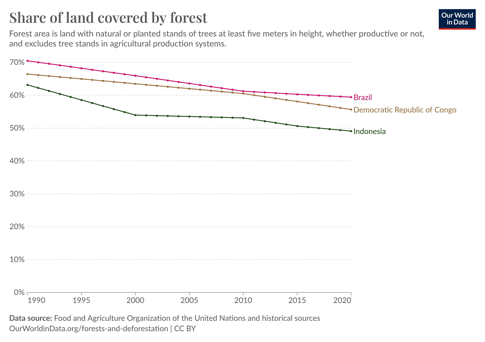{width="70%"}

::: {.caption}
Fuente: Our World in Data — Food and Agriculture Organization of the United Nations.
:::

---

## Pérdida de bosque ≠ deforestación {.map-slide}

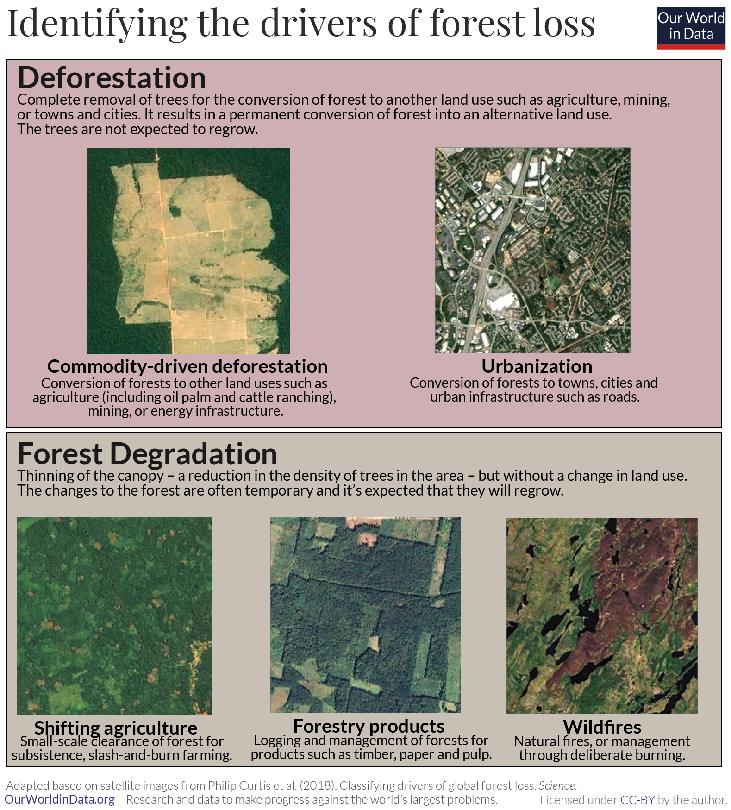{width="55%"}

::: {.caption}
Fuente: Our World in Data, basado en Philip Curtis et al. (2018). *Classifying drivers of global forest loss*. Science.
:::

---

## PÉRDIDA DE BOSQUE NO ES IGUAL A DEFORESTACIÓN

::: columns
::: {.column width="50%"}
::: {.box}
**Deforestación**

Remoción completa de árboles para la conversión a otro uso de suelo (agricultura, minería, urbanización). Es **permanente**.
:::
:::

::: {.column width="50%"}
::: {.box}
**Degradación forestal**

Reducción de la densidad de árboles — pero sin cambio de uso de suelo. Los cambios son a menudo **temporales** y se espera que el bosque se recupere.
:::
:::
:::

---

## Global Forest Watch {.map-slide}

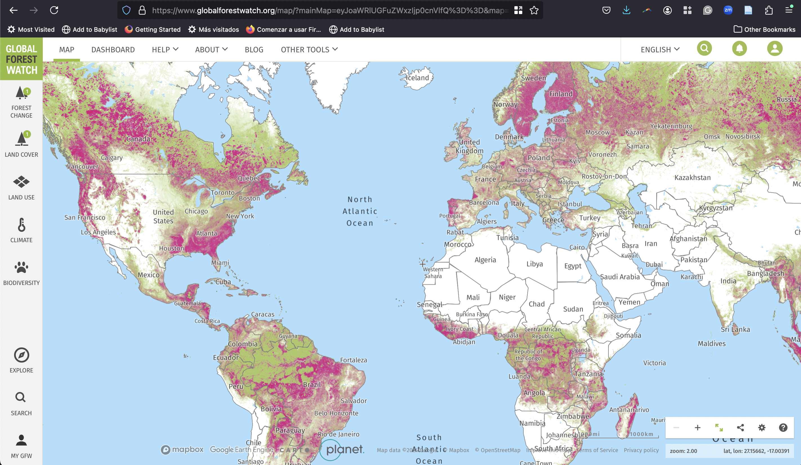{width="80%"}

::: {.caption}
Fuente: Global Forest Watch (globalforestwatch.org)
:::

---

## Pérdida forestal global: deforestación vs. degradación

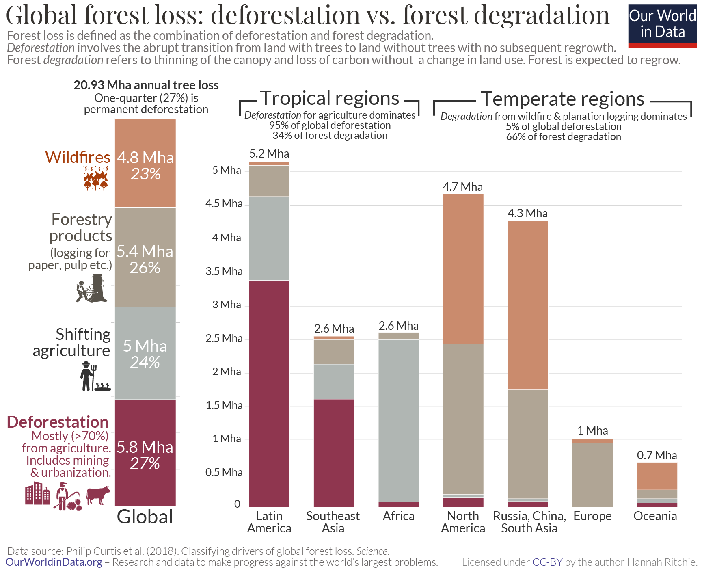{width="70%"}

::: {.caption}
Fuente: Our World in Data, basado en Philip Curtis et al. (2018). *Classifying drivers of global forest loss*. Science.
:::

---

## Casi toda la deforestación ocurre en los trópicos

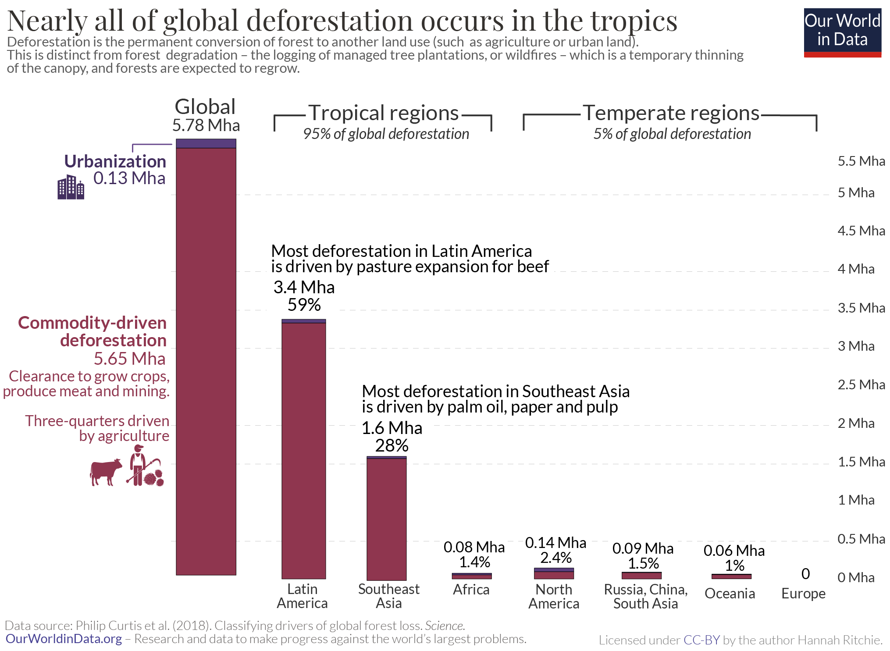{width="70%"}

::: {.caption}
Fuente: Our World in Data, basado en Philip Curtis et al. (2018). *Classifying drivers of global forest loss*. Science.
:::

---

## Emisiones de CO₂ por deforestación — Brasil

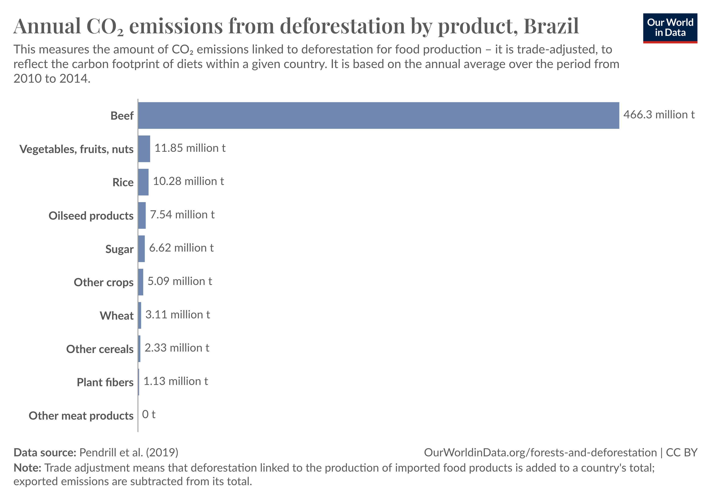{width="70%"}

::: {.caption}
Fuente: Pendrill et al. (2019). OurWorldinData.org/forests-and-deforestation | CC BY
:::

---

## Emisiones de CO₂ por deforestación — Australia

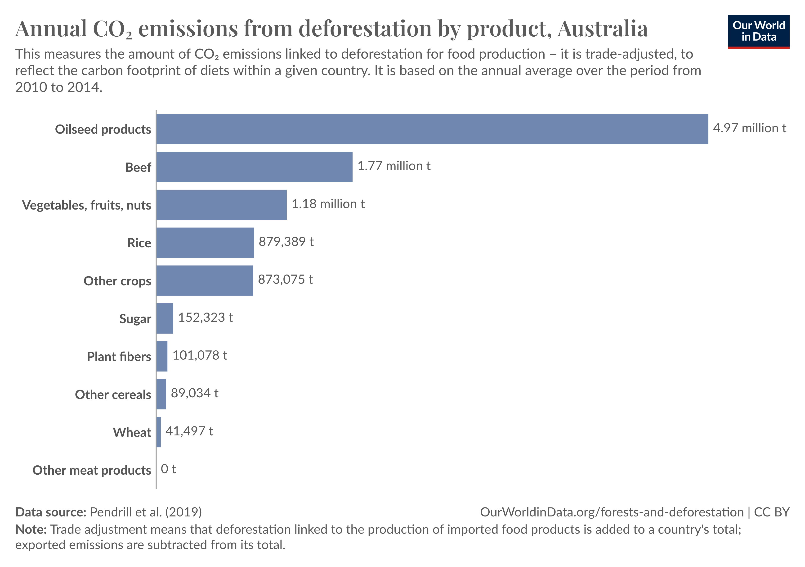{width="70%"}

::: {.caption}
Fuente: Pendrill et al. (2019). OurWorldinData.org/forests-and-deforestation | CC BY
:::

---

## ¿Cómo detenemos la deforestación? {.section-slide}

---

## El garrote: Hacer cumplir la ley {.compact}

::: columns
::: {.column width="35%"}

{width="90%"}

:::

::: {.column width="65%"}

- La fiscalización y el monitoreo satelital son herramientas clave
- El sistema **DETER** de Brasil procesa imágenes satelitales y emite alertas de deforestación en tiempo casi real
- La evidencia muestra que el monitoreo y la fiscalización **efectivamente reducen** la deforestación

:::
:::

---

## DETER: Monitoreo satelital en la Amazonía

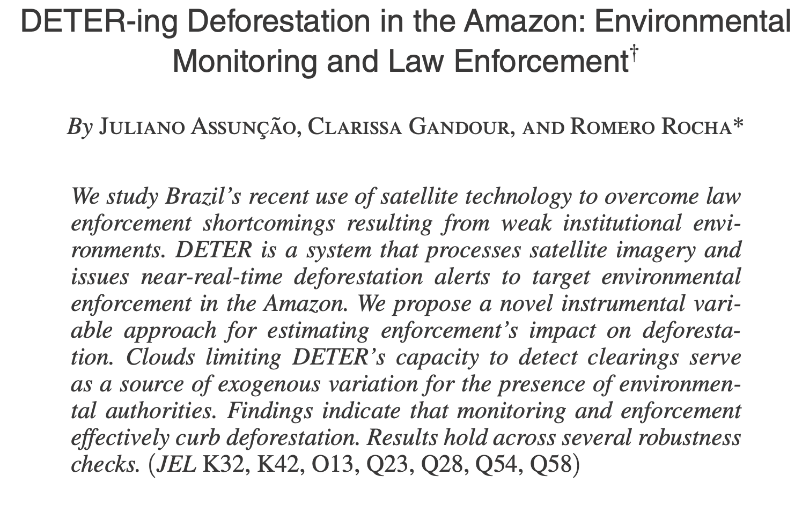{width="60%"}

::: {.caption}
Assunção, Gandour & Rocha — DETER-ing Deforestation in the Amazon: Environmental Monitoring and Law Enforcement.
:::

---

## Fiscalización en terreno

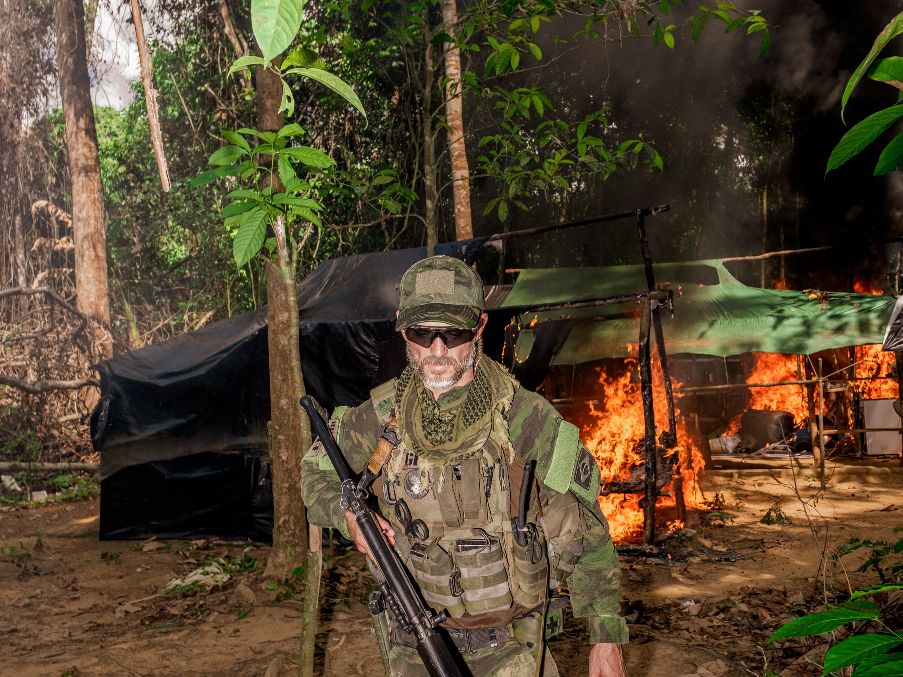{width="70%"}

::: {.caption}
Operativo de fiscalización ambiental en la Amazonía brasileña.
:::

---

## La "doble reversión de fortuna" del Amazonas brasileño

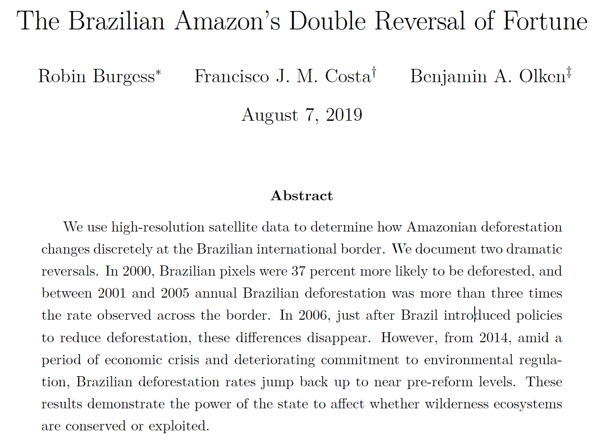{width="60%"}

::: {.caption}
Burgess, Costa & Olken (2019). "The Brazilian Amazon's Double Reversal of Fortune."
:::

---

## La frontera Brasil-Bolivia: un experimento natural {.map-slide}

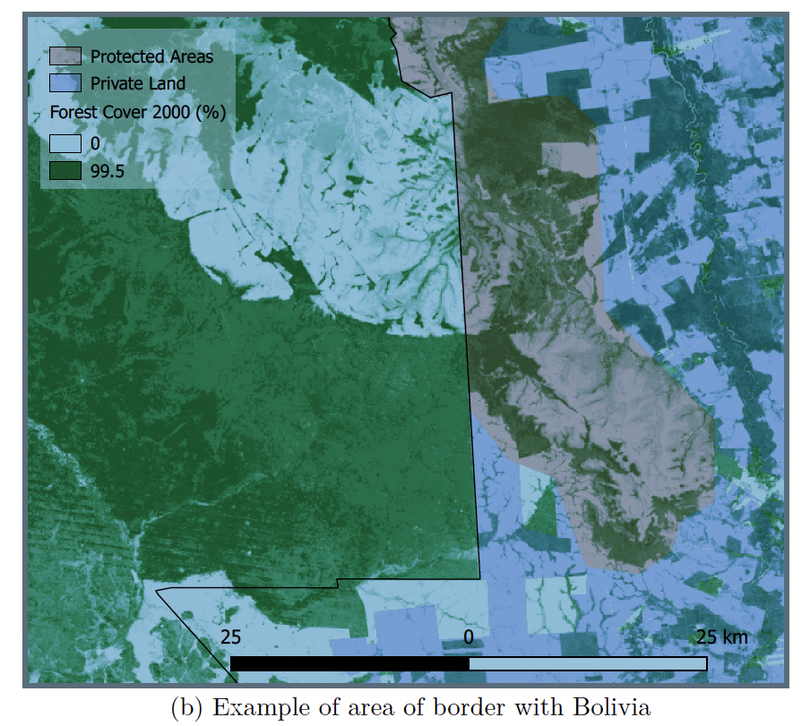{width="50%"}

::: {.caption}
Ejemplo de la frontera con Bolivia: áreas protegidas vs. tierra privada. Fuente: Burgess, Costa & Olken (2019).
:::

---

## Cobertura forestal en la frontera brasileña

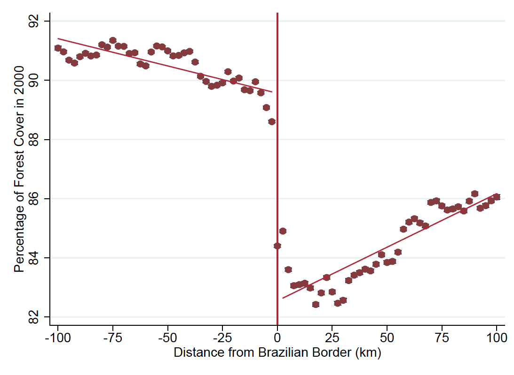{width="65%"}

::: {.caption}
Porcentaje de cobertura forestal en 2000, por distancia a la frontera brasileña. Fuente: Burgess, Costa & Olken (2019).
:::

---

## El efecto de la política brasileña en el tiempo

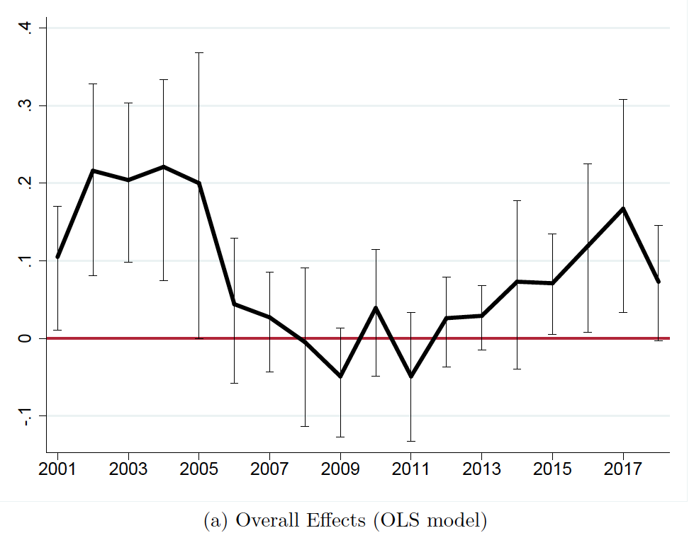{width="55%"}

::: {.caption}
Efectos generales (modelo OLS): la diferencia de deforestación entre Brasil y sus vecinos desaparece tras las reformas de 2006 y resurge con la relajación posterior. Fuente: Burgess, Costa & Olken (2019).
:::

---

## La zanahoria: Incentivos para conservar {.compact}

::: columns
::: {.column width="35%"}

{width="90%"}

:::

::: {.column width="65%"}

- Derechos de propiedad colectiva para comunidades indígenas
- Pago por servicios ecosistémicos
- Subsidios a la restauración forestal
- Empoderar comunidades locales

:::
:::

---

## Derechos de propiedad colectiva y deforestación

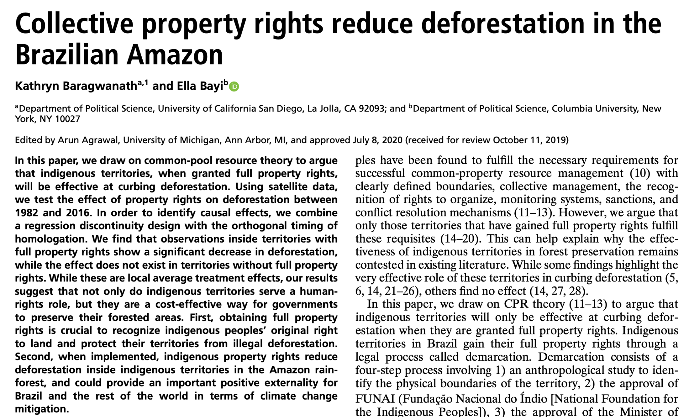{width="60%"}

::: {.caption}
Baragwanath & Bayi. "Collective property rights reduce deforestation in the Brazilian Amazon." — Los territorios indígenas con derechos de propiedad plenos muestran una reducción significativa en deforestación.
:::

---

## Pagos por restauración forestal: Ley de Bosque Nativo en Chile

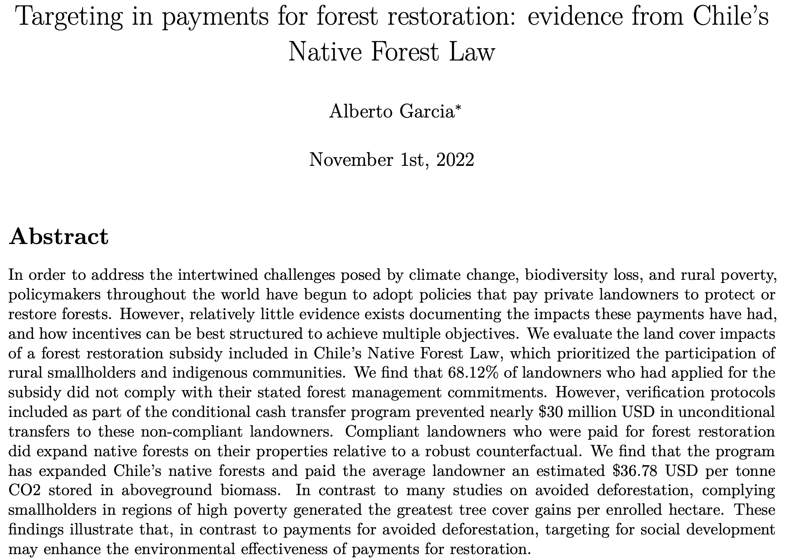{width="60%"}

::: {.caption}
Garcia (2022). "Targeting in payments for forest restoration: evidence from Chile's Native Forest Law."
:::

---

## Efectos de la Ley de Bosque Nativo

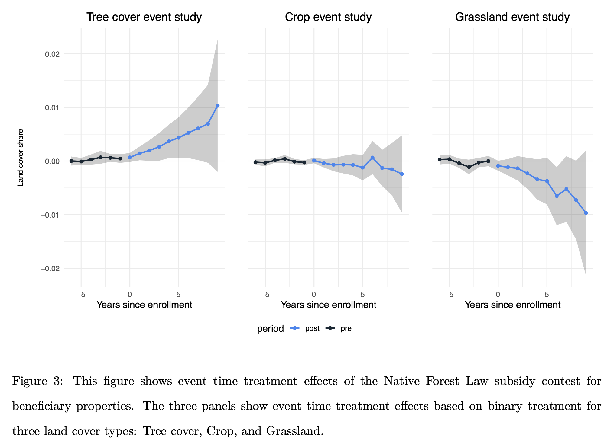{width="70%"}

::: {.caption}
Efectos en cobertura de árboles, cultivos y pastizales para predios beneficiarios. Fuente: Garcia (2022).
:::

# A+R: Los dilemas del desarrollo {.section-slide background-color="#2a7f62"}

## Debate en dos grupos basado en la lectura de InfoAmazonia {.activity-slide .compact}

Cada grupo recibe un caso y debate las tensiones entre desarrollo local y conservación.

::: columns
::: {.column width="50%"}
::: {.box}
**Grupo A — El camino**

Eres consejera/o de un pueblo aislado en la Amazonía peruana (2.000 habitantes, 6 horas en bote al mercado más cercano). Una ONG ofrece financiar un camino que reduce el viaje a 2 horas — mejor acceso a salud, educación y venta de productos. Sabes que **más del 70% del bosque cercano a caminos se pierde en pocos años**.

¿Apruebas el camino? ¿Bajo qué condiciones?
:::
:::

::: {.column width="50%"}
::: {.box}
**Grupo B — La paz del bosque**

El acuerdo con las FARC (2016) terminó con 50 años de guerra en Colombia. Pero la guerrilla, paradójicamente, **frenaba la deforestación** en las zonas que controlaba. Post-acuerdo, la deforestación en esas áreas **se duplicó**.

¿La "paz del conflicto armado" protegía mejor el bosque? ¿Qué debió hacer el Estado para capturar la paz sin perder el bosque?
:::
:::
:::

---

## Plenario {.activity-slide .compact}

Dos grupos exponen. Preguntas transversales:

1. ¿Quién **gana** y quién **pierde** en cada caso?
2. ¿Existe siempre un *trade-off* entre desarrollo humano y conservación?
3. ¿Qué instrumentos (garrote, zanahoria) podrían resolver estos dilemas?

::: {.box}
En la **Tarea 07** van a medir espacialmente esta tensión: cómo la cercanía a caminos se relaciona con la deforestación en los municipios de la Amazonía Legal brasileña.
:::

# CT: Conservación {.section-slide background-color="#2a7f62"}

## ¿Qué conservar? {.question-slide}

Imaginen que reciben una llamada informando que una tía de 5to grado ha fallecido y le ha dejado una herencia de **1 millón de dólares**...

Pero hay una condición... la herencia debe gastarla íntegramente en uno de dos proyectos de conservación...

---

## Opción A: 100 ha de selva virgen en la Amazonía Peruana

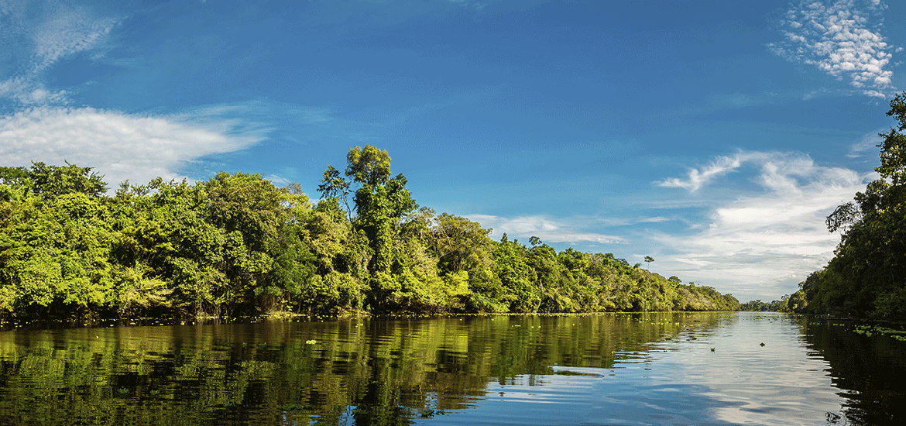{width="80%"}

---

## Opción B: 100 ha en el Cajón del Maipo

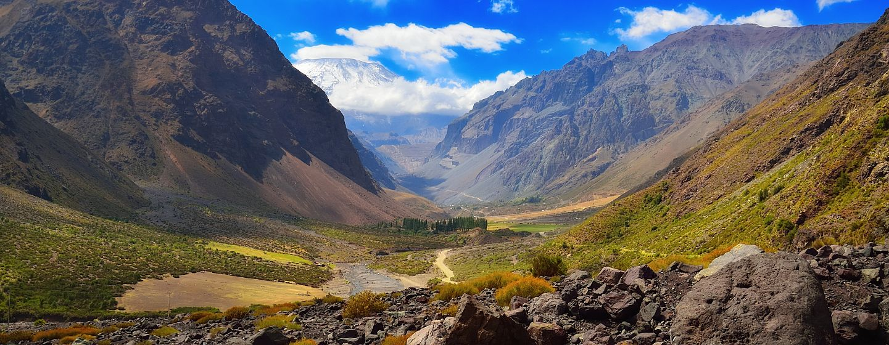{width="80%"}

---

## Pensamiento contrafactual {.compact}

El efecto de un esfuerzo de conservación **no debe ser juzgado por lo que pasó**...

...sino que **por lo que pasó en comparación con lo que hubiese pasado si el esfuerzo no se hubiese realizado**...

Este escenario hipotético se conoce como **CONTRAFACTUAL**, y es un concepto esencial para la evaluación de cualquier política pública o acción privada (incluyendo políticas de conservación)

---

## Pensamiento contrafactual: Pérdida forestal en la Amazonía

::: columns
::: {.column width="50%"}
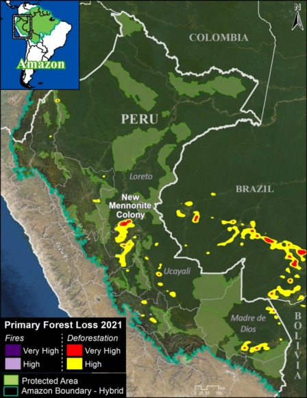{height="90%"}
:::

::: {.column width="50%"}
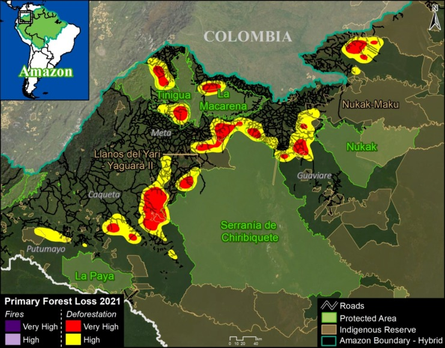{height="90%"}
:::
:::

::: {.caption}
Pérdida de bosque primario en Perú y Colombia (2021). Fuente: MAAP (Monitoring of the Andean Amazon Project).
:::

---

## Pensamiento contrafactual

Para **maximizar el impacto** de los esfuerzos de conservación, estos deben ponerse en los lugares donde, **en ausencia de dicho esfuerzo**, habría una gran degradación ambiental

A su vez, una gran degradación se daría cuando

- El ecosistema en cuestión tiene un gran valor
- Existen riesgos importantes de que el ecosistema será degradado en ausencia del esfuerzo de conservación

---

## ¿Cómo conservar? {.compact}

En el bloque anterior vimos instrumentos para detener la deforestación:

- El **garrote**: hacer cumplir la ley
- La **zanahoria**: pago por servicios ecosistémicos, derechos colectivos

Pero además del cómo, se debate el **tipo** de conservación: *Sharing* vs. *Sparing*

---

## Sparing: la meta 30x30

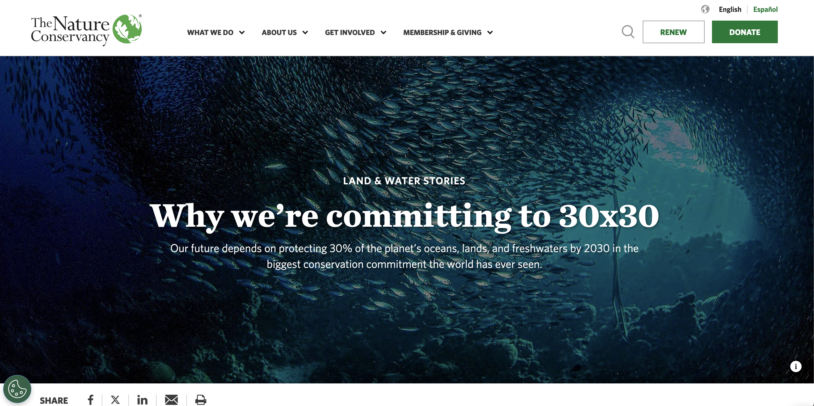{width="80%"}

::: {.caption}
The Nature Conservancy — "Why we're committing to 30x30": proteger el 30% de océanos, tierras y aguas dulces al 2030.
:::

---

## Land Sharing vs. Land Sparing {.compact}

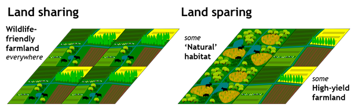{width="70%"}

Una visión menos dicotómica:

  - **++ Sparing:** Limitar por completo la actividad humana
  - **+ Sparing:** Limitar al mínimo la actividad humana
  - **+ Sharing:** Permitir ciertos usos en el territorio
  - **++ Sharing:** Uso agrícola de baja intensidad

---

## Sparing y Sharing: Un continuo{.compact}

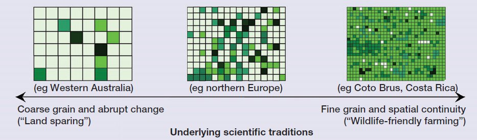{width="100%"}

---

## ¿A qué escala? {.compact}

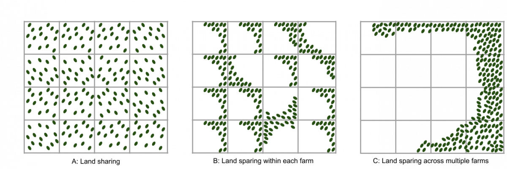{width="70%"}

---

## Los costos ocultos de la coexistencia

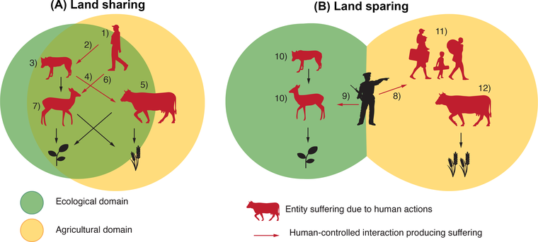{width="70%"}

::: {.caption}
Fuente: Bruskotter et al. (2021). "Tragic trade-offs accompany carnivore coexistence in the modern world". Conservation Letters, 15(3).
:::

---

## ¿Cómo conservar? — ¿Quién paga? {.compact}

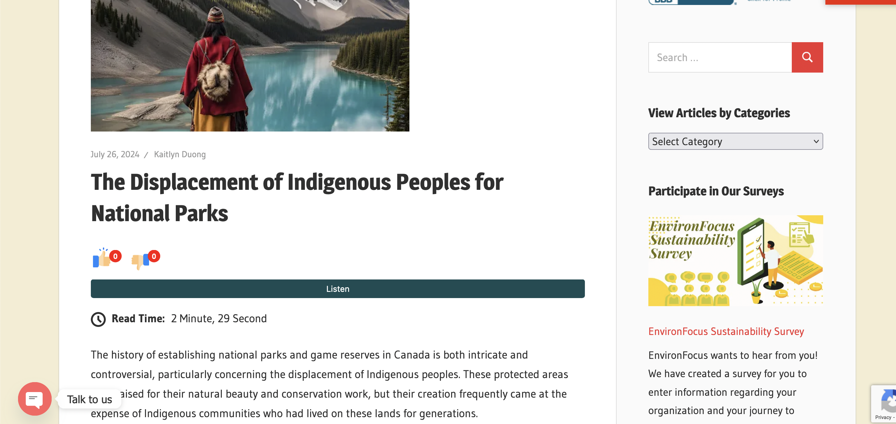{width="70%"}

::: {.caption}
El desplazamiento de pueblos indígenas por la creación de parques nacionales es un costo frecuentemente ignorado de las políticas de conservación tipo *sparing*.
:::

---

## El poder de los consumidores: Moratoria de la Soja

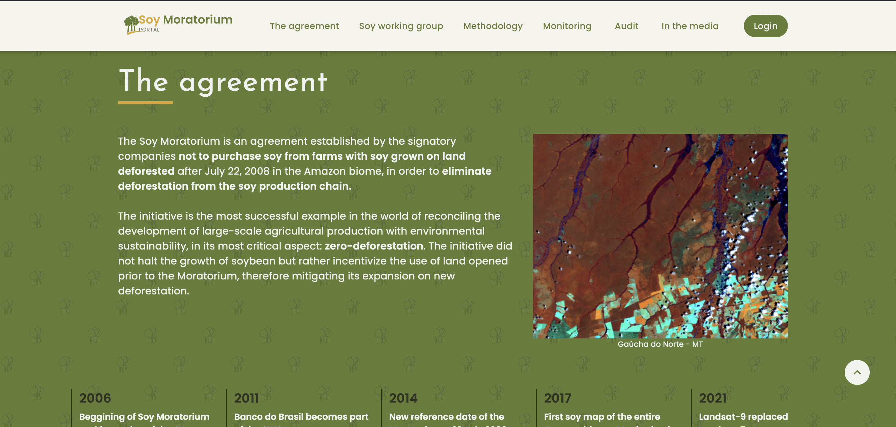{width="80%"}

::: {.caption}
La Moratoria de la Soja (2008): acuerdo de las empresas signatarias para **no comprar soja cultivada en tierras deforestadas** después del 22 de julio de 2008 en el bioma amazónico.
:::

---

## El poder de los consumidores: Regulación europea

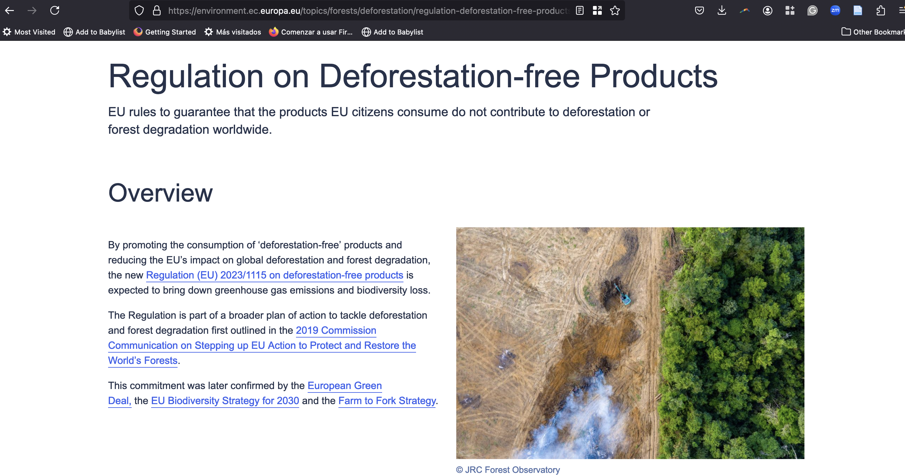{width="80%"}

::: {.caption}
Regulación de la UE sobre productos libres de deforestación: reglas para garantizar que los productos que consumen los ciudadanos europeos no contribuyan a la deforestación global.
:::

---

## El poder de la ciencia: Genómica y conservación

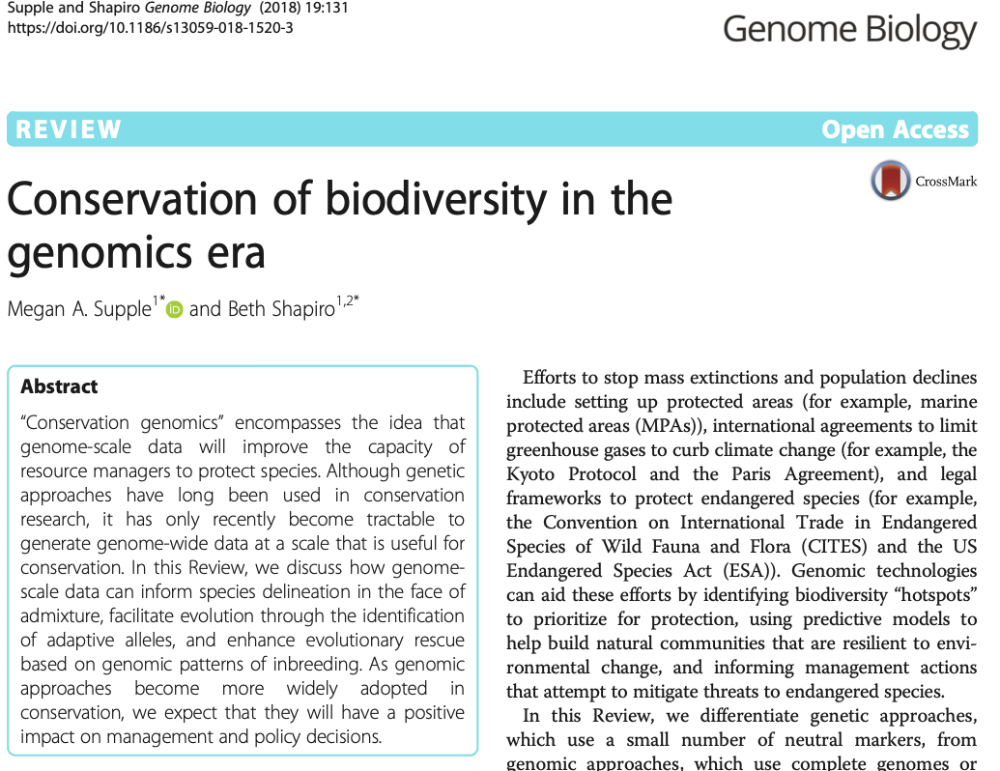{width="60%"}

::: {.caption}
Supple & Shapiro (2018). "Conservation of biodiversity in the genomics era." Genome Biology.
:::

---

## El poder de la ciencia: Evidencia causal

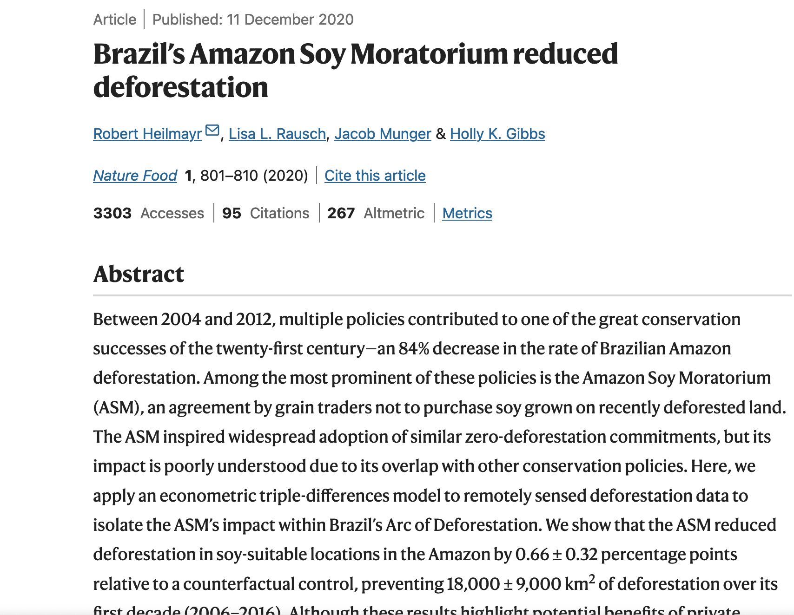{width="55%"}

::: {.caption}
Heilmayr et al. (2020). "Brazil's Amazon Soy Moratorium reduced deforestation." Nature Food, 1, 801–810.
:::

---

## El poder de la ciencia: Manejo privado de áreas protegidas

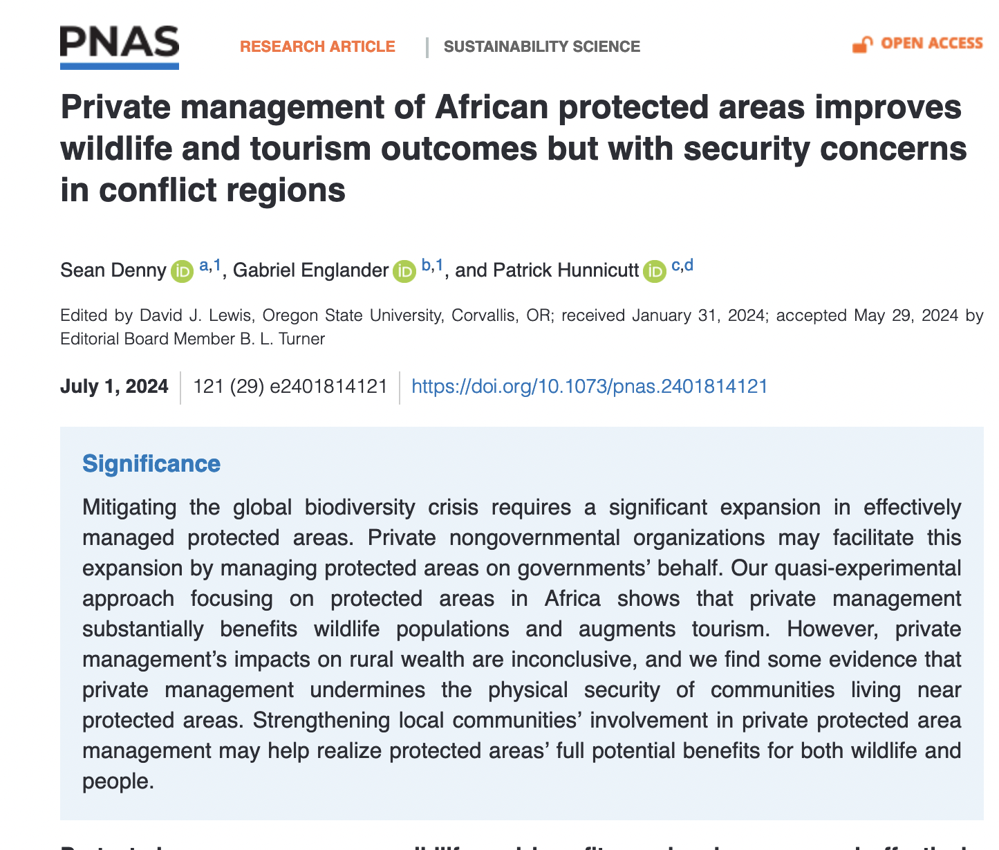{width="55%"}

::: {.caption}
Denny, Englander & Hunnicutt (2024). "Private management of African protected areas improves wildlife and tourism outcomes but with security concerns in conflict regions." PNAS.
:::

# A+R: Sparing vs Sharing {.section-slide background-color="#2a7f62"}

## Debate aplicado en dos grupos {.activity-slide .compact}

Basado en la lectura de Yale e360: *Sparing vs. Sharing — the great debate over how to protect nature*.

Cada grupo recibe un caso y decide qué estrategia — *sparing*, *sharing* o una combinación — es más apropiada, usando evidencia del texto (Phalan, Kremen, DeClerck).

::: columns
::: {.column width="50%"}
::: {.box}
**Grupo A — Amazonía brasileña**

Bosque primario continuo, frontera agrícola móvil, presencia de comunidades indígenas.
:::
:::

::: {.column width="50%"}
::: {.box}
**Grupo B — Matorral esclerófilo en Chile central**

Ecosistema ya fragmentado, rodeado de ciudades, agricultura y viñedos.
:::
:::
:::

---

## Plenario {.activity-slide}

Dos grupos exponen su propuesta. Preguntas de cierre:

1. ¿La estrategia adecuada depende del **estado actual** del ecosistema?
2. La propuesta de DeClerck es *"spare 50, share 50"*. ¿Quién decide qué se reserva y qué no?
3. ¿Quién paga los costos de cada estrategia? (recuerden el caso de los grandes carnívoros y el desplazamiento de pueblos indígenas)

# Cápsula GIS: Intersección, Disolución, Cálculo de Área {.section-slide background-color="#2a7f62"}

## Unión espacial vs. intersección geométrica {.compact}

En la clase anterior trabajamos la **unión espacial** de dos capas vectoriales utilizando la intersección

- Al unir A y B, generamos una nueva capa con la geometría de A, pero que tiene para cada fila original de A tantas filas como intersecciones tenga con las geometrías de B
- Cada fila tiene los atributos de A y B respectivos

En la tarea de esta semana realizaremos la **intersección de ambas geometrías** para generar una nueva capa, C, donde cada fila representa una intersección entre A y B

---

## Intersección: Capas de entrada {.map-slide}

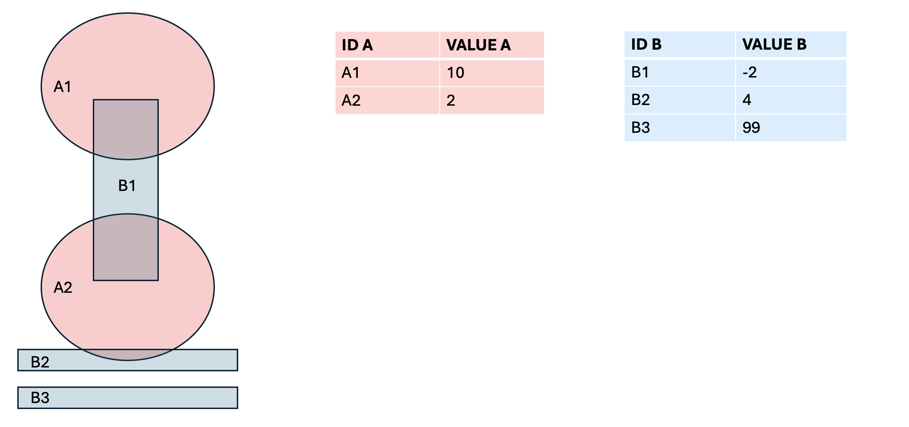{width="80%"}

::: {.caption}
Dos capas vectoriales (A y B) con sus respectivas tablas de atributos, antes de la operación de intersección.
:::

---

## Intersección: Resultado {.map-slide}

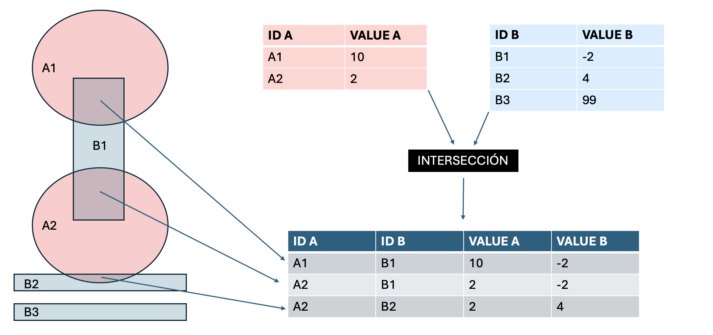{width="80%"}

::: {.caption}
La intersección genera nuevas geometrías en las zonas de traslape, combinando los atributos de ambas capas.
:::

---

## Disolución: Capa original {.map-slide}

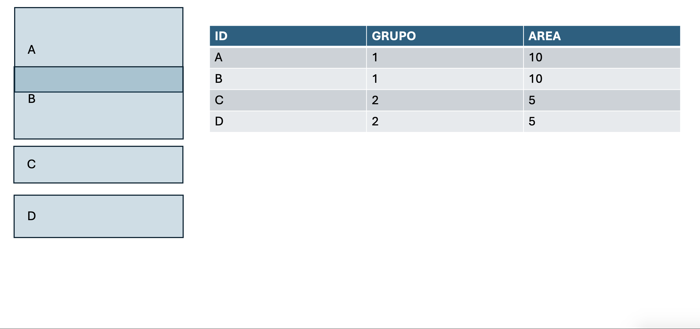{width="80%"}

::: {.caption}
Cuatro polígonos (A, B, C, D) agrupados por la variable GRUPO.
:::

---

## Disolución: Operación por variable {.map-slide}

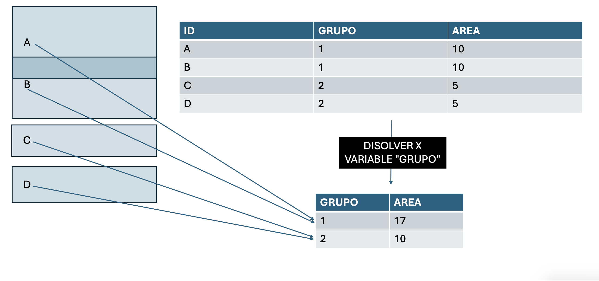{width="80%"}

::: {.caption}
Al disolver por la variable "GRUPO", las geometrías del mismo grupo se fusionan en una sola, uniendo sus áreas.
:::

---

## Disolución: Resultado {.map-slide}

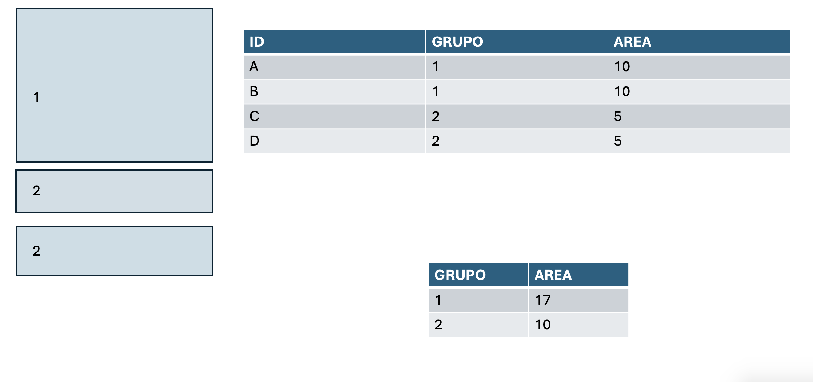{width="80%"}

::: {.caption}
Resultado final: dos geometrías (grupo 1 y grupo 2) con sus áreas agregadas.
:::

---

## Cálculo de área: Proyección y superficie real {.compact}

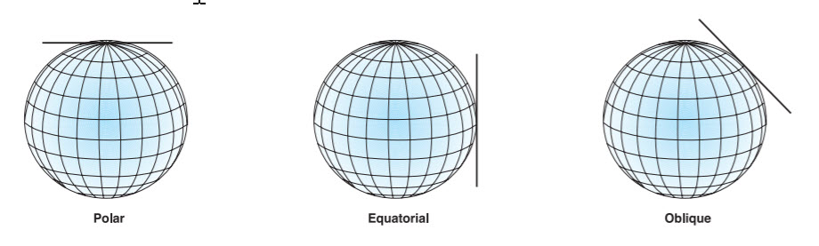{width="60%"}

**AREA PROYECTADA EN EL PLANO < AREA EN SUPERFICIE DE LA TIERRA**

::: {.caption}
Al calcular áreas en un SIG, la proyección cartográfica distorsiona la superficie real. Es importante utilizar una proyección adecuada o calcular áreas geodésicas.
:::

# Presentación Tarea 07 {.section-slide background-color="#2a7f62"}

## Tarea 07: Carreteras y Deforestación en la Amazonía Legal {.compact}

::: columns
::: {.column width="48%"}
**¿Qué van a construir?**

Dos mapas temáticos de los municipios de la Amazonía Legal brasileña:

1. **% de área cercana a caminos** (zona de influencia de 5 km)
2. **Tasa de deforestación** 1986–2023
:::
::: {.column width="48%"}
**Herramientas nuevas:**

- Buffer
- Intersección
- Disolución
- Atributos geométricos (área)
- Join no espacial
- Calculadora de campos
:::
:::

