## Plan para hoy

### Primer bloque

- CT: Datos raster y georreferencia
- CT: Teledetección

### Segundo bloque

- CT: Calor extremo — una amenaza creciente para la RM
- CT: Santiago HOT — ciencia ciudadana + satélites
- A+R: Plan Calor para tu comuna

# Datos raster {.section-slide background-color="#2a7f62"}

## Vector vs. raster {.compact}

::: columns
::: {.column width="55%"}
- Hasta ahora: **datos vectoriales** — ideales para variables **categóricas** (comunas, ríos, puntos de interés)
- Ahora: **datos raster** — cubren un **continuo del territorio** con una **grilla** de píxeles
- Útiles para variables espaciales **continuas**: temperatura, altitud, NDVI, contaminación
- Dimensión de un raster: **ancho × alto × bandas**
:::

::: {.column width="45%"}
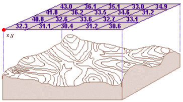{width="100%"}

::: {.caption .small}
Fuente: Hunter College Geography
:::
:::
:::

## Georreferencia: ubicar el raster en el espacio {.compact}

::: columns
::: {.column width="60%"}
El archivo (típicamente **`.tif`**) lleva metadata:

- **Coordenada del origen** (esquina superior izquierda, en algún SRC)
- **Resolución espacial** (ancho × alto del píxel, en unidades del SRC)

::: {.box}
**Ejemplo.** Origen $(524{,}000;\,-4{,}234{,}330)$, EPSG:32716, resolución 30 m. ¿Cuál es la coordenada del píxel en columna 3, fila 4?

$$x = 524{,}000 + 30\cdot(3-1) = 524{,}060$$
$$y = -4{,}234{,}330 - 30\cdot(4-1) = -4{,}234{,}420$$
:::
:::

::: {.column width="40%"}
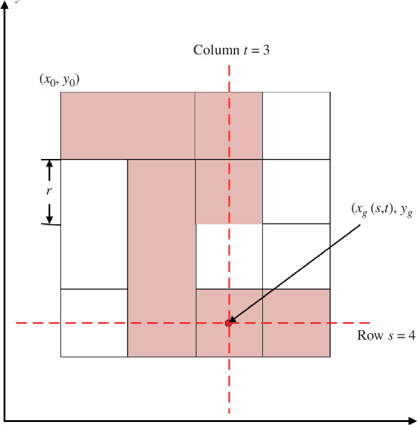{width="100%"}
:::
:::

# Teledetección: los ojos del planeta {.section-slide background-color="#2a7f62"}

## Teledetección: capturar datos a distancia {.compact}

::: columns
::: {.column width="50%"}
**¡Cada uno de ustedes tiene un par de teledetectores!** (sus ojos)

Dos grandes familias de instrumentos:

- **Pasivos**: capturan la energía **emitida o reflejada** por un objeto (foto convencional, banda termal)
- **Activos**: **emiten un pulso** electromagnético y capturan su reflejo (radar, LIDAR, sonar)
:::

::: {.column width="50%"}
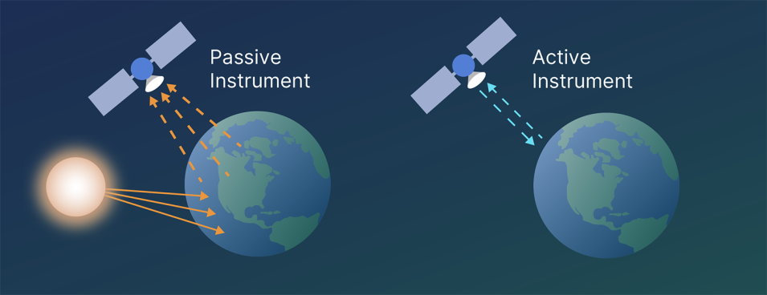{width="100%"}

::: {.caption .small}
Fuente: NASA Earthdata
:::
:::
:::

## Imágenes multiespectrales {.compact}

::: columns
::: {.column width="60%"}
- Raster más común: **imagen satelital multiespectral**
- Además del **R-G-B** visible, capturan otras bandas:
  - **Pancromática** (gris, mayor resolución espacial)
  - **Infrarroja cercana (NIR)** y **media (SWIR)**
  - **Térmica** (temperatura superficial)
  - **Ultravioleta**
- Las bandas permiten ver **fenómenos invisibles** al ojo: humedad de la vegetación, temperatura, huella de un incendio
:::

::: {.column width="40%"}
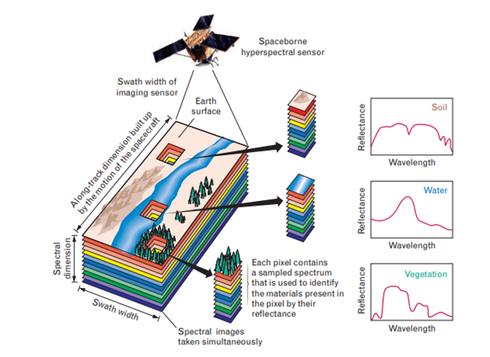{width="100%"}

::: {.caption .small}
Fuente: innoter.com
:::
:::
:::

# Órbitas y resoluciones {.section-slide background-color="#2a7f62"}

## Órbita geoestacionaria {.compact}

::: columns
::: {.column width="55%"}
- El satélite gira **paralelo al ecuador** a la misma velocidad angular que la Tierra → siempre sobre el **mismo punto**
- Altura: ~35.786 km
- Útil para: **clima, telecomunicaciones**
- Limitación: muy lejos → resolución espacial **baja**
:::

::: {.column width="45%"}
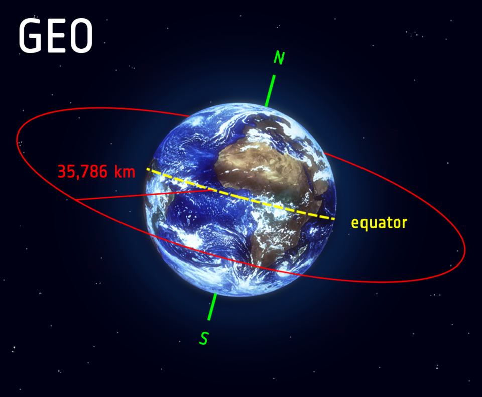{width="90%"}

::: {.caption .small}
Fuente: ESA
:::
:::
:::

## Órbita polar {.compact}

::: columns
::: {.column width="55%"}
- Órbita **cercana a la Tierra** que pasa cerca de los **polos**
- La Tierra rota debajo del satélite → en pocos días/semanas recorre **todo el planeta**
- Útil para: **mapeo de la superficie** (mejor resolución espacial)
- La mayoría de los satélites de observación de la Tierra usan esta órbita
:::

::: {.column width="45%"}
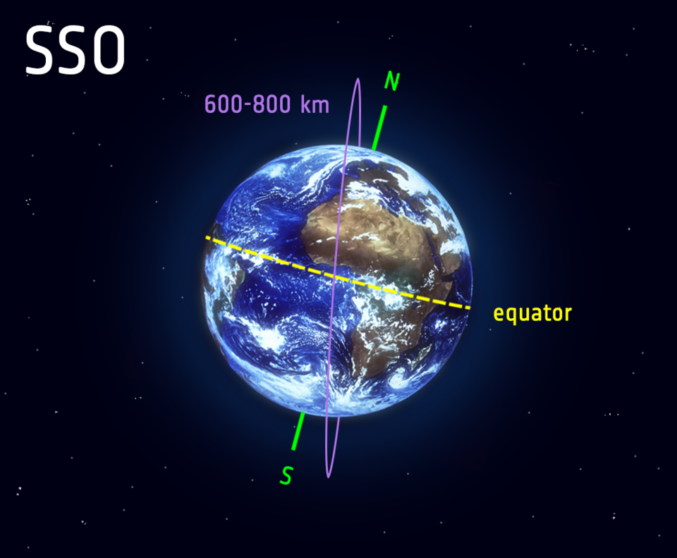{width="90%"}

::: {.caption .small}
Fuente: ESA
:::
:::
:::

## Las 3 resoluciones — y por qué no se puede tener todo {.compact}

::: {.box}
1. **Resolución espacial**: tamaño del píxel (¿cuánto detalle?)
2. **Resolución espectral**: número y ancho de las bandas (¿cuántos "colores"?)
3. **Resolución temporal**: cada cuánto se revisita la misma escena (¿cuán seguido?)
:::

**Las 3 entran en conflicto:**

- Más resolución espectral ⇆ menos resolución espacial
- Más resolución temporal ⇆ menos resolución espacial
- Y la **resolución radiométrica** (bits por píxel) y el costo también pesan

→ Cada misión satelital **prioriza** ciertas resoluciones según su propósito.

## Ejemplo 1 — GOES13: clima en tiempo real {.compact}

::: columns
::: {.column width="55%"}
**Geoestacionario, sobre las Américas**

- Resolución temporal: **continua** (imágenes cada minutos)
- Resolución espacial: **2 km** — baja, pero suficiente para nubes y tormentas
- Lo usan los meteorólogos en TV
:::

::: {.column width="45%"}
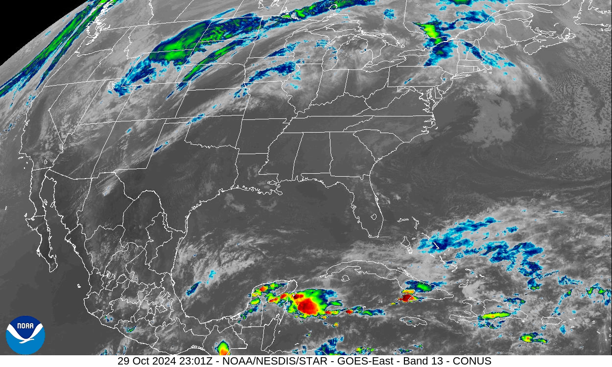{width="100%"}

::: {.caption .small}
Fuente: NASA
:::
:::
:::

## Ejemplo 2 — MODIS: el "general practitioner" {.compact}

::: columns
::: {.column width="50%"}
**A bordo de Terra (1999) y Aqua (2002)**

- **36 bandas** (resolución espectral alta)
- Revisita: **1–2 días** (alta temporal)
- Resolución espacial: **250 m – 1 km** (moderada)
- Insumo de miles de productos: NDVI, fuegos, nieve, océanos
:::

::: {.column width="50%"}
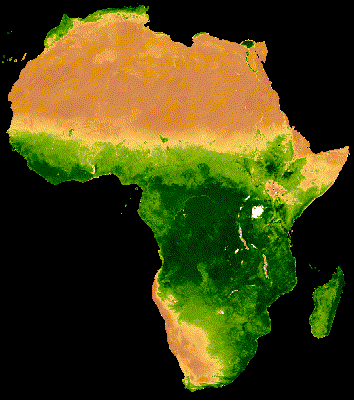{width="100%"}
:::
:::

## MODIS NDVI anual {.compact}

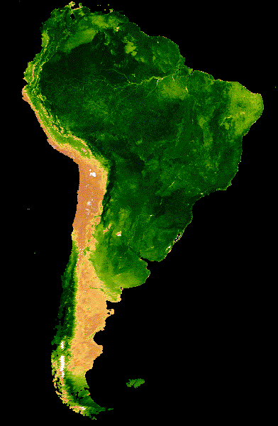{width="50%"}

::: {.caption}
GIF de NDVI en un año en América del Sur. ¡Nuestro continente respira!. Fuente: Construido por equipo docente en Google Earth Engine.
:::

## Ejemplo 3 — Programa Landsat (1973 → hoy) {.compact}

::: columns
::: {.column width="55%"}
**El programa de observación más largo de la historia.**

- **Landsat 1 (1972)**: 4 bandas (B, G, R, NIR), 60 m
- **Landsat 9 (2021)**: 11 bandas, 15 m en pancromática
- Frecuencia temporal: **16 días**
- 50+ años de imágenes → ideal para estudiar **cambios** (deforestación, urbanización, glaciares)
- **Gratuito** desde 2008 (USGS)
:::

::: {.column width="45%"}
{width="100%"}

::: {.caption .small}
Fuente: NASA Landsat
:::
:::
:::

## Landsat: 50 años mirando la Tierra

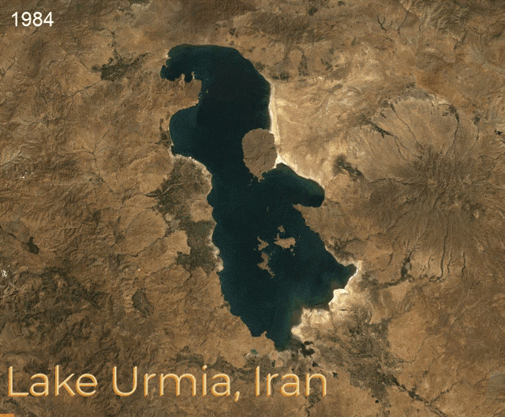{width="65%"}

# Tour de satélites: ¿qué hay disponible? {.section-slide background-color="#2a7f62"}

## Sentinel-1 — radar que ve a través de las nubes {.compact}

::: columns
::: {.column width="50%"}
- **ESA / Programa Copernicus**, gemelas Sentinel-1A (2014) y 1B
- **Sensor activo**: SAR (Synthetic Aperture Radar) — emite microondas
- ¡Funciona **de día y de noche**!
- ¡Funciona **a través de las nubes**! (clave en zonas tropicales)
- Resolución: ~10 m
- Útil para: **inundaciones, hundimiento del terreno, derrames de petróleo, deforestación**
:::

::: {.column width="50%"}
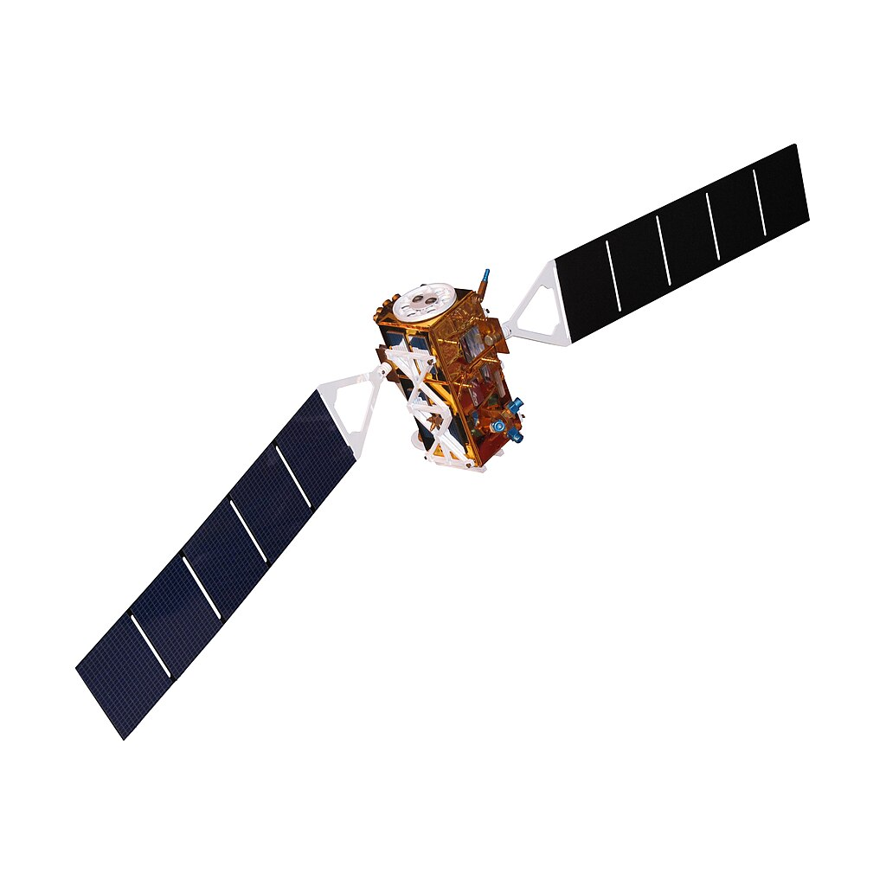{width="80%"}

::: {.caption .small}
Sentinel-1 (ESA)
:::
:::
:::

## Sentinel-2 — el "Landsat europeo", pero más fino {.compact}

::: columns
::: {.column width="50%"}
- **ESA / Copernicus**, gemelas Sentinel-2A (2015) y 2B (2017)
- **13 bandas** multiespectrales
- Resolución: **10 m** (las bandas RGB y NIR)
- Revisita: **5 días** combinando ambos satélites
- **Gratuito y abierto**
- Para muchos análisis urbanos y agrícolas, es **la primera opción** hoy
:::

::: {.column width="50%"}
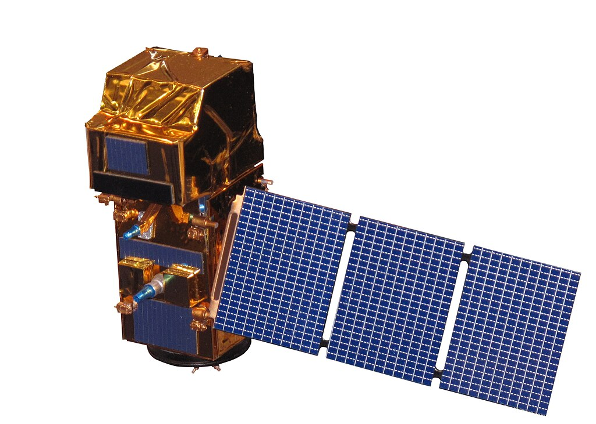{width="80%"}

::: {.caption .small}
Sentinel-2 (ESA)
:::
:::
:::

## Planet — comercial, ~3 m, **diario** {.compact}

::: columns
::: {.column width="55%"}
- **Empresa privada** (ex-Planet Labs), ~200 microsatélites en órbita
- **PlanetScope**: ~3 m, **diario** sobre toda la superficie terrestre
- **SkySat**: ~50 cm bajo demanda
- **Pagado** — pero universidades suelen tener acceso a través de programas como Education and Research
- Útil cuando se necesita **alta resolución temporal + espacial** (monitoreo de cultivos, conflictos, talas ilegales)
:::

::: {.column width="45%"}
::: {.box}
**Imagina poder ver tu casa todos los días desde el espacio, a 3 m de resolución.**

Eso es Planet. Y plantea preguntas serias sobre **vigilancia, privacidad y datos** como bien público vs. privado.
:::
:::
:::

## Mapa mental — ¿qué satélite uso para qué? {.compact}

| Propósito | Mejor opción | Por qué |
|---|---|---|
| Cambio climático global, NDVI continental | **MODIS** | Diario, 250 m, 36 bandas, 25 años |
| Estudios urbanos / agrícolas a escala regional | **Sentinel-2** | 10 m, 5 días, gratuito |
| Series largas (1985+) | **Landsat** | 50 años de archivo |
| Inundaciones, monitoreo a través de nubes | **Sentinel-1 (SAR)** | Activo, día/noche, todo clima |
| Tala ilegal, monitoreo de eventos puntuales | **Planet** | Diario, ~3 m (pagado) |
| Clima en tiempo real | **GOES** | Continuo, 2 km |
| Topografía, vegetación 3D | **LIDAR** (avión o satélite) | Mide altura |

# ¿Y cómo accedo yo a estos datos? {.section-slide background-color="#2a7f62"}

## Repositorios abiertos {.compact}

::: columns
::: {.column width="50%"}
::: {.box}
**Datos satelitales gratuitos**

- 🇺🇸 **USGS EarthExplorer** — `earthexplorer.usgs.gov` (Landsat, ASTER, ICESat)
- 🇪🇺 **Copernicus Data Space** — `browser.dataspace.copernicus.eu` (Sentinel)
:::
:::

::: {.column width="50%"}
::: {.box}
**Productos derivados (no-imagen)**

- **MODIS / VIIRS productos** — incendios, NDVI, nieve, T°
- **ARCLIM** (MMA Chile) — proyecciones climáticas comuna por comuna
- 🇨🇱 **CR2 ** — `cr2.cl` (datos climáticos chilenos)
:::

::: {.caption}
La transición de "imágenes crudas" a "productos listos" es enorme. Hoy puedes bajar el "porcentaje de hectáreas quemadas" sin tocar una imagen.
:::
:::
:::

## Google Earth Engine — la fábrica de teledetección a escala planetaria {.compact}

- **Plataforma de Google** (gratuita para uso académico/no-comercial)
- ~**80 PB** de datos satelitales pre-cargados (Landsat completo, Sentinel, MODIS, etc.)
- **Code Editor** en el navegador (JavaScript) o API en Python/R
- En lugar de **bajar imágenes** → mandas el **código** a la nube y procesas en sus servidores
- Permite hacer en minutos lo que antes tomaba semanas
- En la última clase del semestre aprenderemos a acceder a este recurso

# Índices, T° superficial, LIDAR {.section-slide background-color="#2a7f62"}

## Índices espectrales {.compact}

Un **índice espectral** es una **función de varias bandas** que captura un fenómeno de interés.

::: {.box .small}
- **NDVI** — Normalized Difference Vegetation Index → **salud de la vegetación**
- **EVI / SAVI / MSAVI** — variantes con corrección de suelo / atmósfera
- **NDMI** — Normalized Difference Moisture Index → **humedad de la vegetación**
- **NBR / NBR2** — Normalized Burn Ratio → **huella de incendios**
- **NDSI** — Normalized Difference Snow Index → **cobertura de nieve**
- **NDBI** — built-up index → **suelo urbano**
:::

::: {.caption}
Idea: cada material refleja distinto en distintas bandas → la **diferencia** entre bandas amplifica una señal específica.
:::

## NDVI: el índice más usado del mundo {.compact}

::: columns
::: {.column width="60%"}
La vegetación **sana** **absorbe** rojo (clorofila) y **refleja** infrarrojo cercano (estructura de la hoja)

La vegetación **enferma** o seca refleja menos NIR y más rojo

$$\text{NDVI} = \frac{\text{NIR} - \text{RED}}{\text{NIR} + \text{RED}}$$

Rango: **−1 a +1**:

- 0.6 → vegetación densa y sana
- 0.2–0.5 → arbustos, pastos
- 0.1 → suelo desnudo, nieve, agua
:::

::: {.column width="40%"}
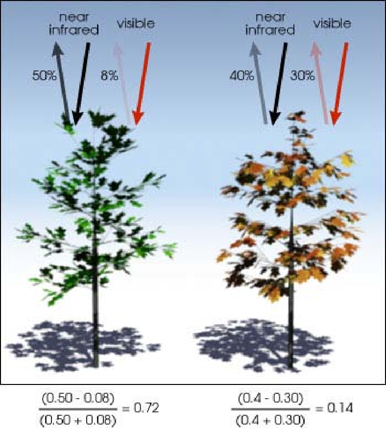{width="80%"}

::: {.caption .small}
Fuente: ResearchGate
:::
:::
:::

## NDVI: ejemplo visual

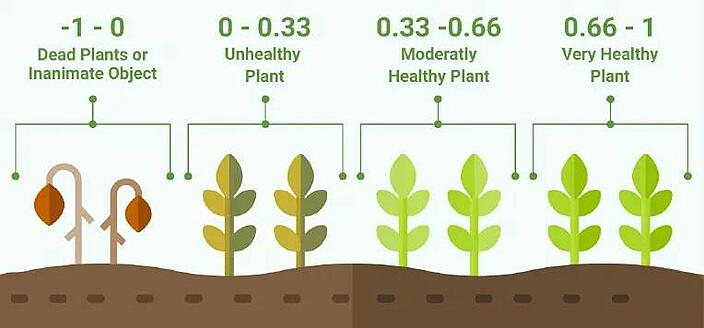{width="60%"}

::: {.caption}
NDVI en un cultivo. Verde oscuro = vegetación vigorosa; café/amarillo = estrés o suelo desnudo. Fuente: cropin.com
:::

## Temperatura superficial — la banda termal {.compact}

::: columns
::: {.column width="70%"}
- Todo objeto con temperatura emite radiación en **frecuencias bajas** (infrarrojo lejano)
- La intensidad de esa radiación → permite **inferir la temperatura**
- Así funcionan los **termómetros infrarrojos**
- Bandas termales en Landsat (TIRS) y MODIS

:::

::: {.column width="30%"}
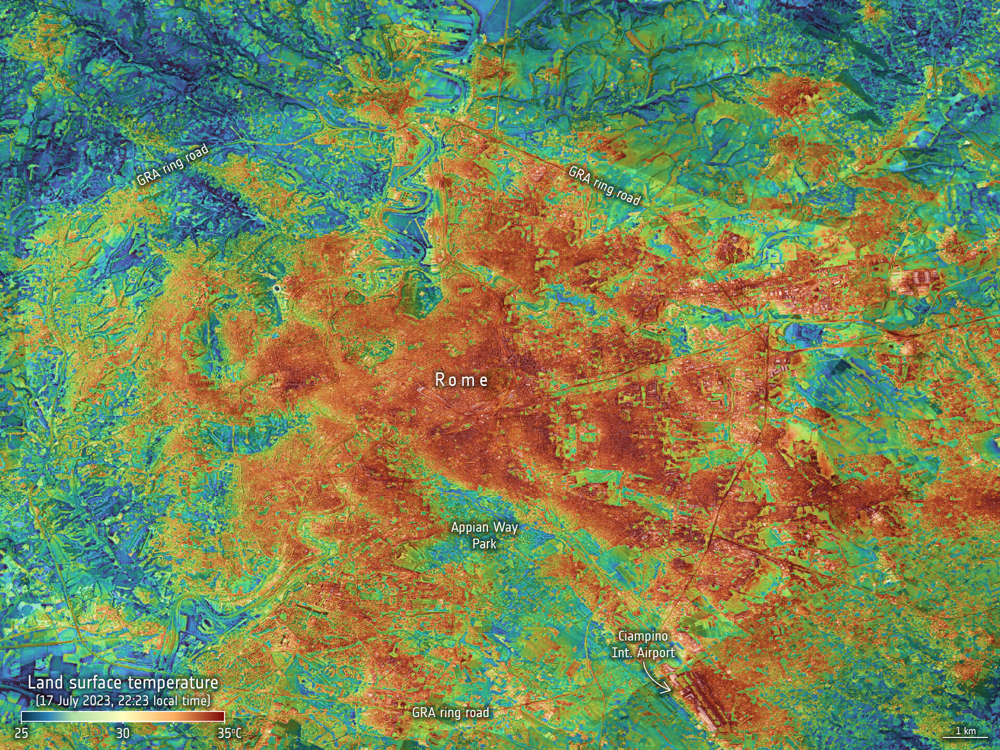{width="100%"}

::: {.caption .small}
La banda termal mira el calor invisible. (NASA/JPL)
:::
:::

::: {.box}
**¡Ojo!: temperatura superficial**  ≠ **temperatura ambiental** (la que miden las estaciones meteorológicas, a 2 m del suelo).

Una calle de asfalto puede estar a 60 °C de **superficie** mientras el aire está a 32 °C.

¿Cuál es la temperatura relevante? -> Depende de la pregunta
:::

:::

## Sensores activos: LIDAR {.compact}

::: columns
::: {.column width="50%"}
**LIDAR** — *Light Detection and Ranging*

- Emite pulsos de **láser**
- Mide el **tiempo de retorno** del rebote
- → **distancia** al objeto → **altura**
- Usado desde aviones, drones y satélites (ICESat-2)
- Productos: **modelos digitales de elevación**, altura de árboles, edificaciones, glaciares
:::

::: {.column width="50%"}
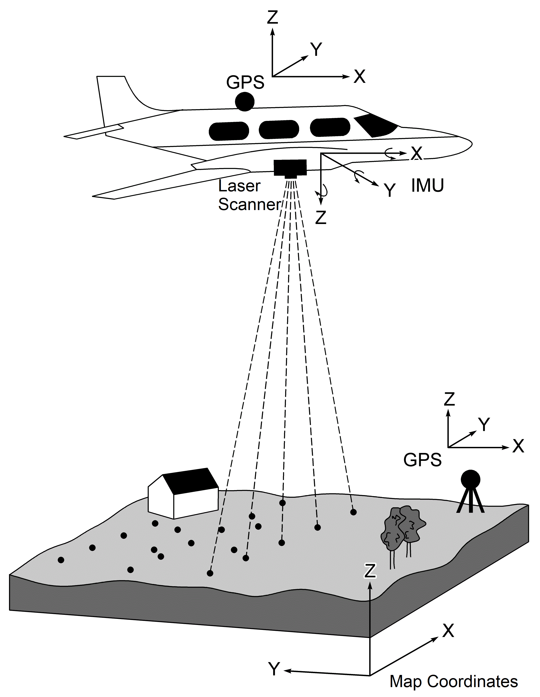{width="80%"}

::: {.caption .small}
Fuente: opengeomatics.ca
:::
:::
:::

## LIDAR: bosque en 3D

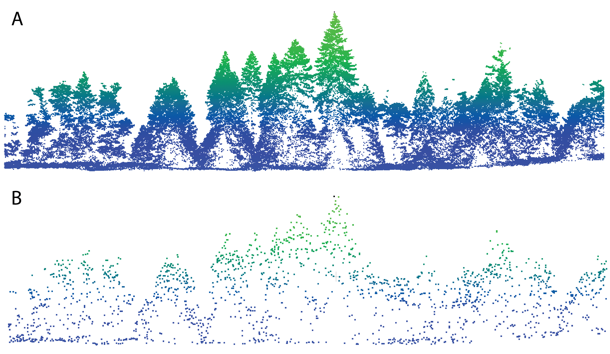{width="75%"}

::: {.caption}
Una nube de puntos LIDAR permite reconstruir un bosque en tres dimensiones. Útil para inventarios forestales, biomasa de carbono, riesgo de incendio.
:::

# Más allá de la Tierra {.section-slide background-color="#2a7f62"}

## La teledetección no es sólo terrestre {.compact}

La idea de **un instrumento que mide radiación remota** se aplica también:

::: {.box}
- **Hacia afuera**: telescopios espaciales que estudian galaxias y exoplanetas
- **Hacia el Sol**: misiones que vuelan a la corona solar
- **Hacia otros planetas**: orbitadores y rovers que mapean Marte, Saturno, Júpiter…
:::

¡Es la **misma física** que medir la temperatura de un techo en Maipú!

## Hubble — 35 años mirando el cosmos {.compact}

::: columns
::: {.column width="50%"}
- Lanzado en **1990**, órbita baja a 540 km
- Observa en **óptico, ultravioleta e infrarrojo cercano**
- Reparado **5 veces** por astronautas (¡teledetección con servicio técnico!)
- Imágenes que reescribieron la astrofísica: campo profundo, exoplanetas, expansión acelerada del universo
:::

::: {.column width="50%"}
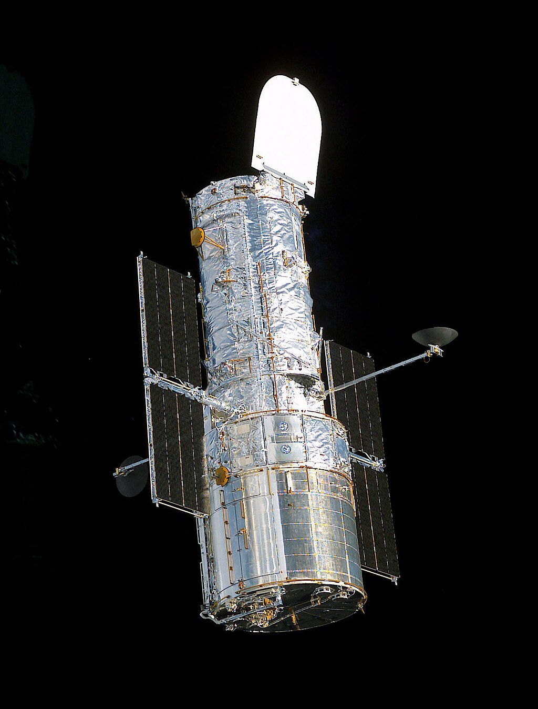{width="80%"}

::: {.caption .small}
Hubble en órbita (NASA, STS-109)
:::
:::
:::

## James Webb (JWST) — ojos infrarrojos en L2 {.compact}

::: columns
::: {.column width="50%"}
- Lanzado **diciembre 2021**
- ¡Está a **1,5 millones de km** de la Tierra! (punto de Lagrange L2)
- Observa en **infrarrojo** → puede ver objetos **más fríos y más antiguos** que Hubble
- Espejo segmentado de **6,5 m**, escudo solar del tamaño de una cancha de tenis
- Ya detectó **moléculas en atmósferas de exoplanetas**
:::

::: {.column width="50%"}
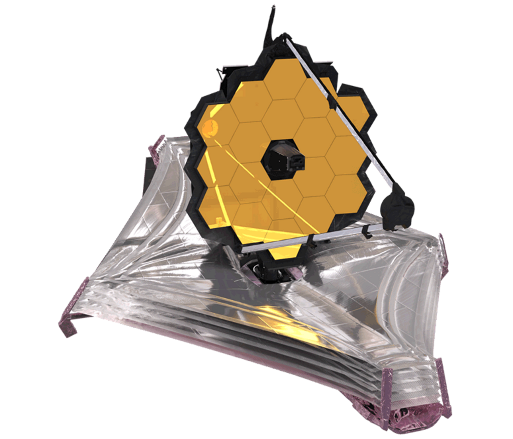{width="80%"}

::: {.caption .small}
JWST artist concept (NASA)
:::
:::
:::

## Hubble vs. JWST — Pilares de la Creación {.compact}

::: columns
::: {.column width="50%"}
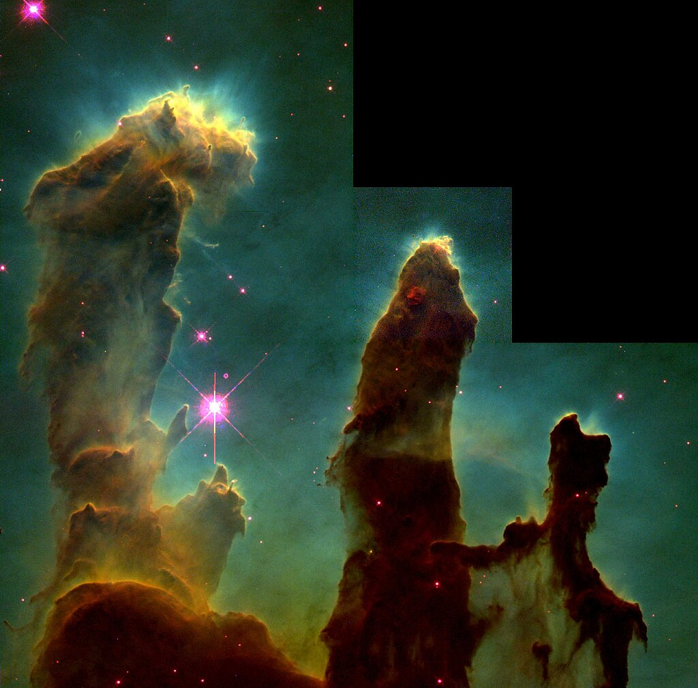{width="100%"}

::: {.caption .small}
Hubble (1995, óptico) — ¡la imagen más icónica de la astronomía!
:::
:::

::: {.column width="50%"}
{width="100%"}

::: {.caption .small}
JWST (2022, NIRCam) — el infrarrojo atraviesa el polvo y revela las estrellas en formación.
:::
:::
:::

::: {.caption}
Es la **misma nebulosa** (a 6.500 años-luz). Cambió la longitud de onda → cambió lo que se ve. *Eso* es teledetección espectral.
:::

## Mirando al Sol — las gemelas STEREO {.compact}

::: columns
::: {.column width="50%"}
- **STEREO-A** y **STEREO-B**, lanzadas en **2006**
- Una **adelante** de la Tierra en su órbita, otra **detrás** → vistas estereoscópicas del Sol
- Permitieron por primera vez ver el Sol **en 3D**
- Estudian **eyecciones de masa coronal** (CME) que pueden afectar redes eléctricas en la Tierra
:::

::: {.column width="50%"}
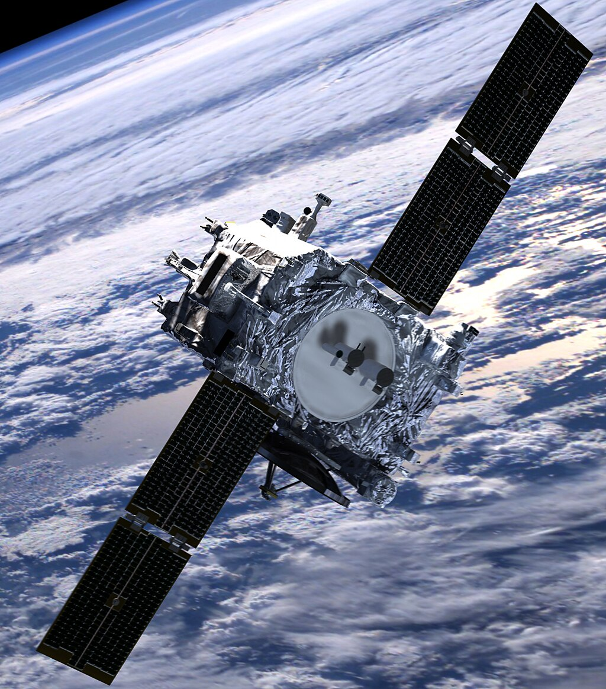{width="90%"}

::: {.caption .small}
Despliegue de STEREO (NASA)
:::
:::
:::

## Parker Solar Probe — la sonda que **toca el Sol** {.compact}

::: columns
::: {.column width="55%"}
- Lanzada **2018** (NASA)
- Diseñada para entrar en la **corona solar** — la atmósfera externa del Sol
- En 2024 pasó a **6,1 millones de km** del Sol (a 690.000 km/h)
- Escudo de carbón-carbono soporta **1.400 °C**
- Estudia el **viento solar** y por qué la corona está más caliente que la superficie
:::

::: {.column width="45%"}
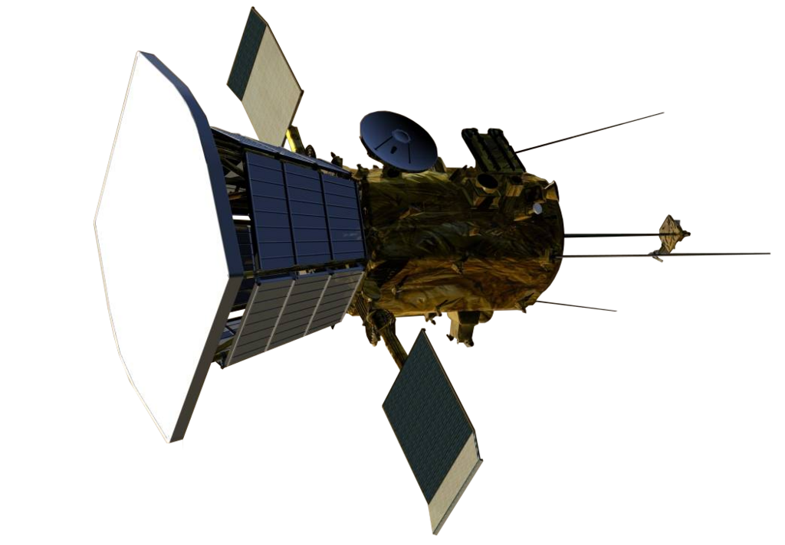{width="90%"}

::: {.caption .small}
Parker Solar Probe (NASA/JHUAPL)
:::
:::
:::

## Solar Orbiter — la prima europea {.compact}

::: columns
::: {.column width="55%"}
- **ESA + NASA**, lanzada **2020**
- Sale del plano de la eclíptica → primera misión que ve los **polos del Sol**
- Combina **teledetección remota** + **medición in-situ** del viento solar

:::

::: {.column width="45%"}
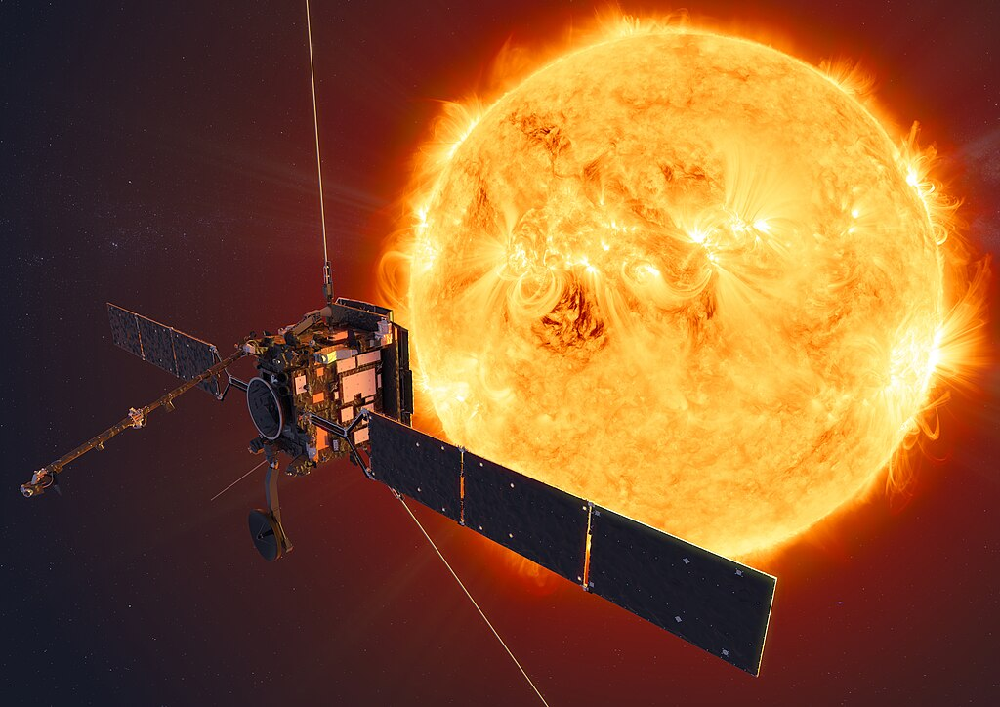{width="90%"}

::: {.caption .small}
Solar Orbiter (ESA)
:::
:::
:::

## Otros planetas — Mars Reconnaissance Orbiter {.compact}

::: columns
::: {.column width="50%"}
- En órbita marciana desde **2006**
- Cámara **HiRISE**: resolución de **30 cm/píxel** desde 300 km de altura — ¡como ver una mesa de comedor desde el espacio!
- Sirvió de **scout** para escoger los sitios de aterrizaje de Curiosity y Perseverance
:::

::: {.column width="50%"}
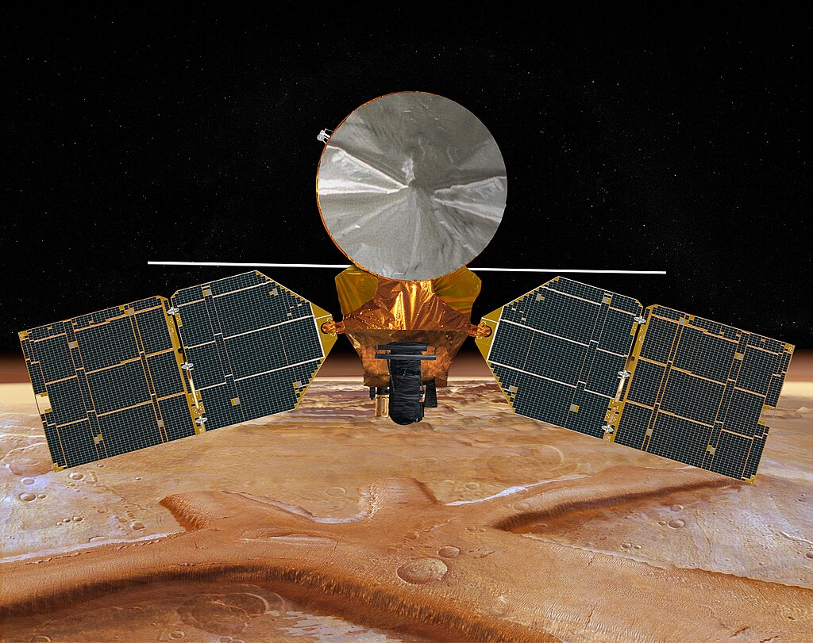{width="80%"}

::: {.caption .small}
MRO (NASA/JPL)
:::
:::
:::

## HiRISE: avalanchas en Marte

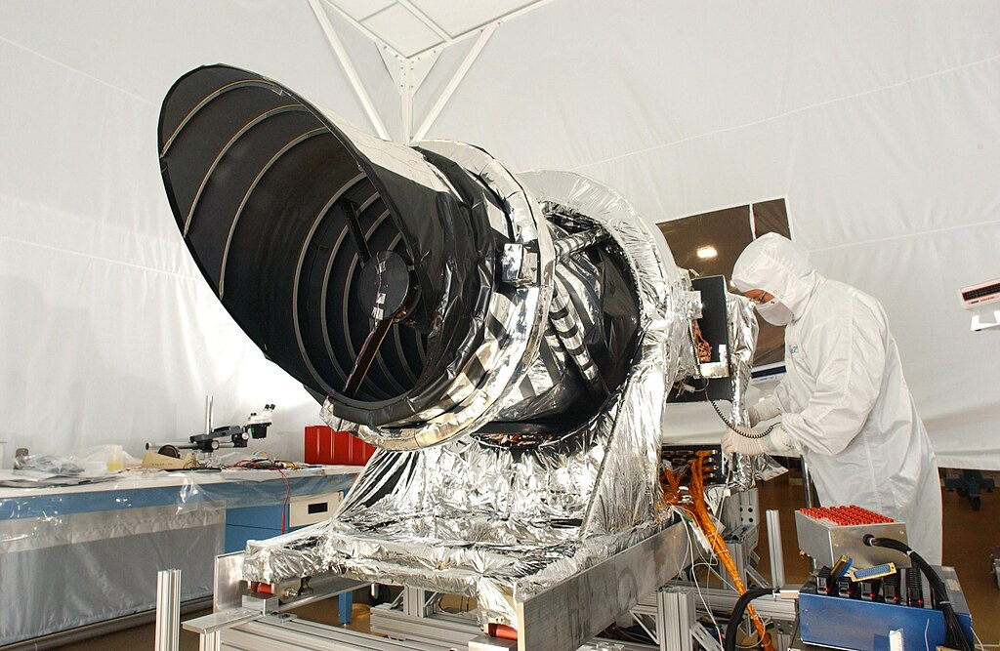{width="55%"}

::: {.caption}
Avalancha de hielo y polvo capturada por HiRISE (NASA/JPL/UA). La misma tecnología que NDVI, pero a 200 millones de km.
:::

## Cassini — Saturno y sus lunas {.compact}

::: columns
::: {.column width="55%"}
- **NASA + ESA + ASI** (1997 → 2017)
- Estudió Saturno, sus anillos y sus lunas
- Encontró **géiseres en Encélado** → océano subterráneo, posibilidad de vida
- Soltó la sonda **Huygens** en Titán (única vez que un objeto humano aterrizó en una luna fuera de la nuestra)
- Terminó con un **"Grand Finale"**: zambullida intencional en la atmósfera de Saturno
:::

::: {.column width="45%"}
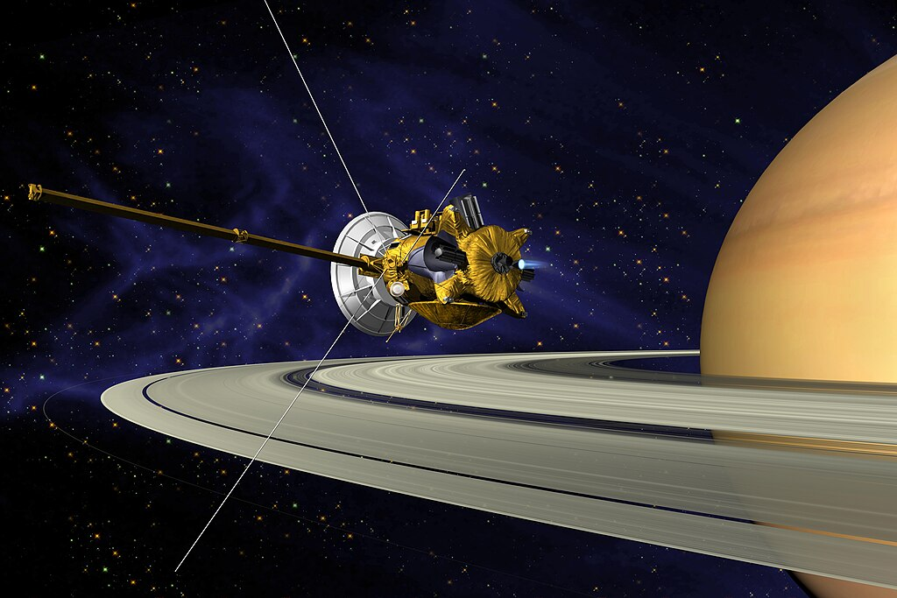{width="90%"}

::: {.caption .small}
Cassini (NASA/JPL)
:::
:::
:::

## Juno — adentro de Júpiter {.compact}

::: columns
::: {.column width="55%"}
- En órbita de Júpiter desde **2016**
- Órbita polar elíptica que la lleva muy cerca del planeta
- Mapea el **campo magnético**, el **interior** y la **gran mancha roja**
:::

::: {.column width="45%"}
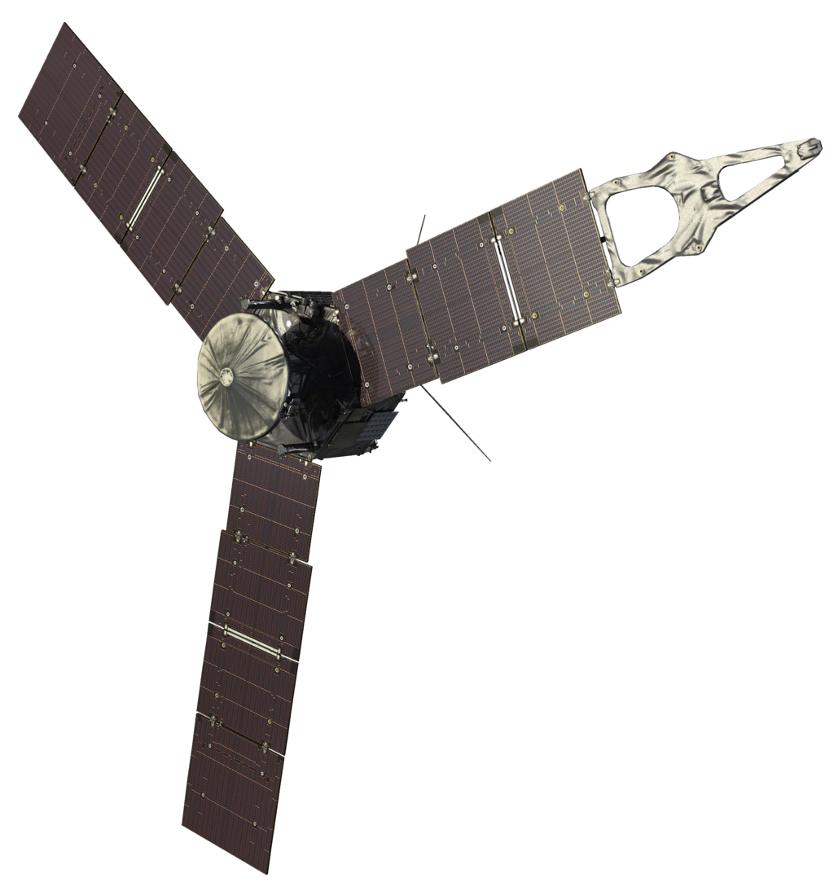{width="80%"}

::: {.caption .small}
Juno (NASA)
:::
:::
:::

## BONUS — GRACE: pesar el agua del planeta {.compact}

::: columns
::: {.column width="55%"}
- **GRACE** (2002–2017) y **GRACE-FO** (2018–): par de satélites gemelos
- Miden cambios **mínimos** en la distancia entre ambos (~10 µm)
- → **anomalías del campo gravitatorio** terrestre
- → **masa de agua** en napas, glaciares, océanos

::: {.box}
GRACE detectó la **megasequía chilena** desde el espacio, midiendo cómo se vaciaron las napas.
:::
:::

::: {.column width="45%"}
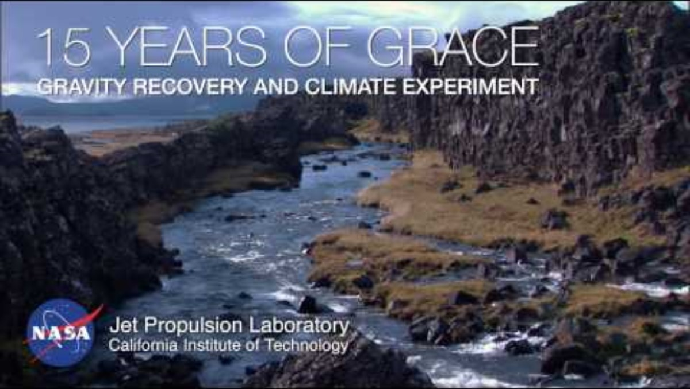{width="100%"}

::: {.caption .small}
GRACE (NASA/JPL)
:::
:::
:::

## Síntesis del primer bloque {.compact}

::: {.box}
1. Un **raster** es una grilla con coordenadas — la forma natural de variables continuas
2. Un instrumento de **teledetección** mide radiación remota (pasiva o activa)
3. Cada misión satelital prioriza ciertas **resoluciones** — espacial, espectral, temporal
4. Hoy hay un ecosistema enorme de datos abiertos (USGS, Copernicus, GEE)
5. La **misma física** se aplica del NDVI de Maipú a la atmósfera de Júpiter
:::

→ En el segundo bloque vamos a usar exactamente estas herramientas para entender el **calor extremo** en Santiago.

# Calor extremo: una amenaza creciente {.section-slide background-color="#c64b3a"}

## El planeta se está calentando — y los cuerpos no {.compact}

::: columns
::: {.column width="55%"}
- Temperatura global **+1,07 °C** desde 1850–1900 (IPCC, 2023)
- El cuerpo humano es buen termorregulador, pero solo entre **36,5–37,5 °C**
- Sobre los **40 °C corporales** → falla multiorgánica
- 2022: **45 °C** en India y Pakistán; **40 °C** en Sevilla; **>41 °C** en San Felipe y Llay Llay (¡Chile!)
- En el verano europeo de 2022: **~60.000 muertes por calor**
:::

::: {.column width="45%"}
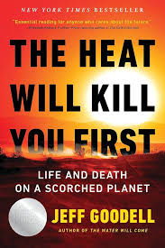{width="80%"}

::: {.caption .small}
Fuente: archivo del autor
:::
:::
:::

## Chile: la curva sube {.compact}

::: {.box}
- Santiago: **+0,14 °C por década** desde 1914
- Días con T° > 30 °C: **55 al año (1961–90)** → **79 hoy**
- Récord 25 enero 2017: **37,4 °C**
- Récord 27 enero 2019: **38,3 °C**
:::

::: {.caption}
Fuente: Gil et al. (2023), datos DMCh.
:::

::: {.box}
**Comparación cruda**: las muertes estimadas por calor en Chile (~566 en 2017) **superan** el total del 27F (2010).
:::

## El calor mata por muchas vías {.compact}

::: columns
::: {.column width="50%"}
**Agudo:**

- **Golpe de calor** (heat stroke): falla orgánica, mortal incluso en jóvenes sanos
- Deshidratación → falla cardiovascular
- Insuficiencia renal aguda

**Crónico / acumulativo:**

- Empeoramiento de **cardiovascular, respiratorio, renal**
- **Salud mental**: psicosis, suicidio, lesiones autoinfligidas
- **Embarazo**: parto prematuro, bajo peso al nacer, mortinatos
:::

::: {.column width="50%"}
**No-salud, pero también costoso:**

- ↓ **Productividad** laboral
- ↓ **Aprendizaje** escolar
- ↑ **Conflicto y violencia** (Hsiang, Burke et al.)
- ↑ **Violencia de género** (Sanz-Barbero et al.)
:::
:::

# Marco de riesgo {.section-slide background-color="#c64b3a"}

## Riesgo no es lo mismo que amenaza {.compact}

::: {.box style="font-size: 1.3em; text-align: center; padding: 1em;"}
$$\text{Riesgo} = \frac{\text{Amenaza} \times \text{Exposición} \times \text{Vulnerabilidad}}{\text{Capacidades}}$$
:::

::: columns
::: {.column width="50%"}
- **Amenaza**: ¿qué tan caliente y por cuánto tiempo? (meteorología)
- **Exposición**: ¿quién y qué está expuesto? (geografía + demografía)
:::

::: {.column width="50%"}
- **Vulnerabilidad**: ¿quiénes resisten menos? (biología, ingreso, vivienda)
- **Capacidades**: ¿qué tan preparados estamos? (institucional, infraestructura)
:::
:::

::: {.caption}
Fuente: UNDRR (2021); Gil et al. (2023). El mismo marco se usa para terremotos, inundaciones, incendios.
:::

## Umbral meteorológico ≠ umbral epidemiológico {.compact}

::: columns
::: {.column width="50%"}
**Meteorológico (DMCh)**: una "ola de calor" es 3+ días sobre el percentil 90 histórico
→ útil para **caracterizar el clima**, no necesariamente para gestionar **salud**
:::

::: {.column width="50%"}
**Epidemiológico**: la temperatura sobre la cual aumenta significativamente la mortalidad
→ depende del lugar (¿qué tan adaptada está la gente?)
:::
:::

::: {.box}
**Caso Chile (Gil et al. 2023, datos DEIS 2009–2018):** comparado con días a 30 °C, el riesgo relativo de muerte aumenta:

- **+20 % a los 33 °C**
- **+40 % a los 35 °C**

→ La temperatura **importa para salud antes** de que la DMCh declare una ola de calor.
:::

# Vulnerabilidad: ¿quién muere de calor? {.section-slide background-color="#c64b3a"}

## Adultos mayores — el grupo crítico {.compact}

::: columns
::: {.column width="55%"}
- **17,4 % de la RM** tiene > 60 años (~1,25 millones)
- **12,6 %** tiene algún tipo de **dependencia funcional**
- **~10 % vive solo** (Censo 2017)
- ↓ capacidad de termorregulación, ↓ percepción de la sed
- Comunas con más mayores viviendo solos: **Santiago, Las Condes, Ñuñoa, Providencia, La Florida, Puente Alto, Maipú**
:::

::: {.column width="45%"}
::: {.box}
**Lección de Chicago 1995**: 739 muertos por calor — la inmensa mayoría adultos mayores **viviendo solos**, sin aire acondicionado y con miedo a abrir las ventanas.

Klinenberg, *Heat Wave* (2002).
:::
:::
:::

## Enfermos crónicos {.compact}

::: columns
::: {.column width="50%"}
- **Hipertensión**: ~33 % de la población adulta de la RM
- **Cardiovasculares**: 152 por 100.000 habitantes en RM (sobre el promedio nacional)
- **Diabetes, EPOC, salud renal**: empeoran con la deshidratación
- **Tabaquismo** y **estrés**
:::

::: {.column width="50%"}
::: {.box}
La principal causa de muerte durante una ola de calor **no es** el golpe de calor.

Es el **agravamiento de patologías preexistentes**, especialmente cardiovasculares y respiratorias.
:::
:::
:::

## Embarazadas, recién nacidos y niños {.compact}

::: columns
::: {.column width="50%"}
**Embarazadas**

- Termorregulación reducida (Samuels et al., 2022)
- Riesgo: **parto prematuro, bajo peso al nacer, mortinatos**
- Efecto detectado **independiente** de edad, educación, raza/etnia
:::

::: {.column width="50%"}
**Recién nacidos / niños/as**

- Termorregulan **peor** que adultos
- No tienen **autonomía** para hidratarse, buscar sombra
- Efectos: dermatológicos, renales, deshidratación
:::
:::

## Salud mental, movilidad reducida, situación de calle {.compact}

::: columns
::: {.column width="50%"}
**Salud mental**

- Antidepresivos alteran termorregulación
- ↑ episodios de psicosis, lesiones autoinfligidas, suicidio
- ↑ Hospitalizaciones psiquiátricas

**Movilidad reducida**

- **20,3 %** de adultos en RM con discapacidad (Senadis 2015)
- **37,9 %** de los > 60 años — dificultad para hidratarse y refrescarse
:::

::: {.column width="50%"}
**Situación de calle**

- 19.342 personas en Chile (2022)
- **42 % vive en RM** — concentrados en Santiago Centro, Estación Central, San Bernardo, Puente Alto
- **No existen** programas específicos para olas de calor (sí para frío extremo)
:::
:::

## Trabajadores al aire libre {.compact}

::: columns
::: {.column width="55%"}
- **Limpieza, jardinería, construcción, agricultura**
- Alto gasto energético + sol directo + hidratación limitada
- **Artículo 184 del Código del Trabajo**: el empleador *está obligado* a tomar todas las medidas necesarias para proteger eficazmente la vida y salud
- Pero **no hay normativa específica** para calor extremo en intemperie
- Comparar: España y California **prohíben** trabajo a la intemperie sobre cierto umbral
:::

::: {.column width="45%"}
::: {.box}
**Pregunta abierta**: ¿debería Chile seguir a California (Cal/OSHA Heat Illness Prevention Standard) y prohibir trabajos a la intemperie sobre, digamos, **35 °C**?

Volveremos a esto en la actividad.
:::
:::
:::

# Exposición desigual en el espacio {.section-slide background-color="#c64b3a"}

## Isla de calor urbano (UHI) {.compact}

::: columns
::: {.column width="55%"}
- En ciudades, las superficies impermeables (cemento, asfalto, techos oscuros) **absorben** y **emiten** calor
- ↓ vegetación → ↓ evapotranspiración → ↑ temperatura
- **Diferencia** ciudad-campo: típicamente **3–5 °C**, hasta **8 °C** en las peores zonas
- En Santiago: documentado desde Romero, Smith, Sepúlveda (2008–2016) usando **imágenes satelitales** (¡bloque 1!)
:::

::: {.column width="45%"}
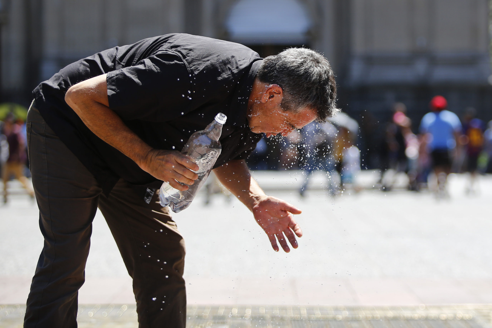{width="100%"}

::: {.caption .small}
Fuente: archivo del autor
:::
:::
:::

## Arbolado urbano: la solución más eficiente {.compact}

::: columns
::: {.column width="50%"}
- Un árbol urbano puede bajar **1–4 °C** localmente
- En Europa se ha medido hasta **8 °C** menos bajo dosel
- sombra y evapotranspiración
- **Costo**: bajo. **Beneficio**: enorme.

::: {.box}
Pero el arbolado en Santiago está **muy desigualmente distribuido**: Vitacura, Las Condes, Lo Barnechea, Providencia tienen mucho. Cerro Navia, La Pintana, El Bosque tienen muy poco.
:::
:::

::: {.column width="50%"}
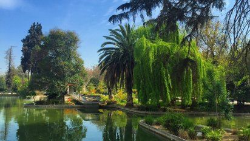{width="100%"}

:::
:::

## La RM no se calienta parejo {.compact}

Datos del **Atlas de Riesgos Climáticos (ARCLIM, MMA)** muestran:

::: {.box}
- **Cordillera (Vitacura, Las Condes, Lo Barnechea)** → **menos** días sobre 34 °C
- **Servicio de Salud Norte y Occidente** (Cerro Navia, Pudahuel, Quilicura, Renca, Lo Prado) → **más** días sobre 34 °C, en proyección a futuro

→ El **gradiente térmico** coincide con el **gradiente de ingresos**.

→ La crisis climática **amplifica** desigualdades preexistentes (vivienda, vegetación, acceso a agua).
:::

::: {.caption}
Fuente: Gil et al. (2023).
:::

## Calor + ozono troposférico — un combo letal {.compact}

::: columns
::: {.column width="55%"}
- En días calurosos, ↑ **ozono troposférico** (reacciones fotoquímicas)
- Ozono **agrava** problemas respiratorios y cardiovasculares
- En **enero 2019** (ola de calor récord): la estación de **Las Condes** marcó **100 µg/m³** sobre el nivel seguro de ozono
- Combinado, contribuyeron a un exceso de muertes en > 65 años
:::

::: {.column width="45%"}
::: {.box}
**Insight**: el calor no actúa solo. Las **olas de calor compuestas** (calor + contaminación, calor + sequía, calor + incendios) son el peor escenario.

Y son **cada vez más frecuentes**.
:::
:::
:::

## Exposición voluntaria — eventos masivos al aire libre {.compact}

::: columns
::: {.column width="55%"}
- Temporada **2023–2024 (dic–mar)**: al menos **40+ eventos masivos** al aire libre en RM
- Conciertos, deportes, **2 maratones** de 42 km
- **Estadio Nacional** llenó conciertos en pleno enero
- A la fecha **no existe claridad** sobre qué medidas se le pueden exigir a estos eventos en caso de ola de calor
:::

::: {.column width="45%"}
::: {.box}
**Comparación**: Adelaida (Australia) **suspende** partidos de cricket profesional cuando la T° proyectada supera los 36 °C.

Madrid **modifica** los horarios del trabajo municipal en olas de calor.
:::
:::
:::

# Santiago HOT {.section-slide background-color="#c64b3a"}

## Santiago HOT — un mapa del calor para nuestra ciudad {.compact}

::: columns
::: {.column width="55%"}
**Investigadora principal: Dra. Raquel Jiménez** (UNAB / Cigiden)

- **Ella postuló y ganó** el fondo competitivo del programa **NIHHIS Heat Watch** de la **NOAA**
- Santiago fue la **3ª ciudad fuera de EEUU** seleccionada
- Equipo internacional: UNAB, Cigiden, **CAPA Strategies**, NOAA
:::

::: {.column width="45%"}
{width="80%"}

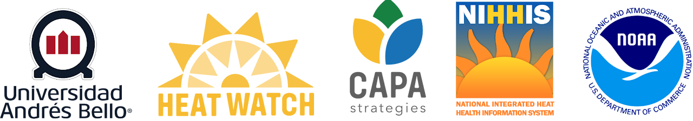{width="100%"}
:::
:::

## La motivación: las estaciones meteorológicas no alcanzan {.compact}

::: columns
::: {.column width="55%"}
- La RM tiene **pocas estaciones** meteorológicas, **mal distribuidas** (concentradas en Quinta Normal y Cerro Calán)
- Para diseñar políticas necesitamos saber el calor **calle por calle, barrio por barrio**
- Los **satélites** dan resolución espacial pero miden **temperatura superficial** (no ambiental)
- La gente sufre **temperatura ambiental**

::: {.box}
**El problema**: ningún instrumento solo da la respuesta correcta.
:::
:::

::: {.column width="45%"}
::: {.box}
**Programa Heat Watch**: combinar lo mejor de los dos mundos.

- **Satélites** → cobertura espacial densa
- **Mediciones in-situ** → temperatura ambiental real, alta calidad

→ Modelo de **machine learning** que aprende a predecir T° ambiental usando T° superficial + NDVI + uso de suelo + ...
:::
:::
:::

## Ciencia ciudadana: la campaña del 20 de enero 2024 {.compact}

::: columns
::: {.column width="60%"}
- **Voluntarios** de distintas comunas, edades y ocupaciones
- **18 rutas** estratégicamente diseñadas
- Sensores **montados en autos**
- **3 ventanas horarias**: 7:00 – 8:00 am (mínima nocturna), 3:00 – 4:00 pm (máxima diurna) y 7:00 – 8:00 pm (atardecer)
- **Más de 64.000 mediciones** de temperatura y humedad relativa en un solo día
- **El día elegido fue clave**: primer día de una de las olas de calor **más severas** del verano.
:::

::: {.column width="40%"}
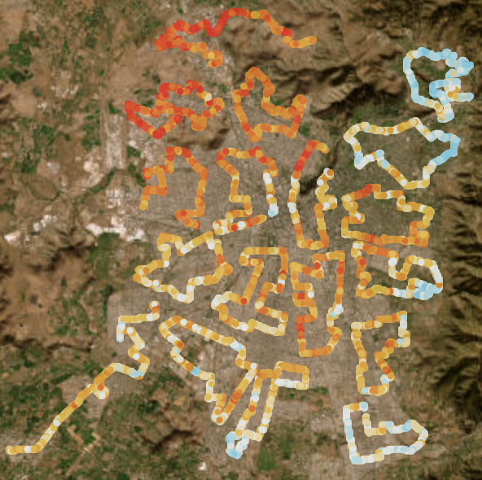{width="100%"}

::: {.caption .small}
Cada punto = una medición de los voluntarios sobre una de las 18 rutas. Fuente: Santiago HOT.
:::

:::
:::

## Cómo se integran los datos: ground truth + satélites {.compact}

::: {.box}
1. **Ground truth (in-situ)**: 64.000+ puntos con T° y humedad medidas con sensores calibrados
2. **Variables satelitales** ("predictoras"):
   - **NDVI** (vegetación) — Sentinel-2 / Landsat
   - **Temperatura superficial (LST)** — Landsat termal
   - **Uso de suelo / impermeabilidad**
   - **Distancia a parques, ríos, montaña**
   - **Topografía** (DEM)
3. **Modelo de Machine Learning** que aprende la relación in-situ ↔ satélites
4. **Predicción** de T° ambiental para **toda** la grilla de Santiago, a **10 m**
:::

::: {.caption}
Esto es exactamente lo que hicimos en el primer bloque: combinar bandas + variables auxiliares para inferir un fenómeno que no medimos directamente.
:::

## El resultado: un mapa a 10 metros del Gran Santiago {.compact}

::: columns
::: {.column width="50%"}
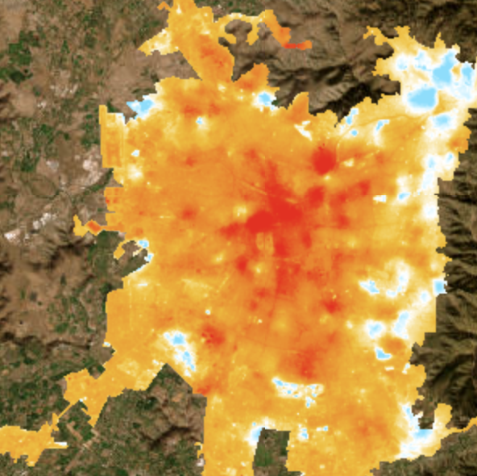{width="100%"}

::: {.caption .small}
**Mañana** (7–8 am)
:::
:::

::: {.column width="50%"}
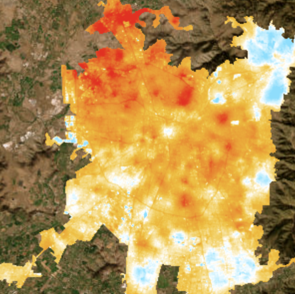{width="100%"}

::: {.caption .small}
**Tarde** (3–4 pm) — el patrón se intensifica y se desplaza
:::
:::
:::

::: {.caption}
Mapa de calor del Gran Santiago, 20 de enero 2024 (resolución 10 m). El centro y el cono surponiente concentran las temperaturas más altas; la cordillera y el sector oriente alto se mantienen más frescos. Fuente: Santiago HOT.
:::

## ¿Para qué sirve este mapa? {.compact}

::: columns
::: {.column width="50%"}
**Producto técnico**

- **Resolución espacial**: 10 m
- **3 capas temporales**: mañana, tarde, atardecer
- Producto: **temperatura ambiente** + **heat index** (T° + humedad)
- Disponible en `sites.google.com/view/santiagohot`

::: {.box}
Es el primer mapa de calor de **alta resolución** para una ciudad latinoamericana.
:::
:::

::: {.column width="50%"}
**Aplicación: justicia climática**

¿Dónde poner cooling centers? ¿Qué calles necesitan arbolado urgente? ¿Qué jardines infantiles requieren sombra ya?

::: {.box}
- Sin ese mapa → **decisiones a ciegas**.
- Con ese mapa → **decisiones territorialmente situadas**.
:::
:::
:::

## Lo que sigue: ustedes usan estos datos en su tarea {.compact}

::: {.box}
1. Cargar en QGIS los rásters de **Landsat 8** (RGB, T° superficial, NDVI) y de **Santiago HOT** (T° aire), más el shapefile del Gran Santiago
2. Aplicar simbología (rampa **Magma** para temperaturas, **blanco-verde** para NDVI) y **recortar** el RGB con el shapefile
3. Armar **composiciones lado a lado** en el Compositor de impresión: **NDVI ↔ T° superficial** y **T° aire ↔ T° superficial**
4. Hacer **zoom a una zona elegida** (tu comuna, tu barrio o una de las comunas del taller) a escala 1:20.000 y producir tres pares de mapas
:::

# Capacidades y respuesta {.section-slide background-color="#c64b3a"}

## Código Rojo — el primer protocolo de Chile {.compact}

::: columns
::: {.column width="50%"}
**Lanzado en diciembre 2022:**

| Alerta | Umbral |
|---|---|
| Verde | T° ≥ 33 °C |
| Amarilla | T° ≥ 34 °C |
| Roja | T° ≥ 35 °C |

- Sistema **comunicacional**: recomienda suspender actividades, abrir cooling centers
- Pero **no define** atribuciones ni obligaciones para los demás organismos públicos
:::

::: {.column width="50%"}
**Reforma propuesta (Gil et al.)**

| Nueva alerta | Umbral |
|---|---|
| Amarilla / Alerta temprana | ≥ 31 °C, 3 días |
| Naranja / Preemergencia | ≥ 33 °C, 2 días |
| Roja / Emergencia | ≥ 35 °C, 1 día |
| **Magenta / Crisis** | ≥ 38 °C, 1 día |

- Sigue la **lógica del PPDA**
- Verde quitado 
- Suma un nivel **magenta** para escenarios climáticos futuros
:::
:::

## Aprendizajes de 17 ciudades {.compact}

Gil et al. (2023) compararon 17 ciudades con clima similar a Santiago:

::: columns
::: {.column width="50%"}
- **Adelaida (Australia)**: heat plan estatal, suspende eventos deportivos
- **Madrid, Sevilla, Granada (España)**: planes municipales con cooling centers, ajustes laborales
- **Mendoza, Córdoba (Argentina)**: planes provinciales
- **Atenas (Grecia)**: sistema de **alerta temprana** ligado a salud
:::

::: {.column width="50%"}
**Patrones comunes:**

- El **sector salud** suele liderar
- **Cooling centers** identificados y comunicados
- **Aseguramiento de agua potable** en plazas y espacios públicos
- **Educación pública** sobre signos de golpe de calor
- **Restricciones laborales** específicas
:::
:::

## Medidas estructurales — el largo plazo {.compact}

::: {.box}
1. **Plan de arbolado urbano** — el más costo-efectivo
2. **Techos ecológicos** y techos blancos (albedo alto)
3. **Aislación térmica** y ventilación pasiva en vivienda
4. **Cooling centers** identificados, climatizados, accesibles
5. **Ventanilla única** para postular a programas de adaptación de vivienda
6. **Aseguramiento de agua potable** en plazas
7. **Ajuste horario** escolar y laboral en alertas
8. **Restricciones a eventos masivos** al aire libre en alerta roja/magenta
:::

# A+R: Plan Calor para tu comuna {.section-slide background-color="#2a7f62"}

## Plan Calor para tu comuna {.activity-slide .compact}

**Formato**: 3 grupos. Cada grupo recibe **una comuna del Gran Santiago** y un **menú de 8 medidas** con costos. Tienen **15 puntos** para gastar.

::: {.box}
**Tarea**:

1. **Diagnóstico** (3 min): ¿cuáles son los riesgos *específicos* de su comuna? (vulnerabilidad demográfica, exposición climática, capacidades existentes)
2. **Decisión** (7 min): elijan **3 medidas** del menú que sumen ≤ 15 puntos. Justifíquenlas en función del diagnóstico.
3. **Plenario** (10 min): cada grupo presenta en 2 min. Discutimos qué medidas se repiten, cuáles son únicas, y por qué.
:::

## Comuna A — Vitacura {.activity-slide .compact}

::: columns
::: {.column width="60%"}
**Perfil**:

- **Cordillera norte**, alta cota
- **Alto ingreso** (los más altos de la RM)
- **Mucho arbolado urbano** (>30 % de cobertura)
- **Baja exposición** al calor (menos días > 34 °C según ARCLIM)
- Adultos mayores: muchos, pero con redes y recursos
- Eventos deportivos: maratones, tenis al aire libre
:::

::: {.column width="40%"}
::: {.box}
**Pregunta clave**:

¿Es Vitacura un caso "fácil" o esconde **riesgos invisibles** que el promedio térmico no captura?
:::
:::
:::

## Comuna B — Cerro Navia {.activity-slide .compact}

::: columns
::: {.column width="60%"}
**Perfil**:

- **Zona occidente**, baja cota
- **Bajo ingreso**, alta densidad poblacional
- **Muy poco arbolado** urbano (<5 % de cobertura)
- **Alta exposición** al calor (Servicio de Salud Occidente — más días > 34 °C)
- Vivienda social precaria (poca aislación, techos delgados)
- Adultos mayores con **redes débiles** y baja capacidad de autocuidado
:::

::: {.column width="40%"}
::: {.box}
**Pregunta clave**:

¿Por dónde empezar cuando los déficits son **estructurales** y los recursos municipales son escasos?
:::
:::
:::

## Comuna C — Santiago Centro {.activity-slide .compact}

::: columns
::: {.column width="60%"}
**Perfil**:

- **Centro de la ciudad**, mucho concreto y asfalto
- **Población flotante enorme**: 800.000 entran cada día (no viven ahí)
- **Concentración de personas en situación de calle** de la RM
- Alta densidad de **adultos mayores viviendo solos**
- Edificios históricos sin aislación térmica
- Muchos eventos masivos (ferias, conciertos, marchas)
:::

::: {.column width="40%"}
::: {.box}
**Pregunta clave**:

¿Cómo se diseña un plan para una comuna donde **la mayoría de los expuestos no votan ahí**?
:::
:::
:::

## El menú de medidas (1/2) {.activity-slide .compact}

| # | Medida | Costo (pts) |
|---|---|---|
| 1 | **Plan de arbolado** — plantar 5.000 árboles en 5 años | 6 |
| 2 | **Cooling centers** — climatizar 5 espacios públicos (bibliotecas, gimnasios) | 5 |
| 3 | **Sistema de alerta SMS** — registro de adultos mayores y vulnerables | 2 |
| 4 | **Restricción laboral** — prohibir trabajo a la intemperie sobre 35 °C | 4 |

::: {.caption .small}
Presupuesto: **15 puntos** por comuna. Elijan 3 medidas que sumen ≤ 15.
:::

## El menú de medidas (2/2) {.activity-slide .compact}

| # | Medida | Costo (pts) |
|---|---|---|
| 5 | **Techos ecológicos** — subsidio para 200 viviendas | 8 |
| 6 | **Kioscos de hidratación** — 30 puntos en plazas, escuelas, ferias | 3 |
| 7 | **Ajuste horario escolar** — protocolo de suspensión deportiva | 1 |
| 8 | **Ventanilla única** — adaptación de vivienda (aislación, ventilación, sombra) | 7 |

::: {.caption .small}
Presupuesto: **15 puntos** por comuna. Elijan 3 medidas que sumen ≤ 15.
:::

## Plenario — ¿qué aprendimos? {.compact}

::: {.box}
**Preguntas para cerrar:**

1. ¿Qué medidas se **repitieron** en todos los grupos? ¿Por qué?
2. ¿Qué medidas fueron **únicas** a un grupo? ¿Qué nos dice eso sobre **especificidad territorial**?
3. ¿Cuál es la **medida con mayor costo-beneficio** según los grupos?
4. ¿Quedó alguna medida sin elegir? ¿Por qué?
:::

