## Plan para hoy

### Primer bloque (60 min)

- A+R: Trabajos semestrales — revisión del feedback y plan de mejora

### Segundo bloque

- CT: Incendios forestales — un desafío que cambia con el clima
- CT: Detección satelital de cicatrices de fuego — el índice NBR
- Cierre: introducción al caso Santa Olga (Tarea 11)

# Trabajos semestrales: hacia la entrega final {.section-slide background-color="#2a7f62"}

## Objetivo {.compact}

1. Entender qué pide el feedback y traducirlo en decisiones concretas
2. Identificar 2–3 cambios prioritarios que muevan más la aguja
3. Salir con un plan de acción (qué, quién, cuándo) y con las dudas listas para preguntarle al equipo docente
4. Estresar el plan con otro grupo que les da una mirada externa

## Estructura del bloque {.compact}

::: {.box style="font-size:1.05em;"}
| Fase | Tiempo | Formato |
|---|---|---|
| 1. Inventario del feedback | 5 min | Grupo |
| 2. Priorización de cambios | 10 min | Grupo |
| 3. Plan de acción (qué/quién/cuándo) | 20 min | Grupo |
| 4. Peer review entre grupos (7+3) × 2 | 25 min | Parejas de grupos |
:::

## Fase 1 — Inventario del feedback (5 min) {.activity-slide .compact}

::: {.box}
Objetivo: poner por escrito todo el feedback en un solo lugar antes de discutir.
:::

Una persona del grupo abre un documento compartido con esta tabla:

| # | Cita / paráfrasis del feedback | Sección afectada | Tipo |
|---|---|---|---|
| 1 | "..." | Mapa 2 | Contenido / Cartografía / Forma / Datos |
| 2 | "..." | Análisis | ... |
| ... |  |  |  |

## Fase 2 — Priorización (10 min) {.activity-slide .compact}

::: {.box}
Objetivo: decidir qué cambios mueven más la aguja
:::

Para cada ítem del inventario, etiqueten con dos criterios:

::: columns
::: {.column width="50%"}
Impacto en la nota final

- 🔴 Alto — sin esto la entrega no sube de nota
- 🟡 Medio — mejora visible
- 🟢 Bajo — pulido, "nice to have"
:::

::: {.column width="50%"}
Esfuerzo del grupo

- ⏳ Alto — varios días, requiere rehacer datos o mapas
- ⏱️ Medio — una sesión de trabajo
- ⚡ Bajo — minutos
:::
:::

→ Elijan máximo 3 cambios (privilegien 🔴⚡ y 🔴⏱️). Escríbanlos arriba del documento.

## Fase 3 — Plan de acción (15 min) {.activity-slide .compact}

::: {.box}
Objetivo: convertir cada cambio prioritario en una tarea concreta con dueño y fecha.
:::

| Cambio prioritario | Acción concreta | Responsable | Fecha tope |
|---|---|---|---|
| Ej: "Mapa 2 no comunica" | Rehacer leyenda + cambiar paleta a *magma* | Sofía | Mié 28 |
| Ej: "Falta análisis cuantitativo" | Calcular tabla de áreas por comuna | Diego | Vie 30 |
|  |  |  |  |

::: {.caption .small}
Reglas del juego: (a) cada tarea tiene un responsable (no "todos"), (b) las fechas son antes de la entrega final, (c) si una tarea es de >1 día, divídanla.
:::

## Fase 4 — Peer review entre grupos (25 min) {.activity-slide .compact}

1. El profesor empareja cada grupo con otro grupo.
2. Grupo A presenta a Grupo B (7 min):
   - 2 min: ¿de qué trata su trabajo? (refresco para B)
   - 3 min: ¿qué feedback recibieron? (resumen, no leerlo entero)
   - 3 min: ¿cuál es su plan? (los 3 cambios priorizados + tareas + fechas)
3. Grupo B da feedback (4 min) — usen la pauta de la siguiente lámina.
4. Cambian roles: B presenta, A da feedback (8 + 4).

## Pauta para dar feedback (Grupo B) {.activity-slide .compact}

Pasen por estas 4 preguntas, en orden, y digan en voz alta lo que respondan:

::: {.box}
1. ¿Entendí el plan? Devuelvan en una frase lo que escucharon. Si no pueden, el plan no está claro todavía.
2. ¿Las prioridades les hacen sentido? ¿Hay un cambio "olvidado" que parece más importante que los elegidos?
3. ¿Las fechas son creíbles? ¿Caben antes de la entrega? ¿Hay tareas de varios días asignadas a un solo día?
4. ¿Qué harían distinto ustedes? Una recomendación accionable (no "está todo bien").
:::

::: {.caption .small}
Regla: feedback específico (no "está bueno" / "falta más"). Apunten a algo concreto del plan del otro grupo.
:::

## Cierre del primer bloque {.compact}

::: {.box}
Antes de pasar al segundo bloque, cada grupo debe haber salido con:

- ✅ Documento con el inventario completo del feedback
- ✅ Los 3 cambios prioritarios identificados
- ✅ Un plan con responsables y fechas
- ✅ Notas del feedback recibido por el grupo par
:::

# Incendios forestales: un desafío que cambia con el clima {.section-slide background-color="#c64b3a"}

## Fuego de paisaje vs. wildfire {.compact}

Un wildfire es un fuego de vegetación fuera de control — distinto del fuego de paisaje que históricamente ha sido parte sana de muchos ecosistemas.

::: {.box style="font-size:0.9em;"}
| | Fuego de paisaje | Wildfire |
|---|---|---|
| Frecuencia | Estacional, condiciones moderadas; muchas veces intencional | Ligado a clima de fuego extremo |
| Intensidad | Baja a moderada, con episodios cortos altos | Mayormente alta intensidad |
| Supresión | Controlable con recursos habituales | Puede exceder los recursos disponibles |
| Impacto | Bajo; positivo para algunas especies | Alto sobre valores sociales, económicos, ambientales |
:::

::: {.caption .small}
Fuente: UNEP (2022), *Spreading Like Wildfire — The Rising Threat of Extraordinary Landscape Fires*.
:::

## Triángulo del comportamiento del fuego {.compact}

::: columns
::: {.column width="45%"}
El reporte UNEP organiza los factores en tres vértices (fuel / clima / topografía) que determinan el comportamiento del fuego, sobre los que pueden actuar tres palancas de gestión:

- Gestión del combustible (cortafuegos, reducción de carga)
- Fuentes de ignición (humanas, rayos, fuegos escapados)
- Gestión del fuego (pre-supresión y supresión)

→ El comportamiento del fuego, a su vez, produce impactos económicos, ambientales y sociales que se pueden mitigar.
:::

::: {.column width="55%"}
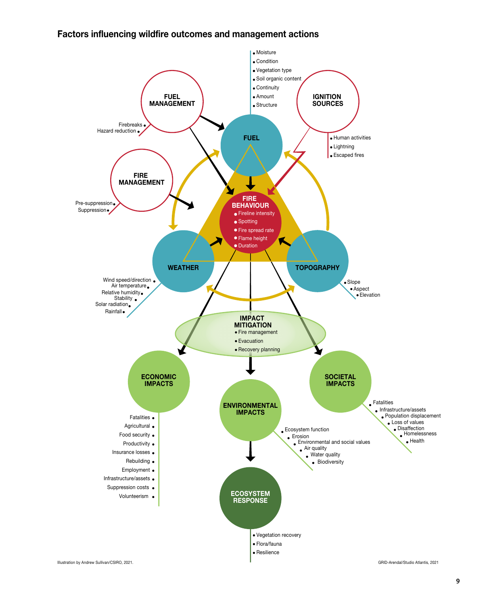{width="100%"}

::: {.caption .small}
Fuente: UNEP (2022), Fig. S1. Ilustración: Andrew Sullivan / CSIRO.
:::
:::
:::

## Cambio climático e incendios forestales {.compact}

::: columns
::: {.column width="55%"}
El cambio climático hace más frecuentes las condiciones meteorológicas que aumentan el riesgo de wildfires:

- Altas temperaturas
- Baja humedad
- Vientos altos y rayos secos

Bajo estas condiciones, iniciado un incendio es más probable que se propague, sea más intenso, y afecte un área mayor.

:::

::: {.column width="45%"}

→ Vegetación que antes no ardía (turberas, selvas tropicales) se está secando.

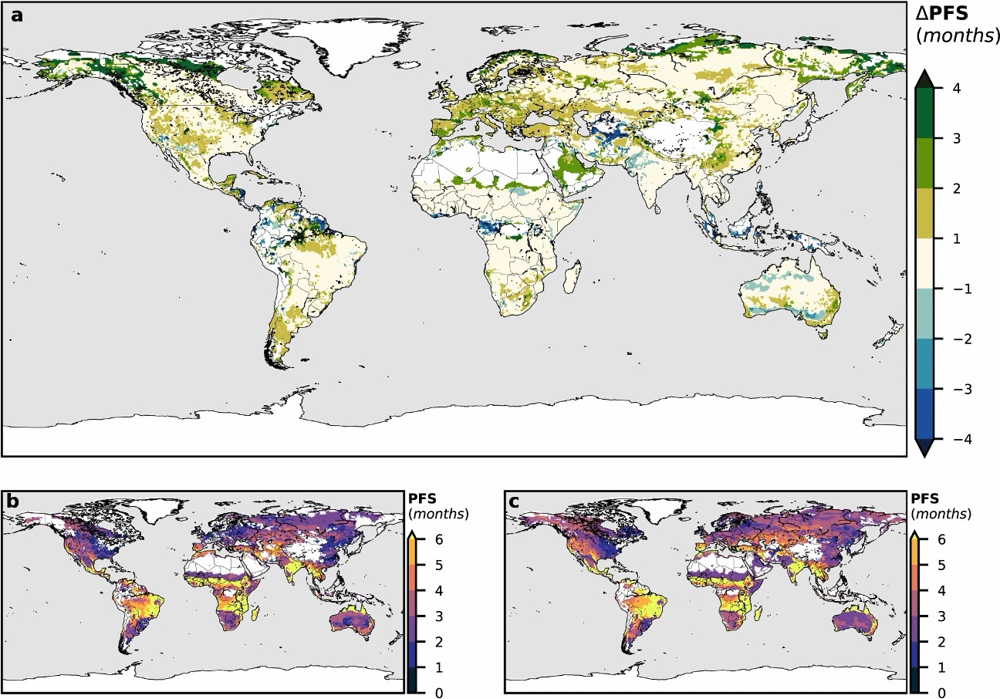{width="100%"}

::: {.caption .small}
Senande-Rivera et al. (2022), *Nat Commun* 13:1208. Las regiones con mayor incremento proyectado: oeste de Norteamérica, sur de Europa, Australia, Amazonía, Siberia y Chile.
:::
:::
:::

## Chile: seis de las siete peores temporadas en la última década {.compact}

::: columns
::: {.column width="55%"}
- 7 de las 8 temporadas de incendios más destructivas registradas en Chile ocurrieron en la última década
- 2017 (Santa Olga), 2023 (Valparaíso/Viña), 2024 (Quilpué), Penco/Lirquén (2026): cada vez son más devastadores
- El riesgo se acentúa con El Niño: más biomasa acumulada en invierno + más calor en verano

:::

::: {.column width="45%"}
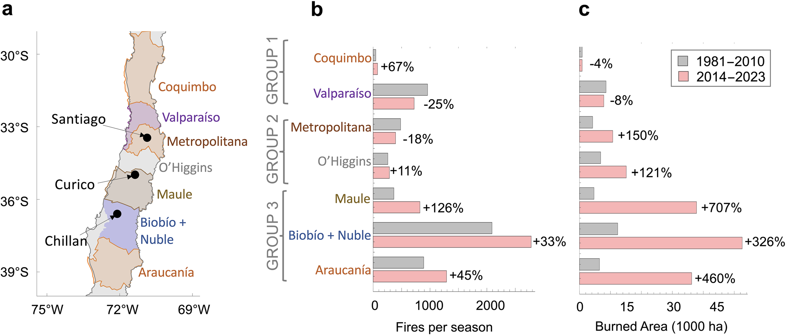{width="100%"}
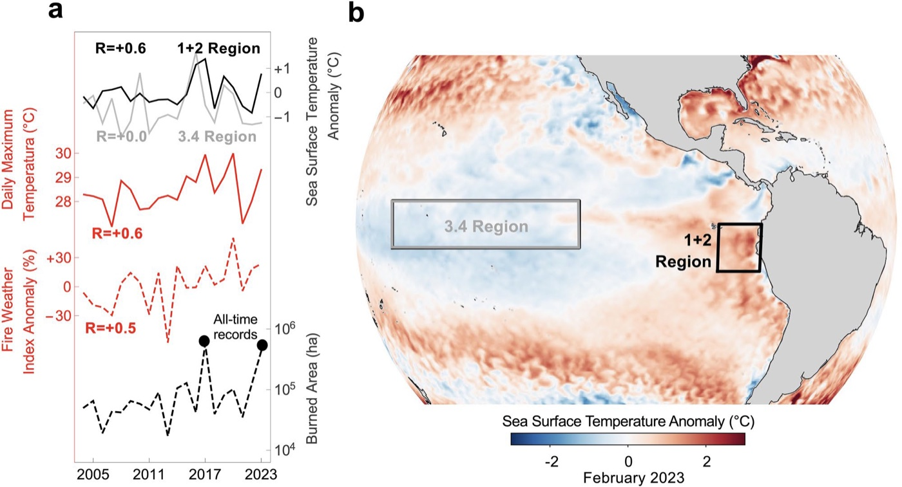{width="100%"}

::: {.caption .small}
Cordero et al. (2024), *Sci Rep* 14:1974. Extreme fire weather driven by CC + ENSO.
:::
:::
:::

## Proyecciones globales: los wildfires van a aumentar {.compact}

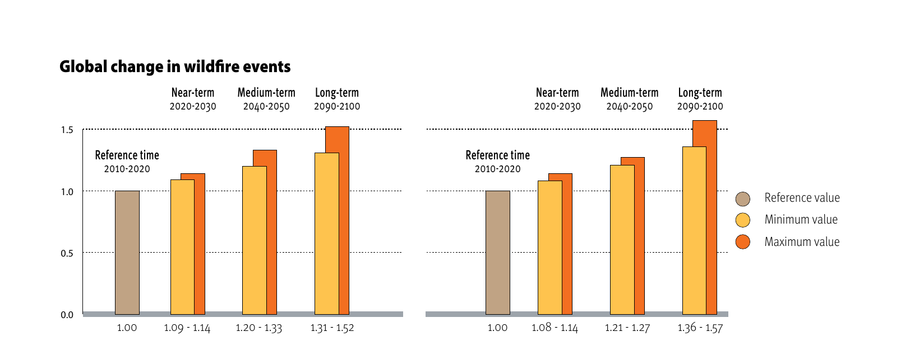{width="85%"}

::: {.caption .small}
Fuente: UNEP (2022), Fig. S2. Incluso bajo el escenario de bajas emisiones (RCP2.6), la probabilidad de wildfires catastróficos crece 1,31×–1,52× a fin de siglo. Bajo emisiones altas (RCP6.0), 1,36×–1,57×.
:::

→ No es un escenario que evitamos. Es un escenario al que nos adaptamos.

## Impactos: más allá del fuego visible {.compact}

::: columns
::: {.column width="33%"}
Sociales

- Víctimas fatales
- Desplazamiento de población
- Daños a infraestructura crítica
- Salud: humo, partículas finas, salud mental
:::

::: {.column width="33%"}
Económicos

- Pérdida agrícola y ganadera
- Costos de supresión
- Aseguramiento y reconstrucción
- Caída de productividad
:::

::: {.column width="33%"}
Ambientales

- Pérdida de biodiversidad
- Erosión y calidad de agua
- Emisiones masivas de CO₂ → loop positivo con el CC
- Ecosistemas que no se recuperan (turberas)
:::
:::

::: {.caption .small}
Fuente: UNEP (2022), Secciones 3–4.
:::

## Del manejo ancestral a la supresión — y de vuelta {.compact}

::: {.box}
Por milenios, pueblos indígenas en Norteamérica, Australia y África usaron quemas controladas para cazar, cultivar y regenerar pastizales. Frank K. Lake (Karuk, USDA Forest Service) lo describe así: *"el fuego como medicina, en la dosis justa"*.
:::

- Siglo XX: políticas coloniales de supresión total del fuego — prohibieron las quemas tradicionales en los ecosistemas que dependían de ellas
- Consecuencia involuntaria: + combustible → wildfires más grandes y severos
- Últimas décadas: agencias re-incorporan TEK (Traditional Ecological Knowledge) en alianza con comunidades — Yosemite (2005), Apostle Islands (2017), Deb Haaland en COP26 (2021)
- La Recomendación 4 de UNEP llama a institucionalizar esta integración

## Conocimiento indígena y manejo del fuego {.compact}

::: columns
::: {.column width="55%"}
Ejemplo Australia. Bliege Bird et al. (2012, *PNAS*):

- Las quemas indígenas de baja escala para caza fragmentan el paisaje
- → reducen la intensidad y el tamaño de los wildfires
- → aumentan la biodiversidad

El reporte UNEP recomienda (Rec. 4) integrar conocimiento indígena, tradicional y contemporáneo en políticas de manejo del fuego — no es folklore, es gestión adaptativa probada.
:::

::: {.column width="45%"}
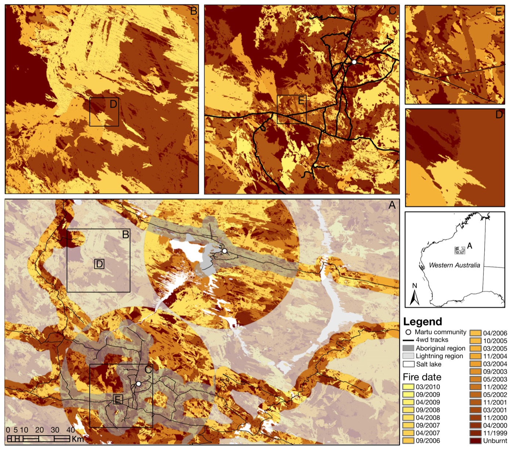{width="100%"}

::: {.caption .small}
Bliege Bird et al. (2012), *PNAS* 109(26):10287.
:::
:::
:::

## Conocimiento indígena y manejo del fuego {.compact}

::: columns
::: {.column width="55%"}
Ejemplo Australia. Bliege Bird et al. (2012, *PNAS*):

- Las quemas indígenas de baja escala para caza fragmentan el paisaje
- → reducen la intensidad y el tamaño de los wildfires
- → aumentan la biodiversidad

El reporte UNEP recomienda (Rec. 4) integrar conocimiento indígena, tradicional y contemporáneo en políticas de manejo del fuego — no es folklore, es gestión adaptativa probada.
:::

::: {.column width="45%"}
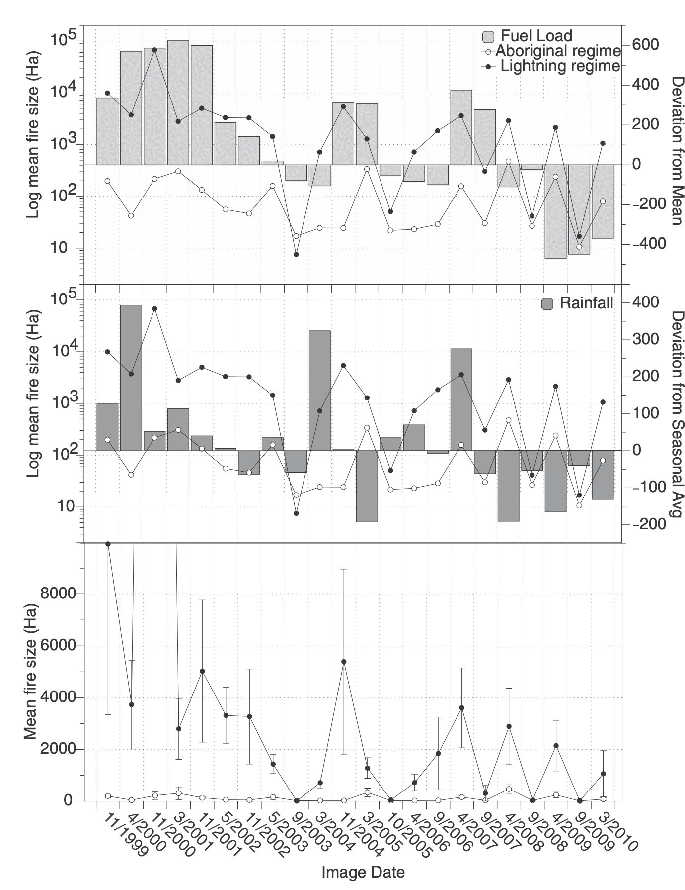{width="100%"}

::: {.caption .small}
Bliege Bird et al. (2012), *PNAS* 109(26):10287.
:::
:::
:::

## Gestión integrada del fuego — las 5R {.compact}

El reporte UNEP propone un marco de 5 fases interconectadas (los "5Rs", también conocidos como PPPRR en español):

::: {.box style="font-size:0.95em;"}
1. Revisión y análisis — *Review and analysis* — ¿qué pasó, qué aprendemos?
2. Reducción del riesgo — *Risk reduction* — combustible, ignición, planificación territorial
3. Preparación — *Readiness* — capacidades antes del fuego (entrenamiento, alertas)
4. Respuesta — *Response* — supresión durante el incendio
5. Recuperación — *Recovery* — restauración después del fuego
:::

→ Un sistema integrado balancea las cinco. Lo que vemos en la mayoría de los países es muy desbalanceado.

## El gran desbalance: gastamos en apagar, no en prevenir {.compact}

::: columns
::: {.column width="45%"}
- En EE.UU. (Thomas et al. 2015, citado por UNEP): ~58% del gasto va a Respuesta (supresión)
- Revisión y Recuperación reciben casi nada
- Y al lado, los daños directos del fuego superan todo el gasto de las 5R sumadas

→ Invertir antes (Reducción + Preparación) es más barato que pagar los daños después.
:::

::: {.column width="55%"}
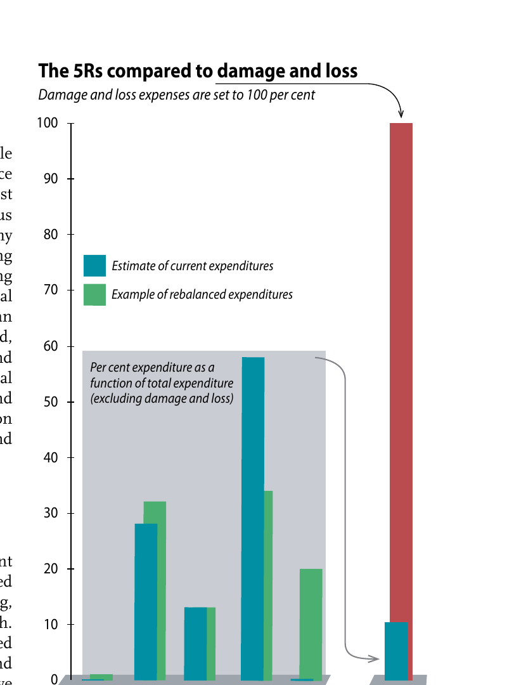{width="100%"}

::: {.caption .small}
Fuente: UNEP (2022), Fig. R2. Gasto actual (azul) vs. ejemplo de gasto rebalanceado (verde). La barra roja: costo de daños = 100%.
:::
:::
:::

## Las 9 recomendaciones del reporte UNEP {.compact}

::: {.box style="font-size:0.9em;"}
1. Reconocer y responder al impacto del cambio climático en los wildfires
2. Comprender el comportamiento del fuego y mejorar el monitoreo
3. Promover un enfoque de gestión integrada del fuego
4. Integrar conocimiento indígena, tradicional y contemporáneo
5. Cooperación internacional y regional
6. Rebalancear inversiones desde supresión hacia mitigación y preparación
7. Empoderar comunidades y autoridades locales
8. Seguridad de bomberos
9. Dimensión de género en datos y políticas
:::

::: {.caption .small}
Fuente: UNEP (2022), Recomendaciones del Rapid Response Assessment.
:::

# Detección satelital: ver el fuego desde el espacio {.section-slide background-color="#c64b3a"}

## ¿Qué información hay en una banda? {.compact}

Cada banda de una imagen satelital captura la radiación en un segmento del espectro electromagnético. Existen distintos tipos de valor:

::: {.box style="font-size:0.95em;"}
- Digital Number (DN) — el número crudo que capta el sensor. Hay que calibrarlo con la metadata
- Radiance — la energía emitida por el píxel (W·m⁻²·sr⁻¹), tras calibrar el DN
- Top-of-the-Atmosphere Reflectance (TOA) — fracción de energía reflejada desde la atmósfera superior
- Surface Reflectance — fracción de energía reflejada desde el suelo, ya corregida por atmósfera y topografía
:::

→ Para comparar imágenes entre fechas (lo que vamos a hacer con Santa Olga), necesitamos surface reflectance.

## Combinación de bandas {.compact}

::: columns
::: {.column width="45%"}
- Las bandas se pueden combinar para realzar fenómenos
- El falso color asigna bandas no visibles a los canales R-G-B de la pantalla
- Ejemplo clásico: poner NIR → Rojo, R → Verde, G → Azul → la vegetación sana se ve roja brillante
- Para fuego: combinaciones de SWIR + NIR + R revelan cicatrices y puntos calientes
:::

::: {.column width="55%"}
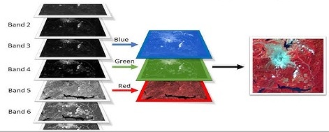{width="100%"}

::: {.caption .small}
Fuente: NASA Landsat — combinaciones de bandas comunes.
:::
:::
:::

## Índice NBR: la vegetación sana refleja distinto que la quemada {.compact}

::: columns
::: {.column width="50%"}
- La vegetación sana refleja mucho NIR (infrarrojo cercano) y absorbe SWIR (infrarrojo de onda corta)
- La zona quemada hace lo contrario: poco NIR, mucho SWIR
- → Una diferencia normalizada NIR vs. SWIR debería distinguirlas

:::

::: {.column width="50%"}

::: {.box}
$$\mathrm{NBR} = \frac{\mathrm{NIR} - \mathrm{SWIR}}{\mathrm{NIR} + \mathrm{SWIR}}$$
:::

Valores bajos = zona quemada o suelo desnudo.

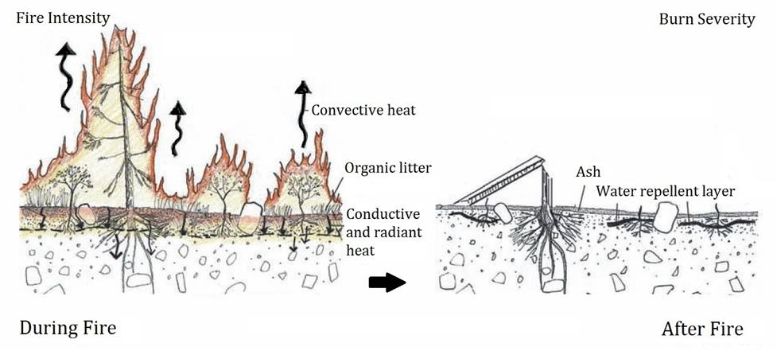{width="100%"}

::: {.caption .small}
Fuente: UN-SPIDER, *Normalized Burn Ratio*.
:::
:::
:::

## El truco del dNBR: comparar antes y después {.compact}

::: columns
::: {.column width="50%"}
El NBR por sí solo tiene un problema: un suelo desnudo y una zona recién quemada se parecen.

Solución (2 pasos):

1. Calcular NBR antes del incendio (línea base)
2. Calcular NBR después del incendio
3. Restar:

:::

::: {.column width="50%"}

::: {.box}
$$\Delta\mathrm{NBR} = \mathrm{NBR}_{\text{antes}} - \mathrm{NBR}_{\text{después}}$$
:::

Valores altos de ΔNBR = zonas que antes eran verdes y ahora están quemadas → severidad del incendio.

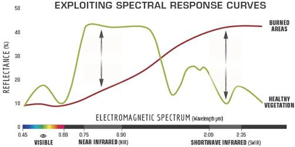{width="100%"}

::: {.caption .small}
Categorías de severidad estándar (USGS / Key & Benson 2006).
:::
:::
:::

# Caso de estudio: la tragedia de Santa Olga {.section-slide background-color="#c64b3a"}

## Santa Olga, enero de 2017 {.compact}

::: columns
::: {.column width="55%"}
- 25 de enero de 2017: la localidad de Santa Olga, comuna de Constitución (Región del Maule), fue consumida por los megaincendios de ese verano
- Casi mil viviendas destruidas
- Ocho víctimas fatales
- Cinco años después (2021), las obras de reconstrucción alcanzaban un 98% (*Emol*)
:::

::: {.column width="45%"}
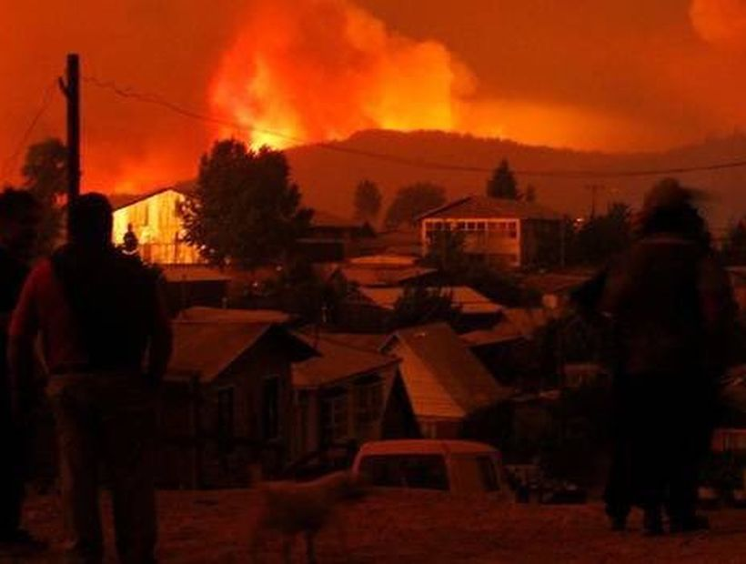{width="100%"}

::: {.caption .small}
Santa Olga, enero 2017.
:::
:::
:::

## La huella y la recuperación, vista desde Sentinel-2 {.compact}

::: columns
::: {.column width="50%"}
En la Tarea 11 van a:

1. Descargar imágenes Sentinel-2 antes y después del incendio
2. Calcular NBR y ΔNBR sobre el área de Santa Olga
3. Mapear la severidad del incendio
4. Comparar con imágenes de 2022 para visualizar la recuperación
:::

::: {.column width="50%"}
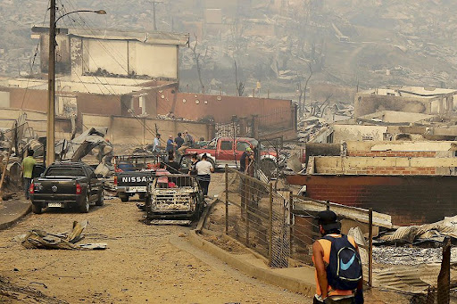{width="60%"}
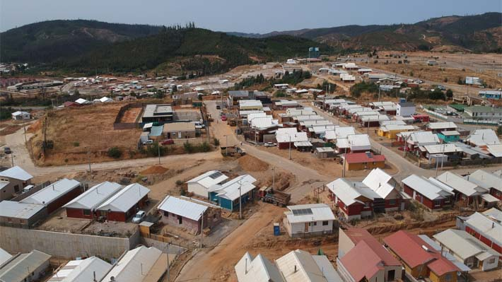{width="60%"}
:::
:::

## Síntesis del segundo bloque {.compact}

::: {.box}
1. Un wildfire es un fuego de paisaje fuera de control — distinto del fuego "bueno" que muchos ecosistemas necesitan
2. El cambio climático está aumentando la frecuencia e intensidad de los wildfires, y Chile es una de las regiones más expuestas
3. La gestión integrada se piensa en 5R (Revisión, Reducción, Preparación, Respuesta, Recuperación) — hoy gastamos casi todo en Respuesta
4. El conocimiento indígena del fuego no es folklore: es gestión adaptativa probada
5. Desde el espacio, podemos medir la severidad de un incendio con el dNBR (diferencia de NBR antes/después)
:::

→ En la Tarea 11 aplicarán lo aprendido al caso de Santa Olga.
