## Plan para hoy {.compact}

### Primer bloque

- CT: Capital natural y servicios ecosistémicos
- CT: ¿Por qué y cómo valoramos los servicios ecosistémicos?
- Actividad: ¿cuánto vale el monito del monte? (Mentimeter)

### Segundo bloque

- A+R: Plantar árboles, ¿siempre es buena idea? (lectura Gómez-González et al.)
- CT: De valorar un servicio a valorar un paisaje — el modelo InVEST
- CT: Paisajes y servicios ecosistémicos
- Cierre: La Araucanía — uso de suelo y conflicto (Tarea 12)

# Capital natural y servicios ecosistémicos {.section-slide background-color="#2a7f62"}

## Dos conceptos para empezar {.compact}

::: columns
::: {.column width="50%"}
::: {.concept-box .cb-red}
Capital natural

Los recursos naturales y las características ambientales de un territorio que tienen valor y entregan servicios a la humanidad.
:::
:::

::: {.column width="50%"}
::: {.concept-box .cb-blue}
Servicios ecosistémicos

Los beneficios que las personas obtienen de la naturaleza y que sostienen la vida humana.
:::
:::
:::

→ El capital natural es el *stock*; los servicios ecosistémicos son el *flujo* que ese stock produce.

## Stock y flujo {.compact}

::: columns
::: {.column width="55%"}
La misma lógica que el capital físico:

- El *stock* de capital natural (un bosque, un humedal, un suelo fértil) produce un *flujo* de servicios año a año
- Ese stock se puede *regenerar* (crecimiento natural, restauración)…
- …o *depreciar* (deforestación, erosión, contaminación)

→ Si extraemos más rápido de lo que se regenera, el stock cae — y con él, el flujo futuro de servicios.
:::

::: {.column width="45%"}
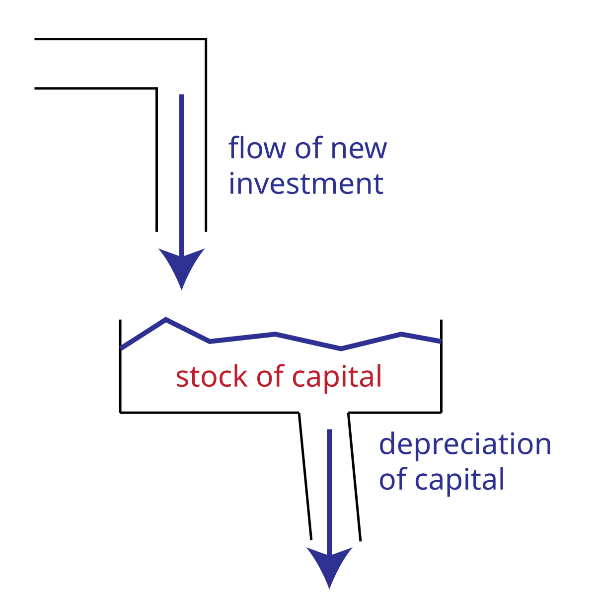{width="85%"}

::: {.caption .small}
Stock de capital, inversión y depreciación. La misma estructura aplica al capital natural.
:::
:::
:::

## Un bosque entrega muchos servicios a la vez {.compact}

::: columns
::: {.column width="24%"}
::: {.concept-box .cb-green}
Provisión

- Madera
- Productos no madereros
- Agua
:::
:::

::: {.column width="24%"}
::: {.concept-box .cb-blue}
Regulación

- Control de erosión
- Ciclo hídrico
- Clima (captura de carbono)
:::
:::

::: {.column width="24%"}
::: {.concept-box .cb-amber}
Soporte

- Hábitat y biodiversidad
- Ciclo de nutrientes
:::
:::

::: {.column width="24%"}
::: {.concept-box .cb-purple}
Cultural

- Recreación
- Valor espiritual y de identidad
:::
:::
:::

→ Un cambio de uso de suelo casi nunca afecta un solo servicio: los mueve todos.

## La tipología del valor económico {.compact}

::: columns
::: {.column width="48%"}
No todo el valor de la naturaleza pasa por un mercado:

- Valores de uso — directo (madera) e indirecto (control de erosión, captura de carbono)
- Valores de no-uso — opción (usos futuros), legado (dejarlo a las próximas generaciones), existencia (saber que existe)
:::

::: {.column width="52%"}
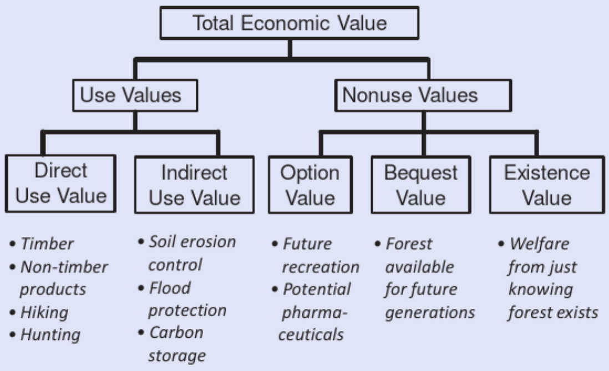{width="100%"}

::: {.caption .small}
Fuente: Harris & Roach (2017), *Environmental and Natural Resource Economics*.
:::
:::
:::

## Valor de uso directo {.compact}

::: columns
::: {.column width="55%"}
::: {.concept-box .cb-green}
El beneficio de usar o consumir *directamente* el recurso.
:::

Ejemplo: la madera que se cosecha y se vende, los hongos y hierbas que se recolectan, o una caminata por el bosque.

→ Es el valor más fácil de ver… y casi siempre el único que entra en la decisión privada.
:::

::: {.column width="45%"}
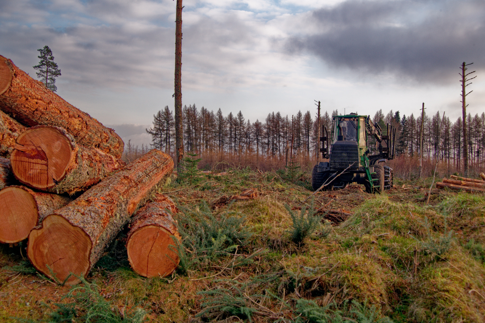{width="100%"}

::: {.caption .small}
Cosecha de madera. Foto: Julian Paren / geograph.org.uk (CC BY-SA 2.0).
:::
:::
:::

## Valor de uso indirecto {.compact}

::: columns
::: {.column width="55%"}
::: {.concept-box .cb-blue}
El beneficio de los servicios de regulación que el ecosistema presta "por detrás".
:::

Ejemplo: el bosque que controla la erosión, regula el ciclo del agua y captura carbono — sin que nadie lo cobre.

→ Nadie paga por ellos, pero si el ecosistema desaparece, reemplazarlos cuesta una fortuna.
:::

::: {.column width="45%"}
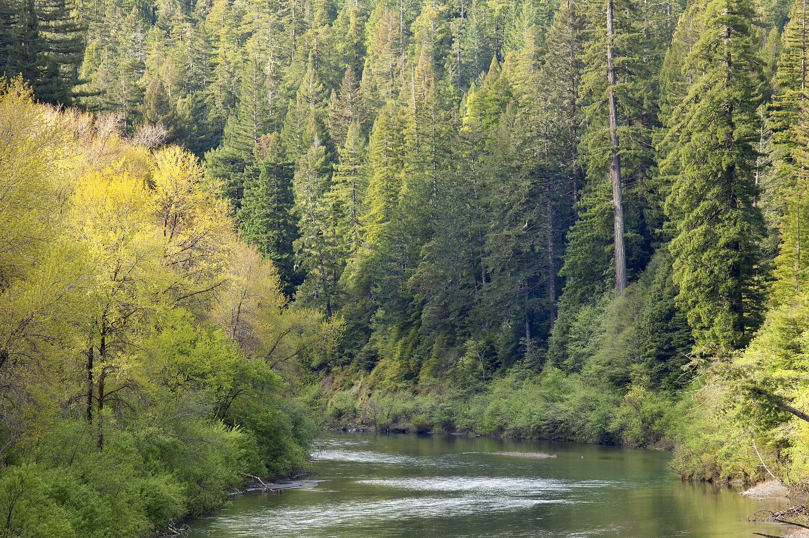{width="100%"}

::: {.caption .small}
Bosque y río Eel, California. Foto: Bureau of Land Management (CC BY 2.0).
:::
:::
:::

## Valor de opción {.compact}

::: columns
::: {.column width="55%"}
::: {.concept-box .cb-amber}
Lo que vale conservar algo hoy por sus usos *futuros*, aún desconocidos.
:::

Ejemplo: el veneno del monstruo de Gila dio origen a los fármacos GLP-1, base de medicamentos como Ozempic.

→ Si esa especie se hubiera extinguido antes de estudiarla, ese uso se perdía para siempre.
:::

::: {.column width="45%"}
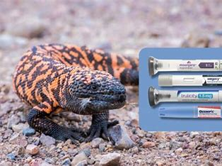{width="100%"}

::: {.caption .small}
El monstruo de Gila y los lápices de fármacos GLP-1.
:::
:::
:::

## Valor de legado {.compact}

::: columns
::: {.column width="55%"}
::: {.concept-box .cb-purple}
Lo que vale poder *heredar* el ecosistema a las próximas generaciones.
:::

Ejemplo: proteger un parque nacional para que nuestros nietos puedan conocerlo, aunque nosotros hoy no lo visitemos.

→ Mira al futuro, pero motivado por el cuidado intergeneracional, no por el uso propio.
:::

::: {.column width="45%"}
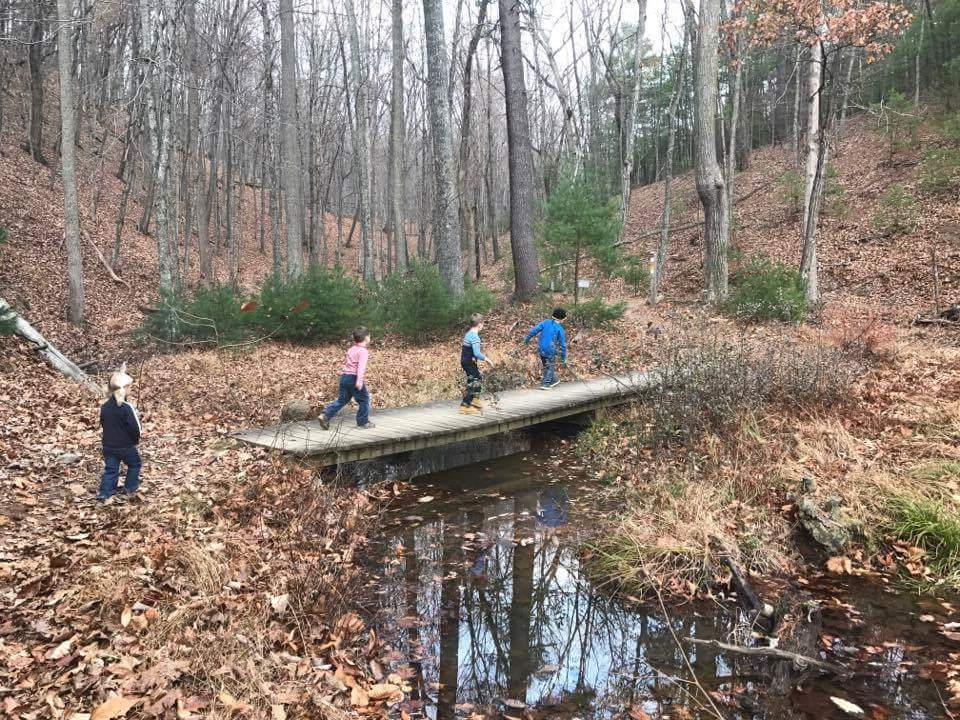{width="100%"}

::: {.caption .small}
Foto: Virginia State Parks (CC BY 2.0).
:::
:::
:::

## Valor de existencia {.compact}

::: columns
::: {.column width="45%"}
::: {.concept-box .cb-red}
Lo que vale *saber que algo existe*, aunque nunca lo usemos ni lo veamos.
:::

Puedes valorar que la naturaleza salvaje de Alaska exista —y alegrarte de que esté ahí— aun estando seguro de que nunca irás, porque queda lejísimos de Chile.
:::

::: {.column width="55%"}
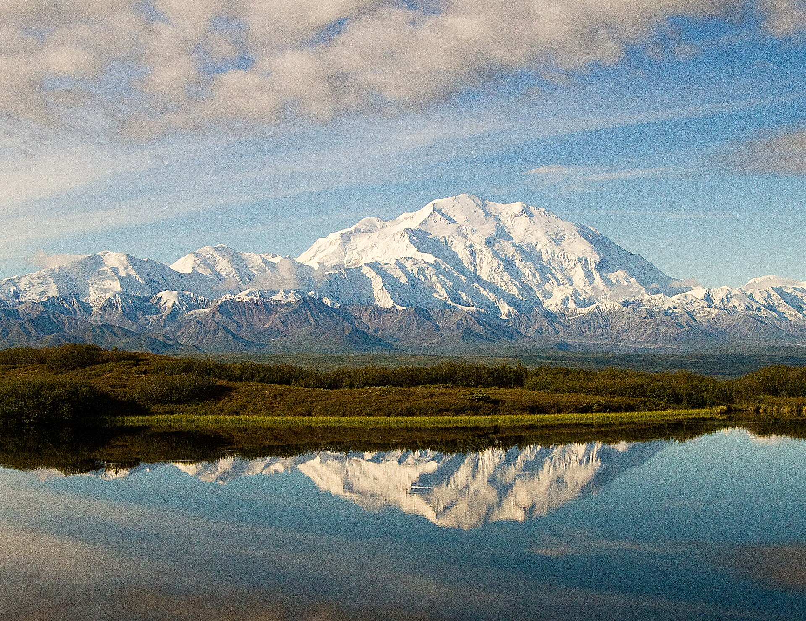{width="100%"}

::: {.caption .small}
Wonder Lake y Denali, Alaska. Foto: Denali National Park and Preserve (CC BY 2.0).
:::
:::
:::

## ¿Ponerle signo \$ a la naturaleza? Hay debate {.compact}

::: columns
::: {.column width="50%"}
::: {.concept-box .cb-green style="font-size:0.92em;"}
A favor de valorar

- Hace visible un beneficio que hoy pesa cero en la decisión
- Internaliza costos ocultos y financia conservación
- Costanza et al. (1997): ~US\$33 billones/año, ≈2× el PIB mundial
- Daily; TEEB: "lo que se mide, se gestiona"
:::
:::

::: {.column width="50%"}
::: {.concept-box .cb-red style="font-size:0.92em;"}
Críticas

- Sagoff: decidimos como *ciudadanos*, no como *consumidores*
- Monbiot: ponerle precio abre la puerta a privatizarla
- Spash: el dinero puede desplazar la motivación ética (*crowding out*)
- Hay valores inconmensurables: no caben en una cifra
:::
:::
:::

→ Valorar no es lo mismo que vender: se puede valorar sin crear un mercado.

## Decidir sobre la naturaleza es decidir en el tiempo {.compact}

- Casi toda decisión ambiental reparte sus costos y beneficios en momentos distintos: una inversión hoy, beneficios —o daños— que se acumulan durante años o décadas.
- ¿Cómo comparo un costo de hoy con un beneficio (o una pérdida) que recién ocurre en 20 años?

::: {.concept-box .cb-amber}
La herramienta es el análisis costo-beneficio. Pero antes hay que poner todos los flujos en una misma "moneda temporal": su valor de hoy.
:::

## Valor presente: traer el futuro a hoy {.compact}

- Un peso hoy vale más que un peso el próximo año: hoy puedo invertirlo y rendiría intereses.
- Por eso *descontamos* los flujos futuros a su valor de hoy, usando una tasa $r$.

::: {.concept-box .cb-blue}
Valor Presente Neto (VPN): sumar todos los beneficios y costos del proyecto, cada uno traído a hoy.

Una renta de $C$ al año, para siempre (desde el próximo año), vale hoy $C / r$.
:::

→ Si el VPN > 0 el proyecto crea valor; si VPN < 0, lo destruye.

## ¿Dónde entra la naturaleza? {.compact}

- El VPN *privado* solo cuenta los flujos que pasan por el bolsillo del dueño: lo que el proyecto vende en el mercado.
- Pero un proyecto puede destruir un flujo de servicios ecosistémicos —agua, carbono, biodiversidad— que beneficiaba a todos.
- Valorar esos servicios permite incluirlos en la cuenta:

::: {.concept-box .cb-green}
VPN social = VPN privado − valor presente de los servicios ecosistémicos perdidos.
:::

## El ejemplo: soya vs. selva {.compact}

::: columns
::: {.column width="58%"}
::: {.concept-box .cb-amber}
Un proyecto quiere deforestar 1.000 ha de selva para plantar soya:

- Inversión hoy: US\$90 millones
- Ganancia: US\$5 millones al año, para siempre (desde el próximo año)
- Servicios ecosistémicos de la selva: US\$1.000 por hectárea al año
- Tasa de descuento: 5%

¿Conviene?
:::
:::

::: {.column width="42%"}
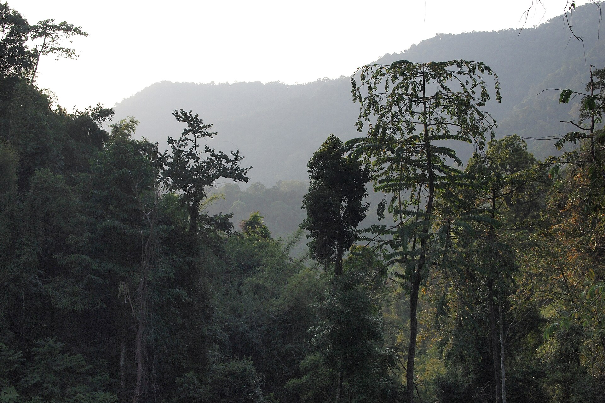{width="100%"}

::: {.caption .small}
Selva tropical primaria. Foto: Vyacheslav Argenberg (CC BY 4.0).
:::
:::
:::

## Las cuentas: el mismo proyecto, dos respuestas {.compact}

::: columns
::: {.column width="50%"}
::: {.concept-box .cb-blue}
Mirada privada — solo la soya

$$\frac{5}{0.05} - 90 = 100 - 90$$

VPN = +US\$10 millones → se hace
:::
:::

::: {.column width="50%"}
::: {.concept-box .cb-red}
Mirada social — restando los servicios perdidos

La selva daba ~US\$1 millón/año (US\$1.000/ha × 1.000 ha):

$$\frac{5-1}{0.05} - 90 = 80 - 90$$

VPN = −US\$10 millones → no conviene
:::
:::
:::

→ La única diferencia entre ganar y perder es contar —o no— el valor de la naturaleza.

# ¿Cómo valoramos los servicios ecosistémicos? {.section-slide background-color="#2a7f62"}

## Cuatro caminos (cuando no hay precio de mercado) {.compact}

Si el servicio se transa en un mercado (ej. madera), es directo: usamos el precio.

Si no, hay cuatro familias de métodos:

::: {.box}
1. Costo de reemplazo — ¿cuánto costaría reponer el servicio artificialmente?
2. Preferencias reveladas — inferir el valor a partir de decisiones reales observadas
3. Impactos sobre observables valorables — modelar el efecto del servicio sobre cosas que sí tienen precio
4. Valoración contingente — preguntar directamente (encuestas)
:::

## 1. Costo de reemplazo {.compact}

::: columns
::: {.column width="55%"}
Lo que costaría reemplazar el servicio artificialmente si lo perdiéramos.

Ej.: un bosque purifica el agua de una cuenca; su valor ≈ el costo de una planta de tratamiento equivalente.

Nueva York (años 90): cuidar la cuenca de los Catskills costó mucho menos que la planta de filtración necesaria.

→ Es una *cota inferior*: vale al menos lo que cuesta reemplazarlo.
:::

::: {.column width="45%"}
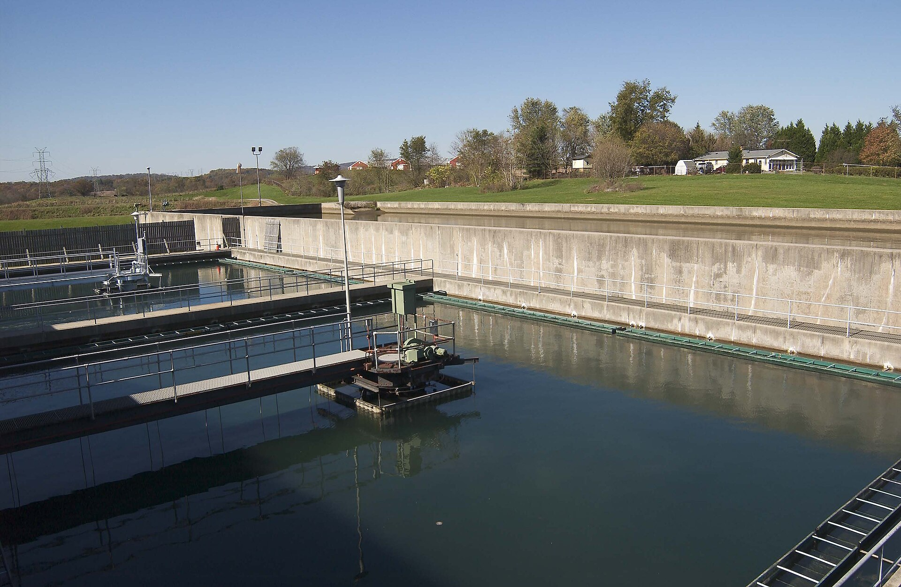{width="100%"}

::: {.caption .small}
Planta de tratamiento de agua: el costo de reemplazar lo que una cuenca hace gratis. Foto: dominio público.
:::
:::
:::

## 2. Preferencias reveladas {.compact}

::: columns
::: {.column width="55%"}
Inferimos el valor a partir de decisiones reales que la gente ya toma:

- Precios hedónicos — se paga más por vivir cerca de un parque → revela su valor
- Costo de viaje — lo que se gasta en llegar a Torres del Paine revela cuánto vale su recreación
- Costos defensivos — comprar un purificador revela el valor del aire limpio

→ Todas son *cotas inferiores*.
:::

::: {.column width="45%"}
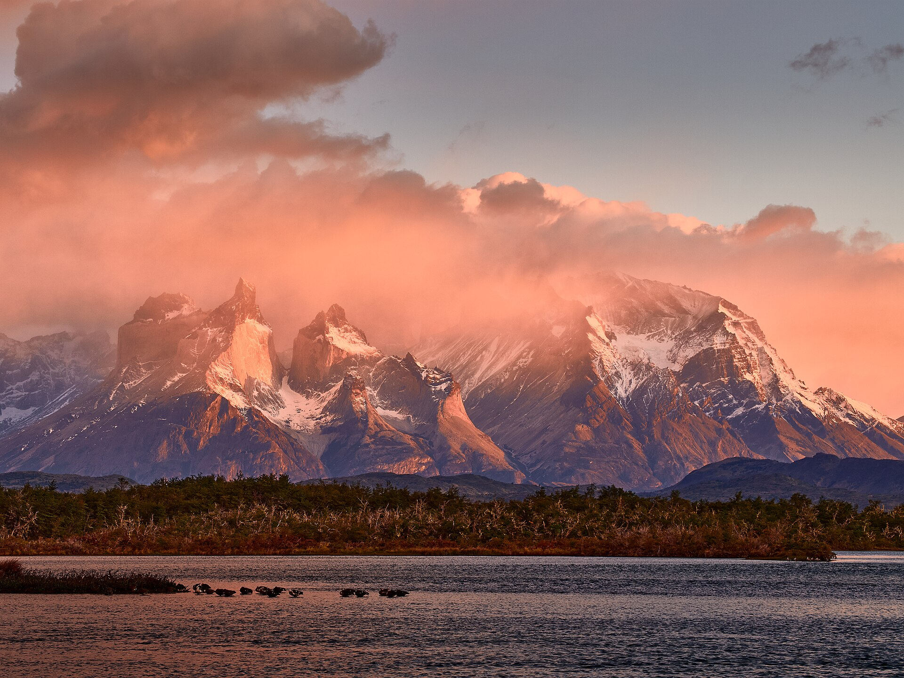{width="100%"}

::: {.caption .small}
Torres del Paine. El costo del viaje revela cuánto valoramos su recreación. Foto: Pedro Szekely (CC BY-SA 2.0).
:::
:::
:::

## 3. Impactos sobre observables valorables {.compact}

::: columns
::: {.column width="55%"}
Modelamos el efecto del servicio (o de su pérdida) sobre cosas que sí tienen precio.

Ejemplo: el costo social del carbono estima el impacto de una tonelada extra de CO₂ sobre:

- Salud (mortalidad y morbilidad)
- Producción agrícola (rendimiento de cosechas)
- Infraestructura (zonas inundables)

→ Cada daño se valora a su precio y se suman — la base de los modelos clima-economía.
:::

::: {.column width="45%"}
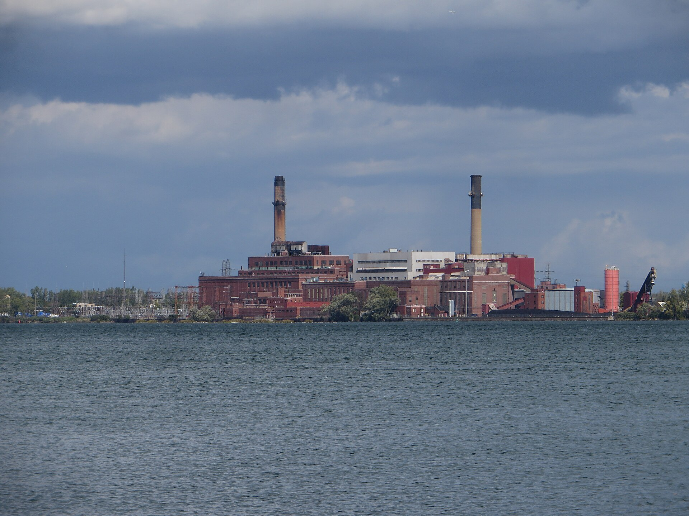{width="100%"}

::: {.caption .small}
El costo social del carbono valora los daños de cada tonelada de CO₂. Foto: Ken Lund (CC BY-SA 2.0).
:::
:::
:::

## 4. Valoración contingente {.compact}

::: columns
::: {.column width="55%"}
Los métodos anteriores parten de acciones observadas. Pero el *valor de existencia* no deja huella en ninguna decisión: hay que preguntar.

Encuestas con preguntas hipotéticas:

- Disposición a pagar (WTP): ¿cuánto es lo máximo que pagarías por conservar…?
- Disposición a aceptar (WTA): ¿cuánto te deberían pagar para aceptar perder…?
:::

::: {.column width="45%"}
{width="90%"}

::: {.caption .small}
El monito del monte, marsupial endémico y amenazado. ¿Cuánto vale que siga existiendo? Ningún mercado lo dice.
:::
:::
:::

## El monito del monte: un fósil viviente {.compact}

::: columns
::: {.column width="58%"}
- *Microbiotheria*: único sobreviviente de todo un orden de marsupiales — un "fósil viviente"
- Más emparentado con los marsupiales de Australia que con los americanos (herencia de Gondwana)
- Vive en el bosque templado del sur de Chile y Argentina; nocturno e hiberna
- Único dispersor del quintral (*Tristerix*): sin él, la planta se extinguiría
- Casi amenazado (IUCN): cae con la tala del bosque nativo
:::

::: {.column width="42%"}
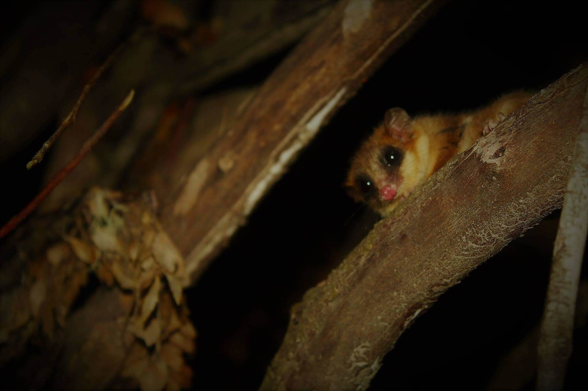{width="100%"}

::: {.caption .small}
*Dromiciops gliroides*. Foto: Nelson Atencio (CC BY 4.0).
:::
:::
:::

## Vota: ¿cuánto vale el monito del monte? {.activity-slide .compact}

::: columns
::: {.column width="58%"}
::: {.concept-box .cb-green}
Disposición a pagar (WTP)

Lo máximo que pagarías para *evitar* que su población se reduzca a la mitad.
:::

::: {.concept-box .cb-red}
Disposición a aceptar (WTA)

Lo mínimo que te deberían pagar para *aceptar* que su población se reduzca a la mitad.
:::
:::

::: {.column width="42%"}
{width="78%"}

::: {.caption .small}
Escanea el QR, o entra a menti.com con el código 3754 1862. Responde *las dos* preguntas.
:::
:::
:::

## Valoración contingente: poderosa, pero frágil {.compact}

::: columns
::: {.column width="50%"}
- En teoría WTA = WTP; en la práctica WTA es mucho mayor (efecto dotación, respuestas estratégicas)
- Muy criticada por inconsistente…
- …pero a veces es la *única* opción para capturar el valor de no-uso

→ ¿Es mejor ninguna estimación que una imperfecta?
:::

::: {.column width="50%"}
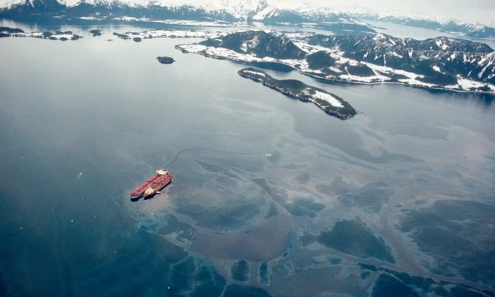{width="100%"}

::: {.caption .small}
Derrame del Exxon Valdez (1989). El panel de la NOAA concluyó que la valoración contingente puede ser un "punto de partida" válido para estimar daños ambientales, incluido el daño de no-uso.
:::
:::
:::

## Cómo hacer una buena valoración contingente {.compact}

Con el tiempo se elaboraron guías (panel de la NOAA, Arrow et al. 1993) para que la VC sea lo más confiable posible:

- Encuestar en persona, no por correo ni de pasada
- Preferir WTP sobre WTA — entrega respuestas más realistas
- Usar formato de "oferta": sugerir un precio y preguntar si lo acepta — se parece a una compra real
- Incluir preguntas de control: verificar que la persona entendió el escenario hipotético

→ Bien hecha, la VC es un "punto de partida" creíble; mal hecha, produce números fantasiosos.

# A+R: Plantar árboles, ¿siempre es buena idea? {.section-slide background-color="#2a7f62"}

## La lectura de hoy {.compact}

::: {.box}
Gómez-González et al. (2024). *Afforestation and climate mitigation: lessons from Chile.* Trends in Ecology & Evolution.
:::

Plantar árboles es la estrella de la acción climática (Bonn Challenge, "un billón de árboles"). Pero la experiencia chilena entrega una advertencia:

- Tras el Decreto Ley 701 (1974), Chile pasó de ~0,3 a ~3,1 millones de ha de plantaciones de especies exóticas (pino, eucalipto)
- Esas plantaciones reemplazaron bosque nativo, matorral y praderas en el centro-sur
- Resultado: megaincendios más severos, menor disponibilidad de agua, pérdida de biodiversidad, conflicto social — y las plantaciones funcionando como *fuente* neta de carbono, no sumidero

## El giro de la política chilena {.compact}

::: columns
::: {.column width="55%"}
- La nueva Ley Marco de Cambio Climático *excluye explícitamente* los monocultivos como herramienta de mitigación
- Es un quiebre de paradigma frente a 40 años de subsidio forestal (DL 701)
- Privilegia conservar y restaurar el bosque nativo — el verdadero sumidero de carbono del país
:::

::: {.column width="45%"}
::: {.box .small}
En 2017, megaincendios + cosecha liberaron ~123 MtCO₂-eq, superando por primera vez en 30 años el carbono capturado por los bosques nativos.

Brasil, Argentina y Uruguay siguen promoviendo plantaciones: la lección chilena los interpela.
:::
:::
:::

## Pero, ¿es la plantación en sí el problema? {.compact}

No necesariamente. El daño depende de dos cosas:

::: columns
::: {.column width="50%"}
::: {.concept-box .cb-green style="font-size:0.9em;"}
¿Qué reemplaza?

- Sustituir bosque nativo → pierde carbono y biodiversidad
- Forestar suelos erosionados o praderas degradadas puede recuperar suelo y capturar carbono
:::
:::

::: {.column width="50%"}
::: {.concept-box .cb-blue style="font-size:0.9em;"}
¿Cómo se maneja? (la escala importa)

- Monocultivo inflamable y continuo por miles de ha → megaincendios y menos agua
- Mosaicos con cortafuegos, rotaciones y franjas de nativo bajan el riesgo
:::
:::
:::

→ Bien diseñadas, dan madera y empleo, y quitan presión al bosque nativo: el reto es regular el manejo y la escala.

## El debate {.activity-slide .compact}

::: {.box}
Pregunta: ¿Hace bien Chile en excluir las plantaciones monoculturales de su política climática?
:::

En parejas de grupos, cada grupo toma un rol (10 min de preparación + 10 min de debate):

::: columns
::: {.column width="50%"}
Grupo A — Asesores del Ministerio de Medio Ambiente

Defiendan la exclusión. Usen el marco de valoración: la plantación tiene valor de uso directo (madera), pero destruye valores de uso indirecto (agua, suelo, carbono neto) y de no-uso (bosque nativo, biodiversidad).
:::

::: {.column width="50%"}
Grupo B — Gremio forestal y alcaldes de comunas forestales

Cuestionen la exclusión. Las plantaciones son ~2% del PIB, empleo y exportaciones. Argumenten que el problema es el *manejo y el diseño del paisaje*, no la plantación en sí.
:::
:::

## Puesta en común {.activity-slide .compact}

Tras el debate, discutimos juntos:

::: {.box}
1. Al reemplazar bosque nativo por plantación, ¿qué valores (de uso y de no-uso) gana y pierde el territorio?
2. Si tuvieras que *valorar* esta decisión, ¿qué servicios ecosistémicos medirías, y con qué método de los que vimos hoy?
3. ¿Cómo medirías "carbono", "agua" o "biodiversidad" sobre un territorio completo, y no solo en un punto?
:::

→ Esa última pregunta es el puente al segundo bloque.

# De valorar un servicio a valorar un paisaje: InVEST {.section-slide background-color="#2a7f62"}

## El problema de escala {.compact}

Hasta aquí valoramos servicios *de a uno* y con métodos puntuales. Pero las decisiones reales son sobre *territorios*, donde un cambio de uso de suelo mueve muchos servicios a la vez.

::: {.box}
Necesitamos una herramienta que sea geográficamente explícita: que calcule los servicios ecosistémicos *píxel a píxel* sobre un mapa, y que permita comparar escenarios (¿qué pasa si esta zona pasa de bosque a plantación?).
:::

→ Esa herramienta existe: se llama InVEST.

## ¿Qué es InVEST? {.compact}

::: columns
::: {.column width="55%"}
InVEST — *Integrated Valuation of Ecosystem Services and Tradeoffs*. Desarrollado por el Natural Capital Project (Stanford), de código abierto.

- Un conjunto de modelos que mapean y valoran los servicios ecosistémicos de un territorio
- Integra ciencia natural de frontera con marcos económicos de valoración
- Permite evaluar cómo escenarios alternativos de uso de suelo afectan el valor de los servicios
:::

::: {.column width="45%"}
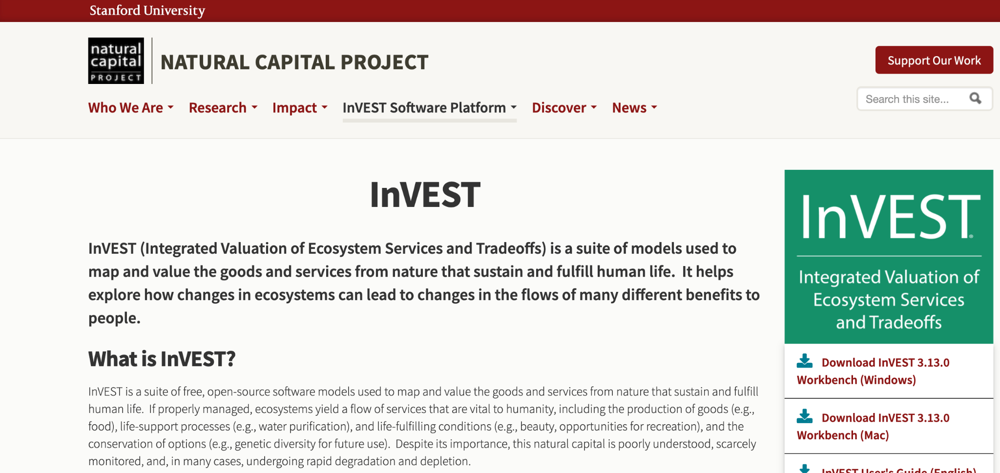{width="100%"}

::: {.caption .small}
naturalcapitalproject.stanford.edu/software/invest
:::
:::
:::

## InVEST necesita SIG: el uso de suelo es el insumo maestro {.compact}

::: {.box style="font-size:0.86em;"}
| Modelo InVEST | Servicio ecosistémico | Insumos SIG clave |
|---|---|---|
| Almacenamiento de carbono | Regulación del clima | Mapa de cobertura/uso de suelo (LULC) |
| Retención de sedimentos (SDR) | Calidad del agua / control de erosión | LULC + Modelo de Elevación (DEM) |
| Rendimiento hídrico | Provisión de agua | LULC + clima + suelos |
| Calidad de hábitat | Biodiversidad | LULC + fuentes de amenaza |
| Polinización | Provisión (cultivos) | LULC (hábitat de polinizadores) |
:::

→ Cada fila empieza con un mapa de uso de suelo. Por eso este curso parte por el SIG: sin cartografía, no hay valoración del capital natural.

## Ejemplo 1 — Carbono: el uso de suelo define cuánto carbono hay {.compact}

::: columns
::: {.column width="55%"}
El modelo de carbono de InVEST:

1. Toma un mapa de cobertura/uso de suelo (LULC)
2. Asigna a cada clase un stock de carbono en cuatro reservorios (biomasa aérea, subterránea, suelo, materia muerta)
3. Suma sobre el mapa → un mapa de carbono almacenado
:::

::: {.column width="45%"}
::: {.box .small}
- Bosque nativo: mucho carbono por hectárea, y sigue acumulando
- Plantación: bastante menos — no por ser "joven", sino porque se cosecha cada ~20 años; su carbono se contabiliza como el promedio del ciclo
- Pradera o suelo desnudo: casi nada

→ Pasar de bosque nativo a plantación *cambia el mapa de carbono*, y InVEST lo cuantifica.
:::
:::
:::

## Ejemplo 2 — Sedimentos: el suelo y la pendiente juntos {.compact}

::: columns
::: {.column width="55%"}
El modelo de retención de sedimentos (SDR) combina dos capas SIG:

- LULC — la cobertura define cuánto sedimento se *retiene* (un bosque retiene; un suelo desnudo no)
- DEM (modelo de elevación) — la pendiente define cuánto sedimento se *moviliza* hacia los ríos

→ Por sí solos, ni la cobertura ni la pendiente bastan. El servicio "agua limpia" emerge de cruzarlos en el espacio.
:::

::: {.column width="45%"}
::: {.box .small}
Recuerden la Tarea 10–11: ya saben descargar y recortar rásters de cobertura y modelos de elevación. Esos son, literalmente, los insumos que come InVEST.
:::
:::
:::

## InVEST y DICE: dos escalas de la misma idea {.compact}

::: {.box}
DICE (Nordhaus, Nobel 2018) modela *una* externalidad global — el clima — y de ahí sale el costo social del carbono.

InVEST baja a la escala del *territorio*: muchas formas de capital natural a la vez, modeladas en el espacio.
:::

→ Ambos hacen lo mismo que vimos hoy — valorar servicios ecosistémicos — pero InVEST lo hace mapa a mapa. Y para eso necesita SIG.

# Paisajes y servicios ecosistémicos {.section-slide background-color="#2a7f62"}

## El paisaje completo importa, no solo el parche {.compact}

::: columns
::: {.column width="48%"}
A medida que un paisaje se *simplifica* (intensificación agrícola, monocultivos):

- Sube el servicio de provisión (más producción)
- Bajan los de soporte, regulación y cultura (biodiversidad, control de plagas, agua, identidad)

→ La homogeneización del paisaje es, en sí misma, una pérdida de servicios ecosistémicos.
:::

::: {.column width="52%"}
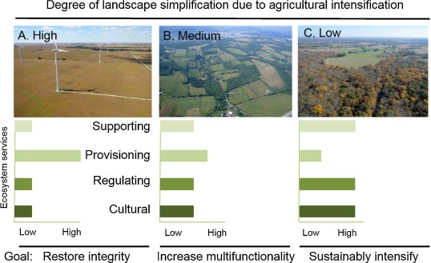{width="100%"}

::: {.caption .small}
Fuente: Landis (2017), *Basic and Applied Ecology* 18:1–12. A más simplificación, más provisión pero menos regulación, soporte y cultura.
:::
:::
:::

## Conecta con la lectura {.compact}

::: {.box}
Una plantación de pino o eucalipto es, justamente, un paisaje radicalmente simplificado: un solo tipo de árbol, una sola edad, sin sotobosque.
:::

- Alto en provisión (madera), bajo en todo lo demás
- Más combustible continuo → incendios más severos (lo vimos en la Clase 11)
- Esa es la advertencia de Gómez-González et al.: plantar árboles ≠ recuperar un ecosistema

→ ¿Dónde ocurrió esta transformación en Chile? En el corazón del territorio mapuche: La Araucanía.

# Cierre: La Araucanía — uso de suelo y conflicto {.section-slide background-color="#2a7f62"}

## Un territorio que ya conocemos {.compact}

::: columns
::: {.column width="55%"}
- Clase 09: la historia de La Frontera y los Títulos de Merced (TDM) — las reducciones donde el Estado radicó a las comunidades mapuche entre 1884 y 1929
- Clases 10–11: aprendimos a trabajar con datos ráster, teledetección e índices

Hoy juntamos las dos cosas: un *mapa de uso de suelo* sobre el territorio de los Títulos de Merced.
:::

::: {.column width="45%"}
::: {.box .small}
En La Araucanía las plantaciones pasaron de ~18.000 ha (1976) a casi 500.000 ha (2016). La pregunta es: ¿qué uso de suelo reemplazaron, y dónde?
:::
:::
:::

## La transformación, vista desde el satélite {.compact}

::: columns
::: {.column width="50%"}
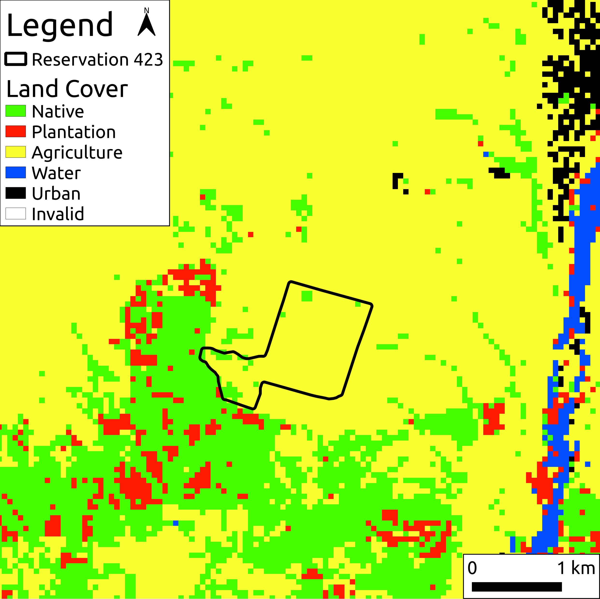{width="92%"}

::: {.caption .small}
1974 — alrededor de la reducción (línea negra): bosque nativo (verde) y agricultura (amarillo).
:::
:::

::: {.column width="50%"}
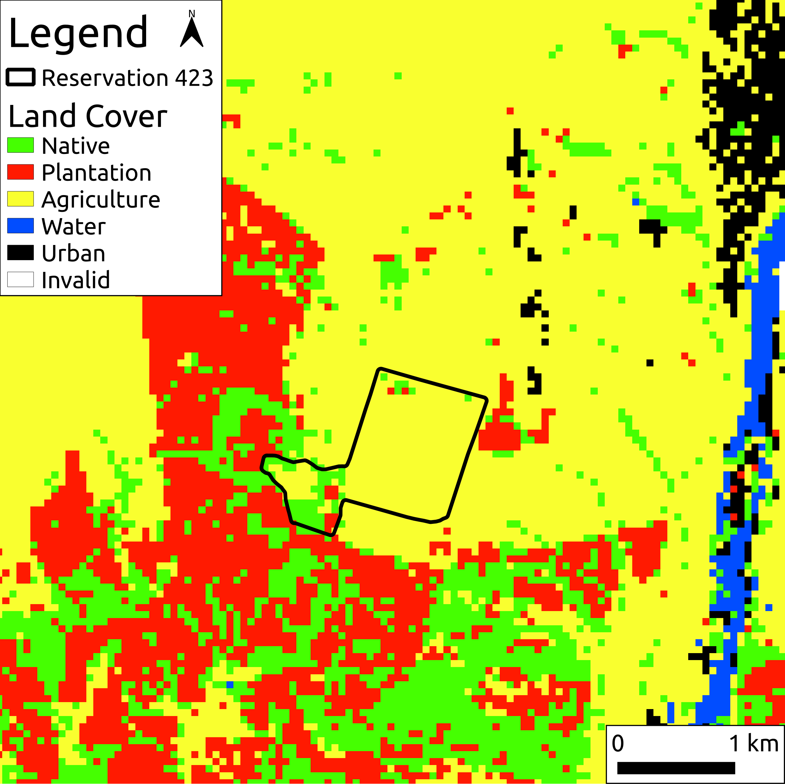{width="92%"}

::: {.caption .small}
2016 — la plantación (rojo) rodea la misma reducción.
:::
:::
:::

::: {.caption .small}
Fuente: Jordán (2021), *The rise of forest plantations in Chile's Mapuche homeland*. SSRN 3938635.
:::

## Tarea 12: los datos que vamos a cruzar {.compact}

::: {.box style="font-size:0.95em;"}
1. MapBiomas Chile — ráster de cobertura/uso de suelo, años 2000 y 2022
2. Títulos de Merced — capa vectorial (CONADI / SIIC), los límites históricos de las reducciones
3. MACEDA — datos georreferenciados del conflicto de autodeterminación mapuche (tipos de evento: ataque, coerción, invasión de tierras)
:::

→ Cobertura (ráster) + reducciones (vector) + conflicto (puntos): tres capas, un solo territorio.

## Tarea 12: lo que van a hacer {.compact}

En la guía de apoyo (en Canvas) van a:

1. Descargar y recortar el ráster MapBiomas a la Región de La Araucanía (2000 y 2022)
2. Generar las *zonas aledañas* a los Títulos de Merced (buffers de 5 km)
3. Superponer los eventos de conflicto de MACEDA (desde el año 2000)
4. Componer dos mapas: uso de suelo 2022 + áreas de influencia, y uso de suelo 2022 + tipos de conflicto
5. Comparar con el año 2000 y reflexionar

::: {.box .small}
Pregunta guía: al comparar los mapas, ¿se observa alguna correlación espacial entre la expansión forestal y los eventos de conflicto? ¿Dónde se percibe con más claridad?
:::

## Síntesis de la clase {.compact}

::: {.box}
1. El capital natural es un *stock* que produce un *flujo* de servicios ecosistémicos; valorarlos hace visible lo que el cálculo económico suele ignorar
2. Valoramos con cuatro familias de métodos: costo de reemplazo, preferencias reveladas, impactos sobre observables, y valoración contingente
3. Plantar árboles no equivale a recuperar un ecosistema: la lección chilena de los monocultivos (incendios, carbono neto, conflicto)
4. InVEST valora servicios ecosistémicos *píxel a píxel* — y por eso depende del SIG: el uso de suelo es el insumo maestro
5. En la Tarea 12 cruzamos uso de suelo, Títulos de Merced y conflicto en La Araucanía
:::
