## Objetivo

El objetivo de esta práctica es que adquieras las habilidades básicas en el manejo de QGIS para explorar y visualizar datos geoespaciales relacionados con la justicia ambiental. Trabajarás con datos reales de la Región Metropolitana de Santiago para crear un mapa temático que muestre la distribución de áreas verdes en relación al ingreso promedio por hogar de cada comuna, permitiéndote comenzar a pensar espacialmente sobre las desigualdades en el acceso a espacios naturales en la ciudad.

Un segundo objetivo, transversal a todo el curso, es que adoptes desde el inicio buenas prácticas de **reproducibilidad**: organizar tu trabajo en una estructura de carpetas estándar, no modificar los datos originales, y documentar tus pasos. Esto te permitirá retomar tu trabajo en cualquier momento, compartirlo con otras personas, y construir sobre él en las clases siguientes.

**Herramientas y conceptos por aprender:**

-   Estructura de proyecto reproducible (carpetas, rutas relativas, documentación)
-   Navegación y exploración del mapa (zoom, paneo, zoom a capa)
-   Herramienta de identificación (*Identify Features*): leer atributos directamente desde el mapa
-   Herramienta de medición: medir distancias y áreas en terreno
-   Manejo de capas vectoriales: cargar, ordenar y visualizar
-   Tabla de atributos: explorar, filtrar por valor y seleccionar objetos espaciales
-   Simbología graduada: visualizar variables numéricas continuas (ingreso por hogar)
-   Simbología categorizada: visualizar variables cualitativas (tipo de área verde)
-   Etiquetas: mostrar atributos como texto sobre el mapa
-   Exportación del mapa a imagen

------------------------------------------------------------------------

## Preparación: descarga y organización del material

### Descarga desde Canvas

**1.** Descarga el archivo `.zip` de esta tarea desde la página del curso en **Canvas**. El archivo contiene toda la carpeta de trabajo con los datos y la estructura de carpetas necesaria para el ejercicio.

**2.** Descomprime el archivo en una ubicación dedicada a este curso. Algunas opciones:

-   **Computador personal:** crea una carpeta para el curso (por ejemplo, `SUS2211/`) y descomprime allí.
-   **Computador de la sala:** descomprime en el escritorio o en Documentos, pero **antes de terminar la sesión**, copia toda la carpeta a OneDrive, un pendrive u otro servicio en la nube.

::: callout-warning
**¡Importante!** Los computadores de la sala de clases se **borran automáticamente cada semana**. Si trabajas en un computador de la universidad, guarda siempre una copia en **OneDrive** (u otro servicio en la nube) o en un pendrive antes de salir. De lo contrario, perderás todo tu avance.
:::

------------------------------------------------------------------------

### Estructura de carpetas del proyecto

Al descomprimir el archivo, encontrarás la siguiente estructura de carpetas. Esta organización es estándar para **todas las tareas del curso** y está diseñada para que tu trabajo sea reproducible y ordenado.

```{mermaid}
flowchart TD
    A["📁 clase2/"] --> B["📁 datos/"]
    A --> C["📁 documentos/"]
    A --> D["📁 proyectos/"]
    A --> E["📁 resultados/"]

    B --> F["📁 brutos/<br>🔒 datos originales<br>(no modificar)"]
    B --> G["📁 intermedios/<br>datos de geoprocesamiento"]
    B --> H["📁 procesados/<br>capas finales para mapeo"]

    E --> I["📁 mapas/<br>mapas exportados"]
    E --> J["📁 figuras/<br>gráficos y tablas"]

    style F fill:#fde8e8,stroke:#c0392b
    style G fill:#fef9e7,stroke:#f39c12
    style H fill:#eafaf1,stroke:#27ae60
    style D fill:#eaf4fb,stroke:#2980b9
    style C fill:#f4f6f7,stroke:#7f8c8d
```

::: {.callout-tip title="¿Para qué sirve cada carpeta?"}

**`datos/`** — Todo lo relacionado con los datos geoespaciales, organizado en tres subcarpetas:

-   **`brutos/`** 🔒 Aquí se guardan los datos originales tal como fueron descargados o recibidos. **Nunca se modifican ni se sobreescriben.** Esto garantiza que siempre puedas volver al punto de partida y que tu análisis sea reproducible.
-   **`intermedios/`** Si necesitas realizar operaciones de geoprocesamiento (recortes, uniones, reproyecciones, etc.), los resultados intermedios van aquí. Esta carpeta se usará más adelante en el curso a medida que avancemos hacia operaciones SIG más complejas.
-   **`procesados/`** Las capas finales listas para ser usadas en la confección del mapa van en esta carpeta.

**`documentos/`** — Documentación de respaldo del proyecto. Aquí puedes guardar cualquier archivo de referencia, y en particular se recomienda incluir un archivo de texto (por ejemplo, `bitacora.txt` o `pasos.md`) que describa paso a paso cómo transformaste los datos desde `brutos/` hasta `procesados/`. Esto es clave para la reproducibilidad.

**`proyectos/`** — Aquí se guardan los archivos de proyecto de QGIS (`.qgz`). Puedes tener uno o más proyectos dentro de una misma carpeta de tarea.

**`resultados/`** — Los productos finales de tu trabajo:

-   **`mapas/`** Los mapas exportados (imágenes, PDF, etc.).
-   **`figuras/`** Cualquier otro output como gráficos, tablas o estadísticas.

:::

------------------------------------------------------------------------

## ¡Empecemos! {.unnumbered .unlisted}

## Vista de Mapa \| Configuración inicial del proyecto

**3.** Inicia QGIS en el computador.

**4.** Crea un nuevo proyecto QGIS y guárdalo **dentro de la carpeta `proyectos/`** de tu carpeta de trabajo. Nómbralo con el nombre de la clase (por ejemplo, `clase2.qgz`).

::: callout-note
Para crear el proyecto: abre QGIS → menú **Proyecto** → **Guardar como...** → navega hasta la carpeta `proyectos/` y guarda allí el archivo `.qgz`.

QGIS guarda las rutas a los datos **de forma relativa** al archivo de proyecto. Esto significa que desde `proyectos/clase2.qgz`, tus capas quedan registradas como `../datos/brutos/...` — una ruta que funciona correctamente sin importar dónde esté guardada la carpeta `clase2/` en tu computador (Escritorio, OneDrive, pendrive, etc.).

**Importante:** no muevas el archivo `.qgz` fuera de la carpeta `proyectos/`, ya que eso rompería las rutas relativas y QGIS no podría encontrar los datos.
:::

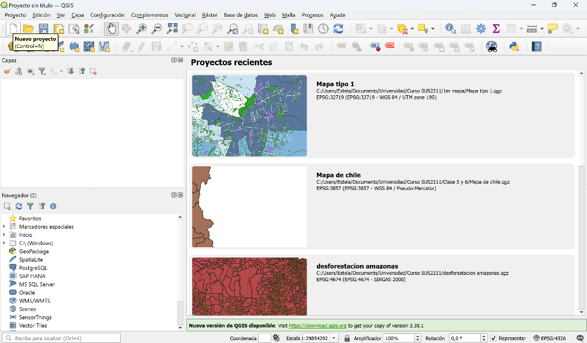{fig-align="center"}

**5.** Encuentra la conexión a la carpeta con el material necesario. Las capas con las que trabajaremos se encuentran en `datos/brutos/` dentro de la carpeta de esta clase. Conéctalas desde el Navegador de QGIS. Alternativamente, puedes arrastrar las capas que quieras importar a QGIS desde la carpeta al Canvas (si bien un shapefile consiste en varios archivos, basta con arrastrar el que tiene extención .shp).

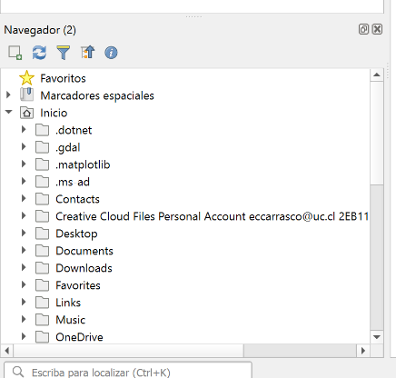{fig-align="center"}

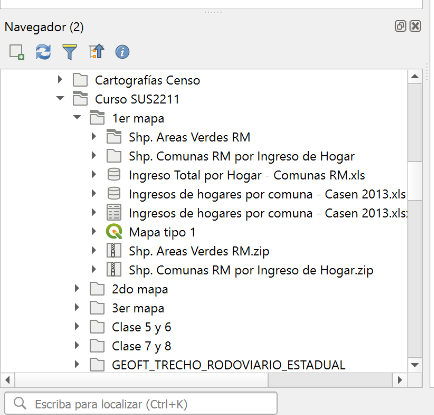{fig-align="center"}

**6.** Añade al mapa las siguientes capas, en el siguiente orden:

✓ "Comunas RM por Ingreso de Hogar"\
✓ "Áreas Verdes RM"

Estas capas se visualizarán en el Canvas con colores automáticamente elegidos por QGIS, y aparecerán listadas a la izquierda en la pestaña Capas. El orden importa: las capas que están más arriba en la lista están "por delante" de las que están más abajo en la lista. Puedes cambiar el orden haciendo click en una capa y desplazandola en la lista manteniendo el click presionado. Más adelante aprenderemos a darle transparencia a las capas para que se puedan ver simultáneamente, una herramienta útil pero que debe ser usada con moderación para no sobrecargar el mapa.

::: callout-note
**PAUSA** — hasta ahora debería visualizarse algo así:

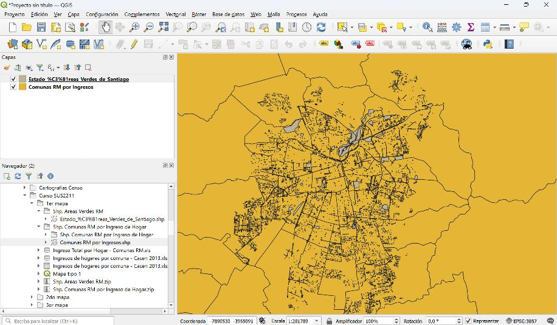{fig-align="center"}
:::

------------------------------------------------------------------------

## Vista de Mapa \| Herramientas de exploración

Antes de entrar al análisis de los datos, vale la pena explorar libremente el mapa con las herramientas básicas de navegación e inspección. Estas tres herramientas son las que más usarás en cada sesión del curso.

**7.** **Zoom y navegación.** Usa la rueda del mouse para acercarte y alejarte del mapa. Para desplazarte, mantén presionada la barra espaciadora y arrastra, o usa el botón central del mouse. Cuando te pierdas en el lienzo, hay dos formas rápidas de volver a una vista útil:

-   **Zoom a una capa específica:** haz clic derecho sobre el nombre de la capa en el Panel de Capas y selecciona *"Zoom a la capa"*. El mapa se centrará en la extensión de esa capa.
-   **Zoom a la extensión completa:** haz clic en el ícono de la lupa con flechas en la barra de herramientas principal (*"Zoom a la extensión del mapa completo"*) para ver todas las capas cargadas a la vez.

::: callout-tip
Acostúmbrate a usar *"Zoom a la capa"* cada vez que cargues una nueva capa. Es la forma más rápida de confirmar que los datos se cargaron correctamente y que están ubicados donde esperas.
:::

::: callout-tip
Al apretar cualquier herramienta en la barra principal de herramientas, puedes volver al modo de desplazamiento en Canvas aprendando la mano blanca.
:::

**8.** **Herramienta de identificación (*Identify Features*).** En la barra de herramientas principal, busca el ícono con una flecha y una letra **"i"** (*"Identificar objetos espaciales"*). Con esta herramienta activa, haz clic sobre cualquier polígono en el mapa: aparecerá un panel lateral con todos los atributos de ese objeto — su nombre, región, coordenadas, ingreso promedio, etc.

Prueba hacer clic sobre algunas comunas distintas y observa cómo cambian los valores del campo `Hoja3_Ingr`. Esta herramienta es la forma más directa de leer los datos desde el mapa, sin necesidad de abrir la tabla de atributos.

::: {.callout-tip title="¿Por qué es útil esto?"}
En análisis de justicia ambiental, a menudo empezamos desde una pregunta visual: *"¿por qué esta zona del mapa se ve diferente a esa otra?"* La herramienta de identificación te permite pasar instantáneamente de una observación espacial a los datos concretos que la explican. Es el núcleo del pensamiento espacial: cada forma en el mapa *es* un dato.
:::

**9.** **Herramienta de medición.** En la barra de herramientas principal, haz clic en el ícono de regla (*"Medir"*) o ve al menú **Ver → Herramientas de medición**. Encontrarás dos opciones que usaremos en este curso:

-   **Medir línea:** haz clic para colocar el punto de inicio, luego sigue haciendo clic para agregar segmentos; haz doble clic para terminar. QGIS mostrará la distancia total en tiempo real. Úsala para estimar, por ejemplo, qué tan lejos está un área verde del borde de una comuna.
-   **Medir área:** funciona igual, pero al cerrar el polígono QGIS calcula el área encerrada. Úsala para comparar el tamaño real de distintas áreas verdes.

::: callout-note
Verifica que la unidad de medida sea metros o kilómetros (aparece en el panel inferior de la ventana de medición). Si ves grados, significa que la capa está en un sistema de coordenadas geográfico y deberías reproyectarla — algo que veremos más adelante en el curso.
:::

::: {.callout-tip title="Ejercicio libre"}
Antes de continuar, dedica unos minutos a explorar el mapa con estas tres herramientas. Identifica una comuna de alto ingreso y una de bajo ingreso. ¿Cuánta área verde ves en cada una? ¿Qué tan grandes son esos parques? ¿A qué distancia están de los límites comunales? No hay una respuesta correcta — el objetivo es empezar a pensar espacialmente sobre la distribución de áreas verdes en Santiago.
:::

------------------------------------------------------------------------

## Vista de Mapa \| Configuración de Tabla de Atributos

**10.** A continuación, abre la tabla de atributos de "Comunas RM por ingresos" haciendo clic derecho sobre el nombre del *layer* y luego *\[Tabla de Atributos\]*. Observa toda la información disponible en los campos.

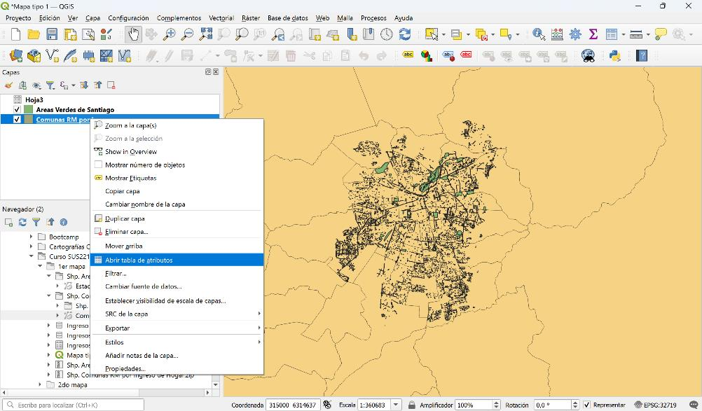{fig-align="center"}

::: {.callout-tip title="¿Qué es una tabla de atributos y para qué sirven?"}
Una tabla de atributos es un conjunto de datos tabulares que almacena la información asociada a cada entidad geográfica en una capa vectorial, como los polígonos. Para los polígonos, la tabla de atributos actúa como una hoja de cálculo en la que cada fila corresponde a un polígono individual en el mapa, y cada columna contiene un atributo específico, como el área, el perímetro, el tipo de terreno, o cualquier otra característica relevante de ese polígono.

Estas tablas son esenciales para realizar análisis geoespaciales, ya que permiten almacenar, visualizar y manipular los datos que describen las propiedades de los polígonos, facilitando tareas como la consulta de información, la clasificación y la edición de los atributos de las entidades en el mapa.
:::

Entonces, en la tabla de atributos puedes visualizar distinta información por comunas: la región, coordenadas geográficas y el promedio de ingreso por hogar (columna **Hoja3\_Ingr**).

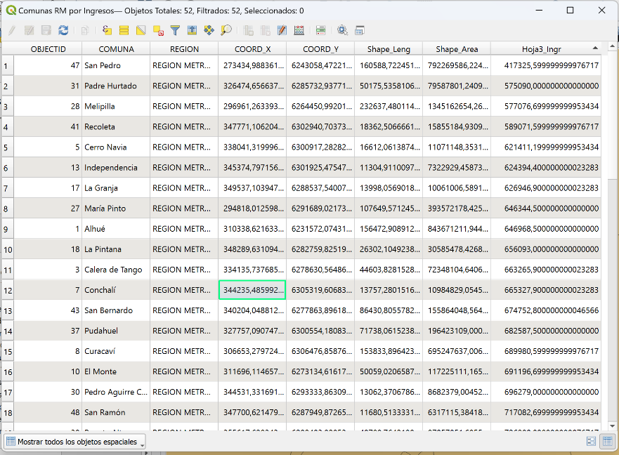{fig-align="center"}

En la esquina inferior derecha de la tabla de atributos, puedes alterar entre la visualización tabular (la ilustrada en la imagen anterior) y una visualización alternativa, que presenta las filas en una pestaña a la izquierda en una lista, y los datos de la fila seleccionada en una pestaña a la derecha.

[CHRYS: POR FAVOR TOMAR PANTALLASO DE LA VISUALIZACION ALTERNATIVA]

### ¿Por qué son importantes?

1.  **Almacenamiento de Datos**: La tabla de atributos guarda información detallada sobre cada entidad geográfica (puntos, líneas, polígonos) en una capa vectorial. En el caso de los polígonos, cada fila de la tabla representa un polígono, y cada columna un atributo o característica de ese polígono.

2.  **Interacción con el Mapa**: Los datos en la tabla de atributos están directamente vinculados con las entidades en el mapa, lo que permite seleccionar, filtrar y analizar entidades basadas en sus atributos.

3.  **Edición y Análisis**: La tabla permite modificar, añadir o eliminar datos, así como realizar cálculos y expresiones que se reflejan en la representación gráfica de los polígonos.

4.  **Personalización**: Puedes personalizar la tabla agregando nuevas columnas con atributos adicionales, calculando áreas, perímetros, o cualquier otro dato relevante para tu análisis.

5.  **Integración**: Es una herramienta clave para la integración de datos, permitiendo unir tablas externas, realizar consultas avanzadas, y enriquecer la información geográfica con datos externos.

**11.** Con la tabla de atributos abierta, puedes **buscar y filtrar filas por valor**. En la barra inferior de la tabla encontrarás un menú desplegable que por defecto dice *"Mostrar todos los objetos espaciales"*. Haz clic en él y selecciona **"Filtro de campo"**; aparecerá un selector de columna y un campo de texto. Elige la columna por la que quieres buscar (por ejemplo, `COMUNA`) e ingresa el valor a buscar (por ejemplo, `Providencia`). La tabla mostrará únicamente las filas que coincidan con ese valor.

Para una búsqueda más flexible, puedes usar el botón **"Seleccionar objetos espaciales usando una expresión"** (ícono ε en la barra de herramientas de la tabla). Esto abre el constructor de expresiones, donde puedes escribir consultas como `"COMUNA" = 'Providencia'` o `"Hoja3_Ingr" > 1000000`. Utilizaremos esta herramienta en clases futuras cuando requiramos operaciones más complejas.

**12.** Para **seleccionar un polígono desde la tabla y ubicarlo en el mapa**, haz clic en el número de fila a la izquierda de cualquier registro — la fila se resaltará en azul y el polígono correspondiente quedará seleccionado (resaltado en amarillo) en el lienzo del mapa.

Una vez seleccionada la fila, tienes dos opciones:

-   **Zoom al objeto:** haz clic en el botón **"Zoom a la selección"** en la barra de herramientas de la tabla (ícono de lupa con flecha), o bien haz clic derecho sobre la fila y selecciona *"Zoom al objeto espacial"*. El mapa se centrará y acercará automáticamente al polígono seleccionado.
-   **Destellar el objeto:** haz clic derecho sobre la fila y selecciona *"Destellar objetos espaciales"*. El polígono parpadeará brevemente en el mapa, útil para identificarlo rápidamente sin cambiar el nivel de zoom.

::: callout-note
Puedes seleccionar **múltiples filas** manteniendo presionado `Ctrl` mientras haces clic en distintos números de fila. El zoom y el destello funcionan igual para una selección múltiple.
:::

::: callout-warning
¡Recuerda guardar el trabajo que hayas realizado hasta ahora para no perder el avance!
:::

------------------------------------------------------------------------

## Vista de Mapa \| Configuración de la visualización de una variable continua

**13.** A continuación, abre las propiedades de "Comunas RM por ingresos" haciendo clic derecho sobre el nombre del *layer* y luego *\[Propiedades\]*. Observa toda la información disponible en los campos.

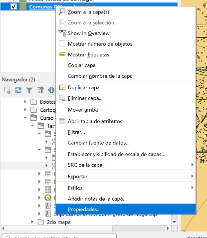{fig-align="center"}

::: {.callout-tip title="¿Qué operaciones se pueden realizar desde Propiedades?"}
La opción de "Propiedades" de una capa es una herramienta fundamental que permite configurar y personalizar cómo se visualiza y maneja una capa en el proyecto. Aquí tienes un resumen de las principales funciones que ofrece:

-   **Simbología**: Permite definir cómo se verá la capa en el mapa. Puedes elegir entre diferentes estilos, como colores sólidos, patrones, transparencias, y simbología avanzada. Es útil para distinguir visualmente diferentes categorías de datos.
-   **Etiquetas**: Configura cómo se mostrarán las etiquetas de los elementos en la capa. Puedes definir qué atributo utilizar para las etiquetas, su estilo, tamaño, posición y cómo se manejan las superposiciones.
-   **Campos**: Aquí puedes gestionar los atributos de la capa, crear nuevos campos calculados mediante expresiones, y configurar la edición de datos.
-   **Uniones**: Permite vincular la tabla de atributos de la capa con tablas externas basadas en un campo común, lo que enriquece la información disponible para cada entidad.
-   **Fuente**: Permite establecer filtros para mostrar solo las entidades que cumplen con ciertos criterios, lo que es útil para enfocarse en subconjuntos específicos de datos.
-   **Información**: Ofrece un espacio para documentar información sobre la capa, como su origen, autor y descripción.
-   **Acciones**: Permite definir acciones personalizadas que se pueden ejecutar desde el menú contextual de la capa, como abrir una URL o ejecutar un script.
:::

**14.** En la ventana de propiedades de la capa, selecciona la pestaña **"Simbología"** en el lado izquierdo.

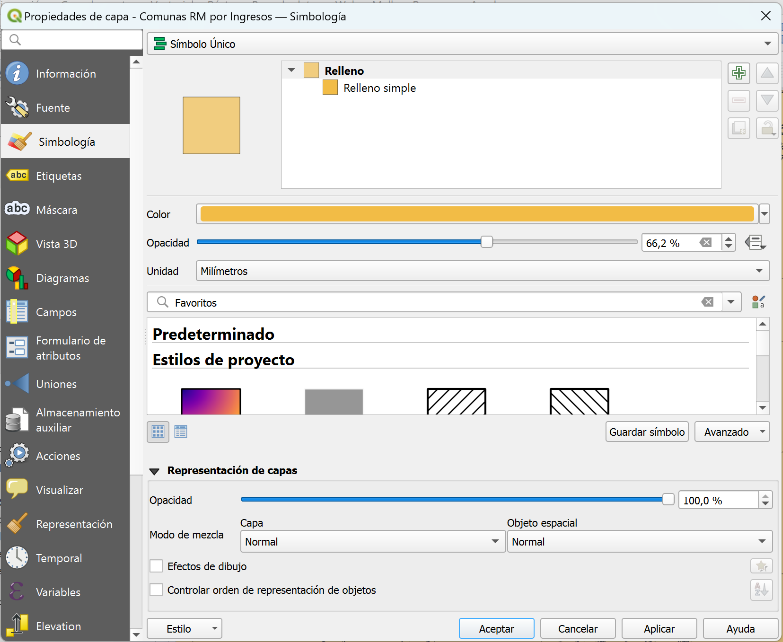{fig-align="center"}

**15.** En la parte superior de la pestaña de simbología, encontrarás un menú desplegable que probablemente esté configurado en "Simbología Simple". Cambia esta opción a **"Graduado"**.

**16.** En el campo **"Valor"**, selecciona la columna de la tabla de atributos que contiene los datos numéricos para aplicar la simbología graduada: **(Hoja3\_Ingr)**. Esta columna debe contener valores numéricos para que el método graduado funcione correctamente.

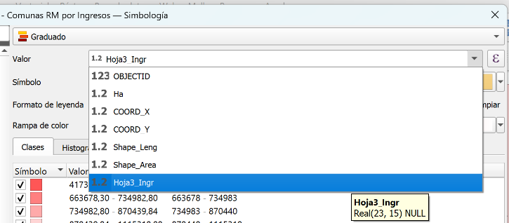{fig-align="center"}

::: callout-note
**Recordemos:** la simbología es una herramienta poderosa para controlar cómo se visualizan los datos en el mapa, permitiendo hacer análisis más comprensibles y visualmente efectivos, adaptados a las necesidades específicas de cada proyecto. Queremos visualizar los promedios de ingreso por hogar de cada comuna, para poder compararlos entre ellos y ser capaces de ver cómo se relaciona espacialmente el ingreso con el acceso de área verde.
:::

**17.** Selecciona una rampa de colores en el menú desplegable de **"Rampa de color"**. Puedes elegir entre las opciones predefinidas o crear una rampa personalizada.

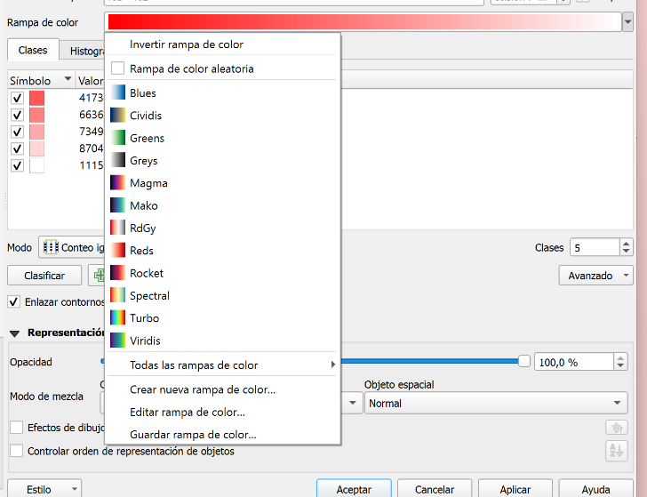{fig-align="center"}

**18.** En la sección de "Clasificación", QGIS generará automáticamente un número determinado de clases basadas en el método seleccionado. Si deseas ajustar el número de clases o los rangos manualmente, puedes hacerlo aquí. Haz clic en el botón **"Clasificar"** para que QGIS genere las clases automáticamente basadas en el método elegido.

**19.** Haz clic en **"Aplicar"** y luego en **"Aceptar"** para cerrar la ventana de propiedades. La capa en el mapa se actualizará y mostrará los polígonos coloreados según los valores de la columna seleccionada, utilizando la rampa de colores graduados. Debería visualizarse algo así:

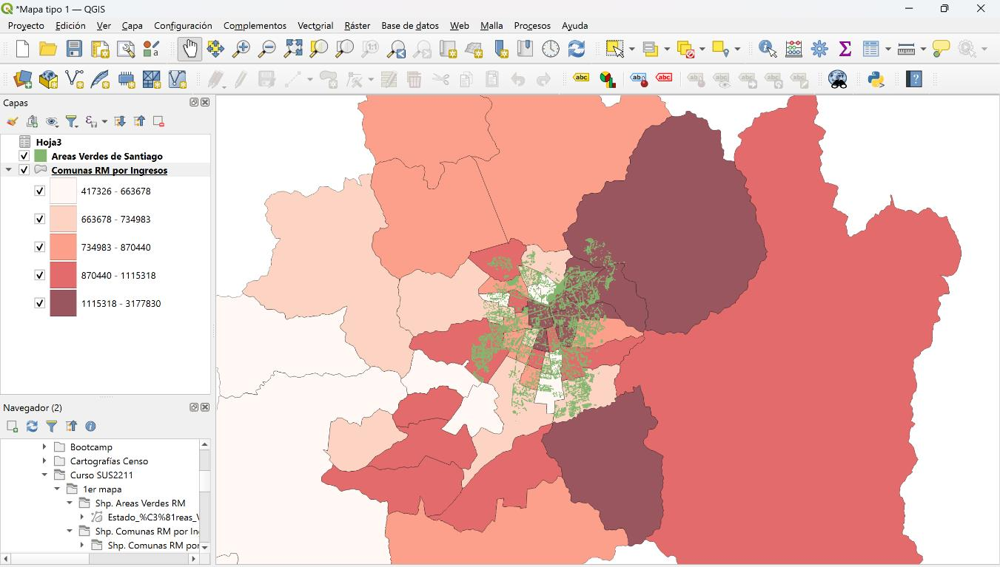{fig-align="center"}

::: callout-warning
¡Recuerda guardar el trabajo que hayas realizado hasta ahora para no perder el avance!
:::

------------------------------------------------------------------------

## Vista de Mapa \| Configuración de la visualización de una variable categórica

Ahora, se trabajará con la capa de "Áreas Verdes RM" y seguiremos ocupando la Simbología, pero como herramienta para filtrar visualmente los datos. Realizaremos el ejercicio de filtrar por un tipo de área verde, para poder así "prender y apagar" fácilmente el filtro y poder visualizar mejor las relaciones existentes entre los ingresos promedios y los tipos de áreas verdes.

**20.** A continuación, abre la tabla de atributos de "Áreas Verdes de Santiago" haciendo clic derecho sobre el nombre del *layer* y luego *\[Tabla de Atributos\]*. Observa toda la información disponible en la columna **"Tipo"**.

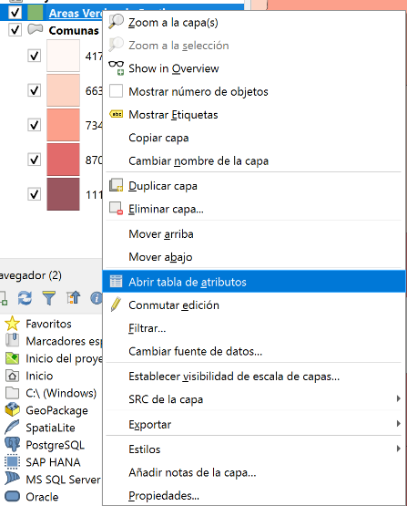{fig-align="center"}

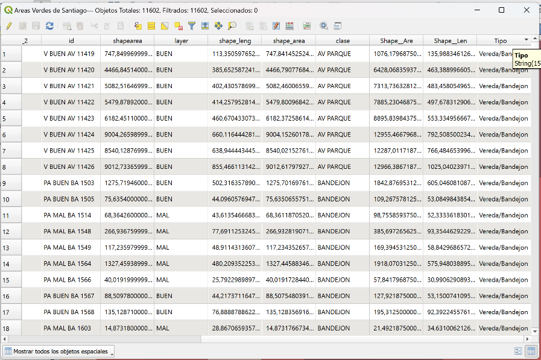{fig-align="center"}

En esta capa existen 3 clasificaciones de área verde:

✓ Vereda/Bandejón\
✓ Parque/Plaza\
✓ Campo Deportivo

::: callout-note
**OJO:** Si nos fijamos en la columna "Tipo", se darán cuenta que hay distintas tipificaciones para lo conocido como "área verde". Ahondaremos más en esto a continuación.
:::

**21.** Cierra la tabla de atributos y abre las propiedades de "Áreas Verdes de Santiago" haciendo clic derecho sobre el nombre del *layer*, luego **\[Propiedades\]**, y posteriormente la opción de **\[Simbología\]**.

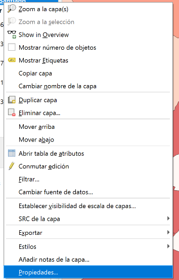{fig-align="center"}

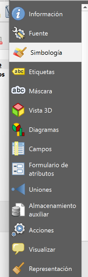{fig-align="center"}

**22.** En la parte superior de la pestaña de simbología, encontrarás un menú desplegable que probablemente esté configurado en "Simbología Simple". Cambia esta opción a **"Categorizado"**.

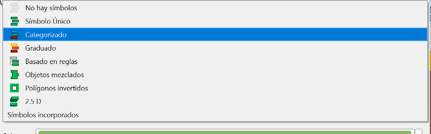{fig-align="center"}

**23.** En el campo **"Valor"**, selecciona la columna de la tabla de atributos que contiene los datos para aplicar la simbología categorizada: **(Tipo)**.

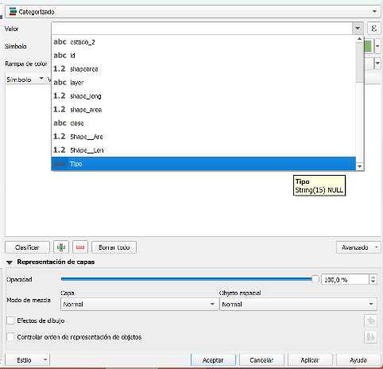{fig-align="center"}

**24.** Haz clic en **"Clasificar"**, **"Aplicar"** y luego en **"Aceptar"** para cerrar la ventana de propiedades. La capa en el mapa se actualizará y mostrará los polígonos coloreados según la selección realizada.

Debería verse algo así:

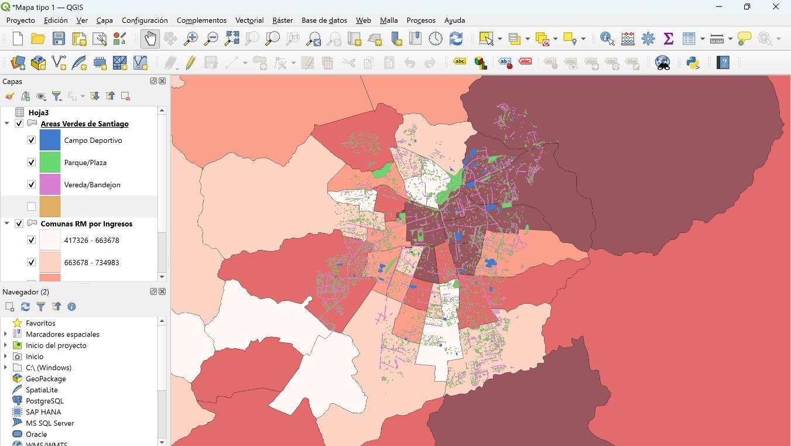{fig-align="center"}

**25.** Ahora puedes activar y desactivar estas "subcapas" para tener una visualización más detallada de las diversas áreas verdes existentes en las comunas. Por ejemplo, si queremos enfocarnos solo en el área verde "Parque/Plaza", puedes apretar la casilla a la izquierda de los otros tipos (Campo Deportivo y Vereda/Bandejon) en la pestaña capas, para así deseleccionar estos típos de áreas verdes de la visualización.

------------------------------------------------------------------------

## Vista de Mapa \| Añadir etiquetas

**26.** Para visualizar el nombre de cada comuna, activa las etiquetas de la capa "Comunas RM por ingresos" haciendo clic derecho sobre el nombre del *layer* y luego **\[Mostrar Etiquetas\]**.

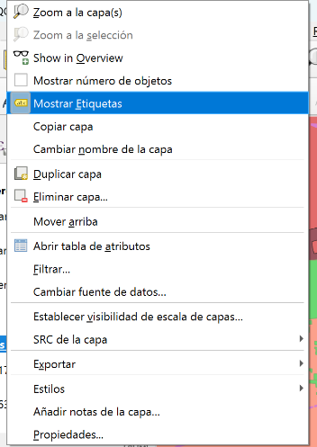{fig-align="center"}

**27.** Ahora, cambiaremos la etiqueta del "ID" al nombre de cada comuna. En el **Panel de Capas**, haz clic derecho sobre la capa y selecciona **Propiedades**.

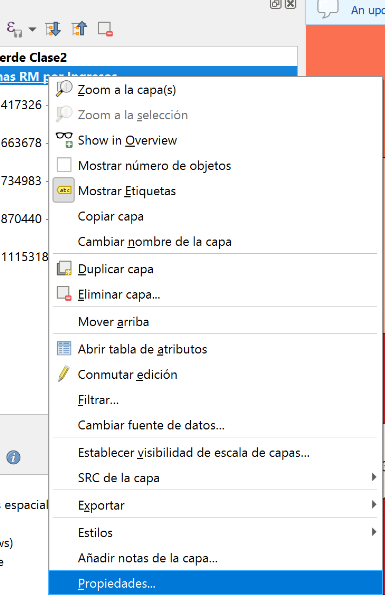{fig-align="center"}

**28.** En la ventana que se abre, ve a la pestaña **Etiquetas**. Presiona la flecha que desplegará las opciones y selecciona el campo **"COMUNA"**. Haz clic en **Aceptar** para aplicar los cambios.

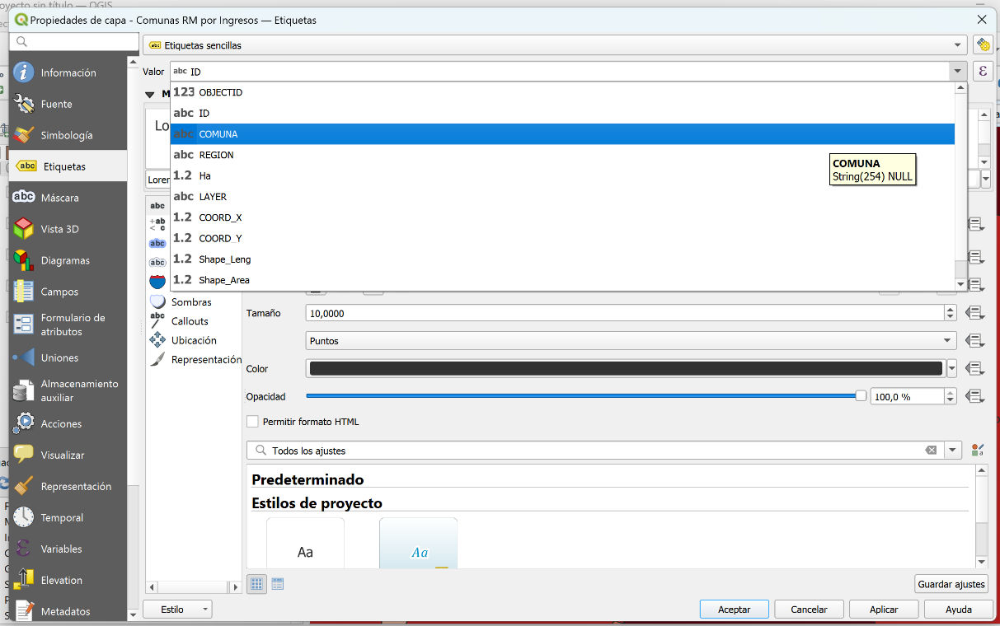{fig-align="center"}

::: callout-warning
¡Recuerda guardar el trabajo que hayas realizado hasta ahora para no perder el avance!
:::

Debería verse algo así:

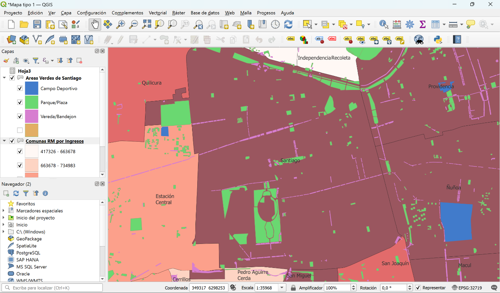{fig-align="center"}

------------------------------------------------------------------------

## Exportación del mapa

**29.** Por último, se exportará el mapa para completar la actividad. Elige una zona de la ciudad y acerca el visor al lugar escogido.

**30.** En la barra de menú superior haz clic en **"Proyecto"** → **Importar/Exportar** → **Exportar el mapa a imagen**.

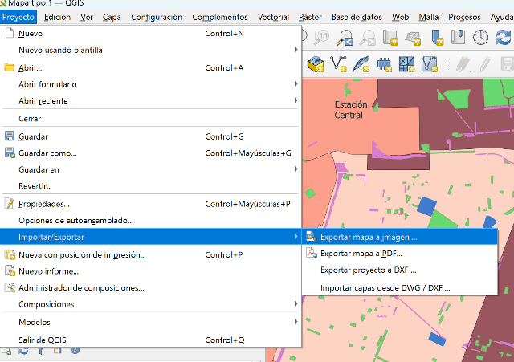{fig-align="center"}

**31.** Las extensiones se encuentran configuradas de manera automática, por lo que no es necesario cambiarlas. Presiona **"Guardar"**.

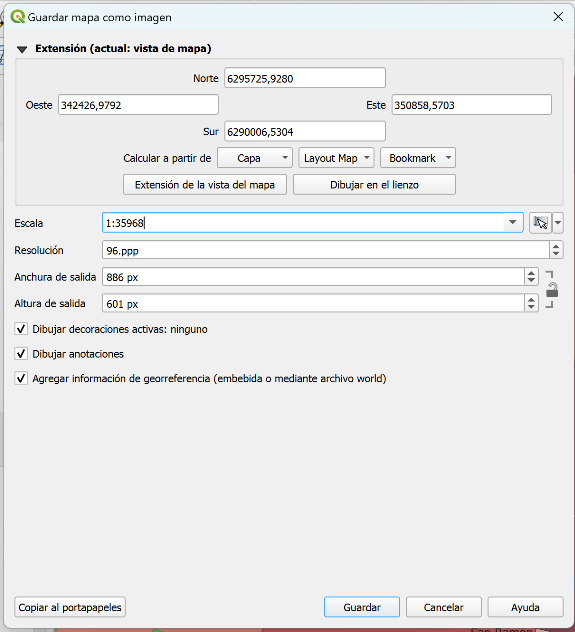{fig-align="center"}

**32.** Elige la carpeta de destino, introduce un nombre para el archivo y haz clic en **"Guardar"**. Recuerda navegar al directorio **`resultados/mapas`** de tu proyecto antes de guardar el archivo, para que se guarde en el directorio indicado.

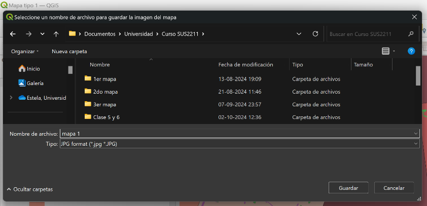{fig-align="center"}

::: callout-tip
**¡Listo!** Has finalizado tu primer mapa. Recuerda completar esta actividad y subirla a **Canvas en el Mapa-Memo correspondiente**.
:::

------------------------------------------------------------------------

## Preguntas guía para reflexión

::: {.callout-important title="Preguntas guía para reflexión"}
-   ¿Qué comunas se ven más vulnerables ante la existencia de áreas verdes en la zona?
-   ¿Qué patrones se observan entre los niveles de ingreso por hogar y la distribución de áreas verdes en las distintas comunas de Santiago?
-   ¿Cómo se podrían integrar los datos de este mapa en la formulación de políticas urbanas que promuevan el desarrollo sostenible y la equidad?
:::
