## Objetivo

El objetivo de esta práctica es que comprendas y apliques nuevas técnicas en la creación de mapas. En particular, aprenderás a aplicar la **teoría del color** para representar el Índice de Pobreza Multidimensional en las comunas de la Región de La Araucanía, y a superponer datos de puntos geoespaciales correspondientes a comunidades indígenas. Al final de la sesión, habrás producido una composición cartográfica completa —con leyenda, escala, norte y título— lista para exportar.

Un segundo objetivo, transversal a todo el curso, es que continúes fortaleciendo tus prácticas de **reproducibilidad**: organizar tu trabajo en una estructura de carpetas estándar, no modificar los datos originales, y documentar tus pasos.

**Herramientas y conceptos por aprender:**

-   Teoría del color: esquemas secuenciales, divergentes y cualitativos
-   Simbología graduada para variables normalizadas (Pobreza Multidimensional)
-   Simbología de marcadores para capas de puntos (Comunidades Indígenas)
-   Identificación de objetos espaciales (atributos de puntos)
-   Composición de impresión: mapa, leyenda, barra de escala, rosa de los vientos y título
-   Exportación del mapa a imagen (300 dpi)
-   Plataformas públicas de datos SIG para Chile

------------------------------------------------------------------------

## Preparación: descarga y organización del material

### Descarga desde Canvas

**1.** Descarga el archivo `.zip` de esta tarea desde la página del curso en **Canvas** (carpeta "Clase 3"). El archivo contiene todas las capas necesarias para el ejercicio.

**2.** Descomprime el archivo en una ubicación dedicada a este curso. Algunas opciones:

-   **Computador personal:** descomprime dentro de tu carpeta `SUS2211/`.
-   **Computador de la sala:** descomprime en el escritorio o en Documentos, pero **antes de terminar la sesión**, copia toda la carpeta a OneDrive, un pendrive u otro servicio en la nube.

::: callout-warning
**¡Importante!** Los computadores de la sala de clases se **borran automáticamente cada semana**. Si trabajas en un computador de la universidad, guarda siempre una copia en **OneDrive** (u otro servicio en la nube) o en un pendrive antes de salir. De lo contrario, perderás todo tu avance.
:::

------------------------------------------------------------------------

### Estructura de carpetas del proyecto

Al descomprimir el archivo, encontrarás la siguiente estructura de carpetas. Esta organización es la misma que usamos en la Clase 2 y será estándar para **todas las tareas del curso**.

```{mermaid}
flowchart TD
    A["📁 clase3/"] --> B["📁 datos/"]
    A --> C["📁 documentos/"]
    A --> D["📁 proyectos/"]
    A --> E["📁 resultados/"]

    B --> F["📁 brutos/<br>🔒 datos originales<br>(no modificar)"]
    B --> G["📁 intermedios/<br>datos de geoprocesamiento"]
    B --> H["📁 procesados/<br>capas finales para mapeo"]

    E --> I["📁 mapas/<br>mapas exportados"]
    E --> J["📁 figuras/<br>gráficos y tablas"]

    style F fill:#fde8e8,stroke:#c0392b
    style G fill:#fef9e7,stroke:#f39c12
    style H fill:#eafaf1,stroke:#27ae60
    style D fill:#eaf4fb,stroke:#2980b9
    style C fill:#f4f6f7,stroke:#7f8c8d
```

::: {.callout-tip title="¿Para qué sirve cada carpeta?"}

**`datos/`** — Todo lo relacionado con los datos geoespaciales, organizado en tres subcarpetas:

-   **`brutos/`** 🔒 Datos originales tal como fueron descargados. **Nunca se modifican ni se sobreescriben.**
-   **`intermedios/`** Resultados de operaciones de geoprocesamiento (recortes, uniones, reproyecciones, etc.).
-   **`procesados/`** Capas finales listas para confeccionar el mapa.

**`documentos/`** — Documentación de respaldo. Se recomienda incluir una bitácora (`bitacora.txt` o `pasos.md`) que describa cómo transformaste los datos.

**`proyectos/`** — Archivos de proyecto QGIS (`.qgz`).

**`resultados/`** — Productos finales:

-   **`mapas/`** Mapas exportados (imágenes, PDF).
-   **`figuras/`** Gráficos, tablas u otros outputs.

:::

------------------------------------------------------------------------

## ¡Empecemos! {.unnumbered .unlisted}

## Configuración inicial del proyecto

**3.** Inicia QGIS en el computador.

**4.** Crea un nuevo proyecto QGIS y guárdalo **dentro de la carpeta `proyectos/`** de tu carpeta de trabajo. Nómbralo `clase3.qgz`.

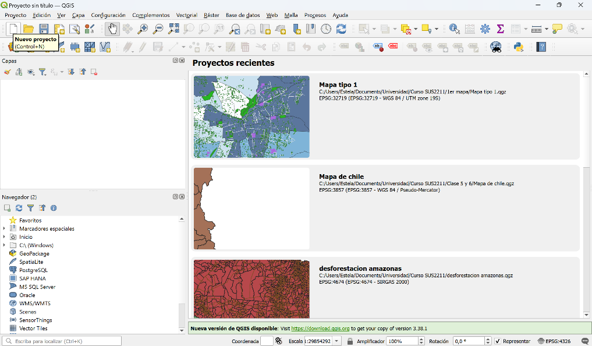{fig-align="center"}

::: callout-note
Para crear el proyecto: abre QGIS → menú **Proyecto** → **Guardar como...** → navega hasta la carpeta `proyectos/` y guarda allí el archivo `.qgz`. Recuerda que QGIS guarda las rutas a los datos de forma relativa al archivo de proyecto, por lo que no debes mover el `.qgz` fuera de esa carpeta.
:::

**5.** Descarga la capa de **Comunidades Indígenas** directamente desde la fuente oficial. Ingresa a <https://siic.conadi.cl/>, ve a la sección **"Cubiertas Descargables"** y busca la entrada **"Comunidades Indígenas (Act. Marzo 2025)"**. Haz clic en **"Ficha"** para abrir la ventana de detalle y luego haz clic en el botón **"Descargar"** junto a la opción **Shapefile**. Guarda el archivo descargado en la carpeta `datos/brutos/` de tu proyecto.

::: callout-note
**Datos de respaldo:** en caso de que la plataforma de CONADI no esté disponible, encontrarás la misma capa incluida en la carpeta `datos/brutos/` del archivo `.zip` descargado desde Canvas.

**Otras fuentes de datos SIG para Chile** que te serán útiles a lo largo del curso:

-   **IDE Chile:** <https://www.ide.cl/>
-   **IDE MINVU:** <https://ide.minvu.cl/>
-   **IDE OCUC:** <https://ideocuc-ocuc.hub.arcgis.com/>
-   **BCN (Mapas Vectoriales):** <https://www.bcn.cl/siit/mapas_vectoriales>
:::

**6.** Añade al nuevo proyecto las siguientes capas, en este orden:

✓ "Comunidades Indígenas La Araucanía"\
✓ "Comunas La Araucanía con PM"

Para añadir las capas, conéctalas desde el Navegador de QGIS navegando a la carpeta `datos/brutos/`, o arrástralas directamente al Canvas desde el explorador de archivos.

::: callout-note
**¡Detente un segundo!** Este debería ser el mapa que puedes visualizar al cargar las dos capas — comunas en color uniforme y comunidades indígenas como puntos superpuestos:

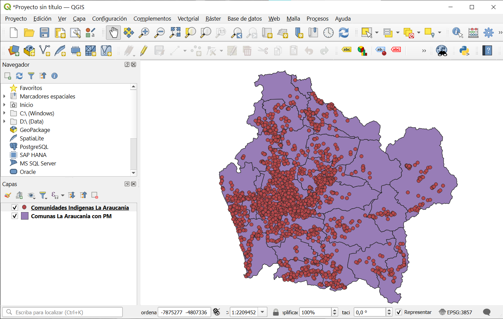{fig-align="center"}
:::

------------------------------------------------------------------------

## Simbología \| Teoría del color y variable continua

La teoría del color es fundamental para la representación espacial. Los colores no solo mejoran la comprensión visual de los datos geográficos, sino que permiten interpretar de forma más intuitiva las categorías del territorio representado. Existen tres tipos de esquemas de color:

1.  **Esquemas secuenciales** — Utilizan una graduación del color para representar variaciones continuas (por ejemplo, de claro a oscuro para representar pobreza creciente).
2.  **Esquemas divergentes** — Emplean dos colores contrastantes que se alejan desde un punto medio.
3.  **Esquemas cualitativos** — Diferencian categorías o clases sin un orden específico.

**7.** En la capa **"Comunas La Araucanía con PM"**, haz clic derecho → **Propiedades**.

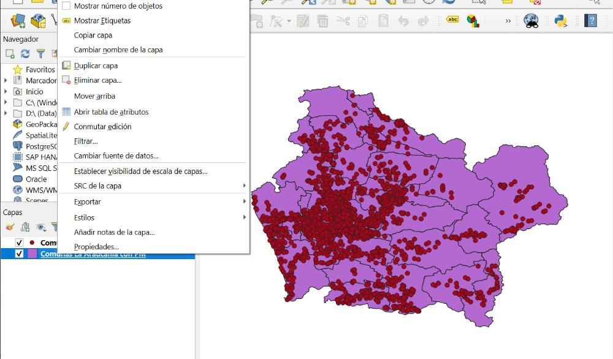{fig-align="center"}

**8.** En la ventana de propiedades, selecciona la pestaña **Simbología**. Verás que la capa viene con un "Símbolo Único" de color uniforme.

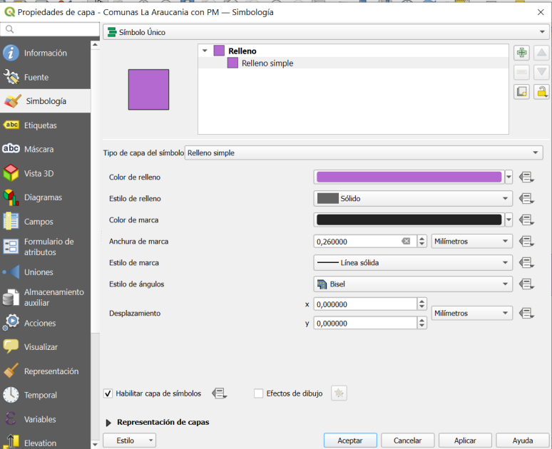{fig-align="center"}

**9.** Cambia el tipo de simbología de "Símbolo Único" a **"Graduado"**. En el campo **"Valor"**, selecciona la variable **`Pobreza_1`** (Pobreza Multidimensional normalizada).

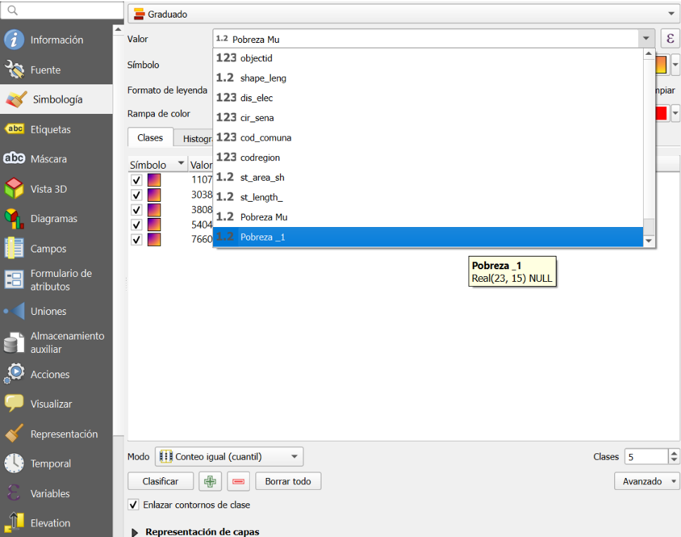{fig-align="center"}

::: {.callout-tip title="¿Por qué Pobreza_1 y no Pobreza Mu?"}
La columna `Pobreza Mu` contiene el conteo bruto de comunas con pobreza similar. En cambio, `Pobreza_1` es la versión **normalizada** del índice, lo que permite comparar comunas de distinto tamaño en una misma escala. Para el análisis espacial de esta actividad usaremos siempre la variable normalizada.
:::

**10.** Elige una **Rampa de color** en el menú desplegable. Puedes usar las opciones predefinidas de QGIS o explorar "Todas las rampas de color". No hay colores obligatorios: experimenta con rampas que transmitan bien la variación en pobreza multidimensional.

**11.** Define **5 clases** en el campo "Clases" y haz clic en **"Clasificar"** para que QGIS genere los intervalos automáticamente. Luego haz clic en **"Aplicar"** y **"Aceptar"**.

::: callout-note
Recuerda que debes hacer clic en **"Clasificar"** cada vez que cambies la rampa de colores para que los valores se redistribuyan correctamente en los intervalos.
:::

El mapa debería verse así, con las comunas coloreadas según nivel de pobreza y los puntos de comunidades superpuestos:

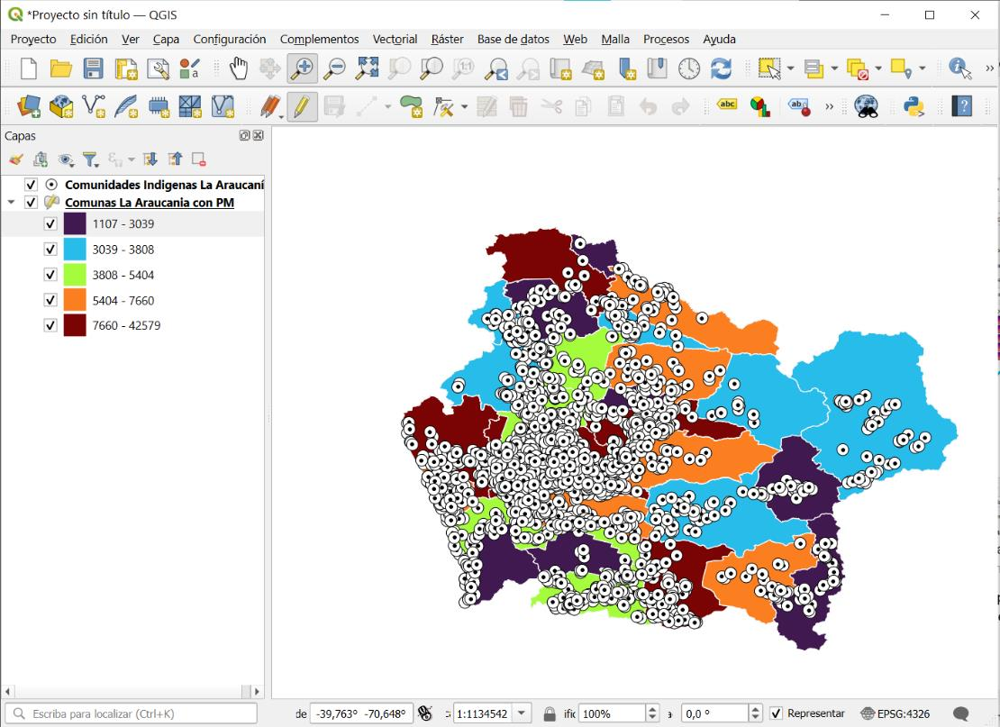{fig-align="center"}

::: callout-warning
¡Recuerda guardar el trabajo que hayas realizado hasta ahora para no perder el avance!
:::

------------------------------------------------------------------------

## Simbología \| Marcadores para datos de puntos

**12.** En la capa **"Comunidades Indígenas La Araucanía"**, abre las Propiedades → **Simbología**. Aquí podrás personalizar la forma, el tamaño y el color del marcador que representa cada comunidad.

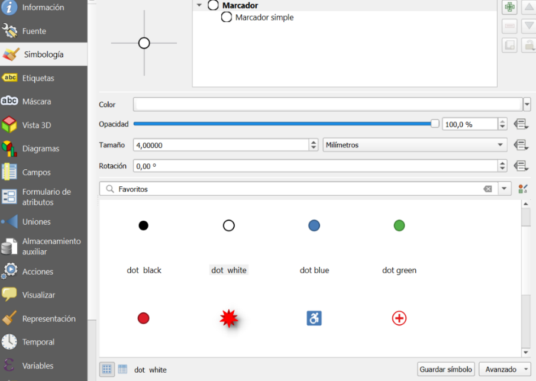{fig-align="center"}

::: {.callout-tip title="Opciones de personalización del marcador"}
Dentro de la simbología de marcadores, puedes modificar:

-   **Color** — Elige un color que contraste bien con la rampa de pobreza.
-   **Tamaño** — Ajusta para que los puntos sean legibles sin saturar el mapa.
-   **Forma** — QGIS ofrece formas predefinidas: círculo, cuadrado, triángulo, estrella, etc. Elige la que mejor represente visualmente el tipo de dato.

Los colores y formas que aparecen en los ejemplos no son obligatorios — explora las opciones y elige lo que consideres más efectivo para la comunicación cartográfica.
:::

**13.** Haz clic en **"Aplicar"** y **"Aceptar"**.

::: callout-note
Cabe destacar que cada punto posee una **ubicación geoespacial única**, además de contener información individual (nombre de la comunidad, comuna, estado, coordenadas). Esta es la naturaleza de los datos vectoriales de tipo punto: cada geometría *es* un dato.
:::

------------------------------------------------------------------------

## Inspección de puntos \| Identificar objetos espaciales

**14.** Para consultar la información de un punto sin abrir la tabla de atributos, activa la herramienta **"Identificar objetos espaciales"** (ícono con flecha y letra **"i"** en la barra de herramientas principal). Con esta herramienta activa, haz clic sobre cualquier punto en el mapa. Aparecerá un panel lateral con todos los atributos de esa comunidad.

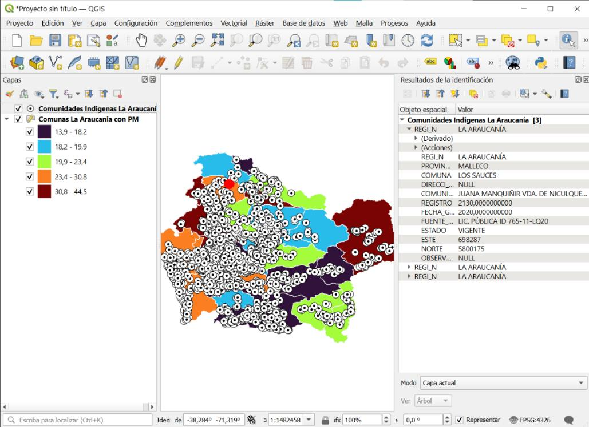{fig-align="center"}

::: {.callout-tip title="¿Por qué es útil esto?"}
En análisis de justicia ambiental y derechos territoriales, pasar de la visualización espacial a los datos concretos es fundamental. La herramienta de identificación te permite hacerlo instantáneamente: cada punto en el mapa *es* una comunidad con historia, territorio y datos asociados — como su nombre, comuna, fuente legal, estado y coordenadas.
:::

::: callout-warning
¡Recuerda guardar el trabajo que hayas realizado hasta ahora para no perder el avance!
:::

------------------------------------------------------------------------

## Composición de impresión \| Diseño final del mapa

Hasta ahora has trabajado en la Vista de Mapa de QGIS. Para producir un mapa listo para entregar o publicar, debes usar el **Compositor de Impresión**, que permite disponer el mapa, la leyenda, la escala, la rosa de los vientos y el título en una lámina de diseño.

**15.** Ve al menú **Proyecto → Nueva composición de impresión**.

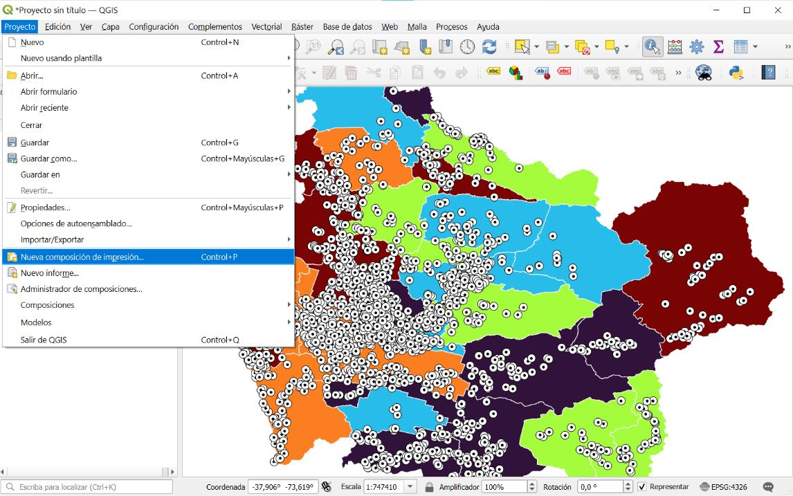{fig-align="center"}

Asigna un nombre a la composición en el diálogo que aparece (por ejemplo, `Proyecto clase 3`) y haz clic en **Aceptar**.

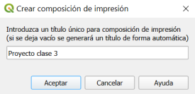{fig-align="center"}

Se abrirá el editor de composiciones con un lienzo en blanco y una barra de herramientas lateral:

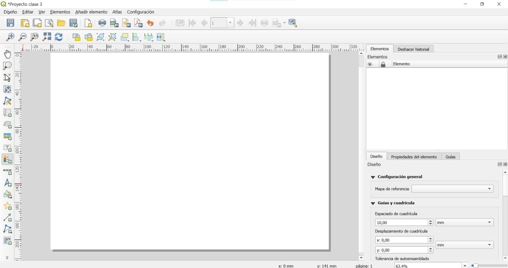{fig-align="center"}

::: {.callout-tip title="Elementos que puedes añadir"}
Desde la barra lateral y el menú **Añadir elemento** puedes insertar:

-   **Mapa** — inserta el canvas de QGIS
-   **Leyenda** — se genera automáticamente desde las capas visibles
-   **Barra de escala** — indica la escala gráfica del mapa
-   **Flecha del norte** — indica orientación geográfica
-   **Etiqueta** — para títulos y textos
:::

**16.** Selecciona **"Agregar mapa"** (ícono de rectángulo con lupa) y dibuja un rectángulo en el lienzo. QGIS insertará automáticamente la vista actual del mapa.

**17.** **Agregar la leyenda.** Selecciona **"Agregar leyenda"** y dibuja un rectángulo donde deseas que aparezca. En el panel **"Propiedades del elemento"** puedes ajustar los títulos, mostrar u ocultar capas y cambiar el orden de los elementos.

**18.** **Agregar una barra de escala.** Selecciona **"Agregar barra de escala"** y dibuja un rectángulo. En las propiedades puedes ajustar la unidad de medida y el estilo.

**19.** **Agregar una rosa de los vientos.** Selecciona **"Agregar imagen"**, dibuja un rectángulo y en **"Propiedades del elemento"** haz clic en **"..."** junto a **"Fuente de imagen"** para seleccionar una rosa de los vientos prediseñada de QGIS.

::: callout-note
Si al exportar aparece una advertencia indicando que la flecha del norte no está vinculada a un mapa, puedes vincularla desde las propiedades del elemento o simplemente hacer clic en **Aceptar** para continuar con la exportación.
:::

**20.** **Agregar un título.** Selecciona **"Agregar etiqueta"** (ícono **"T"**), dibuja un cuadro y escribe el texto del título. Ajusta el tamaño, fuente y alineación desde las propiedades.

**21.** **Ajustar el diseño final.** Mueve y redimensiona todos los elementos hasta lograr una composición equilibrada. Si necesitas cambiar la orientación o el tamaño de la página, ve a **Diseño → Configuración de página...**.

Al completar todos los elementos, la composición debería verse así:

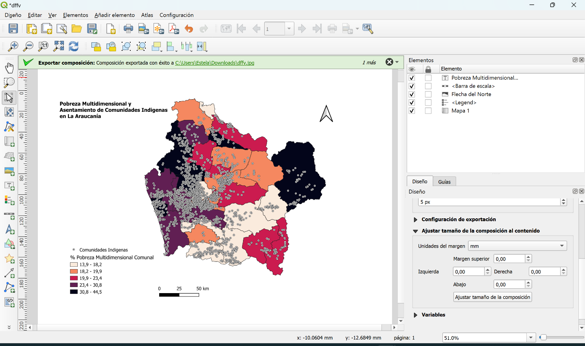{fig-align="center"}

------------------------------------------------------------------------

## Exportación del mapa

**22.** Exporta el mapa desde el menú **Diseño → Exportar como imagen** (o **Exportar como PDF**).

**23.** En el diálogo de exportación, configura la resolución a **300 dpi** para obtener una imagen de alta calidad.

::: callout-note
A mayor resolución (dpi), mayor calidad de imagen, pero también mayor tiempo de exportación y tamaño de archivo. Para entregas del curso, 300 dpi es el estándar recomendado.
:::

**24.** Guarda el archivo en la carpeta **`resultados/mapas/`** de tu proyecto.

El mapa final exportado debería verse así:

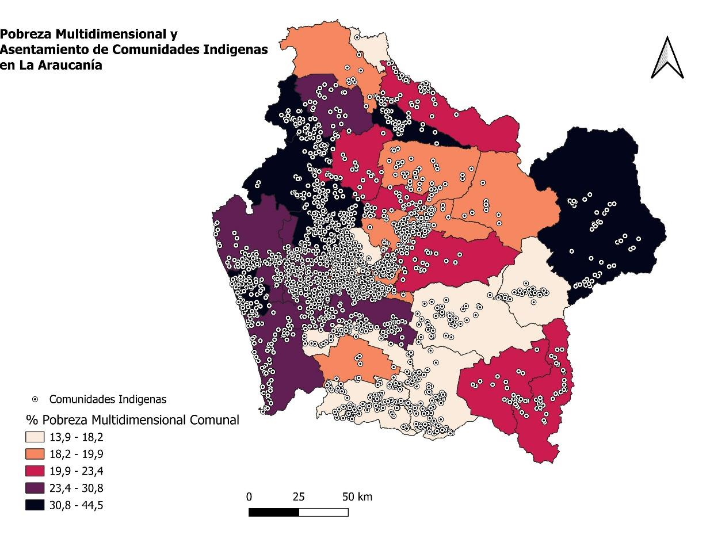{fig-align="center"}

::: callout-tip
**¡Listo!** Has finalizado tu segundo mapa. Recuerda completar esta actividad y subirla a **Canvas en el Mapa-Memo correspondiente**.
:::

------------------------------------------------------------------------

## Preguntas guía para reflexión

::: {.callout-important title="Preguntas guía para reflexión"}
-   ¿Qué patrones se pueden identificar en la distribución de la pobreza multidimensional dentro de la región? ¿Se concentra en ciertas áreas específicas?
-   ¿Existe una relación espacial entre la ubicación de las comunidades mapuches y los niveles de pobreza multidimensional en las comunas de La Araucanía? ¿Cuáles son las causas y consecuencias de esta relación?


:::
