## Objetivo

El objetivo de esta práctica es que consolides lo aprendido hasta ahora utilizando todas las herramientas que se han proporcionado. La idea es que logres crear un mapa que dé cuenta de la (In)Justicia Ambiental del Cambio Climático a escala global, produciendo tres mapas temáticos: emisiones de CO₂ per cápita acumuladas, emisiones de CO₂ per cápita actuales, y grupo de ingreso por país.

**Herramientas por trabajar:**

-   Manejo de capas
-   Tabla de atributos
-   Simbología (graduada y categorizada)
-   Composición final de impresión

**Herramientas por aprender:**

-   Sistema de Referencia de Coordenadas (CRS)
-   Filtrado y segmentación de datos geoespaciales

------------------------------------------------------------------------

## Preparación: descarga y organización del material

### Descarga desde Canvas

**1.** Descarga el archivo `.zip` de esta tarea desde la página del curso en **Canvas** (carpeta "Clase 4"). El archivo contiene todas las capas necesarias para el ejercicio.

**2.** Descomprime el archivo en una ubicación dedicada a este curso. Algunas opciones:

-   **Computador personal:** descomprime dentro de tu carpeta `SUS2211/`.
-   **Computador de la sala:** descomprime en el escritorio o en Documentos, pero **antes de terminar la sesión**, copia toda la carpeta a OneDrive, un pendrive u otro servicio en la nube.

::: callout-warning
**¡Importante!** Los computadores de la sala de clases se **borran automáticamente cada semana**. Si trabajas en un computador de la universidad, guarda siempre una copia en **OneDrive** (u otro servicio en la nube) o en un pendrive antes de salir. De lo contrario, perderás todo tu avance.
:::

------------------------------------------------------------------------

### Estructura de carpetas del proyecto

Al descomprimir el archivo, encontrarás la siguiente estructura de carpetas. Esta organización es la misma que hemos usado en las clases anteriores y será estándar para **todas las tareas del curso**.

```{mermaid}
flowchart TD
    A["📁 clase4/"] --> B["📁 datos/"]
    A --> C["📁 documentos/"]
    A --> D["📁 proyectos/"]
    A --> E["📁 resultados/"]

    B --> F["📁 brutos/<br>🔒 datos originales<br>(no modificar)"]
    B --> G["📁 intermedios/<br>datos de geoprocesamiento"]
    B --> H["📁 procesados/<br>capas finales para mapeo"]

    E --> I["📁 mapas/<br>mapas exportados"]
    E --> J["📁 figuras/<br>gráficos y tablas"]

    style F fill:#fde8e8,stroke:#c0392b
    style G fill:#fef9e7,stroke:#f39c12
    style H fill:#eafaf1,stroke:#27ae60
    style D fill:#eaf4fb,stroke:#2980b9
    style C fill:#f4f6f7,stroke:#7f8c8d
```

::: {.callout-tip title="¿Para qué sirve cada carpeta?"}

**`datos/`** — Todo lo relacionado con los datos geoespaciales, organizado en tres subcarpetas:

-   **`brutos/`** 🔒 Datos originales tal como fueron descargados. **Nunca se modifican ni se sobreescriben.**
-   **`intermedios/`** Resultados de operaciones de geoprocesamiento (recortes, uniones, reproyecciones, etc.).
-   **`procesados/`** Capas finales listas para confeccionar el mapa.

**`documentos/`** — Documentación de respaldo. Se recomienda incluir una bitácora (`bitacora.txt` o `pasos.md`) que describa cómo transformaste los datos.

**`proyectos/`** — Archivos de proyecto QGIS (`.qgz`).

**`resultados/`** — Productos finales:

-   **`mapas/`** Mapas exportados (imágenes, PDF).
-   **`figuras/`** Gráficos, tablas u otros outputs.

:::

------------------------------------------------------------------------

## ¡Empecemos! {.unnumbered .unlisted}

## Vista de Mapa | Configuración de tabla de atributos

**3.** Inicia QGIS en el computador.

**4.** Crea un proyecto nuevo a partir de un mapa (recuerda nombrarlo bajo el nombre de la clase correspondiente y guardarlo en **OneDrive** o en la carpeta `proyectos/`).

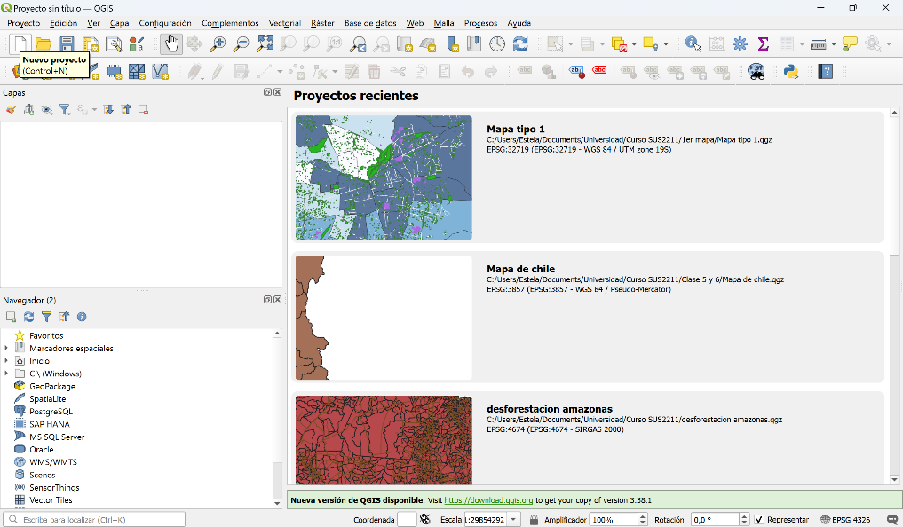{fig-align="center"}

**5.** Encuentra la conexión a la carpeta con el material necesario. Las capas con las que trabajaremos se encuentran en la carpeta en Canvas "Clase 4" en un archivo zip, por lo que previamente deberás descomprimir la carpeta. Recuerda dejar las bases de datos originales en el directirio  `datos/brutos `.


**6.1** Añade al mapa las siguientes capas:

✓ "Mapamundi climático"\
✓ "Océanos"

::: callout-note
**PAUSA** — hasta ahora debería visualizarse algo así:

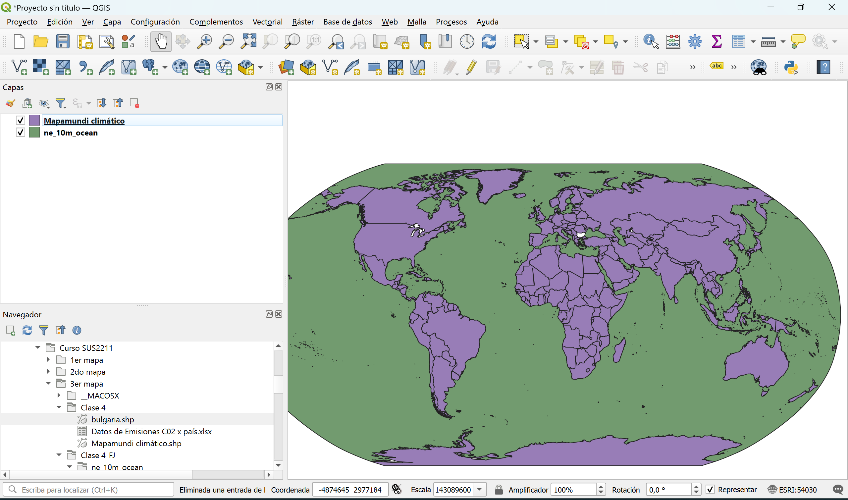{fig-align="center"}
:::

**6.2.** Como ya hemos aprendido, modifica el color de la capa de Océanos. De esta manera, tendremos una muestra más realista del planeta (colores acuosos, azulados, etc).

**7.** A continuación, abre la tabla de atributos de "Mapamundi climático", haciendo clic derecho sobre el nombre del *layer* y luego *Tabla de Atributos*, y observa toda la información disponible en los campos.

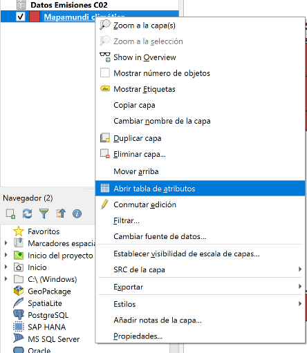{fig-align="center"}

Aquí se visualizan los datos con los que trabajaremos. Las últimas 4 columnas contienen la información clave:

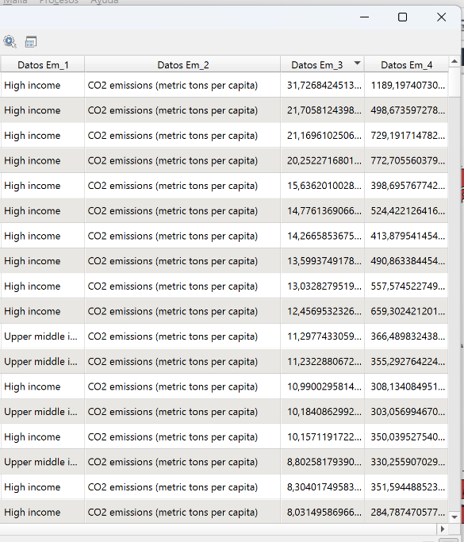{fig-align="center"}

::: {.callout-tip title="¿Qué significan las columnas?"}
-   **`Datos Em_1`** ("income group"): categorización de países según su nivel de ingreso económico, realizada por organismos como el Banco Mundial. Divide a los países según su Renta Nacional Bruta (RNB) per cápita.
-   **`Datos Em_2`**: tipo de emisión — en este caso, "CO₂ emissions (metric tons per capita)".
-   **`Datos Em_3`**: cantidad de CO₂ emitido por persona en promedio en un país **durante el año 2020**.
-   **`Datos Em_4`**: cantidad de CO₂ emitido por persona en promedio en un país **acumulado desde 1990 hasta 2020**.
:::

::: {.callout-note title="¿Qué nos está diciendo esto?"}
Con esta información podremos analizar la diferencia entre las emisiones de CO₂ en el año 2020 y el total acumulado desde 1990, donde el total acumulado se relaciona más cercanamente con el concepto de *responsabilidad climática* visto en clases. Al cruzar los datos de emisiones con el ingreso económico de cada país, podemos explorar la relación entre desarrollo económico y emisiones de carbono — permitiéndonos identificar patrones de justicia climática y analizar cómo las responsabilidades y los ingresos se asocian a escala global.
:::

------------------------------------------------------------------------

## Vista de Mapa | Configuración del Sistema de Referencia de Coordenadas (CRS)

::: {.callout-tip title="¿Qué es un Sistema de Referencia de Coordenadas (CRS)?"}
Es un sistema que define cómo se proyectan y representan las coordenadas geográficas de los datos espaciales en un mapa. Un CRS especifica la forma de la Tierra (generalmente un esferoide), el origen y la unidad de medida para las coordenadas (como latitud y longitud), y la proyección utilizada para transformar las coordenadas tridimensionales en un plano bidimensional. Esto es crucial para garantizar que los datos geoespaciales de diferentes fuentes se alineen correctamente en un mapa y se representen de manera precisa y coherente en la pantalla o en impresiones.
:::

**8.** Ve al menú **Proyecto** y selecciona **Propiedades**. En la ventana que se abre, selecciona la pestaña **"SRS"**.

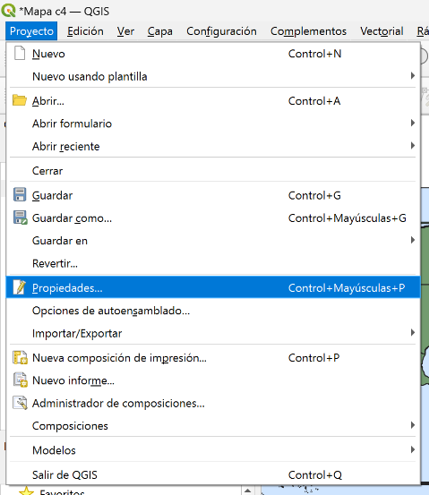{fig-align="center"}

**9.** En la pestaña SRS, utiliza la barra de búsqueda para escribir "Robinson". Busca en el seleccionador **"World_Robinson"** de la lista que aparece. Haz clic en **Aplicar** y luego en **Aceptar**.

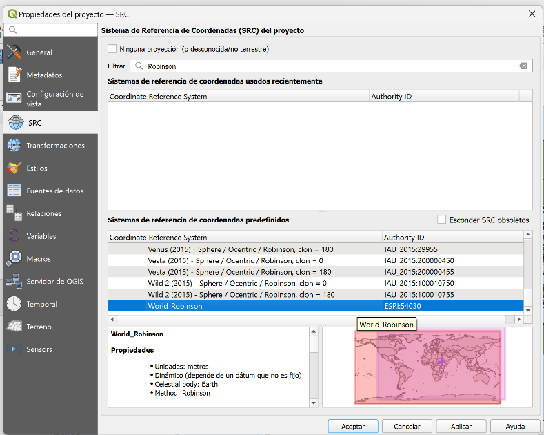{fig-align="center"}

Una vez que hayas aplicado el cambio de CRS, el mapa se actualizará automáticamente para reflejar la proyección **"World_Robinson"**. Puedes notar cómo cambian las formas de los continentes y los océanos, logrando una representación más equilibrada y estéticamente agradable del mundo. Experimenta con distintas CRS globales (puedes probar las proyecciones vistas en la <a href="https://felipejordanc.github.io/sus2211/lectures/clase02.html#/proyecciones-cartogr%C3%A1ficas">Clase 2</a>), apreciando como las forma y tamaños relativos de los continentes cambian de una CRS a otra.

------------------------------------------------------------------------

## Vista de Mapa | Filtrado y segmentación de datos geoespaciales

::: {.callout-tip title="¿Qué es el filtrado y segmentación de datos geoespaciales?"}
Este proceso implica la identificación, selección, y manejo de subconjuntos específicos de datos dentro de un conjunto de datos geográficos más grande, basado en criterios específicos (en este caso, valores específicos en la tabla de atributos).

Se puede desglosar en dos partes:

1.  **Filtrado de datos:** aplicar criterios para seleccionar un subconjunto de datos de un conjunto más grande. En el contexto de un SIG, esto generalmente se realiza utilizando consultas o expresiones para seleccionar entidades (geometrías) que cumplen ciertas condiciones en la tabla de atributos.
2.  **Segmentación y gestión de datos:** después del filtrado, las entidades seleccionadas pueden ser gestionadas de diferentes maneras, como exportarlas a una nueva capa, eliminarlas de la capa original, o aplicarlas a diferentes estilos de visualización.
:::

Si te fijas en la tabla de atributos, hay varios países con un "0" (sin datos) o "Sin datos" en algunas columnas. Es crucial separar estos registros para evitar distorsionar la interpretación de la información. Si los valores nulos o faltantes se muestran como 0 junto a datos reales, pueden crear confusión o dar una impresión incorrecta de la distribución de los datos. Al separarlos, se preserva la integridad de la muestra y se facilita la comprensión precisa del mapa.

**10.** Primero, en la tabla de atributos, haz clic en el ícono del Constructor de consultas (el embudo) para abrir el constructor de consultas.

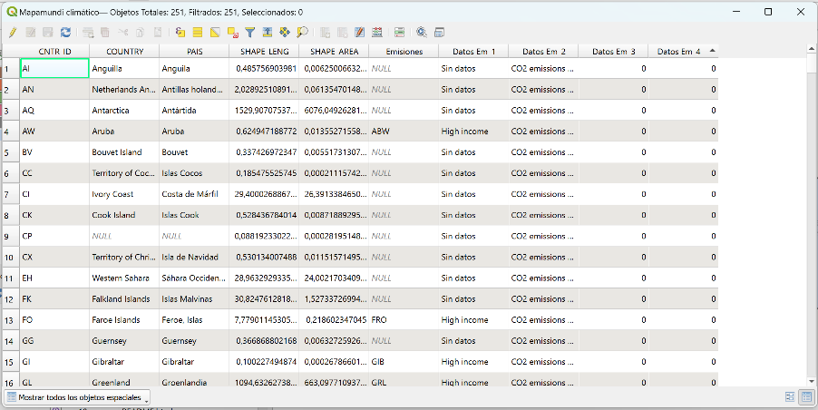{fig-align="center"}

**11.** En el Constructor de consultas, utilizaremos una expresión para filtrar los registros donde los valores sean 0 en la columna específica que está causando el problema. Específicamente, en la sección **Datos Em_3**, coloca **"0"** y cambia la opción a **"igual a"**. De esta manera, todos los países que tengan 0 se seleccionarán automáticamente.

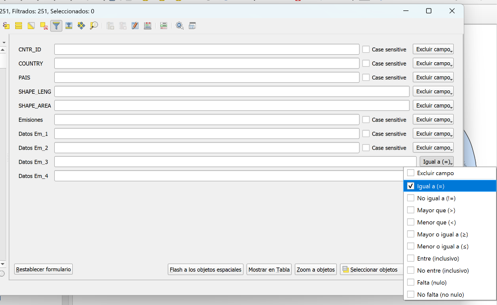{fig-align="center"}

Luego, presiona **"Seleccionar objetos"**.

**12.** Haz clic en Aceptar para aplicar el filtro. Ahora, en la tabla de atributos solo mostrará los registros con el valor "0" en la columna especificada.

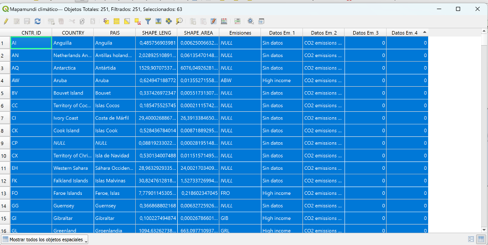{fig-align="center"}

------------------------------------------------------------------------

### Exportar las geometrías filtradas a una nueva capa

Ahora exportaremos estas geografías filtradas a una nueva capa.

**13.** Con los registros filtrados visibles en la tabla de atributos, haz clic derecho en la capa original en el panel de capas y selecciona **"Exportar > Guardar elementos seleccionados como...."**

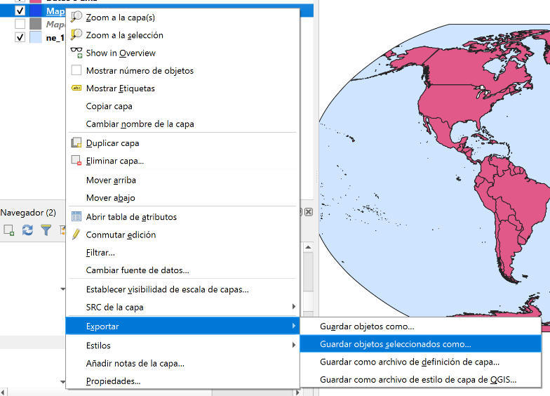{fig-align="center"}

**14.** En la ventana de exportación, elige un nombre para la nueva capa y guardala en la carpeta `datos/intermedios` (para seleccionar la carpeta en que se guardará la capa, debes hacer click en los tres puntos a la derecha del campo "Nombre de archivo"). Asegúrate de seleccionar el mismo CRS (World_Robinson) que la capa original. Recuerda cerciorarte que esté marcado **"solo entidades seleccionadas"** para que solo los registros con valor 0 se guarden en esta nueva capa.

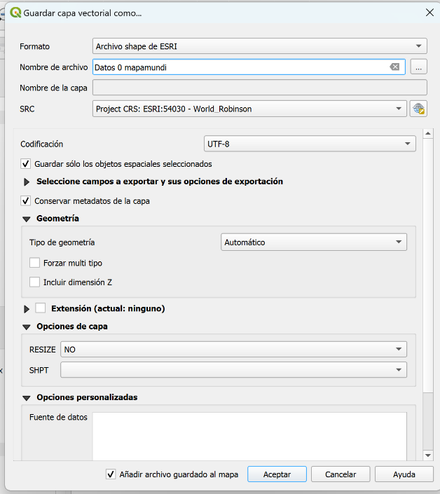{fig-align="center"}

**15.** Haz clic en **Aceptar**.

La nueva capa debería aparecer automáticamente en el panel de capas. Si no es así, añádela manualmente.

Ahora se podrán visualizar los países sin información, pero sin afectar los quintiles originales, pues más adelante añadiremos la misma capa por detrás, sin filtro, con color gris.

::: callout-note
**Debería verse algo así:**

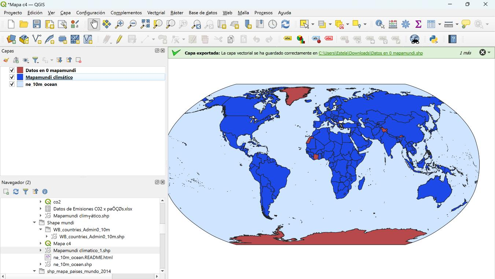{fig-align="center"}
:::

::: callout-tip
**Recuerda:** la exportación de los datos con valor '0' **en este caso** no altera la información original, sino que es una estrategia visual y metodológica para mejorar la representación y análisis de los datos. Al separar estos valores en una nueva capa, evitamos que interfieran en la clasificación de los demás datos y garantizamos una visualización más clara y precisa. De esta manera, podemos diferenciar entre los países con información reportada y aquellos sin datos disponibles, sin distorsionar la interpretación de los patrones espaciales en el mapa.
:::

------------------------------------------------------------------------

## Vista de Mapa | Configuración de la simbología y visualización

**16.** A continuación, en la ventana de propiedades de la capa de **"Mapamundi climático"**, selecciona la pestaña **"Simbología"** en el lado izquierdo.

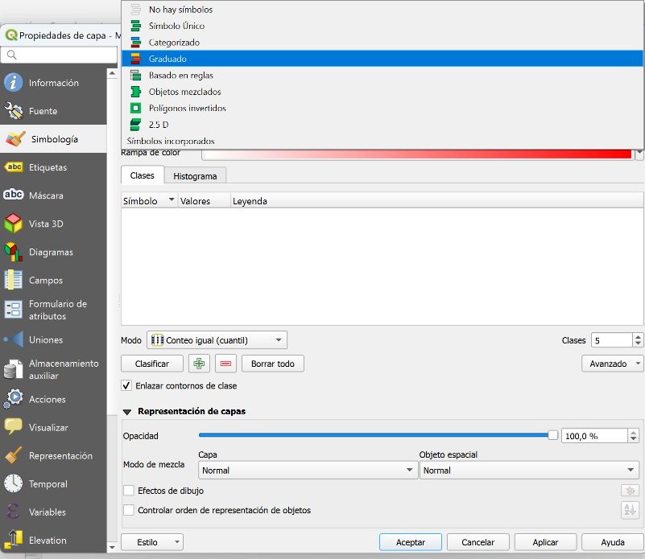{fig-align="center"}

**17.** En la parte superior de la pestaña de simbología, encontrarás un menú desplegable que probablemente esté configurado en "Simbología Simple". Cambia esta opción a **"Graduado"**.

**18.** En el campo **"Valor"**, selecciona la columna de la tabla de atributos que contiene los datos numéricos que deseas utilizar para aplicar la simbología graduada: **Datos Em_4** (emisiones acumuladas). Esta columna debe contener valores numéricos para que el método graduado funcione correctamente.

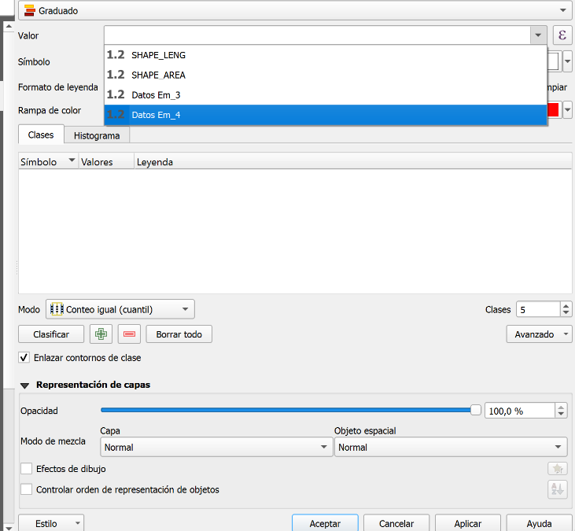{fig-align="center"}

**19.** Ahora, haremos una expresión para poder filtrar las entidades con valor "0". Haz clic en el botón **Expresión** (que se encuentra junto a la opción de seleccionar la columna) para abrir el constructor de expresiones.

**20.** Aquí puedes escribir una expresión en SQL (Structured Query Language) para excluir los valores que no deseas contabilizar en la categorización. Copia y pega esta expresión:

```
CASE WHEN "Datos Em_4" != 0 THEN "Datos Em_4" ELSE NULL END
```

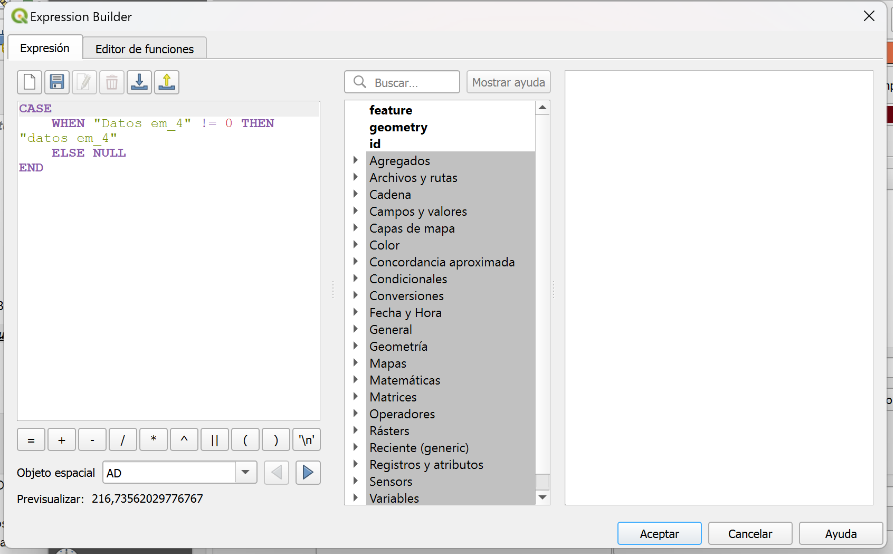{fig-align="center"}

::: callout-tip
## ¿Qué es SQL?

SQL (Structured Query Language) es un lenguaje estándar para consultar y manipular datos. Aunque su nombre suene técnico, su lógica es bastante intuitiva — se parece mucho a dar instrucciones en lenguaje natural.

La expresión que acabamos de usar se lee casi como una oración en inglés:

```
CASE WHEN "Datos Em_4" != 0 THEN "Datos Em_4" ELSE NULL END
```

Traducida, dice: ***"EN EL CASO** de que el valor de Datos Em_4 sea **distinto de** 0, **ENTONCES** usa ese valor. **SI NO**, déjalo vacío (NULL)."*

Así filtramos los países con valor 0 para que no interfieran en la clasificación de colores del mapa.

Además, puedes usar herramientas de inteligencia artificial (como ChatGPT, Gemini o Claude) para traducir fácilmente tus instrucciones en lenguaje natural a expresiones SQL. Por ejemplo, basta con pedirle: *"Escríbeme una expresión SQL que excluya los valores iguales a 0 de la columna Datos Em_4"* y obtendrás la expresión lista para copiar y pegar.
:::

**21.** Haz clic en Aceptar para aplicar la expresión.

**22.** Selecciona una rampa de colores en el menú desplegable de **"Rampa de color"**. Puedes elegir entre las opciones predefinidas o crear una rampa personalizada.

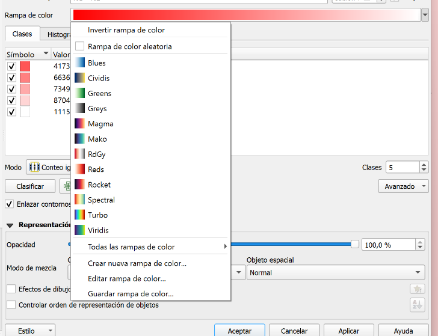{fig-align="center"}

**23.** En la sección de "Clasificación", QGIS generará automáticamente un número determinado de clases basadas en el método seleccionado (en la <a href="https://felipejordanc.github.io/sus2211/homeworks/tarea03.html">Tarea 3</a> revisamos los distintos métodos). Aquí, estamos usando el método de cuantiles, que brinda una visualización intuitiva y balanceada. Si deseas ajustar el número de clases o los rangos manualmente, puedes hacerlo aquí. Haz clic en el botón **"Clasificar"** para que QGIS genere las clases automáticamente basadas en el método que elegiste.

::: callout-note
**Debería aparecer algo así:**

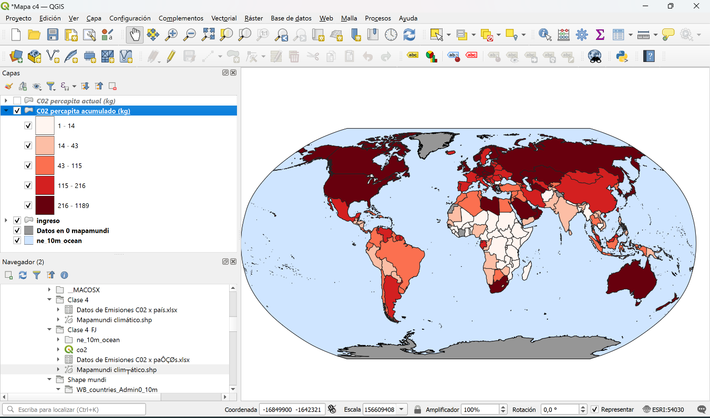{fig-align="center"}
:::

------------------------------------------------------------------------

### Crear los mapas restantes duplicando la capa

Ahora duplicaremos la capa para realizar los otros dos mapas con la información que mencionamos al principio. De esta manera, con la misma extensión y formato, produciremos tres mapas:

-   **Emisiones CO₂ actuales** (Datos Em_3)
-   **Emisiones CO₂ acumuladas** (Datos Em_4) — lo que acabamos de hacer
-   **Ingresos** (Datos Em_1)

**24.** Para duplicar la capa, haz clic derecho y aprieta la opción **"Duplicar capa"**. Se hará 2 veces para poder hacer los dos mapas faltantes.

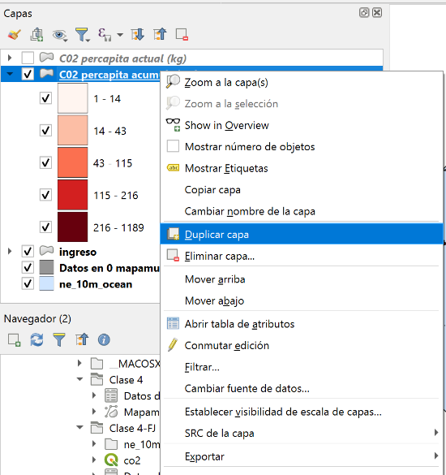{fig-align="center"}

**25.** Ahora, renombra las nuevas capas con los nombres anteriores para no confundirse.

**26.** Ahora repite desde el paso N°16 con ambas capas. A excepción de las expresiones, que serían las siguientes:

Para **Emisiones CO₂ actuales** (Em_3):

```
CASE WHEN "Datos Em_3" != 0 THEN "Datos Em_3" ELSE NULL END
```

Para **Ingresos** (Em_1):

```
CASE WHEN "Datos Em_1" != 'Sin datos' THEN "Datos Em_1" ELSE NULL END
```

::: {.callout-tip title="Para el mapa de Ingresos hay unas pequeñas diferencias"}
-   En la simbología debes cambiarlo de "Simbología simple" a **"Categorizado"** (no Graduado), ya que los ingresos son categorías, no valores continuos.
-   Luego, como ya hemos visto: Valor, Expresión, Clasificar.
-   Posteriormente, con el cursor manteniendo presionado el click izquierdo, debes ordenar las capas para que queden en orden ascendente.
-   Por último, en rampa de colores, nuevamente elegir la rampa a utilizar.
-   **OJO:** es importante que exista una relación entre el orden de los datos y los colores. Por ejemplo, si es un dato ascendente, es clave que la rampa de colores empiece de suaves a fuertes. Para invertir la rampa, existe la herramienta **"Invertir rampa de color"**.

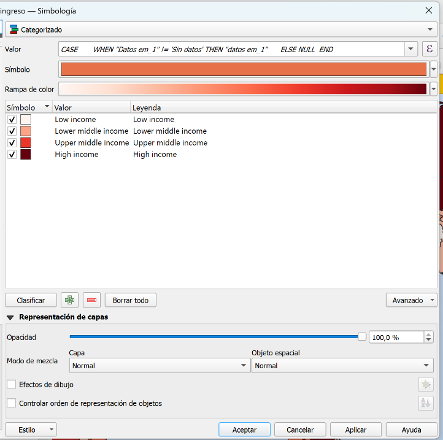{fig-align="center"}

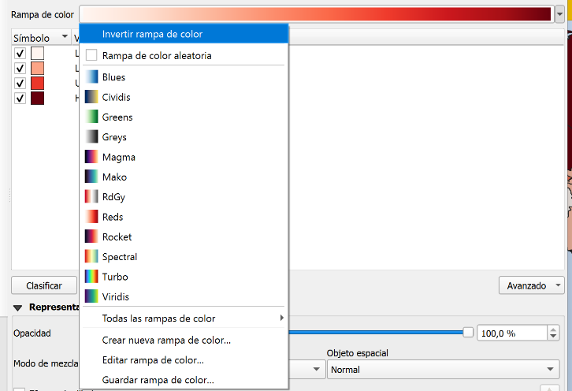{fig-align="center"}
:::

::: callout-note
**Debería quedar así:**

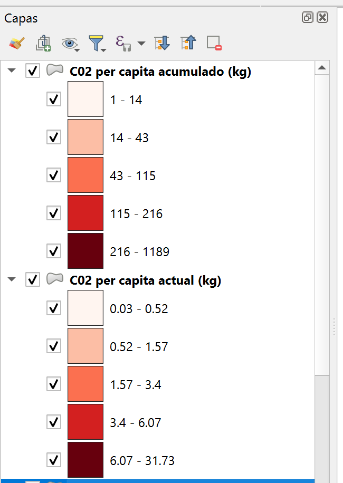{fig-align="center"}

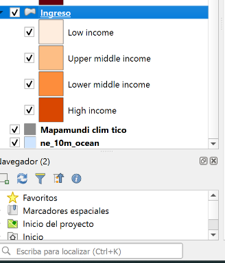{fig-align="center"}
:::

::: callout-warning
¡Recuerda guardar el trabajo que hayas realizado hasta ahora para no perder el avance!
:::

------------------------------------------------------------------------

## Vista de Mapa | Configuración de composición de impresión

Ahora se trabajará en la construcción final para representar correctamente un mapa a través de la composición de elementos (leyenda, mapa, y escala a trabajar).

**27.** En la barra de menú superior, selecciona **"Proyecto"**. Dentro del menú desplegable, selecciona **"Composición de impresión"** o **"Nuevas composiciones de impresión"**. Asigna un nombre a la nueva composición y haz clic en **"Aceptar"**.

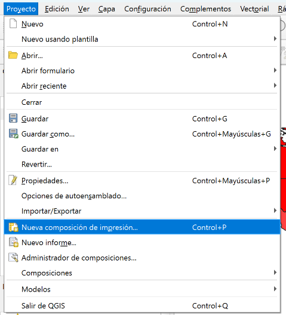{fig-align="center"}

Esto abrirá la ventana de composición de impresión, donde puedes configurar y diseñar tu mapa para impresión, integrando la leyenda, escala, título, etc.

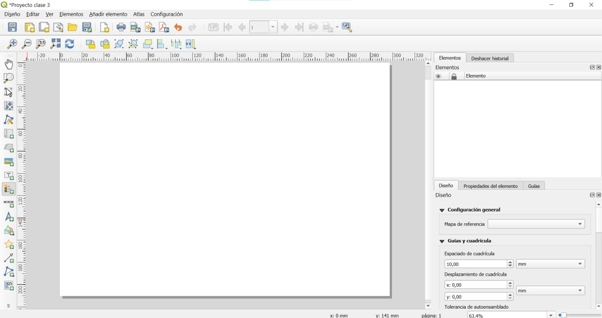{fig-align="center"}

**28.** En este punto podrás encontrar los elementos que podrás ir añadiendo a tu lámina de trabajo (mapa, escala, rosa de los vientos y leyenda).

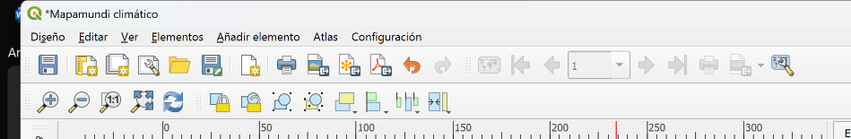{fig-align="center"}

**29.** Selecciona la opción de **"Agregar mapa"** (parece un rectángulo con una lupa). Dibuja un rectángulo en el lienzo del diseño donde deseas que aparezca tu mapa.

::: callout-note
**Nota sobre la escala y rosa de los vientos:** recuerden la importancia de estos elementos en los mapas. Sin embargo, **en el caso de los mapamundis no son necesarios** — la escala varía según la latitud en proyecciones como Robinson, y la orientación al norte es evidente.
:::

**30.** **Agregar un título y otros textos.** Selecciona el ícono de **"Agregar etiqueta"** (parece una "T") en la barra de herramientas y dibuja un cuadro en el área donde deseas que aparezca el texto.

En el panel **"Propiedades del elemento"**, escribe el texto deseado (como el título del mapa) y ajusta el tamaño, fuente, y alineación según tus preferencias.

**31.** **Perfeccionar el diseño de la leyenda.** **Agregar la leyenda.** En la barra de herramientas, selecciona el ícono de **"Agregar leyenda"** (parece un cuadro de texto con líneas). Dibuja un rectángulo donde deseas que aparezca la leyenda.

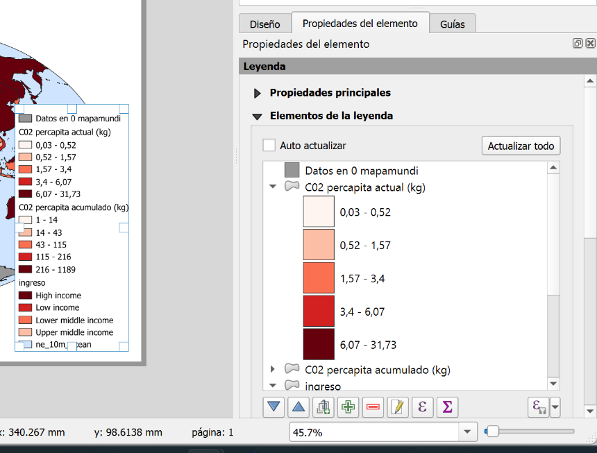{fig-align="center"}

Para visualizar solo la información correspondiente al mapa, debes ir al panel derecho, seleccionar las capas que NO nos interesan y con el signo **"-"** ir borrándolas.

-   Para cambiar los nombres de las entradas de la leyenda, debes hacer doble clic sobre ellas.

En **"Propiedades del elemento" > "Fuentes y formato del texto"**, puedes ir cambiando la tipografía y tipo de letra.

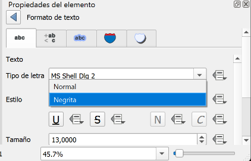{fig-align="center"}

Luego, regresa al panel anterior, sigue bajando por el mismo y activa la opción **"Marco"** y **"Fondo"**.

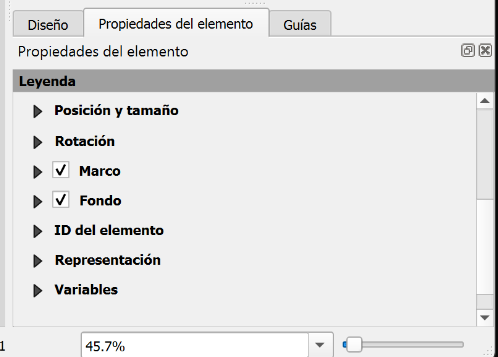{fig-align="center"}

**32.** **Ajustar el diseño final.** Puedes mover y redimensionar todos los elementos del diseño (mapa, leyenda, barra de escala, etc.) para que se ajusten bien en el lienzo.

-   Si necesitas cambiar la orientación o el tamaño de la página, ve a **"Diseño"** en la barra de menú y selecciona **"Configuración de página..."**.

**33.** Una vez terminado todos los elementos, puedes exportar el trabajo realizado en imagen o PDF. Presionando las casillas entre el dibujo de la impresora y la flecha a la izquierda:

{fig-align="center"}

Se recomienda resolución de **150–300 ppp** para una buena visualización al exportar como imágen:

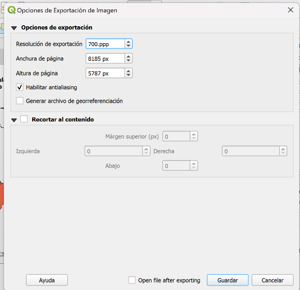{fig-align="center"}

------------------------------------------------------------------------

## Resultado final

Los mapas finales deberían verse algo así (con tu propia elección de colores y CRS):

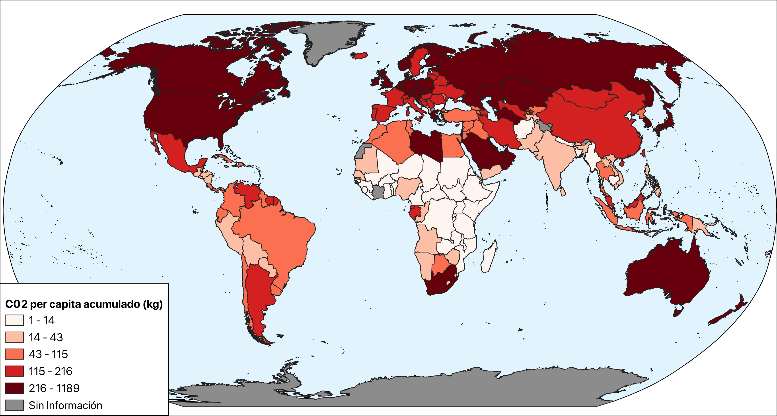{fig-align="center"}

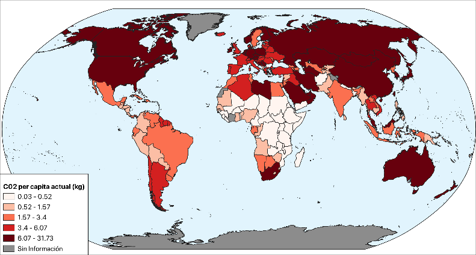{fig-align="center"}

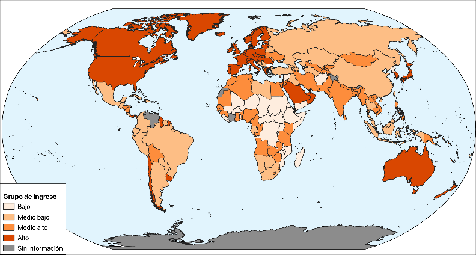{fig-align="center"}

¡Listo! Has finalizado tus mapas. Recuerda guardar tu trabajo para poder utilizarlo en la entrega de tu próximo portafolio.

------------------------------------------------------------------------

## Preguntas guía para reflexión

::: {.callout-important title="Preguntas guía para reflexión"}
-   **Emisiones actuales vs. acumuladas:** Comparando tus mapas de emisiones actuales y acumuladas, ¿qué países aparecen como grandes emisores en uno pero no en el otro? ¿Qué implica esto para la discusión sobre **responsabilidad histórica** vs. responsabilidad actual en las negociaciones climáticas?
-   **Ingreso y emisiones:** Observando tus tres mapas en conjunto, ¿qué relación puedes identificar entre el nivel de ingreso de un país y sus emisiones de CO₂? ¿Existen excepciones a este patrón? ¿Qué nos dice esto sobre la relación entre **desarrollo económico y huella de carbono**?
-   **Justicia climática:** El artículo de [*Our World in Data*](https://ourworldindata.org/co2-emissions) plantea distintas formas de medir las emisiones (totales, per cápita, acumuladas, basadas en consumo). ¿Cómo cambia la narrativa de **quién es responsable** dependiendo de la métrica que se use? ¿Cuál te parece más justa y por qué?
-   **Desigualdad y vulnerabilidad:** Como vimos en la clase, quienes menos contribuyen al cambio climático suelen ser los más afectados. A partir de tus mapas, ¿puedes identificar esta paradoja entre los países del **Sur y Norte Global**?
:::
