## Objetivo

El objetivo de esta práctica es que adquieras las habilidades de importación de datos a QGIS, unión de tablas (join no espacial), y confección de mapas temáticos. La idea es que logres crear dos mapas que cuenten una historia de **Control y Descontrol**: el primero muestra el avance de las energías renovables en el mundo; el segundo muestra el costo oculto de esta transición — la extracción de litio en zonas con alto estrés hídrico en Sudamérica.

**Herramientas nuevas:**

-   Importación de datos CSV (con y sin coordenadas)
-   Join no espacial para combinar tablas
-   Exportación de capas a GeoPackage
-   Simbología basada en reglas (con clase "Sin información")
-   Composición de impresión con **dos mapas** (díptico)
-   Edición avanzada de leyendas (columnas, tamaño manual, sin fondo)

------------------------------------------------------------------------

## Preparación: descarga y organización del material

### Descarga desde Canvas

**1.** Descarga el archivo `.zip` de esta tarea desde la página del curso en **Canvas** (carpeta "Clase 5"). El archivo contiene todas las capas necesarias para el ejercicio.

**2.** Descomprime el archivo en una ubicación dedicada a este curso. Algunas opciones:

-   **Computador personal:** descomprime dentro de tu carpeta `SUS2211/`.
-   **Computador de la sala:** descomprime en el escritorio o en Documentos, pero **antes de terminar la sesión**, copia toda la carpeta a OneDrive, un pendrive u otro servicio en la nube.

::: callout-warning
**¡Importante!** Los computadores de la sala de clases se **borran automáticamente cada semana**. Si trabajas en un computador de la universidad, guarda siempre una copia en **OneDrive** (u otro servicio en la nube) o en un pendrive antes de salir. De lo contrario, perderás todo tu avance.
:::

------------------------------------------------------------------------

### Estructura de carpetas del proyecto

Al descomprimir el archivo, encontrarás la siguiente estructura de carpetas. Esta organización es la misma que hemos usado en las clases anteriores y será estándar para **todas las tareas del curso**.

```{mermaid}
flowchart TD
    A["📁 clase5/"] --> B["📁 datos/"]
    A --> C["📁 documentos/"]
    A --> D["📁 proyectos/"]
    A --> E["📁 resultados/"]

    B --> F["📁 brutos/<br>🔒 datos originales<br>(no modificar)"]
    B --> G["📁 intermedios/<br>datos de geoprocesamiento"]
    B --> H["📁 procesados/<br>capas finales para mapeo"]

    E --> I["📁 mapas/<br>mapas exportados"]
    E --> J["📁 figuras/<br>gráficos y tablas"]

    style F fill:#fde8e8,stroke:#c0392b
    style G fill:#fef9e7,stroke:#f39c12
    style H fill:#eafaf1,stroke:#27ae60
    style D fill:#eaf4fb,stroke:#2980b9
    style C fill:#f4f6f7,stroke:#7f8c8d
```

::: {.callout-tip title="¿Para qué sirve cada carpeta?"}

**`datos/`** — Todo lo relacionado con los datos geoespaciales, organizado en tres subcarpetas:

-   **`brutos/`** 🔒 Datos originales tal como fueron descargados. **Nunca se modifican ni se sobreescriben.**
-   **`intermedios/`** Resultados de operaciones de geoprocesamiento (recortes, uniones, reproyecciones, etc.).
-   **`procesados/`** Capas finales listas para confeccionar el mapa.

**`documentos/`** — Documentación de respaldo. Se recomienda incluir una bitácora (`bitacora.txt` o `pasos.md`) que describa cómo transformaste los datos.

**`proyectos/`** — Archivos de proyecto QGIS (`.qgz`).

**`resultados/`** — Productos finales:

-   **`mapas/`** Mapas exportados (imágenes, PDF).
-   **`figuras/`** Gráficos, tablas u otros outputs.

:::

------------------------------------------------------------------------

### Material descargado

Al descomprimir el archivo, encontrarás los siguientes archivos dentro de la carpeta **`datos/brutos`**:

| Archivo | Descripción |
|---|---|
| `paises_mundo.shp` (+ .shx, .dbf, .prj, .cpg) | Shapefile de los países del mundo |
| `energia_renovable_mundo_2023.csv` | Porcentaje de electricidad renovable por país (2023) |
| `sudamerica_admin1.shp` (+ .shx, .dbf, .prj, .cpg) | Shapefile de regiones/provincias de Sudamérica |
| `estres_hidrico_sudamerica.csv` | Índice de estrés hídrico por región (WRI Aqueduct 4.0) |
| `minas_litio_sudamerica.csv` | Ubicación de minas de litio en Sudamérica (con coordenadas) |

::: {.callout-tip title="¿De dónde vienen estos datos?"}
-   **Países del mundo:** [Natural Earth](https://www.naturalearthdata.com/) — mapa simplificado a escala 1:110 millones.
-   **Energía renovable:** [Our World in Data](https://ourworldindata.org/renewable-energy) — datos del año 2023.
-   **Regiones de Sudamérica:** [GADM](https://gadm.org/) v4.1 — divisiones administrativas nivel 1 (regiones, provincias, estados).
-   **Estrés hídrico:** [WRI Aqueduct 4.0](https://www.wri.org/aqueduct) — índice de estrés hídrico basal, que mide la proporción de agua dulce extraída respecto al agua disponible.
-   **Minas de litio:** [ICMM Global Mining Dataset](https://www.icmm.com/) (2025) — ubicaciones de minas y plantas de procesamiento de litio.
:::

------------------------------------------------------------------------

## ¡Empecemos! {.unnumbered .unlisted}

## Mapa 1: "Control" — Energías renovables en el mundo {.unnumbered .unlisted}

En este primer mapa visualizaremos qué proporción de la electricidad de cada país proviene de fuentes renovables (solar, eólica, hidroeléctrica, etc.). Este es el lado del **"Control"**: la humanidad avanzando hacia un futuro energético más limpio.

## Paso 1 | Crear el proyecto y cargar el shapefile base

**3.** Inicia QGIS y crea un proyecto nuevo. Guárdalo en la carpeta `proyectos/` con un nombre adecuado (por ejemplo, `clase5`).

**4.** Añade al mapa el shapefile `paises_mundo.shp` arrastrándolo al panel de capas o usando **Capa > Añadir Capa > Añadir capa vectorial**.

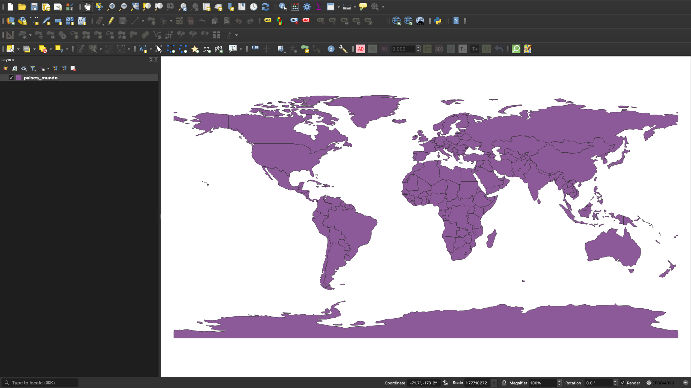{fig-align="center"}

**5.** Ve al menú **Proyecto > Propiedades** y selecciona la pestaña **"SRS"** (Sistema de Referencia de Coordenadas).

::: {.callout-tip title="¿Qué es un Sistema de Referencia de Coordenadas (CRS)?"}
Es un sistema que define cómo se proyectan y representan las coordenadas geográficas en un mapa. Para un mapamundi, la proyección **Robinson** ofrece una representación equilibrada de formas y tamaños — es la misma que usamos en la Clase 4.
:::

**6.** En la barra de búsqueda, escribe "Robinson". Selecciona **"World_Robinson"** de la lista que aparece. Haz clic en **Aplicar** y luego en **Aceptar**.

Una vez que hayas aplicado el cambio de CRS, el mapa se actualizará automáticamente para reflejar la proyección **"World_Robinson"**. Notarás cómo las formas de los continentes y los océanos cambian, logrando una representación más equilibrada y estéticamente agradable del mundo.

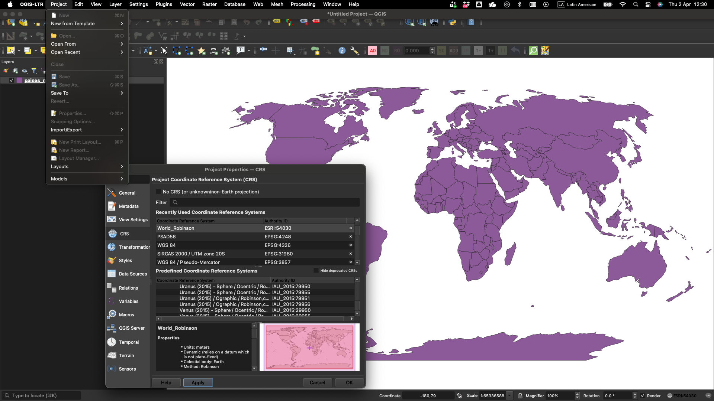{fig-align="center"}
------------------------------------------------------------------------

## Paso 1b | Explorar la tabla de atributos

**7.** Abre la **tabla de atributos** de la capa `paises_mundo` (clic derecho > Abrir tabla de atributos). Observa las columnas disponibles:

-   `Pais`: nombre del país
-   `ISO_A3`: código ISO de 3 letras (por ejemplo, `CHL` para Chile, `BRA` para Brasil)

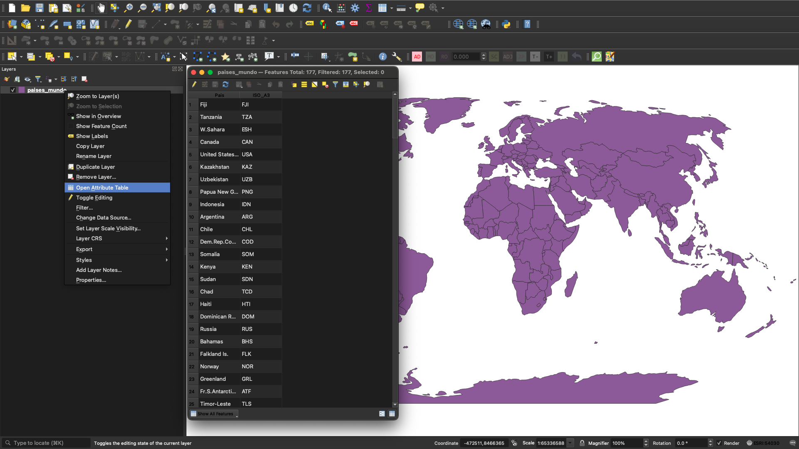{fig-align="center"}

::: callout-note
Fíjate en la columna `ISO_A3` — este será el campo clave para unir los datos de energía renovable a los países.
:::

------------------------------------------------------------------------

## Paso 2 | Importar los datos de energía renovable (CSV sin coordenadas)

Ahora importaremos la base de datos de energía renovable. Este archivo CSV **no tiene coordenadas** — contiene solo datos tabulares que uniremos al shapefile usando un campo en común.

**8.** Ve a **Capa > Añadir Capa > Añadir capa de texto delimitado**.

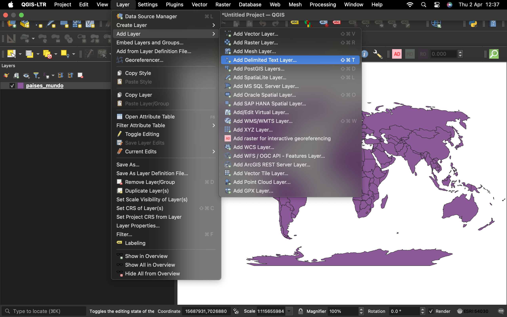{fig-align="center"}

**9.** En la ventana que se abre:

-   Busca y selecciona el archivo `energia_renovable_mundo_2023.csv`.
-   En **Formato de archivo**, asegúrate de que esté seleccionado **CSV (valores separados por coma)**.
-   En **Definición de geometría**, selecciona **"Ninguna geometría (tabla solo de atributos)"** — porque este archivo no tiene coordenadas.
-   Revisa en **Datos de ejemplo** que las columnas se vean correctamente separadas.

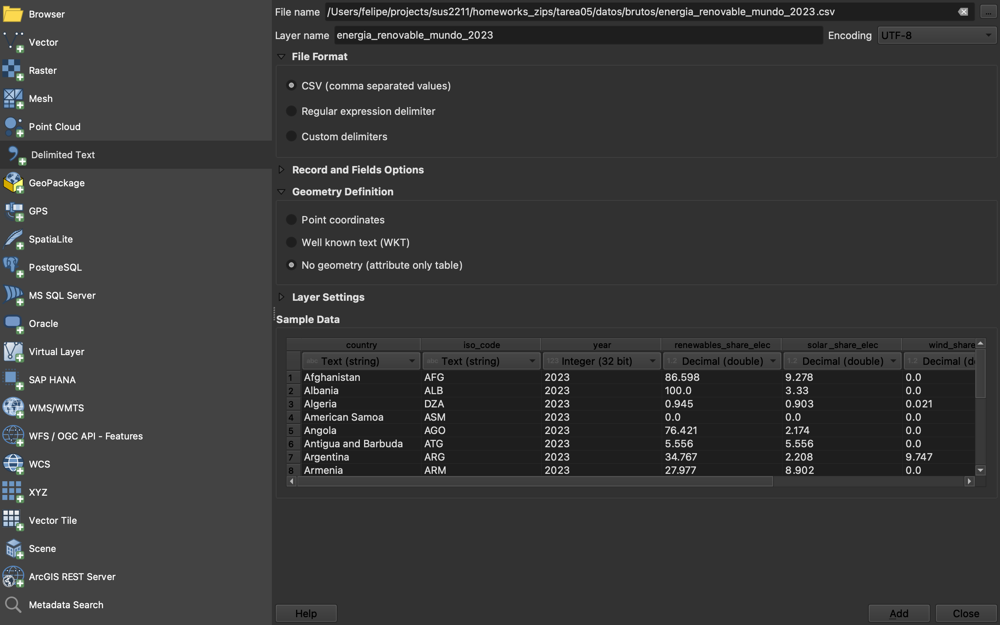{fig-align="center"}

**10.** Haz clic en **Añadir**. La tabla aparecerá en el panel de capas, pero no se visualizará en el mapa (porque no tiene geometría).

**11.** Abre la tabla de atributos de esta nueva capa y explora las columnas:

-   `country`: nombre del país
-   `iso_code`: código ISO de 3 letras
-   `year`: año (2023)
-   `renewables_share_elec`: porcentaje de electricidad proveniente de fuentes renovables
-   `solar_share_elec`, `wind_share_elec`, `hydro_share_elec`: desglose por tipo

::: {.callout-tip title="¿Qué nos dicen estos datos?"}
El campo `renewables_share_elec` indica el porcentaje de la electricidad de un país que proviene de fuentes renovables. Por ejemplo, Chile tiene un **64,4%**, mientras que Islandia alcanza el **100%**. Estos datos provienen de [Our World in Data](https://ourworldindata.org/renewable-energy) y son del año 2023.
:::

------------------------------------------------------------------------

## Paso 3 | Join no espacial: unir energía renovable a los países

Ahora realizaremos una **unión no espacial** (table join) entre el shapefile de países y la tabla de energía renovable. Esto vinculará los datos de energía a cada polígono de país, permitiéndonos crear un mapa temático.

**12.** Haz clic derecho sobre la capa `paises_mundo` y selecciona **Propiedades > Uniones**.

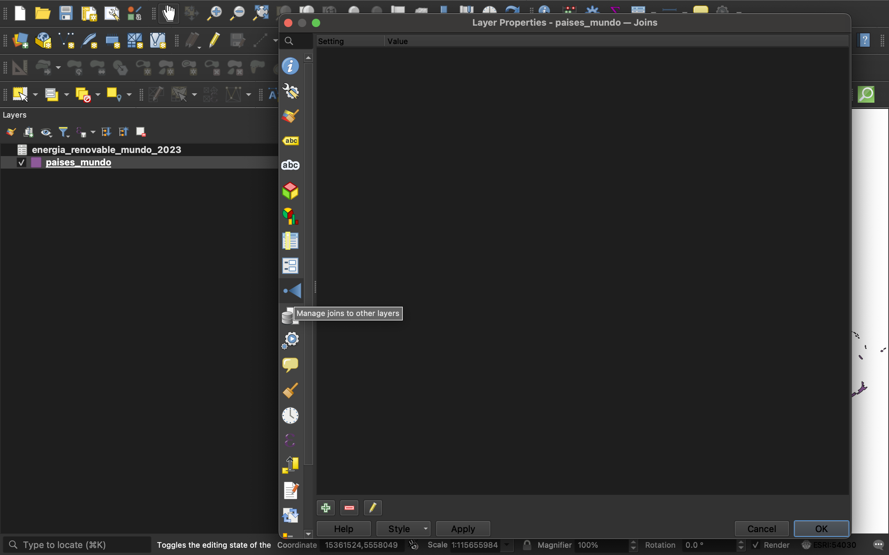{fig-align="center"}

**13.** Haz clic en el botón **"+"** (Añadir una nueva unión). En la ventana que aparece:

-   **Capa de unión:** selecciona `energia_renovable_mundo_2023`
-   **Campo de unión:** selecciona `iso_code`
-   **Campo del objeto:** selecciona `ISO_A3`

Estas dos columnas contienen el mismo código ISO de 3 letras, lo que permite a QGIS vincular cada fila de la tabla CSV con el polígono del país correspondiente.

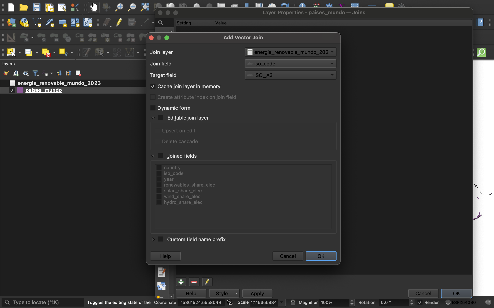{fig-align="center"}

**14.** Haz clic en **Aceptar** dos veces (una en el cuadro the configuración del join, luego en el cuadro de propiedades).

**15.** Abre la tabla de atributos de `paises_mundo` y desplázate hacia la derecha. Deberías ver las nuevas columnas provenientes de la tabla de energía.

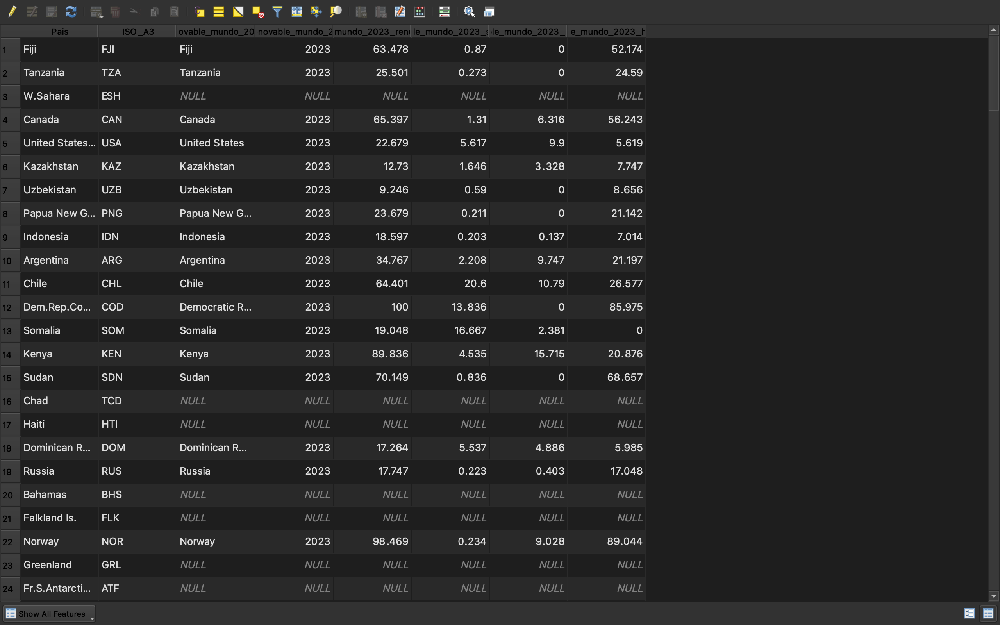{fig-align="center"}

::: callout-important
**¿Por qué las columnas nuevas tienen nombres tan largos?** Al realizar un join en QGIS, las columnas que provienen de la tabla unida se renombran automáticamente con el **prefijo del nombre de la capa de origen** — por ejemplo, `energia_renovable_mundo_2023_renewables_share_elec` en vez de solo `renewables_share_elec`. Esto ocurre siempre y es para evitar confusiones cuando hay columnas con el mismo nombre en ambas tablas. Tenlo en cuenta a lo largo de la tarea: cada vez que necesites seleccionar o escribir el nombre de una columna que vino de un join, debes usar el nombre completo tal como aparece en la tabla de atributos.
:::

::: {.callout-tip title="¿Qué es un join no espacial?"}
Un **join no espacial** (o table join) vincula dos tablas de datos utilizando un campo en común — en este caso, el código ISO del país. A diferencia de un join espacial (que veremos más adelante), no se basa en la ubicación geográfica sino en un identificador compartido. Es análogo a un `VLOOKUP` en Excel o un `JOIN` en SQL.
:::

::: {.callout-important title="¿Qué pasa con los países que no tienen datos de energía?"}
Al hacer un join en QGIS, **la capa original siempre conserva todas sus filas** — no se pierde ningún país del mapa. Si un país del shapefile no tiene un código ISO que coincida en la tabla de energía, simplemente quedará con las columnas de energía **vacías** (sin valor). Esto significa que:

-   Si el shapefile tiene 177 países, después del join seguirás teniendo 177 países.
-   Los países que sí encontraron coincidencia tendrán sus datos de energía completos.
-   Los países sin coincidencia aparecerán con valores vacíos en las columnas nuevas — y probablemente se mostrarán sin color en el mapa final.

Es importante revisar la tabla de atributos después del join para identificar estos casos y decidir cómo manejarlos.
:::

------------------------------------------------------------------------

## Paso 4 | Exportar la capa unida como GeoPackage

El join que acabamos de hacer es **temporal** — si cierras el proyecto, se perderá. Para hacerlo permanente, exportaremos la capa a un nuevo archivo.

**16.** Haz clic derecho sobre `paises_mundo` y selecciona **Exportar > Guardar objetos como...**

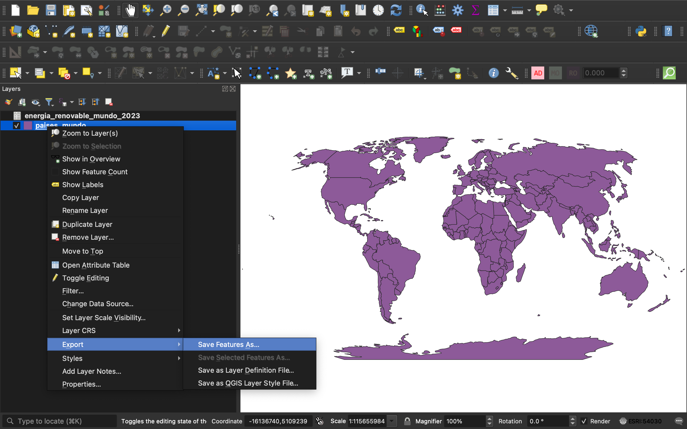{fig-align="center"}

**17.** En la ventana de exportación:

-   **Formato:** GeoPackage
-   **Nombre de archivo:** navega a tu carpeta `datos/procesados/` y nómbralo `paises_renovables.gpkg`
-   Haz clic en **Aceptar**.

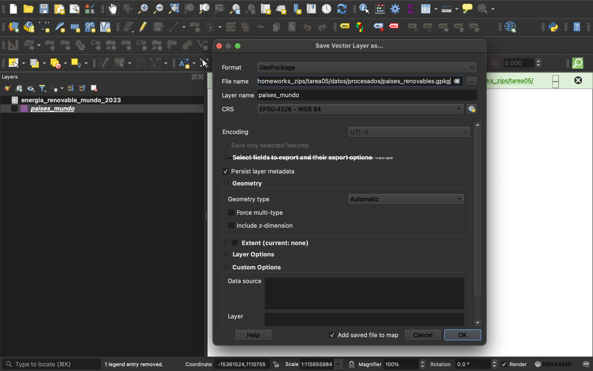{fig-align="center"}

Al aceptar, la nueva capa aparecerá automáticamente en el panel de capas con los datos de energía integrados permanentemente.

::: {.callout-tip title="¿Por qué usar el formato GeoPackage?"}

Hasta ahora hemos trabajado importando archivos **Shapefile** (`.shp`), el formato más común en GIS. Sin embargo, a la hora de exportar y guardar nuestras propias capas, usaremos **GeoPackage** (`.gpkg`) como formato estándar del curso. ¿Por qué? Comparemos los formatos más comunes:

| Formato | Extensión | Archivos | Límite nombres de columna | CRS | Tamaño máximo |
|---|---|---|---|---|---|
| **Shapefile** | `.shp` + `.shx` + `.dbf` + `.prj` + `.cpg` | 5–7 archivos | 10 caracteres | Cualquiera | 2 GB |
| **GeoPackage** | `.gpkg` | 1 archivo | Sin límite | Cualquiera | Sin límite práctico |
| **KML** | `.kml` / `.kmz` | 1 archivo | Sin límite | Solo WGS 84 | Sin límite |
| **GeoJSON** | `.geojson` | 1 archivo | Sin límite | Solo WGS 84 | Sin límite práctico |
| **GeoTIFF** | `.tif` | 1–2 archivos | — (formato ráster) | Cualquiera | 4 GB |
| **File Geodatabase** | `.gdb` (carpeta) | Múltiples | 64 caracteres | Cualquiera | 1 TB |

**¿Por qué GeoPackage es la mejor opción para nuestro trabajo?**

-   **Un solo archivo:** a diferencia del Shapefile (que necesita 5 o más archivos que deben mantenerse juntos), un GeoPackage es un único archivo `.gpkg`. Esto hace mucho más fácil copiar, mover y compartir tus datos sin que se pierda ninguna pieza.
-   **Sin truncar nombres de columna:** el Shapefile recorta los nombres de columna a 10 caracteres (por ejemplo, `renewables_share_elec` se convierte en `renewabl_1`), lo que dificulta saber qué contiene cada columna. GeoPackage conserva los nombres completos.
-   **Soporta cualquier sistema de coordenadas:** a diferencia de KML y GeoJSON (que solo trabajan en WGS 84), GeoPackage puede almacenar datos en cualquier CRS, incluyendo proyecciones como Robinson.
-   **Múltiples capas en un archivo:** un solo `.gpkg` puede contener varias capas (vectoriales y ráster), como una mini base de datos geoespacial.
-   **Es el formato por defecto de QGIS** desde la versión 3.x, y es un estándar abierto del [Open Geospatial Consortium (OGC)](https://www.ogc.org/).

En resumen: GeoPackage combina la versatilidad del Shapefile con la simplicidad de un archivo único, sin las limitaciones históricas. Por eso lo adoptaremos como formato estándar en las próximas tareas.
:::

------------------------------------------------------------------------

## Paso 5 | Simbología graduada: porcentaje de energía renovable

**18.** Haz clic derecho sobre la nueva capa `paises_renovables` y selecciona **Propiedades > Simbología**.

**19.** Cambia la simbología de "Símbolo único" a **"Graduado"**.

**20.** En el campo **Valor**, selecciona la columna que contiene el porcentaje de electricidad renovable. Recuerda que, después del join, las columnas llevan como prefijo el nombre de la capa de origen — busca una columna como `energia_renovable_mundo_2023_renewables_share_elec` (o similar) en la lista desplegable.

::: callout-warning
**¿La columna no aparece en la lista, o el mapa no se colorea correctamente?** Es posible que QGIS haya importado la columna de porcentaje de energía renovable como **texto** (string) en vez de como número. Esto ocurre a veces al importar archivos CSV, y hace que QGIS no pueda usarla para una simbología graduada.

**¿Cómo verificar el tipo de dato de una columna?** Haz clic derecho sobre la capa > **Propiedades** > pestaña **"Campos"** (o **"Fields"**). Allí verás una tabla con todas las columnas de la capa. La columna **"Tipo"** (o **"Type name"**) te indica el tipo de dato de cada campo: `Real` o `double` significa número decimal, `Integer` significa número entero, y `String` significa texto. Si la columna `renewables_share_elec` aparece como `String`, ese es el problema.

**¿Cómo solucionarlo?** Abre la **tabla de atributos** de la capa y activa la **Calculadora de campos** (botón del ábaco en la barra de herramientas de la tabla). Luego:

1.  Marca **"Crear un campo nuevo"**.
2.  En **Nombre del campo de salida**, escribe un nombre corto como `pct_renov`.
3.  En **Tipo del campo de salida**, selecciona **Número decimal (real)**.
4.  En el cuadro de **Expresión**, escribe `to_real(` y luego, en vez de escribir manualmente el nombre de la columna (lo que puede generar errores de tipeo), usa el panel central del editor de expresiones: busca la categoría **"Campos y valores"** (o **"Fields and Values"**), despliégala, y **haz doble clic** sobre la columna `energia_renovable_mundo_2023_renewables_share_elec`. El nombre se insertará automáticamente en el cuadro de expresión, con las comillas incluidas. Luego cierra el paréntesis `)`. La expresión final debería verse así:

    ```
    to_real("energia_renovable_mundo_2023_renewables_share_elec")
    ```

5.  Haz clic en **Aceptar**. Se creará una nueva columna numérica con los valores convertidos.

Ahora podrás seleccionar esta nueva columna (`pct_renov`) en el campo **Valor** de la simbología graduada. La función `to_real()` convierte texto a número decimal — es parte del grupo de funciones de **Conversiones** en QGIS.
:::

**21.** Selecciona una **rampa de color** apropiada (se sugiere una rampa de verdes, dado que representamos energía "limpia").

**22.** Haz clic en **Clasificar** y luego en **Aceptar**.

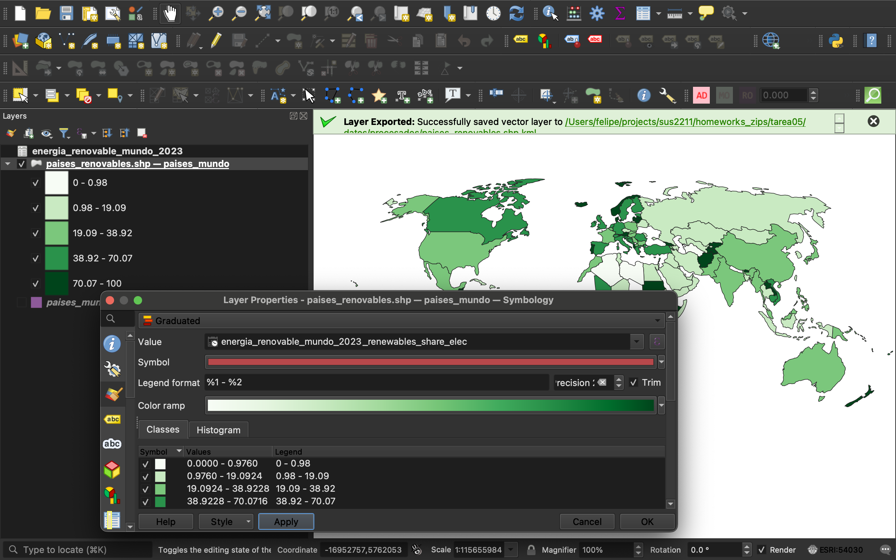{fig-align="center"}

**23.** Notarás que los países sin datos de energía renovable aparecen **invisibles** (sin relleno), lo que puede confundirse con el fondo del mapa. Para solucionarlo, convertiremos la simbología graduada en una **simbología basada en reglas**, lo que nos permitirá añadir una clase especial para los valores sin datos — todo dentro de la misma capa y la misma leyenda.

-   Abre nuevamente **Propiedades > Simbología** de la capa `paises_renovables`.
-   Cambia el tipo de simbología de **"Graduado"** a **"Basado en reglas"**. Al hacerlo, QGIS convertirá automáticamente las clases graduadas que ya creaste en reglas individuales — no perderás nada de lo que hiciste.
-   Ahora añade una nueva regla para capturar los países sin datos: haz clic en el botón **"+"** (añadir regla).
-   En la ventana de edición de la regla, marca la casilla **"Else"** — esto hará que la regla capture todas las entidades que no coinciden con ninguna otra regla (es decir, los países sin datos de energía).
-   En **Etiqueta**, escribe `Sin información`.
-   Configura el color de relleno de esta regla: haz clic directamente **sobre el cuadro de color** (no sobre la flecha desplegable que está al lado — esa abre un menú rápido diferente). Se abrirá el diálogo completo de selección de color.
-   En el diálogo de color, busca el campo **"Notación HTML"** (en la parte inferior). Escribe `#d9d9d9` (un gris claro) y presiona **Enter**.
-   Haz clic en **Aceptar** para cerrar el selector de color, y luego en **Aceptar** nuevamente para aplicar la simbología.

De esta forma, los países con datos se mostrarán con la rampa de verdes y los países sin datos aparecerán en gris — todo en una sola capa, con una leyenda limpia que incluye la categoría "Sin información".

::: {.callout-tip title="Códigos de color HTML"}
Los colores en QGIS (y en diseño web, cartografía digital, etc.) se pueden expresar con un código **hexadecimal** de 6 caracteres precedido por `#`. Cada par de caracteres representa la intensidad de **rojo**, **verde** y **azul** (RGB), en una escala de `00` (nada) a `ff` (máximo). Por ejemplo: `#ff0000` es rojo puro, `#00ff00` es verde puro, y `#d9d9d9` es un gris claro donde los tres canales tienen el mismo valor. Usar la notación HTML permite ingresar colores exactos de forma rápida y reproducible.
:::

::: {.callout-important title="¿Por qué basado en reglas y no una capa de fondo?"}
En la Tarea 4, resolvimos el problema de los valores sin datos colocando una capa gris por detrás. Eso funciona, pero tiene una desventaja: la categoría "Sin información" no aparece en la leyenda del mapa, lo que puede confundir al lector. Al usar simbología **basada en reglas**, todas las categorías — incluyendo "Sin información" — quedan dentro de la misma capa y se muestran automáticamente en la leyenda. Este es un enfoque más robusto y profesional que usaremos de aquí en adelante.
:::

::: callout-note
**PAUSA** — hasta ahora debería visualizarse algo así:

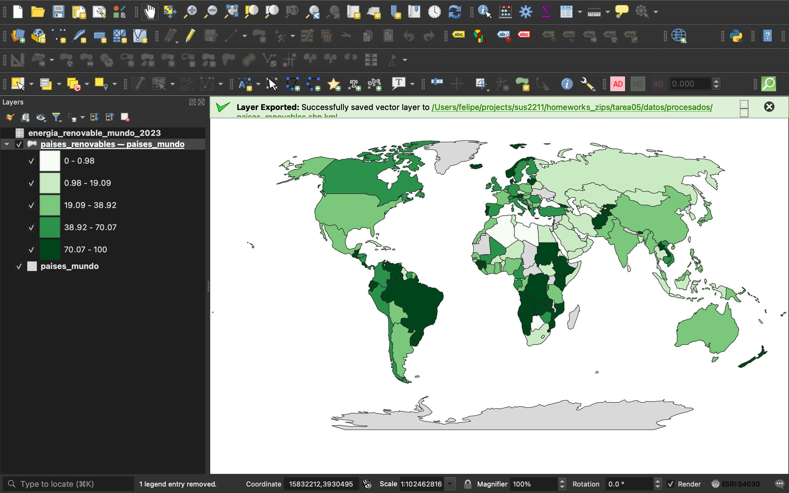{fig-align="center"}
:::

------------------------------------------------------------------------

## Mapa 2: "Descontrol" — Litio y estrés hídrico en Sudamérica {.unnumbered .unlisted}

Ahora pasamos al lado del **"Descontrol"**. La transición hacia energías renovables requiere baterías de litio — y la extracción de litio consume enormes cantidades de agua en zonas que ya enfrentan escasez hídrica. En este mapa visualizaremos la coincidencia entre minas de litio y estrés hídrico en Sudamérica.

::: {.callout-tip title="¿Por qué litio y agua?"}
Chile, Argentina y Bolivia conforman el llamado **"triángulo del litio"**, que concentra más de la mitad de las reservas mundiales. La extracción de litio de salmueras (el método predominante en esta región) requiere bombear salmuera subterránea y evaporarla al sol — un proceso que consume aproximadamente **2 millones de litros de agua por tonelada de litio**. Esto ocurre precisamente en el Desierto de Atacama, uno de los lugares más áridos del planeta.

La paradoja es clara: el mineral que necesitamos para la transición energética limpia se extrae en los lugares que menos pueden permitirse el gasto de agua.
:::

------------------------------------------------------------------------

## Paso 6 | Cargar el shapefile de regiones de Sudamérica

**24.** Añade al mapa el shapefile `sudamerica_admin1.shp`.

**25.** Abre la tabla de atributos y observa las columnas:

-   `GID_0`: código ISO del país (por ejemplo, `CHL`)
-   `GID_1`: código único de la región (por ejemplo, `CHL.2_1` para Antofagasta)
-   `COUNTRY`: nombre del país
-   `NAME_1`: nombre de la región/provincia/estado

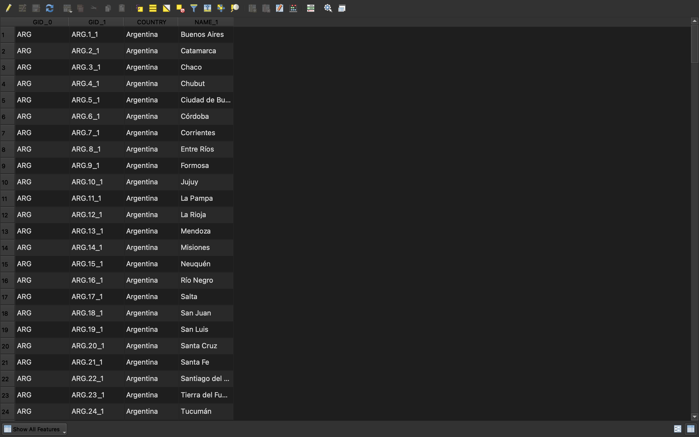{fig-align="center"}

------------------------------------------------------------------------

## Paso 7 | Importar y unir los datos de estrés hídrico

**26.** Importa el archivo `estres_hidrico_sudamerica.csv` como capa de texto delimitado **sin geometría** (misma operación que en el paso 8–10).

**27.** Abre la tabla de atributos de esta nueva tabla y observa las columnas:

-   `GID_1`: código de la región (coincide con el shapefile)
-   `GID_0`: código del país
-   `Pais`: nombre del país
-   `Region`: nombre de la región
-   `Estres_Hidrico`: índice de estrés hídrico (escala de 0 a 5)
-   `Categoria`: categoría del estrés hídrico

::: {.callout-tip title="¿Qué significa el índice de estrés hídrico?"}
El índice proviene del [WRI Aqueduct 4.0](https://www.wri.org/aqueduct) y mide la proporción de agua dulce que se extrae respecto al agua disponible. Las categorías son:

| Puntaje | Categoría | Significado |
|---|---|---|
| 0–1 | Low (<10%) | Baja extracción relativa al recurso disponible |
| 1–2 | Low-Medium (10–20%) | Estrés moderado |
| 2–3 | Medium-High (20–40%) | Estrés significativo |
| 3–4 | High (40–80%) | Alta presión sobre el recurso |
| 4–5 | Extremely High (>80%) | Extracción mayor al 80% del agua disponible |
:::

**28.** Realiza un **join no espacial** entre `sudamerica_admin1` y `estres_hidrico_sudamerica`:

-   **Capa de unión:** `estres_hidrico_sudamerica`
-   **Campo de unión:** `GID_1`
-   **Campo del objeto:** `GID_1`

**29.** Verifica el join abriendo la tabla de atributos de `sudamerica_admin1`. Deberías ver las columnas de estrés hídrico añadidas.

**30.** Exporta la capa unida como GeoPackage a `datos/procesados/` con el nombre `sudamerica_estres.gpkg` (mismo procedimiento que en el paso 16–17).

------------------------------------------------------------------------

## Paso 8 | Simbología graduada: estrés hídrico por región

**31.** En la nueva capa `sudamerica_estres`, configura la simbología:

-   Tipo: **Graduado**
-   Valor: la columna que contiene el índice de estrés hídrico. Recuerda que llevará el prefijo del nombre de la capa de origen (por ejemplo, `estres_hidrico_sudamerica_Estres_Hidrico`). Búscala en la lista desplegable o revisa la tabla de atributos.
-   **5 clases** (para corresponder a las 5 categorías de estrés)
-   Rampa de color: se sugiere una rampa de **rojos o naranjas** (donde más oscuro = más estrés)

**32.** Haz clic en **Clasificar** y luego en **Aceptar**.

::: callout-note
Algunas regiones tienen valor **-9999**, lo que indica que no hay datos disponibles de estrés hídrico para esa región. Estas regiones quedarán fuera de la clasificación graduada.
:::

**33.** Al igual que hicimos con el mapa mundial, convierte la simbología a **"Basado en reglas"** y añade una regla **Else** con etiqueta `Sin información` y color gris (`#d9d9d9`). Esto capturará las regiones con valor -9999 y las mostrará en la leyenda.

**34.** Para visualizar correctamente el mapa de Sudamérica:

-   **Desactiva las capas del Mapa 1** (paises_renovables) en el panel de capas para que no interfieran visualmente.
-   **Haz clic derecho sobre `sudamerica_estres`** y selecciona **"Zum a la capa"** para centrar la vista en Sudamérica.

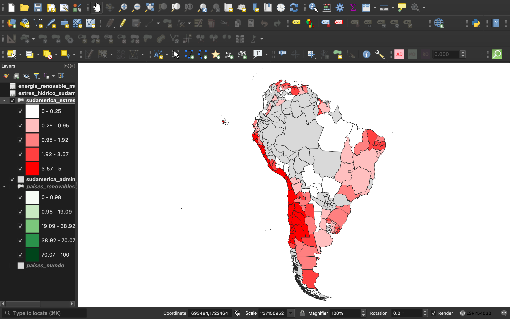{fig-align="center"}

------------------------------------------------------------------------

## Paso 9 | Importar las minas de litio (CSV con coordenadas)

Ahora importaremos la ubicación de las minas de litio. A diferencia de los CSV anteriores, **este archivo sí tiene coordenadas** (latitud y longitud), por lo que lo importaremos como una capa de puntos.

**35.** Ve a **Capa > Añadir Capa > Añadir capa de texto delimitado**.

**36.** En la ventana que se abre:

-   Busca y selecciona el archivo `minas_litio_sudamerica.csv`.
-   En **Definición de geometría**, selecciona **"Coordenadas del punto"**:
    -   **Campo X:** `Longitud`
    -   **Campo Y:** `Latitud`
-   En **SRC de la geometría**, asegúrate de que diga **EPSG:4326 – WGS 84**.

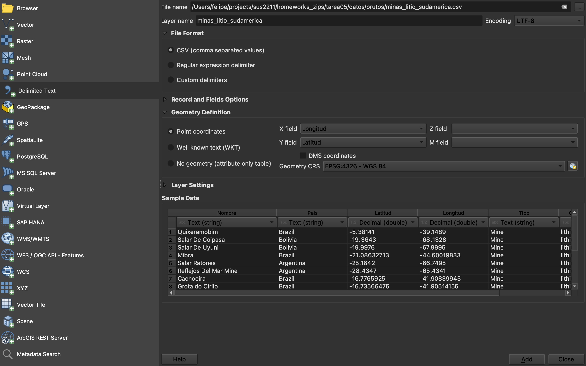{fig-align="center"}

::: callout-warning
Revisa siempre los **Datos de ejemplo** en la parte inferior de la ventana. Si las columnas se ven mezcladas en una sola, prueba cambiar el delimitador (coma, punto y coma, etc.). Además, verifica que la opción **"El separador decimal es la coma"** esté activada si tus coordenadas usan comas como separador decimal.
:::

**37.** Haz clic en **Añadir**.

**38.** Exporta la capa como GeoPackage a `datos/procesados/` con el nombre `minas_litio.gpkg`.

**39.** Ahora configuraremos la simbología de las minas de litio para que se distingan claramente sobre el mapa coroplético de rojos. Haz clic derecho sobre la capa de minas > **Propiedades > Simbología**. La capa ya estará en modo **Símbolo único** — lo que haremos es personalizar el símbolo en detalle:

-   Veras un cuadro donde se puede seleccionar el tipo de marcador. Cambia la forma a **triángulo** seleccionándolo de la galería de formas disponibles.
-   Para configurar en detalle el aspecto del triángula, haz click en la flecha a la izquierda de la vista previa del marcador arriba, y luego sobre el nuevo marcador que se abre abajo a la derecha.
-   **Color de relleno:** haz clic directamente **sobre el cuadro de color** del relleno (no sobre la flecha al lado). En el diálogo de color, escribe `#0000ff` (azul) en la **Notación HTML**. Antes de cerrar, busca el control deslizante de **Opacidad** y bájalo a **60%** — esto añade transparencia al relleno, lo que permite ver cuándo hay minas muy cercanas entre sí (las zonas de superposición se verán más oscuras).
-   **Color del trazo (borde):** haz clic sobre el cuadro de color del trazo y selecciona **negro** (`#000000`). Deja la opacidad al 100%.
-   **Tamaño:** ajusta el tamaño del marcador a un valor que permita ver las minas sin que tapen el mapa — se sugiere probar con **4–6 mm**, pero experimenta hasta encontrar un tamaño adecuado.
-   **Ancho del trazo:** prueba con **0.4 mm** para un borde visible pero no dominante.

Haz clic en **Aceptar** para aplicar.

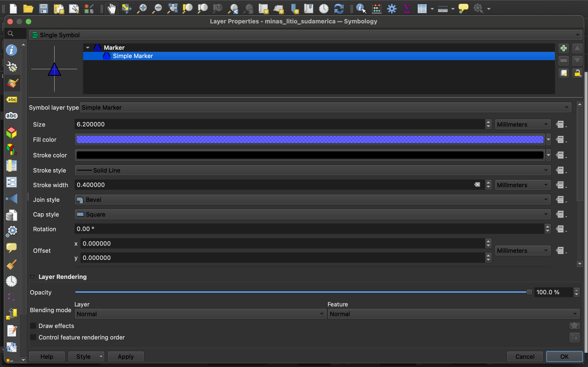{fig-align="center"}

::: {.callout-tip title="Explorando el diálogo de simbología"}
El diálogo de edición de símbolos de QGIS permite controlar muchos aspectos visuales de cada capa. Además de lo que acabamos de configurar (forma, color de relleno, color de borde, tamaño y opacidad), puedes ajustar:

-   **Ángulo de rotación** del marcador (útil para flechas o símbolos direccionales).
-   **Desplazamiento** horizontal y vertical (para mover el símbolo respecto al punto real).
-   **Grosor del trazo** y estilo de línea (sólida, punteada, etc.).
-   **Capas de símbolo** — puedes apilar múltiples formas para crear símbolos compuestos (por ejemplo, un círculo con un punto interior).

Te recomendamos explorar estas opciones por tu cuenta — una buena simbología puede hacer la diferencia entre un mapa confuso y uno que comunica con claridad.
:::

::: callout-note
**PAUSA** — deberías ver las minas de litio sobre el mapa de estrés hídrico. Observa cómo se concentran en las zonas de mayor estrés:

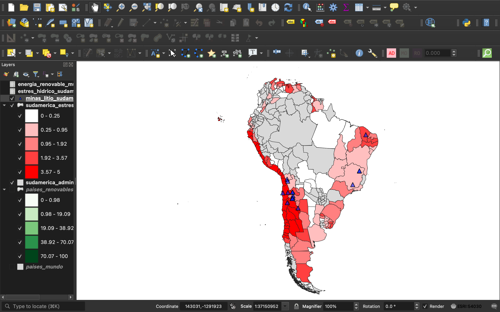{fig-align="center"}
:::
------------------------------------------------------------------------

## Paso 10 | Composición de impresión: díptico "Control y Descontrol"

Ahora crearemos una composición de impresión con **dos mapas lado a lado**: el Mapa 1 ("Control") a la izquierda y el Mapa 2 ("Descontrol") a la derecha.

**40.** Ve a **Proyecto > Nueva composición de impresión**. Asígnale un nombre (por ejemplo, `control_descontrol`).

**41.** Configura la orientación de la página: haz clic derecho sobre la hoja en blanco > **Propiedades de la página** > cambia la orientación a **horizontal** (apaisado). Esto permitirá que los dos mapas quepan lado a lado. Puedes ajustar la altura y el ancho de la pagina también, recomendamos un ancho de 250 milímetros y un alto de 150 milímetros para este mapa, pero siéntete libre de experimentar.

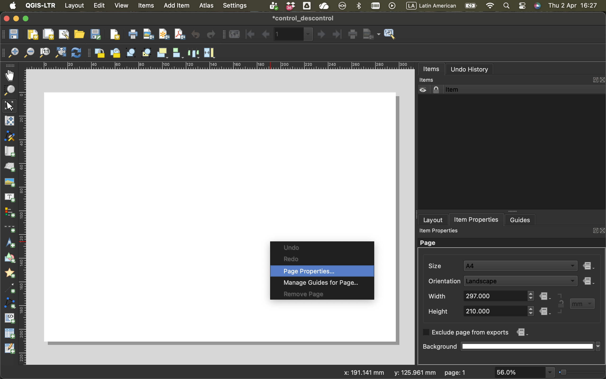{fig-align="center"}

**42.** Añade el **primer mapa** (Control — energías renovables):

-   Antes de añadir este mapa, asegúrate de que en la ventana principal de QGIS estén visibles solo las capas del Mapa 1 (`paises_renovables` con su simbología basada en reglas) y de hacer zoom a la capa.
-   Selecciona **Añadir mapa** en la barra de herramientas.
-   Dibuja un rectángulo en la **mitad izquierda** de la hoja (cuando llegues a la mitad, QGIS automáticamente marcará una línea punteada vertical y te facilitará posicionar el extremo derecho del mapa exactamente en la mitad del lienzo). Dado que el mapa mundi tiene una disposición naturalmente más horizontal, mientras que sudamérica una disposición vertical, puedes ajustar el límite entre ambos mapas hacia la derecha para lograr una composición que minimice las áreas en blanco.


::: {.callout-tip title="Dos mapas en una composición"}
Para que cada marco de mapa muestre capas diferentes, debes **controlar qué capas están visibles** en la ventana principal de QGIS antes de dibujar cada marco. El truco es:

1.  Activa solo las capas del Mapa 1 en el panel de capas.
2.  Añade el primer marco de mapa en la composición.
3.  En las propiedades del marco, marca **"Bloquear capas"** y **"Bloquear estilos de capa"** — así este marco quedará fijo con las capas actuales.
4.  Vuelve a la ventana principal, desactiva las capas del Mapa 1 y activa las del Mapa 2.
5.  Añade el segundo marco de mapa.
:::

**43.** Puedes ajustar el tamaño de cada mapa dentro del lienzo haciendo click en cada map, y luego ajustando el zoom con el mouse. Para un control más fino, ajusta el número en Escala en la pestaña de propiedades del mapa. Mientras más pequeño el número, más zoom. Una vez que encuentres el tamaño apropiado, puedes desplazarte dentrol del mapa con la opción de mover contenido del item (hoja con flechas hacia las cuatro cordenadas en la barra de herramientas). 


**44.** En las propiedades del primer marco de mapa (panel derecho), marca la opción **"Bloquear capas"** para que este mapa no cambie al modificar la vista principal.

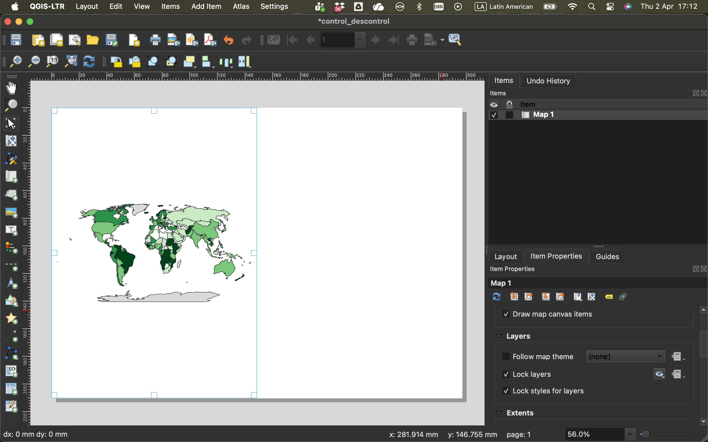{fig-align="center"}

**45.** Ahora vuelve a la ventana principal de QGIS. Desactiva las capas del Mapa 1 y activa las capas del Mapa 2 (estrés hídrico + minas de litio).

**47.** Regresa a la composición de impresión y añade el **segundo mapa** dibujando un rectángulo en la **mitad derecha** de la hoja.

**48.** Completa la composición añadiendo:

-   **Títulos:** "Control" sobre el mapa izquierdo, "Descontrol" sobre el derecho (usa **Añadir etiqueta**). Los títulos pueden tener su propio marco si lo deseas. Ten en cuenta que si tu mapa será insertado dentro de un documento (por ejemplo, un informe o un artículo), el título puede ser innecesario — en ese caso, el título de la figura en el documento cumple esa función.
-   **Leyendas:** una para cada mapa (ver instrucciones detalladas en el recuadro de abajo).
-   **Barra de escala (opcional):** en este caso, dado que Sudamérica es una región cuya escala es conocida en nuestro contexto, la barra de escala no es estrictamente necesaria. Sin embargo, si tu mapa será presentado ante un público no familiarizado con la región (por ejemplo, en una conferencia en China), la barra de escala se vuelve indispensable para que el lector pueda interpretar las distancias correctamente.
-   **Flecha del Norte (opcional):** aplica el mismo criterio — en un mapa de Sudamérica orientado al norte, la orientación es evidente para un público local, pero puede ser necesaria en otros contextos.

::: {.callout-tip title="Configuración detallada de la leyenda"}

Al añadir una leyenda (**Añadir leyenda** en la barra de herramientas), QGIS creará una leyenda automática que incluye todas las capas visibles. Para que quede profesional, sigue estos pasos en el panel de **Propiedades del elemento** (a la derecha):

1.  **Desmarcar "Actualizar automáticamente":** esto te permite editar la leyenda manualmente. Usa el botón **"-"** para eliminar capas que no quieres mostrar (por ejemplo, el mapa base o capas auxiliares) y el botón de edición (lápiz) para renombrar las entradas.

2.  **Título de la leyenda:** reemplaza el título genérico por uno informativo. Por ejemplo, para el Mapa 1: `% renovable en matriz energética`. Alternativamente, puedes dejar el título vacio y editar los nombres de las capas para que sirvan como título de sus ítems respectivos.

3.  **Columnas:** en la sección de configuración de columnas, prueba con **3 columnas** para distribuir las clases horizontalmente en el mapa mundi. Marca las opciones **"Igual ancho de columna"** y **"Dividir capas"** — esto permite que las clases de una misma capa se repartan entre columnas. Esta configuración es especialmente útil si quieres que la leyenda sea más ancha que alta (por ejemplo, para que calce con el ancho del mapa mundi).

4.  **Desmarcar "Redimensionar para ajustar al contenido":** esto te permite ajustar manualmente el tamaño de la caja de la leyenda, en vez de que QGIS lo haga automáticamente. Así puedes hacer que la leyenda tenga exactamente el mismo ancho que el mapa que está arriba.

5.  **Desmarcar "Fondo":** desactiva la casilla de fondo (background) de la leyenda para que no aparezca un rectángulo blanco detrás que interfiera visualmente con el marco del mapa.

6.  **Marco (opcional):** en la sección **Marco**, puedes activar la casilla para añadir un borde a la leyenda. En muchos casos la leyenda se ve más limpia **sin marco** — especialmente si ya está bien posicionada junto al mapa. Si decides añadirlo, ajusta el **grosor de la línea** a un valor más delgado que el marco del mapa (por ejemplo, **0.2 mm** si el mapa tiene **0.4 mm**) — esto establece una jerarquía visual donde el mapa es el elemento principal y la leyenda es un elemento secundario.

:::

**49.** Exporta la composición como imagen a `resultados/mapas/` con resolución de **300 ppp**.

------------------------------------------------------------------------

## Resultado final

Tu composición final debería verse algo así (con tu propia elección de colores):

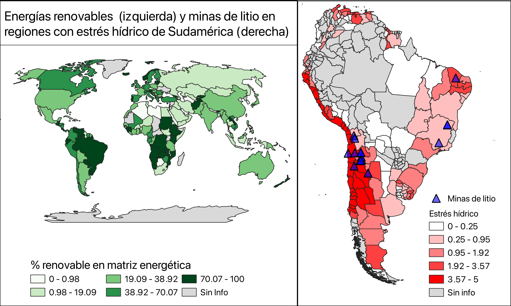{fig-align="center"}

¡Listo! Has finalizado tu mapa. Recuerda completar esta actividad y guardarla para la entrega de tu próximo portafolio.

------------------------------------------------------------------------

## Preguntas guía para reflexión

::: {.callout-important title="Preguntas guía para reflexión"}
-   **Control:** ¿En qué regiones del mundo la transición energética está más avanzada? ¿Dónde se encuentra Chile en el panorama global de energías renovables? ¿Te sorprende?
-   **Descontrol:** Observando tu mapa de Sudamérica, ¿dónde se concentran las minas de litio? ¿Coinciden con zonas de alto estrés hídrico? ¿Qué implicancias tiene esto para las comunidades locales?
-   **La paradoja:** La transición hacia energías limpias requiere minerales cuya extracción tiene impactos ambientales significativos. ¿Cómo se relaciona esto con el concepto de **"Control y Descontrol"** discutido en clases? ¿Podemos decir que las energías renovables son completamente "limpias"?
-   **Justicia ambiental:** ¿Quiénes se benefician de la transición energética (usuarios de autos eléctricos, países desarrollados) y quiénes asumen los costos ambientales (comunidades del Salar de Atacama, pueblos originarios)? ¿Ves un paralelo con la discusión de justicia climática de la tarea anterior?
:::
