## Objetivo

El objetivo de esta práctica es analizar la **exposición de población vulnerable a depósitos de relaves mineros** en la Región de Coquimbo. Crearás dos mapas: el primero muestra qué distritos censales se encuentran dentro de una zona de influencia de 5 km alrededor de los relaves; el segundo muestra cuántos niños de 0 a 5 años viven en esos distritos expuestos.

**Herramientas por aprender:**

-   Instalación de complementos (QuickMapServices) y uso de mapa base en escala de grises
-   Selección por localización (filtro espacial)
-   Reproyección a un CRS proyectado (EPSG:32719 — UTM zona 19S)
-   Zona de influencia (buffer)
-   Unión espacial (Join Attributes by Location)
-   Eliminación de duplicados por atributo (Delete Duplicates by Attribute)
-   Símbolos proporcionales con expresión SQL (CASE)
-   Calculadora de campos (Field Calculator)
-   Simbología categorizada con expresión
-   Composición de impresión en díptico horizontal con extensión idéntica entre mapas

------------------------------------------------------------------------

## Preparación: descarga y organización del material

### Descarga desde Canvas

**1.** Descarga el archivo `.zip` de esta tarea desde la página del curso en **Canvas** (carpeta "Clase 6"). El archivo contiene todas las capas necesarias para el ejercicio.

**2.** Descomprime el archivo en una ubicación dedicada a este curso. Algunas opciones:

-   **Computador personal:** descomprime dentro de tu carpeta `SUS2211/`.
-   **Computador de la sala:** descomprime en el escritorio o en Documentos, pero **antes de terminar la sesión**, copia toda la carpeta a OneDrive, un pendrive u otro servicio en la nube.

::: callout-warning
**¡Importante!** Los computadores de la sala de clases se **borran automáticamente cada semana**. Si trabajas en un computador de la universidad, guarda siempre una copia en **OneDrive** (u otro servicio en la nube) o en un pendrive antes de salir. De lo contrario, perderás todo tu avance.
:::

------------------------------------------------------------------------

### Estructura de carpetas del proyecto

Al descomprimir el archivo, encontrarás la misma estructura de carpetas que hemos usado en las clases anteriores:

```{mermaid}
flowchart TD
    A["📁 clase6/"] --> B["📁 datos/"]
    A --> C["📁 documentos/"]
    A --> D["📁 proyectos/"]
    A --> E["📁 resultados/"]

    B --> F["📁 brutos/<br>🔒 datos originales<br>(no modificar)"]
    B --> G["📁 intermedios/<br>datos de geoprocesamiento"]
    B --> H["📁 procesados/<br>capas finales para mapeo"]

    E --> I["📁 mapas/<br>mapas exportados"]
    E --> J["📁 figuras/<br>gráficos y tablas"]

    style F fill:#fde8e8,stroke:#c0392b
    style G fill:#fef9e7,stroke:#f39c12
    style H fill:#eafaf1,stroke:#27ae60
    style D fill:#eaf4fb,stroke:#2980b9
    style C fill:#f4f6f7,stroke:#7f8c8d
```

------------------------------------------------------------------------

### Material descargado

Al descomprimir el archivo, encontrarás los siguientes archivos dentro de la carpeta **`datos/brutos`**:

| Archivo | Descripción |
|---|---|
| `CDR 2023.shp` (+ .shx, .dbf, .prj, .cpg) | Catastro de Depósitos de Relaves de Chile (795 puntos a nivel nacional) |
| `Comunas de R.Coquimbo.shp` (+ .shx, .dbf, .prj, .cpg) | Polígonos de las 15 comunas de la Región de Coquimbo |
| `Distritos Censales R.Coquimbo.shp` (+ .shx, .dbf, .prj, .cpg) | Polígonos de los 208 distritos censales de la Región de Coquimbo (con datos de población) |

::: {.callout-tip title="¿De dónde vienen estos datos?"}
-   **Depósitos de relaves (CDR):** [SERNAGEOMIN](https://www.sernageomin.cl/) — Catastro de Depósitos de Relaves 2023, que registra todos los depósitos de relaves mineros de Chile (activos, inactivos, abandonados y en construcción).
-   **Comunas de Coquimbo:** [IDE Chile](https://www.ide.cl/) — División político-administrativa de la Región de Coquimbo.
-   **Distritos censales:** [INE](https://www.ine.gob.cl/) — Distritos censales del Censo 2017, con datos de población total y porcentaje de niños de 0 a 5 años.
:::

------------------------------------------------------------------------

## ¡Empecemos! {.unnumbered .unlisted}

## Mapa 1: "¿Dónde están las amenazas?" {.unnumbered .unlisted}

En este primer mapa identificaremos qué distritos censales de la Región de Coquimbo se encuentran dentro de una **zona de influencia de 5 km** alrededor de los depósitos de relaves, y visualizaremos el **tamaño relativo** de cada relave según su volumen autorizado.

::: {.callout-tip title="¿Qué es un depósito de relaves?"}
Un **depósito de relaves** (o tranque de relaves) es una estructura donde se almacenan los desechos sólidos y líquidos de la minería — el material que queda después de extraer el mineral valioso de la roca. Estos depósitos contienen **metales pesados, ácidos y otros contaminantes** que pueden filtrarse al suelo y al agua subterránea, o dispersarse por el viento como polvo tóxico.

Chile tiene **más de 700 depósitos de relaves** registrados, muchos de ellos inactivos o abandonados sin un plan de cierre adecuado. La Región de Coquimbo es una de las más afectadas, con más de 400 relaves. La pregunta clave es: **¿cuánta gente vive cerca de estos depósitos?**
:::

------------------------------------------------------------------------

## Paso 1 | Crear el proyecto y cargar las capas

**3.** Inicia QGIS y crea un proyecto nuevo. Guárdalo en la carpeta `proyectos/` con un nombre adecuado (por ejemplo, `clase6`).

**4.** Añade al mapa las tres capas arrastrándolas al panel de capas (o usando **Capa > Añadir Capa > Añadir capa vectorial**):

-   `CDR 2023.shp` — puntos de relaves (todo Chile)
-   `Comunas de R.Coquimbo.shp` — polígonos de comunas
-   `Distritos Censales R.Coquimbo.shp` — polígonos de distritos censales

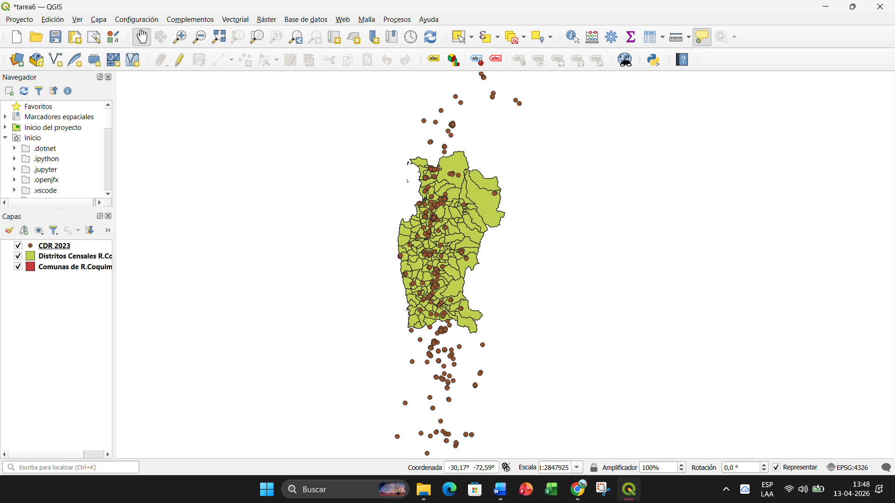{fig-align="center"}

------------------------------------------------------------------------

## Paso 2 | Instalar QuickMapServices y añadir mapa base

Añadiremos un **mapa base** (basemap) que proporcione contexto geográfico — carreteras, ciudades, línea de costa — sin competir visualmente con los datos temáticos.

**5.** Ve a **Complementos > Administrar e instalar complementos**. En la barra de búsqueda, escribe `QuickMapServices` y haz clic en **Instalar complemento**.

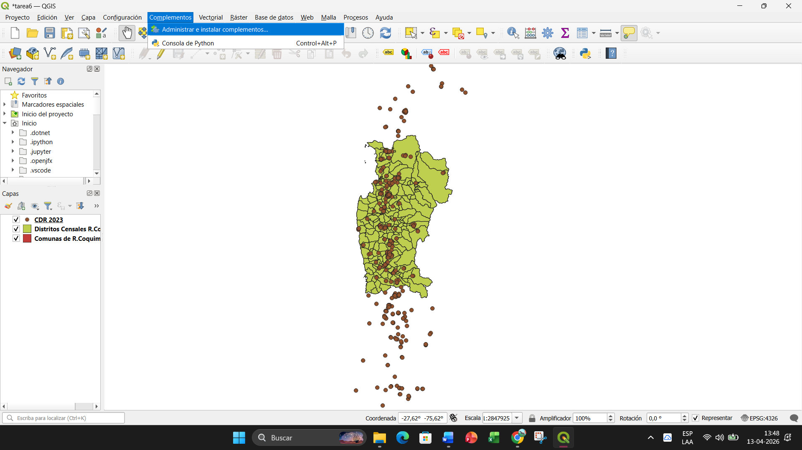{fig-align="center"}

::: {.callout-tip title="¿Qué son los complementos (plugins) de QGIS?"}
QGIS es un software de **código abierto** desarrollado por una comunidad global de voluntarios, investigadores, empresas y organizaciones. Una de sus mayores fortalezas es su sistema de **complementos** (plugins): módulos adicionales que cualquier persona puede desarrollar y compartir para extender las capacidades del programa.

**¿Cómo funcionan?** Los complementos se instalan desde el **Administrador de complementos** (**Complementos > Administrar e instalar complementos**). Allí encontrarás un repositorio con cientos de complementos disponibles, organizados por categoría, con descripciones y valoraciones de la comunidad. Instalar uno es tan simple como buscarlo y hacer clic en "Instalar" — QGIS se encarga del resto.

**¿Quién los desarrolla?** La mayoría son desarrollados por miembros de la comunidad GIS: académicos, consultores, agencias gubernamentales y empresas. Algunos los desarrolla el propio equipo de QGIS. Cualquier persona con conocimientos de programación en Python puede crear y publicar su propio complemento.

**Algunos complementos destacados:**

| Complemento | ¿Para qué sirve? |
|---|---|
| [**QuickMapServices**](https://plugins.qgis.org/plugins/quick_map_services/) | Añadir mapas base (OpenStreetMap, Google, Bing, etc.) con un clic — el que estamos usando ahora. |
| [**QuickOSM**](https://plugins.qgis.org/plugins/QuickOSM/) | Descargar datos de OpenStreetMap directamente a QGIS (por ejemplo, todas las escuelas o ríos de una comuna). |
| [**QGIS2Web**](https://plugins.qgis.org/plugins/qgis2web/) | Exportar tu mapa como una página web interactiva (con Leaflet o OpenLayers), sin necesidad de programar. |
| [**Semi-Automatic Classification Plugin (SCP)**](https://plugins.qgis.org/plugins/SemiAutomaticClassificationPlugin/) | Clasificar imágenes satelitales (Landsat, Sentinel) para detectar uso de suelo, deforestación, expansión urbana, etc. |
| [**dzetsaka**](https://plugins.qgis.org/plugins/dzetsaka/) | Clasificación de imágenes satelitales con algoritmos de machine learning. |

Los complementos son uno de los motivos por los que QGIS compite con software comercial como ArcGIS: la comunidad agrega funcionalidades constantemente, y al ser gratuito y abierto, cualquiera puede adaptarlo a sus necesidades. A lo largo del curso instalaremos otros complementos según los necesitemos.
:::

**6.** Una vez instalado, ve a **Web > QuickMapServices > Settings**. En la pestaña **"More services"**, haz clic en **"Get contributed pack"** para descargar paquetes adicionales de mapas base. Cierra la ventana de configuración.

**7.** Ahora añade el mapa base: **Web > QuickMapServices > OSM > OSM Standard**.

**8.** En el panel de capas, arrastra la capa `OSM Standard` al **fondo** (debajo de todas las demás capas).

**9.** Para que el mapa base no distraiga visualmente de los datos temáticos, lo convertiremos a **escala de grises** con transparencia:

-   Haz clic derecho sobre la capa `OSM Standard` > **Propiedades**.
-   Ve a la pestaña **Simbología**.
-   En la sección **Representación de capas** (al final del panel), busca la opción **Escala de grises** y selecciona **"Por luminosidad"**.
-   Ve a la pestaña **Opacidad**.
-   Ajusta la **Opacidad global** a un valor entre **40% y 50%** (arrastra el deslizador o escribe el valor).
-   Haz clic en **Aceptar**.

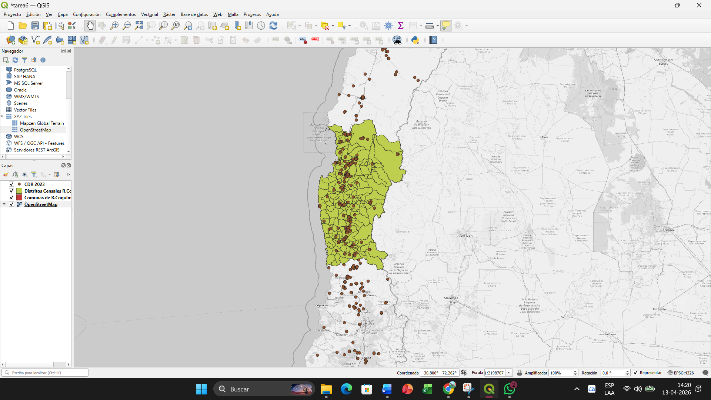{fig-align="center"}

::: {.callout-tip title="¿Por qué escala de grises?"}
Un mapa base a todo color compite visualmente con los datos temáticos — los colores del basemap se confunden con los colores de la simbología. Al convertirlo a escala de grises y reducir su opacidad, el mapa base **proporciona contexto** (carreteras, nombres de ciudades, relieve) **sin ruido visual**. Este es un principio fundamental de cartografía temática: los datos temáticos deben ser el elemento más prominente del mapa.
:::

------------------------------------------------------------------------

## Paso 3 | Explorar las tablas de atributos

**10.** Haz clic derecho sobre `CDR 2023` > **Abrir tabla de atributos**. Observa las columnas más relevantes:

-   `NOMBRE_FAE`: nombre del depósito de relaves
-   `VOL_AUTORI`: volumen autorizado (en metros cúbicos). **Nota:** algunos registros tienen el valor `S/I` (sin información) en vez de un número.
-   `ESTADO_INS`: estado del depósito (Activo, Inactivo, Abandonado, En Construcción, En Revisión)

::: {.callout-tip title="¿Qué es el volumen autorizado?"}
El **volumen autorizado** (`VOL_AUTORI`) es la capacidad máxima de almacenamiento aprobada por SERNAGEOMIN para un depósito de relaves, expresada en metros cúbicos (m³). Un relave con un volumen autorizado de 1.500.000.000 m³ (1.500 millones) es enormemente más grande que uno de 40.000 m³. Esta variable nos permitirá representar los relaves con **símbolos proporcionales** — los más grandes se verán más grandes en el mapa.
:::

**11.** Abre también la tabla de atributos de `Distritos Censales R.Coquimbo` y observa:

-   `Poblacion`: población total del distrito censal
-   `Pct_Ninos`: porcentaje de niños de 0 a 5 años respecto a la población total
-   `NOM_COMUNA`: nombre de la comuna a la que pertenece el distrito

::: callout-note
Fíjate en que el shapefile de distritos tiene `Poblacion` (número total de personas) y `Pct_Ninos` (porcentaje de niños de 0–5 años), pero **no tiene** el número absoluto de niños. Más adelante, usaremos la **Calculadora de Campos** para calcular ese valor.
:::

------------------------------------------------------------------------

## Paso 4 | Seleccionar por localización: filtrar relaves a Coquimbo

La capa `CDR 2023` contiene los relaves de **todo Chile** (795 puntos). Necesitamos quedarnos solo con los de la Región de Coquimbo. Para eso usaremos una **selección por localización** — una herramienta que selecciona entidades de una capa según su relación espacial con otra capa.

**12.** Ve a **Vector > Herramientas de investigación > Seleccionar por localización**.

**13.** En la ventana que se abre, configura:

-   **Seleccionar entidades de:** `CDR 2023` (la capa de relaves)
-   **Donde las entidades (predicado geométrico):** marca **"intersectan"**
-   **Comparándolas con las entidades de:** `Comunas de R.Coquimbo` (la capa de comunas que define el límite regional)
-   **Modificar la selección actual por:** Crear nueva selección

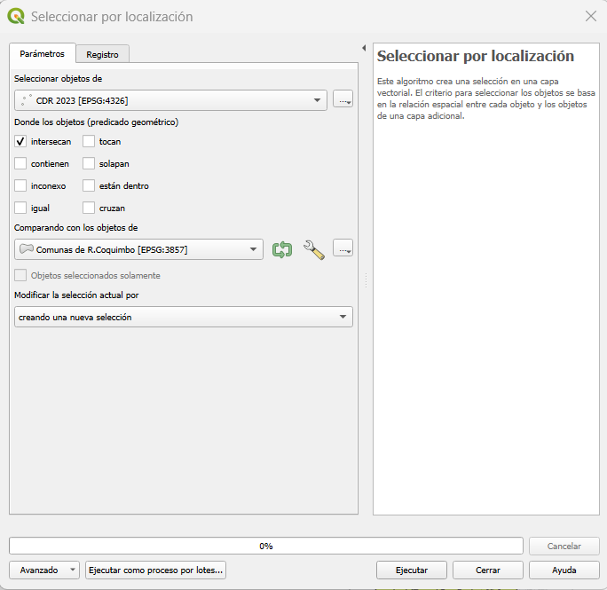{fig-align="center"}


**14.** Haz clic en **Ejecutar** y luego cierra la ventana. Verás que en el mapa se resaltaron los relaves que se encuentran dentro de la Región de Coquimbo (deberían ser **406 puntos** seleccionados — puedes verificarlo en la barra de título de la tabla de atributos).

::: {.callout-tip title="¿Qué es Seleccionar por localización?"}
**Seleccionar por localización** es una operación que filtra entidades de una capa según su **relación espacial** con entidades de otra capa. Los predicados geométricos más comunes son:

-   **Intersectan:** la entidad toca o se superpone con la otra capa (el más usado).
-   **Están dentro de:** la entidad está completamente contenida dentro de la otra.
-   **Contienen:** la entidad contiene completamente a la otra.

En nuestro caso, estamos seleccionando los **puntos de relaves que intersectan** (es decir, caen dentro de) **los polígonos de las comunas de Coquimbo**. Es como poner un "molde" sobre el mapa y quedarnos solo con los puntos que caen dentro.
:::

**15.** Ahora exportaremos solo los relaves seleccionados como una nueva capa. Haz clic derecho sobre `CDR 2023` > **Exportar > Guardar objetos seleccionados como...**

-   **Formato:** GeoPackage
-   **Nombre de archivo:** navega a `datos/intermedios/` y nómbralo `Relaves_Coquimbo.gpkg`
-   Haz clic en **Aceptar**.

La nueva capa `Relaves_Coquimbo` aparecerá en el panel de capas con solo los 406 relaves de la región. Puedes desactivar o eliminar la capa `CDR 2023` original.

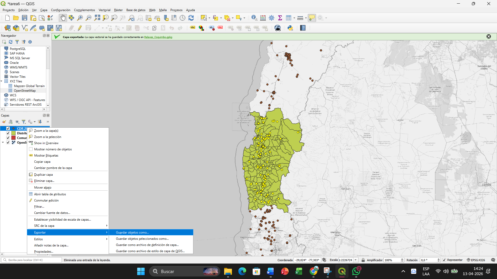{fig-align="center"}

------------------------------------------------------------------------

## Paso 5 | Símbolos proporcionales: tamaño según volumen autorizado

Ahora haremos que cada punto de relave tenga un **tamaño proporcional** a su volumen autorizado — así los relaves más grandes se verán más grandes en el mapa.

**16.** Haz clic derecho sobre `Relaves_Coquimbo` > **Propiedades > Simbología**.

**17.** Mantén el tipo de simbología en **Símbolo único**. Haz clic sobre el triángulo a la izquierda del símbolo, y luego sobre el segundo símbolo que se despliega abajo a la derecha, para editarlo:

-   Cambia el **color de relleno** a rojo oscuro (`#990000 `) - puedes darle una opacidad del 50% para que se aprecien los relaves pequeños cercanos a relaves más grandes.
-   Cambia el **color del trazo** a negro (`#000000`) - también puede ser un rojo más oscuro, experimenta.

**18.** Ahora haremos que el **tamaño** del símbolo varíe según el volumen autorizado. Busca el campo **Tamaño** y haz clic en el botón de **Anulación definida por datos** (el pequeño icono a la derecha del campo de tamaño) > **Asistente**.

En el Asistente de tamaño:

-   **Fuente:** haz clic en el botón de **expresión** (ε) e ingresa la siguiente expresión:

```sql
CASE
  WHEN "VOL_AUTORI" = 'S/I' THEN NULL
  ELSE to_real("VOL_AUTORI")
END
```

-   **Valores desde:** `0` **hasta:** `1.500.000.000`
-   **Tamaño desde:** `1` **hasta:** `12` (mm) - puedes aumentar o disminuir este valor hasta alcanzar un tamaño apropiado
-   Selecciona el método de escala **"Flannery"** (diseñado específicamente para símbolos proporcionales — corrige la tendencia humana a subestimar el tamaño de los círculos).

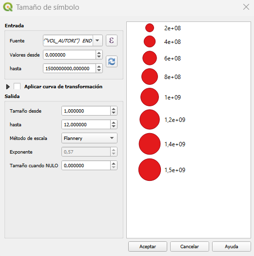{fig-align="center"}

**19.** Haz clic en **Aceptar** para cerrar el asistente, y luego en **Aceptar** nuevamente para aplicar la simbología.

::: {.callout-tip title="¿Qué hace la expresión CASE?"}
La columna `VOL_AUTORI` contiene **texto**, no números — y algunos registros tienen el valor `S/I` (sin información). Si intentamos usar esta columna directamente para el tamaño, QGIS no sabrá qué hacer con `S/I` y producirá un error.

La expresión `CASE` funciona como un "si/entonces":

-   **WHEN** `"VOL_AUTORI" = 'S/I'` → devuelve `NULL` (sin valor, así QGIS dibuja un punto de tamaño mínimo).
-   **ELSE** → convierte el texto a número (`to_real`) para que QGIS pueda usarlo como tamaño.

Esto es equivalente a un `IF` en Excel: `=SI(A1="S/I", "", VALOR(A1))`.
:::

::: {.callout-tip title="Radio, área o Flannery: ¿cómo escalar símbolos proporcionales?"}
Cuando representamos una variable cuantitativa con el **tamaño** de un círculo, hay una decisión de diseño que no es trivial: ¿qué propiedad geométrica del círculo debe ser proporcional al dato — el **radio** o el **área**?

**Escalar por radio (lineal):** si un relave tiene 4 veces más volumen que otro, su círculo tendrá 4 veces más radio. Pero como el área de un círculo crece con el cuadrado del radio ($A = \pi r^2$), el círculo grande tendrá **16 veces** más área visual. Resultado: las diferencias se **exageran** enormemente. Un lector casual pensará que la diferencia entre ambos relaves es mucho mayor de lo que realmente es.

**Escalar por área (matemáticamente correcto):** si un relave tiene 4 veces más volumen, su círculo tendrá 4 veces más área (y solo 2 veces más radio). Esto es geométricamente correcto, pero la investigación en percepción visual muestra que **los humanos subestimamos sistemáticamente el tamaño de los círculos grandes**. En los años 1960, el psicólogo Stanley Stevens formuló la [ley de potencia de Stevens](https://en.wikipedia.org/wiki/Stevens%27s_power_law), que describe cómo percibimos magnitudes físicas. Para áreas de círculos, Stevens encontró que la magnitud percibida crece aproximadamente como $\text{valor}^{0.87}$ — es decir, un círculo con el doble de área nos *parece* solo ~1.83 veces más grande. Resultado: las diferencias se **subestiman**.

**La corrección de Flannery (el punto medio):** en 1971, el cartógrafo James Flannery propuso una solución basada en experimentos de percepción con lectores de mapas reales. Su método usa un exponente de **0.5716** (en vez de 0.5 para área pura) para calcular el radio a partir del dato. Esto produce círculos ligeramente más grandes que el escalado por área pura, compensando la subestimación perceptual. Es el método que seleccionamos en el Asistente de tamaño de QGIS.

En resumen:

| Método | Exponente del radio | Efecto visual |
|---|---|---|
| **Lineal (por radio)** | 1.0 | Exagera las diferencias |
| **Por área** | 0.5 | Subestima las diferencias (matemáticamente correcto, perceptualmente no) |
| **Flannery** | 0.5716 | Compensación perceptual — el lector percibe las diferencias de forma más fiel al dato |

No existe una respuesta "perfecta" — cada método implica un compromiso. Pero Flannery es ampliamente considerado el mejor balance entre exactitud matemática y percepción humana, y por eso es la opción recomendada para mapas de símbolos proporcionales.
:::

::: callout-note
**PAUSA** — deberías ver algo así: los relaves de Coquimbo con tamaños proporcionales a su volumen autorizado, sobre un mapa base en escala de grises.

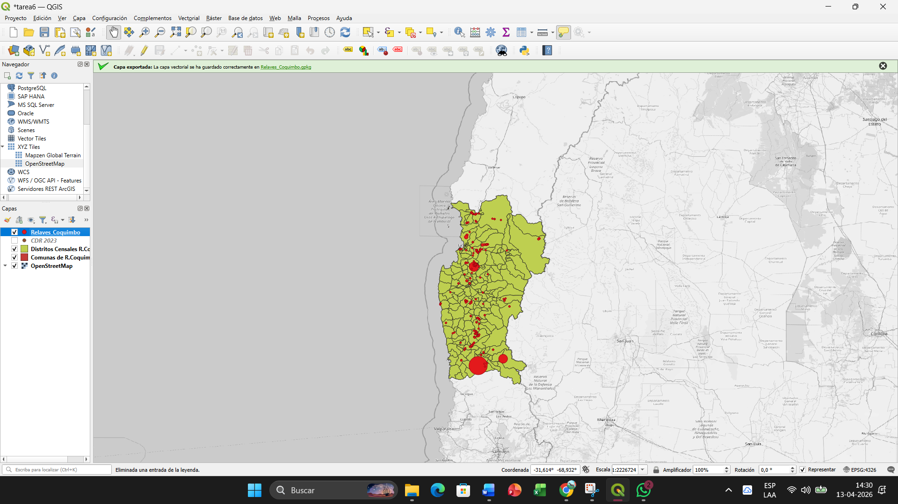{fig-align="center"}
:::

------------------------------------------------------------------------

## Paso 6 | Reproyectar a un CRS proyectado

Para crear una zona de influencia (buffer) de **5 kilómetros**, necesitamos que las capas estén en un **sistema de coordenadas proyectado** que use metros como unidad de distancia. La capa actual usa coordenadas geográficas (grados), lo que no permite medir distancias en metros directamente.

**20.** Ve a **Vector > Herramientas de gestión de datos > Reproyectar capa**.

**21.** En la ventana que se abre:

-   **Capa de entrada:** `Relaves_Coquimbo`
-   **SRC de destino:** haz clic en el botón del globo y busca `32719`. Selecciona **EPSG:32719 – WGS 84 / UTM zone 19S**.
-   **Reproyectado:** haz clic en los tres puntos (`...`), selecciona **Guardar en archivo**, navega a `datos/intermedios/` y guárdalo como `Relaves_Coquimbo_UTM.gpkg`.

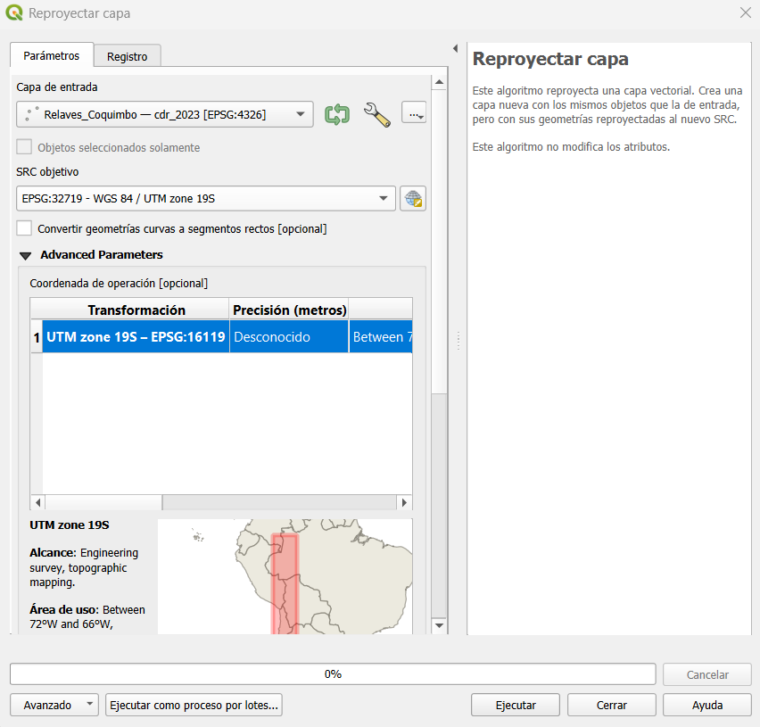{fig-align="center"}

**22.** Haz clic en **Ejecutar**.

::: {.callout-tip title="¿Por qué reproyectar?"}
Los sistemas de coordenadas geográficas (como **WGS 84 / EPSG:4326**) representan ubicaciones en **grados** de latitud y longitud sobre una esfera. Esto es ideal para almacenar posiciones, pero **no para medir distancias** — un grado de longitud equivale a distancias diferentes según la latitud.

Los sistemas de coordenadas **proyectadas** (como **EPSG:32719 — UTM zona 19S**) transforman la superficie curva de la Tierra a un plano y usan **metros** como unidad. Esto permite calcular distancias, áreas y buffers en unidades métricas reales.

¿Por qué **UTM zona 19S** y no otro CRS proyectado? El sistema **UTM** (Universal Transverse Mercator) divide el mundo en 60 franjas verticales de 6° de longitud, y cada franja tiene su propia proyección optimizada para minimizar la distorsión en esa zona. La Región de Coquimbo (aproximadamente entre 70° y 71° oeste) cae dentro de la **zona 19S** (hemisferio sur). Al usar un CRS UTM local, las distancias calculadas (como nuestro buffer de 5 km) serán mucho más precisas que con una proyección global como Pseudo-Mercator (EPSG:3857), que distorsiona significativamente las distancias fuera del ecuador.

**Regla práctica:** siempre que necesites hacer una operación basada en distancia (buffer, cálculo de área, medición), reproyecta primero a un CRS proyectado que use metros.
:::

------------------------------------------------------------------------

## Paso 7 | Crear zona de influencia (buffer) de 5 km

Ahora crearemos un **buffer** (zona de influencia) de 5 kilómetros alrededor de cada relave. Esto representará el área potencialmente afectada por la proximidad a un depósito de relaves.

**23.** Ve a **Vector > Herramientas de geoprocesamiento > Buffer**.

**24.** En la ventana de configuración:

-   **Capa de entrada:** `Relaves_Coquimbo_UTM` (la capa reproyectada)
-   **Distancia:** `5000` metros (= 5 km)
-   **Segmentos:** `5` (controla la suavidad del círculo — 5 es suficiente)
-   **Disolver resultado:** **Sí** (marca la casilla). Esto fusionará los buffers que se superponen en un solo polígono, en vez de tener 406 círculos individuales.
-   **Buffer:** haz clic en los tres puntos (`...`), selecciona **Guardar en archivo**, navega a `datos/intermedios/` y guárdalo como `Buffer_5km_Relaves.gpkg`.

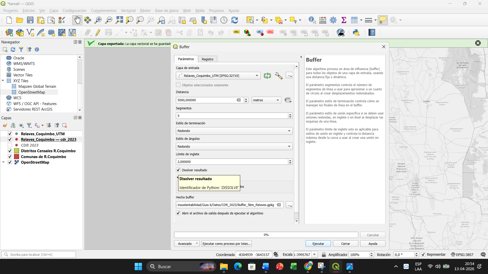{fig-align="center"}

**25.** Haz clic en **Ejecutar**.

**26.** Verás aparecer en el mapa una nueva capa con la zona de influencia — un polígono que rodea todos los relaves de Coquimbo a 5 km de distancia.

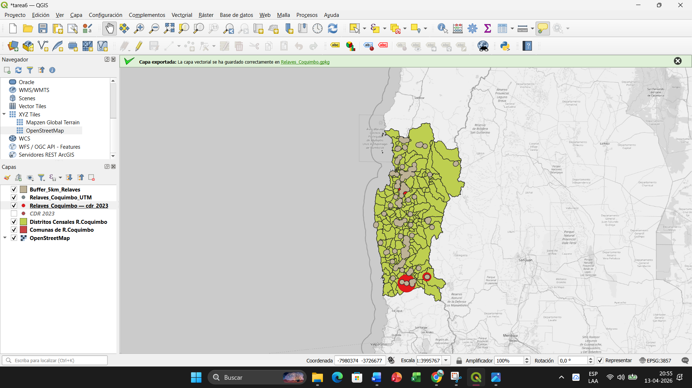{fig-align="center"}

::: callout-note
Si el buffer se ve deformado o no parece tener 5 km, verifica que usaste la capa **reproyectada** (EPSG:32719) como entrada. Si usaste la capa original en coordenadas geográficas, el buffer se calculará en grados y no en metros.
:::

------------------------------------------------------------------------

## Paso 8 | Unión espacial: identificar distritos expuestos

Ahora identificaremos qué **distritos censales** se encuentran dentro (o tocan) la zona de influencia de 5 km. Para esto usaremos una **unión espacial** (spatial join), que vincula dos capas según su relación geográfica.

::: {.callout-tip title="¿Qué es una unión espacial?"}
Una **unión espacial** (spatial join) vincula dos capas según su **relación geográfica** — a diferencia del join no espacial de la Tarea 5, que usaba un campo en común (como el código ISO). Aquí estamos preguntando: "¿qué distritos censales **tocan o se superponen** con la zona de influencia de 5 km?"

El resultado es una nueva capa donde cada distrito conserva todos sus atributos originales **más** los atributos de la capa con la que intersecta. Los distritos que no intersectan quedan con valores NULL en las columnas nuevas — esto es precisamente lo que nos permite clasificarlos como "expuestos" o "no expuestos".
:::

**27.** Ve a **Vector > Herramientas de gestión de datos > Unir atributos por localización** (Join Attributes by Location).

**28.** En la ventana que se abre:

-   **Capa de entrada:** `Distritos Censales R.Coquimbo` (los polígonos de distritos)
-   **Predicado geométrico:** marca **"intersectan"**
-   **Unir capa:** `Buffer_5km_Relaves` (la zona de influencia)
-   **Campos a añadir:** Selecciona solo la columna ID.
-   **Tipo de unión:** Seleccionar la opción por defecto (one-to-many);
-   **Unido:** haz clic en los tres puntos (`...`), selecciona **Guardar en archivo**, navega a `datos/intermedios/` y guárdalo como `Distritos_Join.gpkg`.

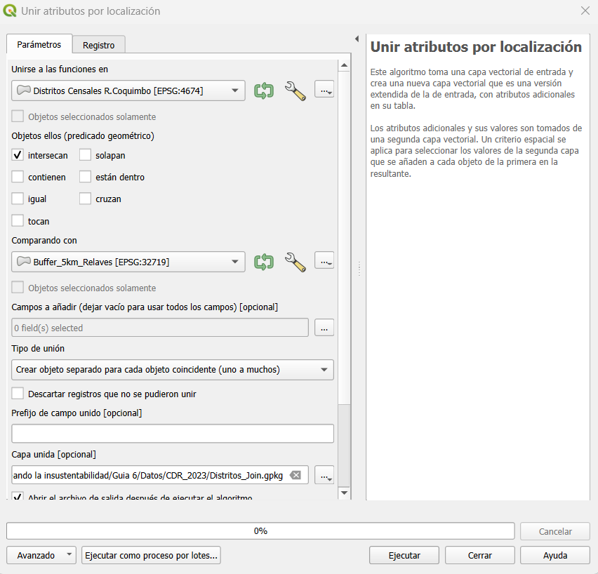{fig-align="center"}

::: {.callout-warning title="Posibles problema al no seleccionar los campos a añadir"}

Cuando nos interesa importar información adicional desde "Unir capa", puedes seleccionar las columnas que quieras en **Campos a añadir**. Si no seleccionas nada, se importarán por defecto todas las columnas. **Cuidado con la columna fid**, ya que es un índice espacial (feature identifier) y puede generar conflictos con el índice espacial que QGIS genera de forma automática para la capa resultante de la unión espacial (nota que la tabla de atributos de la capa resultante tiene como primera columna fid).
:::


**29.** Haz clic en **Ejecutar**.

::: {.callout-warning title="¿Por qué hay filas repetidas?"}
Al unir por localización con el tipo de unión por defecto, QGIS crea **una fila por cada intersección** entre un distrito y el buffer (más las filas de los distritos que no tienen intersecciones). Si un distrito intersecta varios buffers, ese distrito aparecerá **repetido** en la tabla resultante. Esto es un problema para el mapa que estamos generando: cuando más adelante hagamos un mapa graduado con el número de niños por distrito, los distritos repetidos se contarán múltiples veces, **distorsionando los valores del mapa**. Por eso, antes de continuar debemos eliminar las filas duplicadas para quedarnos con **una sola fila por distrito**.
:::

**30.** Abre la **Caja de herramientas de procesamiento**: ve a **Procesamiento > Caja de herramientas** (o presiona `Ctrl+Alt+T`). Se abrirá un panel lateral con todas las herramientas de geoprocesamiento disponibles.

**31.** En la barra de búsqueda de la Caja de herramientas, escribe `duplicados`. Haz doble clic sobre la herramienta **"Borrar geometrías duplicadas por atributo"** (Delete Duplicates by Attribute). En la ventana que se abre, configura:

-   **Capa de entrada:** `Distritos_Join`
-   **Campo de comparación de atributos:** selecciona `COM_DIS` (el identificador único de cada distrito censal)
-   **Filtrados (sin duplicados):** haz clic en los tres puntos (`...`), selecciona **Guardar en archivo**, navega a `datos/intermedios/` y guárdalo como `Distritos_Join_Unicos.gpkg`

**32.** Haz clic en **Ejecutar**. La nueva capa `Distritos_Join_Unicos` aparecerá en el panel de capas. Esta capa contiene **exactamente un registro por distrito**, preservando la información de la unión espacial (los distritos expuestos mantienen sus valores; los no expuestos mantienen NULL).

**33.** Abre la tabla de atributos de la nueva capa `Distritos_Join_Unicos`. Observa que se han añadido la columna ID proveniente de la capa de buffer. Los distritos que **sí** intersectan la zona de influencia tendrán valores en esta columna nueva; los que **no** intersectan tendrán valor **NULL** (vacíos).

**34.** Para verificar, ordena la tabla por la columna nueva (por ejemplo, `ID`) haciendo clic en el encabezado de la columna. Los distritos con valores numéricos son los expuestos; los que tienen NULL son los no expuestos.


------------------------------------------------------------------------

## Paso 9 | Simbología categorizada: distritos expuestos vs. no expuestos

Ahora crearemos una simbología que distinga claramente los distritos expuestos de los no expuestos, usando una **expresión** en vez de un campo simple.

**35.** Haz clic derecho sobre `Distritos_Join_Unicos` > **Propiedades > Simbología**.

**36.** Cambia el tipo de simbología de "Símbolo único" a **"Categorizado"**.

**37.** En el campo **Valor**, no selecciones una columna de la lista desplegable. En su lugar, haz clic en el botón de **expresión** (ε) a la derecha del campo y escribe:

```sql
"ID" IS NOT NULL
```

Esta expresión evalúa si el distrito tiene un valor en la columna `ID` (proveniente del buffer) — es decir, si está expuesto o no. Devuelve `1` (verdadero) o `0` (falso).

**38.** Haz clic en **Clasificar**. Aparecerán dos categorías: `0` y `1`. Configura las etiquetas y colores:

-   `0` → Etiqueta: **"Sin exposición"** — Color de relleno: gris claro (`#d9d9d9`)
-   `1` → Etiqueta: **"Expuesto a relaves (5 km)"** — Color de relleno: naranja (`#e6550d`)

Para ambas categorías, ajusta el color del **trazo (borde)** a un tono más oscuro y reduce el **ancho del trazo** a `0.2 mm` para que los límites de los distritos sean visibles pero sutiles.

**39.** Haz clic en **Aceptar**.

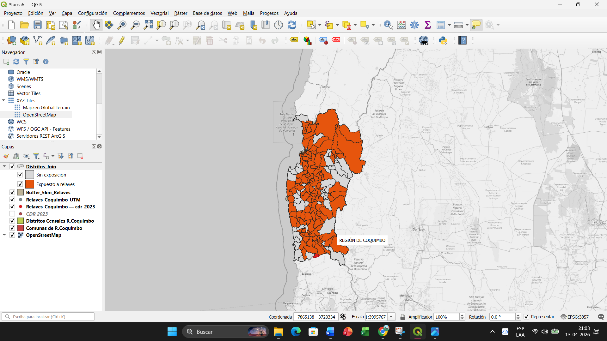{fig-align="center"}

------------------------------------------------------------------------

## Paso 10 | Preparar las capas para el Mapa 1

**40.** Organiza las capas en el panel de capas de arriba a abajo:

1.  `Relaves_Coquimbo` (puntos proporcionales — arriba de todo)
2.  `Comunas de R.Coquimbo` (solo bordes, sin relleno — como referencia)
3.  `Distritos_Join_Unicos` (categorizado — expuestos/no expuestos)
4.  `OSM Standard` (mapa base en gris — al fondo)

**41.** Para que la capa de comunas muestre **solo los bordes** (sin relleno):

-   Haz clic derecho sobre `Comunas de R.Coquimbo` > **Propiedades > Simbología**.
-   En **Relleno simple**, cambia el **color de relleno** a **transparente** (haz clic en la flecha del color y selecciona "Relleno transparente").
-   Cambia el **color del trazo** a negro (`#000000`) y el ancho a `0.5 mm`.
-   Haz clic en **Aceptar**.

**42.** Desactiva las capas que no necesitas (como `CDR 2023` original, `Relaves_Coquimbo_UTM`, `Buffer_5km_Relaves` y `Distritos_Join`) haciendo clic en la casilla de verificación junto a su nombre.

**43.** Haz zoom a la Región de Coquimbo: clic derecho sobre `Comunas de R.Coquimbo` > **Zum a la capa**.

::: callout-note
**PAUSA** — deberías ver algo así: los distritos clasificados por exposición, con los relaves proporcionales superpuestos y los límites comunales como referencia.

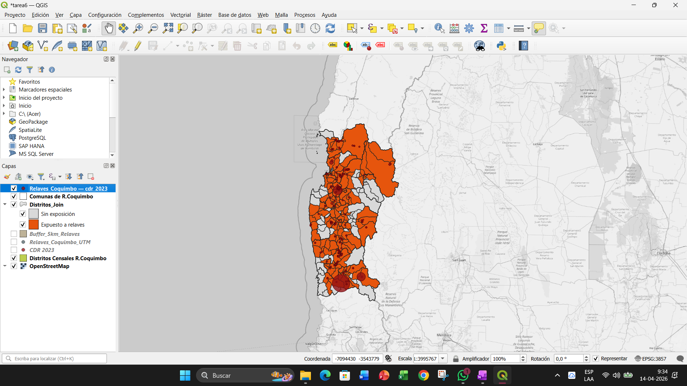{fig-align="center"}
:::

------------------------------------------------------------------------

## Mapa 2: "¿Cuántos niños están expuestos?" {.unnumbered .unlisted}

En este segundo mapa cuantificaremos cuántos **niños de 0 a 5 años** viven en los distritos expuestos a relaves. Para esto, primero necesitamos **calcular** el número absoluto de niños usando la Calculadora de Campos.

------------------------------------------------------------------------

## Paso 11 | Calculadora de campos: calcular el número de niños

La capa `Distritos_Join_Unicos` tiene la `Poblacion` total y el `Pct_Ninos` (porcentaje de niños de 0–5 años), pero no tiene el **número absoluto** de niños. Lo calcularemos con la **Calculadora de Campos**.

**44.** Abre la tabla de atributos de `Distritos_Join_Unicos`.

**45.** Haz clic en el botón **Calculadora de campos** (el icono del ábaco en la barra de herramientas de la tabla de atributos).

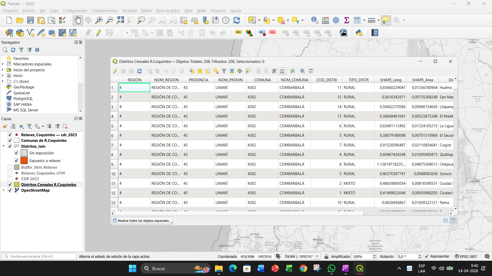{fig-align="center"}

**46.** En la ventana de la Calculadora de campos:

-   Marca **"Crear un nuevo campo"**.
-   **Nombre del campo de salida:** `Ninos_0_5`
-   **Tipo del campo de salida:** Número entero (integer)
-   En el área de **Expresión**, escribe:

```sql
round("Poblacion" * "Pct_Ninos" / 100)
```

Esta fórmula calcula: *población total × porcentaje de niños / 100*, y redondea al entero más cercano. Por ejemplo, si un distrito tiene 1.000 habitantes y 8% de niños, el resultado será 80 niños.

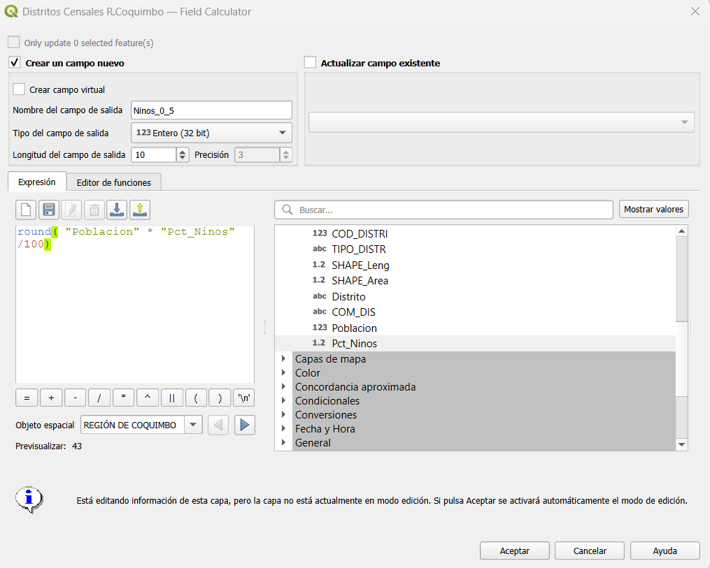{fig-align="center"}

**47.** Haz clic en **Aceptar**. Verás la nueva columna `Ninos_0_5` añadida a la tabla de atributos.

::: {.callout-tip title="¿Qué es la Calculadora de Campos?"}
La **Calculadora de Campos** (Field Calculator) es una herramienta de QGIS que permite crear nuevas columnas o modificar columnas existentes mediante expresiones matemáticas y lógicas. Funciona de manera similar a escribir una fórmula en Excel, pero se aplica a **todas las filas** de la tabla de atributos simultáneamente.

Usos comunes:

-   **Calcular áreas o perímetros:** `$area`, `$perimeter`
-   **Operaciones entre columnas:** `"columna_a" / "columna_b" * 100`
-   **Extraer texto:** `left("nombre", 3)` para los primeros 3 caracteres
-   **Condicionales:** `CASE WHEN "valor" > 100 THEN 'Alto' ELSE 'Bajo' END`

Es una de las herramientas más versátiles de QGIS y la usarás frecuentemente en análisis geoespacial.
:::

**48.** Una vez creada la columna, haz clic en el botón **Conmutar edición** (lápiz) en la barra de herramientas de la tabla de atributos y confirma que deseas **guardar los cambios**.

------------------------------------------------------------------------

## Paso 12 | Simbología graduada y basada en reglas: número de niños en distritos expuestos

Ahora crearemos la simbología para el segundo mapa, mostrando cuántos niños de 0–5 años viven en cada distrito expuesto. Para los distritos no expuestos, añadiremos una categoría gris — todo dentro de la misma capa, usando el mismo enfoque de **simbología basada en reglas** que aprendimos en la Tarea 5.

**49.** Haz clic derecho sobre `Distritos_Join_Unicos` > **Duplicar capa**. Renombra la copia como `Distritos_Ninos` (clic derecho > **Renombrar capa**). Trabajaremos sobre esta copia para no perder la simbología categorizada del Mapa 1.

**50.** Configura la simbología graduada inicial de `Distritos_Ninos`:

-   Haz clic derecho > **Propiedades > Simbología**.
-   Cambia a **"Graduado"**.
-   **Valor:** en vez de seleccionar una columna directamente, haz clic en el botón de **expresión** (ε) a la derecha del campo y escribe:

```sql
CASE WHEN "ID" IS NOT NULL THEN "Ninos_0_5" END
```

Esta expresión devuelve el número de niños **solo para los distritos expuestos** (los que tienen un valor en la columna `ID` proveniente del buffer). Para los distritos no expuestos, devuelve NULL — así la clasificación graduada los ignora.

-   **Rampa de color:** selecciona una rampa de **morados o azules** (que contraste con el naranja del Mapa 1).
-   **Modo:** Rupturas naturales (Jenks) o Cuantiles — prueba ambos y elige el que mejor muestre las diferencias.
-   Haz clic en **Clasificar** y luego en **Aceptar**.

Verás que los distritos **expuestos** se colorean según el número de niños, pero los **no expuestos** quedan sin simbología (transparentes). Queremos que aparezcan en gris. Para lograr esto, convertiremos la simbología a **basada en reglas** y añadiremos una categoría para los no expuestos (tal como hicimos en la Tarea 5 para los países sin datos de energía).

**51.** Abre nuevamente **Propiedades > Simbología** de `Distritos_Ninos`:

-   Cambia el tipo de simbología de **"Graduado"** a **"Basado en reglas"**. Al hacerlo, QGIS convertirá automáticamente las clases graduadas en reglas individuales — no perderás nada de lo que hiciste.
-   Observa que cada regla tiene un filtro con rangos que usan la expresión CASE (por ejemplo, `CASE WHEN "ID" IS NOT NULL THEN "Ninos_0_5" END >= 0 AND ...`). Como la expresión devuelve NULL para los distritos no expuestos, estos no coinciden con ninguna regla de rango.
-   Ahora añade una regla para los distritos no expuestos: haz clic en el botón **"+"** (añadir regla).
-   En la ventana de edición de la regla, marca la casilla **"Else"** — esto capturará todos los distritos que no coinciden con ninguna otra regla (es decir, los no expuestos).
-   En **Etiqueta**, escribe `Sin exposición`.
-   Configura el color de relleno: haz clic directamente **sobre el cuadro de color** (no sobre la flecha desplegable). En el diálogo de color, escribe `#d9d9d9` en la **Notación HTML** y presiona **Enter**.
-   Haz clic en **Aceptar** para cerrar la regla, y luego en **Aceptar** para aplicar la simbología.

De esta forma, los distritos expuestos se mostrarán con la rampa de colores según el número de niños, y los no expuestos aparecerán en gris — todo en una sola capa, con una leyenda limpia que incluye la categoría "Sin exposición".

::: {.callout-tip title="¿Por qué basado en reglas y no dos capas separadas?"}
Podríamos lograr el mismo efecto visual usando dos capas: una filtrada para los distritos expuestos (con simbología graduada) y otra gris debajo para los no expuestos. Sin embargo, la simbología **basada en reglas** tiene dos ventajas importantes:

1.  **Leyenda unificada:** todas las categorías — tanto la rampa de colores como "Sin exposición" — aparecen en una sola leyenda. Con dos capas, cada una genera su propia entrada en la leyenda, lo que es más difícil de controlar.
2.  **Menos capas que gestionar:** una sola capa es más fácil de mover, duplicar y bloquear en la composición de impresión.

Este es el mismo principio que aplicamos en la Tarea 5: usar reglas para manejar todas las categorías dentro de una misma capa.
:::


**52.** Organiza las capas para el Mapa 2 de arriba a abajo:

1.  `Distritos_Ninos` (basado en reglas — expuestos con rampa + no expuestos en gris)
2.  `Comunas de R.Coquimbo` (solo bordes)
3.  `OSM Standard` (mapa base)

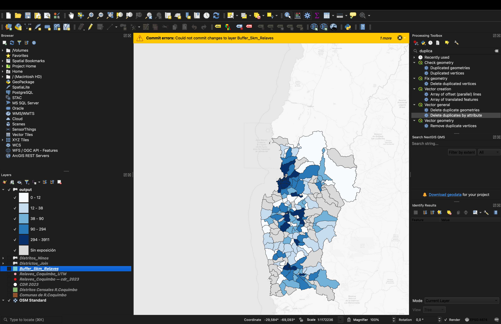{fig-align="center"}

------------------------------------------------------------------------

## Paso 13 | Composición de impresión: díptico "Amenazas y Población Expuesta"

Ahora crearemos una composición de impresión con **dos mapas lado a lado** — un díptico en orientación horizontal, tal como hicimos en la Tarea 5. El Mapa 1 ("¿Dónde están las amenazas?") irá a la izquierda y el Mapa 2 ("¿Cuántos niños están expuestos?") a la derecha. Ambos mapas mostrarán **exactamente la misma extensión geográfica**, lo que permite al lector comparar directamente las dos capas de información.

**53.** Ve a **Proyecto > Nueva composición de impresión**. Asígnale un nombre (por ejemplo, `relaves_coquimbo`).

**54.** Configura la orientación de la página: haz clic derecho sobre la hoja en blanco > **Propiedades de la página** > cambia la orientación a **horizontal** (apaisado). Puedes ajustar el tamaño — se sugiere un ancho de **297 mm** y un alto de **210 mm** (A4 apaisado), pero experimenta según tu preferencia.

#### Añadir el Mapa 1 (izquierda)

**55.** Antes de añadir el primer mapa, regresa a la ventana principal de QGIS y asegúrate de que estén visibles **solo las capas del Mapa 1** (y asegúrate que estén en este orden):

1.  `Comunas de R.Coquimbo` (solo bordes)
2.  `Relaves_Coquimbo` (puntos proporcionales)
3.  `Distritos_Join_Unicos` (categorizado — expuestos/no expuestos)
4.  `OSM Standard` (mapa base)

Desactiva `Distritos_Ninos` y cualquier otra capa que no corresponda al Mapa 1.

**56.** Regresa a la composición de impresión. Selecciona **Añadir mapa** y dibuja un rectángulo en la **mitad izquierda** de la hoja. Ajusta la escala y posición con el botón **Mover contenido del elemento** (el icono de hoja con flechas) hasta que la Región de Coquimbo se vea bien encuadrada.

**57.** En las propiedades del marco de mapa (panel derecho), marca las opciones **"Bloquear capas"** y **"Bloquear estilos de capa"** — así este marco quedará fijo con las capas del Mapa 1, incluso cuando cambies la visibilidad de las capas en la ventana principal.

#### Añadir el Mapa 2 (derecha) copiando el Mapa 1

En vez de dibujar un segundo mapa desde cero, **copiaremos el Mapa 1**. Esto garantiza que ambos mapas tengan exactamente la misma extensión geográfica y escala — requisito fundamental para un díptico comparativo.

**58.** Haz clic sobre el marco del Mapa 1 para seleccionarlo. Cópialo con `Ctrl+C` y pégalo con `Ctrl+V`. Aparecerá una copia exacta superpuesta sobre el original.

**59.** Arrastra la copia hacia la **mitad derecha** de la hoja, alineándola con el Mapa 1. Puedes cambiar el nombre haciendo doble click sobre el nombre en el panel de elementos. Recomendamos llamarlo Mapa 2, para evitar confusiones.

**60.** Ahora necesitamos actualizar las capas de este segundo marco. En las propiedades del marco copiado (panel derecho), **desmarca** las opciones **"Bloquear capas"** y **"Bloquear estilos de capa"** para permitir que el mapa refleje las capas activas en la ventana principal.

**61.** Vuelve a la ventana principal de QGIS. Ahora activa **solo las capas del Mapa 2** (y asegúrate que estén en este orden):

1.  `Comunas de R.Coquimbo` (solo bordes)
2.  `Distritos_Ninos` (basado en reglas — expuestos con rampa + no expuestos en gris)
3.  `OSM Standard` (mapa base)

Desactiva `Relaves_Coquimbo` y las demás capas que no correspondan.

**62.** Regresa a la composición de impresión. Haz clic sobre el marco del Mapa 2 (derecha) y presiona el botón **Actualizar vista previa del mapa** (el icono de recarga en la barra de herramientas, o en el panel de propiedades del mapa). El marco ahora mostrará las capas del Mapa 2. Vuelve a marcar **"Bloquear capas"** y **"Bloquear estilos de capa"** para fijar estas capas.

::: {.callout-tip title="¿Por qué copiar el Mapa 1 en vez de dibujar uno nuevo?"}
Cuando presentas dos mapas de la misma región lado a lado, es fundamental que cubran **exactamente el mismo territorio** a la **misma escala**. Si uno está más ampliado o desplazado que el otro, el lector no puede superponer mentalmente la información de ambos mapas — pierde la capacidad de comparar. Al copiar el Mapa 1, la extensión y la escala se heredan automáticamente, garantizando coherencia visual y facilitando la lectura comparativa: "este distrito que aparece en naranja (expuesto) en el mapa izquierdo tiene X niños (color oscuro) en el mapa derecho".
:::

#### Completar la composición

**63.** Añade los siguientes elementos:

-   **Títulos:** usa **Añadir etiqueta** para colocar un título sobre cada mapa. Por ejemplo: *"¿Dónde están las amenazas?"* sobre el izquierdo y *"¿Cuántos niños están expuestos?"* sobre el derecho. Opcionalmente, añade un título general arriba, o no añadas un título si anticipas utilizar el mapa en un documento o póster donde el título se presentará sobre el mapa.
-   **Leyendas:** añade una leyenda para cada mapa. 

	-	Desmarca **"Actualizar automáticamente"** en cada una, elimina las capas que no quieres mostrar (basemap, capas auxiliares) y edita los nombres para que sean descriptivos. 

	-	**Para visualizar los relaves, deberas incorporar la capa de relaves que no tiene el tamaño proporcional a la leyenda con el botón +, dado que QGIS no despliega el símbolo proporcional de nuestro mapa en la layenda**. Asegúrate de asignarle el mismo color a los puntos de esa capa (la original), para que el símbolo sea el mismo. 
	-	Desmarca la casilla "Ajustar al contenido" para lograr que la altura de las leyendas sea la misma en los dos mapas. 

-   **Barra de escala:** añade **una sola** barra de escala, vinculada al Mapa 1. Como ambos mapas comparten la misma escala, una barra es suficiente. Puedes colocarla en la leyenda del mapa izquierdo, que quedará con espacio de sobra.

-   **Flecha del Norte:** añade una flecha del norte en una posición discreta, solo en un mapa.

::: {.callout-tip title="Configuración detallada de la leyenda"}

Al añadir una leyenda, QGIS creará una leyenda automática que incluye todas las capas visibles. Para que quede profesional:

1.  **Desmarcar "Actualizar automáticamente":** esto te permite editar la leyenda manualmente. Usa el botón **"-"** para eliminar capas que no quieres mostrar y el botón de edición (lápiz) para renombrar las entradas.

2.  **Título de la leyenda:** reemplaza el título genérico por uno informativo. Alternativamente, puedes dejar el título vacío y editar los nombres de las capas para que sirvan como título de sus ítems respectivos.

3.  **Desmarcar "Redimensionar para ajustar al contenido":** esto te permite ajustar manualmente el tamaño de la caja de la leyenda, controlando su posición con precisión.

4.  **Desmarcar "Fondo":** desactiva la casilla de fondo de la leyenda para que no aparezca un rectángulo blanco que interfiera visualmente. Si la leyenda no interfiere con el contenido, puedes dejar el fondo.
:::


**64.** Exporta la composición como imagen a `resultados/mapas/` con resolución de **300 ppp** (**Composición > Exportar como imagen**).

------------------------------------------------------------------------

## Resultado final

Tu composición final debería verse algo así (con tu propia elección de colores): un díptico horizontal donde el mapa izquierdo muestra las amenazas (distritos expuestos + relaves proporcionales) y el mapa derecho muestra la población vulnerable (número de niños por distrito expuesto), ambos con la misma extensión geográfica.

::: {#fig-resultado-final}
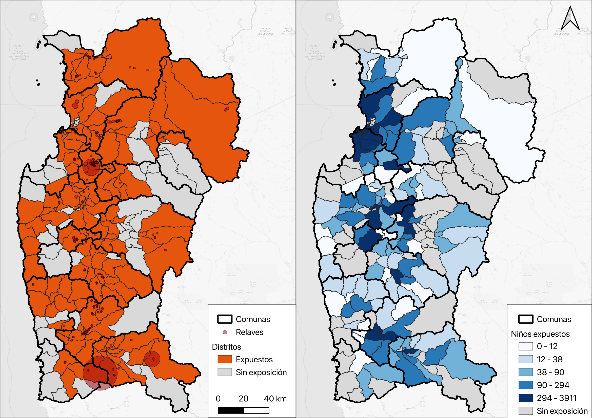{fig-align="center"}

Resultado final — díptico: amenazas (izquierda) + población expuesta (derecha). Tu composición puede verse diferente según tu elección de colores, rampa y método de clasificación.
:::

¡Listo! Has finalizado tu mapa. Recuerda completar la reflexión y guardar todo para la entrega de tu próximo portafolio.

------------------------------------------------------------------------

## Preguntas guía para reflexión

::: {.callout-important title="Mapa-Memo: preguntas para reflexionar"}
-   **Exposición:** ¿Qué proporción de los distritos censales de la Región de Coquimbo se encuentran dentro de la zona de influencia de 5 km? ¿Te parece mucho o poco?
-   **Vulnerabilidad:** ¿En qué distritos o comunas se concentra la mayor cantidad de niños expuestos? ¿Hay distritos con alta exposición y gran número de niños?
-   **Supuestos del buffer 1:** Usamos un buffer de 5 km como "zona de influencia". ¿Qué limitaciones tiene este enfoque? ¿La contaminación de un relave se dispersa de manera uniforme en todas las direcciones? ¿Qué otros factores podrían influir (viento, pendiente, tipo de suelo, estado del relave)?
-   **Activos vs. abandonados:** La capa de relaves incluye depósitos activos, inactivos y abandonados. ¿Deberíamos tratarlos todos de la misma manera en un análisis de riesgo? ¿Por qué sí o por qué no?
-   **Tamaño de los relaves:** El mapa de la izquierda resalta algunos relaves de mayor tamaño. Sin embargo, la medida de exposición construida (5 km) no distingue entre tamaños. ¿Es esto correcto? ¿Hay relaves de gran tamaño ubicados en comunas con muchos niños?
-   **Población vulnerable:** Observa el Mapa 2. ¿Cuántos niños de 0 a 5 años viven en distritos expuestos a relaves? ¿Qué implicancias tiene esto para la salud pública y la planificación territorial? ¿Qué otras poblaciones vulnerables (adultos mayores, personas con enfermedades respiratorias) podrían verse afectadas de manera similar?
:::
