## Objetivo

El objetivo de esta práctica es que adquieras habilidades de manejo de **herramientas de geoprocesamiento** en QGIS para la confección de mapas temáticos. Este trabajo estructurado te permitirá analizar **cómo la deforestación se relaciona espacialmente con la proximidad a los caminos en la Amazonía Legal**.

**Herramientas por trabajar:**

-   Buffer
-   Dissolve
-   Intersección
-   Añadir atributos geométricos
-   Join no espacial
-   Calculadora de campos
-   Composición de impresión en díptico horizontal con extensión idéntica entre mapas

::: callout-warning
**¡Importante!** Si estás trabajando en un computador de la universidad, no olvides guardar tu trabajo en **OneDrive** (u otro servicio en la nube), de lo contrario perderás tu avance. Los computadores de la sala de clases se **borran automáticamente cada semana**.
:::

------------------------------------------------------------------------

## Resumen del trabajo de esta clase

### Capas

| Capa | Descripción |
|---|---|
| **a)** `Municipios Amazonia Legal` | Municipios y deforestación de la Amazonía Legal |
| **b)** `Caminos Amazonia Legal` | Caminos de la Amazonía Legal |

### Procesos

1.  **Crear Buffers** alrededor de los caminos para definir las áreas de influencia.
2.  **Intersección** de los buffers con los municipios para identificar las áreas afectadas.
3.  **Dissolve** para eliminar las fronteras internas y simplificar la geometría → **Capa C**.
4.  Añadir **Atributos Geométricos** para calcular el área de las capas → **Capa D y E**.
    -   **D)** Área de los Municipios y deforestación de la Amazonía Legal
    -   **E)** Área del Dissolve de los Buffer alrededor de los caminos en la Amazonía Legal
5.  **Join no espacial** para combinar la información de deforestación con la capa de municipios.
6.  **Calculadora de campo** para cálculo de porcentaje de área de influencia en cada municipio: (Área Capa D) / (Área Capa E)
7.  Confección de **2 mapas temáticos:**
    1.  % área cercana a caminos
    2.  Deforestación (porcentaje de la cubierta vegetal perdida) desde 1986 al 2023
8.  **Composición de impresión en díptico** con ambos mapas lado a lado, en la misma extensión geográfica, para comparar directamente proximidad a caminos y deforestación.

------------------------------------------------------------------------

## Preparación: descarga y organización del material

### Descarga desde Canvas

**1.** Descarga el archivo `.zip` de esta tarea desde la página del curso en **Canvas** (carpeta "Clase 7"). El archivo contiene todas las capas necesarias para el ejercicio.

**2.** Descomprime el archivo en una ubicación dedicada a este curso. Algunas opciones:

-   **Computador personal:** descomprime dentro de tu carpeta `SUS2211/`.
-   **Computador de la sala:** descomprime en el escritorio o en Documentos, pero **antes de terminar la sesión**, copia toda la carpeta a OneDrive, un pendrive u otro servicio en la nube.

------------------------------------------------------------------------

### Material descargado

Al descomprimir el archivo, encontrarás los siguientes archivos dentro de la carpeta de datos:

| Archivo | Descripción |
|---|---|
| `Municipios Amazonia Legal` (.shp + archivos asociados) | Polígonos de los municipios de la Amazonía Legal brasileña, con datos de deforestación |
| `Caminos Amazonia Legal` (.shp + archivos asociados) | Red de caminos de la Amazonía Legal |

------------------------------------------------------------------------

## ¡Empecemos! {.unnumbered .unlisted}

## Paso 1 | Crear el proyecto y cargar las capas

**1.** Inicia QGIS en el computador.

**2.** Crea un proyecto nuevo a partir de un mapa (recuerda nombrarlo bajo el nombre de la clase correspondiente y guardarlo en **OneDrive**).

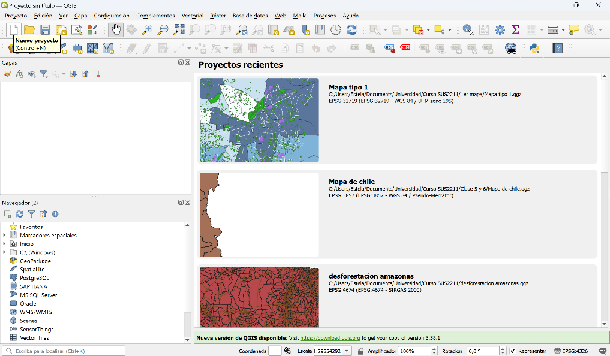{fig-align="center"}

**3.** Añade al mapa las siguientes capas:

-   **a)** Municipios y deforestación de la Amazonía Legal
-   **b)** Caminos de la Amazonía Legal

::: callout-note
**PAUSA** — hasta ahora debería visualizarse algo así:

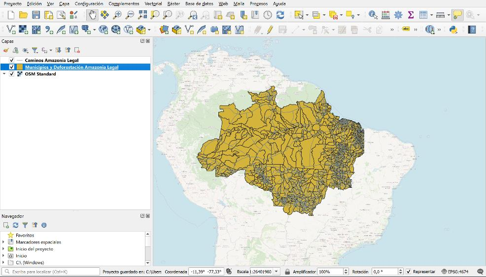{fig-align="center"}
:::

------------------------------------------------------------------------

## Paso 2 | Crear Buffer alrededor de los caminos

**Primero**, crearemos zonas de influencia (Buffers) alrededor de los caminos.

El objetivo de este paso es crear zonas de influencia alrededor de los caminos para analizar cómo la proximidad a estas infraestructuras afecta la deforestación. Los **buffers** nos permiten definir áreas específicas (por ejemplo, 1 km, 5 km, 10 km) alrededor de cada camino donde se presume que la actividad humana, como la tala o el uso de la tierra, es más intensa.

-   **Resultado esperado:** Tendrás una capa que representa las áreas que se encuentran dentro de una cierta distancia de los caminos. Estas áreas serán el foco principal del análisis para ver si la deforestación se correlaciona espacialmente con el porcentaje del área de los municipios que se encuentra cercana a un camino.

**4.** En el menú principal, ve a *Vectorial -> Herramientas de geoproceso -> Buffer*. Esto abrirá la ventana de diálogo para crear el buffer.

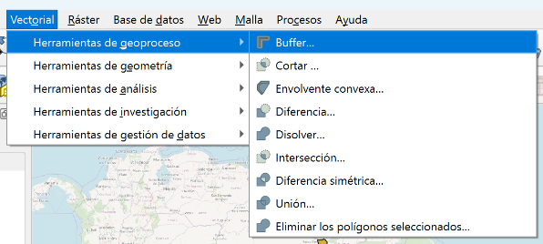{fig-align="center"}

**5.** Configura los parámetros del Buffer:

-   **Capa de entrada:** Selecciona tu capa de caminos en el campo
-   **Distancia del buffer:** 5 kilómetros
-   Mantén el resto de los valores
-   Click en **Ejecutar**

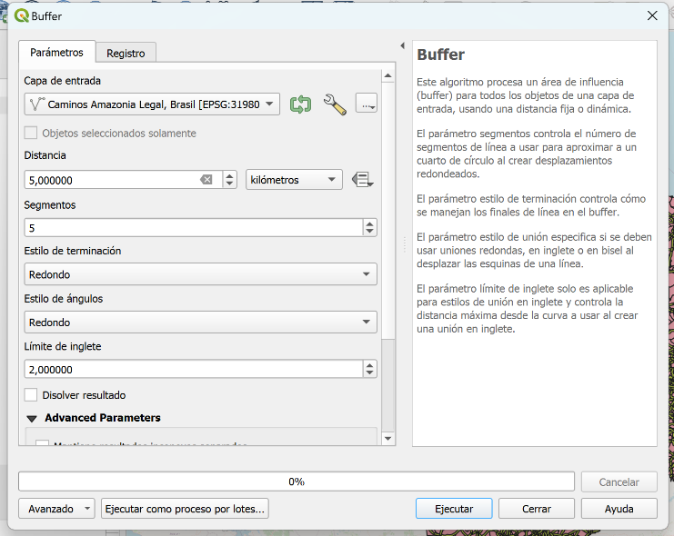{fig-align="center"}

Este proceso te permitirá crear zonas de influencia alrededor de los caminos que podrás usar para analizar la relación con la deforestación en la Amazonía Legal.

::: callout-note
**PAUSA** — Debería visualizarse esto:

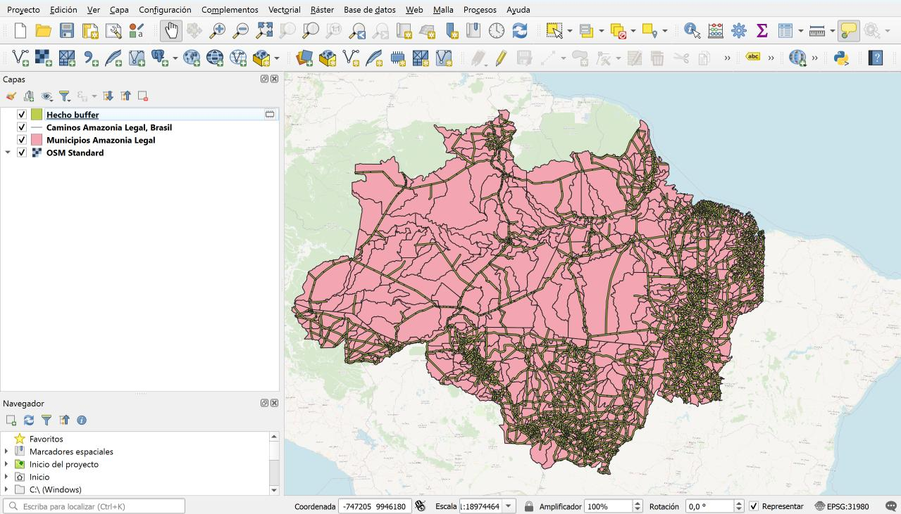{fig-align="center"}
:::

::: callout-tip
**OJO:** Recuerda ir explorando la tabla de atributos a lo largo de los procesos para ir visualizando los cambios generados.
:::

------------------------------------------------------------------------

## Paso 3 | Intersección de buffers con municipios

**Segundo**, haremos una Intersección de la capa **a)** Municipios y deforestación de la Amazonía Legal con la capa creada de Buffers.

La intersección de los buffers con los municipios nos permitirá dividir los caminos que atraviesan uno a más municipios, para que así cada segmento que obtengamos esté contenido en un único municipio. Esto será importante para calcular el área cercana a caminos para cada municipio.

**6.** En el menú principal, ve a *Vectorial -> Herramientas de geoproceso -> Intersect* o Intersección.

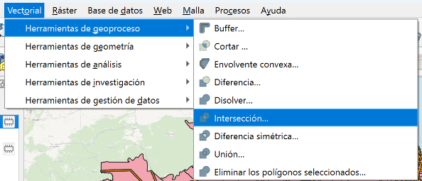{fig-align="center"}

**7.** Configura los parámetros de la Intersección:

-   **Capa de entrada:** Selecciona la capa de **municipios de la Amazonía Legal**.
-   **Capa de intersección:** Selecciona la capa de Buffer\_**caminos**.
-   **Capa de entrada a mantener:** `CD_MUN`
-   **Campo de intersección a conservar:** `Tipo`
-   Click en **Ejecutar**

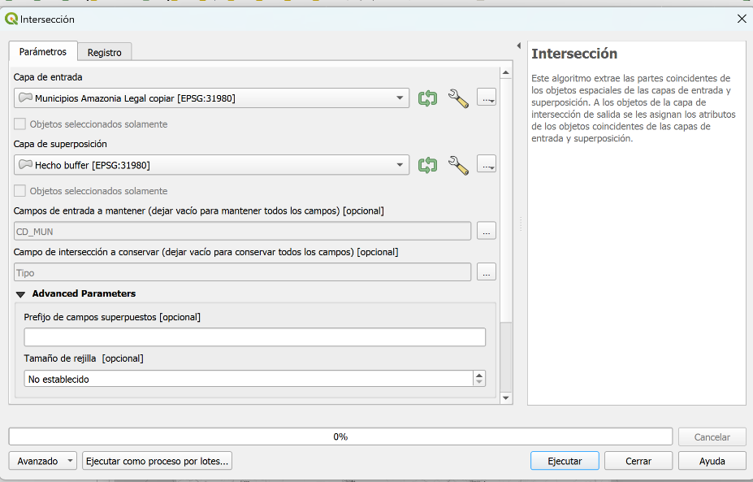{fig-align="center"}

::: callout-note
**PAUSA** — Debería visualizarse esto:

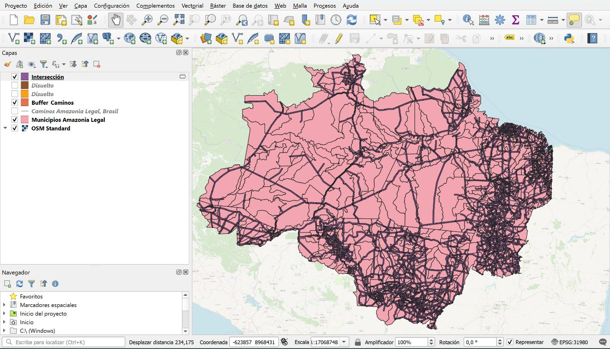{fig-align="center"}
:::

::: callout-tip
**OJO:** Recuerda ir explorando la tabla de atributos a lo largo de los procesos para ir visualizando los cambios generados.
:::

------------------------------------------------------------------------

## Paso 4 | Dissolve por municipio

**Tercero**, haremos un Dissolve de la capa generada anteriormente (Intersección).

El Dissolve eliminará las fronteras internas creadas durante la intersección y combinará todas las áreas afectadas en un solo polígono, para cada municipio. Al hacer esta operación, evitamos doble contabilizar áreas que están contenidas en dos o más buffers de caminos (por ejemplo, en caminos paralelos o en intersecciones). El resultado es un solo gran polígono (no necesariamente contiguo) para cada municipio, que contiene todos los puntos que están a menos de cinco kilómetros de un camino.

**8.** En el menú principal, ve a *Vectorial -> Herramientas de geoproceso -> Dissolve*. Esto abrirá la ventana de diálogo para aplicar el Dissolve o Disolver.

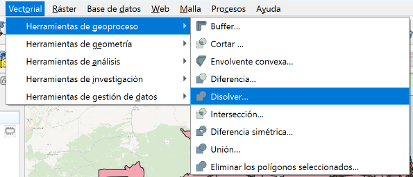{fig-align="center"}

**9.** Configura los parámetros del Dissolve:

-   **Capa de entrada:** Selecciona la capa de buffers que generaste en el paso anterior
-   **Disolver campo:** `CD_MUN`
-   Click en **Ejecutar**

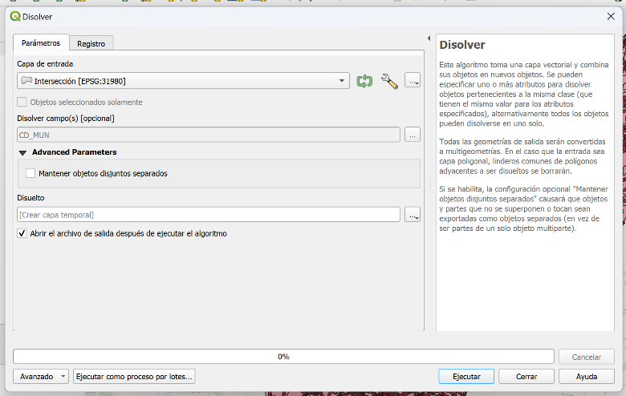{fig-align="center"}

::: callout-note
**PAUSA** — Debería visualizarse esto:

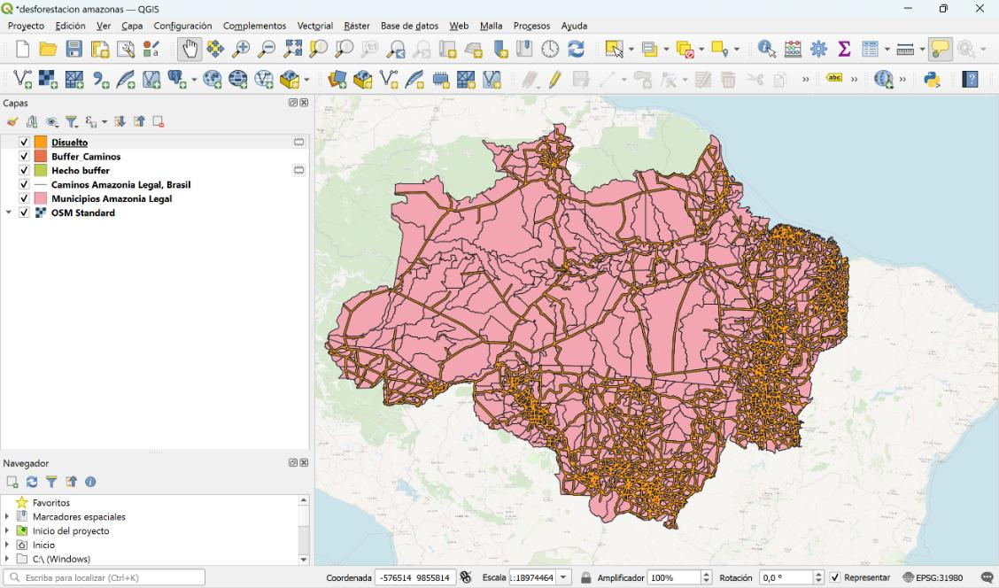{fig-align="center"}
:::

------------------------------------------------------------------------

## Paso 5 | Añadir atributos geométricos

**Cuarto**, la herramienta Añadir Atributos Geométricos es una manera eficiente y precisa de calcular el área de las geometrías sin necesidad de utilizar la calculadora de campos. Es especialmente útil cuando trabajas con análisis de áreas, como la deforestación y la influencia de caminos.

**10.** En el menú principal, ve a *Vectorial -> Herramientas de geometría -> Agregar Atributos de Geometría*.

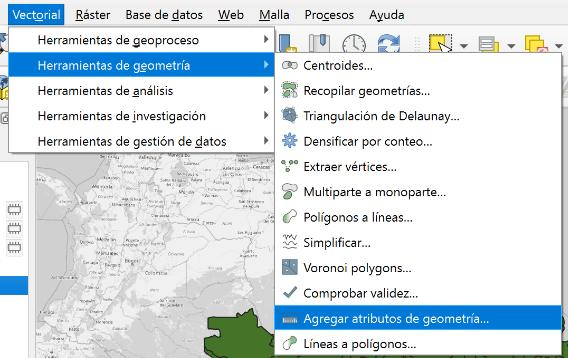{fig-align="center"}

**11.** En la ventana que aparece, selecciona la **capa de Municipios Amazonia Legal**.

-   Seleccionar la opción **Elipsoidal**
-   Click en **Ejecutar**

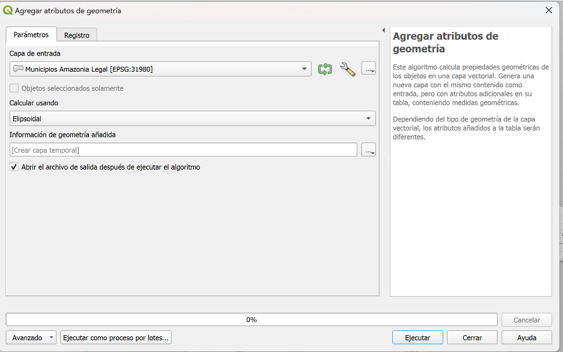{fig-align="center"}

Eso crea una nueva capa idéntica, pero con **dos nuevos campos (área y perímetro)** a la tabla de atributos de la capa.

::: {.callout-tip title="¿Por qué Elipsoidal?"}
La opción elipsoidal le indica a QGIS que debe calcular el área de la superficie de la esfera que representa a la tierra (datum) que está contenida por el polígono, en lugar del área del polígono proyectada en el plano. Esto es relevante cuando trabajamos con escalas geográficas grandes, como es el caso de esta guía, ya que puede haber una diferencia significativa entre el área proyectada en el plano y el área sobre la esfera (la segunda es siempre mayor).
:::

**12.** Repite el paso 11 con la capa del **Dissolve** hecho anteriormente.

**Nuevas capas: d)** Area\_Municipios… **e)** Area\_Dissolve

------------------------------------------------------------------------

## Paso 6 | Join No Espacial

**Quinto**, Join No Espacial entre las capas creadas anteriormente, es decir, **d)** Area\_Municipios y deforestación de la Amazonía Legal y **e)** Area\_Dissolve.

El join no espacial unirá la información de deforestación de los municipios originales con la capa resultante del dissolve. Esto permitirá analizar cómo la deforestación se relaciona con las áreas afectadas por la proximidad a los caminos, combinando información espacial y tabular.

**13.** Haz clic derecho en **d)** Area\_Municipios… y selecciona *Propiedades*.

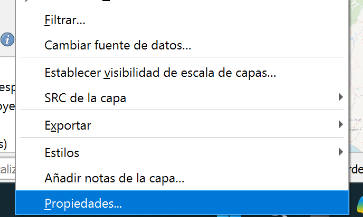{fig-align="center"}

**14.** Ve a la pestaña *Uniones* y haz clic en el botón para añadir una nueva unión.

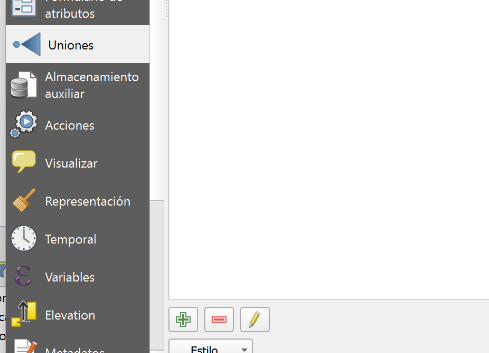{fig-align="center"}

**15.** Configura la unión:

-   **Capa de unión:** Selecciona la capa de **e)** Area\_Dissolve
-   Define el campo común para el join (puede ser el ID de municipio o un nombre que coincida **CD\_COM**).
-   Aplica y verifica que los datos se hayan unido correctamente en la tabla de atributos.

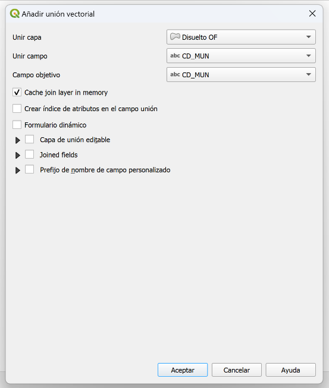{fig-align="center"}

------------------------------------------------------------------------

## Recordemos el objetivo final

Estos pasos están diseñados para evaluar de manera precisa la relación entre la deforestación y la proximidad a las carreteras en la Amazonía Legal. Al realizar el buffer y el dissolve, definimos y simplificamos las áreas de influencia de los caminos. La intersección nos permite enfocar el análisis en las zonas específicas de los municipios que caen dentro de estas áreas de influencia. La herramienta Añadir Atributos Geométricos es una manera eficiente y precisa de calcular el área de las geometrías. Finalmente, el join no espacial combina todos estos datos para un análisis integrado que revela cómo los caminos se relacionan con la tasa de deforestación.

------------------------------------------------------------------------

## Paso 7 | Calculadora de campos

Ahora, se calculará una proporción del área **e)** Area\_Dissolve respecto del área **d)** Area\_Municipios y deforestación de la Amazonía Legal.

El objetivo de calcular la **proporción del área del dissolve respecto al área total del municipio** es entender **cuánto del territorio municipal está directamente influenciado por la proximidad a los caminos**. Esto nos proporciona una medida cuantitativa de la exposición de cada municipio a las posibles actividades humanas asociadas a la infraestructura vial, como la deforestación.

**16.** Ahora vamos a calcular la proporción de área. En la capa de **d)** Area\_Municipios… abre la **Calculadora de campos**.

-   **Crear un nuevo campo** llamado `Proporción_Area`
-   **Tipo del campo de salida:** 1.2 Número decimal (real)
-   **Expresión de cálculo:** `"Area_Dissolve" / "Area_Municipio"`

\*Asegúrate de que los nombres de campo coincidan exactamente con los nombres que usaste para los campos de área.

-   Haz clic en **Aceptar**

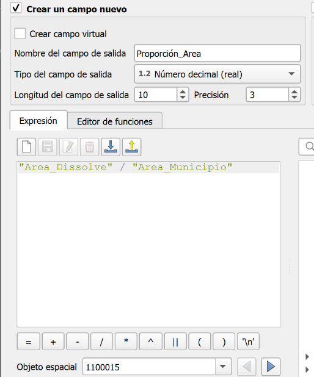{fig-align="center"}

**17.** Para manejar valores nulos que resultaron del ejercicio pasado, nuevamente utilizaremos la Calculadora de Campos.

-   Selecciona **Actualizar campo existente**
-   Selecciona el campo previamente creado `Proporción_Area`
-   **Expresión:** `coalesce("Proporción_Area", 0)`
-   Haz clic en **Aceptar**

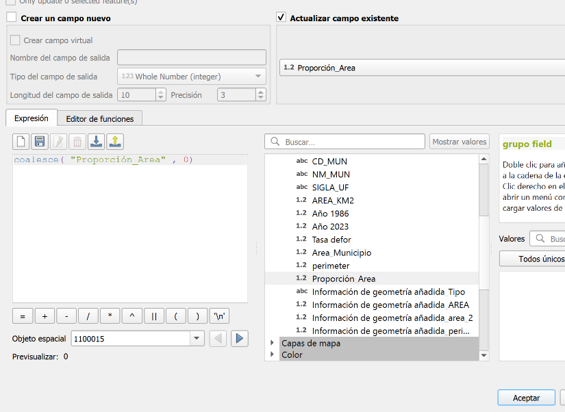{fig-align="center"}

::: {.callout-tip title="¿Por qué coalesce?"}
Esta función es muy útil porque reemplaza los valores nulos con un valor específico que definas, en este caso, 0. Esto es necesario porque, si un municipio no es intersectado por ningún buffer de camino, el valor de la proporción será Nulo dado el proceso que hemos seguido, siendo que debería ser cero.
:::

------------------------------------------------------------------------

## Paso 8 | Confección de mapas

Ahora, confeccionaremos dos mapas temáticos con los datos que hemos generado:

1.  % área cubierta por caminos
2.  Deforestación (porcentaje de la cubierta vegetal perdida) desde 1986 al 2023

### Mapa 1: Porcentaje de área cubierta por caminos

**18.** Con la **d)** Area\_Municipios. Como se ha hecho en clases anteriores anda a *Propiedades < Simbología*; cambia el tipo de simbología a **Graduado** para representar los valores de proporción que generamos de área cubierta por caminos.

::: callout-warning
**OJO:** ya tenemos el valor de la proporción calculado, solo necesitamos multiplicar ese valor por 100 para convertirlo a un porcentaje.
:::

**19.** Haz clic en el botón del **Expression Builder** junto a la opción de la columna.

-   Ingresa la siguiente expresión: `"Proporción_Area" * 100`
-   Esta expresión convierte el valor de la proporción ya calculada en un porcentaje.

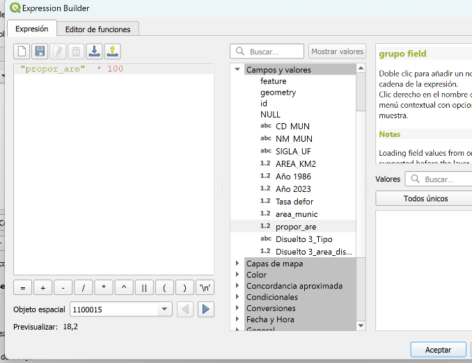{fig-align="center"}

**20.** Selecciona un esquema de color apropiado.

-   Click en **Clasificar** y **Aceptar**
-   (Puedes revisar las guías anteriores si necesitas explicaciones con más detalle)

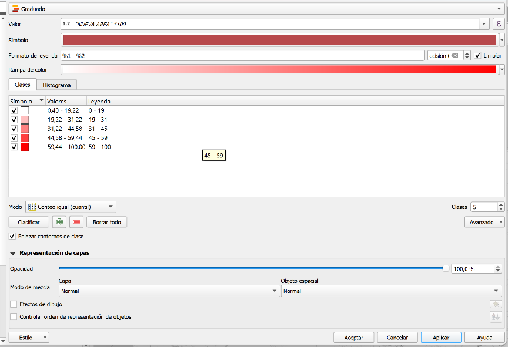{fig-align="center"}

::: callout-note
**PAUSA** — la capa **d)** Area\_Municipios debería visualizarse así:

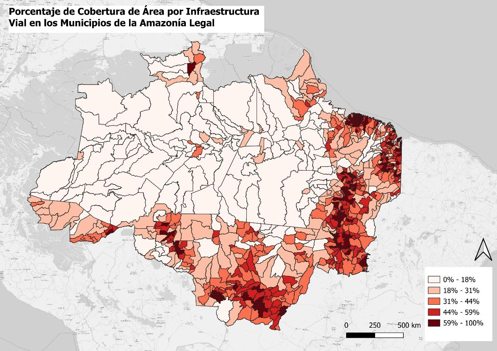{fig-align="center"}
:::

------------------------------------------------------------------------

### Mapa 2: Tasa de deforestación (1986–2023)

Como queremos presentar ambos mapas lado a lado en un **díptico** (ver Paso 9), necesitamos mantener las dos simbologías accesibles al mismo tiempo. Para eso, **duplicaremos la capa** y aplicaremos la simbología del Mapa 2 sobre la copia — así conservamos intacta la simbología del Mapa 1.

**21.** En el panel de capas, haz clic derecho sobre **d)** Area\_Municipios > **Duplicar capa**. Renombra la copia como `Deforestacion` (clic derecho > **Renombrar capa**). Trabajaremos sobre esta copia.

**22.** Si ves la tabla de atributos de `Deforestacion`, notarás la **tasa de deforestación ya cargada**. Anda a *Propiedades > Simbología*; cambia el tipo de simbología a **Graduado** con el valor de **Tasa de Deforestación**.

**23.** Selecciona un esquema de color apropiado — que **contraste** con el usado en el Mapa 1 (por ejemplo, si usaste azules para los caminos, usa verdes o rojos para la deforestación). El contraste entre mapas ayuda al lector a distinguir rápidamente qué variable está viendo en cada lado del díptico.

-   Click en **Clasificar** y **Aceptar**
-   (Puedes revisar las guías anteriores si necesitas explicaciones con más detalle)

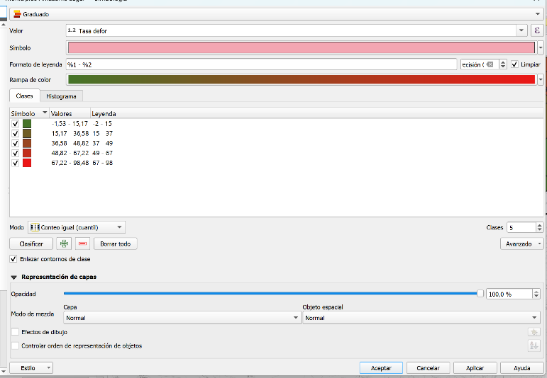{fig-align="center"}

::: callout-note
**PAUSA** — la capa `Deforestacion` debería visualizarse así:

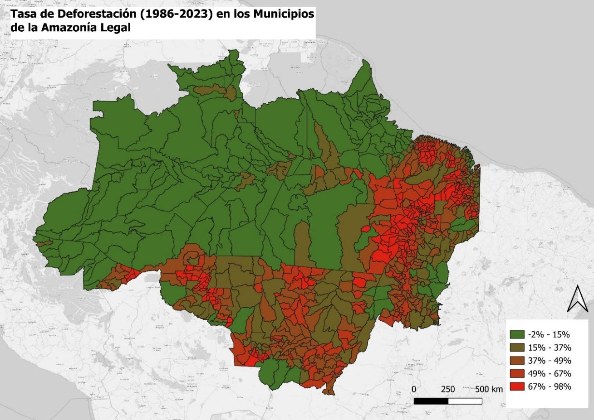{fig-align="center"}
:::

------------------------------------------------------------------------

## Paso 9 | Composición de impresión: díptico "Caminos y Deforestación"

Ahora crearemos una composición de impresión con **dos mapas lado a lado** — un díptico en orientación horizontal, tal como hicimos en la **Tarea 6**. El Mapa 1 (*"% área cercana a caminos"*) irá a la izquierda y el Mapa 2 (*"Tasa de deforestación"*) a la derecha. Ambos mapas mostrarán **exactamente la misma extensión geográfica**, lo que permite al lector comparar directamente cómo la proximidad a caminos se relaciona con la pérdida de cubierta vegetal en la Amazonía Legal.

**24.** Ve a **Proyecto > Nueva composición de impresión**. Asígnale un nombre (por ejemplo, `deforestacion_amazonia`).

**25.** Configura la orientación de la página: haz clic derecho sobre la hoja en blanco > **Propiedades de la página** > cambia la orientación a **horizontal** (apaisado). Se sugiere un ancho de **297 mm** y un alto de **210 mm** (A4 apaisado), pero puedes ajustar según tu preferencia.

#### Añadir el Mapa 1 (izquierda)

**26.** Antes de añadir el primer mapa, regresa a la ventana principal de QGIS y asegúrate de que esté visible **solo la capa d)** Area\_Municipios (con la simbología de % área cercana a caminos). Desactiva `Deforestacion` y cualquier otra capa auxiliar (intersección, buffer, dissolve) que no corresponda al Mapa 1.

**27.** Regresa a la composición de impresión. Selecciona **Añadir mapa** y dibuja un rectángulo en la **mitad izquierda** de la hoja. Ajusta la escala y posición con el botón **Mover contenido del elemento** (el icono de hoja con flechas) hasta que la Amazonía Legal se vea bien encuadrada.

**28.** En las propiedades del marco de mapa (panel derecho), marca las opciones **"Bloquear capas"** y **"Bloquear estilos de capa"** — así este marco quedará fijo con las capas y la simbología del Mapa 1, incluso cuando cambies la visibilidad de las capas en la ventana principal.

#### Añadir el Mapa 2 (derecha) copiando el Mapa 1

En vez de dibujar un segundo mapa desde cero, **copiaremos el Mapa 1**. Esto garantiza que ambos mapas tengan exactamente la misma extensión geográfica y escala — requisito fundamental para un díptico comparativo.

**29.** Haz clic sobre el marco del Mapa 1 para seleccionarlo. Cópialo con `Ctrl+C` y pégalo con `Ctrl+V`. Aparecerá una copia exacta superpuesta sobre el original.

**30.** Arrastra la copia hacia la **mitad derecha** de la hoja, alineándola con el Mapa 1. Puedes cambiar el nombre haciendo doble clic sobre el nombre en el panel de elementos. Recomendamos llamarlo `Mapa 2`, para evitar confusiones.

**31.** Ahora necesitamos actualizar las capas de este segundo marco. En las propiedades del marco copiado (panel derecho), **desmarca** las opciones **"Bloquear capas"** y **"Bloquear estilos de capa"** para permitir que el mapa refleje las capas activas en la ventana principal.

**32.** Vuelve a la ventana principal de QGIS. Activa **solo la capa `Deforestacion`** y desactiva **d)** Area\_Municipios.

**33.** Regresa a la composición de impresión. Haz clic sobre el marco del Mapa 2 (derecha) y presiona el botón **Actualizar vista previa del mapa** (el icono de recarga en la barra de herramientas, o en el panel de propiedades del mapa). El marco ahora mostrará la capa de deforestación. Vuelve a marcar **"Bloquear capas"** y **"Bloquear estilos de capa"** para fijar estas capas.

::: {.callout-tip title="¿Por qué copiar el Mapa 1 en vez de dibujar uno nuevo?"}
Cuando presentas dos mapas de la misma región lado a lado, es fundamental que cubran **exactamente el mismo territorio** a la **misma escala**. Si uno está más ampliado o desplazado que el otro, el lector no puede superponer mentalmente la información de ambos mapas — pierde la capacidad de comparar. Al copiar el Mapa 1, la extensión y la escala se heredan automáticamente, garantizando coherencia visual y facilitando la lectura comparativa: *"este municipio con alta proximidad a caminos (color oscuro a la izquierda) tiene también una alta tasa de deforestación (color oscuro a la derecha)"*.
:::

#### Completar la composición

**34.** Añade los siguientes elementos:

-   **Títulos:** usa **Añadir etiqueta** para colocar un título sobre cada mapa. Por ejemplo: *"% Área cercana a caminos"* sobre el izquierdo y *"Tasa de deforestación (1986–2023)"* sobre el derecho. Opcionalmente, añade un título general arriba, o déjalo sin título si anticipas usar el mapa en un documento o póster donde el título se presentará aparte.

-   **Leyendas:** añade una leyenda para cada mapa.

    -   Desmarca **"Actualizar automáticamente"** en cada una, elimina las capas que no quieres mostrar (capas auxiliares) con el botón **"-"** y edita los nombres con el botón del lápiz para que sean descriptivos.
    -   Desmarca la casilla **"Ajustar al contenido"** para lograr que la altura de las leyendas sea la misma en los dos mapas.
    -   Desmarca **"Fondo"** si la caja blanca de la leyenda interfiere visualmente con el mapa.

-   **Barra de escala:** añade **una sola** barra de escala, vinculada al Mapa 1. Como ambos mapas comparten la misma escala, una barra es suficiente. Puedes colocarla debajo de la leyenda del mapa izquierdo.

-   **Flecha del Norte:** añade una flecha del norte en una posición discreta, solo en un mapa.

**35.** Exporta la composición como imagen a `resultados/mapas/` con resolución de **300 ppp** (**Composición > Exportar como imagen**).

------------------------------------------------------------------------

## Resultado final

Tu composición final debería ser un **díptico horizontal** donde el mapa izquierdo muestra la exposición a caminos (% del área de cada municipio a menos de 5 km de un camino) y el mapa derecho muestra la tasa de deforestación entre 1986 y 2023, ambos con la misma extensión geográfica. Juntos, los dos mapas permiten preguntarse visualmente: *¿los municipios más intervenidos por caminos son también los que más bosque han perdido?*

------------------------------------------------------------------------

## ¡Listo! {.unnumbered .unlisted}

Has finalizado tu díptico y ejercicios. **Recuerda completar esta actividad y subirla a Canvas en el Mapa-Memo correspondiente.**

::: callout-important
### Preguntas guía para el Mapa-Memo

-   **Patrón espacial:** ¿Qué patrones observas en la distribución de caminos en los municipios de la Amazonía Legal y cómo se relacionan, a simple vista, con las zonas de mayor deforestación en el mapa de la derecha?
-   **Lectura comparativa del díptico:** ¿Coinciden los municipios con mayor porcentaje de área cercana a caminos con los municipios con mayor tasa de deforestación? ¿Hay municipios donde la relación no se cumple — alta proximidad a caminos pero baja deforestación, o viceversa? ¿Qué podría explicar esas excepciones?
-   **Supuestos del buffer:** Usamos un buffer de 5 km como "zona de influencia" de los caminos. ¿Qué limitaciones tiene este supuesto? ¿La presión sobre el bosque se dispersa de manera uniforme a ambos lados de un camino? ¿Qué otros factores podrían influir (tipo de camino, accesibilidad, pendiente, tenencia de la tierra)?
-   **Causalidad vs. correlación:** Aunque el díptico sugiera visualmente una asociación entre caminos y deforestación, ¿podemos concluir que los caminos *causan* la deforestación? ¿Podría ser al revés — que los caminos se construyan donde ya hay actividad humana asociada a la deforestación?
-   **Políticas de conservación:** ¿Cómo podrían estos mapas ayudar a identificar áreas prioritarias para la implementación de políticas de conservación y reforestación? ¿Dónde concentrarías los esfuerzos si fueras responsable de una política de protección de la Amazonía?
:::
