## Objetivo

El objetivo de esta práctica es que detectes y representes visualmente **lances de pesca industrial** que ocurrieron **dentro o cerca** de los **Espacios Costeros Marinos de Pueblos Originarios (ECMPO)**. En el camino aprenderás a **limpiar datos defectuosos**, a **validar espacial y temporalmente** tus registros, y a **comunicar resultados con mapas claros**.

**Herramientas por trabajar:**

-   Carga de datos tabulares (CSV) a QGIS
-   GeoPackage como formato de trabajo
-   Calculadora de Campos (limpieza por orden de magnitud geográfico)
-   Selección por expresión y por localización
-   Buffer, Disolver, Diferencia e Intersección
-   Constructor de consultas (filtro de capa)
-   Composición de impresión para mapas comparativos

::: callout-warning
**¡Importante!** Si estás trabajando en un computador de la universidad, no olvides guardar tu trabajo en **OneDrive** (u otro servicio en la nube), de lo contrario perderás tu avance. Los computadores de la sala de clases se **borran automáticamente cada semana**.
:::

------------------------------------------------------------------------

## Resumen del trabajo de esta clase

### Capas

| Capa | Descripción |
|---|---|
| **a)** `lances.csv` | Registro tabular de viajes y lances de pesca industrial (cada fila es un lance, con longitud/latitud de inicio y fin) |
| **b)** `ECMPO.gpkg` | Polígonos de los Espacios Costeros Marinos de Pueblos Originarios solicitados y/o decretados |
| **c)** `ZEE_Chile.gpkg` | Polígono de la Zona Económica Exclusiva de Chile (mar jurisdiccional, 370,4 km desde la costa) |

### Procesos

1.  **Pasos 1–4 — Preparación y reproyección.** Cargar el CSV como capa de puntos, exportar a GeoPackage y reproyectar todas las capas a **EPSG:3857** (metros).
2.  **Pasos 5–7 — Limpieza.** Aplicar un **orden de magnitud geográfico** a las coordenadas para eliminar registros corruptos o fuera de Chile, y filtrar solo las ECMPO con estado `SECTOR DECRETADO`.
3.  **Pasos 8–14 — Análisis espacial.**
    -   **A) Paso 8:** filtrar los lances que caen dentro de la **ZEE** de Chile.
    -   **B) Pasos 9–11:** construir un **buffer de 5 km** alrededor de cada ECMPO decretada, disolverlo y calcular su **anillo externo** (buffer sin el polígono original).
    -   **C) Paso 12:** intersectar los lances con (i) las ECMPO y (ii) el anillo externo.
    -   **D) Pasos 13–14:** clasificar los lances por **zona** (Dentro / Borde) y por **periodo** (Antes / Después del decreto).
4.  **Pasos 15–16 — Confección de mapas temáticos.** Dos mapas comparativos (antes vs. después del decreto) enfocados en una región a elección.

------------------------------------------------------------------------

## Preparación: descarga y organización del material

### Descarga desde Canvas

**1.** Descarga el archivo `.zip` de esta tarea desde la página del curso en **Canvas** (carpeta "Clase 8"). El archivo contiene todas las capas necesarias para el ejercicio.

**2.** Descomprime el archivo en una ubicación dedicada a este curso. Algunas opciones:

-   **Computador personal:** descomprime dentro de tu carpeta `SUS2211/`.
-   **Computador de la sala:** descomprime en el escritorio o en Documentos, pero **antes de terminar la sesión**, copia toda la carpeta a OneDrive, un pendrive u otro servicio en la nube.

------------------------------------------------------------------------

### Estructura de carpetas del proyecto

Al descomprimir el archivo, encontrarás la siguiente estructura de carpetas. Esta organización es la misma que hemos usado en clases anteriores y es **estándar para todas las tareas del curso**.

```{mermaid}
flowchart TD
    A["📁 clase8/"] --> B["📁 datos/"]
    A --> C["📁 documentos/"]
    A --> D["📁 proyectos/"]
    A --> E["📁 resultados/"]

    B --> F["📁 brutos/<br>🔒 datos originales<br>(no modificar)"]
    B --> G["📁 intermedios/<br>datos de geoprocesamiento"]
    B --> H["📁 procesados/<br>capas finales para mapeo"]

    E --> I["📁 mapas/<br>mapas exportados"]
    E --> J["📁 figuras/<br>gráficos y tablas"]

    style F fill:#fde8e8,stroke:#c0392b
    style G fill:#fef9e7,stroke:#f39c12
    style H fill:#eafaf1,stroke:#27ae60
    style D fill:#eaf4fb,stroke:#2980b9
    style C fill:#f4f6f7,stroke:#7f8c8d
```

::: {.callout-tip title="¿Para qué sirve cada carpeta?"}

**`datos/`** — Todo lo relacionado con los datos geoespaciales, organizado en tres subcarpetas:

-   **`brutos/`** 🔒 Datos originales tal como fueron descargados. **Nunca se modifican ni se sobreescriben.** En esta tarea: `lances.csv`, `ECMPO.gpkg` y `ZEE_Chile.gpkg`.
-   **`intermedios/`** Resultados de operaciones de geoprocesamiento. En esta tarea: `lance(3857).gpkg`, `lances_filtrados.gpkg`, `ecmpo_decretadas.gpkg`, `lances_chile_ZEE.gpkg`, `buffer_ecmpo_5km.gpkg`, `buffer_ecmpo_disueltos.gpkg`, `anillo_externo_ecmpo.gpkg`.
-   **`procesados/`** Capas finales listas para confeccionar los mapas. En esta tarea: `Lances_dentro_ECMPO.gpkg` y `lances_borde_ecmpo.gpkg` con los campos `zona` y `periodo` ya calculados.

**`documentos/`** — Documentación de respaldo. Se recomienda incluir una bitácora (`bitacora.txt` o `pasos.md`) que describa cómo transformaste los datos.

**`proyectos/`** — Archivos de proyecto QGIS (`.qgz`). Guarda aquí el proyecto de esta tarea, nómbralo `clase8.qgz`.

**`resultados/`** — Productos finales:

-   **`mapas/`** Los dos mapas comparativos (antes y después del decreto) exportados a PDF o imagen.
-   **`figuras/`** Gráficos, tablas u otros outputs.

:::

------------------------------------------------------------------------

### Material descargado

Dentro de `datos/brutos/` encontrarás los siguientes archivos:

| Archivo | Descripción |
|---|---|
| `lances.csv` | Tabla de lances de pesca industrial (cada fila: un lance con fecha, embarcación, puerto de zarpe/recalada, especie y coordenadas de inicio y fin de lance) |
| `ECMPO` (.gpkg) | Polígonos de ECMPO solicitados y/o decretados, con atributos como `status`, `dateDecree`, `decreeNum`, `name`, `applicant`, `region` |
| `ZEE_Chile` (.gpkg) | Polígono de la Zona Económica Exclusiva chilena |

------------------------------------------------------------------------

## ¡Empecemos! {.unnumbered .unlisted}

## Paso 1 | Crear el proyecto y activar el mapa base

**1.** Inicia QGIS en el computador.

**2.** Crea un proyecto nuevo a partir de un mapa (recuerda nombrarlo bajo el nombre de la clase correspondiente y guardarlo en **OneDrive**).

{fig-align="center"}

**3.** Como ya lo hemos configurado en clases anteriores, para una mejor visualización activaremos un **mapa base**. Ve a la barra de herramientas superior: **Web → QuickMapServices → OSM → OSM Standard**.

{fig-align="center"}

::: callout-warning
En clases anteriores hemos configurado el mapa base en escala de grises y añadido transparencia, para que no quite protagonismo a las capas del mapa. En este caso no es necesario, dado que la acción del mapa ocurre en el mar, y el mapa base no tiene elementos distractivos en el mar.
:::

::: callout-note
**PAUSA** — hasta ahora debería visualizarse algo así:

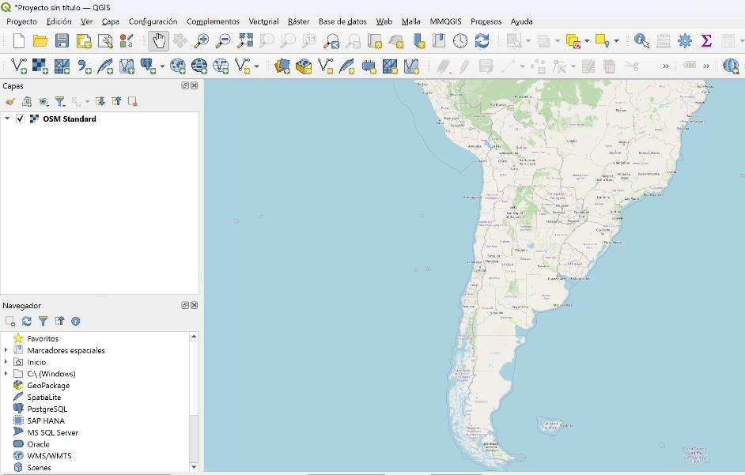{fig-align="center"}
:::

------------------------------------------------------------------------

## Paso 2 | Cargar el CSV de lances de pesca industrial

::: callout-tip
**¿Qué es un lance?** Un lance es una **instancia concreta de pesca dentro de un viaje**: cuando el barco se detiene (o anda muy lento) para echar su arte de pesca. Un mismo viaje puede contener varios lances en posiciones distintas. Cada fila del CSV representa un lance y trae las coordenadas de inicio y fin.
:::

**4.** Debes cargar el CSV a QGIS. Ve a: **Capa → Añadir capa → Añadir capa de texto delimitado**.

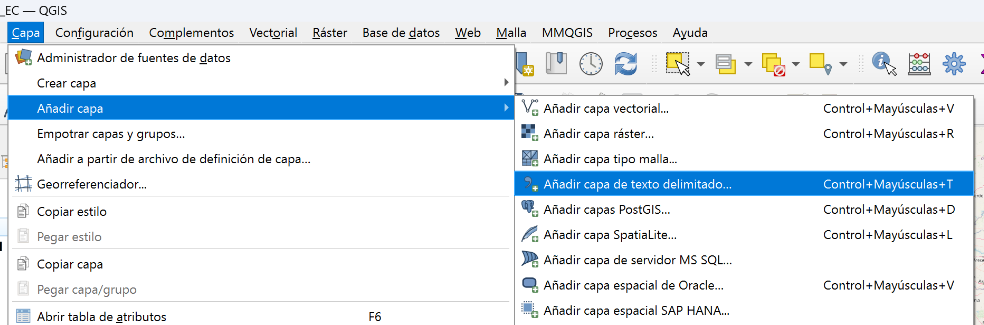{fig-align="center"}

**5.** Selecciona el archivo `lances.csv` y configura:

-   **Nombre de la capa:** `Lances`
-   **Formato de archivo:** CSV (valores separados por coma)
-   **Definición de geometría:** Coordenadas de punto
    -   **Campo X (longitud):** `LONGITUD INICIO DE LANCE`
    -   **Campo Y (latitud):** `LATITUD INICIO DE LANCE`
-   **SRC de la geometría:** `EPSG:4326 - WGS 84`

Haz clic en **Añadir**.

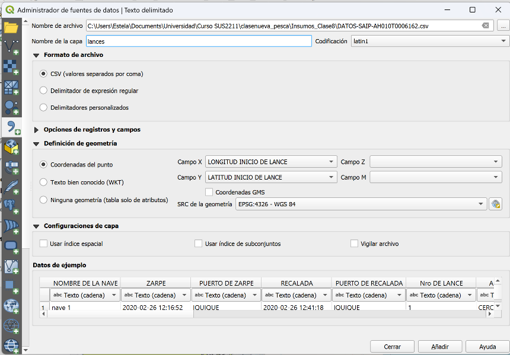{fig-align="center"}

::: callout-note
**PAUSA** — esto crea una capa de puntos con el **inicio de cada lance**. Debería visualizarse así (fíjate que hay puntos claramente fuera de Chile — los vamos a limpiar más adelante):

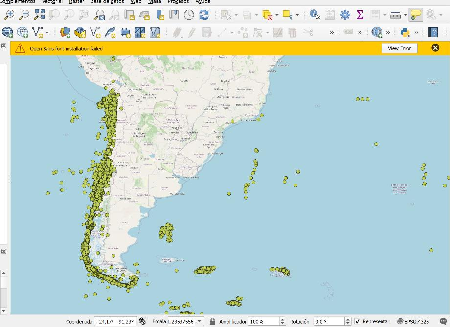{fig-align="center"}
:::

------------------------------------------------------------------------

## Paso 3 | Exportar los lances a GeoPackage en EPSG:3857

::: callout-tip
**¿Por qué reproyectar a EPSG:3857?** El resto de este análisis necesita **medir distancias en metros** (buffers de 5 km, por ejemplo). Para eso necesitamos un sistema de coordenadas **proyectado** cuya unidad sea el metro. Usaremos **EPSG:3857 – WGS 84 / Pseudo Mercator**, que es el mismo sistema del mapa base.
:::

**6.** Haz clic derecho sobre la capa de puntos recién cargada (`Lances`) → **Exportar → Guardar objetos como...**

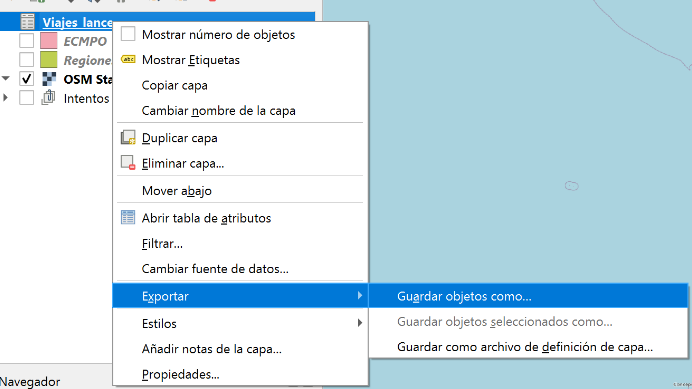{fig-align="center"}

**7.** Configura:

-   **Formato:** GeoPackage
-   **Nombre de archivo:** `lance(3857)`
-   **Nombre de la capa:** `lance(3857)`
-   **SRC:** `EPSG:3857 - WGS 84 / Pseudo Mercator`

Haz clic en **Aceptar**.

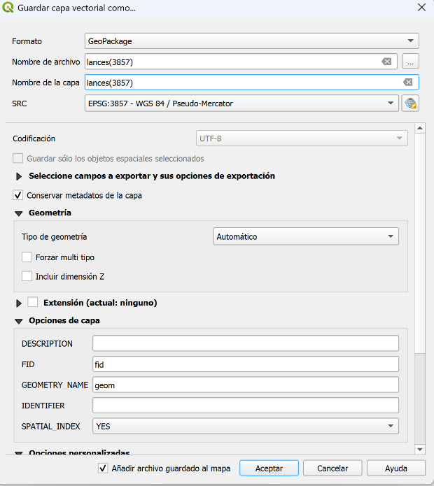{fig-align="center"}

------------------------------------------------------------------------

## Paso 4 | Reproyectar la capa ECMPO a EPSG:3857

**8.** Ve al menú superior y haz clic en: **Vectorial → Herramientas de gestión de datos → Reproyectar capa...**

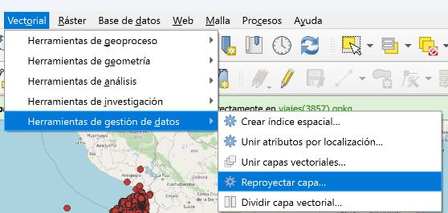{fig-align="center"}

**9.** Configura:

-   **Capa de entrada:** `ECMPO` (zonas costeras de pueblos originarios)
-   **SRC objetivo:** `EPSG:3857 - WGS 84 / Pseudo Mercator`

Click en **Aceptar**.

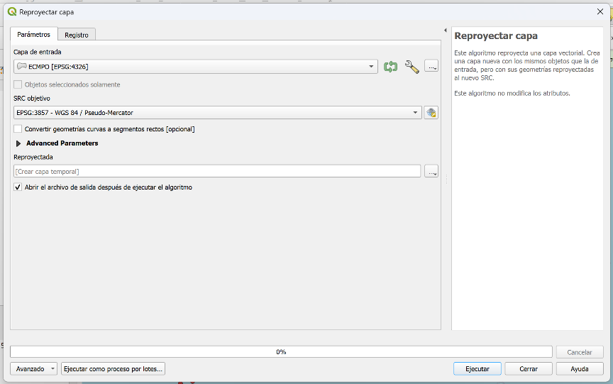{fig-align="center"}

**10.** Para mantener el orden de tus capas, modifica el nombre de la capa recién proyectada a `ECMPO_reproyectada`. Haz clic derecho sobre la capa y selecciona **Cambiar nombre de la capa**.

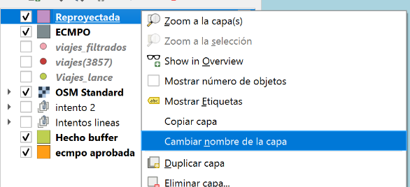{fig-align="center"}

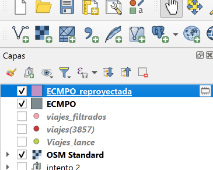{fig-align="center"}

------------------------------------------------------------------------

## Paso 5 | Verificar y limpiar coordenadas con orden de magnitud

::: callout-tip
**¿Qué estamos haciendo?** Estamos **limpiando los datos** para excluir registros con coordenadas **falsas, nulas o absurdas**. Esto se conoce como aplicar un *"orden de magnitud razonable"* a las coordenadas.

**¿Por qué lo hacemos?** Cuando se trabaja con datos masivos (como lances de pesca industrial), es **común encontrar errores de georreferenciación**: longitudes positivas (como si estuvieran en África), coordenadas 0,0 (en medio del Atlántico), latitudes extremas, etc.
:::

**11.** Haz clic derecho sobre tu capa de lances (`lance(3857)`) → **Abrir tabla de atributos**. Posteriormente, abre la **Calculadora de Campos**.

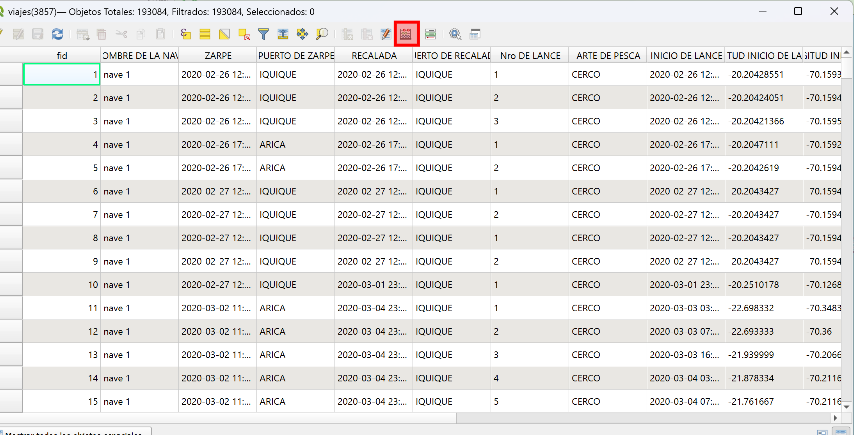{fig-align="center"}

**12.** Configura:

-   Marca **"Crear un campo nuevo"**
-   **Nombre del nuevo campo:** `valido_geo`
-   **Tipo del campo de salida:** Entero (32 bit)

Introduce la siguiente expresión:

```
CASE
WHEN
  "LATITUD INICIO DE LANCE"  BETWEEN -60 AND -15 AND
  "LONGITUD INICIO DE LANCE" BETWEEN -80 AND -65 AND
  "LATITUD FIN DE LANCE"     BETWEEN -60 AND -15 AND
  "LONGITUD FIN DE LANCE"    BETWEEN -80 AND -65
THEN 1
ELSE 0
END
```

Haz click en **Aceptar** y cierra la Calculadora de Campos.

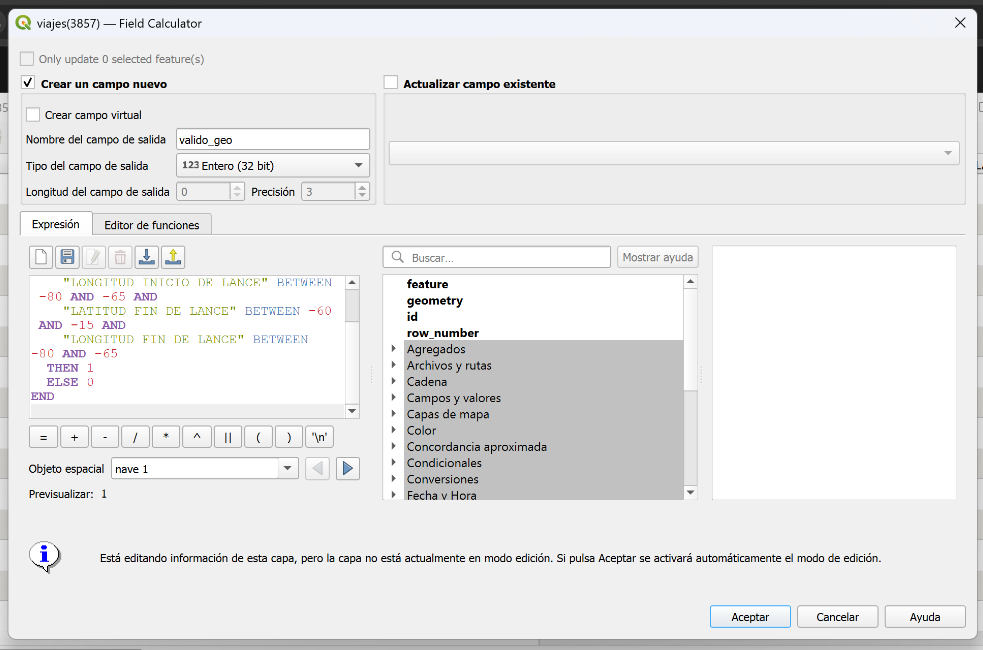{fig-align="center"}

::: callout-tip
Esto marcará con un **1** los registros válidos y con un **0** los inválidos (coordenadas fuera del rango razonable para Chile continental e insular).
:::

------------------------------------------------------------------------

## Paso 6 | Seleccionar los lances válidos y exportarlos

**13.** Haz clic en el **ícono de embudo con Epsilon (ε)** → **"Seleccionar por expresión"**.

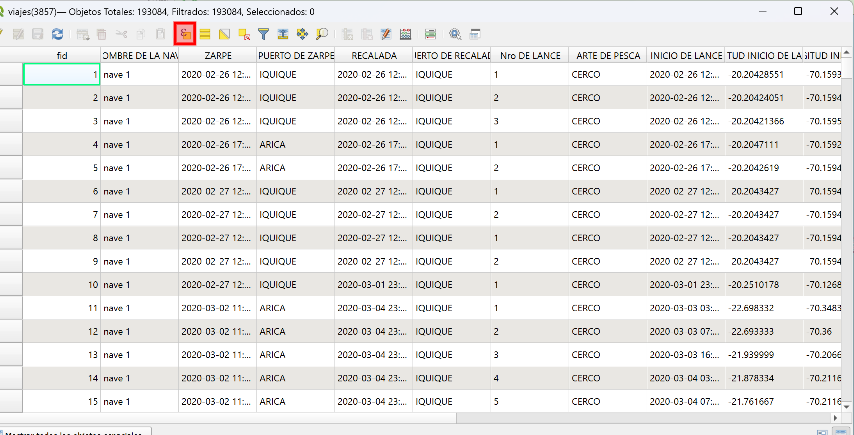{fig-align="center"}

**14.** Escribe: `"valido_geo" = 1`

Haz clic en **Seleccionar → Verás que se seleccionan los lances correctos.**

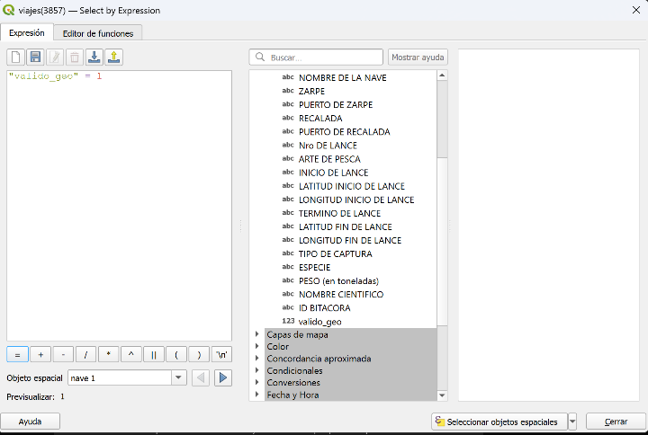{fig-align="center"}

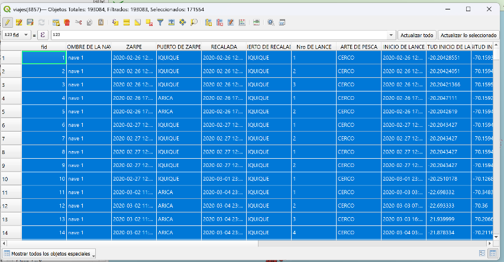{fig-align="center"}

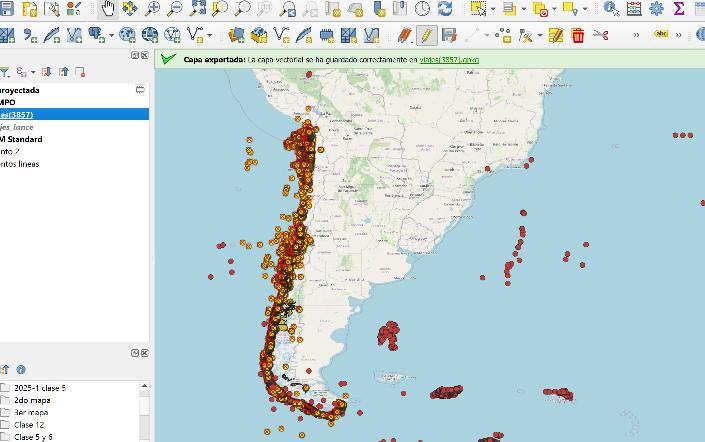{fig-align="center"}

**15.** Exporta como nueva capa. Haz clic derecho sobre la capa de lances → **Exportar → Guardar objetos seleccionados como...**

{fig-align="center"}

**16.** Configura:

-   **Formato:** GeoPackage
-   **Nombre de archivo:** `lances_filtrados`
-   **Nombre de la capa:** `lances_filtrados`
-   **SRC:** `EPSG:3857 - WGS 84 / Pseudo Mercator`

Haz clic en **Aceptar**.

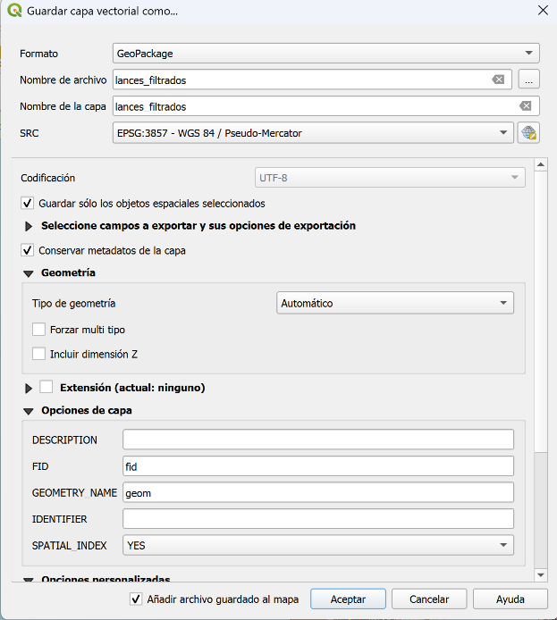{fig-align="center"}

------------------------------------------------------------------------

## Paso 7 | Filtrar solo las ECMPO oficialmente decretadas

::: callout-tip
La capa `ECMPO_reproyectada` contiene tanto **solicitudes** como **ECMPO ya decretadas**. Para nuestro análisis de posibles incumplimiento nos interesan **solo las que ya están oficialmente vigentes**, porque son las que generan la obligación legal.
:::

**17.** Haz clic derecho sobre `ECMPO_reproyectada` → **Abrir tabla de atributos**. Posteriormente, haz click en el **embudo con Epsilon (ε) → "Seleccionar por expresión"**.

**18.** Escribe: `"status" = 'SECTOR DECRETADO'`

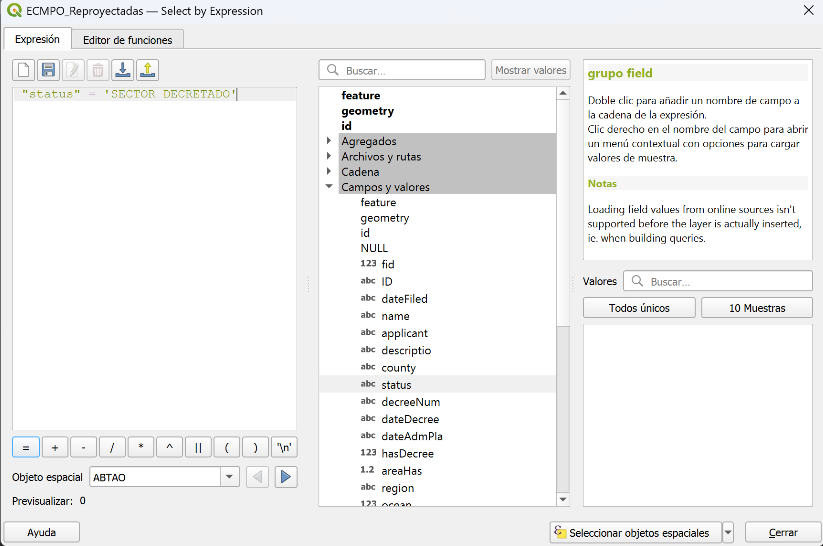{fig-align="center"}

**19.** Una vez seleccionados los polígonos correspondientes, haz clic derecho sobre la capa → **Exportar → Guardar objetos seleccionados como...**


**20.** Configura:

-   **Formato:** GeoPackage
-   **Nombre de archivo:** `ecmpo_decretadas`
-   **SRC:** `EPSG:3857 - WGS 84 / Pseudo Mercator`

Haz clic en **Aceptar**.


------------------------------------------------------------------------

## Paso 8 | Filtrar los lances dentro de la ZEE

::: callout-tip
**¿Qué es la ZEE?** La **Zona Económica Exclusiva** (ZEE) es la franja de mar jurisdiccional de Chile, que se extiende **370,4 km (200 millas náuticas)** desde la costa. Nos quedamos solo con los lances que ocurrieron **dentro de la ZEE** para asegurarnos de que el análisis se limita a los casos que **sí podrían estar infringiendo la normativa chilena**. Lances en alta mar o en aguas de otros países no se consideran en esta evaluación.
:::


**21.** Seleccionaremos los lances que intersectan la ZEE. Ve a **Seleccionar por localización**.

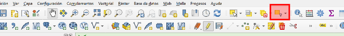{fig-align="center"}

**22.** En el panel que se abre:

-   **Seleccionar objetos de:** `lances_filtrados`
-   **Donde los objetos (predicado geométrico):** `intersecan`
-   **Comparando con los objetos de:** `ZEE_Chile`
-   **Modificar la selección actual por:** `creando una nueva selección`

Haz clic en **Ejecutar**.

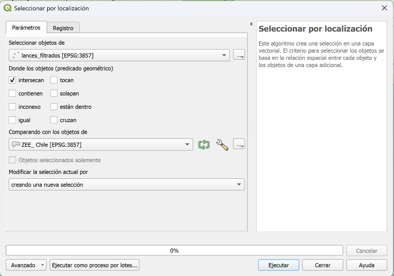{fig-align="center"}

::: callout-note
**PAUSA** — debería verse así:

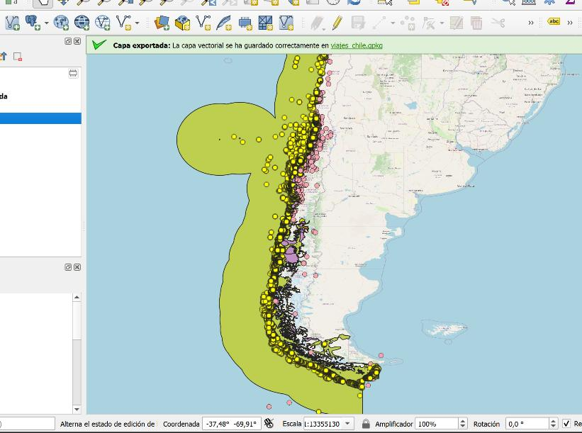{fig-align="center"}
:::

**23.** Exporta como nueva capa. Haz clic derecho sobre la capa de lances → **Exportar → Guardar objetos seleccionados como...**

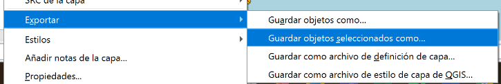{fig-align="center"}

**24.** Configura:

-   **Formato:** GeoPackage
-   **Nombre de archivo:** `lances_chile_ZEE`
-   **Nombre de la capa:** `lances_chile_ZEE`
-   **SRC:** `EPSG:3857 - WGS 84 / Pseudo Mercator`

Haz clic en **Aceptar**.

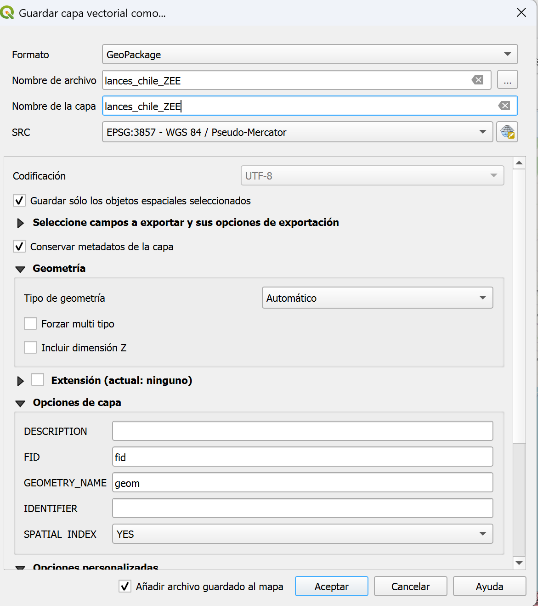{fig-align="center"}

------------------------------------------------------------------------

## Paso 9 | Buffer de 5 km alrededor de cada ECMPO decretada

::: callout-note
**Zonificación espacial para análisis comparado.** Generaremos un área de **5 km alrededor de cada ECMPO decretada**. Esta es la base para identificar la **presión pesquera en su borde inmediato**.
:::

**25.** Ve al menú **Vectorial → Herramientas de geoproceso → Buffer**.

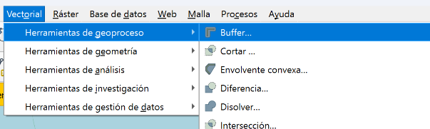{fig-align="center"}

**26.** Configura:

-   **Capa de entrada:** `ecmpo_decretadas`
-   **Distancia:** `5000` metros
-   **No** marcar "Disolver resultado"
-   Haz click sobre los puntos suspensivos y posteriormente **Guardar archivo en GeoPackage**

Guarda el archivo Resultado: `buffer_ecmpo_5km`.

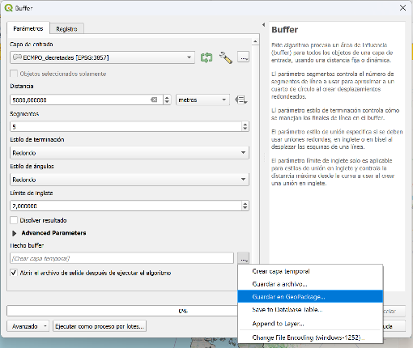{fig-align="center"}

::: callout-tip
Este archivo contiene los buffers **brutos** de 5 km por ECMPO, pero aún podrían solaparse entre sí. Por eso, en el siguiente paso los disolvemos.
:::

------------------------------------------------------------------------

## Paso 10 | Disolver los buffers

**27.** Con este paso **unificamos los buffers por ECMPO**. Ve a **Vectorial → Geoprocesamiento → Disolver**.

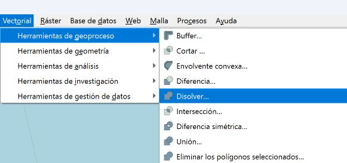{fig-align="center"}

**28.** Configura:

-   **Capa de entrada:** `buffer_ecmpo_5km`
-   **Resultado:** `buffer_ecmpo_disueltos`

Esto elimina los solapamientos internos entre los buffers generados por los distintos fragmentos de una misma ECMPO, agrupándolos en un solo polígono por unidad. **Aunque no evita que se superpongan con buffers de otras ECMPO**, permite que posteriormente — al restar el polígono original — se obtenga un anillo externo exclusivo para cada una.

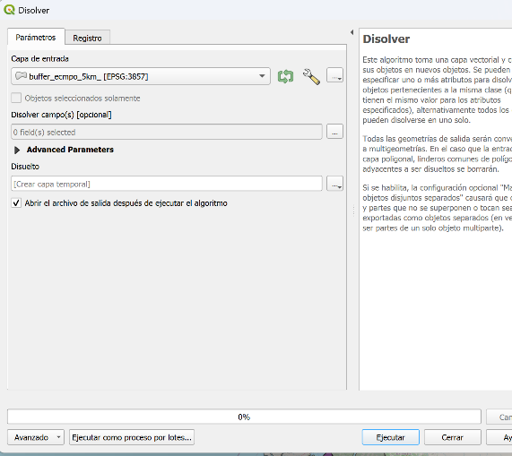{fig-align="center"}

**29.** Como se realizó en el paso N°10, para mantener el orden de tus capas, modifica el nombre de la disolución generada a `buffer_ecmpo_disueltos`.

------------------------------------------------------------------------

## Paso 11 | Calcular el anillo externo de 5 km

::: callout-tip
Este paso permite **restar el polígono original de la ECMPO al buffer disuelto**, para así obtener solamente el **anillo externo**, es decir, la zona de borde de 5 km **sin incluir el interior de la ECMPO**. Esto nos permite distinguir los lances que caen *dentro* de la ECMPO vs. los que caen en su *borde inmediato*.
:::

**30.** Ve a **Vectorial → Geoprocesamiento → Diferencia**.

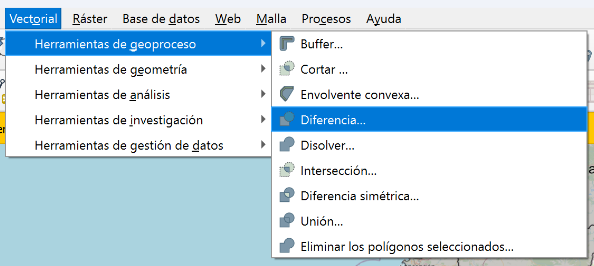{fig-align="center"}

**31.** Configura:

-   **Capa de entrada:** `buffer_ecmpo_disueltos`
-   **Capa de superposición (desuperposición):** `ECMPO_reproyectada`

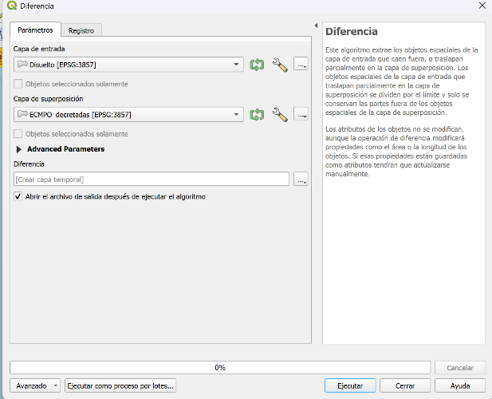{fig-align="center"}

**32.** Como se realizó en el paso N°29, para mantener el orden de tus capas, modifica el nombre al proceso generado a `anillo_externo_ecmpo`.

------------------------------------------------------------------------

## Paso 12 | Intersectar lances con ECMPO y con el anillo externo

::: callout-tip
**C) Intersecar lances con ECMPO.** Ahora realizaremos **dos intersecciones** para identificar:

-   Lances que ocurrieron **dentro** de ECMPO decretadas.
-   Lances que ocurrieron en el **anillo externo** (5 km alrededor).
:::

### Intersección 1 — Lances dentro de ECMPO

**33.** Ve al menú superior y haz clic en **Vectorial → Herramientas de geoproceso → Intersección**.

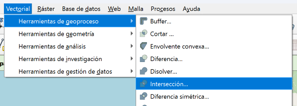{fig-align="center"}

**34.** Configura los parámetros:

-   **Capa de entrada:** `lances_chile_ZEE` (la capa de lances ya filtrada dentro de la ZEE)
-   **Capa superpuesta:** `ecmpo_decretadas` (la capa filtrada que contiene solo ECMPO oficialmente decretadas)

Haz clic en **Ejecutar**.

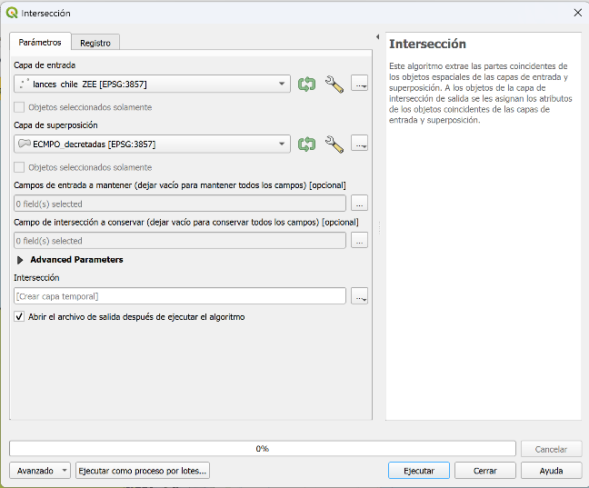{fig-align="center"}

**35.** Como se realizó en el paso N°32, para mantener el orden de tus capas, modifica el nombre de la intersección generada a `Lances_dentro_ECMPO`.

::: callout-note
**PAUSA** — debería verse así:

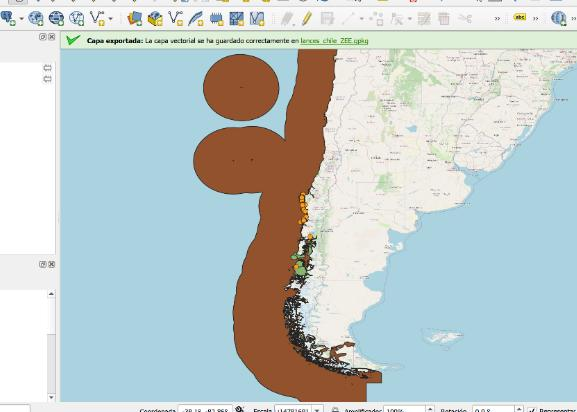{fig-align="center"}

QGIS generará una nueva capa que contiene **solo los lances que intersectan espacialmente con las ECMPO**.
:::

### Intersección 2 — Lances en el anillo de 5 km

**36.** Ve al menú superior y haz clic en **Vectorial → Herramientas de geoproceso → Intersección**.

**37.** Configura los parámetros:

-   **Capa de entrada:** `lances_chile_ZEE`
-   **Capa superpuesta:** `anillo_externo_ecmpo` (el anillo de 5 km, sin solapamientos)

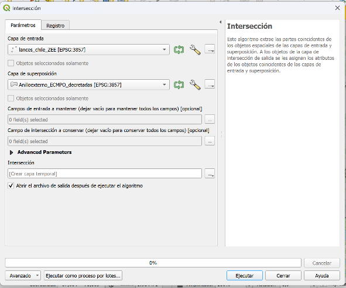{fig-align="center"}

**38.** Como se realizó en el paso N°35, para mantener el orden de tus capas, modifica el nombre al proceso generado a `lances_borde_ecmpo`.

------------------------------------------------------------------------

## Paso 13 | Clasificar los lances por zona (Dentro vs. Borde)

::: callout-tip
**D) Clasificar lances por zona y periodo.** En esta sección agregaremos dos campos a las capas resultantes de las intersecciones para construir mapas temáticos que comparan la actividad pesquera **antes y después del decreto**, **dentro y fuera** de las ECMPO.
:::

### En la capa `Lances_dentro_ECMPO`

**39.** Haz clic derecho sobre la capa `Lances_dentro_ECMPO` → **Abrir tabla de atributos**. Posteriormente, abre la **Calculadora de Campos**.

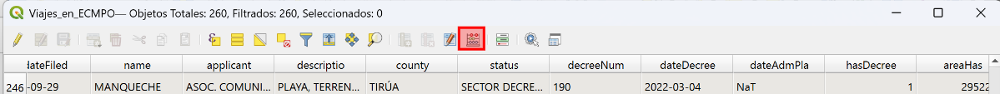{fig-align="center"}

**40.** Configura lo siguiente:

-   Marca la opción **"Crear un campo nuevo"**
-   **Nombre del campo:** `zona`
-   **Tipo de campo:** Texto (cadena)

Escribe esta expresión: `'Dentro'`

Click en **Aceptar**.

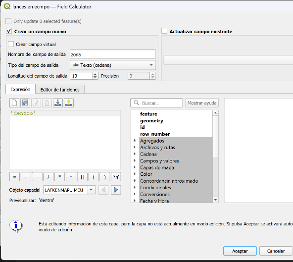{fig-align="center"}

### En la capa `lances_borde_ecmpo`

**41.** Haz clic derecho sobre la capa `lances_borde_ecmpo` → **Abrir tabla de atributos**. Posteriormente, abre la **Calculadora de Campos**.

**42.** Configura lo siguiente:

-   Marca la opción **"Crear un campo nuevo"**
-   **Nombre del campo:** `zona`
-   **Tipo de campo:** Texto (cadena)

Escribe esta expresión: `'Borde'`

Click en **Aceptar**.

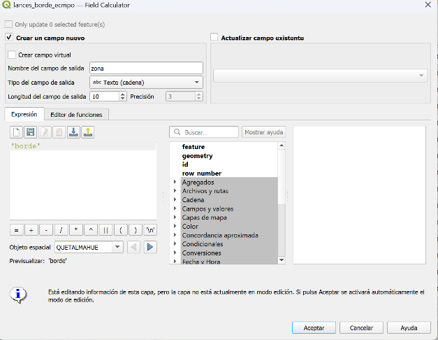{fig-align="center"}

**43.** En **ambas capas guarden los cambios efectuados**. Esto te permitirá distinguir espacialmente los lances según si ocurrieron dentro del ECMPO o en su borde inmediato.

------------------------------------------------------------------------

## Paso 14 | Clasificar los lances por periodo (Antes vs. Después)

**44.** En **ambas capas**, abre la tabla de atributos y, posteriormente, la **Calculadora de Campos**.

**45.** En la Calculadora de Campos:

-   Marca **"Crear un campo nuevo"**
-   **Nombre del campo:** `periodo`
-   **Tipo de campo:** Texto (cadena)

Expresión:

```
CASE
  WHEN "RECALADA" < "dateDecree" THEN 'Antes'
  ELSE 'Después'
END
```

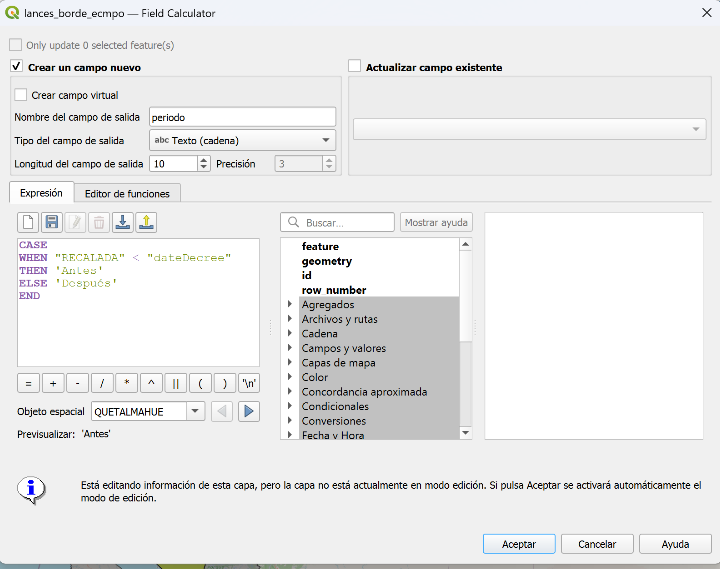{fig-align="center"}

**46.** En **ambas capas guarden los cambios efectuados**.

::: callout-tip
Con este campo cada lance queda marcado como ocurrido **Antes** o **Después** del decreto de la ECMPO en la que cae — esa es la base para comparar los dos mapas que vienen.
:::

------------------------------------------------------------------------

## Paso 15 | Mapa 1 — Actividad pesquera *antes* del decreto

::: callout-tip
**ETAPA 4 — Visualización final mediante dos mapas comparativos.** En esta guía nos centraremos en la **Región del Biobío y sus ECMPO**, pero para el portafolio pueden elegir un ECMPO a elección.

**Objetivo de los mapas:** Visualizar la dinámica espacial de la pesca industrial en torno a las ECMPO decretadas, comparando la situación **antes y después del decreto**, distinguiendo si los lances ocurrieron **dentro** o en el **borde** (anillo externo de 5 km sin solapamientos).
:::

**Mapa 1** — Este mapa muestra los lances ocurridos **antes de que la ECMPO fuera decretada**, indicando si ocurrieron **dentro de la zona que luego sería ECMPO** o en su borde.

**47.** En ambas capas `Lances_dentro_ECMPO` y `lances_borde_ecmpo`, ve a **Propiedad → Fuentes → Constructor de consultas**.

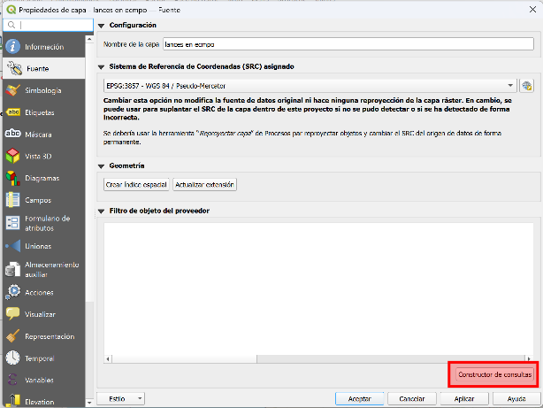{fig-align="center"}

**48.** Escriba la siguiente expresión para filtrar:

```
"periodo" = 'Antes'
```

Click en **Aceptar** en ambas pestañas.

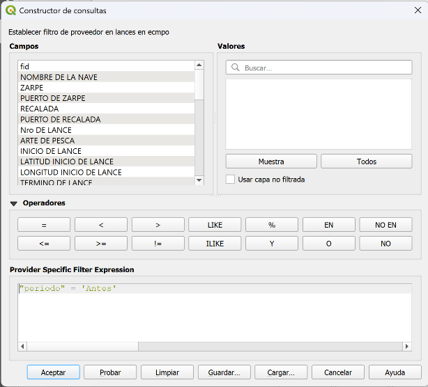{fig-align="center"}

**49.** En ambas capas: `Lances_dentro_ECMPO` y `lances_borde_ecmpo`, como se ha hecho en clases anteriores anda a **Propiedades → Simbología**; asigna **un color distinto a cada capa** para que se distingan visualmente en los mapas:

-   Capa `Lances_dentro_ECMPO` → simbología en **azul (o verde)**. Representa los lances industriales que ocurrieron **dentro** de las ECMPO.
-   Capa `lances_borde_ecmpo` → simbología en **naranja (o rojo)**. Representa los lances industriales que ocurrieron en el **borde** (anillo externo de 5 km).

::: callout-note
**PAUSA** — debería visualizarse algo así:

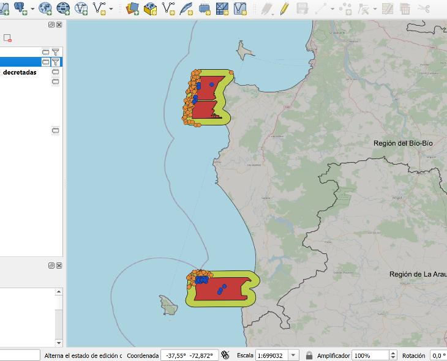{fig-align="center"}
:::

**50.** Estiliza las otras capas de contexto. Recomendaciones:

-   **ECMPO_reproyectada:**
    -   Color de borde: negro/blanco
    -   Relleno: gris-azulado (distinto del océano del mapa base)
-   **anillo_externo_ecmpo (decretadas):**
    -   Borde: celeste claro, sin relleno o muy tenue
-   Si decides incluir un shape de las regiones del país (utilizado en clases anteriores):
    -   Color: gris claro
    -   Usa simbología simple

**51.** Recuerda apagar temporalmente las otras capas y puedes ir a **"Nueva composición de impresión"** a confeccionar el diseño final de tu mapa como hemos aprendido en clases anteriores.

::: callout-note
**PAUSA** — debería verse así:

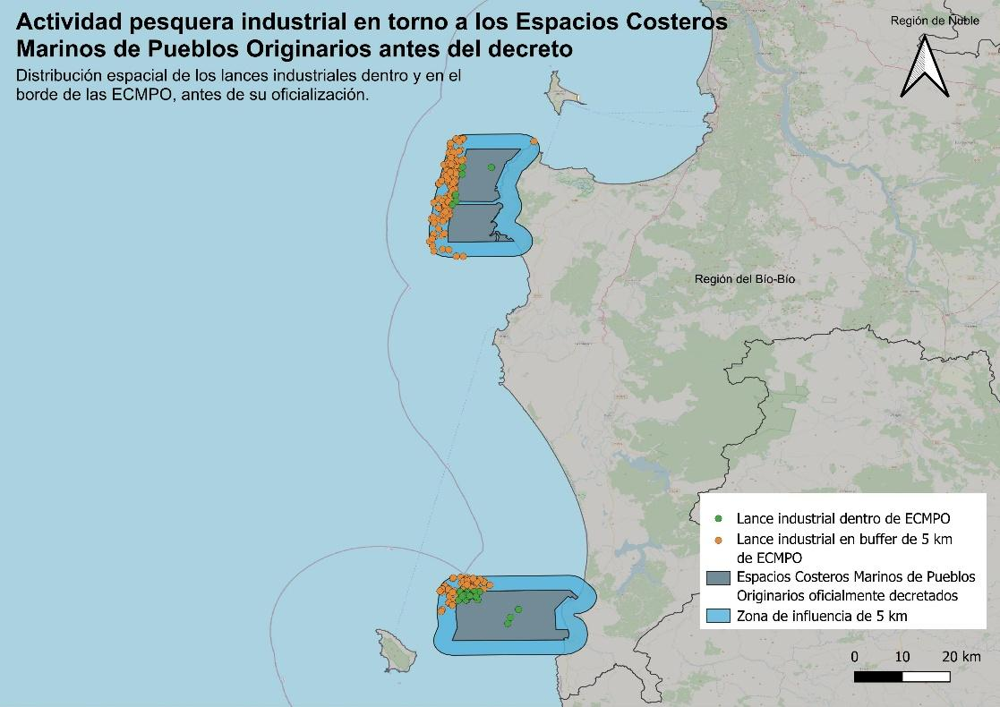{fig-align="center"}
:::

------------------------------------------------------------------------

## Paso 16 | Mapa 2 — Actividad pesquera *después* del decreto

**Mapa 2** — Este mapa muestra los lances ocurridos **una vez decretada la ECMPO**, y permite ver **si cambió la intensidad o localización de los lances** respecto al área protegida.

**52.** En ambas capas `Lances_dentro_ECMPO` y `lances_borde_ecmpo`, ve a **Propiedad → Duplicar capa**.

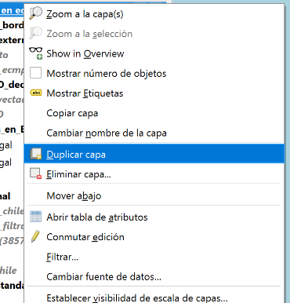{fig-align="center"}

**53.** En las nuevas capas, repite los pasos N°47 y N°48, pero con la siguiente expresión en el **Constructor de consultas**:

```
"periodo" = 'Después'
```

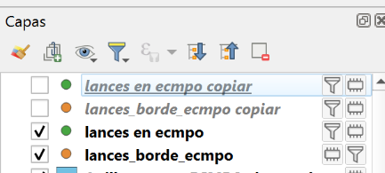{fig-align="center"}

**54.** Mantén los **mismos colores** en todas las capas para que la comparación sea más efectiva.

**55.** Recuerda apagar temporalmente las otras capas y puedes ir a **"Nueva composición de impresión"** a confeccionar el diseño final de tu mapa como hemos aprendido en clases anteriores.

::: callout-note
**PAUSA** — debería verse así:

{fig-align="center"}
:::

------------------------------------------------------------------------

## ¡Listo! {.unnumbered .unlisted}

Has finalizado tus mapas y ejercicios. **Recuerda completar esta actividad y guardar tu carpeta para utilizarla en tu próximo portafolio.**

::: callout-important
**Elige uno o varios ECMPO de interés para tu portafolio.** Considera las siguientes preguntas guía:

1.  ¿Qué implicancias tiene que un lance ocurra **después del decreto** de una ECMPO y **dentro** de su área protegida? ¿Podemos inferir automáticamente que hubo incumplimiento?
2.  ¿Cómo **cambia tu percepción del territorio** cuando representas espacialmente la relación entre pesca industrial y espacios indígenas?
3.  ¿Cómo se relaciona este análisis con conceptos más amplios como la **justicia ambiental** y la **gobernanza marina**?
:::
