## Objetivo

El objetivo de esta práctica es que **georreferencies un mapa histórico** — el *Plano de la reserva forestal y de las concesiones existentes en las provincias de Arauco, Malleco, Cautín y Valdivia* (1916, Ramón de Larcundo J.) — y lo uses como **fuente cartográfica primaria** para reconstruir la huella espacial de las primeras concesiones forestales en La Araucanía. Posteriormente compararás esa huella con la cobertura vegetal actual (CONAF 2017) para discutir los efectos de largo plazo de estas concesiones sobre el paisaje y los pueblos originarios.

**Herramientas por trabajar:**

-   Conversión de PDF a JPG (alta resolución) para uso cartográfico
-   Georreferenciación de imágenes en QGIS con sistema PSAD56 (EPSG:4248)
-   Inserción de puntos de control (GCP) y validación visual con OpenStreetMap
-   Digitalización de polígonos, puntos y líneas con Snapping
-   Cálculo de área elipsoidal y centroides
-   Matriz de distancia y unión no-espacial por tabla
-   Simbología basada en reglas para la comparación con catastros vegetales

::: callout-warning
**¡Importante!** Si estás trabajando en un computador de la universidad, no olvides guardar tu trabajo en **OneDrive** (u otro servicio en la nube), de lo contrario perderás tu avance. Los computadores de la sala de clases se **borran automáticamente cada semana**.
:::

------------------------------------------------------------------------

## Resumen del trabajo de esta clase

### Capas

| Capa | Descripción |
|---|---|
| **a)** `Plano_1916.pdf` (descarga) | Mapa histórico de concesiones forestales (1916), descargado desde la **Biblioteca Nacional Digital de Chile**. Es el **archivo bruto** de esta tarea — el JPG en alta resolución que usaremos para georreferenciar es un derivado y vivirá en `intermedios/`. |
| **b)** `Region_Araucania.gpkg` | Polígono del límite de la Región de La Araucanía. Sirve para acotar el análisis y validar visualmente la georreferenciación. |
| **c)** `Catastro_Vegetacional_2017.gpkg` | Catastro vegetacional CONAF 2017 para la Región de La Araucanía. Contiene el atributo **`USO`** con tipos de cobertura (Bosques, Terrenos Agrícolas, Áreas Urbanas e Industriales, etc.). |

### Procesos

1.  **Pasos 1–4 — Obtención del mapa histórico.** Descargar el PDF desde la Biblioteca Nacional Digital (a `datos/brutos/`), convertirlo a JPG (alta calidad) con un servicio en línea, y guardar el JPG en `datos/intermedios/` (la conversión es un paso humano, no es dato bruto).
2.  **Pasos 5–11 — Georreferenciación.** Configurar el Georreferenciador con sistema **PSAD56 (EPSG:4248)**, insertar al menos **6 puntos de control (GCP)** sobre intersecciones de latitud y longitud visibles en el mapa, ejecutar la transformación lineal y guardar tanto el ráster georreferenciado como los puntos de control para reproducibilidad.
3.  **Pasos 12–18 — Digitalización.** Crear shapefiles para tres geometrías: **polígonos** de concesiones forestales, **puntos** para Temuco y Valdivia, y una **línea** para la vía principal que conecta ambas ciudades. Activar **Snapping** para garantizar precisión geométrica.
4.  **Pasos 19–24 — Análisis espacial.** Calcular **área elipsoidal**, **centroides**, **matriz de distancia** entre cada concesión y las dos ciudades, y construir un **mapa de cercanía** (concesiones coloreadas según distancia mínima a la ciudad más próxima).
5.  **Pasos 25–28 — Comparación con CONAF 2017.** Superponer el catastro vegetacional actual sobre las concesiones de 1916, simbolizar por reglas (Bosques / Terrenos agrícolas / Otros) y producir el mapa final — la **huella histórica** sobre el paisaje contemporáneo.

------------------------------------------------------------------------

## Preparación: descarga y organización del material

### Descarga desde Canvas

**1.** Descarga el archivo `.zip` de esta tarea desde la página del curso en **Canvas** (carpeta "Clase 9"). El archivo contiene la capa de la Región de La Araucanía y el catastro vegetacional 2017 ya organizados.

**2.** Descomprime el archivo en una ubicación dedicada a este curso. Algunas opciones:

-   **Computador personal:** descomprime dentro de tu carpeta `SUS2211/`.
-   **Computador de la sala:** descomprime en el escritorio o en Documentos, pero **antes de terminar la sesión**, copia toda la carpeta a OneDrive, un pendrive u otro servicio en la nube.

------------------------------------------------------------------------

### Estructura de carpetas del proyecto

Al descomprimir el archivo, encontrarás la siguiente estructura de carpetas. Esta organización es la misma que hemos usado en clases anteriores y es **estándar para todas las tareas del curso**.

```{mermaid}
flowchart TD
    A["📁 clase9/"] --> B["📁 datos/"]
    A --> C["📁 documentos/"]
    A --> D["📁 proyectos/"]
    A --> E["📁 resultados/"]

    B --> F["📁 brutos/<br>🔒 datos originales<br>(no modificar)"]
    B --> G["📁 intermedios/<br>datos de geoprocesamiento"]
    B --> H["📁 procesados/<br>capas finales para mapeo"]

    E --> I["📁 mapas/<br>mapas exportados"]
    E --> J["📁 figuras/<br>gráficos y tablas"]

    style F fill:#fde8e8,stroke:#c0392b
    style G fill:#fef9e7,stroke:#f39c12
    style H fill:#eafaf1,stroke:#27ae60
    style D fill:#eaf4fb,stroke:#2980b9
    style C fill:#f4f6f7,stroke:#7f8c8d
```

::: {.callout-tip title="¿Para qué sirve cada carpeta?"}

**`datos/`** — Todo lo relacionado con los datos geoespaciales, organizado en tres subcarpetas:

-   **`brutos/`** 🔒 Datos originales tal como fueron descargados. **Nunca se modifican ni se sobreescriben.** En esta tarea: el `Plano_1916.pdf` que descargarás desde la Biblioteca Nacional Digital, `Region_Araucania.gpkg` y `Catastro_Vegetacional_2017.gpkg`.
-   **`intermedios/`** Resultados de operaciones humanas o de geoprocesamiento sobre los datos brutos. En esta tarea: `Plano_1916.jpg` (la conversión PDF→JPG en alta resolución que harás en el paso 3 — no es bruto porque pasó por una decisión humana sobre formato y calidad), `Plano_1916_georef.tif` (ráster georreferenciado), `Plano_1916.points` (puntos de control GCP guardados), `Concesiones_Forestales.gpkg`, `Ciudades.gpkg`, `Camino.gpkg`, `Concesiones_centroides.gpkg`, `Matriz_distancia.gpkg`.
-   **`procesados/`** Capas finales listas para confeccionar los mapas. En esta tarea: `Concesiones_Forestales_final.gpkg` (con campos de área elipsoidal y distancia mínima a ciudades).

**`documentos/`** — Documentación de respaldo. Se recomienda incluir una bitácora (`bitacora.txt` o `pasos.md`) que describa cómo transformaste los datos y, en particular, **qué intersecciones de latitud y longitud usaste como puntos de control**.

**`proyectos/`** — Archivos de proyecto QGIS (`.qgz`). Guarda aquí el proyecto de esta tarea, nómbralo `clase9.qgz`.

**`resultados/`** — Productos finales:

-   **`mapas/`** Los dos mapas finales: el **mapa de cercanía** (concesiones por distancia a ciudades) y el **mapa de huella** (concesiones de 1916 sobre el catastro 2017), exportados a PDF o imagen.
-   **`figuras/`** Gráficos, tablas u otros outputs.

:::

------------------------------------------------------------------------

### Material descargado

Dentro de `datos/brutos/` encontrarás los siguientes archivos:

| Archivo | Descripción |
|---|---|
| `Region_Araucania` (.gpkg) | Polígono del límite de la Región de La Araucanía. |
| `Catastro_Vegetacional_2017` (.gpkg) | Catastro vegetacional CONAF 2017 con atributo `USO` (tipo de cobertura). |

::: callout-tip
**El mapa histórico lo obtendrás tú.** En esta tarea el primer ejercicio consiste en **buscar y descargar** la cartografía original desde la Biblioteca Nacional Digital de Chile — un repositorio público y gratuito de patrimonio cultural. Aprender a obtener material primario es parte central de la práctica.
:::

------------------------------------------------------------------------

## ¡Empecemos! {.unnumbered .unlisted}

## Paso 1 | Crear el proyecto y activar el mapa base

**1.** Inicia QGIS en el computador.

**2.** Crea un proyecto nuevo y guárdalo dentro de la carpeta `proyectos/` con el nombre `clase9.qgz` (recuerda guardarlo en **OneDrive** si trabajas desde un computador de la sala).

{fig-align="center"}

**3.** Como ya lo hemos hecho en clases anteriores, activa un **mapa base** OpenStreetMap para tener una referencia visual. Ve a: **Web → QuickMapServices → OSM → OSM Standard**.

------------------------------------------------------------------------

## Paso 2 | Descargar el mapa histórico desde la Biblioteca Nacional Digital

::: callout-tip
**¿Por qué la Biblioteca Nacional Digital?** Es el repositorio público y gratuito de patrimonio cultural de Chile, e incluye una **Mapoteca** con cartografía histórica digitalizada. Aprender a obtener material primario desde fuentes oficiales es una habilidad clave: te permite trabajar con datos verificables y citables, en lugar de depender de copias de terceros sin procedencia clara.
:::

**4.** Abre tu navegador y entra a la **Biblioteca Nacional Digital de Chile** ([https://www.bibliotecanacionaldigital.gob.cl](https://www.bibliotecanacionaldigital.gob.cl)).

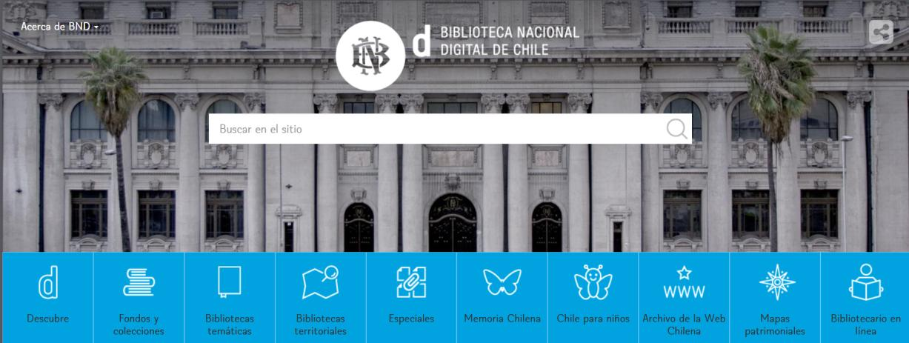{fig-align="center"}

**5.** En el buscador, escribe: **"Plano de la reserva forestal y de las concesiones existentes en las provincias de Arauco, Malleco, Cautín y Valdivia"**, o filtra por **Mapoteca** y busca a **Ramón de Larcundo J.** (autor, 1916).

**6.** Una vez en la ficha del mapa, haz click en **Visualizar** y descarga el archivo en formato **PDF**. Guarda el archivo dentro de `datos/brutos/` con el nombre `Plano_1916.pdf`.

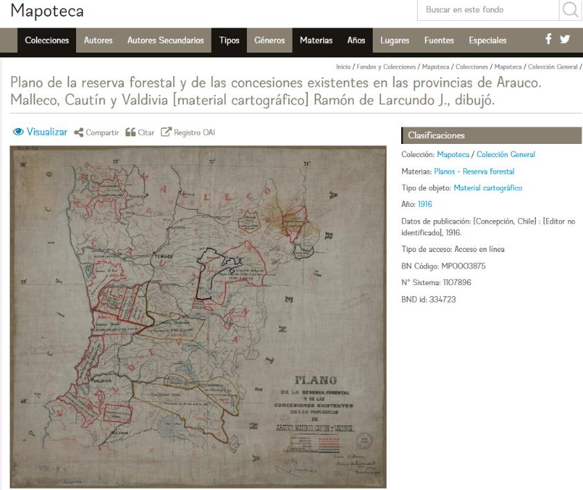{fig-align="center"}

------------------------------------------------------------------------

## Paso 3 | Convertir el PDF a JPG en alta resolución

::: callout-tip
**¿Por qué convertir a JPG?** El Georreferenciador de QGIS trabaja con formatos ráster (JPG, TIF, PNG), no con PDF. Necesitamos extraer la **imagen** del PDF para poder cargarla como ráster, asignarle puntos de control y proyectarla.
:::

**7.** Abre un convertidor en línea de PDF a JPG, por ejemplo **iLovePDF** ([https://www.ilovepdf.com/es/pdf_a_jpg](https://www.ilovepdf.com/es/pdf_a_jpg)).

**8.** Sube el archivo `Plano_1916.pdf`. En la columna derecha:

-   **Modo:** "Páginas a JPG" (cada página del PDF se convierte en una imagen JPG)
-   **Calidad de imagen:** **Alta** (¡muy importante! la opción "Normal" pierde detalle del mapa histórico)

Haz click en **Convertir a JPG** y descarga el resultado.

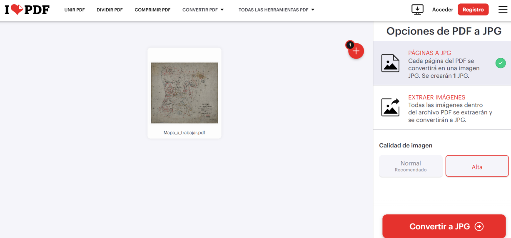{fig-align="center"}

**9.** Guarda el archivo resultante dentro de `datos/intermedios/` con el nombre `Plano_1916.jpg`.

::: callout-tip
**¿Por qué `intermedios/` y no `brutos/`?** Aunque el JPG sale del PDF original, **tú elegiste el formato (JPG vs. TIF), la calidad ("Alta" vs. "Normal") y la herramienta de conversión** (iLovePDF). Eso es una decisión humana sobre los datos, no una descarga directa: por convención, los archivos transformados — incluso ligeramente — viven en `intermedios/`, mientras que `brutos/` queda **intacto**. Así, si en el futuro alguien quiere reproducir tu trabajo desde cero, sabe exactamente desde dónde partir.
:::

::: callout-warning
**Antes de continuar:** abre el JPG con un visor de imágenes y verifica que se ve nítido — debes poder leer los nombres de las concesiones, los números de hectáreas y, sobre todo, las **marcas de latitud y longitud en los bordes del mapa**. Si la imagen se ve borrosa, vuelve al paso 8 y conviértela de nuevo seleccionando "Alta" en calidad de imagen.
:::

------------------------------------------------------------------------

## Paso 4 | Abrir el Georreferenciador en QGIS

**10.** Vuelve a QGIS y abre el **Georreferenciador**: ve al menú superior **Capa → Georreferenciador...**

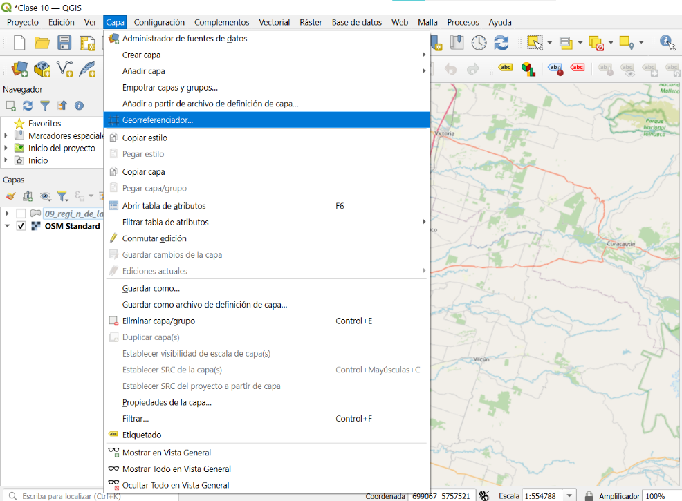{fig-align="center"}

**11.** Se abrirá una ventana vacía con una barra de herramientas y una **Tabla de PCT** (Puntos de Control Terrestre) en la parte inferior. Esta es la herramienta donde definiremos la referencia espacial del mapa histórico.

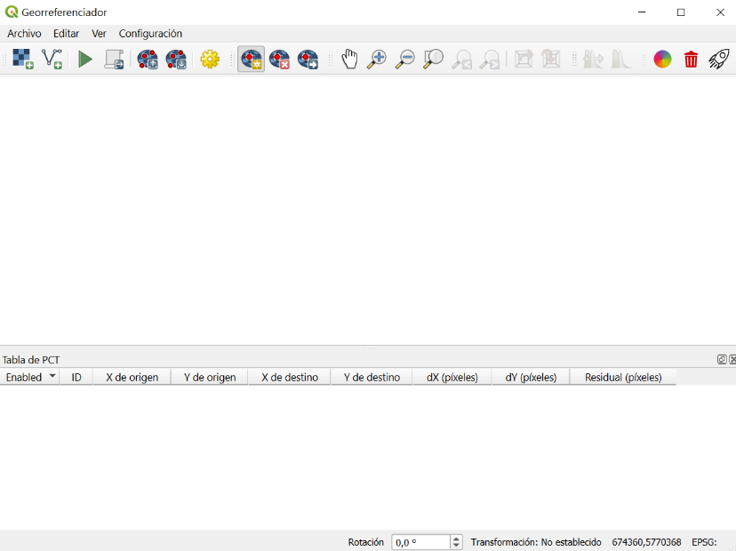{fig-align="center"}

------------------------------------------------------------------------

## Paso 5 | Configurar la transformación con sistema PSAD56

::: callout-tip
**¿Qué es PSAD56?** Es un **datum sudamericano** (Provisional South American Datum 1956) usado ampliamente en la cartografía chilena de mediados del siglo XX. Para mapas históricos como el de 1916, PSAD56 entrega una proyección **mucho más fiel** que sistemas modernos como WGS84 o SIRGAS2000, evitando errores de desplazamiento. El código EPSG correspondiente es **4248** (también puede aparecer como **4723** en algunas versiones).
:::

**12.** En la ventana del Georreferenciador, ve a **Configuración → Configurar transformación...**

**13.** Configura los parámetros:

-   **Tipo de transformación:** Lineal
-   **Target CRS (SRC objetivo):** haz click en el ícono y busca `PSAD56`
-   Selecciona **EPSG:4248 — PSAD56**

Click en **Aceptar**.

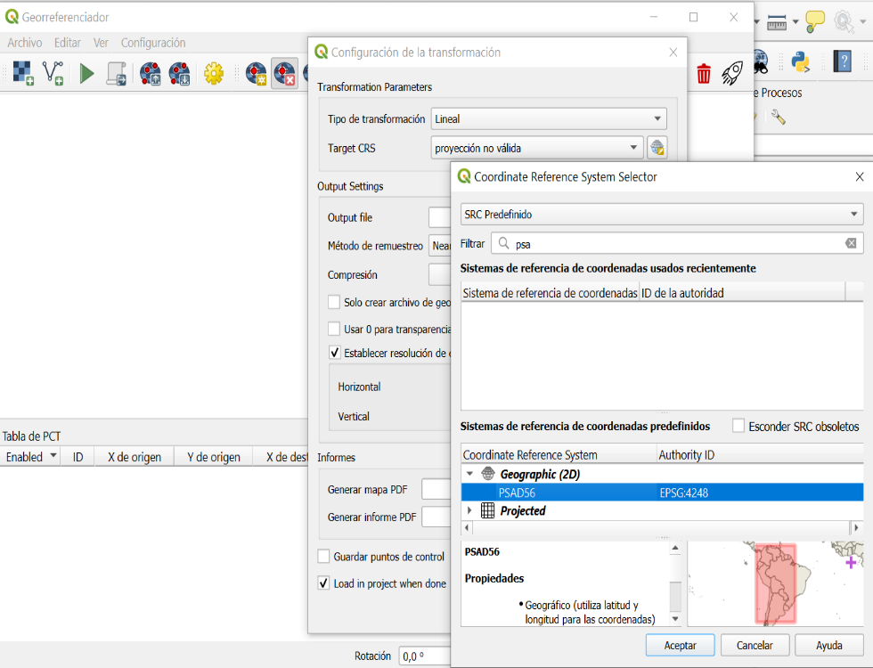{fig-align="center"}

------------------------------------------------------------------------

## Paso 6 | Cargar la imagen JPG del mapa histórico

**14.** En el Georreferenciador, ve a **Archivo → Abrir ráster...** (también disponible como ícono en la barra de herramientas).

**15.** Selecciona el archivo `Plano_1916.jpg` que guardaste en `datos/intermedios/` y ábrelo.

{fig-align="center"}

::: callout-note
**PAUSA** — la imagen del mapa histórico aparecerá en el panel principal del Georreferenciador. Tómate unos minutos para **explorarla**: identifica los bordes del mapa, las marcas de latitud y longitud (en grados), las dos ciudades grandes (Temuco y Valdivia) y los polígonos rojos que delimitan las concesiones forestales.
:::

------------------------------------------------------------------------

## Paso 7 | Insertar los puntos de control (GCP)

::: callout-tip
**¿Qué es un GCP?** Un **Punto de Control Terrestre** (Ground Control Point) asocia un punto de la imagen a sus coordenadas geográficas reales. Mientras más GCPs insertes — y mejor distribuidos por la imagen — más precisa será la georreferenciación.

En este mapa tenemos una ventaja: **los bordes del mapa muestran latitud y longitud explícitas**. Vamos a usar las **intersecciones entre líneas de latitud y longitud** como puntos de referencia.
:::

**16.** Activa el ícono **"Añadir punto"** (la chinche con un signo +) en la barra del Georreferenciador.

**17.** Haz click sobre una **intersección** entre una línea de latitud y una de longitud visible en el mapa (por ejemplo, donde la línea de **38° S** se cruza con la de **73° W**).

**18.** Se abrirá una ventana **"Introducir coordenadas de mapa"**. Ingresa las coordenadas correspondientes:

-   **X / Este:** la longitud en grados decimales (al **oeste** de Greenwich → **negativa**, ej. `-73`)
-   **Y / Norte:** la latitud en grados decimales (en el **hemisferio sur** → **negativa**, ej. `-38`)

Haz click en **Aceptar**.

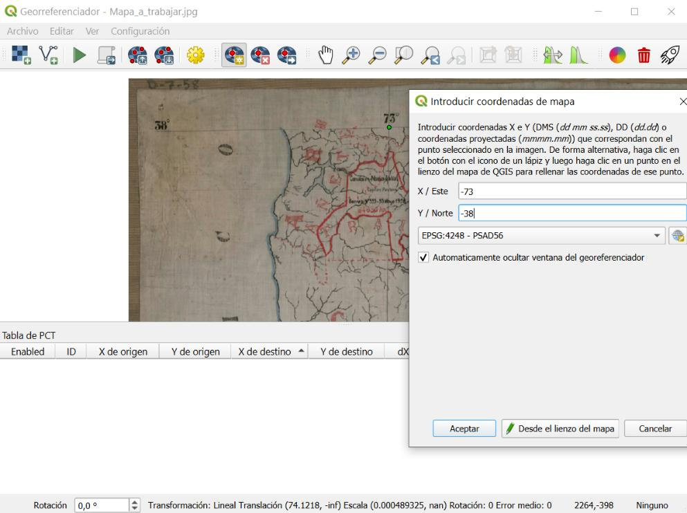{fig-align="center"}

::: callout-warning
**OJO con los signos.** Es el error más común al georreferenciar Chile:

-   La **latitud sur es negativa** (Chile continental: aprox. `-17` a `-56`).
-   La **longitud al oeste de Greenwich es negativa** (Chile continental: aprox. `-66` a `-76`).

Si confundes los signos, el mapa se proyectará en el lugar equivocado del planeta y pensarás que "no funcionó". Antes de aceptar cada GCP, verifica el signo.
:::

::: callout-tip
**Para tu próxima georreferenciación: cuidado con los minutos.** El mapa de 1916 que estamos usando aquí marca la cuadrícula **solo en grados enteros**, así que puedes ingresar los GCPs directamente (`-38`, `-73`, etc.). Pero **muchos otros mapas históricos** marcan la cuadrícula con mayor detalle, en intervalos de **minutos** (por ejemplo, líneas cada 30' o 15'). En esos casos, antes de ingresar cada coordenada, debes convertir los minutos a **grados decimales**, porque QGIS no acepta el formato grados-minutos-segundos.

Los **minutos están en base 60**, así que para convertirlos divides por 60:

-   `37° 30'` → 37 + 30/60 = **37.5**
-   `38° 15'` → 38 + 15/60 = **38.25**
-   `73° 45'` → 73 + 45/60 = **73.75**

Y recuerda **aplicar el signo al final**: una latitud de `38° 30' S` se ingresa como **`-38.5`**, y una longitud de `73° 15' W` como **`-73.25`**.
:::

**19.** Repite el proceso para insertar **al menos 6 puntos de control**, distribuidos por todo el mapa (esquinas + algunos puntos intermedios). Mientras más puntos y mejor distribuidos, mayor precisión.

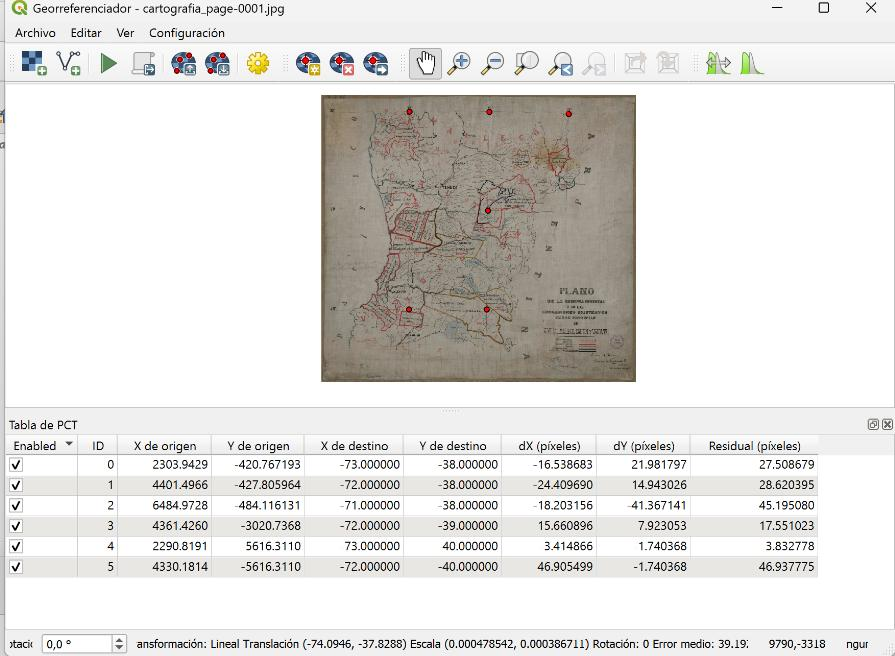{fig-align="center"}

::: callout-tip
**Lectura de residuales.** En la columna **"Residual (píxeles)"** de la Tabla de PCT, valores **bajos** (idealmente menores a la mitad del lado de la imagen en píxeles dividido por el número de GCPs) indican un buen ajuste. Si un punto tiene un residual mucho más alto que el resto, probablemente lo insertaste mal o invertiste un signo — bórralo y vuelve a intentar.
:::

------------------------------------------------------------------------

## Paso 8 | Ejecutar la georreferenciación

**20.** Antes de ejecutar, vuelve a **Configuración → Configurar transformación** y completa el campo **"Output file"**:

-   Click en los puntos suspensivos
-   Navega a `datos/intermedios/` y nombra el archivo `Plano_1916_georef.tif`
-   Marca **"Load in project when done"** para que la imagen se cargue automáticamente al proyecto principal

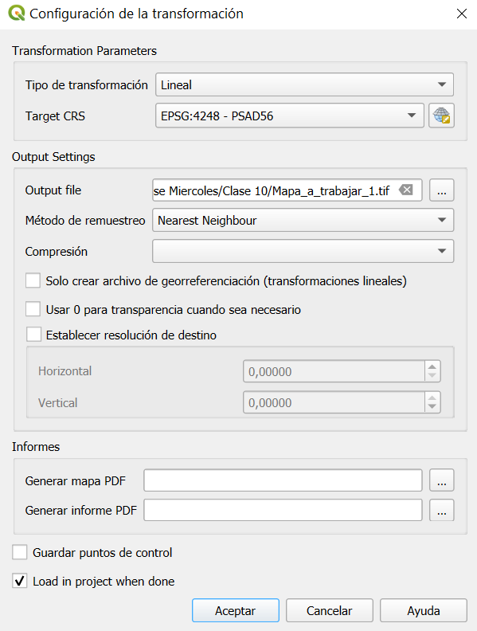{fig-align="center"}

**21.** Haz click en **Aceptar**, luego presiona el botón **"Comenzar georreferenciado"** (la flecha verde en la barra de herramientas) para ejecutar el proceso.

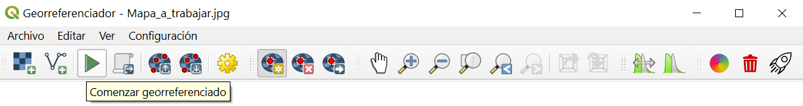{fig-align="center"}

------------------------------------------------------------------------

## Paso 9 | Guardar los puntos de control para reproducibilidad

::: callout-tip
**¿Por qué guardar los GCPs?** Si en el futuro quieres re-georreferenciar este mismo mapa (con más puntos, otra transformación, otra persona del equipo), no querrás volver a hacer click en cada intersección. Guardar el archivo `.points` te permite **cargar los GCPs de nuevo** en el Georreferenciador en otra sesión.
:::

**22.** En el Georreferenciador, haz click en el ícono **"Guardar puntos de control como..."**.

**23.** Guárdalo dentro de `datos/intermedios/` con el nombre `Plano_1916.points`.

{fig-align="center"}

------------------------------------------------------------------------

## Paso 10 | Verificar la georreferenciación con OpenStreetMap

**24.** Cierra el Georreferenciador. La imagen `Plano_1916_georef.tif` debería estar cargada en el proyecto principal de QGIS, **alineada sobre el mapa base OSM**.

**25.** Verifica visualmente que el mapa histórico **calza con la geografía actual**: los ríos del 1916 deberían aproximarse a los actuales, los grandes asentamientos (Temuco, Valdivia) deberían quedar cerca de las ciudades modernas.

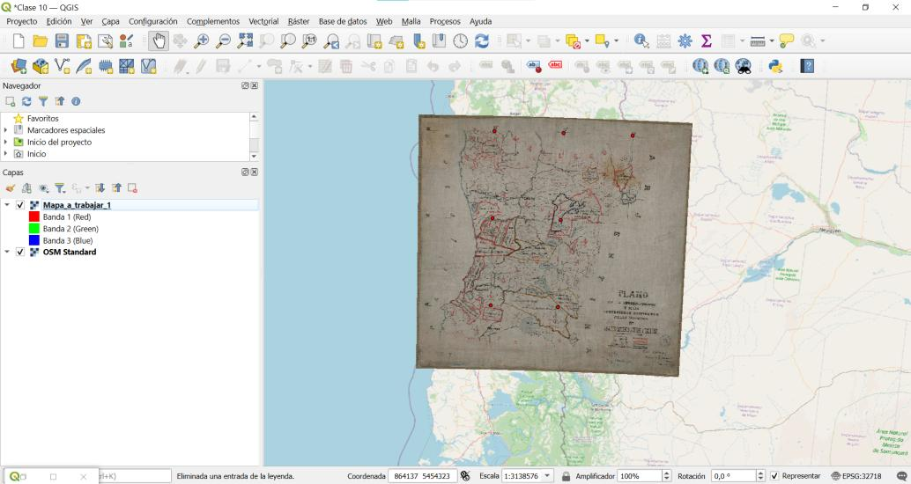{fig-align="center"}

::: callout-note
**Resultado esperado:** el mapa histórico **se posa sobre el OSM** sin desplazamientos evidentes. Si el ajuste es malo (la imagen aparece torcida, o desplazada en kilómetros), vuelve al paso 7 y revisa los signos de tus GCPs y la distribución espacial de los puntos.
:::

------------------------------------------------------------------------

## Paso 11 | Cargar el límite de la Región de La Araucanía

**26.** Ve a **Capa → Añadir capa → Añadir capa vectorial...** y carga `datos/brutos/Region_Araucania.gpkg`.

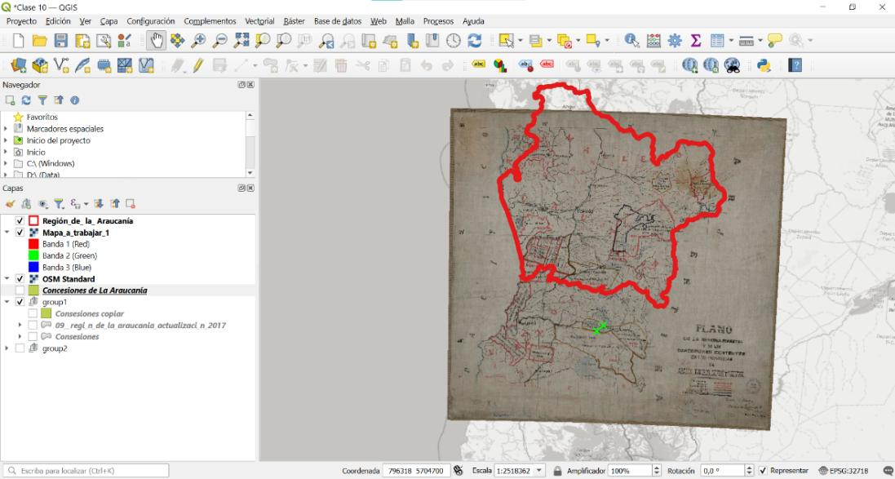{fig-align="center"}

**27.** Configura el estilo de la capa para que **veas a través** y puedas trabajar las concesiones que están dentro: doble click sobre la capa → **Simbología → Relleno → Estilo de relleno → "Sin relleno"**. Mantén el contorno (color rojo, ancho ~0.6 mm).

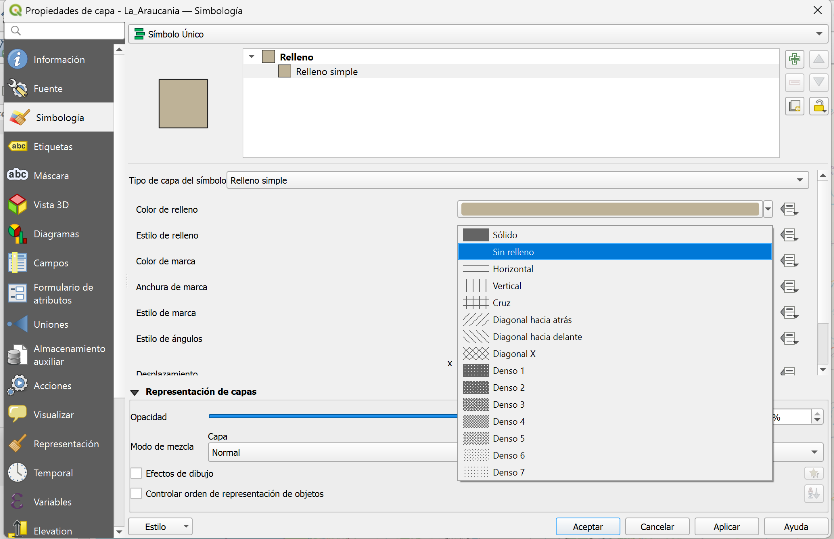{fig-align="center"}

------------------------------------------------------------------------

## Paso 12 | Crear la capa de Concesiones Forestales (polígono)

::: callout-tip
**¿Qué vamos a digitalizar?** Vamos a crear **tres capas vectoriales nuevas**, dibujando manualmente sobre el mapa histórico:

1.  **Concesiones Forestales** (polígonos) — los polígonos rojos que aparecen en el mapa de 1916
2.  **Ciudades** (puntos) — Temuco y Valdivia, los dos asentamientos visibles
3.  **Camino** (línea) — la vía principal que conecta ambas ciudades

Para cada concesión, además de dibujar el polígono, registraremos sus atributos: **nombre, decreto, estado (existente o caducada), año del decreto y hectáreas declaradas en la cartografía**.
:::

**28.** Para empezar la digitalización de Concesiones Forestales, crea un Shapefile. Ve a **Capa → Crear capa → Nueva capa de archivo shape...**

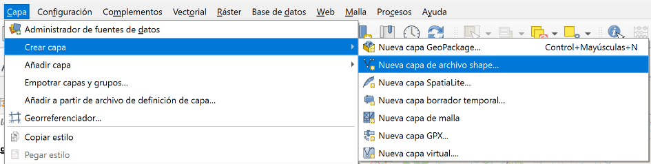{fig-align="center"}

**29.** Configura los parámetros básicos:

-   **Nombre de archivo:** `datos/intermedios/Concesiones_Forestales.shp`
-   **Codificación de archivo:** UTF-8
-   **Tipo de geometría:** **Polígono**
-   **SRC:** **EPSG:4248 — PSAD56** (el mismo que usamos al georreferenciar)

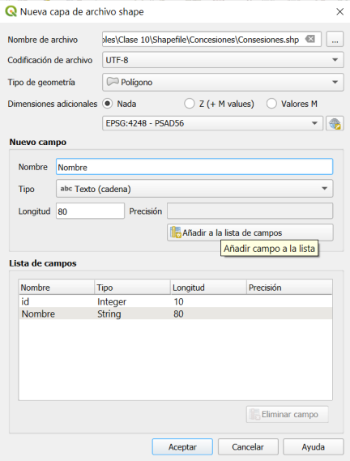{fig-align="center"}

**30.** En la sección **"Nuevo campo"**, agrega los siguientes campos uno por uno (presiona **"Añadir a la lista de campos"** después de cada uno):

| Nombre | Tipo | Longitud |
|---|---|---|
| `Nombre` | Texto (cadena) | 80 |
| `Decreto` | Entero (32 bit) | 10 |
| `Estado` | Texto (cadena) | 20 |
| `Hectareas` | Entero (32 bit) | 10 |
| `Anodecreto` | Entero (32 bit) | 10 |

Una vez completa la lista, click en **Aceptar**.

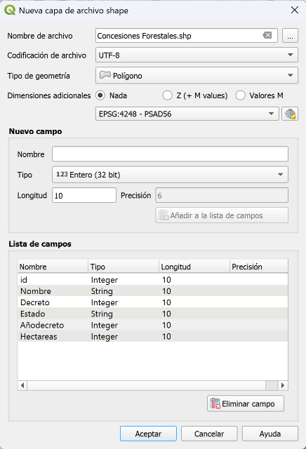{fig-align="center"}

------------------------------------------------------------------------

## Paso 13 | Activar y configurar Snapping

::: callout-tip
**¿Qué es el Snapping?** El **Snapping** garantiza que los vértices y bordes de los polígonos, puntos o líneas que dibujes se **ajusten con precisión** a otros elementos geográficos del mapa, evitando huecos o superposiciones invisibles. Es esencial para que la **vía principal** se conecte correctamente con las **ciudades**, y para que las concesiones que comparten un límite calcen perfectamente.
:::

**31.** Ve a **Proyecto → Opciones de autoensamblado...**

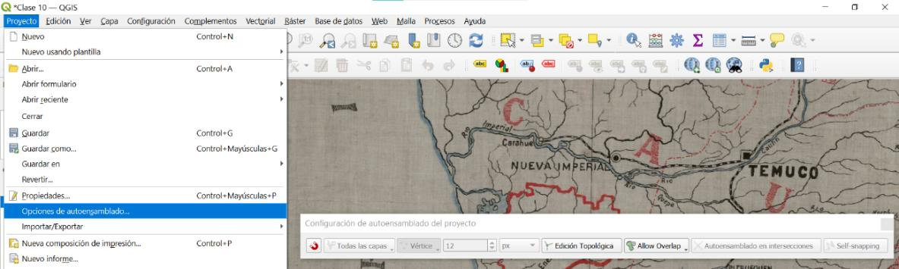{fig-align="center"}

**32.** Configura:

-   Activa **Snapping** (ícono del imán en la barra superior)
-   **Tipo de ajuste:** Vértice y segmento
-   **Tolerancia:** 10 píxeles
-   **Unidades:** píxeles
-   *(Opcional pero recomendado)* Activa **"Autoensamblado en intersecciones"**

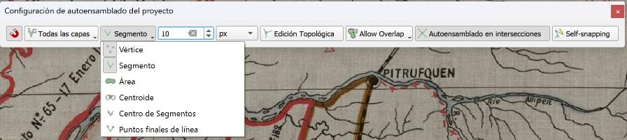{fig-align="center"}

------------------------------------------------------------------------

## Paso 14 | Digitalizar las concesiones forestales

**33.** Selecciona la capa `Concesiones_Forestales` en el panel **Capas** y activa el modo **edición** (ícono del lápiz amarillo). Luego haz click en **"Añadir polígono"**.

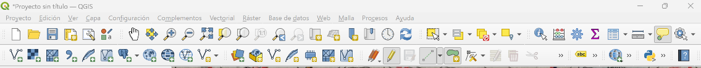{fig-align="center"}

**34.** Comienza a dibujar **una concesión a la vez**, siguiendo el contorno rojo de cada polígono visible en el mapa histórico. Usa referencias visibles (ríos, caminos, límites territoriales) para delimitar cada polígono. Click izquierdo para añadir vértices; click derecho para cerrar el polígono.

**35.** Al cerrar cada polígono, se abrirá una ventana emergente para llenar los **atributos**. Lee los datos directamente desde la cartografía:

-   **`Nombre`** — el nombre de la concesión (ej. *Bara Erans*, *Nueva Italia*, *Quepe*, etc.)
-   **`Decreto`** — el número de decreto (ej. `352`)
-   **`Estado`** — `Existente` o `Caducada` (suele estar indicado en la leyenda de cada polígono)
-   **`Hectareas`** — las hectáreas declaradas (ej. `21750`)
-   **`Anodecreto`** — el año del decreto (puede coincidir con 1916 o ser anterior)

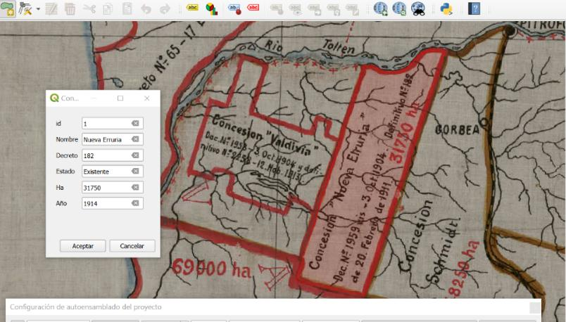{fig-align="center"}

**36.** Repite el proceso para **todas las concesiones** dentro del polígono regional. Una vez terminado, **guarda los cambios** (ícono del disquete) y desactiva la edición.

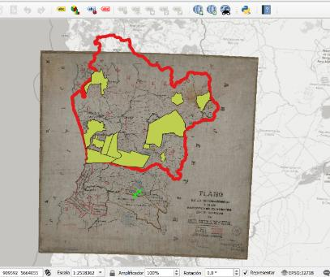{fig-align="center"}

------------------------------------------------------------------------

## Paso 15 | Crear la capa de Ciudades (punto)

**37.** Repite el procedimiento del paso 12, pero con:

-   **Nombre de archivo:** `datos/intermedios/Ciudades.shp`
-   **Tipo de geometría:** **Punto**
-   **SRC:** **EPSG:4248 — PSAD56**
-   **Campos:**

| Nombre | Tipo | Longitud |
|---|---|---|
| `Ciudad` | Texto (cadena) | 80 |

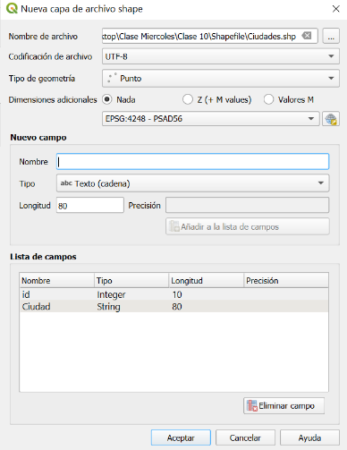{fig-align="center"}

**38.** Activa la edición y digitaliza **dos puntos**: uno sobre **Temuco** y otro sobre **Valdivia** (ambos visibles en el mapa histórico). En la ventana emergente, llena el campo `Ciudad` con el nombre correspondiente.

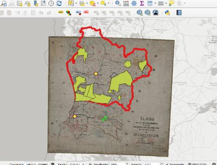{fig-align="center"}

------------------------------------------------------------------------

## Paso 16 | Crear la capa de Camino (línea)

**39.** Repite el procedimiento, pero con:

-   **Nombre de archivo:** `datos/intermedios/Camino.shp`
-   **Tipo de geometría:** **Línea**
-   **SRC:** **EPSG:4248 — PSAD56**

**40.** Activa la edición y dibuja la **vía principal** que conecta Temuco con Valdivia (visible en el mapa histórico, generalmente como una línea con pequeñas marcas perpendiculares). Aprovecha el **Snapping** para que los extremos de la línea se peguen exactamente a los puntos de las dos ciudades.

::: callout-note
**PAUSA** — al terminar este paso deberías tener tres capas digitalizadas. Apaga temporalmente la imagen del mapa histórico (desactivando la casilla de la capa `Plano_1916_georef`) para ver tus elementos sobre el mapa base OSM:

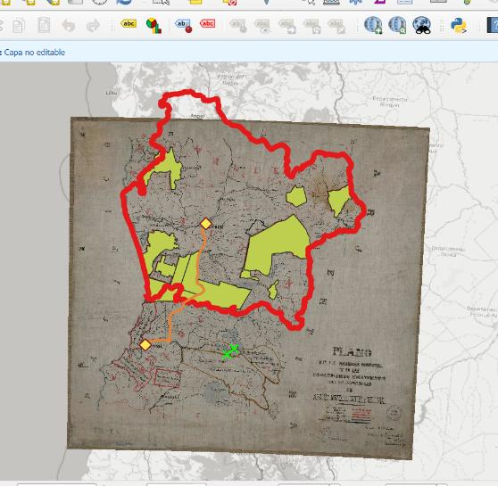{fig-align="center"}

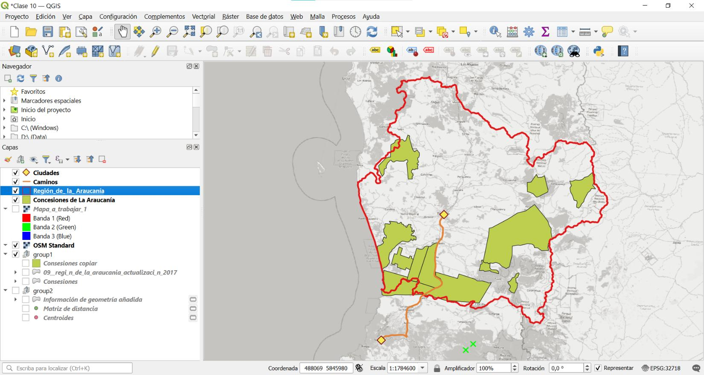{fig-align="center"}
:::

------------------------------------------------------------------------

## Paso 17 | Calcular el área elipsoidal de cada concesión

::: callout-tip
**¿Por qué área elipsoidal?** Cuando trabajamos con coordenadas geográficas (grados de latitud/longitud), las **áreas planas** salen distorsionadas: en latitudes altas un grado mide menos kilómetros que en el ecuador. El **cálculo elipsoidal** corrige esa distorsión proyectando los polígonos sobre un modelo elipsoidal de la Tierra y entrega áreas en **metros cuadrados reales**.
:::

**41.** Ve a **Vectorial → Herramientas de geometría → Agregar atributos de geometría...**

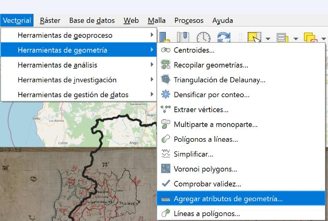{fig-align="center"}

**42.** Configura:

-   **Capa de entrada:** `Concesiones_Forestales`
-   **Calcular usando:** **Elipsoidal**

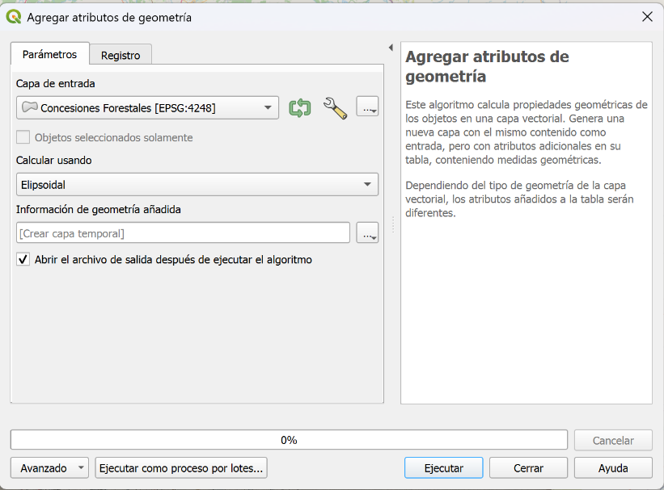{fig-align="center"}

**43.** *(Opcional pero recomendado)* En **Avanzado**, abre la caja de opciones y selecciona **"Do not filter (Better Performance)"** en *Invalid feature filtering*. Así, todos los polígonos serán evaluados aunque tengan formas irregulares.

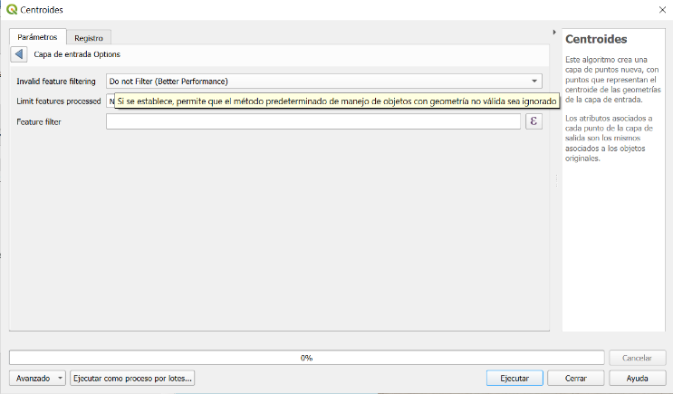{fig-align="center"}

**44.** Click en **Ejecutar**. Se generará una nueva capa temporal con los campos `area` y `perimeter`. Verifica abriendo su tabla de atributos: los **primeros 4 dígitos** del campo `area` deberían coincidir aproximadamente con las hectáreas que registraste en `Hectareas` (1 ha ≈ 10.000 m²).

{fig-align="center"}

::: callout-tip
**Diferencia esperada.** Es **normal** que el área calculada y las hectáreas declaradas no calcen exactamente. La diferencia es **atribuible a la imprecisión de las técnicas topográficas de comienzos del siglo XX** que, aunque impresionantes para su época, distan de la precisión que se puede lograr con SIG modernos. Es un buen recordatorio de que **toda cartografía está mediada por su tecnología de producción**.
:::

------------------------------------------------------------------------

## Paso 18 | Calcular los centroides de cada concesión

**45.** Con la capa de concesiones (con área elipsoidal añadida) seleccionada, ve a **Vectorial → Herramientas de geometría → Centroides...**

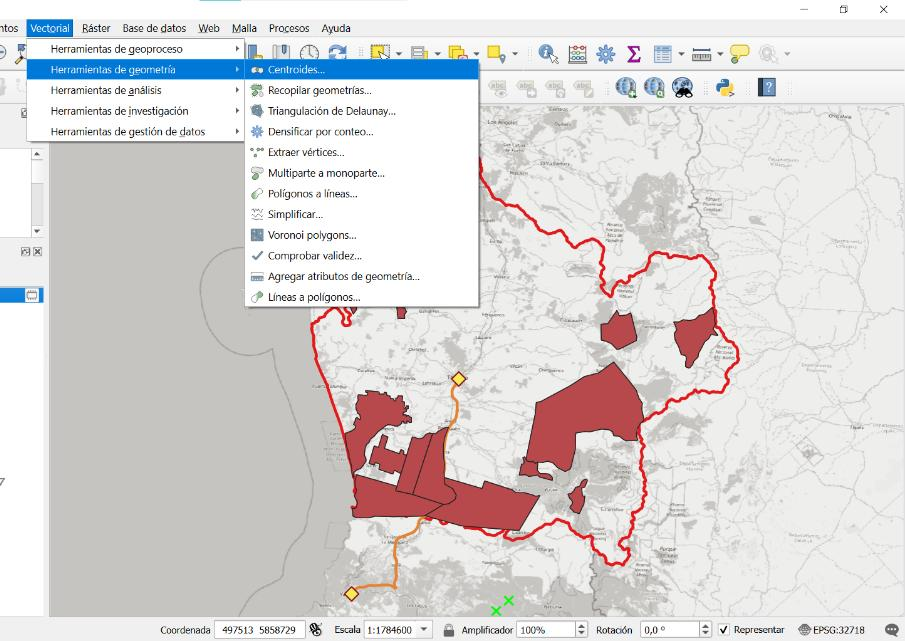{fig-align="center"}

**46.** Configura:

-   **Capa de entrada:** la capa con los atributos de geometría añadidos
-   **Crear centroide para cada parte:** desactivado

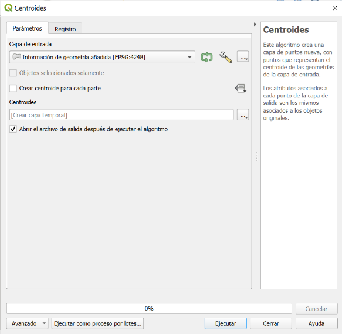{fig-align="center"}

**47.** *(Opcional)* En **Avanzado**, también selecciona **"Do not filter (Better Performance)"** para evitar problemas con polígonos irregulares.

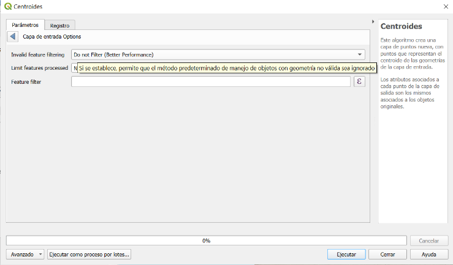{fig-align="center"}

**48.** Click en **Ejecutar**. Se creará una nueva capa de puntos llamada `Centroides`, con un punto en el centro de cada concesión. Renómbrala a `Concesiones_centroides` y guárdala en `datos/intermedios/`.

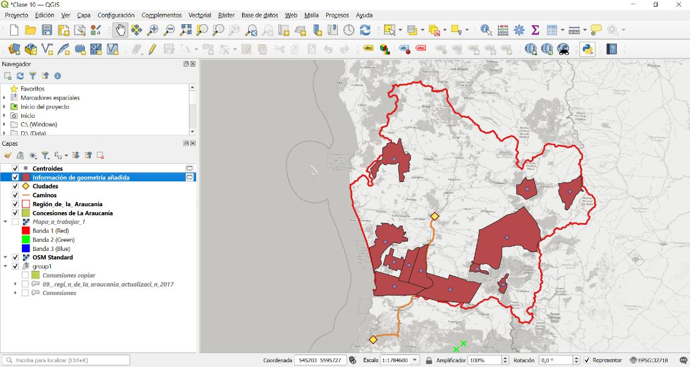{fig-align="center"}

::: callout-tip
**¿Para qué sirven los centroides?** El **centroide** representa el "centro de masa" de un polígono. En análisis espacial sirve para tareas como **calcular distancias entre objetos** (donde los polígonos son demasiado grandes para usarlos directamente), **etiquetar mapas**, o **simplificar representaciones geográficas**. En el siguiente paso lo usaremos para medir cercanía a las ciudades.
:::

------------------------------------------------------------------------

## Paso 19 | Matriz de distancia entre concesiones y ciudades

::: callout-tip
**¿Qué es una matriz de distancia?** Calcula la **distancia euclidiana** (línea recta, "vuelo de pájaro") entre cada punto de una capa y cada punto de otra. En nuestro caso: la distancia desde el centroide de cada concesión hasta cada una de las dos ciudades — útil para identificar patrones espaciales, como concesiones que se concentran cerca de centros urbanos.
:::

**49.** Ve a **Vectorial → Herramientas de análisis → Matriz de distancia...**

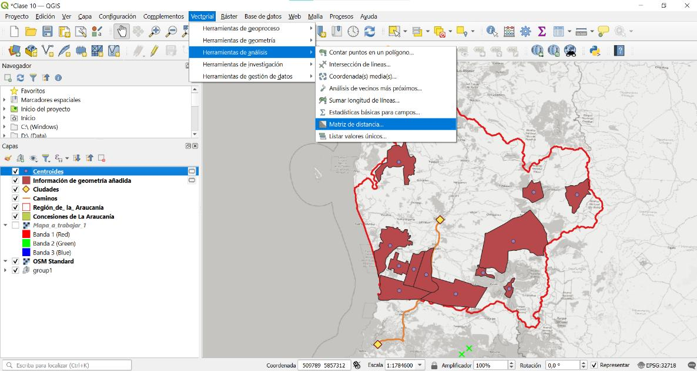{fig-align="center"}

**50.** Configura:

-   **Capa de puntos de entrada:** `Concesiones_centroides`
-   **Campo ID único de entrada:** `id`
-   **Capa de puntos objetivo:** `Ciudades`
-   **Campo ID único objetivo:** `id`
-   **Tipo de matriz de salida:** **Matriz de distancia estándar (N × T)**
-   **Usar sólo los puntos objetivo más cercanos (k):** `0` (todos)

Click en **Ejecutar**.

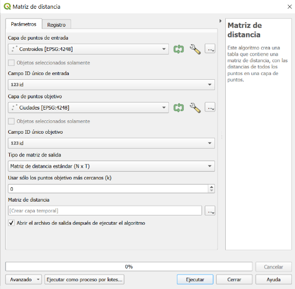{fig-align="center"}

**51.** Se generará una capa de puntos con una columna por ciudad (`Matriz de distancia_1`, `Matriz de distancia_2`), donde cada celda contiene la **distancia lineal en metros** entre el centroide y la ciudad respectiva.

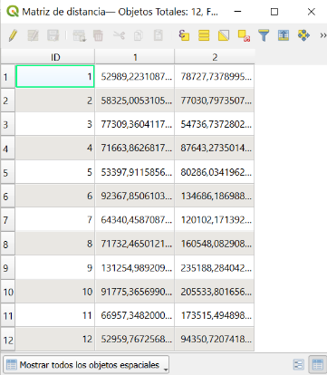{fig-align="center"}

------------------------------------------------------------------------

## Paso 20 | Unir la matriz de distancia a la capa de concesiones

::: callout-tip
**¿Por qué un join no espacial?** Necesitamos que la información de distancia (que está en la capa de centroides) **acompañe a los polígonos de concesiones** para poder simbolizarlos por distancia. Como los centroides comparten el mismo `id` que las concesiones, podemos hacer un **join por atributo** sin necesidad de operaciones espaciales.
:::

**52.** Doble click sobre la capa `Concesiones_Forestales` (la que tiene el área elipsoidal) → **Propiedades → Uniones**. Click en el ícono **"+"** y configura:

-   **Capa a unir:** `Matriz de distancia`
-   **Campo de la unión:** `id`
-   **Campo objetivo:** `id`

Click en **Aceptar** y luego **Aplicar**.

**53.** Abre la **tabla de atributos** de `Concesiones_Forestales` para verificar que ahora tiene las columnas `Matriz de distancia_1` y `Matriz de distancia_2` añadidas.

**54.** Abre la **Calculadora de Campos** y crea un campo nuevo:

-   Marca **"Crear un campo nuevo"**
-   **Nombre del campo:** `Distancia_min_ciudad`
-   **Tipo de campo:** Whole Number (integer)
-   **Expresión:**

```
Min("Matriz de distancia_1", "Matriz de distancia_2")
```

Click en **Aceptar**.

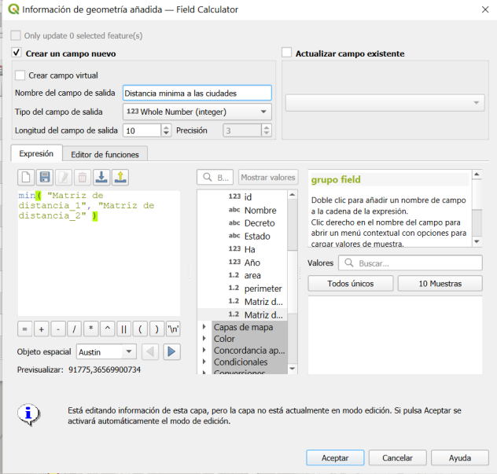{fig-align="center"}

------------------------------------------------------------------------

## Paso 21 | Mapa de cercanía a ciudades

**55.** Doble click sobre `Concesiones_Forestales` → **Simbología → Graduado**:

-   **Valor:** `Distancia_min_ciudad`
-   **Modo:** Cuantil (4 clases) o Rupturas naturales
-   **Rampa de color:** rojo (cerca) → blanco (lejos), o similar

**56.** Apaga las capas de contexto que no quieras mostrar (la imagen histórica, los centroides), y ve a **Proyecto → Nueva composición de impresión...** para confeccionar el diseño final del mapa con leyenda, escala y norte.

::: callout-note
**PAUSA** — el mapa de cercanía debería verse así:

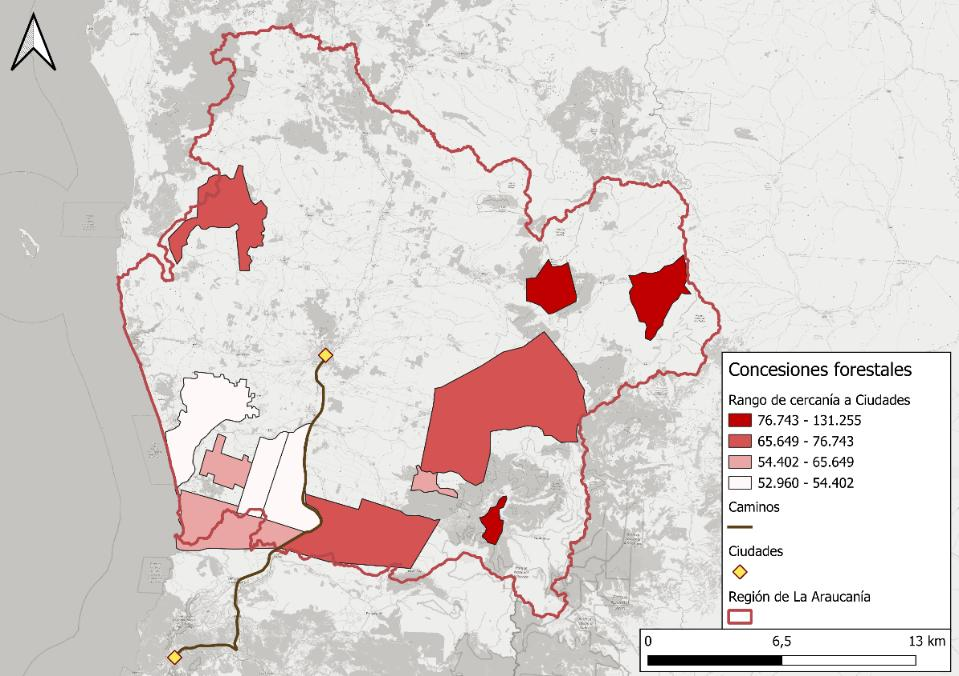{fig-align="center"}
:::

------------------------------------------------------------------------

## Paso 22 | Cargar el catastro vegetacional CONAF 2017

**57.** Ya con todos los elementos cartografiados y desarrollados, integraremos el **catastro vegetacional de la Región de La Araucanía del 2017** (CONAF). Esta capa contiene información sobre el **tipo de cobertura vegetal** actual de la región, lo que nos permitirá comparar con el mapa histórico georreferenciado de 1916.

**58.** Ve a **Capa → Añadir capa → Añadir capa vectorial...** y carga `datos/brutos/Catastro_Vegetacional_2017.gpkg`.

::: callout-tip
**¿Por qué este catastro?** El **Catastro y Evaluación de Recursos Vegetacionales Nativos** que mantiene CONAF es la base oficial del uso de suelo y la cobertura vegetal en Chile. La versión 2017 para La Araucanía usa el campo **`USO`** para clasificar cada polígono (Bosques, Terrenos Agrícolas, Áreas Urbanas e Industriales, Praderas y Matorrales, Cuerpos de Agua, etc.). Vamos a usar ese campo para construir una **simbología comparativa** con las concesiones de 1916.
:::

------------------------------------------------------------------------

## Paso 23 | Simbología basada en reglas para el catastro

**59.** Doble click sobre la capa del catastro → **Simbología**. Cambia el modo de simbología en la parte superior a **"Basado en reglas"**.

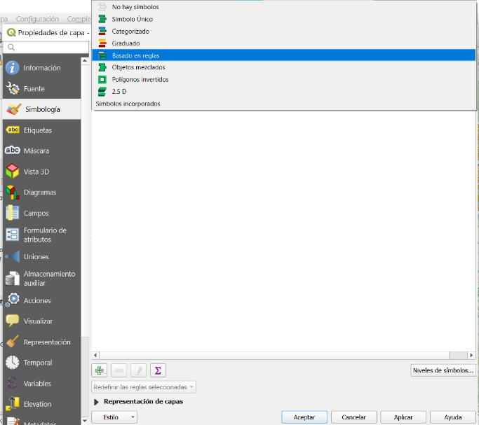{fig-align="center"}

**60.** Click en **"+"** (nueva regla) para crear la **primera regla** — los **bosques**:

-   **Etiqueta:** `Bosques`
-   Click en el ícono **`ε`** (editor de expresiones)

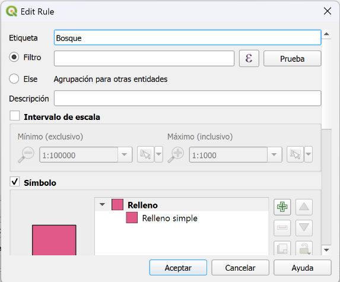{fig-align="center"}

**61.** En el Expression Builder, escribe:

```
"USO" = 'Bosques'
```

Click en **Aceptar**. Asigna un color verde a esta regla.

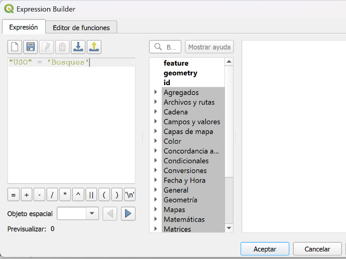{fig-align="center"}

**62.** Repite los pasos 60–61 para crear las dos reglas adicionales:

-   **`Terrenos agrícolas`** (color rojo/marrón):

    ```
    "USO" = 'Terrenos Agrícolas'
    ```

-   **`Otros elementos`** (color gris claro):

    ```
    "USO" IN ('Áreas Desprovistas de Vegetación', 'Áreas Urbanas e Industriales',
              'Praderas y Matorrales', 'Nieves Eternas y Glaciares',
              'Humedales', 'Cuerpos de Agua')
    ```

::: callout-note
**Resultado de la simbología:** la capa del catastro vegetacional debería verse así, con tres categorías:

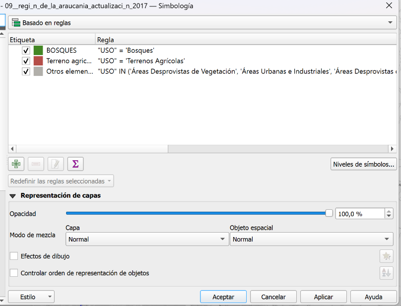{fig-align="center"}
:::

------------------------------------------------------------------------

## Paso 24 | Mapa final — huella de las concesiones de 1916 sobre el paisaje actual

**63.** Para producir el mapa comparativo final, ajusta el estilo de las capas:

-   **`Concesiones_Forestales`:** simbología **categorizada** por el campo `Estado`. **Relleno transparente** (Sin relleno) y **borde** distinto para cada categoría:
    -   `Existente` → borde grueso, color oscuro (ej. negro)
    -   `Caducada` → borde grueso, color punteado o claro (ej. blanco)
-   **`Catastro_Vegetacional_2017`:** simbología basada en reglas (paso 23). Considera bajar la opacidad ligeramente para que no quite protagonismo a los bordes de las concesiones.
-   **`Region_Araucania`:** sin relleno, borde delgado.
-   Apaga la imagen histórica y los centroides; mantén las ciudades y el camino.

**64.** Ve a **Proyecto → Nueva composición de impresión...** y arma el diseño final del mapa con título, leyenda, escala y norte.

::: callout-note
**Resultado esperado:** el mapa final debería visualizarse así, con las concesiones de 1916 (contornos según estado) sobre el catastro vegetal actual (verdes / rojos / grises):

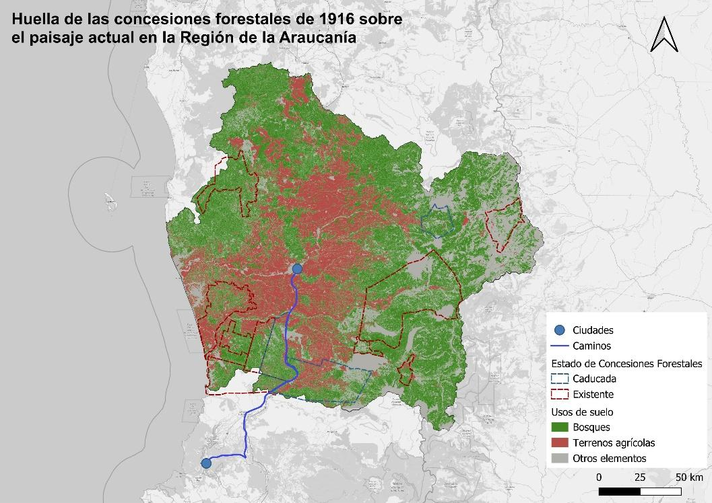{fig-align="center"}
:::

------------------------------------------------------------------------

## ¡Listo! {.unnumbered .unlisted}

Has finalizado tus mapas y ejercicios. **Recuerda completar esta actividad y guardar tu carpeta para utilizarla en tu próximo portafolio.**

::: callout-important
**Elige una o dos concesiones del mapa de 1916 para tu portafolio** y construye una breve narrativa visual a partir de los dos mapas que produjiste (cercanía a ciudades + huella sobre el paisaje 2017). Considera las siguientes preguntas guía:

1.  El cálculo elipsoidal arrojó áreas que **no coinciden exactamente** con las hectáreas declaradas en el mapa de 1916. ¿Es esa diferencia una "imprecisión" del pasado, o también podría reflejar **decisiones políticas** sobre cómo se medía y registraba la tierra entregada a las concesiones? ¿Qué implicaría una u otra interpretación?
2.  Mirando el mapa de cercanía: ¿las concesiones se distribuyen al azar, o se concentran cerca de **Temuco** y **Valdivia** y de la **vía principal** que las conecta? ¿Qué lectura económica y política haces de ese patrón?
3.  En el mapa de huella sobre el catastro 2017: algunas concesiones **siguen siendo bosque**, otras pasaron a ser **terrenos agrícolas** o **áreas urbanas**. ¿Qué factores podrían explicar esas diferencias — la calidad del suelo, la accesibilidad, la **propiedad mapuche o no-mapuche** del territorio, las políticas estatales de los siglos XX y XXI? Apóyate en lo discutido en clase para argumentar.
:::
