## Objetivo

El objetivo de esta práctica es que **explores la relación entre la vegetación y el calor** en el Gran Santiago combinando dos fuentes de teledetección distintas: **Landsat 8** (NDVI y temperatura superficial, 30 m, NASA/USGS) y el **proyecto Santiago HOT** (temperatura ambiental modelada a 10 m, derivada de ciencia ciudadana + datos satelitales). Trabajarás con **datos ráster y vectoriales** para producir mapas comparativos del Gran Santiago y de una zona específica que tú elijas, que podrás usar luego en tu **portafolio** para reflexionar sobre la distribución espacial del riesgo asociado al calor extremo.

**Herramientas por trabajar:**

-   Carga y exploración de capas ráster (`.tif`) y vectoriales (`.shp`) en QGIS
-   Lectura de la **información** de un ráster: extensión, tipo de dato, resolución, valores de cada banda
-   Aplicación de **simbología** para capas térmicas (rampa Magma) y de vegetación (rampa blanco-verde)
-   **Recorte** de un ráster usando una capa vectorial como máscara
-   Visualización de imágenes multibanda en **color real** (RGB)
-   Composición de mapas **lado a lado** en el Compositor de impresión de QGIS
-   Lectura comparada de **temperatura superficial** vs **temperatura ambiental** vs **NDVI**

::: callout-warning
**¡Importante!** Si estás trabajando en un computador de la universidad, no olvides guardar tu trabajo en **OneDrive** (u otro servicio en la nube), de lo contrario perderás tu avance. Los computadores de la sala de clases se **borran automáticamente cada semana**.
:::

------------------------------------------------------------------------

## Resumen del trabajo de esta clase

### Capas

| Capa | Descripción |
|---|---|
| **A)** `Landsat8_GS_RGB.tif` | Ráster de 3 bandas (Rojo, Verde, Azul) capturado por **Landsat 8** el 21 de enero de 2024 a las 14:33 hrs sobre el Gran Santiago. Resolución espacial: 30 m. Lo usaremos como **mapa de referencia en color real**. |
| **B)** `Landsat8_GS_ST.tif` | Ráster de **temperatura superficial** (Surface Temperature, °C), calculada a partir de la **banda termal** de la misma imagen Landsat 8. Es la temperatura de la **superficie física** que observa el satélite. |
| **C)** `Landsat8_GS_NDVI.tif` | Ráster de **NDVI** (Normalized Difference Vegetation Index), calculado a partir de las bandas roja e infrarroja de la misma imagen Landsat 8. Indicador de **salud y densidad de la vegetación**. |
| **D)** `santiago-chile_af_temp_c.tif` | Ráster de **temperatura ambiental del aire** (°C) para el Gran Santiago, registrado alrededor de las 4 PM del 20 de enero de 2024 (primer día de una de las olas de calor más severas del verano). Resolución espacial: **10 m**. Producto del proyecto **Santiago HOT** (Dra. Raquel Jiménez, UNAB / Cigiden, financiado por NIHHIS/NOAA). |
| **E)** `GS_4326.shp` | Shapefile del **Gran Santiago**, derivado del *Continuo de construcciones urbanas 2019* del Ministerio de Vivienda y Urbanismo (MINVU). Ya viene con un **buffer** que une las áreas urbanas desconectadas en una sola figura. Lo usaremos como **máscara** para acotar los rásters al área de estudio. |

### Procesos

1.  **Pasos 1–2 — Carga y exploración.** Cargar las cinco capas en QGIS y leer la **información** de cada ráster (extensión, tipo, resolución, valores) para anticipar lo que veremos.
2.  **Paso 3 — Simbología.** Aplicar simbología adecuada a cada ráster: rampa **Magma** para temperaturas y **blanco-verde** para NDVI.
3.  **Pasos 4–5 — Recorte y RGB.** Recortar la imagen RGB con el shapefile y configurar la visualización en **color real** para usarla como mapa de referencia.
4.  **Pasos 6–7 — Mapas individuales.** Generar mapas decorados de **temperatura superficial** y **NDVI**.
5.  **Paso 8 — Comparación NDVI ↔ T° superficial.** Composición lado a lado en el Compositor de impresión: ¿dónde hay menos vegetación, hay más calor?
6.  **Paso 9 — Comparación T° aire ↔ T° superficial.** Composición lado a lado: ¿qué tan distinta es la temperatura **que sentimos** (aire) de la temperatura **que ve el satélite** (superficie)?
7.  **Paso 10 — Zoom a una zona elegida.** Acercarse al Parque O'Higgins (o **a tu propia comuna o barrio**) a escala 1:20.000 y producir tres pares de mapas para el análisis territorial fino.
8.  **Preguntas guía para el portafolio.** Reflexionar sobre los patrones observados, la relación NDVI ↔ temperatura, el aporte comparado de Landsat y Santiago HOT, y la vinculación con la actividad en clase.

------------------------------------------------------------------------

## Preparación: descarga y organización del material

### Descarga desde Canvas

**1.** Descarga el archivo `.zip` de esta tarea desde la página del curso en **Canvas** (carpeta "Clase 10"). El archivo contiene los **cuatro rásters** y el **shapefile** ya organizados en la estructura de carpetas estándar.

**2.** Descomprime el archivo en una ubicación dedicada a este curso. Algunas opciones:

-   **Computador personal:** descomprime dentro de tu carpeta `SUS2211/`.
-   **Computador de la sala:** descomprime en el escritorio o en Documentos, pero **antes de terminar la sesión**, copia toda la carpeta a OneDrive, un pendrive u otro servicio en la nube.

------------------------------------------------------------------------

### Estructura de carpetas del proyecto

Al descomprimir el archivo, encontrarás la siguiente estructura. Es la misma que hemos usado en clases anteriores, **estándar para todas las tareas del curso**.

```{mermaid}
flowchart TD
    A["📁 clase10/"] --> B["📁 datos/"]
    A --> C["📁 documentos/"]
    A --> D["📁 proyectos/"]
    A --> E["📁 resultados/"]

    B --> F["📁 brutos/<br>🔒 datos originales<br>(no modificar)"]
    B --> G["📁 intermedios/<br>datos de geoprocesamiento"]
    B --> H["📁 procesados/<br>capas finales para mapeo"]

    E --> I["📁 mapas/<br>mapas exportados"]
    E --> J["📁 figuras/<br>gráficos y tablas"]

    style F fill:#fde8e8,stroke:#c0392b
    style G fill:#fef9e7,stroke:#f39c12
    style H fill:#eafaf1,stroke:#27ae60
    style D fill:#eaf4fb,stroke:#2980b9
    style C fill:#f4f6f7,stroke:#7f8c8d
```

::: {.callout-tip title="¿Para qué sirve cada carpeta?"}

**`datos/`** — Todo lo relacionado con los datos geoespaciales, organizado en tres subcarpetas:

-   **`brutos/`** 🔒 Datos originales tal como vienen del satélite o del MINVU. **Nunca se modifican ni se sobreescriben.** En esta tarea: `Landsat8_GS_RGB.tif`, `Landsat8_GS_ST.tif`, `Landsat8_GS_NDVI.tif`, `santiago-chile_af_temp_c.tif` (Santiago HOT) y los archivos del shapefile `GS_4326.*` (`.shp`, `.shx`, `.dbf`, `.prj`).
-   **`intermedios/`** Resultados de operaciones humanas o de geoprocesamiento sobre los datos brutos. En esta tarea vivirá aquí el **clip** del Landsat RGB que generarás en el paso 4 (`Landsat8_GS_RGB_clip.tif`) — pasó por una decisión humana (qué máscara usar) sobre los datos originales, por lo que no es bruto.
-   **`procesados/`** Capas finales listas para confeccionar los mapas. En esta tarea no usaremos `procesados/`, ya que los mapas se construyen directamente sobre los rásters de `brutos/` e `intermedios/`.

**`documentos/`** — Documentación de respaldo. Recomendado: una `bitacora.md` donde registres tus hallazgos y notas para el portafolio.

**`proyectos/`** — Archivos de proyecto QGIS (`.qgz`). Guarda aquí el proyecto de esta tarea, nómbralo `clase10.qgz`.

**`resultados/`** — Productos finales:

-   **`mapas/`** Los **tres mapas finales** que exportarás como PDF o imagen: (1) NDVI vs Temperatura superficial del Gran Santiago, (2) Temperatura del aire (Santiago HOT) vs Temperatura superficial (Landsat) del Gran Santiago, y (3) los tres pares de mapas de la zona elegida (Parque O'Higgins, tu comuna o tu barrio).
-   **`figuras/`** Gráficos, capturas de pantalla u otros outputs.

:::

------------------------------------------------------------------------

### Material descargado

Dentro de `datos/brutos/` encontrarás los siguientes archivos:

| Archivo | Tipo | Descripción |
|---|---|---|
| `Landsat8_GS_RGB.tif` | Ráster (3 bandas) | Imagen Landsat 8 en color real, 30 m, 21 enero 2024 |
| `Landsat8_GS_ST.tif` | Ráster (1 banda) | Temperatura superficial (°C), Landsat 8, 21 enero 2024 |
| `Landsat8_GS_NDVI.tif` | Ráster (1 banda) | NDVI (−1 a +1), Landsat 8, 21 enero 2024 |
| `santiago-chile_af_temp_c.tif` | Ráster (1 banda) | Temperatura del aire (°C), 10 m, Santiago HOT, 20 enero 2024 |
| `GS_4326` (.shp + sidecars) | Shapefile | Polígono del Gran Santiago con buffer (MINVU) |

::: callout-tip
**¿Por qué dos fuentes de temperatura?** La temperatura **superficial** es la que mide el satélite Landsat directamente desde el espacio (banda termal): es la temperatura de techos, calles y suelo. La temperatura del **aire** es la que mide un termómetro común a 2 m de altura, y es la que **siente la gente**. En la práctica son **muy distintas** — el asfalto puede estar a 60 °C de superficie mientras el aire está a 32 °C — y por eso el proyecto **Santiago HOT** (que viste en la clase) modeló específicamente la temperatura **del aire** combinando mediciones de ciencia ciudadana con datos satelitales.
:::

------------------------------------------------------------------------

## ¡Empecemos! {.unnumbered .unlisted}

## Paso 1 | Crear el proyecto y cargar las capas

**1.** Inicia QGIS y crea un proyecto nuevo. Guárdalo dentro de la carpeta `proyectos/` con el nombre `clase10.qgz` (recuerda guardarlo en **OneDrive** si trabajas desde un computador de la sala).

**2.** Carga los **cuatro rásters** en el proyecto. Ve al menú superior **Capa → Añadir capa → Añadir capa Ráster…** o arrastra los archivos `.tif` directamente desde el explorador de archivos a QGIS.

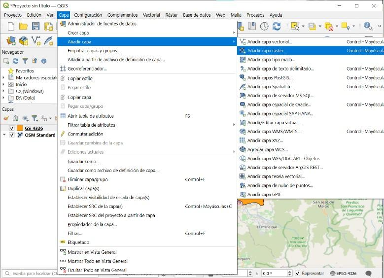{fig-align="center"}

Carga los siguientes archivos uno por uno (o todos juntos, manteniendo presionada la tecla Ctrl/Cmd al seleccionar):

-   `Landsat8_GS_RGB.tif`
-   `Landsat8_GS_ST.tif`
-   `Landsat8_GS_NDVI.tif`
-   `santiago-chile_af_temp_c.tif`

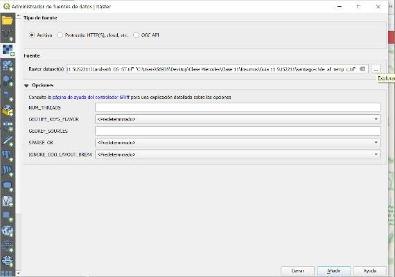{fig-align="center"}

**3.** Carga ahora el **shapefile**. Puedes arrastrar el archivo `GS_4326.shp` directamente, o usar **Capa → Añadir capa → Añadir capa vectorial…**

**4.** Activa además un **mapa base** OpenStreetMap para tener referencia visual: **Web → QuickMapServices → OSM → OSM Standard**.

Este debería ser el resultado: las cuatro capas ráster en escala de grises encima del mapa base, con el contorno del Gran Santiago superpuesto.

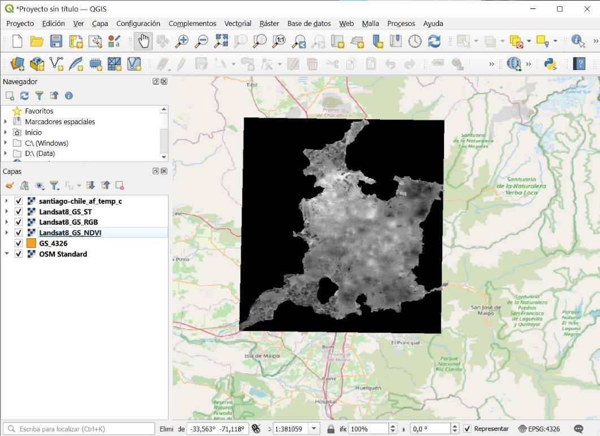{fig-align="center"}

------------------------------------------------------------------------

## Paso 2 | Explorar la información de cada ráster

Antes de aplicar simbología, conviene **mirar** lo que tenemos. Cada ráster trae metadata que debemos entender: ¿en qué SRC está? ¿cuál es su resolución? ¿qué rangos de valores tiene cada banda?

**5.** Haz **clic derecho** sobre cada capa ráster en el panel **Capas** y selecciona **Propiedades → Información**.

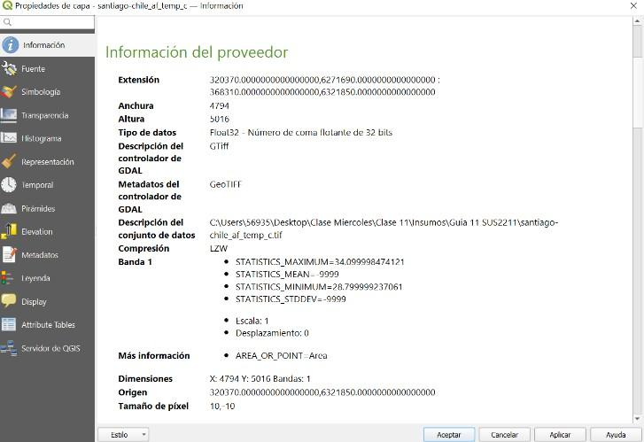{fig-align="center"}

Detente especialmente en estos campos:

-   **Extensión** — coordenadas del rectángulo que cubre el ráster (en su SRC).
-   **Anchura / Altura** — número de píxeles en cada dimensión.
-   **Tipo de datos** — si es entero o flotante (las temperaturas son flotantes; los índices también).
-   **Tamaño de píxel** — la **resolución espacial**. Anota cuánto vale para cada capa.
-   **Banda 1 → STATISTICS_MINIMUM / MAXIMUM / MEAN** — el rango de valores reales de la imagen.

::: callout-tip
**Ejercicio rápido:** ¿Qué resolución espacial tiene el ráster `santiago-chile_af_temp_c.tif` de Santiago HOT? ¿Y el `Landsat8_GS_ST.tif`? ¿Por qué crees que **Santiago HOT** pudo lograr una resolución más fina que un satélite que mira desde 700 km de altura? (Pista: revisa la lección de la clase sobre **ciencia ciudadana + ML**.)
:::

------------------------------------------------------------------------

## Paso 3 | Aplicar simbología a las capas ráster

**6.** Para visualizar correctamente cada ráster, debemos cambiar su simbología. Haz **clic derecho** sobre cada capa ráster → **Propiedades → Simbología**.

**7.** En el desplegable **Tipo de renderizador**, selecciona **Pseudocolor monobanda**, y luego escoge una **Rampa de color** apropiada según el tipo de capa:

-   **Para las capas de calor** (`Landsat8_GS_ST.tif` y `santiago-chile_af_temp_c.tif`): usa una rampa que represente intuitivamente la temperatura, como **Magma**, **Blanco-Rojo** o **Blanco-Negro-Rojo**. Estas combinaciones permiten identificar fácilmente las áreas más calientes.

-   **Para la capa de NDVI** (`Landsat8_GS_NDVI.tif`): usa una rampa de **Blanco a Verde**, que refleja intuitivamente la presencia de vegetación.

-   **Para la capa RGB** (`Landsat8_GS_RGB.tif`): no es necesario cambiar la simbología en este paso — la trabajaremos en el Paso 5.

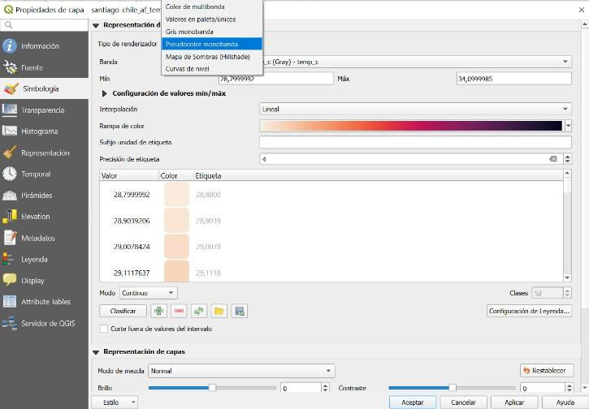{fig-align="center"}

Aplicando la rampa Magma a la capa de **temperatura del aire** (`santiago-chile_af_temp_c.tif`), deberías obtener algo como:

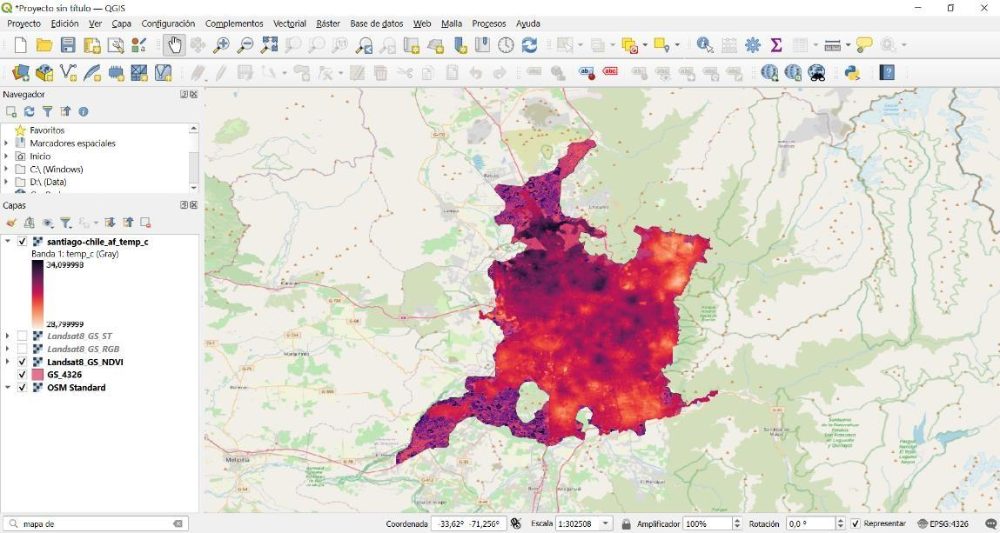{fig-align="center"}

::: callout-note
**Pausa.** Aplica simbología a **las cuatro capas** (las dos de calor con Magma o similar, NDVI con blanco-verde) antes de continuar al Paso 4.
:::

------------------------------------------------------------------------

## Paso 4 | Recortar el RGB con el shapefile (clip)

Una vez visualizadas las capas, vamos a trabajar con el **shapefile** del Gran Santiago. Es importante notar que este archivo ya viene **con un buffer** aplicado: integra todas las áreas urbanas desconectadas del MINVU en una sola figura, para que sirva de máscara unificada.

::: columns
::: {.column width="50%"}
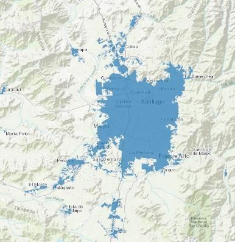{fig-align="center"}
:::

::: {.column width="50%"}
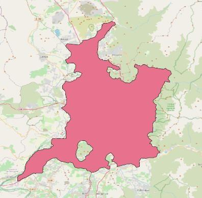{fig-align="center"}
:::
:::

::: callout-tip
**¿Por qué un buffer?** El MINVU publica las "manchas urbanas" como polígonos separados (Lo Barnechea, Maipú, Puente Alto, etc.). Para los fines de este análisis nos interesa una **única figura** que represente al Gran Santiago como sistema urbano. El buffer "expande" cada polígono hasta que se tocan, y luego se disuelven en una sola figura. Tú no tienes que hacer este paso — el archivo `GS_4326.shp` ya viene con el buffer aplicado.
:::

**8.** Para recortar el ráster RGB al área del Gran Santiago, ve a **Ráster → Extracción → Cortar ráster por capa de máscara…**

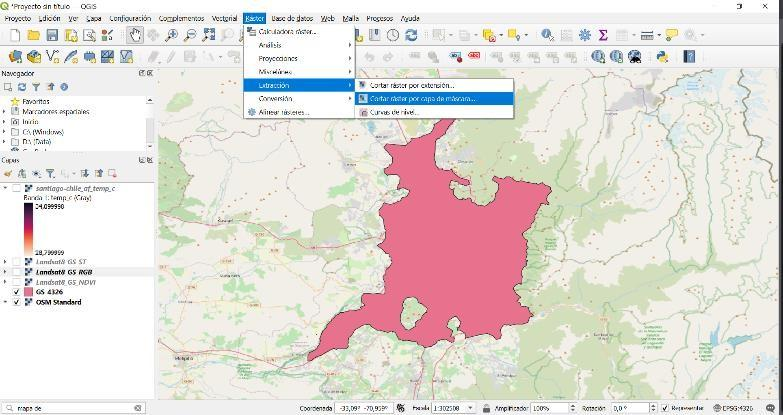{fig-align="center"}

**9.** En la ventana del algoritmo, configura:

-   **Capa de entrada:** `Landsat8_GS_RGB`
-   **Capa de máscara:** `GS_4326`
-   Mantén las casillas marcadas como vienen por defecto (en particular **"Crear una banda alfa de salida"** y **"Ajustar la extensión del ráster cortado a la extensión de la capa de máscara"**).
-   **Cortado (máscara):** guárdalo en `datos/intermedios/` con el nombre `Landsat8_GS_RGB_clip.tif`.

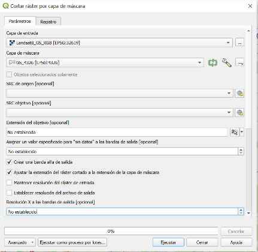{fig-align="center"}

::: callout-tip
**¿Por qué `intermedios/` y no `procesados/`?** Aunque el clip se calcula automáticamente, **tú elegiste** la máscara, los parámetros y el formato de salida. Por convención, los archivos derivados — incluso por geoprocesamiento — viven en `intermedios/`. La carpeta `procesados/` queda reservada para capas finales con campos calculados o atributos agregados.
:::

**10.** Haz click en **Ejecutar**. El resultado debería ser una imagen RGB recortada al contorno del Gran Santiago.

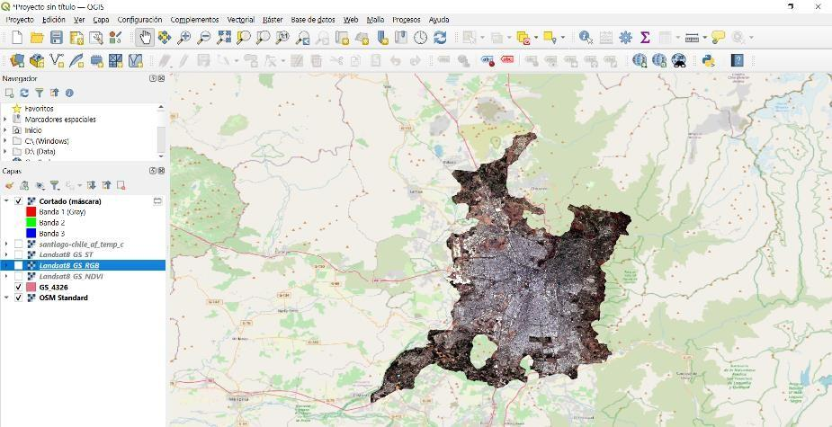{fig-align="center"}

------------------------------------------------------------------------

## Paso 5 | Visualizar las bandas RGB en color real

El ráster recortado tiene **3 bandas**. Por defecto, QGIS asigna automáticamente la primera banda al canal Rojo, la segunda al Verde y la tercera al Azul — y como las bandas del Landsat 8 que cargamos corresponden justamente a esos colores del espectro visible, la imagen ya se aprecia en **colores reales**.

**11.** Para refinar la visualización, haz **clic derecho** sobre la capa cortada → **Propiedades → Simbología**. Verifica que el **Tipo de renderizador** sea **Color de multibanda** y que las bandas estén asignadas correctamente: Banda 1 → Rojo, Banda 2 → Verde, Banda 3 → Azul.

**12.** Modifica los valores **mín/máx** de cada banda para mejorar el contraste. Si saturas los valores máximos hacia abajo (por ejemplo, dividiendo por 2 los máximos automáticos), la imagen se verá **más roja** en las zonas urbanas, lo que ayuda a identificar el contorno construido.

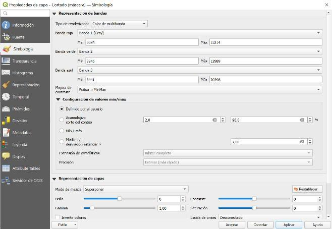{fig-align="center"}

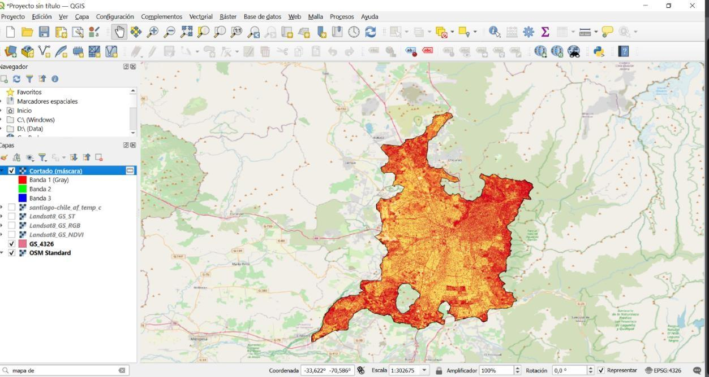{fig-align="center"}

::: callout-tip
**Funcional vs. realista.** En este paso exploramos la visualización: ajustar los valores extremos no busca "embellecer" sino **resaltar lo que queremos mostrar**. Para una imagen de referencia general, los colores reales con valores estándar son lo más apropiado. Pero para análisis específicos, a veces conviene **saturar bandas, invertir el orden o usar combinaciones distintas** (e.g., banda infrarroja en lugar de roja para resaltar vegetación). Lo importante es que la visualización sea **funcional al mensaje** del mapa.
:::

------------------------------------------------------------------------

## Paso 6 | Construir un mapa de temperatura superficial

**13.** Trabaja ahora con el archivo **C** (`Landsat8_GS_ST.tif`). Si aún no le aplicaste simbología, haz **clic derecho → Propiedades → Simbología**, y configura:

-   **Tipo de renderizador:** Pseudocolor monobanda
-   **Rampa de color:** Magma

**14.** Haz click en **Aplicar** y luego en **Aceptar**. Esta es la imagen que deberías obtener:

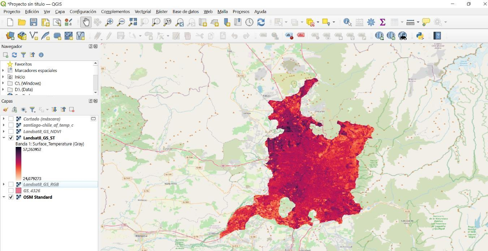{fig-align="center"}

::: callout-note
**Pausa para observar.** Antes de seguir, mira el mapa con detención. ¿Qué comunas se ven más rojas? ¿Cuáles más oscuras? ¿Hay alguna relación con lo que conoces de la geografía de Santiago (cordillera, valle, sur, norte, oriente, poniente)?
:::

------------------------------------------------------------------------

## Paso 7 | Construir un mapa de NDVI

**15.** Trabaja ahora con el archivo **B** (`Landsat8_GS_NDVI.tif`). Aplica:

-   **Tipo de renderizador:** Pseudocolor monobanda
-   **Rampa de color:** Blanco-Verde

**16.** Para que las áreas urbanas con menor vegetación se distingan mejor, recomendamos en **Configuración de valores min/máx** seleccionar **Acumulativo corte del conteo 2 % – 98 %** (en lugar del rango completo). Esto reescala la rampa a los valores típicos sin que un valor extremo "aplane" toda la imagen.

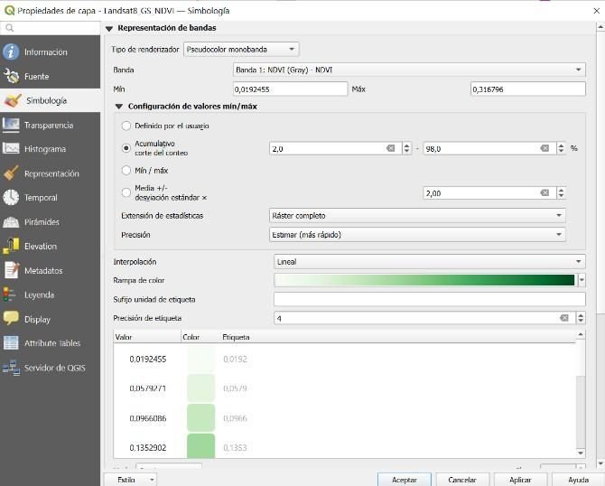{fig-align="center"}

**17.** Haz click en **Aplicar**. Esta es la imagen que deberías obtener:

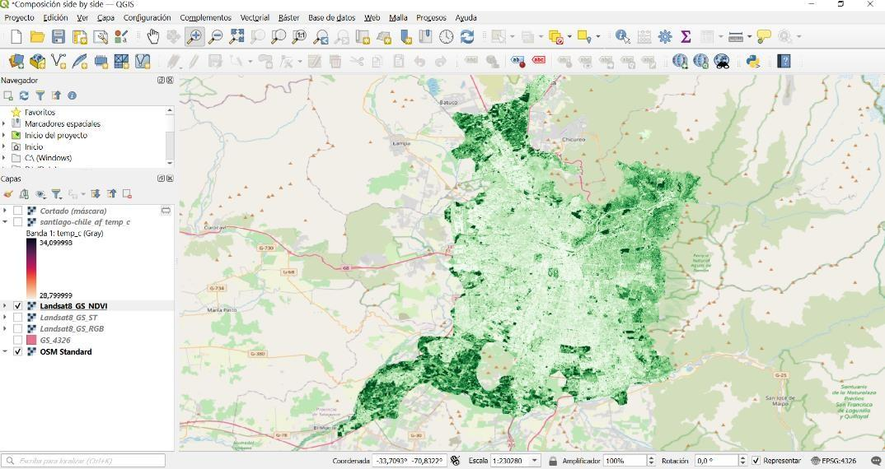{fig-align="center"}

::: callout-tip
**Comparación mental.** ¿Las áreas más verdes en el mapa de NDVI coinciden con las áreas más oscuras (frescas) del mapa de temperatura superficial? Anota tu primera impresión — la verificaremos formalmente en el siguiente paso.
:::

------------------------------------------------------------------------

## Paso 8 | Composición lado a lado: NDVI ↔ Temperatura superficial

Para comparar formalmente ambos mapas, vamos a crear una **composición lado a lado** (side-by-side) en el **Compositor de impresión** de QGIS.

**18.** En la ventana principal de QGIS, ve a **Proyecto → Nueva composición de impresión…** Asígnale un título descriptivo, por ejemplo `NDVI_vs_T_superficial`.

**19.** Se abrirá una nueva ventana — el Compositor de impresión. Es una hoja en blanco donde armaremos el mapa.

**20.** En el panel izquierdo del Compositor, haz click en **Añadir mapa** y dibuja un rectángulo que **cubra la mitad izquierda de la página**. Luego repite para la **mitad derecha**. Tendrás dos mapas idénticos, uno al lado del otro.

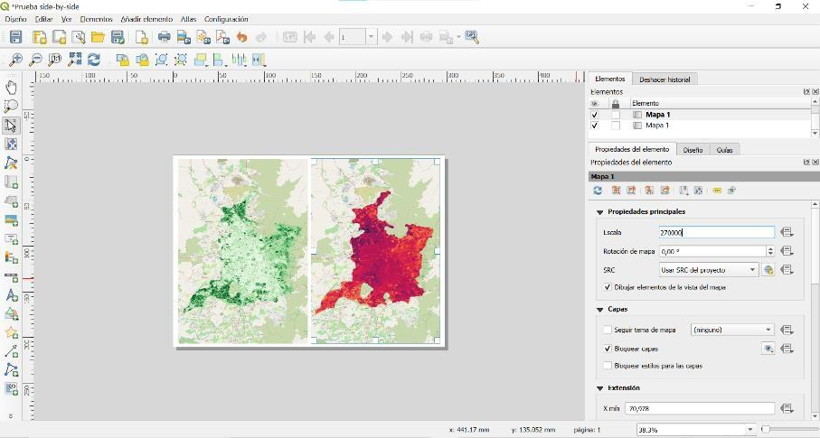{fig-align="center"}

**21.** Ahora vamos a hacer que cada mapa muestre una capa distinta. Para esto, **hacemos clic derecho sobre el mapa de la izquierda → Propiedades del elemento → Bloquear capas** (también disponible en el panel derecho del Compositor):

-   En **Capas**, marca la opción **Bloquear las capas para este mapa**. Esto "congela" la composición de capas que está activa en ese momento.
-   Asegúrate de que en el proyecto principal las únicas capas activas sean **NDVI + el mapa base**. El Compositor recordará ese estado.

**22.** Vuelve a la ventana principal de QGIS y **cambia las capas activas**: ahora deja visibles solo **Temperatura superficial + el mapa base**. Vuelve al Compositor y haz click en **Actualizar la vista** del mapa **derecho** (sin bloquearlo). Verás que ese mapa cambia a temperatura superficial, mientras el izquierdo se mantiene con NDVI.

**23.** Termina de componer el mapa con los elementos cartográficos estándar:

-   **Título** ("Estado vegetacional del área urbana del Gran Santiago" / "Temperatura térmica de la superficie del Gran Santiago")
-   **Leyenda** (separada para cada mapa, con los rangos de NDVI y T° superficial)
-   **Escala**
-   **Flecha del Norte**

**24.** Exporta el mapa final como **PDF** o **PNG** a `resultados/mapas/` con el nombre `mapa_NDVI_vs_T_superficial.pdf`.

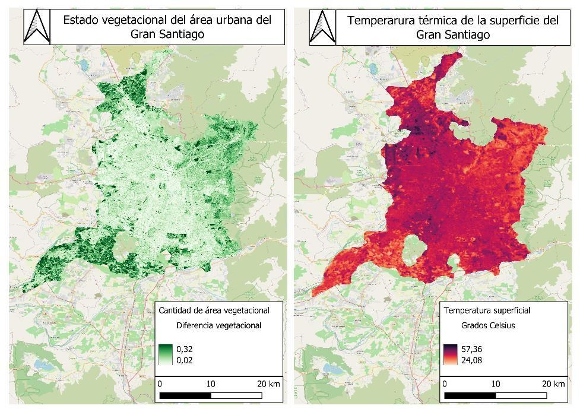{fig-align="center"}

::: callout-tip
**Lo que estás viendo.** Las zonas con menos vegetación (NDVI bajo, blanco) tienden a coincidir con las zonas más calientes (rojo intenso): el centro, parte del poniente, y los sectores con alta proporción de techos y pavimento. Las zonas más verdes — el oriente alto, los pies de cordillera, parques grandes — son también las más frescas. Esa **correspondencia espacial** es la base científica de las políticas de **arbolado urbano** que vimos en clase.
:::

------------------------------------------------------------------------

## Paso 9 | Composición lado a lado: T° aire (Santiago HOT) ↔ T° superficial (Landsat)

Repetimos el procedimiento del Paso 8, pero ahora para comparar las **dos fuentes de temperatura**: la del **aire** (Santiago HOT, 10 m) y la **superficial** (Landsat 8, 30 m).

**25.** Repite los pasos 18–24, pero esta vez deja visible:

-   **Mapa izquierdo:** `santiago-chile_af_temp_c` (temperatura del **aire**, Santiago HOT) + mapa base
-   **Mapa derecho:** `Landsat8_GS_ST` (temperatura **superficial**, Landsat 8) + mapa base

**26.** Asegúrate de que ambos usen una rampa de color compatible (Magma para los dos), y exporta como `mapa_T_aire_vs_T_superficial.pdf` en `resultados/mapas/`.

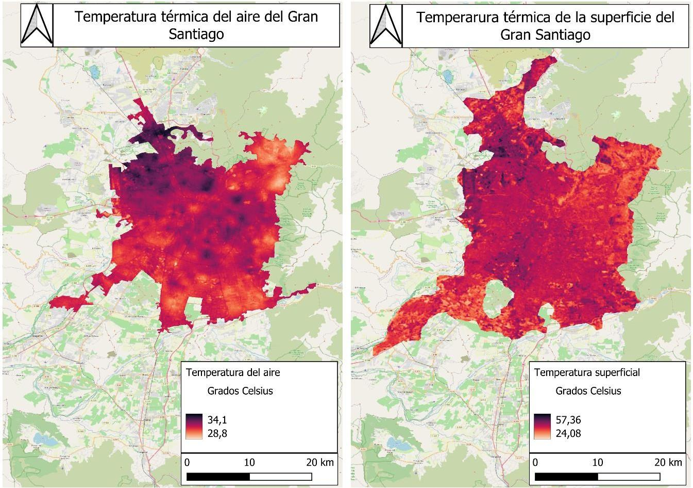{fig-align="center"}

::: callout-tip
**El insight central de esta tarea.** La leyenda de cada mapa te muestra el rango: la **temperatura del aire** va de aproximadamente **28–34 °C**; la **temperatura superficial** va de aproximadamente **24–57 °C**. Es la misma ciudad, el mismo verano, pero los **valores absolutos son completamente distintos**. La superficie alcanza **57 °C**, pero el aire que respira la gente está a **34 °C**. La salud humana responde a la del aire — ese es exactamente el problema que motivó al proyecto **Santiago HOT** a producir un raster del aire, en vez de quedarse con el satélite. Reflexiona: ¿se encuentra **muy afectada tu comuna** según ambos mapas?
:::

------------------------------------------------------------------------

## Paso 10 | Análisis detallado de una zona elegida

Ahora vamos a profundizar en un área específica para ver con detalle cómo la vegetación, la superficie y el aire se relacionan a **escala fina**.

::: callout-tip
**Tu zona, tu elección.** Por defecto, esta guía usa el **Parque O'Higgins** (comuna de Santiago) como ejemplo, porque es un área verde grande rodeada de zonas densamente construidas — un caso clásico para ver el efecto del arbolado. Pero **tú puedes elegir otra zona** que te interese más: tu comuna, tu barrio, un parque cerca de tu casa, o una de las cuatro comunas que trabajamos en la actividad de la clase (Vitacura, Cerro Navia, Santiago Centro, La Pintana). La consigna es la misma: **acércate a escala 1:20.000** y produce los tres pares de mapas siguientes.
:::

**27.** En la ventana principal de QGIS, **acércate a la zona elegida** usando la herramienta **Zoom** o escribiendo la escala manualmente en la barra inferior: **1:20.000**.

**28.** Crea **tres nuevas composiciones** (una por par), siguiendo el procedimiento del Paso 8, pero limitando la vista al área de zoom:

### Mapa 1: NDVI ↔ Temperatura superficial

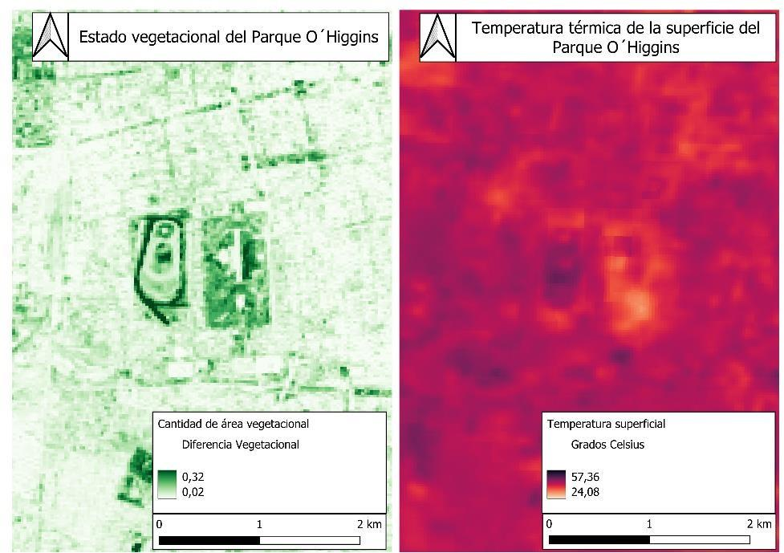{fig-align="center"}

### Mapa 2: NDVI ↔ Temperatura del aire

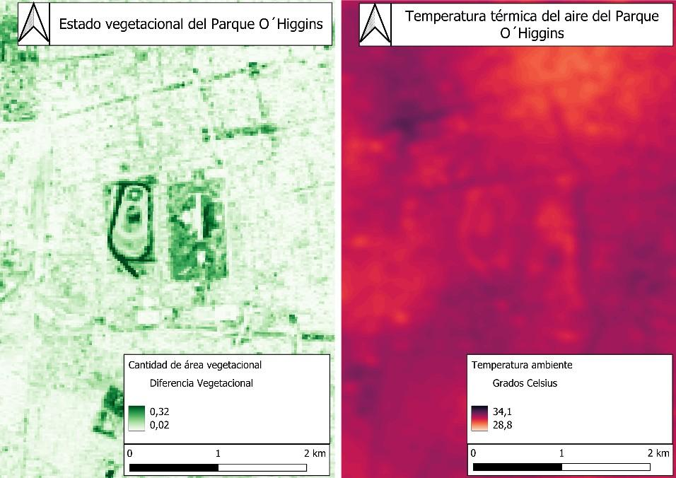{fig-align="center"}

### Mapa 3: Temperatura superficial ↔ Temperatura del aire

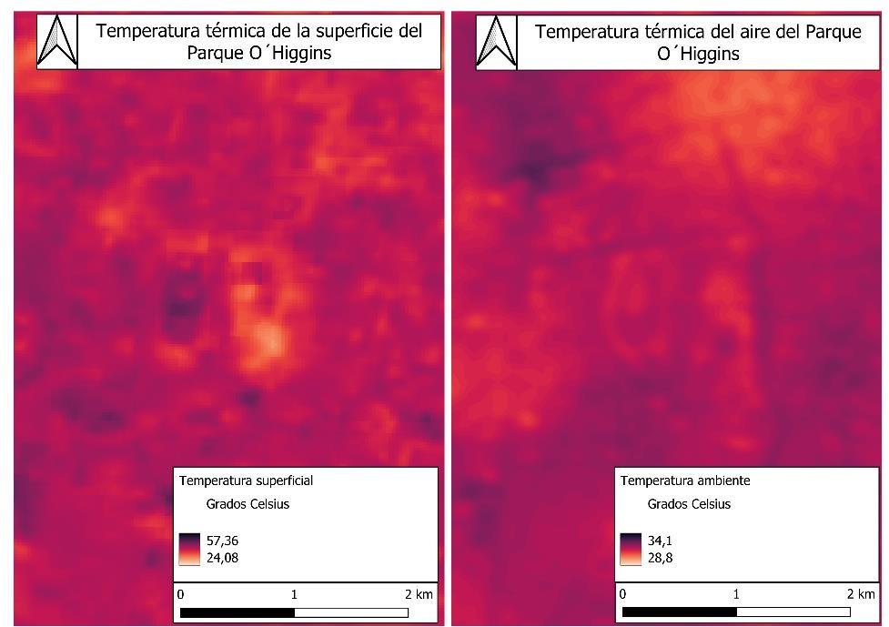{fig-align="center"}

**29.** Exporta los tres mapas como PDF o PNG a `resultados/mapas/` con nombres descriptivos:

-   `zoom_NDVI_vs_T_superficial.pdf`
-   `zoom_NDVI_vs_T_aire.pdf`
-   `zoom_T_superficial_vs_T_aire.pdf`

::: callout-tip
**Lo que se ve a esta escala.** En el caso del Parque O'Higgins, las áreas con mayor cobertura vegetal (arbolado, pasto regado) muestran una clara disminución en la temperatura — superficial **y** del aire. Lo opuesto ocurre en la **carretera adyacente al parque** (Autopista Central), donde la temperatura aumenta considerablemente por la falta de vegetación y la superficie pavimentada. Si elegiste otra zona, busca patrones similares: ¿hay un parque que enfríe? ¿hay una avenida o un techo industrial que aumente la temperatura?
:::

------------------------------------------------------------------------

## ¡Listo! {.unnumbered .unlisted}

Has finalizado tus mapas y ejercicios. **Recuerda completar esta actividad y guardar tu carpeta para utilizarla en tu próximo portafolio.**

::: callout-important
**Elige una zona del Gran Santiago para tu portafolio** (tu comuna, tu barrio, el Parque O'Higgins o una de las comunas del taller) y construye una breve narrativa a partir de los mapas que produjiste — la comparación a escala del Gran Santiago y los tres pares del zoom a 1:20.000. Considera las siguientes preguntas guía:

1.  ¿Qué patrones espaciales de temperatura observaste en el Gran Santiago y en tu zona elegida? ¿Qué factores urbanos (arbolado, densidad construida, pavimento, distancia a la cordillera, etc.) crees que influyen en estas diferencias?
2.  ¿Cómo se relaciona la distribución de áreas verdes (NDVI) con la temperatura superficial y con la temperatura del aire? ¿Qué zonas se benefician más de la vegetación y cuáles se ven más afectadas por su ausencia?
3.  ¿Qué ventajas y limitaciones tiene el uso de imágenes satelitales como **Landsat 8** para este tipo de análisis urbano? Comparativamente, ¿qué aporta un producto como **Santiago HOT** (ciencia ciudadana + satélites) frente a usar sólo datos satelitales?
4.  **Vinculación con la clase.** En la actividad **A+R "Plan Calor para tu comuna"** discutimos cuatro comunas con perfiles muy distintos — **Vitacura, Cerro Navia, Santiago Centro y La Pintana**. Si tu grupo trabajó una de ellas (o si tu zona elegida corresponde a alguna), ¿cómo se ve esa comuna en los mapas que construiste? ¿Las **tres medidas** que tu grupo eligió tienen sentido a la luz de los datos territoriales que ahora ves?
:::

::: callout-tip
**Sugerencia de extensión (opcional).** Si te interesa profundizar, puedes:

-   Calcular la **diferencia** entre temperatura superficial y temperatura del aire (`Ráster → Calculadora ráster…`) — el resultado es un mapa de **"calor escondido"** en la superficie.
-   Cruzar tu zona elegida con la capa de Servicios de Salud (Norte / Occidente / Sur) o el Censo 2017 (% adultos mayores) para discutir **vulnerabilidad** territorial.
-   Visitar el visor de Santiago HOT en [`sites.google.com/view/santiagohot`](https://sites.google.com/view/santiagohot) para ver los mapas a las tres horas del día (mañana / tarde / atardecer).
:::
