## Objetivo

El objetivo de esta práctica es que adquieras las habilidades de manejo de herramientas ráster en QGIS para visualizar y analizar el impacto del incendio de **Santa Olga** (Constitución, Región del Maule, enero de 2017). Trabajarás con imágenes **Sentinel-2** capturadas en cuatro fechas y aprenderás a **combinar bandas**, calcular **NDVI** (Normalized Difference Vegetation Index) y **dNBR** (delta del Normalized Burn Ratio), y a comunicar la evolución temporal de la cicatriz del incendio mediante mapas comparados.

Temáticas por trabajar:

-   **Grupos de capas** en el panel de Capas — organizar archivos por fecha
-   **Combinar bandas** ráster (`Ráster → Miscelánea → Combinar…`) para crear un archivo multibanda
-   **Calculadora ráster** — calcular NDVI, NBR y dNBR a partir de operaciones entre bandas
-   **Simbología ráster** — color verdadero (multibanda) y pseudocolor monobanda (con escalas comparables entre fechas)
-   **Compositor de impresión** — mapas en layout temporal con etiquetas y leyenda

::: callout-warning
**¡Importante!** Si estás trabajando en un computador de la universidad, guarda tu trabajo en **OneDrive** (u otro servicio en la nube), de lo contrario perderás tu avance. Los computadores de sala se borran automáticamente cada semana.
:::

------------------------------------------------------------------------

## Resumen del trabajo de esta clase

### Capas

Trabajaremos con **cuatro carpetas** de imágenes Sentinel-2 — una por cada fecha — que evidencian cómo cambió la localidad de Santa Olga a raíz del incendio de enero de 2017:

| Carpeta | Fecha | Momento respecto al incendio |
|---|---|---|
| `SantaOlga_20170119` | 19-ene-2017 | Justo **antes** del incendio (línea base) |
| `SantaOlga_20170320` | 20-mar-2017 | Casi dos meses después del incendio |
| `SantaOlga_20180320` | 20-mar-2018 | Un poco más de un año después del incendio |
| `SantaOlga_20240328` | 28-mar-2024 | Un poco más de siete años después del incendio |

Cada carpeta contiene **cinco bandas** del satélite Sentinel-2 (Nivel L1C, *Raw*) que necesitaremos a lo largo de la tarea:

| Archivo | Banda | Uso en esta tarea |
|---|---|---|
| `B02.tiff` | Azul (B2) | Canal **Azul** del color verdadero |
| `B03.tiff` | Verde (B3) | Canal **Verde** del color verdadero |
| `B04.tiff` | Rojo (B4) | Canal **Rojo** del color verdadero + denominador del NDVI |
| `B08.tiff` | Infrarrojo cercano — NIR (B8) | NIR para NDVI y NBR |
| `B12.tiff` | Infrarrojo de onda corta — SWIR (B12) | SWIR para NBR |

::: callout-tip
**¿Por qué estas cinco bandas?** Para hacer una imagen en **color verdadero** necesitamos las bandas roja, verde y azul (B4, B3, B2). El **NDVI** mide la salud de la vegetación a partir del contraste entre la banda roja (que la vegetación sana absorbe) y el NIR (que refleja fuertemente). El **NBR** detecta áreas quemadas a partir del contraste entre el NIR (vegetación) y el SWIR (suelo desnudo o quemado). Con cinco bandas elegidas podemos construir los tres tipos de mapa.
:::

### Procesos

1.  **Pasos 1–2 — Organización y composición multibanda.** Crear el proyecto, organizar las capas por fecha en grupos y combinar las cinco bandas de cada fecha en un único archivo multibanda.
2.  **Paso 3 — Identificar las bandas.** Leer las propiedades del archivo multibanda para saber qué número de banda corresponde a B2, B3, B4, B8 y B12.
3.  **Pasos 4–6 — Índices con la Calculadora ráster.** Calcular el **NDVI** y el **NBR** para cada fecha, y luego el **dNBR** (diferencia entre el NBR de la línea base y el NBR de cada fecha posterior al incendio).
4.  **Paso 7 — Mapa True Color.** Composición temporal de cuatro mapas en color verdadero.
5.  **Paso 8 — Mapa NDVI.** Composición temporal de cuatro mapas de NDVI con la misma escala (-0,35 a 0,85) y rampa verde-rojo.
6.  **Paso 9 — Mapa dNBR.** Composición temporal de tres mapas de dNBR con la misma escala (-1,8 a 1,25) y una rampa de severidad. El primer cuadrante del layout muestra el True Color a casi dos meses del incendio, como referencia visual.
7.  **Preguntas guía para el Mapa-Memo.** Reflexionar sobre la severidad del incendio, la recuperación a lo largo del tiempo y las ventajas/limitaciones de la teledetección satelital.

------------------------------------------------------------------------

## Preparación: descarga y organización del material

### Descarga desde Canvas

**1.** Descarga el archivo `.zip` de esta tarea desde la página del curso en **Canvas** (carpeta "Clase 11"). El archivo contiene las **cuatro carpetas** de imágenes Sentinel-2 ya organizadas en la estructura estándar.

**2.** Descomprime el archivo en una ubicación dedicada a este curso. Algunas opciones:

-   **Computador personal:** descomprime dentro de tu carpeta `SUS2211/`.
-   **Computador de la sala:** descomprime en el escritorio o en Documentos, pero **antes de terminar la sesión**, copia toda la carpeta a OneDrive, un pendrive u otro servicio en la nube.

------------------------------------------------------------------------

### Estructura de carpetas del proyecto

Al descomprimir el archivo, encontrarás la siguiente estructura. Es la misma que hemos usado en clases anteriores, **estándar para todas las tareas del curso**.

```{mermaid}
flowchart TD
    A["📁 tarea11/"] --> B["📁 datos/"]
    A --> C["📁 documentos/"]
    A --> D["📁 proyectos/"]
    A --> E["📁 resultados/"]

    B --> F["📁 brutos/<br>🔒 4 carpetas SantaOlga_YYYYMMDD<br>con bandas B02–B12<br>(no modificar)"]
    B --> G["📁 intermedios/<br>NBR por fecha<br>(insumo del dNBR)"]
    B --> H["📁 procesados/<br>Multibanda, NDVI y dNBR<br>(capas para los mapas)"]

    E --> I["📁 mapas/<br>3 layouts exportados"]
    E --> J["📁 figuras/<br>gráficos y capturas"]

    style F fill:#fde8e8,stroke:#c0392b
    style G fill:#fef9e7,stroke:#f39c12
    style H fill:#eafaf1,stroke:#27ae60
    style D fill:#eaf4fb,stroke:#2980b9
    style C fill:#f4f6f7,stroke:#7f8c8d
```

::: {.callout-tip title="¿Para qué sirve cada carpeta?"}

**`datos/`** — Todo lo geoespacial, organizado en tres subcarpetas:

-   **`brutos/`** 🔒 Cuatro carpetas `SantaOlga_YYYYMMDD/`, cada una con las bandas `B02.tiff`, `B03.tiff`, `B04.tiff`, `B08.tiff` y `B12.tiff` tal como vienen del satélite. **Nunca se modifican ni se sobreescriben.**
-   **`intermedios/`** Archivos que existen *sólo* como paso hacia otro derivado. Aquí guardarás los **NBR por fecha** (`NBR_SantaOlga_YYYYMMDD.tif`): no aparecen en ningún mapa final, pero son indispensables para calcular el dNBR.
-   **`procesados/`** La última versión de cada capa en su cadena de procesamiento — la que efectivamente cargas en los mapas. Aquí vivirán:
    -   `Multibanda_SantaOlga_YYYYMMDD.tif` (4 archivos) — usados en los mapas True Color
    -   `NDVI_SantaOlga_YYYYMMDD.tif` (4 archivos) — usados en los mapas NDVI
    -   `dNBR_SantaOlga_2meses.tif`, `dNBR_SantaOlga_1ano.tif`, `dNBR_SantaOlga_7anos.tif` — usados en el mapa dNBR

**`documentos/`** — Documentación de respaldo. Recomendado: una `bitacora.md` donde registres tus observaciones para el Mapa-Memo.

**`proyectos/`** — Archivos de proyecto QGIS (`.qgz`). Guarda aquí el proyecto de esta tarea como `clase11.qgz`.

**`resultados/`** — Productos finales:

-   **`mapas/`** Los **tres layouts** que exportarás como PDF o PNG: (1) **True Color** en orden temporal, (2) **NDVI** en orden temporal, (3) **dNBR** en orden temporal con el True Color de 2017-03-20 en el primer cuadrante como referencia.
-   **`figuras/`** Capturas, gráficos u otros outputs.

:::

------------------------------------------------------------------------

## ¡Empecemos! {.unnumbered .unlisted}

## Paso 1 | Crear el proyecto y los grupos de capas

**1.** Inicia **QGIS** y crea un proyecto nuevo. Guárdalo dentro de la carpeta `proyectos/` con el nombre `clase11.qgz` (recuerda guardarlo en **OneDrive** si trabajas desde un computador de la sala).

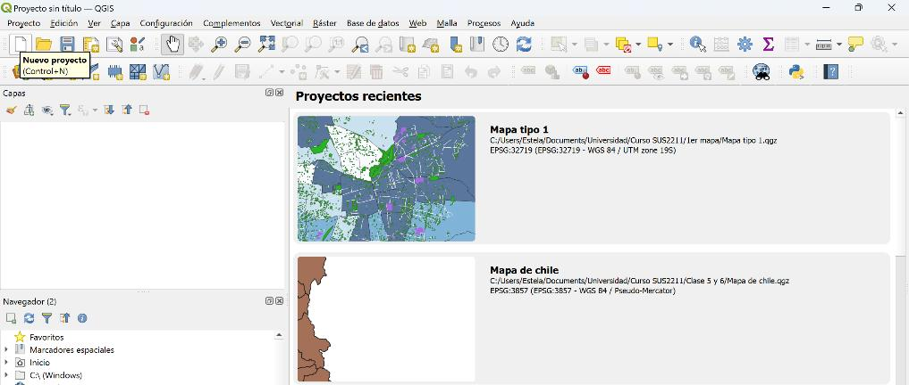{fig-align="center"}

**2.** Activa además un **mapa base** OpenStreetMap como referencia: `Web → QuickMapServices → OSM → OSM Standard`.

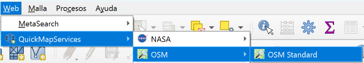{fig-align="center"}

**3.** En el panel **Capas** vamos a crear cuatro **grupos** — uno por fecha — para mantener ordenadas las cinco bandas de cada imagen. Haz clic derecho en el panel **Capas** y selecciona **Nuevo grupo**. Crea un grupo por cada carpeta, con el mismo nombre que la carpeta:

-   `SantaOlga_20170119`
-   `SantaOlga_20170320`
-   `SantaOlga_20180320`
-   `SantaOlga_20240328`

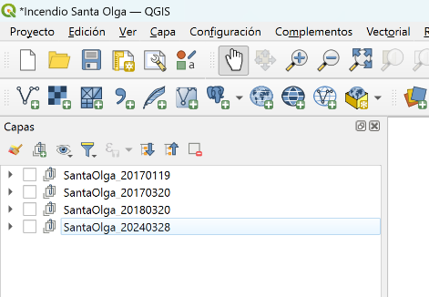{fig-align="center"}

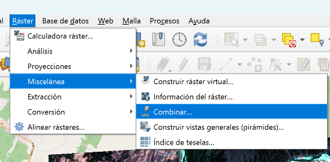{fig-align="center"}

**4.** Ahora carga las cinco bandas de cada fecha en su grupo correspondiente. Puedes arrastrar las cinco bandas de la carpeta `SantaOlga_20170119/` sobre el grupo `SantaOlga_20170119` en el panel Capas. Repite para las otras tres fechas.

::: callout-tip
**Ordena las bandas dentro de cada grupo.** Para los pasos siguientes nos conviene que dentro de cada grupo las bandas estén en orden: `B02`, `B03`, `B04`, `B08`, `B12`. Arrastra las capas dentro del grupo si vienen en otro orden.
:::

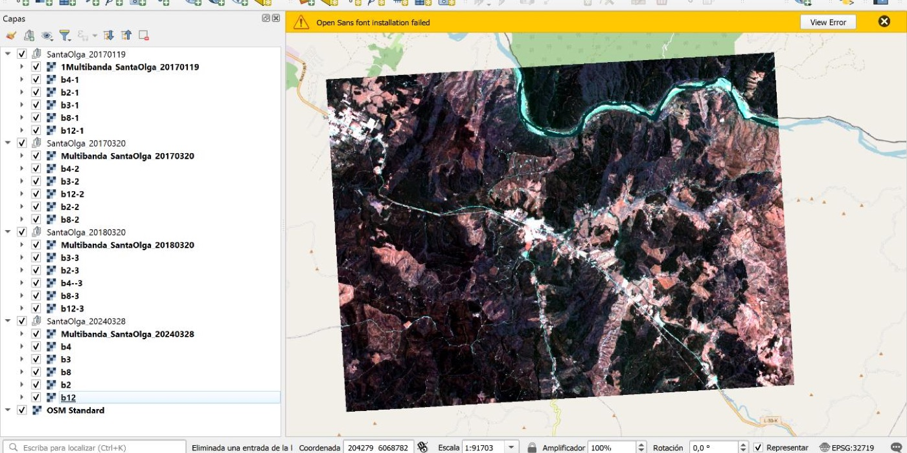{fig-align="center"}

------------------------------------------------------------------------

## Paso 2 | Combinar las bandas en un archivo multibanda

Las cinco bandas Sentinel-2 vienen como **archivos separados** — cada una es un ráster de una sola banda. Para trabajar con ellas como una sola imagen (igual que el archivo Landsat de la clase pasada, que tenía 3 bandas RGB en un solo `.tif`), las vamos a **apilar** en un archivo multibanda con `Ráster → Miscelánea → Combinar…`.

**5.** Ve al menú `Ráster → Miscelánea → Combinar…`.

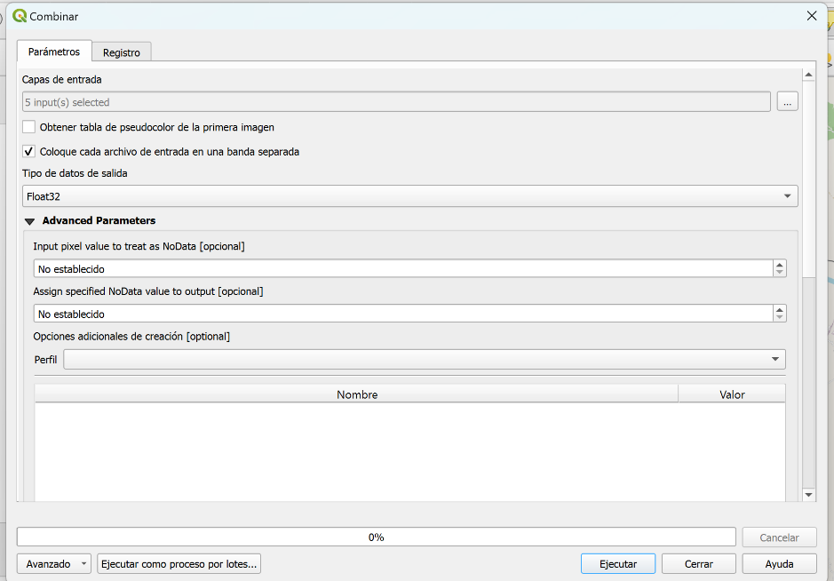{fig-align="center"}

**6.** En la ventana del algoritmo, configura:

-   **Capas de entrada:** abre el selector y marca las **cinco bandas** de una misma fecha — por ejemplo `B02`, `B03`, `B04`, `B08` y `B12` del grupo `SantaOlga_20170320`. Mantenlas en ese orden.
-   **Coloca cada archivo de entrada en una banda separada:** ✅ **activa esta casilla** (es la clave del proceso — sin ella, las bandas se mezclan en una sola).
-   **Tipo de datos de salida:** `Float32` (opcional pero recomendado — asegura precisión en los cálculos posteriores de NDVI/NBR).

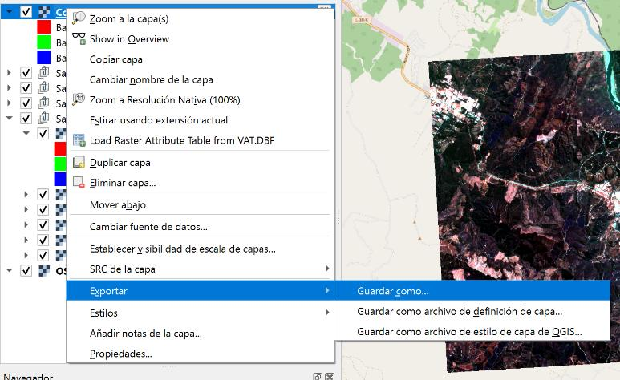{fig-align="center"}

**7.** Haz click en **Ejecutar**. QGIS generará una capa temporal con las 5 bandas apiladas (verás algo como "Combinada" en el panel Capas).

**8.** Convierte esa capa temporal en un archivo permanente. Haz **clic derecho** sobre la capa Combinada → `Exportar → Guardar como…`

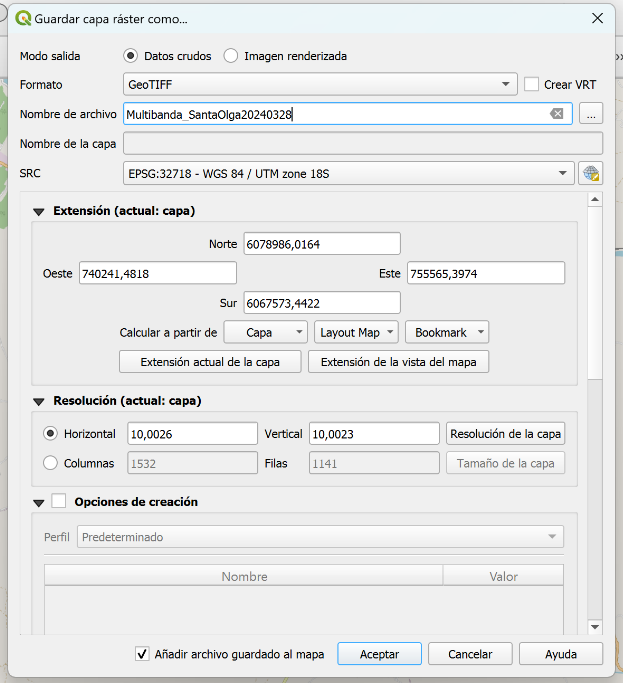{fig-align="center"}

**9.** En la ventana **Guardar capa ráster como…** configura:

-   **Modo de salida:** `Datos crudos`
-   **Formato:** `GeoTIFF`
-   **Nombre de archivo:** apunta a `datos/procesados/` y nómbralo `Multibanda_SantaOlga_20170320.tif`
-   **SRC:** mantén el SRC original de las bandas (EPSG:32718 — UTM 18S)

Haz click en **Aceptar**.

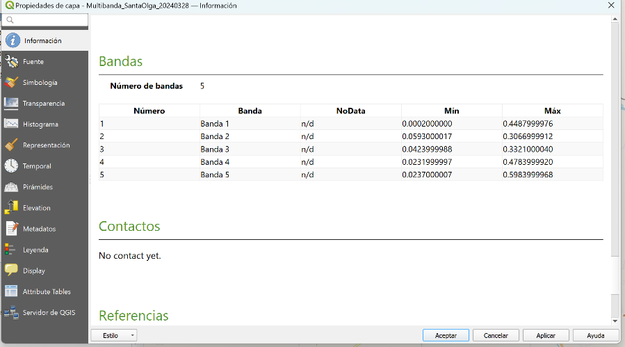{fig-align="center"}

::: callout-warning
**¿Por qué `procesados/` y no `intermedios/`?** El archivo multibanda **es** la capa que vas a cargar para el mapa True Color (Paso 7) y la fuente para los cálculos de índices (Pasos 4–6). Es la última versión de la cadena, así que va a `procesados/`.
:::

**10.** Repite los pasos 6–9 para las **otras tres fechas**: `SantaOlga_20170119`, `SantaOlga_20180320` y `SantaOlga_20240328`. Al terminar deberías tener **cuatro archivos** en `datos/procesados/`:

-   `Multibanda_SantaOlga_20170119.tif`
-   `Multibanda_SantaOlga_20170320.tif`
-   `Multibanda_SantaOlga_20180320.tif`
-   `Multibanda_SantaOlga_20240328.tif`

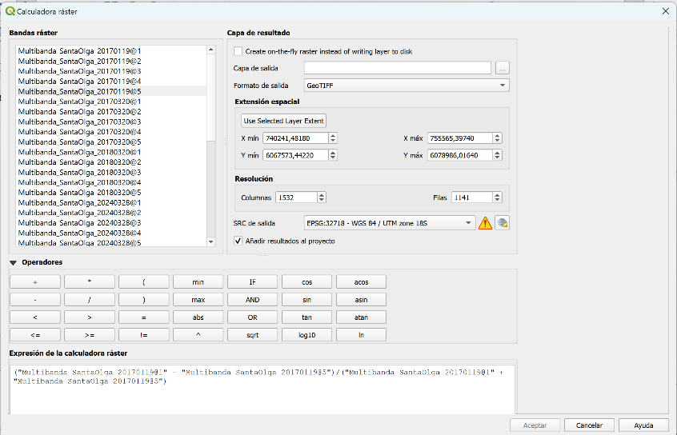{fig-align="center"}

------------------------------------------------------------------------

## Paso 3 | Identificar las bandas del archivo multibanda

Cuando combinamos las cinco bandas en un solo archivo, QGIS las numera **1, 2, 3, 4, 5** dentro de él — perdiendo el nombre original (B02, B03, etc.). Para usarlas correctamente en la **Calculadora ráster**, necesitamos saber qué banda interna corresponde a cuál banda Sentinel.

**11.** Haz **clic derecho** sobre el archivo `Multibanda_SantaOlga_20170320.tif` → `Propiedades → Información`. En la sección **Bandas** verás cinco filas — una por cada banda apilada.

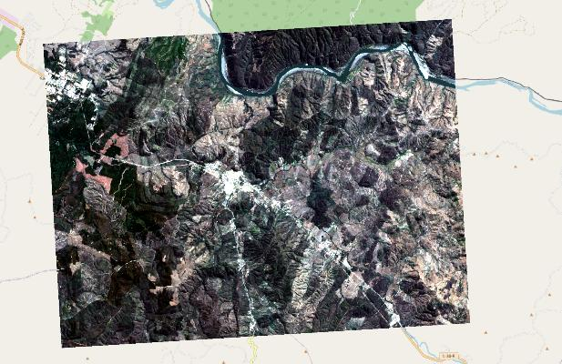{fig-align="center"}

Si seguiste el orden recomendado en el Paso 2 (B02, B03, B04, B08, B12), la equivalencia será:

| Banda interna del multibanda | Banda Sentinel-2 | Uso |
|---|---|---|
| Banda 1 | B2 — Azul | Canal Azul (True Color) |
| Banda 2 | B3 — Verde | Canal Verde (True Color) |
| Banda 3 | B4 — Rojo | Canal Rojo (True Color) + denominador NDVI |
| Banda 4 | B8 — NIR | NDVI y NBR |
| Banda 5 | B12 — SWIR | NBR |

::: callout-tip
**Apunta esta equivalencia.** En la Calculadora ráster, las bandas se referencian como `"Multibanda_SantaOlga_20170320@N"` donde `N` es el número de banda interna. Es fácil equivocarse: revisa siempre Propiedades → Información antes de calcular un índice.
:::

------------------------------------------------------------------------

## Paso 4 | Calcular el NDVI (4 fechas)

El **NDVI** mide la salud de la vegetación a partir del contraste entre la **banda roja** (que la vegetación sana absorbe para hacer fotosíntesis) y la **banda NIR** (que la vegetación refleja fuertemente):

$$\mathrm{NDVI} = \frac{B8 - B4}{B8 + B4}$$

Valores cercanos a **1** indican vegetación densa y saludable; valores cercanos a **0** indican suelo desnudo; valores **negativos** suelen indicar agua o nubes.

**12.** Abre la **Calculadora ráster** desde el menú `Ráster → Calculadora ráster…`.

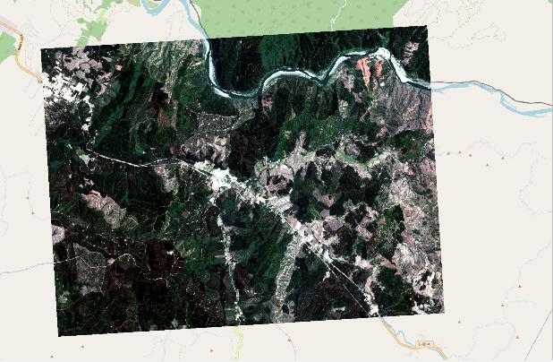{fig-align="center"}

**13.** En el panel **Bandas ráster** (arriba a la izquierda) verás listadas todas las bandas disponibles. Para el archivo `Multibanda_SantaOlga_20170320.tif`, escribe la siguiente expresión en el campo **Expresión de la calculadora ráster** (siguiendo la equivalencia del Paso 3, con B4 = banda 3 y B8 = banda 4):

```
( "Multibanda_SantaOlga_20170320@4" - "Multibanda_SantaOlga_20170320@3" ) / ( "Multibanda_SantaOlga_20170320@4" + "Multibanda_SantaOlga_20170320@3" )
```

**14.** En la sección **Capa de resultado**:

-   **Capa de salida:** apunta a `datos/procesados/` y nómbrala `NDVI_SantaOlga_20170320.tif`
-   **Formato:** `GeoTIFF`
-   **SRC:** mantén el SRC del multibanda (EPSG:32718)

Haz click en **Aceptar**.

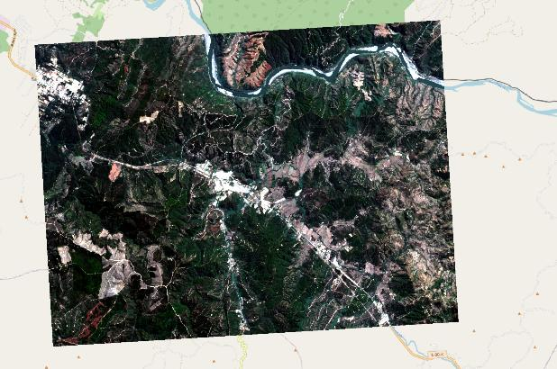{fig-align="center"}

**15.** Repite los pasos 12–14 para las **otras tres fechas**, generando un NDVI por cada una. Al terminar deberías tener cuatro archivos NDVI en `datos/procesados/`:

-   `NDVI_SantaOlga_20170119.tif`
-   `NDVI_SantaOlga_20170320.tif`
-   `NDVI_SantaOlga_20180320.tif`
-   `NDVI_SantaOlga_20240328.tif`

::: callout-note
**Pausa.** Antes de seguir, mira en QGIS los NDVI de las cuatro fechas (todavía en escala de grises). ¿Se ve a simple vista que la imagen del 20-mar-2017 (poco después del incendio) tiene valores más bajos que la del 19-ene-2017?
:::

------------------------------------------------------------------------

## Paso 5 | Calcular el NBR (4 fechas)

El **NBR** (*Normalized Burn Ratio*) usa el contraste entre el **NIR** (B8, fuertemente reflejado por la vegetación sana) y el **SWIR** (B12, fuertemente reflejado por el suelo quemado o desnudo):

$$\mathrm{NBR} = \frac{B8 - B12}{B8 + B12}$$

**Valores altos** ≈ vegetación sana; **valores bajos** ≈ suelo desnudo, recién quemado o roca expuesta.

**16.** En la **Calculadora ráster**, escribe la siguiente expresión para `Multibanda_SantaOlga_20170320.tif` (B8 = banda 4, B12 = banda 5):

```
( "Multibanda_SantaOlga_20170320@4" - "Multibanda_SantaOlga_20170320@5" ) / ( "Multibanda_SantaOlga_20170320@4" + "Multibanda_SantaOlga_20170320@5" )
```

**17.** Guarda el archivo en `datos/intermedios/` con el nombre `NBR_SantaOlga_20170320.tif` y haz click en **Aceptar**.

::: callout-warning
**¿Por qué `intermedios/`?** El NBR por sí solo no aparece en ningún mapa final — sólo lo usamos para calcular el **dNBR** en el Paso 6. Como es un *paso intermedio* hacia otro derivado, va a `intermedios/`. (Compara con el NDVI, que sí se mapea directamente → procesados.)
:::

**18.** Repite para las **otras tres fechas**. Al terminar tendrás cuatro archivos NBR en `datos/intermedios/`:

-   `NBR_SantaOlga_20170119.tif` (línea base — antes del incendio)
-   `NBR_SantaOlga_20170320.tif`
-   `NBR_SantaOlga_20180320.tif`
-   `NBR_SantaOlga_20240328.tif`

------------------------------------------------------------------------

## Paso 6 | Calcular el dNBR — la cicatriz del incendio

El **NBR** por sí solo tiene un problema: un suelo desnudo y una zona recién quemada se parecen mucho (ambos absorben NIR y reflejan SWIR). Para distinguir lo que **cambió** entre antes y después del incendio, calculamos el **dNBR** (delta NBR):

$$\Delta\mathrm{NBR} = \mathrm{NBR}_{\text{antes}} - \mathrm{NBR}_{\text{después}}$$

Valores **altos** = zonas que **antes eran verdes y ahora están quemadas** → severidad del incendio.
Valores **cercanos a cero o negativos** = zonas sin cambio o que se **recuperaron**.

**19.** Abre la **Calculadora ráster**. Para calcular el dNBR a casi dos meses del incendio, escribe:

```
"NBR_SantaOlga_20170119@1" - "NBR_SantaOlga_20170320@1"
```

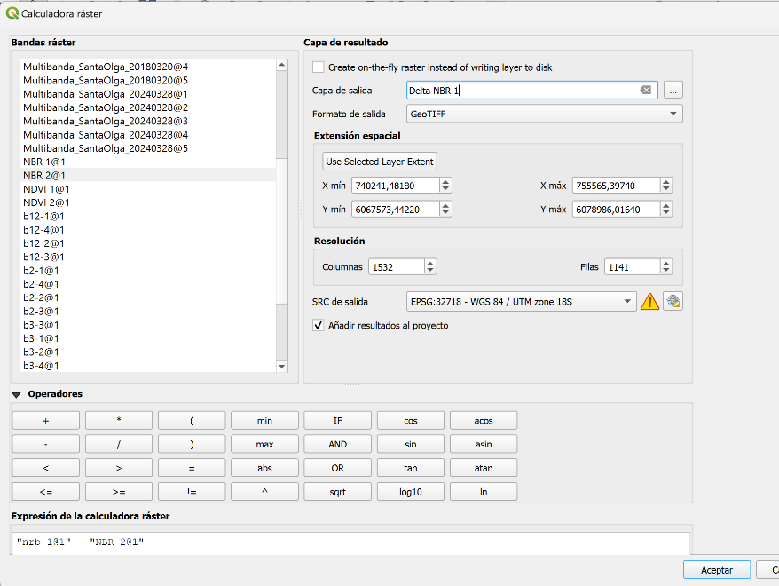{fig-align="center"}

**20.** Guarda el resultado en `datos/procesados/` con el nombre `dNBR_SantaOlga_2meses.tif`.

**21.** Repite con las otras dos fechas posteriores al incendio, manteniendo **siempre la línea base 2017-01-19**:

-   `"NBR_SantaOlga_20170119@1" - "NBR_SantaOlga_20180320@1"` → guardar como `dNBR_SantaOlga_1ano.tif`
-   `"NBR_SantaOlga_20170119@1" - "NBR_SantaOlga_20240328@1"` → guardar como `dNBR_SantaOlga_7anos.tif`

Al terminar tendrás **tres mapas dNBR** en `datos/procesados/` que muestran cómo evolucionó la huella del incendio.

::: callout-tip
**¿Por qué no hay un dNBR para 2017-01-19?** Porque la imagen del 19-ene-2017 **es** la línea base — el "antes". Comparada consigo misma daría cero en todo el ráster. Por eso el layout final del mapa dNBR (Paso 9) tendrá tres cuadrantes con dNBR y el cuarto cuadrante con el **True Color** del 20-mar-2017 como referencia visual de cómo se veía la zona inmediatamente después del incendio.
:::

------------------------------------------------------------------------

## Paso 7 | Mapa True Color — composición temporal

**22.** Para cada uno de los **cuatro multibanda** (las cuatro fechas), aplica simbología de color verdadero. Haz **clic derecho** sobre el archivo → `Propiedades → Simbología`. Configura:

-   **Tipo de renderizador:** `Color multibanda`
-   **Banda roja:** `Banda 3` (= B4, rojo Sentinel)
-   **Banda verde:** `Banda 2` (= B3, verde Sentinel)
-   **Banda azul:** `Banda 1` (= B2, azul Sentinel)

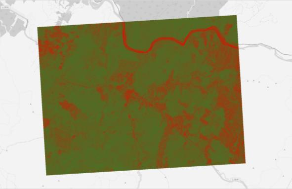{fig-align="center"}

**23.** Ajusta el **contraste** y el **brillo** para que las cuatro imágenes se vean visualmente uniformes. La forma más simple es usar los mismos valores **mín/máx** en todas (haz click en **Estimar (más rápido)** en una imagen y aplica el mismo rango manualmente en las otras). Este paso es opcional pero recomendable para que la comparación visual sea limpia.

::: callout-note
**Pausa visual.** Después de aplicar el color verdadero, compara las cuatro imágenes en QGIS antes de pasar al compositor. ¿Se nota el cambio de color del suelo entre el 19-ene-2017 y el 20-mar-2017?
:::

**24.** Composición de impresión. Ve a `Proyecto → Nuevo diseño de impresión…`, dale un nombre y crea un **layout 2×2** con los cuatro mapas True Color en orden temporal:

-   Cuadrante superior izquierdo: **2017-01-19** — *Justo antes del incendio*
-   Cuadrante superior derecho: **2017-03-20** — *Un poco menos de dos meses después*
-   Cuadrante inferior izquierdo: **2018-03-20** — *Un poco más de un año después*
-   Cuadrante inferior derecho: **2024-03-28** — *Un poco más de siete años después*

Agrega una **etiqueta** con la fecha encima de cada cuadrante.

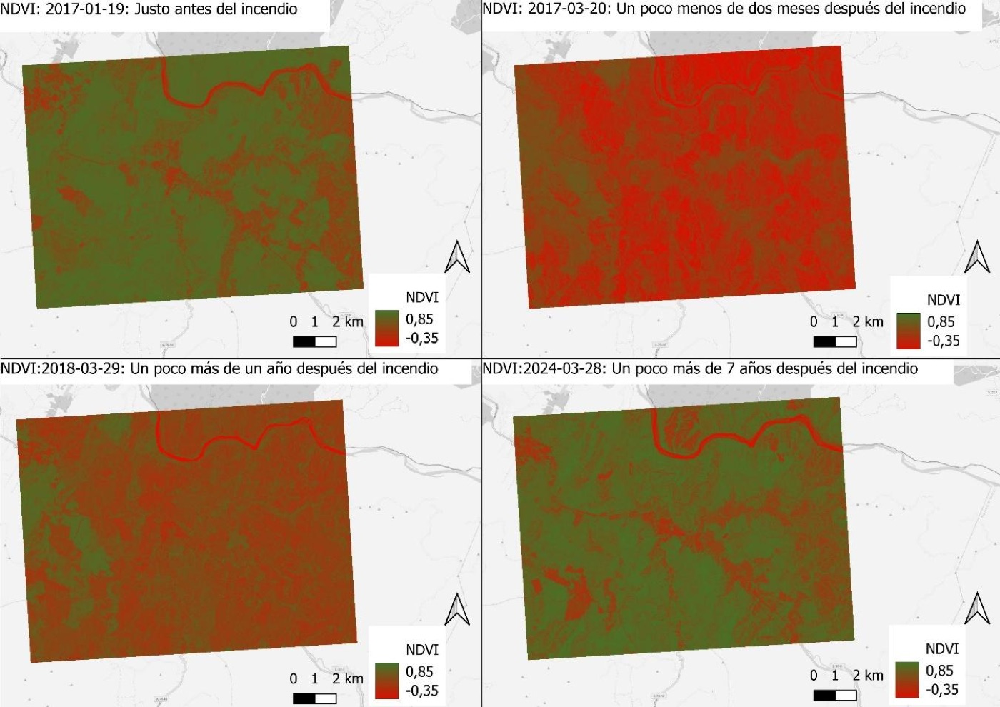{fig-align="center"}

**25.** Exporta el layout a `resultados/mapas/` como `mapa_truecolor_SantaOlga.pdf` (o `.png`).

------------------------------------------------------------------------

## Paso 8 | Mapa NDVI — composición temporal

**26.** Para cada uno de los **cuatro NDVI** (las cuatro fechas), aplica simbología. Haz **clic derecho** sobre el archivo NDVI → `Propiedades → Simbología`. Configura:

-   **Tipo de renderizador:** `Pseudocolor monobanda`
-   **Mín:** `-0,35`
-   **Máx:** `0,85`
-   **Rampa de color:** una rampa **verde → rojo**, donde el verde representa vegetación densa (valores altos) y el rojo zonas sin vegetación o quemadas (valores bajos). Si la rampa por defecto va al revés, marca **Invertir rampa de color**.

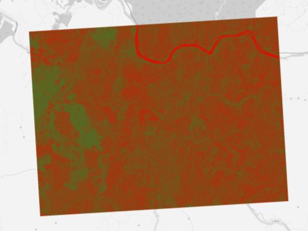{fig-align="center"}

::: callout-important
**Misma escala en las cuatro fechas.** Para que la comparación visual sea válida, los **cuatro mapas NDVI deben usar exactamente el mismo Mín/Máx y la misma rampa**. De lo contrario un mismo color significaría cosas distintas en cada mapa.
:::

**27.** En el compositor de impresión (puede ser un nuevo layout o el mismo del Paso 7), crea otro **layout 2×2** con los cuatro mapas NDVI. Agrega etiquetas con la fecha y **una sola leyenda** (válida para todas, ya que comparten escala). Incluye una **flecha norte** y una **barra de escala**.

{fig-align="center"}

**28.** Exporta el layout a `resultados/mapas/` como `mapa_ndvi_SantaOlga.pdf`.

------------------------------------------------------------------------

## Paso 9 | Mapa dNBR — la huella del incendio en el tiempo

**29.** Para cada uno de los **tres dNBR** (`dNBR_SantaOlga_2meses.tif`, `_1ano.tif`, `_7anos.tif`), aplica simbología. Haz **clic derecho** → `Propiedades → Simbología`. Configura:

-   **Tipo de renderizador:** `Pseudocolor monobanda`
-   **Mín:** `-1,8`
-   **Máx:** `1,25`
-   **Rampa de color:** una rampa que represente la **severidad** — por ejemplo, **rojo oscuro** para áreas de alta severidad (valores altos de ΔNBR), **naranja/amarillo** para severidad moderada, y **tonos pasteles o blancos** para áreas sin daño o regeneración.

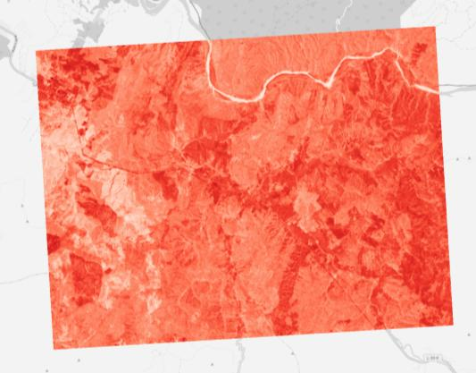{fig-align="center"}

::: callout-important
**Misma escala para los tres dNBR.** Igual que con el NDVI: si quieres comparar la severidad a 2 meses, 1 año y 7 años, los tres mapas deben usar el **mismo Mín/Máx y la misma rampa**.
:::

**30.** Composición de impresión. Crea un nuevo **layout 2×2** que combine los tres dNBR con un mapa de referencia visual. En el primer cuadrante (superior izquierdo) coloca el **True Color del 20-mar-2017** como referencia (para que se vea cómo lucía el área inmediatamente después del incendio). En los otros tres cuadrantes, los dNBR en orden temporal:

-   Cuadrante superior izquierdo: **True Color** del 2017-03-20 — *Un poco menos de dos meses después*
-   Cuadrante superior derecho: **dNBR 2 meses** — *Huella del incendio a 2 meses*
-   Cuadrante inferior izquierdo: **dNBR 1 año** — *Huella del incendio a 1 año*
-   Cuadrante inferior derecho: **dNBR 7 años** — *Huella del incendio a 7 años*

Agrega etiquetas, leyenda (válida para los tres dNBR), flecha norte y barra de escala.

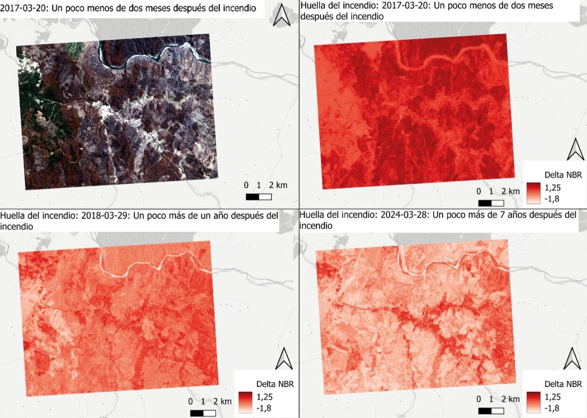{fig-align="center"}

**31.** Exporta el layout a `resultados/mapas/` como `mapa_dnbr_SantaOlga.pdf`.

------------------------------------------------------------------------

## ¡Listo! {.unnumbered .unlisted}

Has finalizado los tres mapas. **Recuerda guardar tu carpeta completa para utilizarla en tu Mapa-Memo y portafolio.**

::: callout-important
**Para tu Mapa-Memo.** Construye una breve narrativa a partir de los tres mapas que produjiste — True Color, NDVI y dNBR en orden temporal. Considera las siguientes preguntas guía:

1.  **Cicatriz inmediata.** ¿Qué cambios observas en el NDVI y en el dNBR entre el 19-ene-2017 (justo antes) y el 20-mar-2017 (casi dos meses después)? ¿La huella del incendio es uniforme, o hay zonas con más severidad que otras?
2.  **Recuperación.** Comparando las imágenes de 2018 y 2024 con la línea base, ¿se ve recuperación de la vegetación? ¿En todo el polígono quemado, o sólo en algunas zonas? ¿Qué podría explicar las diferencias?
3.  **NDVI vs dNBR.** ¿Qué muestra el NDVI que el dNBR no muestra, y viceversa? ¿Cuál sirve mejor para distinguir el daño *causado por el incendio* del daño *preexistente* (suelo desnudo, agricultura)?
4.  **Teledetección como herramienta.** ¿Qué ventajas y limitaciones identificas al usar imágenes satelitales para evaluar catástrofes naturales como los incendios forestales? ¿Cómo afecta la **resolución espacial, espectral y temporal** la posibilidad de detectar y monitorear la cicatriz de un incendio?
5.  **Vinculación con la clase.** En la clase revisamos el marco de las **5R** (Revisión y análisis, Reducción del riesgo, Preparación, Respuesta, Recuperación) propuesto por UNEP. ¿En cuál(es) de las 5R se ubica la teledetección satelital de cicatrices de incendio? ¿Por qué?
:::

::: callout-tip
**Sugerencia de extensión (opcional).** Si te interesa profundizar:

-   Calcula un mapa de **diferencia de NDVI** (línea base − post-incendio) y compáralo con el dNBR. ¿Son consistentes?
-   Cruza el polígono quemado con la capa de **vías** y **localidades pobladas** de la zona para identificar comunidades expuestas — Santa Olga, Los Aromos, Santa Lucía.
-   Visita el visor histórico de **CONAF** o **SENAPRED** para contrastar la cicatriz que extrajiste con los polígonos oficiales del incendio.
:::
