## Objetivo

El objetivo de esta práctica es que uses datos **ráster** y **vectoriales** en QGIS para estudiar la transformación de la **Región de La Araucanía**: cómo cambió el uso de suelo en torno a los **Títulos de Merced** (los límites históricos de las reducciones mapuche) y cómo se distribuye el conflicto de autodeterminación Mapuche-Estado en el territorio. Trabajarás con el mapa de cobertura y uso de suelo de **MapBiomas Chile** (año 2022), con la capa de **Títulos de Merced** del CONADI y con los datos georreferenciados de conflicto de **MACEDA**, para componer dos mapas y compararlos con la situación del año 2000.

Temáticas por trabajar:

-   **Búsqueda y descarga** de capas ráster (MapBiomas) y vectoriales (Títulos de Merced)
-   **Recorte ráster por capa de máscara** (`Ráster → Extracción → Cortar ráster por capa de máscara`)
-   **Simbología ráster por paleta/valores únicos** y carga de un mapa de color (`.clr`)
-   **Geoprocesos vectoriales:** `Buffer` (zona de influencia) y `Diferencia` entre buffers
-   **Importar un CSV como capa de puntos** (`Capa → Añadir capa de texto delimitado`)
-   **Filtros** por atributos (`"year" >= 2000`) y **simbología categorizada**
-   **Compositor de impresión** — dos mapas temáticos con leyenda, flecha norte y escala

::: callout-warning
**¡Importante!** Si estás trabajando en un computador de la universidad, guarda tu trabajo en **OneDrive** (u otro servicio en la nube), de lo contrario perderás tu avance. Los computadores de sala se borran automáticamente cada semana.
:::

------------------------------------------------------------------------

## Resumen del trabajo de esta clase

### Capas

Trabajaremos con tres fuentes de datos sobre el mismo territorio, la Región de La Araucanía:

| Capa | Tipo | Origen | Qué contiene |
|---|---|---|---|
| MapBiomas Chile 2022 | Ráster | Descarga (mapbiomas.cl) | Cobertura y uso de suelo de todo Chile, año 2022 |
| MapBiomas Chile 2000 | Ráster | Insumos (`raster2000.tif`) | Uso de suelo del año 2000, para comparar |
| Títulos de Merced | Vectorial (polígonos) | Insumos (CONADI / SIIC) | Límites históricos de las reducciones mapuche |
| MACEDA | CSV → puntos | Insumos (`maceda.csv`) | Eventos de conflicto georreferenciados (desde 1991) |
| `REGION_C17` | Vectorial (polígono) | Insumos | Máscara de la Región de La Araucanía |
| `Paleta de colores.clr` | Mapa de color | Insumos | Colores estándar de MapBiomas |

::: callout-tip
**¿Qué es MACEDA?** Es una base de datos de eventos de conflicto del proceso de autodeterminación Mapuche, georreferenciados y clasificados por tipo (`event_type_maceda`): *ATTACK* (ataque), *COERCE* (coerción), *LAND INVASION* (invasión de tierras) y *PROTEST* (protesta). En esta tarea analizaremos los **conflictos declarados** (ataque, coerción e invasión de tierras), no las protestas.
:::

### Procesos

1.  **Pasos 1–3 — Uso de suelo 2022.** Crear el proyecto, descargar el ráster MapBiomas, recortarlo a la Región y aplicarle la paleta de colores estándar.
2.  **Pasos 4–5 — Títulos de Merced.** Descargar la capa del CONADI, recortarla a la Región y reproyectarla a UTM (EPSG:32718).
3.  **Pasos 6–7 — Áreas de influencia.** Generar buffers de 5 km y de 50 m alrededor de los Títulos de Merced y restarlos para obtener las **zonas aledañas** (entre 50 y 5.000 m).
4.  **Pasos 8–9 — Conflicto.** Cargar los puntos de MACEDA, recortarlos a la Región, filtrar desde el año 2000 y clasificarlos por tipo de evento.
5.  **Paso 10 — Simplificar el uso de suelo** en cuatro categorías visuales (Bosque, Cuerpo de agua, Plantación Forestal, Otro).
6.  **Pasos 11–12 — Mapas.** Componer el Mapa 1 (usos de suelo 2022 + áreas de influencia) y el Mapa 2 (usos de suelo 2022 + tipos de conflicto).
7.  **Paso 13 — Comparación temporal.** Contrastar tus mapas de 2022 con las imágenes provistas del año 2000.
8.  **Preguntas guía para el portafolio.** Reflexionar sobre la correlación espacial entre la expansión forestal y el conflicto.

------------------------------------------------------------------------

## Preparación: descarga y organización del material

### Descarga desde Canvas

**1.** Descarga el archivo `.zip` de esta tarea desde la página del curso en **Canvas** (carpeta "Clase 12"). Contiene los insumos ya organizados en la estructura estándar: la máscara `REGION_C17`, la capa de `Títulos de Merced`, el archivo `maceda.csv`, la `Paleta de colores.clr`, el ráster de uso de suelo del año 2000 (`raster2000.tif`) y dos imágenes de referencia del año 2000.

**2.** Descomprime el archivo en una ubicación dedicada a este curso. Algunas opciones:

-   **Computador personal:** descomprime dentro de tu carpeta `SUS2211/`.
-   **Computador de la sala:** descomprime en el escritorio o en Documentos, pero **antes de terminar la sesión**, copia toda la carpeta a OneDrive, un pendrive u otro servicio en la nube.

------------------------------------------------------------------------

### Estructura de carpetas del proyecto

Al descomprimir el archivo, encontrarás la siguiente estructura. Es la misma que hemos usado en clases anteriores, **estándar para todas las tareas del curso**.

```{mermaid}
flowchart TD
    A["📁 tarea12/"] --> B["📁 datos/"]
    A --> C["📁 documentos/"]
    A --> D["📁 proyectos/"]
    A --> E["📁 resultados/"]

    B --> F["📁 brutos/<br>🔒 REGION_C17, Títulos de Merced, maceda.csv,<br>Paleta de colores.clr, raster2000 + PNG 2000<br>+ descarga: MapBiomas 2022"]
    B --> G["📁 intermedios/<br>ráster recortado, TDM cortado/reproyectado,<br>Buffer5000, Buffer50, maceda filtrada"]
    B --> H["📁 procesados/<br>uso de suelo 2022, áreas de influencia,<br>conflictos clasificados (capas de los mapas)"]

    E --> I["📁 mapas/<br>2 layouts exportados"]
    E --> J["📁 figuras/<br>capturas y comparaciones"]

    style F fill:#fde8e8,stroke:#c0392b
    style G fill:#fef9e7,stroke:#f39c12
    style H fill:#eafaf1,stroke:#27ae60
    style D fill:#eaf4fb,stroke:#2980b9
    style C fill:#f4f6f7,stroke:#7f8c8d
```

::: {.callout-tip title="¿Para qué sirve cada carpeta?"}

**`datos/`** — Todo lo geoespacial, organizado en tres subcarpetas:

-   **`brutos/`** 🔒 Los datos **tal como los obtuviste**, sin modificar: la máscara `REGION_C17`, la capa `Títulos de Merced`, `maceda.csv`, `Paleta de colores.clr`, el ráster de uso de suelo del año 2000 (`raster2000.tif`) y las dos imágenes de referencia del año 2000. El único archivo que **descargarás** es el ráster de MapBiomas 2022. **Nunca se modifican ni se sobreescriben.**
-   **`intermedios/`** Archivos que existen *sólo* como paso hacia otro derivado: el ráster recortado, los Títulos cortados y reproyectados, los buffers de 5 km y 50 m, y la capa MACEDA cortada y filtrada. No aparecen en los mapas finales, pero son indispensables para producirlos.
-   **`procesados/`** La última versión de cada capa en su cadena de procesamiento — la que efectivamente cargas en los mapas: el uso de suelo 2022 (recortado y simbolizado), las **áreas de influencia** (capa `Diferencia`) y los **conflictos clasificados**.

**`documentos/`** — Documentación de respaldo. Recomendado: una `bitacora.md` donde registres tus observaciones para el portafolio.

**`proyectos/`** — Archivos de proyecto QGIS (`.qgz`). Guarda aquí el proyecto de esta tarea como `clase12.qgz`.

**`resultados/`** — Productos finales:

-   **`mapas/`** Los **dos layouts** que exportarás como PDF o PNG: (1) usos de suelo 2022 + áreas de influencia, (2) usos de suelo 2022 + tipos de conflicto.
-   **`figuras/`** Capturas, comparaciones u otros outputs.

:::

------------------------------------------------------------------------

## ¡Empecemos! {.unnumbered .unlisted}

## Paso 1 | Crear el proyecto y activar el mapa base

**3.** Abre QGIS y crea un **proyecto nuevo**. Guárdalo de inmediato en `proyectos/` con el nombre `clase12.qgz` (y recuerda guardarlo también en OneDrive si estás en un computador de sala).

**4.** Activa el mapa base **OSM** (OpenStreetMap) desde el panel `Navegador → XYZ Tiles → OpenStreetMap`, para tener una referencia geográfica mientras trabajas.

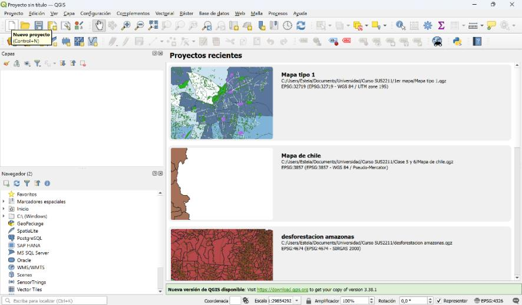{fig-align="center"}

------------------------------------------------------------------------

## Paso 2 | Descargar y recortar el ráster MapBiomas (2022)

**5.** Descargaremos el mapa de cobertura y uso de suelo de **MapBiomas Chile** para el año **2022**. Ve a la página de mapas de la colección, [chile.mapbiomas.org/mapas-de-la-coleccion](https://chile.mapbiomas.org/mapas-de-la-coleccion/), y sigue las instrucciones del sitio. En el **paso 3** que se indica allí podrás descargar el ráster: copia y pega esta dirección en el navegador y presiona Enter:

```
https://storage.googleapis.com/mapbiomas-public/initiatives/chile/coverage/chile_coverage_2022.tif
```

Guarda el archivo descargado (`chile_coverage_2022.tif`) en `datos/brutos/`.

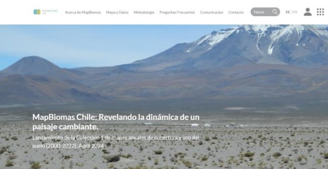{fig-align="center"}

::: callout-tip
El archivo cubre **todo Chile** y pesa bastante, así que la descarga puede tardar unos minutos. En el siguiente paso lo recortaremos a la Región de La Araucanía.
:::

**6.** Carga el ráster de MapBiomas en QGIS. Verás que cubre **todo el territorio nacional**. Para limitar la visualización a La Araucanía, realiza un **corte ráster por capa de máscara** usando el shapefile `REGION_C17`: `Ráster → Extracción → Cortar ráster por capa de máscara`. Define `REGION_C17` como la capa de máscara y guarda el resultado en `datos/intermedios/`.

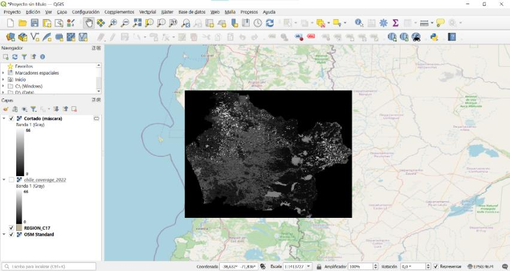{fig-align="center"}

::: callout-tip
Si no recuerdas el corte por máscara, revisa la **Guía 10**. El recorte deja sólo la información de la Región, que es lo que nos interesa analizar.
:::

------------------------------------------------------------------------

## Paso 3 | Aplicar la paleta de colores de MapBiomas

**7.** El ráster recortado se ve en escala de grises porque cada píxel guarda un **número** (el código de la clase de uso de suelo), no un color. Para leerlo, haz clic derecho sobre la capa recortada → `Propiedades → Simbología` y cambia el `Tipo de renderizado` a **Valores en paleta/únicos**. Luego haz clic en **Clasificar**.

**8.** Cada valor corresponde a un código de MapBiomas. Para aplicar el estándar de colores, consulta la tabla de códigos de MapBiomas: por ejemplo, el ID `3` corresponde a **Bosque** (`#1f8d49`).

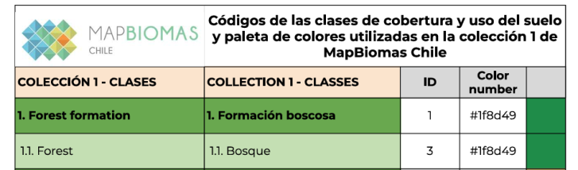{fig-align="center"}

**9.** Para no configurar los colores uno por uno, elimina el valor `0` (sin dato) y **carga el mapa de color de archivo** con el botón correspondiente del diálogo de Simbología. Selecciona el archivo `Paleta de colores.clr` que está en `datos/brutos/`.

{fig-align="center"}

**10.** Con la paleta aplicada, el uso de suelo de 2022 se visualiza con los colores estándar de MapBiomas.

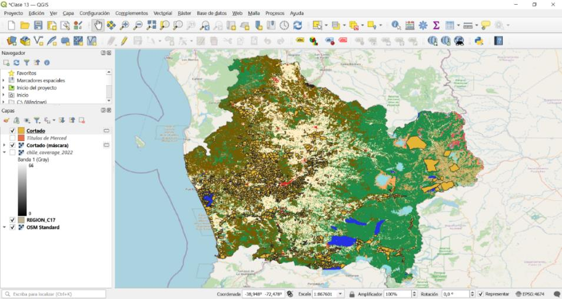{fig-align="center"}

------------------------------------------------------------------------

## Paso 4 | Recortar los Títulos de Merced

**11.** La capa de **Títulos de Merced** ya viene en `datos/brutos/` (`Titulos de Merced.shp`, provista por el CONADI / SIIC). Cárgala en QGIS.

**12.** Como nos concentraremos en la Región, **corta** el shapefile de los Títulos usando `REGION_C17` como máscara: `Vectorial → Herramienta de geoproceso → Cortar` (define `REGION_C17` como capa de superposición). Guarda el resultado en `datos/intermedios/`.

------------------------------------------------------------------------

## Paso 5 | Reproyectar a UTM (EPSG:32718)

**13.** Revisa el sistema de coordenadas de la capa cortada en `Propiedades → Información`. Si está en un sistema en **grados** (por ejemplo, EPSG:4674), debes **reproyectarla** a un sistema en **metros** para que los buffers se midan correctamente. Ve a `Vectorial → Herramientas de gestión de datos → Reproyectar capa`.

**14.** Configura la `Capa de entrada` como la capa cortada de los Títulos y el `SRC objetivo` como **EPSG:32718 — WGS 84 / UTM zone 18S**. Ejecuta y guarda el resultado en `datos/intermedios/`.

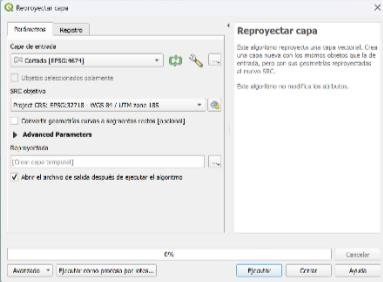{fig-align="center"}

::: callout-tip
**¿Por qué reproyectar?** Un buffer de "5.000 metros" sólo tiene sentido si la capa está en un sistema que mide en metros (UTM), no en grados. Reproyectar antes de medir distancias es un paso clave para no obtener resultados absurdos.
:::

------------------------------------------------------------------------

## Paso 6 | Crear las zonas aledañas: buffers de 5 km y 50 m

**15.** Crea un **Buffer de 5.000 metros** alrededor de los Títulos de Merced para visualizar su zona aledaña. Ve a `Vectorial → Herramienta de geoproceso → Buffer`, usa la capa reproyectada como entrada, fija la `Distancia` en `5000` metros y marca la opción **Disolver resultado**. Ejecuta.

{fig-align="center"}

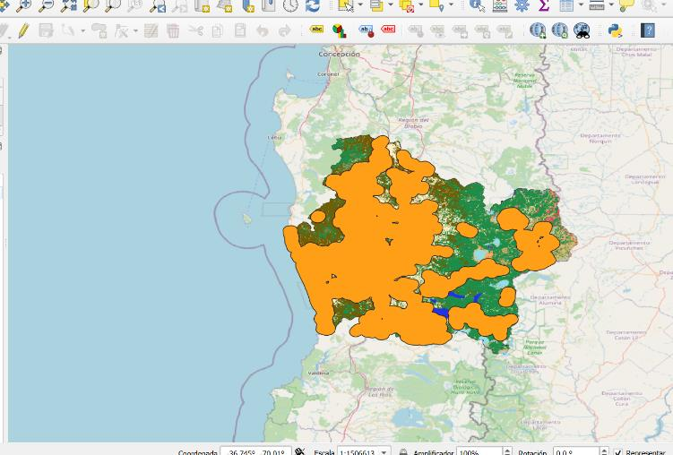{fig-align="center"}

**16.** Genera un **segundo buffer**, igual que el anterior pero con `Distancia = 50` metros (también con "Disolver resultado"). Este buffer pequeño simplifica las geometrías de los Títulos.

**17.** Para no confundirte, **renombra** las dos capas a `Buffer5000` y `Buffer50`, respectivamente.

------------------------------------------------------------------------

## Paso 7 | Áreas de influencia: la diferencia entre buffers

**18.** Las **zonas aledañas** a los Títulos de Merced son las regiones que están **entre 50 y 5.000 metros** de ellos. Para obtenerlas, resta el buffer pequeño al grande con `Vectorial → Herramienta de geoproceso → Diferencia`: usa `Buffer5000` como `Capa de entrada` y `Buffer50` como `Capa de superposición`. Ejecuta y guarda el resultado en `datos/procesados/`.

{fig-align="center"}

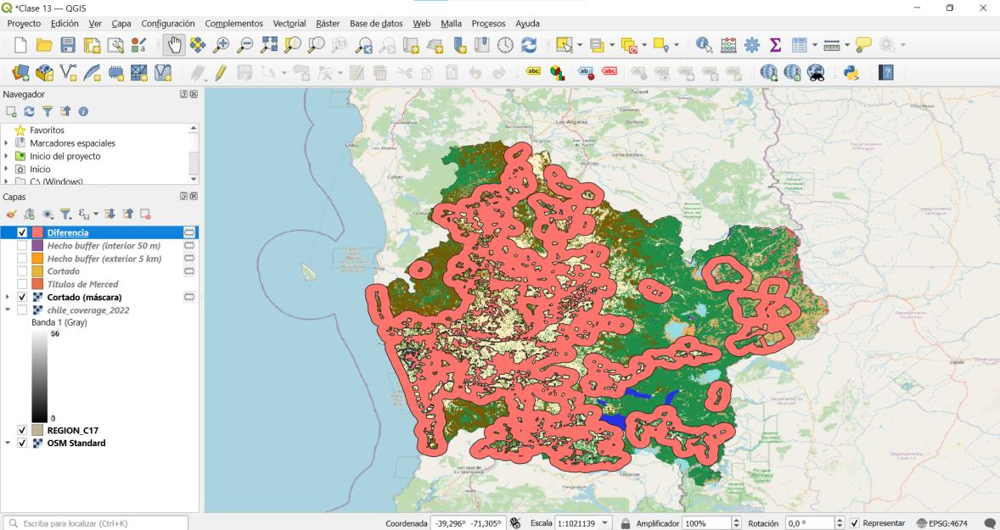{fig-align="center"}

------------------------------------------------------------------------

## Paso 8 | Cargar los conflictos de MACEDA

**19.** Carga el archivo `maceda.csv` (en `datos/brutos/`) como capa de puntos: `Capa → Añadir capa → Añadir capa de texto delimitado`. Define las columnas de geometría: `Campo X = longitude`, `Campo Y = latitude`, y el `SRC de la geometría` como **EPSG:4326 — WGS 84**.

{fig-align="center"}

::: callout-note
**PAUSA.** Asegúrate de que las columnas `year`, `month` y `day` queden definidas como **Entero (64 bit)**. Revisa la fila "Datos de ejemplo" del diálogo antes de hacer clic en **Añadir**.
:::

**20.** Los puntos cubren todo el país. Recórtalos a la Región con `Vectorial → Herramienta de geoproceso → Cortar`: usa `maceda` como `Capa de entrada` y `REGION_C17` como `Capa de superposición`.

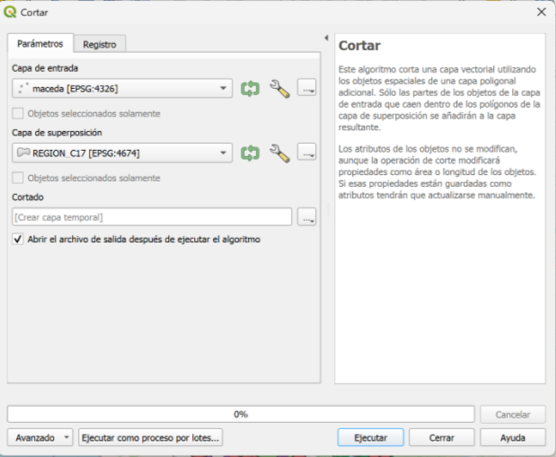{fig-align="center"}

------------------------------------------------------------------------

## Paso 9 | Filtrar y clasificar los conflictos

**21.** La capa contiene eventos declarados desde 1991. Trabajaremos desde el **año 2000** en adelante. Haz clic derecho sobre la capa cortada → **Filtrar** y construye la expresión:

```
"year" >= 2000
```

{fig-align="center"}

**22.** Clasifica los puntos por tipo de evento: `Propiedades → Simbología → Categorizado`, define `event_type_maceda` como `Valor` y haz clic en **Clasificar**. Luego **elimina** la categoría `PROTEST`: en esta actividad estudiamos sólo los **conflictos declarados** (ATTACK, COERCE, LAND INVASION).

{fig-align="center"}

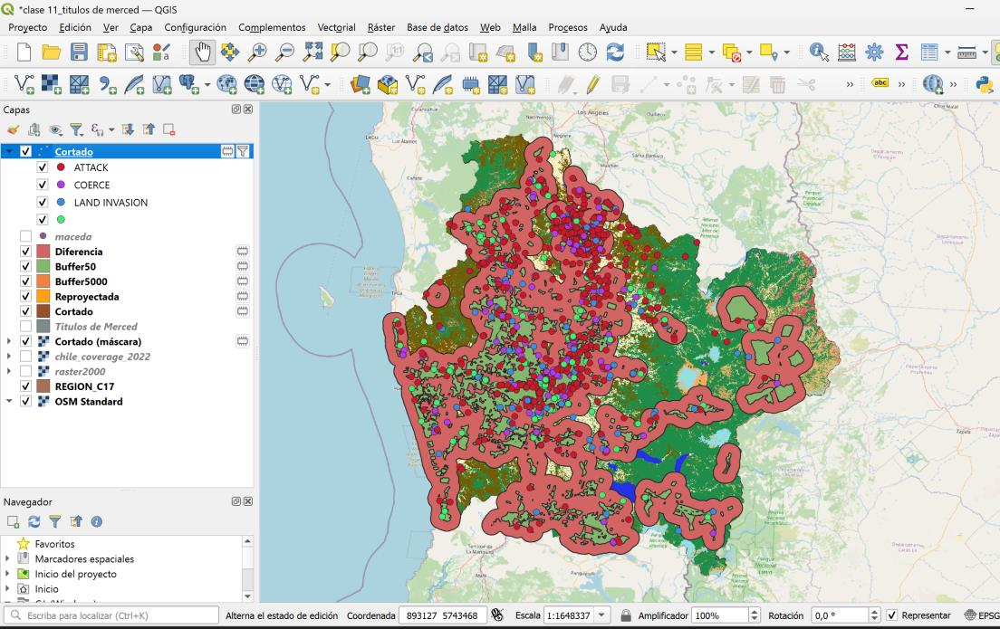{fig-align="center"}

------------------------------------------------------------------------

## Paso 10 | Agrupar el uso de suelo en cuatro categorías

**23.** Un ráster con muchos valores únicos genera un mapa con demasiados colores y ruido visual. Para mejorar la legibilidad, agrupa los valores en **cuatro categorías**. Abre la `Simbología` del ráster recortado y edita las etiquetas manualmente:

-   `3` = **Bosque**
-   `5`, `11`, `33`, `34` = **Cuerpo de agua**
-   `9` = **Plantación forestal**
-   Todos los demás = **Otro**

**24.** **Asigna colores coherentes:** el mismo color para todos los valores de una misma categoría (por ejemplo, un solo azul para "Cuerpo de agua", un solo beige para "Otro"). Así el mapa mostrará sólo cuatro colores distintos.

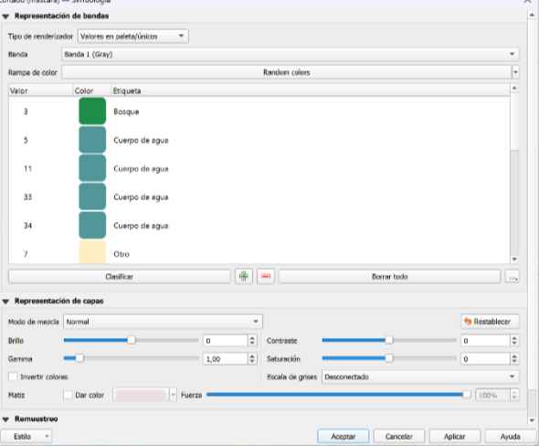{fig-align="center"}

------------------------------------------------------------------------

## Paso 11 | Mapa 1 — Usos de suelo 2022 y áreas de influencia

**25.** Configura la capa de **áreas de influencia** (la capa `Diferencia`) con cierta transparencia o sólo con borde, para poder ver simultáneamente el uso de suelo por debajo.

**26.** Abre el **Diseñador de impresión** y compón el mapa, integrando el uso de suelo de 2022 y las zonas de influencia de los Títulos. Agrega título, leyenda, flecha norte y barra de escala. Exporta a `resultados/mapas/` como `mapa1_usos_areas_influencia.pdf`.

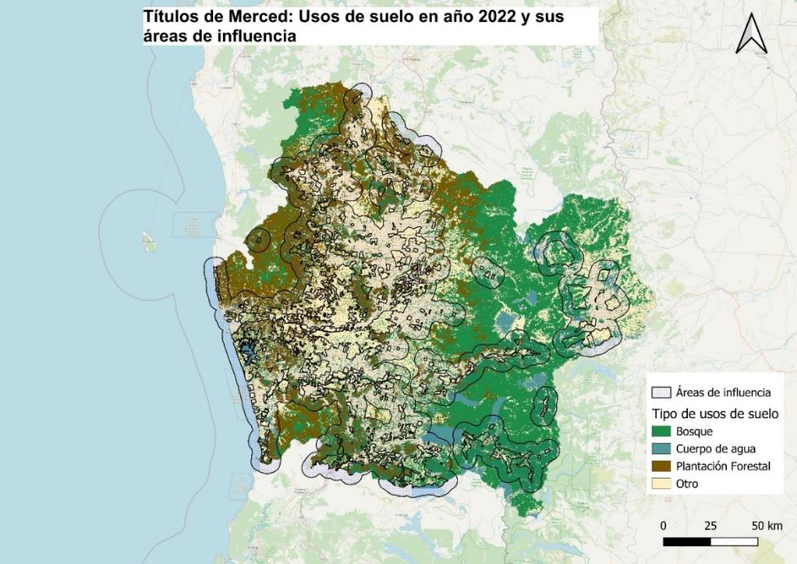{fig-align="center"}

------------------------------------------------------------------------

## Paso 12 | Mapa 2 — Usos de suelo 2022 y tipos de conflicto

**27.** Compón el segundo mapa sobre la base del uso de suelo 2022 y la capa de **conflictos clasificados** por tipo. Agrega título, leyenda (uso de suelo y tipos de conflicto), flecha norte y barra de escala. Exporta a `resultados/mapas/` como `mapa2_usos_conflictos.pdf`.

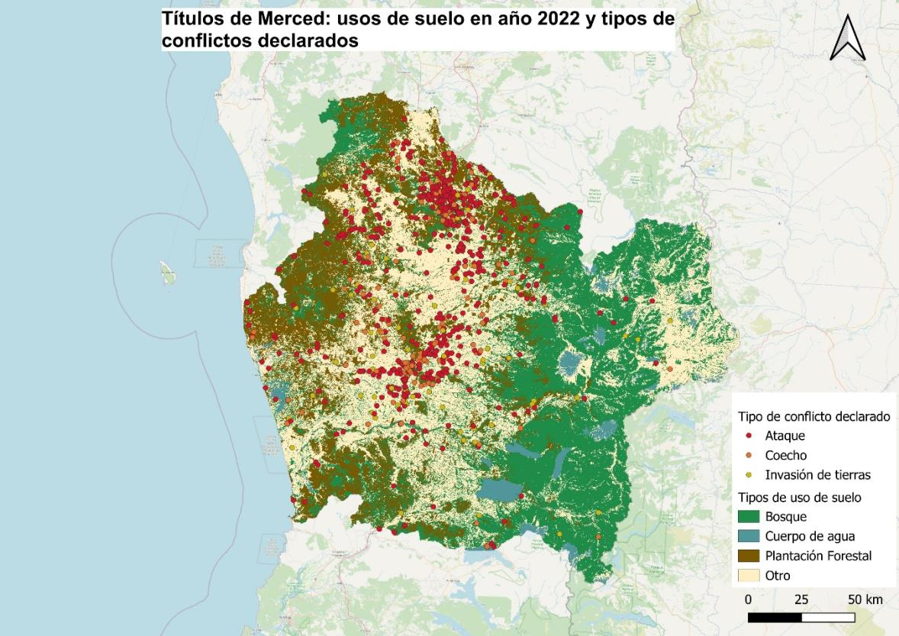{fig-align="center"}

------------------------------------------------------------------------

## Paso 13 | Comparar con el año 2000

**28.** Compara tus dos mapas de 2022 con las imágenes de referencia del año **2000** que están en `datos/brutos/`: `Zonas aledañas a los TDM año 2000.png` (uso de suelo) y `Conflictos indígenas 2000.png` (conflictos). En un documento (en `documentos/` o `resultados/figuras/`), contrasta la situación territorial en ambos años, enfocándote en las **zonas aledañas** a los Títulos de Merced: ¿cómo cambió el uso de suelo entre 2000 y 2022?, ¿cambió la cantidad o la distribución de los conflictos?

::: callout-tip
En `datos/brutos/` también está el ráster de uso de suelo del año 2000 (`raster2000.tif`). Si quieres, puedes recortarlo y simbolizarlo con los mismos pasos del año 2022 para construir tú mismo el mapa de 2000, en vez de usar las imágenes de referencia.
:::

------------------------------------------------------------------------

## ¡Listo! {.unnumbered .unlisted}

Has finalizado tus dos mapas. **Recuerda completar esta actividad y guardar tu carpeta para utilizarla en tu próximo portafolio.**

::: callout-important
**Elige el caso de La Araucanía para tu portafolio** y construye una breve narrativa a partir de los mapas que produjiste, comparando 2000 y 2022. Considera las siguientes preguntas guía:

1.  **Correlación espacial.** Al comparar los mapas, ¿observas alguna relación espacial entre el crecimiento de la **plantación forestal** y los **eventos de conflicto**? ¿Hay zonas donde esta relación se perciba con mayor claridad?
2.  **Transformación del paisaje.** En las zonas aledañas a los Títulos de Merced, ¿qué uso de suelo fue reemplazado por la plantación forestal entre 2000 y 2022 (bosque nativo, agricultura, otros)? ¿Qué servicios ecosistémicos pudo perder el territorio en esa transformación?
3.  **Correlación no es causalidad.** Una correlación espacial entre plantaciones y conflicto **no prueba** que una cause el otro. ¿Qué otros factores podrían explicar el patrón que observas? ¿Qué datos adicionales necesitarías para acercarte a una explicación causal?
4.  **Vinculación con la clase.** Conectando con lo que vimos sobre valoración de servicios ecosistémicos y el caso de las plantaciones (Gómez-González et al.), ¿cómo ayudaría una herramienta espacial como **InVEST** a cuantificar lo que el territorio gana y pierde con este cambio de uso de suelo?
5.  **Límites de los datos.** ¿Qué no captura este análisis? Piensa en la resolución del ráster, en qué cuenta MACEDA como "evento", y en lo que un mapa de uso de suelo no puede mostrar sobre la vida de las comunidades.
:::

::: callout-tip
**Sugerencia de extensión (opcional).** Si te interesa profundizar:

-   Calcula el **área** de cada categoría de uso de suelo *dentro* de las áreas de influencia (con estadísticas zonales) y compara 2000 vs 2022 en números, no sólo visualmente.
-   Cuenta los conflictos que caen **dentro** de las áreas de influencia frente a los que caen fuera (`Vectorial → Investigar → Contar puntos en polígono`).
-   Explora otros años de MapBiomas para construir una serie temporal del avance de la plantación forestal en la Región.
:::
