## Objetivo

El objetivo de esta práctica es que aprendas a generar un **mosaico satelital** a partir de imágenes **Landsat 5** usando **Google Earth Engine (GEE)**, aplicando filtros de calidad (nubes y saturación), calculando el **NDVI** (índice de vegetación) y exportando el resultado para visualizarlo en **QGIS**. Compararás dos décadas del mismo territorio para observar cómo cambió la vegetación en el tiempo.

::: callout-note
Esta guía usa la provincia de **Chiloé** (Región de Los Lagos) como ejemplo, comparando los años **1987 y 2007**. Pero **puedes elegir otro territorio y otros años** que te interesen, siempre que haya imágenes Landsat 5 disponibles (la misión estuvo activa entre 1984 y 2011).
:::

Temáticas por trabajar:

-   **Google Earth Engine:** interfaz, colecciones de imágenes y procesamiento en la nube
-   **Bandas ráster** y cálculo de índices espectrales (**NDVI**)
-   **Filtros de calidad** con máscaras de bits (`QA_PIXEL`, `QA_RADSAT`)
-   **Mosaico mediano** (`.median()`) para combinar muchas imágenes en una sola
-   **Exportación** de un GeoTIFF a Google Drive (`Export.image.toDrive`)
-   **Visualización ráster en QGIS:** color multibanda (True Color) y pseudocolor (NDVI)
-   **Compositor de impresión** — un layout comparativo de dos décadas

::: callout-warning
**¡Importante!** Si estás trabajando en un computador de la universidad, guarda tu trabajo en **OneDrive** (u otro servicio en la nube), de lo contrario perderás tu avance. Los computadores de sala se borran automáticamente cada semana. Recuerda también que tus **scripts de GEE** quedan guardados en tu cuenta de Google, no en el computador.
:::

------------------------------------------------------------------------

## Resumen del trabajo de esta clase

### Datos

A diferencia de tareas anteriores, en esta clase **no descargas datos crudos**: las imágenes satelitales viven en la nube de Google y las procesas allí mismo.

| Dato | Tipo | Origen | Qué contiene |
|---|---|---|---|
| `LANDSAT/LT05/C02/T1_TOA` | Colección de imágenes | Nube de GEE | Reflectancia Landsat 5 (TOA), todo el mundo, 1984–2011 |
| `FAO/GAUL/2015/level2` | Vectorial (polígonos) | Nube de GEE | Límites administrativos (provincias) para definir el área de estudio |
| `landsat_2007_roi.tif` | Ráster (exportado) | Tu procesamiento en GEE | Mosaico con bandas B1–B3 + NDVI del año 2007 |
| `landsat_1987_roi.tif` | Ráster (exportado) | Tu procesamiento en GEE | Mosaico con bandas B1–B3 + NDVI del año 1987 |

::: callout-tip
**¿Qué es el NDVI?** El *Normalized Difference Vegetation Index* mide la densidad y salud de la vegetación combinando la banda **roja** (B3) y la del **infrarrojo cercano** (B4): `NDVI = (B4 − B3) / (B4 + B3)`. La vegetación sana refleja mucho infrarrojo cercano y absorbe el rojo, así que valores cercanos a **1** indican vegetación densa y vigorosa, mientras que el agua, el suelo desnudo o las construcciones tienen valores bajos o negativos.
:::

### Procesos

1.  **Pasos 1–2 — Conocer GEE.** Familiarizarte con la interfaz del *Code Editor* y explorar la colección Landsat 5.
2.  **Pasos 3–4 — Preparar el script.** Crear el repositorio, el script y definir el área de estudio (ROI) con datos administrativos de la FAO.
3.  **Pasos 5–7 — Procesar.** Enmascarar nubes y saturación, calcular el NDVI y construir un mosaico mediano del periodo.
4.  **Paso 8 — Exportar.** Descargar el resultado como GeoTIFF a tu Google Drive.
5.  **Paso 9 — Visualizar en QGIS** el mosaico del año 2007.
6.  **Paso 10 — Repetir para 1987**, cambiando solo el año en el script.
7.  **Pasos 11–13 — Visualizar y componer.** Simbolizar True Color y NDVI en QGIS y armar un mapa comparativo de las dos décadas.
8.  **Preguntas guía para el portafolio.** Reflexionar sobre el potencial y las limitaciones de GEE como herramienta de análisis territorial.

------------------------------------------------------------------------

## Preparación

**1.** Verifica que tengas una **cuenta de Google con GEE activado** (la que registraste siguiendo la guía de la clase). Entra a [code.earthengine.google.com](https://code.earthengine.google.com) e inicia sesión para confirmar que tienes acceso al *Code Editor*.

**2.** Crea la **estructura de carpetas** del proyecto en tu computador. Es la misma estructura estándar que hemos usado todo el curso, adaptada a esta tarea:

```{mermaid}
flowchart TD
    A["📁 tarea13/"] --> B["📁 datos/"]
    A --> C["📁 documentos/"]
    A --> D["📁 proyectos/"]
    A --> E["📁 resultados/"]

    B --> F["📁 brutos/<br>🔒 (vacía) las imágenes Landsat<br>permanecen en la nube de GEE"]
    B --> G["📁 intermedios/<br>(no se usa en esta tarea)"]
    B --> H["📁 procesados/<br>landsat_2007_roi.tif,<br>landsat_1987_roi.tif (exportados de GEE)"]

    C --> K["📁 documentos/<br>bitácora + copia de tus scripts de GEE"]
    D --> L["📁 proyectos/<br>clase13.qgz"]

    E --> I["📁 mapas/<br>layout comparativo 1987 vs 2007"]
    E --> J["📁 figuras/<br>capturas del proceso"]

    style F fill:#fde8e8,stroke:#c0392b
    style G fill:#fef9e7,stroke:#f39c12
    style H fill:#eafaf1,stroke:#27ae60
    style D fill:#eaf4fb,stroke:#2980b9
    style C fill:#f4f6f7,stroke:#7f8c8d
```

::: {.callout-tip title="¿Por qué los .tif exportados van en procesados/ y no en brutos/?"}

En esta tarea el **dato crudo** (las imágenes Landsat originales) **nunca toca tu disco**: vive en los servidores de Google y lo procesas allí. El archivo `.tif` que descargas **no es un dato bruto**, aunque lo hayas "bajado": es el **resultado de tu propio procesamiento** en GEE (máscara de nubes, cálculo de NDVI y mosaico mediano). Por eso va en **`procesados/`** — es el producto terminal que efectivamente cargas en tus mapas.

-   **`brutos/`** 🔒 Queda vacía: no descargas el dato original. (Si quieres, deja un `README.txt` explicando que el insumo es la colección `LANDSAT/LT05/C02/T1_TOA` en la nube de GEE.)
-   **`procesados/`** Los dos GeoTIFF que exportas desde GEE, uno por año.
-   **`documentos/`** Una `bitacora.md` con tus observaciones para el portafolio y una **copia de tus scripts** de GEE (pega el código en un archivo `.txt`, ya que el script vive en tu cuenta de Google y conviene respaldarlo).
-   **`proyectos/`** El proyecto QGIS de esta tarea, `clase13.qgz`.
-   **`resultados/`** El layout comparativo exportado (`mapas/`) y las capturas del proceso (`figuras/`).

:::

------------------------------------------------------------------------

## ¡Empecemos! {.unnumbered .unlisted}

## Paso 1 | Conocer la interfaz de Google Earth Engine

**3.** Entra a [code.earthengine.google.com](https://code.earthengine.google.com) e inicia sesión con tu cuenta de Google. GEE es una plataforma en línea que permite visualizar, procesar y analizar grandes cantidades de datos satelitales. Su interfaz principal funciona con código **JavaScript que se ejecuta en la nube**, lo que permite realizar operaciones complejas sin descargar archivos pesados.

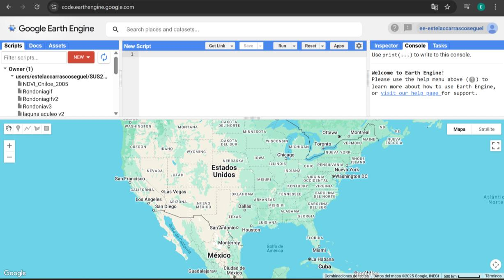{fig-align="center"}

**4.** Reconoce las partes de la interfaz:

-   **Panel izquierdo:**
    -   **Scripts** — lista de tus proyectos y scripts guardados. Desde aquí abres scripts anteriores o creas uno nuevo con el botón **NEW**.
    -   **Docs** — documentación de las funciones de GEE para JavaScript.
    -   **Assets** — recursos propios (rásters o shapefiles) que subas a la nube.
-   **Editor de código (centro–arriba)** — donde escribes tus scripts. El botón **RUN** ejecuta el código; **SAVE** lo guarda.
-   **Panel derecho:**
    -   **Inspector** — muestra valores de píxeles al hacer clic en el mapa.
    -   **Console** — imprime resultados cuando usas `print()`.
    -   **Tasks** — aparece cuando exportas datos; ahí confirmas las descargas.
-   **Visor de mapa (abajo)** — muestra las capas generadas con `Map.addLayer()`.

------------------------------------------------------------------------

## Paso 2 | Explorar la colección Landsat 5

**5.** Antes de programar, familiarízate con la colección que vas a usar. En la barra de búsqueda (parte superior) escribe `LANDSAT 5` y haz clic en el resultado **USGS Landsat 5 TM Collection 2 Tier 1 TOA Reflectance**.

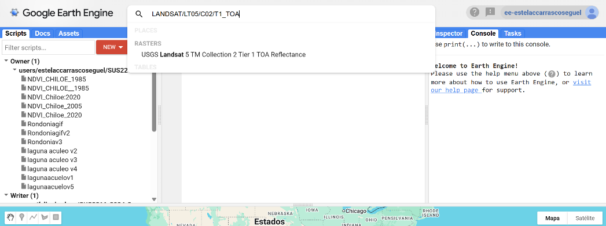{fig-align="center"}

**6.** Se abrirá una ventana con información de la colección. En la pestaña **Description** revisa la **disponibilidad temporal**: del **19 de abril de 1984** al **8 de noviembre de 2011**. Esto confirma que puedes trabajar con años como 1987 o 2007, **pero no con 2020** (para años recientes tendrías que usar Landsat 8/9 u otra colección).

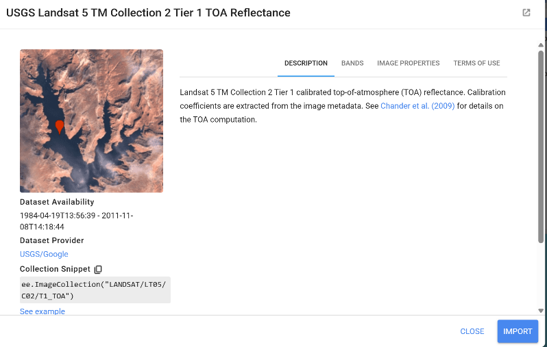{fig-align="center"}

**7.** En la pestaña **Bands** verás las bandas disponibles. Las principales para esta tarea:

| Banda | Nombre | Resolución | Longitud de onda (μm) | Uso típico |
|---|---|---|---|---|
| B1 | Blue | 30 m | 0.45 – 0.52 | Atmósfera / agua clara |
| B2 | Green | 30 m | 0.52 – 0.60 | Vegetación / agua turbia |
| B3 | Red | 30 m | 0.63 – 0.69 | NDVI (parte visible) |
| B4 | Near infrared | 30 m | 0.76 – 0.90 | NDVI (vegetación sana) |
| B5–B7 | SWIR | 30 m | — | Humedad, NBR, suelos |

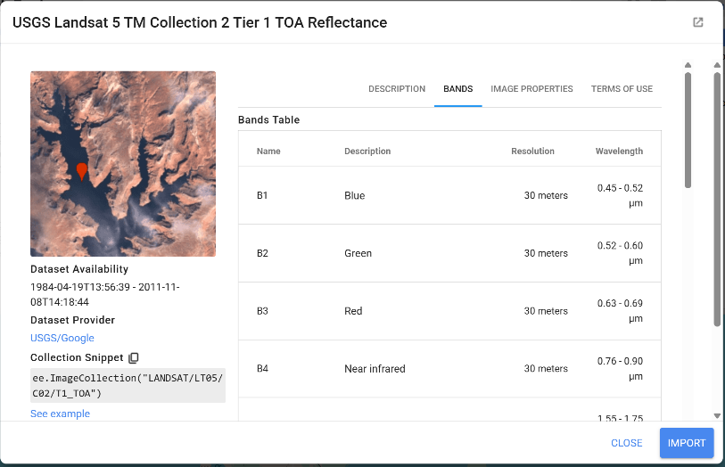{fig-align="center"}

**8.** En la pestaña **Image Properties** verás los metadatos que sirven para **filtrar** las imágenes. El más importante para nosotros es `CLOUD_COVER_LAND` (porcentaje de nubes sobre tierra), que usaremos para descartar imágenes muy nubladas.

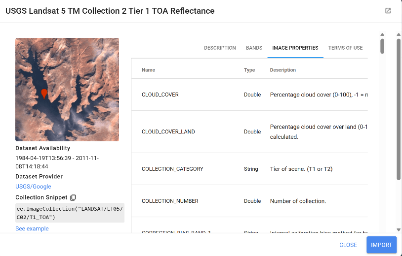{fig-align="center"}

Cuando termines de explorar, presiona **Close**.

------------------------------------------------------------------------

## Paso 3 | Crear el repositorio y el script

**9.** Crea un nuevo **repositorio**: presiona **New** (arriba a la izquierda) → **Repository**, ponle un nombre y haz clic en **Create**.

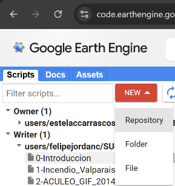{fig-align="center"}

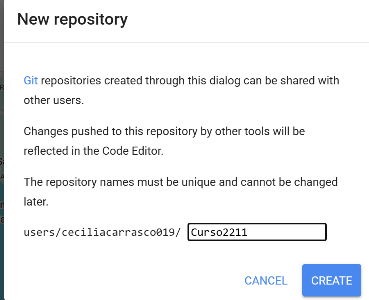{fig-align="center"}

**10.** Crea un nuevo **script**: presiona **New** → **File** y dale un nombre relacionado con tu zona y año, por ejemplo `NDVI_Chiloe_2007`.

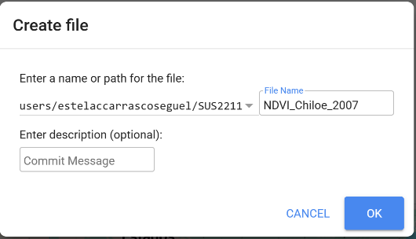{fig-align="center"}

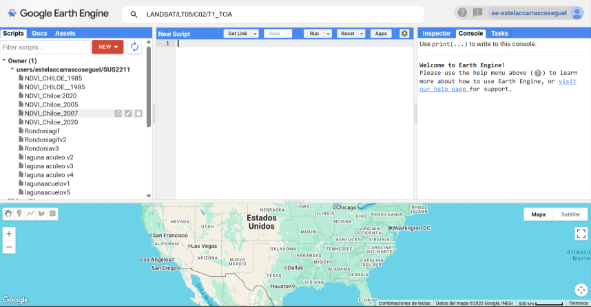{fig-align="center"}

------------------------------------------------------------------------

## Paso 4 | Definir el área de estudio (ROI)

**11.** Usaremos los límites administrativos de la **FAO (GAUL)** para definir el área de estudio. Primero, un bloque **exploratorio** para consultar los nombres exactos de las regiones (ADM1) y provincias (ADM2) de Chile. Pega este código, haz clic en **RUN** y revisa los nombres en la **Console**. Cambia `'Los Lagos'` por la región que elegiste.

```js
// Cargar límites administrativos de nivel 1 (regiones)
var admin1 = ee.FeatureCollection('FAO/GAUL/2015/level1');

// Lista de regiones en Chile
var chileRegions = admin1
  .filter(ee.Filter.eq('ADM0_NAME', 'Chile'))
  .distinct('ADM1_NAME')
  .aggregate_array('ADM1_NAME');

print('Available names for ADM1 in Chile:', chileRegions);

// Cargar límites administrativos de nivel 2 (provincias)
var admin2 = ee.FeatureCollection('FAO/GAUL/2015/level2');

// Lista de provincias dentro de Los Lagos
var chileProvinces = admin2
  .filter(ee.Filter.eq('ADM0_NAME', 'Chile'))
  .filter(ee.Filter.eq('ADM1_NAME', 'Los Lagos'))
  .distinct('ADM2_NAME')
  .aggregate_array('ADM2_NAME');

print('Available names for ADM2 in Los Lagos:', chileProvinces);
```

**12.** Ahora define el **ROI** (*Region of Interest*) filtrando por país, región y provincia. Cambia `'Los Lagos'` y `'Chiloe'` según el lugar que elegiste. Este `ROI` se usará en todos los pasos siguientes.

```js
// Seleccionar zona de trabajo
var admin2 = ee.FeatureCollection('FAO/GAUL/2015/level2');

var ROI = admin2.filter(ee.Filter.eq('ADM0_NAME', 'Chile'))
  .filter(ee.Filter.eq('ADM1_NAME', 'Los Lagos'))
  .filter(ee.Filter.eq('ADM2_NAME', 'Chiloe'))
  .geometry();
```

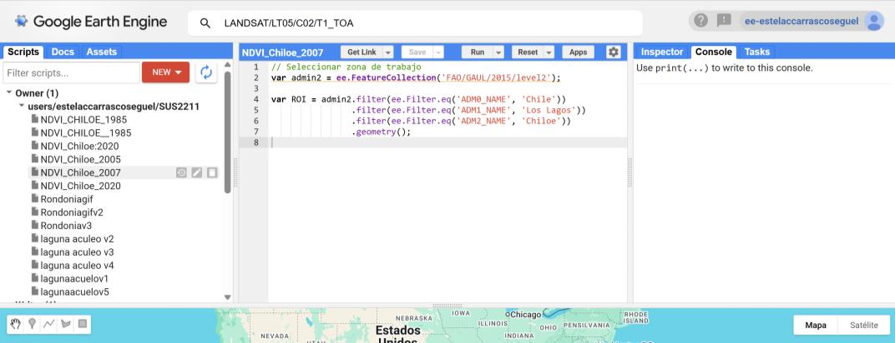{fig-align="center"}

------------------------------------------------------------------------

## Paso 5 | Enmascarar nubes y calcular NDVI

**13.** Definiremos dos funciones que aplicaremos a cada imagen de la colección:

-   **`maskL5(image)`** — elimina las zonas con nubes, sombras de nubes y bandas saturadas, usando máscaras basadas en los bits de calidad (`QA_PIXEL` y `QA_RADSAT`).
-   **`addNDVI(image)`** — calcula el NDVI y lo agrega como una nueva banda llamada `'NDVI'`.

Pega este código y haz clic en **RUN**:

```js
// Limpiar las imágenes (nubes, sombras, saturaciones) y agregar la banda NDVI
function maskL5(image) {
  var qa = image.select('QA_PIXEL');
  var radsat = image.select('QA_RADSAT');

  var bitFill = 1 << 0;    // Sin datos
  var bitCloud = 1 << 3;   // Nubes
  var bitShadow = 1 << 4;  // Sombras

  var cloudMask = qa.bitwiseAnd(bitFill).eq(0)
    .and(qa.bitwiseAnd(bitCloud).eq(0))
    .and(qa.bitwiseAnd(bitShadow).eq(0));

  var satMask = radsat.bitwiseAnd(1 << 0).eq(0)
    .and(radsat.bitwiseAnd(1 << 1).eq(0))
    .and(radsat.bitwiseAnd(1 << 2).eq(0));

  return image.updateMask(cloudMask).updateMask(satMask);
}

function addNDVI(image) {
  var ndvi = image.normalizedDifference(['B4', 'B3']).rename('NDVI');
  return image.addBands(ndvi);
}
```

{fig-align="center"}

::: {.callout-tip title="¿Cómo funcionan las máscaras de bits (BIT QA)?"}

Los productos satelitales guardan la **calidad de cada píxel** en un solo número que, escrito en **binario** (base 2), informa sobre distintos atributos (nube, sombra, nieve, etc.) en cada uno de sus *bits* (un bit es 0 o 1). Por ejemplo, el píxel `776` se escribe en 16 bits (lo que usa la banda `QA_PIXEL` de Landsat 5) como:

```
0000001100001000
```

Los bits se cuentan de derecha a izquierda partiendo del **bit 0**. Para extraer un bit específico (por ejemplo el **bit 3**, que indica "nube"), se genera un número binario que solo tiene un `1` en esa posición con la operación *left shift*:

```
1 << 3  =  1000
```

Luego se compara con el número del píxel **bit a bit** usando `bitwiseAnd`, que devuelve `1` solo donde **ambos** números tienen `1`. Si el resultado es **mayor que cero**, el píxel tiene esa propiedad (es nube) y se **enmascara**; si es cero, se conserva.

:::

------------------------------------------------------------------------

## Paso 6 | Construir el mosaico mediano

**14.** Definiremos la función `qualityMosaicRGB_L5(year)`, que construye un mosaico Landsat 5 para un año dado. La función:

-   Filtra imágenes del **año anterior y el posterior** (para 2007, usa 2006–2008).
-   Conserva solo imágenes con **menos del 10 % de nubes** sobre tierra.
-   Se limita al área del **ROI**.
-   Aplica `maskL5` y `addNDVI` a cada imagen.
-   Usa `.median()` para quedarse con el **valor mediano por píxel**, lo que descarta valores muy bajos (sombras) y muy altos (nubes), mejorando la calidad del mosaico.

```js
// mosaico con NDVI
function qualityMosaicRGB_L5(year) {
  var start = ee.Date.fromYMD(year - 1, 1, 1);
  var end = ee.Date.fromYMD(year + 1, 12, 31);

  var collection = ee.ImageCollection("LANDSAT/LT05/C02/T1_TOA")
    .filterDate(start, end)                          // año anterior y siguiente
    .filter(ee.Filter.lt('CLOUD_COVER_LAND', 10))    // menos de 10% de nubes
    .filterBounds(ROI)                               // solo imágenes sobre el ROI
    .map(maskL5)                                     // máscara de nubes y saturación
    .map(addNDVI);                                   // banda NDVI

  return collection.median().clip(ROI).toFloat();
}

var image = qualityMosaicRGB_L5(2007);
```

Haz clic en **RUN** para crear la variable `image`, que usaremos para visualizar y exportar.

------------------------------------------------------------------------

## Paso 7 | Visualizar el resultado en GEE

**15.** Ahora visualizaremos dos capas en el visor de GEE: la imagen en **color natural** (True Color, bandas B3-B2-B1) y el **NDVI** con una rampa de verdes. `Map.centerObject(ROI, 9)` centra el mapa en tu zona (ajusta el número para más o menos zoom).

```js
// Visualizar resultado en el visor de GEE
var visParams = {
  bands: ['B3', 'B2', 'B1'],
  min: 0,
  max: 0.3,
  gamma: 1.7
};

var ndviVisParams = {
  min: 0.1,
  max: 0.9,
  palette: ['ffffff', 'd9f0d3', 'a6dba0', '5aae61', '1b7837', '00441b']
};

Map.centerObject(ROI, 9);
Map.addLayer(image, visParams, "TRUE COLOR");
Map.addLayer(image.select('NDVI'), ndviVisParams, "NDVI");
```

Haz clic en **RUN**. Puedes activar o desactivar las capas desde la leyenda del visor.

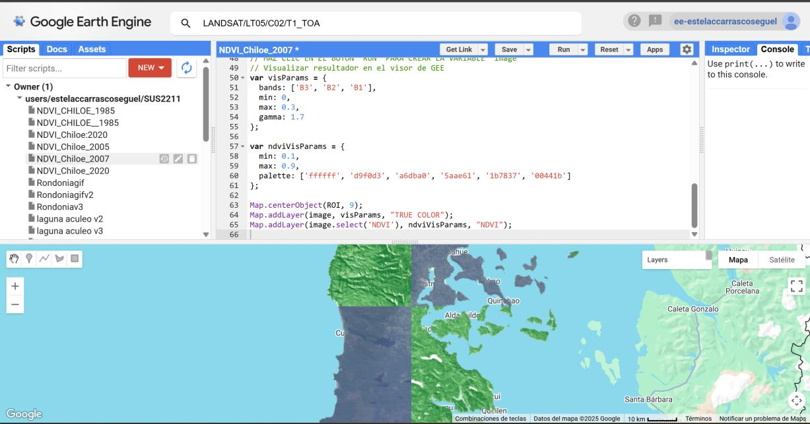{fig-align="center"}

------------------------------------------------------------------------

## Paso 8 | Exportar la imagen a Google Drive

**16.** Exportaremos el mosaico como GeoTIFF a tu Google Drive. Algunos parámetros clave:

-   `image.select(...)` — exportamos solo las bandas B1, B2, B3 y NDVI.
-   `folder` — la carpeta de tu Drive donde se guardará (créala como `GEE_downloads` o cambia el nombre).
-   `scale` — tamaño del píxel en metros: 30 es lo estándar para Landsat; usa **100** si tu área es muy grande y el archivo pesa demasiado.
-   `crs` — `EPSG:4326` (WGS 84), compatible con QGIS.

```js
// Exportar a Google Drive
Export.image.toDrive({
  image: image.select(["B1", "B2", "B3", "NDVI"]),
  description: 'Landsat_Export_2007',
  folder: 'GEE_downloads',
  fileNamePrefix: 'landsat_2007_roi',
  region: ROI,
  scale: 100,
  crs: 'EPSG:4326',
  maxPixels: 1e13
});
```

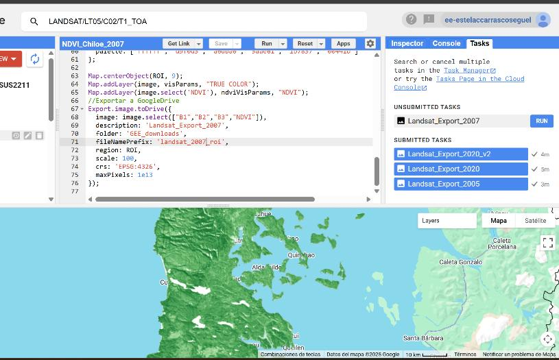{fig-align="center"}

**17.** Al hacer **RUN**, aparecerá una **tarea pendiente** en la pestaña **Tasks** (panel derecho). Haz clic en **Run** dentro de esa pestaña para confirmar.

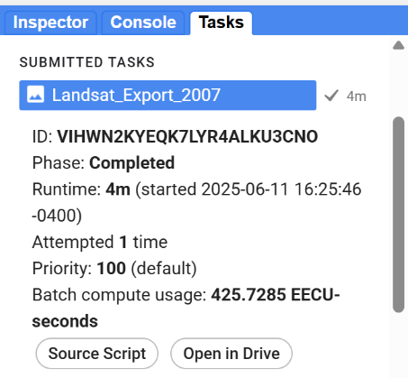{fig-align="center"}

**18.** Se abrirá una ventana de configuración. Verifica que el **CRS** sea `EPSG:4326`, el **File format** sea **GEO_TIFF** (compatible con QGIS) y el **Scale** sea el que elegiste. Haz clic en **RUN**. En unos minutos el archivo aparecerá en tu Google Drive; descárgalo a tu computador (a `datos/procesados/`).

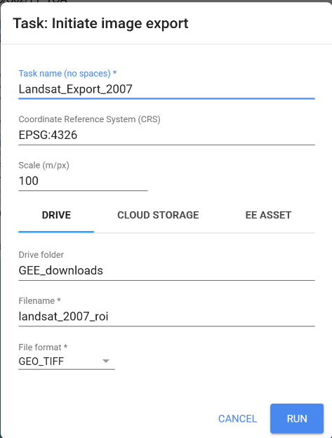{fig-align="center"}

------------------------------------------------------------------------

## Paso 9 | Visualizar el ráster en QGIS

**19.** Abre **QGIS** en tu computador y activa el mapa base **OSM**: panel `Navegador → XYZ Tiles → OpenStreetMap`. Guarda el proyecto de inmediato en `proyectos/` como `clase13.qgz`.

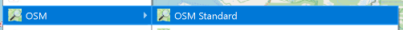{fig-align="center"}

**20.** Carga el `.tif` que descargaste: `Capa → Añadir capa → Añadir capa ráster`.

{fig-align="center"}

{fig-align="center"}

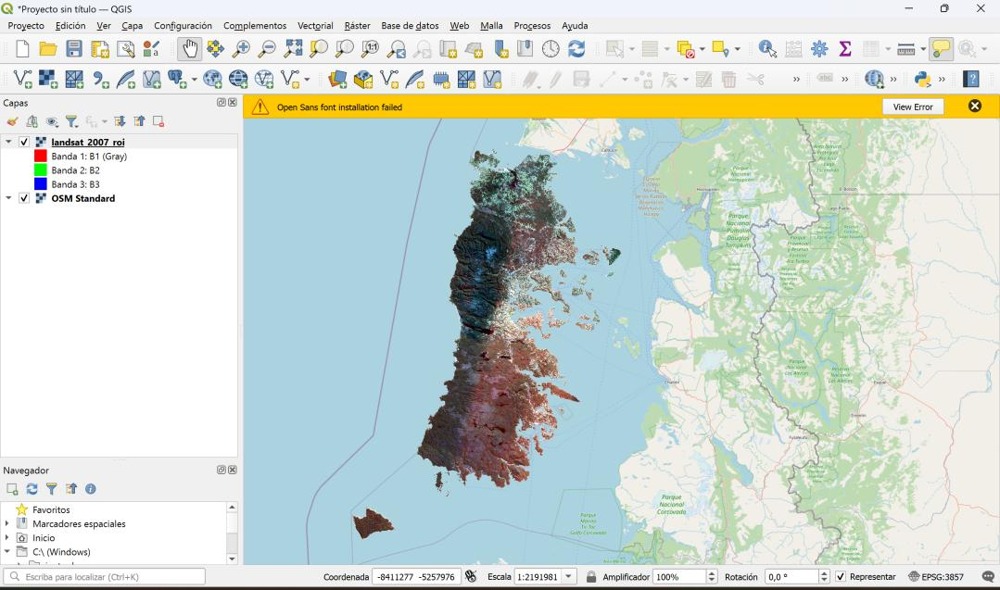{fig-align="center"}

------------------------------------------------------------------------

## Paso 10 | Repetir el proceso para el año 1987

**21.** Crea un **nuevo script** (**New → File**) llamado, por ejemplo, `NDVI_Chiloe_1987`. **Copia todo el código** del año 2007 y pégalo aquí.

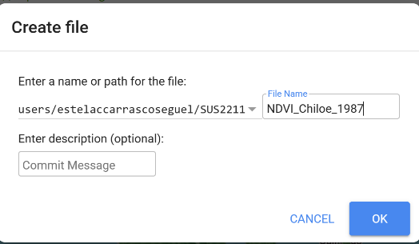{fig-align="center"}

**22.** Como Landsat 5 ya estaba activo en 1987, **no necesitas cambiar nada salvo el año**. Modifica estas líneas:

```js
// ANTES:
var image = qualityMosaicRGB_L5(2007);
// DESPUÉS:
var image = qualityMosaicRGB_L5(1987);
```

```js
// ANTES:
  description: 'Landsat_Export_2007',
  fileNamePrefix: 'landsat_2007_roi',
// DESPUÉS:
  description: 'Landsat_Export_1987',
  fileNamePrefix: 'landsat_1987_roi',
```

Ejecuta (**RUN**) y repite los pasos de visualización y exportación (pasos 7 y 8) para descargar el mosaico de 1987. Luego cárgalo también en QGIS.

::: callout-note
**Es normal** que en el mosaico de **1987** no se visualice por completo la parte norte del área de estudio (por ejemplo, zonas como Ancud o Carelmapu en Chiloé). En esos años la **cobertura satelital disponible era limitada**, y muchas imágenes solo capturaban parcialmente el territorio, dejando vacíos en el mosaico final.
:::

------------------------------------------------------------------------

## Paso 11 | Simbología True Color

**23.** Con ambas capas cargadas, configura el **color natural**. Haz clic derecho sobre la capa → `Propiedades → Simbología` y define:

-   **Tipo de renderizador:** Color de multibanda
-   **Banda roja:** Banda 3 · **Banda verde:** Banda 2 · **Banda azul:** Banda 1
-   **Mejora de contraste:** *Estirar a Min/Max*

Haz clic en **Aplicar** y **Aceptar**. Repite el proceso en **ambas** capas.

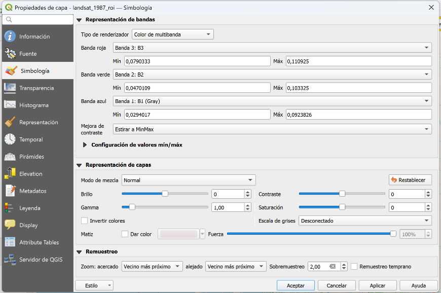{fig-align="center"}

------------------------------------------------------------------------

## Paso 12 | Simbología NDVI

**24.** Para visualizar el NDVI necesitas ver la **banda 4** por separado. **Duplica** cada capa (clic derecho → **Duplicar capa**) y renómbralas para distinguirlas (por ejemplo `landsat_2007:NDVI` y `landsat_1987:NDVI`).

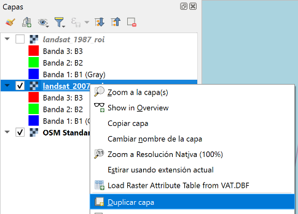{fig-align="center"}

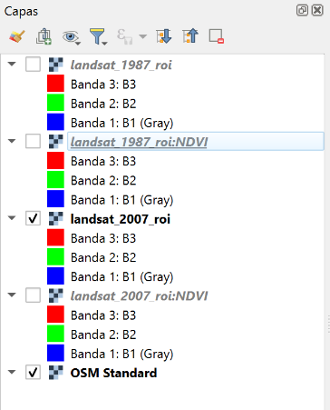{fig-align="center"}

**25.** En cada capa NDVI ve a `Propiedades → Simbología` y configura:

-   **Tipo de renderizador:** Pseudocolor monobanda
-   **Banda:** Banda 4: NDVI
-   En **Configuración de valores mín/máx**, selecciona **Acumulativo corte del conteo** con el rango **2,0 – 98,0**
-   **Rampa de color** a elección (los verdes funcionan bien para vegetación)

Haz clic en **Clasificar** y **Aceptar**. Repite en ambas capas NDVI.

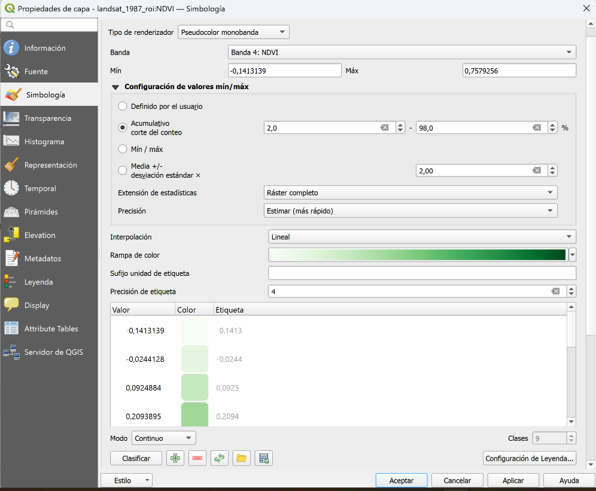{fig-align="center"}

::: {.callout-tip title="¿Por qué usar percentiles (2–98 %)?"}
Los valores mínimo y máximo determinan cómo se reparten los colores de la rampa. Si QGIS usa los valores **absolutos** más bajo y más alto, unos pocos píxeles atípicos (sombras, agua, errores de borde) "estiran" la escala y dejan el mapa **lavado**, sin detalle útil. El **percentil 2** (p2) es el valor por debajo del cual está el 2 % de los píxeles, y el **percentil 98** (p98), el 98 %. Recortar a ese rango descarta los extremos no representativos y realza el contraste de la mayoría de la imagen.
:::

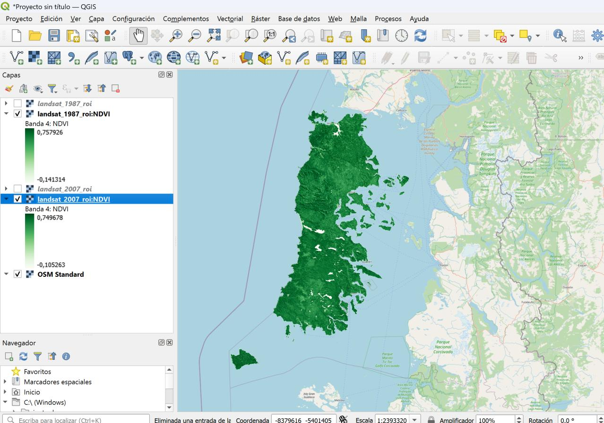{fig-align="center"}

------------------------------------------------------------------------

## Paso 13 | Composición comparativa

**26.** Abre el **Diseñador de impresión** y compón un layout que compare las dos décadas: los **cuatro mapas** (True Color 1987 y 2007, NDVI 1987 y 2007), como aprendiste en clases anteriores. Agrega título, leyenda, flecha norte y barra de escala. Exporta a `resultados/mapas/` como PDF o PNG.

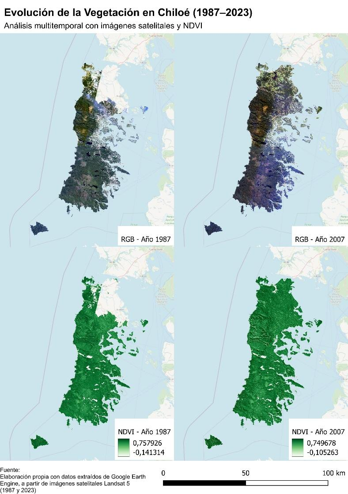{fig-align="center"}

------------------------------------------------------------------------

## ¡Listo! {.unnumbered .unlisted}

Has generado, procesado y exportado imágenes satelitales en la nube, y construido un mapa comparativo de la vegetación de tu territorio. **Recuerda guardar tu carpeta (incluida una copia de tus scripts de GEE) para utilizarla en tu próximo portafolio.**

::: callout-important
**Elige el caso de esta clase para tu portafolio** y construye una breve narrativa a partir de los mapas que produjiste. La reflexión debe centrarse en el **potencial de Google Earth Engine como herramienta de análisis territorial y ambiental**, considerando sus aplicaciones a distintas escalas y también sus limitaciones. Considera las siguientes preguntas guía:

1.  **Cambio en el paisaje.** Comparando el NDVI de 1987 y 2007 en tu territorio, ¿dónde aumentó y dónde disminuyó la vegetación? ¿Qué procesos (expansión urbana, agricultura, plantaciones forestales, recuperación de bosque) podrían explicar lo que observas?
2.  **Potencial de GEE.** Según Perilla y Mas (2020), el gran aporte de GEE es **procesar en la nube** grandes volúmenes de datos sin descargarlos. En tu experiencia con esta tarea, ¿qué habría sido inviable hacer en un SIG de escritorio como QGIS (por ejemplo, combinar todas las imágenes de varios años)? ¿A qué **escalas** te permite trabajar esta herramienta?
3.  **Limitaciones.** ¿Qué dificultades encontraste? Piensa en los **vacíos del mosaico de 1987** (cobertura satelital histórica), en la **resolución** de Landsat (30 m), en la dependencia de una **buena conexión a internet** y en lo que el NDVI **no** puede distinguir (por ejemplo, bosque nativo vs. plantación, ya que ambos pueden tener NDVI alto).
4.  **Decisiones de procesamiento.** Tomaste varias decisiones: el umbral de nubes (10 %), la ventana de ±1 año, el mosaico **mediano**, la escala de exportación. ¿Cómo podrían estas decisiones cambiar el resultado? ¿Qué pasaría si subieras el umbral de nubes o usaras una sola imagen en vez de la mediana?
5.  **Aplicaciones.** Más allá del NDVI, ¿qué otros problemas socioambientales de tu interés podrías abordar con GEE (deforestación, sequía, expansión urbana, incendios, retroceso de glaciares)? ¿Qué hace de esta una herramienta para una ciencia más **abierta y democrática**?
:::

::: callout-tip
**Sugerencia de extensión (opcional).** Si te interesa profundizar:

-   Agrega un **tercer año** (por ejemplo 1997) para construir una serie temporal y observar la tendencia.
-   Calcula la **diferencia de NDVI** entre 2007 y 1987 directamente en GEE (`image2007.select('NDVI').subtract(image1987.select('NDVI'))`) para mapear *dónde* cambió la vegetación.
-   Prueba con otra colección (Landsat 8 o Sentinel-2) para analizar un año reciente y compáralo con tu mapa histórico.
:::
